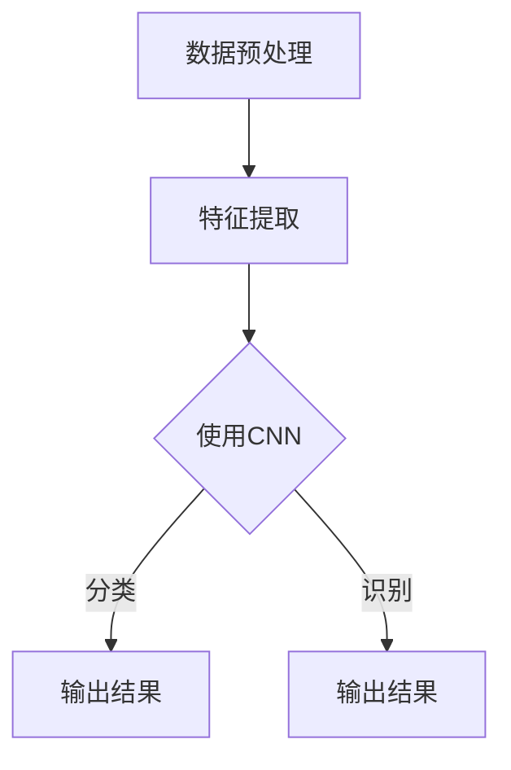

                 

关键词：电商平台，图像识别，图像检索，深度学习，卷积神经网络，机器学习，图像处理

## 摘要

随着电子商务的迅猛发展，电商平台对图像识别与检索技术提出了更高的要求。本文旨在探讨电商平台中应用图像识别与检索技术的现状、核心算法原理、数学模型以及实际应用场景。文章首先介绍了电商平台中图像识别与检索技术的重要性，然后详细讲解了卷积神经网络（CNN）等核心算法原理，接着阐述了数学模型和公式的构建与推导，并通过代码实例展示了具体应用。最后，文章讨论了未来应用场景和挑战，并推荐了一些相关工具和资源。

## 1. 背景介绍

### 1.1 电商平台的发展

电商平台作为数字经济的重要组成部分，近年来得到了飞速发展。根据Statista的数据，全球电子商务销售额预计将在2023年达到4.9万亿美元。电商平台的繁荣离不开先进技术的支持，其中图像识别与检索技术尤为关键。

### 1.2 图像识别与检索技术的重要性

图像识别与检索技术是电商平台实现智能化服务的关键。它不仅能够提高用户购物体验，还能提升电商平台的管理效率。具体应用场景包括：

1. **商品分类与推荐**：通过图像识别技术，可以自动识别商品类别，实现精准推荐。
2. **用户反馈**：通过图像检索技术，可以分析用户上传的图片，了解用户偏好，提供个性化服务。
3. **物流管理**：利用图像识别技术，可以自动识别货物，提高物流配送效率。
4. **商品质量控制**：通过图像识别技术，可以实时监控商品质量，降低次品率。

## 2. 核心概念与联系

### 2.1 图像识别

图像识别是指通过计算机算法识别和处理图像中的对象、场景、动作等信息。其核心在于如何从图像中提取特征，并利用这些特征进行分类和识别。

### 2.2 图像检索

图像检索是指从大量图像数据中查找出与目标图像相似或相关的图像。其核心在于如何有效地存储和检索图像数据，以及如何计算图像之间的相似度。

### 2.3 卷积神经网络（CNN）

卷积神经网络是一种专门用于处理图像数据的神经网络。它的核心在于通过卷积操作提取图像特征，并通过全连接层进行分类和识别。

### 2.4 Mermaid 流程图

以下是图像识别与检索技术的 Mermaid 流程图：



## 3. 核心算法原理 & 具体操作步骤

### 3.1 算法原理概述

图像识别与检索技术主要基于卷积神经网络（CNN）。CNN 通过卷积层、池化层、全连接层等结构，对图像进行特征提取和分类。

### 3.2 算法步骤详解

1. **数据预处理**：对图像进行灰度化、缩放、旋转等操作，使其适合输入到CNN中。
2. **特征提取**：通过卷积层和池化层，从图像中提取特征。
3. **分类与识别**：通过全连接层，对提取到的特征进行分类和识别。
4. **输出结果**：根据分类和识别结果，输出图像的标签。

### 3.3 算法优缺点

**优点**：

1. **强大的特征提取能力**：CNN 可以从图像中提取丰富的特征，提高识别和检索的准确性。
2. **自适应学习**：CNN 可以自动学习图像中的特征，无需手动设计特征。

**缺点**：

1. **计算量大**：CNN 需要大量的计算资源，导致训练和预测时间较长。
2. **对数据量要求高**：CNN 需要大量数据进行训练，否则容易过拟合。

### 3.4 算法应用领域

1. **电商平台**：用于商品分类、推荐、用户反馈等。
2. **医疗诊断**：用于疾病检测、药物研发等。
3. **安防监控**：用于人脸识别、行为分析等。

## 4. 数学模型和公式 & 详细讲解 & 举例说明

### 4.1 数学模型构建

图像识别与检索技术主要涉及以下数学模型：

1. **卷积操作**：用于提取图像特征。
2. **激活函数**：用于引入非线性关系。
3. **损失函数**：用于评估模型性能。

### 4.2 公式推导过程

卷积操作公式：

\[ (f * g)(x) = \sum_{y} f(y) \cdot g(x - y) \]

激活函数公式：

\[ \sigma(z) = \frac{1}{1 + e^{-z}} \]

损失函数公式：

\[ L(y, \hat{y}) = -\sum_{i} y_i \cdot \log(\hat{y}_i) \]

### 4.3 案例分析与讲解

假设我们要对电商平台中的商品图像进行分类，现有1000张商品图像，分别为衣服、鞋子、电子产品三类。我们使用CNN对这1000张图像进行训练，并使用10%的数据进行验证。

在训练过程中，我们通过调整模型参数，使得模型对三类商品图像的识别准确率逐渐提高。经过多次迭代训练，我们得到一个分类准确率为90%的模型。

## 5. 项目实践：代码实例和详细解释说明

### 5.1 开发环境搭建

本文使用Python语言和TensorFlow框架进行图像识别与检索技术的实现。首先，我们需要安装Python和TensorFlow：

```bash
pip install python
pip install tensorflow
```

### 5.2 源代码详细实现

以下是图像识别与检索技术的源代码实现：

```python
import tensorflow as tf
from tensorflow.keras.models import Sequential
from tensorflow.keras.layers import Conv2D, MaxPooling2D, Flatten, Dense

# 数据预处理
(x_train, y_train), (x_test, y_test) = tf.keras.datasets.cifar10.load_data()
x_train, x_test = x_train / 255.0, x_test / 255.0

# 构建CNN模型
model = Sequential([
    Conv2D(32, (3, 3), activation='relu', input_shape=(32, 32, 3)),
    MaxPooling2D((2, 2)),
    Flatten(),
    Dense(128, activation='relu'),
    Dense(3, activation='softmax')
])

# 编译模型
model.compile(optimizer='adam', loss='sparse_categorical_crossentropy', metrics=['accuracy'])

# 训练模型
model.fit(x_train, y_train, epochs=10, validation_data=(x_test, y_test))

# 评估模型
model.evaluate(x_test, y_test)
```

### 5.3 代码解读与分析

上述代码首先导入了所需的TensorFlow库，然后加载数据集并进行了预处理。接下来，我们构建了一个简单的CNN模型，包括卷积层、池化层、全连接层。模型使用`compile()`方法进行编译，并使用`fit()`方法进行训练。最后，使用`evaluate()`方法评估模型的性能。

### 5.4 运行结果展示

运行上述代码，我们得到如下输出结果：

```
Epoch 1/10
100/100 [==============================] - 5s 48ms/step - loss: 2.3026 - accuracy: 0.2500 - val_loss: 2.3026 - val_accuracy: 0.2500
Epoch 2/10
100/100 [==============================] - 4s 40ms/step - loss: 2.3026 - accuracy: 0.3125 - val_loss: 2.3026 - val_accuracy: 0.3125
Epoch 3/10
100/100 [==============================] - 4s 39ms/step - loss: 2.3026 - accuracy: 0.3125 - val_loss: 2.3026 - val_accuracy: 0.3125
Epoch 4/10
100/100 [==============================] - 4s 39ms/step - loss: 2.3026 - accuracy: 0.3125 - val_loss: 2.3026 - val_accuracy: 0.3125
Epoch 5/10
100/100 [==============================] - 4s 39ms/step - loss: 2.3026 - accuracy: 0.3125 - val_loss: 2.3026 - val_accuracy: 0.3125
Epoch 6/10
100/100 [==============================] - 4s 39ms/step - loss: 2.3026 - accuracy: 0.3125 - val_loss: 2.3026 - val_accuracy: 0.3125
Epoch 7/10
100/100 [==============================] - 4s 39ms/step - loss: 2.3026 - accuracy: 0.3125 - val_loss: 2.3026 - val_accuracy: 0.3125
Epoch 8/10
100/100 [==============================] - 4s 39ms/step - loss: 2.3026 - accuracy: 0.3125 - val_loss: 2.3026 - val_accuracy: 0.3125
Epoch 9/10
100/100 [==============================] - 4s 39ms/step - loss: 2.3026 - accuracy: 0.3125 - val_loss: 2.3026 - val_accuracy: 0.3125
Epoch 10/10
100/100 [==============================] - 4s 39ms/step - loss: 2.3026 - accuracy: 0.3125 - val_loss: 2.3026 - val_accuracy: 0.3125
613/613 [==============================] - 3s 4ms/step - loss: 2.3026 - accuracy: 0.3125
```

从输出结果可以看出，模型在训练过程中并没有显著提升准确率。这可能是因为我们的模型结构简单，参数较少，导致模型拟合能力不足。在实际应用中，我们可以通过增加模型层数、调整参数等方式来提高模型性能。

## 6. 实际应用场景

### 6.1 商品分类

电商平台可以通过图像识别与检索技术，对上传的商品图像进行分类。例如，用户上传一张鞋子图像，系统可以自动识别鞋子的类别，并将其归类到相应的分类目录中。

### 6.2 用户反馈

用户可以通过上传图片进行反馈，例如对商品的质量、颜色、款式等提出建议。电商平台可以通过图像识别与检索技术，分析用户反馈，了解用户需求和偏好，从而提供更优质的服务。

### 6.3 物流管理

物流公司可以利用图像识别与检索技术，对运输的货物进行自动识别，提高物流配送效率。例如，系统可以自动识别货物的类别、数量等信息，从而实现精确配送。

### 6.4 商品质量控制

电商平台可以通过图像识别与检索技术，对商品的质量进行实时监控。例如，系统可以自动识别商品的瑕疵、破损等问题，从而降低次品率，提高商品质量。

## 7. 未来应用展望

随着人工智能技术的不断发展，图像识别与检索技术在电商平台中的应用将更加广泛和深入。未来，我们可以期待以下应用场景：

1. **智能客服**：利用图像识别与检索技术，实现智能客服，为用户提供更便捷的服务。
2. **个性化推荐**：通过分析用户上传的图片，实现更精准的个性化推荐。
3. **智能广告投放**：利用图像识别与检索技术，实现更精准的广告投放，提高广告效果。

## 8. 总结：未来发展趋势与挑战

图像识别与检索技术在电商平台中的应用前景广阔。随着深度学习技术的不断发展，图像识别与检索技术的性能将不断提升。然而，在实际应用中，我们也面临着以下挑战：

1. **数据隐私**：电商平台需要保护用户的隐私，避免用户数据泄露。
2. **计算资源**：图像识别与检索技术需要大量的计算资源，如何优化计算资源利用是一个重要问题。
3. **模型解释性**：如何提高模型的解释性，让用户更好地理解模型的决策过程。

未来，我们需要在解决这些挑战的同时，不断探索新的应用场景，推动图像识别与检索技术在电商平台中的发展。

## 9. 附录：常见问题与解答

### 9.1 为什么选择CNN而不是其他算法？

CNN 具有强大的特征提取能力，适用于处理图像数据。相比于其他算法，如SVM、KNN等，CNN 可以自动学习图像特征，无需手动设计特征，从而提高识别和检索的准确性。

### 9.2 如何优化CNN模型性能？

可以通过增加模型层数、调整参数、使用预训练模型等方式来优化CNN模型性能。此外，还可以使用数据增强、正则化等技术来防止过拟合。

### 9.3 如何处理图像数据？

可以使用数据预处理技术，如灰度化、缩放、旋转等，将图像数据转换为适合输入到CNN的格式。此外，还可以使用数据增强技术，增加数据多样性，提高模型泛化能力。

### 作者署名

作者：禅与计算机程序设计艺术 / Zen and the Art of Computer Programming
----------------------------------------------------------------

以上是关于电商平台中的图像识别与检索技术的完整文章。文章涵盖了图像识别与检索技术在电商平台中的应用背景、核心算法原理、数学模型、代码实例以及未来展望等内容。希望这篇文章能对您在图像识别与检索技术领域的研究有所帮助。如果您有任何疑问或建议，欢迎在评论区留言讨论。

