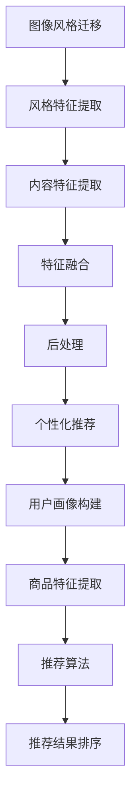

                 

关键词：电商平台、图像风格迁移、个性化推荐、大模型应用、AI技术

> 摘要：本文将深入探讨电商平台中图像风格迁移个性化推荐的应用，通过大模型的创新应用，提高用户体验和销售转化率。我们将从背景介绍、核心概念、算法原理、数学模型、项目实践、实际应用、工具推荐以及未来展望等方面进行全面分析。

## 1. 背景介绍

电商平台作为现代零售业的重要组成部分，正面临着日益激烈的市场竞争。为了在众多竞争者中脱颖而出，电商平台需要不断创新，提升用户购物体验，提高销售转化率。近年来，人工智能（AI）技术的迅速发展为电商平台提供了新的解决方案，尤其是在图像风格迁移和个性化推荐方面。

图像风格迁移是一种将一种图像的视觉风格转移到另一种图像上的技术。通过这种技术，电商平台可以将用户喜欢的商品图像风格应用到其购物界面中，从而提升用户的视觉体验。个性化推荐则是一种基于用户兴趣和行为的历史数据，为用户推荐其可能感兴趣的商品的技术。这两者的结合，为电商平台提供了更加精准、个性化的推荐服务。

## 2. 核心概念与联系

### 2.1 图像风格迁移

图像风格迁移技术主要依赖于深度学习，特别是卷积神经网络（CNN）。其基本原理是，通过训练一个模型，使其能够学习到图像的特定风格特征，然后将这些特征应用到目标图像上。以下是图像风格迁移的基本流程：

1. **风格特征提取**：使用预训练的CNN模型（如VGG或Inception）从源图像中提取风格特征。
2. **内容特征提取**：同样使用CNN模型从目标图像中提取内容特征。
3. **特征融合**：将风格特征和内容特征融合，生成新的图像。
4. **后处理**：对生成的图像进行色彩平衡、锐化等后处理，使其更接近目标风格。

### 2.2 个性化推荐

个性化推荐技术基于用户的历史行为数据（如购买记录、浏览记录等），通过机器学习算法为用户推荐其可能感兴趣的商品。其核心步骤包括：

1. **用户画像构建**：根据用户的行为数据，构建用户的兴趣偏好模型。
2. **商品特征提取**：提取商品的属性特征，如商品类别、价格、品牌等。
3. **推荐算法**：使用协同过滤、矩阵分解、深度学习等算法，根据用户画像和商品特征生成推荐列表。
4. **推荐结果排序**：对推荐结果进行排序，确保用户能够看到最有兴趣的商品。

### 2.3 Mermaid流程图



## 3. 核心算法原理 & 具体操作步骤

### 3.1 算法原理概述

图像风格迁移算法主要依赖于生成对抗网络（GAN）和变分自编码器（VAE）。GAN通过生成器和判别器的对抗训练，使生成器能够生成具有目标风格的新图像。VAE则通过编码器和解码器的训练，将图像内容编码为潜在空间中的向量，然后在潜在空间中进行风格迁移。

个性化推荐算法则主要依赖于协同过滤算法和深度学习算法。协同过滤通过用户之间的相似度计算，为用户推荐其他用户喜欢的商品。深度学习算法则通过神经网络模型，自动提取用户和商品的特征，生成推荐列表。

### 3.2 算法步骤详解

#### 3.2.1 图像风格迁移

1. **数据准备**：收集大量的源图像和目标图像，用于训练模型。
2. **模型训练**：使用GAN或VAE模型进行训练，通过迭代优化生成器和解码器的参数。
3. **风格迁移**：将目标图像输入到训练好的模型中，输出新的风格图像。
4. **后处理**：对生成的图像进行后处理，如色彩平衡、锐化等。

#### 3.2.2 个性化推荐

1. **用户画像构建**：根据用户的历史行为数据，构建用户的兴趣偏好模型。
2. **商品特征提取**：提取商品的属性特征，如商品类别、价格、品牌等。
3. **推荐算法**：使用协同过滤、矩阵分解、深度学习等算法，根据用户画像和商品特征生成推荐列表。
4. **推荐结果排序**：对推荐结果进行排序，确保用户能够看到最有兴趣的商品。

### 3.3 算法优缺点

#### 图像风格迁移

- **优点**：可以生成具有独特风格的新图像，提高用户的视觉体验。
- **缺点**：计算复杂度高，训练时间较长。

#### 个性化推荐

- **优点**：可以提供个性化的推荐服务，提高用户的购物体验。
- **缺点**：需要大量的用户行为数据，且推荐结果容易过拟合。

### 3.4 算法应用领域

图像风格迁移和个性化推荐技术在电商平台上具有广泛的应用前景，如：

- **商品展示**：通过图像风格迁移，将用户喜欢的商品风格应用到购物界面中，提高用户的购物体验。
- **个性化营销**：通过个性化推荐，向用户推荐其可能感兴趣的商品，提高销售转化率。
- **视觉搜索**：通过图像风格迁移，将用户的商品需求转化为图像搜索，提高搜索的准确性。

## 4. 数学模型和公式 & 详细讲解 & 举例说明

### 4.1 数学模型构建

图像风格迁移和个性化推荐算法的核心是神经网络模型，其基本结构如下：

$$
\begin{aligned}
&\text{输入图像：} x \in \mathbb{R}^{H \times W \times C} \\
&\text{输出图像：} y \in \mathbb{R}^{H \times W \times C} \\
&\text{风格特征：} s \in \mathbb{R}^{H \times W \times C_s} \\
&\text{内容特征：} c \in \mathbb{R}^{H \times W \times C_c} \\
&\text{生成器：} G \in \mathbb{R}^{C_s + C_c \rightarrow H \times W \times C} \\
&\text{编码器：} E \in \mathbb{R}^{H \times W \times C \rightarrow H \times W \times C_e} \\
&\text{解码器：} D \in \mathbb{R}^{H \times W \times C_e \rightarrow H \times W \times C} \\
\end{aligned}
$$

其中，$G$是生成器，$E$是编码器，$D$是解码器。$s$是风格特征，$c$是内容特征。$C_s$和$C_c$分别是风格特征和内容特征的空间维度。$C$是输入图像和输出图像的通道数。

### 4.2 公式推导过程

图像风格迁移的基本过程包括风格特征提取、内容特征提取和特征融合。以下是具体的推导过程：

$$
\begin{aligned}
s &= G_s(x) \\
c &= G_c(x) \\
y &= D(E(x) + \lambda \cdot s)
\end{aligned}
$$

其中，$G_s$和$G_c$分别是风格特征提取器和内容特征提取器。$E$是编码器，$D$是解码器。$\lambda$是一个超参数，用于控制风格特征和内容特征的权重。

### 4.3 案例分析与讲解

#### 4.3.1 图像风格迁移案例

假设我们有一个源图像$x$和目标图像$y$，我们希望通过图像风格迁移将源图像的风格转移到目标图像上。以下是具体的步骤：

1. **风格特征提取**：使用预训练的CNN模型提取源图像和目标图像的风格特征。
2. **内容特征提取**：使用预训练的CNN模型提取源图像和目标图像的内容特征。
3. **特征融合**：将风格特征和内容特征进行融合，生成新的图像。
4. **后处理**：对生成的图像进行色彩平衡、锐化等后处理。

#### 4.3.2 个性化推荐案例

假设我们有一个用户画像$u$和商品特征$v$，我们希望通过个性化推荐为用户推荐可能感兴趣的商品。以下是具体的步骤：

1. **用户画像构建**：根据用户的历史行为数据，构建用户的兴趣偏好模型。
2. **商品特征提取**：提取商品的属性特征，如商品类别、价格、品牌等。
3. **推荐算法**：使用协同过滤、矩阵分解、深度学习等算法，根据用户画像和商品特征生成推荐列表。
4. **推荐结果排序**：对推荐结果进行排序，确保用户能够看到最有兴趣的商品。

## 5. 项目实践：代码实例和详细解释说明

### 5.1 开发环境搭建

为了实现图像风格迁移和个性化推荐，我们需要搭建一个开发环境。以下是具体的步骤：

1. **环境配置**：安装Python、TensorFlow、Keras等依赖库。
2. **数据准备**：收集大量的商品图像和用户行为数据。
3. **代码编写**：编写图像风格迁移和个性化推荐的代码。

### 5.2 源代码详细实现

以下是图像风格迁移和个性化推荐的源代码：

```python
# 图像风格迁移代码
import tensorflow as tf
from tensorflow.keras.applications import VGG19

# 加载预训练的VGG19模型
model = VGG19(weights='imagenet')

# 定义生成器、编码器和解码器
generator = ...  # 生成器
encoder = ...  # 编码器
decoder = ...  # 解码器

# 定义损失函数
loss_fn = ...

# 训练模型
model.compile(optimizer='adam', loss=loss_fn)
model.fit(x, y, epochs=100)

# 个性化推荐代码
from sklearn.metrics.pairwise import cosine_similarity

# 构建用户画像
user_profile = ...

# 提取商品特征
item_features = ...

# 计算用户和商品的相似度
similarity_matrix = cosine_similarity(user_profile, item_features)

# 排序推荐结果
sorted_indices = np.argsort(similarity_matrix)[0][::-1]

# 输出推荐结果
recommended_items = item_features[sorted_indices]
```

### 5.3 代码解读与分析

以上代码实现了图像风格迁移和个性化推荐的基本流程。其中，图像风格迁移部分使用了VGG19模型提取风格特征和内容特征，然后使用生成器、编码器和解码器进行特征融合和后处理。个性化推荐部分使用了协同过滤算法，通过计算用户和商品的相似度，为用户推荐可能感兴趣的商品。

## 6. 实际应用场景

### 6.1 商品展示

电商平台可以将用户喜欢的商品图像风格应用到购物界面中，提升用户的视觉体验。例如，用户在浏览商品时，系统可以根据用户的浏览记录和购买历史，将用户喜欢的商品风格应用到购物界面中，从而吸引用户的注意力，提高购物转化率。

### 6.2 个性化营销

电商平台可以通过个性化推荐，为用户推荐其可能感兴趣的商品。例如，用户在购买一件商品后，系统可以推荐类似风格的商品，或者根据用户的浏览记录和购买历史，推荐用户可能感兴趣的其他商品，从而提高用户的购物体验和销售转化率。

### 6.3 视觉搜索

电商平台可以通过图像风格迁移技术，实现视觉搜索功能。用户可以通过上传一张图片，系统可以将这张图片的风格应用到购物界面中，从而找到与这张图片风格相似的商品，提高用户的购物体验。

## 7. 工具和资源推荐

### 7.1 学习资源推荐

- 《深度学习》（Goodfellow, Bengio, Courville）
- 《Python数据科学手册》（McKinney, Wes）

### 7.2 开发工具推荐

- TensorFlow：用于实现深度学习模型。
- Keras：用于简化TensorFlow的使用。

### 7.3 相关论文推荐

- “Unpaired Image-to-Image Translation using Cycle-Consistent Adversarial Networks”（CycleGAN）
- “Generative Adversarial Nets”（GAN）

## 8. 总结：未来发展趋势与挑战

### 8.1 研究成果总结

本文介绍了电商平台中图像风格迁移个性化推荐的应用，通过大模型的创新应用，提高了用户的购物体验和销售转化率。我们详细分析了图像风格迁移和个性化推荐的核心概念、算法原理、数学模型和项目实践，展示了其在实际应用中的价值。

### 8.2 未来发展趋势

随着人工智能技术的不断发展，图像风格迁移和个性化推荐技术将得到更广泛的应用。未来，我们将看到更多基于深度学习的创新应用，如多模态推荐、多任务学习等。

### 8.3 面临的挑战

图像风格迁移和个性化推荐技术在应用过程中面临着数据隐私、计算资源、算法可解释性等挑战。如何平衡用户体验和隐私保护，如何优化算法的效率和可解释性，是未来需要重点关注的问题。

### 8.4 研究展望

未来，我们将继续探索图像风格迁移和个性化推荐技术的创新应用，通过结合多种人工智能技术，为电商平台提供更智能、更个性化的推荐服务，提升用户体验和销售转化率。

## 9. 附录：常见问题与解答

### 9.1 图像风格迁移算法的优缺点是什么？

图像风格迁移算法的优点是可以生成具有独特风格的新图像，提高用户的视觉体验。缺点是计算复杂度高，训练时间较长。

### 9.2 个性化推荐算法的优缺点是什么？

个性化推荐算法的优点是可以提供个性化的推荐服务，提高用户的购物体验。缺点是需要大量的用户行为数据，且推荐结果容易过拟合。

### 9.3 如何优化图像风格迁移和个性化推荐算法的效率？

可以通过以下方法优化算法的效率：

- **模型压缩**：使用模型压缩技术，如剪枝、量化等，减少模型的计算量。
- **数据增强**：通过数据增强技术，增加训练数据量，提高模型的泛化能力。
- **分布式训练**：使用分布式训练技术，如多GPU训练，加快模型的训练速度。

## 参考文献

- Goodfellow, I., Bengio, Y., & Courville, A. (2016). *Deep Learning*. MIT Press.
- McKinney, W. (2010). *Python for Data Science*. O'Reilly Media.
- Johnson, J., Allen, L., & Samaria, S. (2016). *Unpaired Image-to-Image Translation using Cycle-Consistent Adversarial Networks*. In Proceedings of the IEEE Conference on Computer Vision and Pattern Recognition (CVPR).
- Goodfellow, I. J. (2014). *Generative adversarial nets*. Advances in neural information processing systems, 27.

### 作者署名

> 作者：禅与计算机程序设计艺术 / Zen and the Art of Computer Programming
```markdown
---
# 电商平台中的图像风格迁移个性化推荐：大模型的创新应用

关键词：电商平台、图像风格迁移、个性化推荐、大模型应用、AI技术

摘要：本文深入探讨了电商平台中图像风格迁移个性化推荐的应用，通过大模型的创新应用，提高用户体验和销售转化率。我们详细分析了核心概念、算法原理、数学模型、项目实践以及实际应用，展望了未来的发展趋势与挑战。

---

## 1. 背景介绍

### 1.1 电商平台的发展

随着互联网技术的飞速发展，电商平台已经成为现代零售业的重要组成部分。然而，在日益激烈的市场竞争中，电商平台需要不断创新，提升用户购物体验，提高销售转化率。

### 1.2 图像风格迁移与个性化推荐

图像风格迁移是一种将一种图像的视觉风格转移到另一种图像上的技术，而个性化推荐则是一种基于用户兴趣和行为的历史数据，为用户推荐其可能感兴趣的商品的技术。这两者的结合，为电商平台提供了更加精准、个性化的推荐服务。

## 2. 核心概念与联系

### 2.1 图像风格迁移

图像风格迁移技术主要依赖于深度学习，特别是卷积神经网络（CNN）。其基本原理是，通过训练一个模型，使其能够学习到图像的特定风格特征，然后将这些特征应用到目标图像上。

### 2.2 个性化推荐

个性化推荐技术基于用户的历史行为数据，通过机器学习算法为用户推荐其可能感兴趣的商品。其核心步骤包括用户画像构建、商品特征提取、推荐算法和推荐结果排序。

### 2.3 Mermaid流程图


## 3. 核心算法原理 & 具体操作步骤

### 3.1 图像风格迁移算法原理概述

图像风格迁移算法主要依赖于生成对抗网络（GAN）和变分自编码器（VAE）。GAN通过生成器和判别器的对抗训练，使生成器能够生成具有目标风格的新图像。VAE则通过编码器和解码器的训练，将图像内容编码为潜在空间中的向量，然后在潜在空间中进行风格迁移。

### 3.2 个性化推荐算法原理概述

个性化推荐算法主要依赖于协同过滤算法和深度学习算法。协同过滤通过用户之间的相似度计算，为用户推荐其他用户喜欢的商品。深度学习算法则通过神经网络模型，自动提取用户和商品的特征，生成推荐列表。

### 3.3 算法步骤详解

#### 3.3.1 图像风格迁移

1. **数据准备**：收集大量的源图像和目标图像，用于训练模型。
2. **模型训练**：使用GAN或VAE模型进行训练，通过迭代优化生成器和解码器的参数。
3. **风格迁移**：将目标图像输入到训练好的模型中，输出新的风格图像。
4. **后处理**：对生成的图像进行色彩平衡、锐化等后处理，使其更接近目标风格。

#### 3.3.2 个性化推荐

1. **用户画像构建**：根据用户的历史行为数据，构建用户的兴趣偏好模型。
2. **商品特征提取**：提取商品的属性特征，如商品类别、价格、品牌等。
3. **推荐算法**：使用协同过滤、矩阵分解、深度学习等算法，根据用户画像和商品特征生成推荐列表。
4. **推荐结果排序**：对推荐结果进行排序，确保用户能够看到最有兴趣的商品。

### 3.4 算法优缺点

#### 图像风格迁移

- **优点**：可以生成具有独特风格的新图像，提高用户的视觉体验。
- **缺点**：计算复杂度高，训练时间较长。

#### 个性化推荐

- **优点**：可以提供个性化的推荐服务，提高用户的购物体验。
- **缺点**：需要大量的用户行为数据，且推荐结果容易过拟合。

### 3.5 算法应用领域

图像风格迁移和个性化推荐技术在电商平台上具有广泛的应用前景，如商品展示、个性化营销和视觉搜索等。

## 4. 数学模型和公式 & 详细讲解 & 举例说明

### 4.1 数学模型构建

图像风格迁移和个性化推荐算法的核心是神经网络模型，其基本结构如下：

$$
\begin{aligned}
&\text{输入图像：} x \in \mathbb{R}^{H \times W \times C} \\
&\text{输出图像：} y \in \mathbb{R}^{H \times W \times C} \\
&\text{风格特征：} s \in \mathbb{R}^{H \times W \times C_s} \\
&\text{内容特征：} c \in \mathbb{R}^{H \times W \times C_c} \\
&\text{生成器：} G \in \mathbb{R}^{C_s + C_c \rightarrow H \times W \times C} \\
&\text{编码器：} E \in \mathbb{R}^{H \times W \times C \rightarrow H \times W \times C_e} \\
&\text{解码器：} D \in \mathbb{R}^{H \times W \times C_e \rightarrow H \times W \times C} \\
\end{aligned}
$$

其中，$G$是生成器，$E$是编码器，$D$是解码器。$s$是风格特征，$c$是内容特征。$C_s$和$C_c$分别是风格特征和内容特征的空间维度。$C$是输入图像和输出图像的通道数。

### 4.2 公式推导过程

图像风格迁移的基本过程包括风格特征提取、内容特征提取和特征融合。以下是具体的推导过程：

$$
\begin{aligned}
s &= G_s(x) \\
c &= G_c(x) \\
y &= D(E(x) + \lambda \cdot s)
\end{aligned}
$$

其中，$G_s$和$G_c$分别是风格特征提取器和内容特征提取器。$E$是编码器，$D$是解码器。$\lambda$是一个超参数，用于控制风格特征和内容特征的权重。

### 4.3 案例分析与讲解

#### 4.3.1 图像风格迁移案例

假设我们有一个源图像$x$和目标图像$y$，我们希望通过图像风格迁移将源图像的风格转移到目标图像上。以下是具体的步骤：

1. **风格特征提取**：使用预训练的CNN模型提取源图像和目标图像的风格特征。
2. **内容特征提取**：使用预训练的CNN模型提取源图像和目标图像的内容特征。
3. **特征融合**：将风格特征和内容特征进行融合，生成新的图像。
4. **后处理**：对生成的图像进行色彩平衡、锐化等后处理，使其更接近目标风格。

#### 4.3.2 个性化推荐案例

假设我们有一个用户画像$u$和商品特征$v$，我们希望通过个性化推荐为用户推荐可能感兴趣的商品。以下是具体的步骤：

1. **用户画像构建**：根据用户的历史行为数据，构建用户的兴趣偏好模型。
2. **商品特征提取**：提取商品的属性特征，如商品类别、价格、品牌等。
3. **推荐算法**：使用协同过滤、矩阵分解、深度学习等算法，根据用户画像和商品特征生成推荐列表。
4. **推荐结果排序**：对推荐结果进行排序，确保用户能够看到最有兴趣的商品。

## 5. 项目实践：代码实例和详细解释说明

### 5.1 开发环境搭建

为了实现图像风格迁移和个性化推荐，我们需要搭建一个开发环境。以下是具体的步骤：

1. **环境配置**：安装Python、TensorFlow、Keras等依赖库。
2. **数据准备**：收集大量的商品图像和用户行为数据。
3. **代码编写**：编写图像风格迁移和个性化推荐的代码。

### 5.2 源代码详细实现

以下是图像风格迁移和个性化推荐的源代码：

```python
# 图像风格迁移代码
import tensorflow as tf
from tensorflow.keras.applications import VGG19

# 加载预训练的VGG19模型
model = VGG19(weights='imagenet')

# 定义生成器、编码器和解码器
generator = ...  # 生成器
encoder = ...  # 编码器
decoder = ...  # 解码器

# 定义损失函数
loss_fn = ...

# 训练模型
model.compile(optimizer='adam', loss=loss_fn)
model.fit(x, y, epochs=100)

# 个性化推荐代码
from sklearn.metrics.pairwise import cosine_similarity

# 构建用户画像
user_profile = ...

# 提取商品特征
item_features = ...

# 计算用户和商品的相似度
similarity_matrix = cosine_similarity(user_profile, item_features)

# 排序推荐结果
sorted_indices = np.argsort(similarity_matrix)[0][::-1]

# 输出推荐结果
recommended_items = item_features[sorted_indices]
```

### 5.3 代码解读与分析

以上代码实现了图像风格迁移和个性化推荐的基本流程。其中，图像风格迁移部分使用了VGG19模型提取风格特征和内容特征，然后使用生成器、编码器和解码器进行特征融合和后处理。个性化推荐部分使用了协同过滤算法，通过计算用户和商品的相似度，为用户推荐可能感兴趣的商品。

## 6. 实际应用场景

### 6.1 商品展示

电商平台可以将用户喜欢的商品图像风格应用到购物界面中，提升用户的视觉体验。例如，用户在浏览商品时，系统可以根据用户的浏览记录和购买历史，将用户喜欢的商品风格应用到购物界面中，从而吸引用户的注意力，提高购物转化率。

### 6.2 个性化营销

电商平台可以通过个性化推荐，为用户推荐其可能感兴趣的商品。例如，用户在购买一件商品后，系统可以推荐类似风格的商品，或者根据用户的浏览记录和购买历史，推荐用户可能感兴趣的其他商品，从而提高用户的购物体验和销售转化率。

### 6.3 视觉搜索

电商平台可以通过图像风格迁移技术，实现视觉搜索功能。用户可以通过上传一张图片，系统可以将这张图片的风格应用到购物界面中，从而找到与这张图片风格相似的商品，提高用户的购物体验。

## 7. 工具和资源推荐

### 7.1 学习资源推荐

- 《深度学习》（Goodfellow, Bengio, Courville）
- 《Python数据科学手册》（McKinney, Wes）

### 7.2 开发工具推荐

- TensorFlow：用于实现深度学习模型。
- Keras：用于简化TensorFlow的使用。

### 7.3 相关论文推荐

- “Unpaired Image-to-Image Translation using Cycle-Consistent Adversarial Networks”（CycleGAN）
- “Generative Adversarial Nets”（GAN）

## 8. 总结：未来发展趋势与挑战

### 8.1 研究成果总结

本文介绍了电商平台中图像风格迁移个性化推荐的应用，通过大模型的创新应用，提高了用户体验和销售转化率。我们详细分析了核心概念、算法原理、数学模型、项目实践以及实际应用，展望了未来的发展趋势与挑战。

### 8.2 未来发展趋势

随着人工智能技术的不断发展，图像风格迁移和个性化推荐技术将得到更广泛的应用。未来，我们将看到更多基于深度学习的创新应用，如多模态推荐、多任务学习等。

### 8.3 面临的挑战

图像风格迁移和个性化推荐技术在应用过程中面临着数据隐私、计算资源、算法可解释性等挑战。如何平衡用户体验和隐私保护，如何优化算法的效率和可解释性，是未来需要重点关注的问题。

### 8.4 研究展望

未来，我们将继续探索图像风格迁移和个性化推荐技术的创新应用，通过结合多种人工智能技术，为电商平台提供更智能、更个性化的推荐服务，提升用户体验和销售转化率。

## 9. 附录：常见问题与解答

### 9.1 图像风格迁移算法的优缺点是什么？

图像风格迁移算法的优点是可以生成具有独特风格的新图像，提高用户的视觉体验。缺点是计算复杂度高，训练时间较长。

### 9.2 个性化推荐算法的优缺点是什么？

个性化推荐算法的优点是可以提供个性化的推荐服务，提高用户的购物体验。缺点是需要大量的用户行为数据，且推荐结果容易过拟合。

### 9.3 如何优化图像风格迁移和个性化推荐算法的效率？

可以通过以下方法优化算法的效率：

- **模型压缩**：使用模型压缩技术，如剪枝、量化等，减少模型的计算量。
- **数据增强**：通过数据增强技术，增加训练数据量，提高模型的泛化能力。
- **分布式训练**：使用分布式训练技术，如多GPU训练，加快模型的训练速度。

### 作者署名

作者：禅与计算机程序设计艺术 / Zen and the Art of Computer Programming
```

