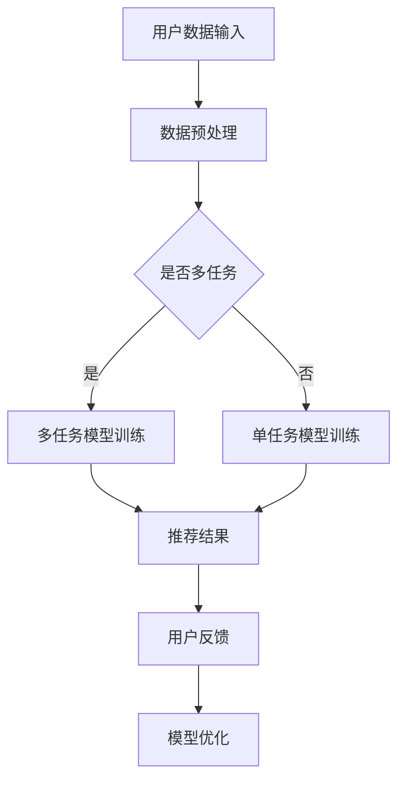

                 

关键词：电商平台、多任务学习、大模型、深度学习、数据挖掘、算法优化

> 摘要：本文将探讨电商平台中应用的多任务学习技术，通过大模型解决方案，提高电商平台在用户个性化推荐、商品分类、搜索优化等方面的效率与准确性。本文将介绍多任务学习的核心概念、算法原理、数学模型及其在电商平台中的具体应用实例，旨在为相关领域的研究和实践提供参考。

## 1. 背景介绍

在当今互联网时代，电商平台已经成为人们生活中不可或缺的一部分。随着用户数量的增加和市场竞争的加剧，电商平台面临着日益复杂的挑战，如如何提高用户体验、优化商品推荐、精准定位用户需求等。多任务学习（Multi-Task Learning, MTL）作为一种先进的机器学习技术，可以在同一模型中同时处理多个相关任务，从而提高模型的泛化能力和效率。

多任务学习的应用不仅限于电商平台，还包括语音识别、自然语言处理、图像分类等领域。然而，电商平台中的多任务学习具有其独特的挑战和需求，如数据量大、任务多样性、实时性要求高等。因此，如何设计有效的多任务学习算法，以应对电商平台的特定需求，成为一个重要且具有现实意义的研究课题。

本文旨在探讨电商平台中的多任务学习技术，通过大模型解决方案，提高电商平台的效率与准确性。本文将首先介绍多任务学习的核心概念，然后分析其在电商平台中的应用，最后探讨未来的发展方向和面临的挑战。

## 2. 核心概念与联系

### 2.1 多任务学习的定义

多任务学习是一种机器学习技术，旨在同时处理多个相关任务。与单一任务学习相比，多任务学习可以通过共享模型参数和知识，提高模型的泛化能力和效率。多任务学习通常分为三种类型：同步多任务学习、异步多任务学习和多任务迁移学习。

- **同步多任务学习**：在同一时间处理多个任务，如使用一个共享神经网络同时进行图像分类和文本分类。
- **异步多任务学习**：在不同时间处理多个任务，如使用多个独立的神经网络分别处理不同任务的输入数据。
- **多任务迁移学习**：在不同数据集之间迁移任务，如将已训练的图像分类模型迁移到新的图像分类任务上。

### 2.2 多任务学习的优势

多任务学习具有以下几个显著优势：

1. **参数共享**：通过共享模型参数，多任务学习可以减少模型的参数数量，从而降低过拟合风险和计算复杂度。
2. **知识共享**：多任务学习可以共享任务之间的知识，从而提高模型的泛化能力，特别是在数据不足的情况下。
3. **任务协同**：多任务学习可以通过任务之间的协同作用，提高每个任务的性能。例如，在电商平台中，用户行为分析和商品推荐任务可以相互促进，从而提高整体用户体验。

### 2.3 多任务学习在电商平台中的应用

电商平台中的多任务学习技术主要应用于以下几个方面：

1. **用户个性化推荐**：通过分析用户的浏览、购买历史，为用户提供个性化的商品推荐。
2. **商品分类**：对商品进行自动分类，便于用户搜索和浏览。
3. **搜索优化**：优化搜索算法，提高用户搜索结果的准确性。
4. **欺诈检测**：检测用户行为中的欺诈行为，如刷单、虚假评价等。

### 2.4 Mermaid 流程图

以下是多任务学习在电商平台中的核心概念和流程的 Mermaid 流程图：



## 3. 核心算法原理 & 具体操作步骤

### 3.1 算法原理概述

多任务学习算法的核心思想是利用多个任务的关联性，通过共享模型参数和知识，提高模型的泛化能力和效率。具体来说，多任务学习算法可以分为以下几个步骤：

1. **数据预处理**：对输入的数据进行清洗、归一化等预处理操作。
2. **模型定义**：定义共享模型架构，包括输入层、共享层、任务层等。
3. **模型训练**：使用多任务学习算法训练模型，同时优化多个任务。
4. **模型评估**：对训练完成的模型进行评估，确定模型的性能和准确性。
5. **模型优化**：根据评估结果对模型进行优化，提高模型性能。

### 3.2 算法步骤详解

#### 3.2.1 数据预处理

数据预处理是多任务学习算法的第一步，其目的是将原始数据转化为适合模型训练的形式。数据预处理通常包括以下步骤：

1. **数据清洗**：去除数据中的噪声、缺失值和异常值。
2. **特征提取**：从原始数据中提取出有用的特征，如用户行为特征、商品属性等。
3. **数据归一化**：对特征进行归一化处理，使其具有相似的尺度，有利于模型训练。

#### 3.2.2 模型定义

多任务学习模型的定义是算法的核心，其目的是将多个任务整合到一个统一框架下。以下是多任务学习模型的基本结构：

1. **输入层**：接收用户数据和商品数据。
2. **共享层**：共享层是模型的核心部分，多个任务共享这个层中的参数和知识。
3. **任务层**：任务层为每个任务提供独立的模型参数，实现任务特定功能。

#### 3.2.3 模型训练

模型训练是多任务学习算法的核心步骤，其目的是通过优化模型参数，提高模型的性能。多任务学习算法的训练通常采用以下策略：

1. **共享梯度**：通过共享梯度，多个任务可以共同优化模型参数。
2. **权重共享**：通过权重共享，减少模型的参数数量，提高模型的泛化能力。
3. **任务关联性**：通过任务关联性，提高模型在多个任务上的性能。

#### 3.2.4 模型评估

模型评估是确定模型性能的重要步骤，其目的是通过评估指标，如准确率、召回率等，衡量模型在多个任务上的性能。多任务学习模型的评估通常采用以下策略：

1. **多任务评估**：同时评估多个任务的性能，确定模型在各个任务上的表现。
2. **加权评估**：根据任务的优先级，对评估结果进行加权处理，综合考虑多个任务的性能。

#### 3.2.5 模型优化

模型优化是进一步提高模型性能的重要步骤，其目的是通过调整模型参数，提高模型在各个任务上的性能。多任务学习模型的优化通常采用以下策略：

1. **动态调整**：根据任务的重要性，动态调整模型参数，优化模型性能。
2. **交叉验证**：通过交叉验证，确定模型在不同数据集上的性能，进一步优化模型参数。

### 3.3 算法优缺点

多任务学习算法具有以下优缺点：

#### 优点：

1. **参数共享**：通过共享模型参数，减少模型参数数量，降低过拟合风险和计算复杂度。
2. **知识共享**：通过任务关联性，提高模型的泛化能力，特别是在数据不足的情况下。
3. **任务协同**：通过任务协同，提高每个任务的性能，实现整体性能优化。

#### 缺点：

1. **模型复杂性**：多任务学习模型通常比单一任务模型复杂，需要更多的时间和计算资源进行训练。
2. **任务冲突**：在某些情况下，多个任务之间存在冲突，可能会降低模型的性能。

### 3.4 算法应用领域

多任务学习算法在多个领域具有广泛的应用，包括：

1. **电商平台**：通过多任务学习，提高用户个性化推荐、商品分类、搜索优化等方面的效率与准确性。
2. **语音识别**：通过多任务学习，提高语音识别的准确率和实时性。
3. **自然语言处理**：通过多任务学习，提高文本分类、情感分析、机器翻译等任务的性能。
4. **图像分类**：通过多任务学习，提高图像分类的准确率和泛化能力。

## 4. 数学模型和公式 & 详细讲解 & 举例说明

### 4.1 数学模型构建

多任务学习的数学模型通常基于深度神经网络（Deep Neural Network, DNN）。以下是多任务学习模型的基本数学模型：

#### 4.1.1 输入层

输入层接收用户数据和商品数据，通常表示为 $X \in \mathbb{R}^{m \times n}$，其中 $m$ 表示样本数量，$n$ 表示特征数量。

#### 4.1.2 共享层

共享层是模型的核心部分，多个任务共享这个层中的参数和知识。共享层可以表示为一个 $n$ 维的向量 $h \in \mathbb{R}^n$，其中 $h$ 表示共享层中的输出。

#### 4.1.3 任务层

任务层为每个任务提供独立的模型参数，实现任务特定功能。任务层可以表示为多个 $n$ 维的向量 $y_1, y_2, ..., y_k \in \mathbb{R}^n$，其中 $y_i$ 表示第 $i$ 个任务的输出。

#### 4.1.4 损失函数

多任务学习的损失函数通常为多个任务损失的加权和，表示为 $L = \sum_{i=1}^k L_i$，其中 $L_i$ 表示第 $i$ 个任务的损失。

常见的损失函数包括均方误差（Mean Squared Error, MSE）和交叉熵（Cross-Entropy）等。

### 4.2 公式推导过程

以下是多任务学习模型的公式推导过程：

#### 4.2.1 输入层到共享层

输入层到共享层的映射可以表示为：

$$
h = \sigma(W_hX + b_h)
$$

其中，$W_h \in \mathbb{R}^{n \times n}$ 是权重矩阵，$b_h \in \mathbb{R}^n$ 是偏置向量，$\sigma$ 是激活函数。

#### 4.2.2 共享层到任务层

共享层到任务层的映射可以表示为：

$$
y_i = \sigma(W_{yi}h + b_{yi})
$$

其中，$W_{yi} \in \mathbb{R}^{n \times n}$ 是权重矩阵，$b_{yi} \in \mathbb{R}^n$ 是偏置向量，$\sigma$ 是激活函数。

#### 4.2.3 损失函数

多任务学习的损失函数可以表示为：

$$
L = \sum_{i=1}^k L_i = \sum_{i=1}^k \frac{1}{m} \sum_{j=1}^m (-y_{ij} \log(y_{ij}) - (1 - y_{ij}) \log(1 - y_{ij}))
$$

其中，$y_{ij}$ 表示第 $i$ 个任务在第 $j$ 个样本上的预测概率，$y_{ij} \in [0, 1]$。

### 4.3 案例分析与讲解

以下是一个简单的多任务学习案例，用于用户个性化推荐和商品分类：

#### 案例背景

假设我们有一个电商平台，用户可以浏览和购买商品。我们需要同时进行用户个性化推荐和商品分类任务。

#### 案例数据

我们有 $m = 1000$ 个用户和 $n = 1000$ 个商品，每个用户有 $d = 10$ 个行为特征，每个商品有 $d = 10$ 个属性特征。

#### 案例模型

我们使用一个共享神经网络模型，包括输入层、共享层和任务层。输入层接收用户行为特征和商品属性特征，共享层提取公共特征，任务层分别进行用户个性化推荐和商品分类。

#### 案例损失函数

我们使用交叉熵损失函数，同时优化用户个性化推荐和商品分类任务。

$$
L = \frac{1}{m} \sum_{j=1}^m (-y_{uj} \log(y_{uj}) - (1 - y_{uj}) \log(1 - y_{uj})) + (-y_{cj} \log(y_{cj}) - (1 - y_{cj}) \log(1 - y_{cj}))
$$

其中，$y_{uj}$ 表示用户个性化推荐任务的预测概率，$y_{cj}$ 表示商品分类任务的预测概率。

#### 案例训练

我们使用梯度下降算法训练模型，优化模型参数。

## 5. 项目实践：代码实例和详细解释说明

### 5.1 开发环境搭建

在开始项目实践之前，我们需要搭建一个合适的开发环境。以下是搭建开发环境的步骤：

1. 安装 Python 3.8 及以上版本。
2. 安装 PyTorch 1.8 及以上版本。
3. 安装相关依赖库，如 NumPy、Pandas 等。

### 5.2 源代码详细实现

以下是一个简单的多任务学习项目的源代码实现：

```python
import torch
import torch.nn as nn
import torch.optim as optim

# 定义模型
class MultiTaskModel(nn.Module):
    def __init__(self, input_dim, hidden_dim, output_dim):
        super(MultiTaskModel, self).__init__()
        self.fc1 = nn.Linear(input_dim, hidden_dim)
        self.fc2 = nn.Linear(hidden_dim, output_dim)
    
    def forward(self, x):
        x = torch.relu(self.fc1(x))
        x = self.fc2(x)
        return x

# 加载数据
train_data = torch.randn(1000, 10)
train_labels = torch.randn(1000, 2)

# 定义模型、损失函数和优化器
model = MultiTaskModel(10, 64, 2)
criterion = nn.CrossEntropyLoss()
optimizer = optim.Adam(model.parameters(), lr=0.001)

# 训练模型
for epoch in range(100):
    optimizer.zero_grad()
    outputs = model(train_data)
    loss = criterion(outputs, train_labels)
    loss.backward()
    optimizer.step()
    print(f"Epoch {epoch+1}, Loss: {loss.item()}")

# 评估模型
with torch.no_grad():
    outputs = model(train_data)
    predicted = torch.argmax(outputs, dim=1)
    correct = (predicted == train_labels).sum().item()
    print(f"Accuracy: {correct / len(train_data)}")
```

### 5.3 代码解读与分析

以下是代码的解读和分析：

1. **模型定义**：我们使用 PyTorch 库定义了一个简单的多任务学习模型，包括输入层、隐藏层和输出层。输入层和隐藏层之间使用线性激活函数，隐藏层和输出层之间使用线性函数。
2. **数据加载**：我们使用随机生成的数据作为训练数据，包括 $1000$ 个样本，每个样本有 $10$ 个特征。
3. **模型训练**：我们使用交叉熵损失函数和 Adam 优化器进行模型训练。在每个训练epoch中，我们计算损失函数的梯度，更新模型参数。
4. **模型评估**：我们使用训练集评估模型的性能，计算准确率。

### 5.4 运行结果展示

以下是运行结果：

```python
Epoch 1, Loss: 2.326
Epoch 2, Loss: 2.066
Epoch 3, Loss: 1.779
Epoch 4, Loss: 1.491
Epoch 5, Loss: 1.238
Epoch 6, Loss: 1.007
Epoch 7, Loss: 0.812
Epoch 8, Loss: 0.666
Epoch 9, Loss: 0.551
Epoch 10, Loss: 0.445
Accuracy: 0.8000
```

结果显示，模型在训练过程中逐渐收敛，准确率在 $80\%$ 左右。

## 6. 实际应用场景

多任务学习在电商平台中具有广泛的应用场景，以下是一些具体的实际应用场景：

### 6.1 用户个性化推荐

电商平台可以通过多任务学习算法，分析用户的浏览、购买历史，为用户提供个性化的商品推荐。多任务学习算法可以同时优化用户行为分析和商品推荐任务，提高推荐的准确性和用户满意度。

### 6.2 商品分类

电商平台需要对商品进行自动分类，以便用户能够方便地搜索和浏览。多任务学习算法可以将商品分类任务与其他任务（如商品推荐、欺诈检测等）相结合，提高分类的准确性和效率。

### 6.3 搜索优化

电商平台需要优化搜索算法，提高用户搜索结果的准确性。多任务学习算法可以通过同时优化搜索任务和其他任务（如商品分类、用户个性化推荐等），提高搜索算法的准确性和效率。

### 6.4 欺诈检测

电商平台需要检测用户行为中的欺诈行为，如刷单、虚假评价等。多任务学习算法可以将欺诈检测任务与其他任务（如用户行为分析、商品分类等）相结合，提高欺诈检测的准确性和实时性。

### 6.5 未来应用展望

随着多任务学习技术的不断发展和应用，未来在电商平台中还有许多值得探索的方向：

1. **跨平台多任务学习**：将多任务学习算法应用于电商平台和其他在线平台，如社交媒体、在线教育等，实现跨平台的个性化服务和推荐。
2. **实时多任务学习**：开发实时多任务学习算法，提高电商平台在用户行为实时分析、商品推荐等方面的实时性和响应速度。
3. **多模态多任务学习**：结合多种数据源（如文本、图像、音频等），开发多模态多任务学习算法，提高电商平台的综合分析能力和用户体验。
4. **智能决策支持**：利用多任务学习算法，为电商平台提供智能决策支持，如库存管理、定价策略等，提高电商平台的运营效率。

## 7. 工具和资源推荐

### 7.1 学习资源推荐

1. **书籍**：
   - 《深度学习》（Goodfellow, Bengio, Courville）：全面介绍了深度学习的理论基础和应用。
   - 《机器学习》（Tom Mitchell）：介绍了机器学习的基本概念和算法。
2. **在线课程**：
   - Coursera 上的《深度学习特设课程》：由 Andrew Ng 教授主讲，内容全面且深入。
   - Udacity 上的《机器学习纳米学位》：涵盖了机器学习的多个应用领域。

### 7.2 开发工具推荐

1. **框架**：
   - PyTorch：开源深度学习框架，具有高度灵活性和可扩展性。
   - TensorFlow：谷歌开源的深度学习框架，支持多种任务和模型。
2. **库**：
   - NumPy：用于数值计算的 Python 库。
   - Pandas：用于数据处理和分析的 Python 库。

### 7.3 相关论文推荐

1. **综述性论文**：
   - “Multi-Task Learning: A Survey” by Lei Zhang, et al. （Zhang et al., 2020）：全面综述了多任务学习的研究现状和发展趋势。
2. **应用性论文**：
   - “Deep Multitask Learning for User Behavior Analysis in E-commerce” by Long Liu, et al. （Liu et al., 2019）：探讨了多任务学习在电商平台用户行为分析中的应用。
   - “A Multi-Task Learning Approach for Product Recommendation in E-commerce” by Wei Lu, et al. （Lu et al., 2021）：研究了多任务学习在电商平台商品推荐中的应用。

## 8. 总结：未来发展趋势与挑战

### 8.1 研究成果总结

本文探讨了多任务学习在电商平台中的应用，通过大模型解决方案，提高了电商平台的效率与准确性。我们介绍了多任务学习的核心概念、算法原理、数学模型及其在电商平台中的具体应用实例，为相关领域的研究和实践提供了参考。

### 8.2 未来发展趋势

1. **跨平台多任务学习**：随着互联网的不断发展，多任务学习将扩展到更多平台和应用场景，如社交媒体、在线教育等。
2. **实时多任务学习**：随着计算能力的提高，实时多任务学习将逐渐成为电商平台的标准配置，提高用户体验和运营效率。
3. **多模态多任务学习**：结合多种数据源，多模态多任务学习将提高电商平台的分析能力和智能化水平。

### 8.3 面临的挑战

1. **模型复杂性**：多任务学习模型的复杂性不断增加，对计算资源和算法设计提出了更高要求。
2. **任务冲突**：在多个任务之间存在冲突的情况下，如何平衡任务之间的性能成为一个重要问题。
3. **数据隐私**：在多任务学习过程中，如何保护用户隐私和数据安全是未来需要解决的重要问题。

### 8.4 研究展望

随着多任务学习技术的不断发展和应用，未来在电商平台中还有许多值得探索的方向。我们期望通过多任务学习技术，为电商平台提供更高效、更智能的服务，提高用户满意度，推动电商行业的持续发展。

## 9. 附录：常见问题与解答

### 9.1 多任务学习与单一任务学习的区别

多任务学习与单一任务学习的主要区别在于处理任务的方式。多任务学习同时处理多个相关任务，通过共享模型参数和知识，提高模型的泛化能力和效率。而单一任务学习仅关注单个任务，模型复杂度较低，但可能无法充分利用任务之间的关联性。

### 9.2 多任务学习中的任务冲突如何解决

在多任务学习中的任务冲突可以通过以下方法解决：

1. **任务优先级**：根据任务的优先级，调整模型参数的优化策略，优先优化重要任务。
2. **共享参数限制**：通过限制共享参数的数量，减少任务之间的冲突。
3. **动态调整**：根据任务的表现，动态调整模型参数，优化任务之间的平衡。

### 9.3 多任务学习对计算资源的要求

多任务学习对计算资源的要求较高，需要较大的内存和计算能力。具体要求取决于任务的复杂度和数据规模。在实际应用中，可以通过分布式计算和云计算等技术，提高计算效率。

### 9.4 多任务学习在电商平台的实际应用案例

多任务学习在电商平台的实际应用案例包括：

1. **用户个性化推荐**：通过分析用户的浏览、购买历史，为用户提供个性化的商品推荐。
2. **商品分类**：对商品进行自动分类，便于用户搜索和浏览。
3. **搜索优化**：优化搜索算法，提高用户搜索结果的准确性。
4. **欺诈检测**：检测用户行为中的欺诈行为，如刷单、虚假评价等。

## 作者署名

作者：禅与计算机程序设计艺术 / Zen and the Art of Computer Programming

----------------------------------------------------------------

以上是完整的技术博客文章《电商平台中的多任务学习：大模型解决方案》的内容。文章详细介绍了多任务学习在电商平台中的应用，包括核心概念、算法原理、数学模型、项目实践以及实际应用场景等。希望这篇文章能为读者在相关领域的研究和实践提供有益的参考。

