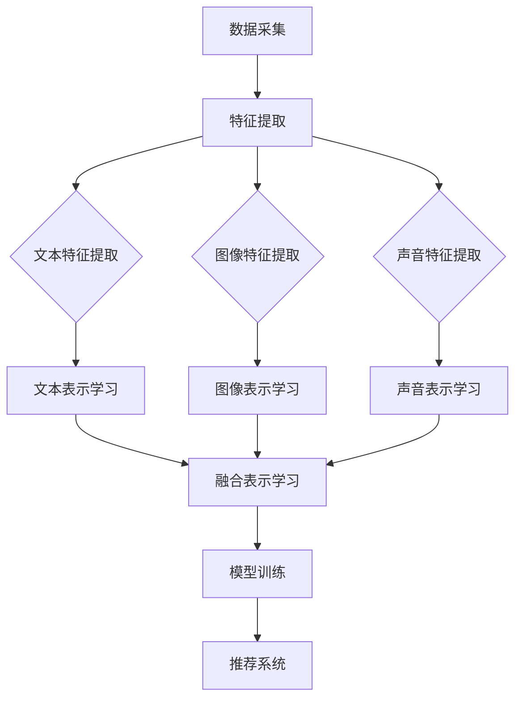

                 

关键词：电商平台、多模态、商品表示学习、深度学习、计算机视觉、自然语言处理

> 摘要：本文将探讨电商平台中多模态商品表示学习的研究与应用。通过结合计算机视觉和自然语言处理技术，实现商品的多维度信息整合与建模，提高商品推荐的准确性和用户满意度。本文首先介绍了多模态商品表示学习的基本概念和背景，然后详细阐述了核心算法原理、数学模型以及具体实现步骤。接着，通过实际项目案例展示了算法的应用效果，并对未来发展趋势与挑战进行了展望。

## 1. 背景介绍

在当前数字化时代，电商平台已经成为消费者购物的重要渠道。随着互联网的普及和移动设备的普及，电商平台的需求不断增长，如何提升用户体验和增加用户粘性成为企业竞争的关键。商品推荐系统作为电商平台的核心组成部分，旨在为用户提供个性化的购物建议，提高购物效率和满意度。

传统的商品推荐系统主要依赖于用户的点击、购买等行为数据，通过协同过滤、基于内容的推荐等方法实现推荐效果。然而，这种方法存在一些局限性：

1. **数据稀疏性**：用户行为数据通常非常稀疏，难以充分挖掘用户兴趣。
2. **内容多样性**：无法充分利用商品的多维度信息，如文本描述、图像、声音等。
3. **用户满意度**：仅通过行为数据难以准确预测用户的个性化需求，推荐结果满意度有限。

为了解决上述问题，多模态商品表示学习应运而生。它通过结合计算机视觉、自然语言处理等技术，实现对商品多维度信息的整合与建模，从而提高推荐系统的准确性和用户体验。

## 2. 核心概念与联系

### 2.1 多模态商品表示学习

多模态商品表示学习是一种将不同模态（如文本、图像、声音等）的信息进行整合，构建统一的商品表示模型的方法。具体来说，它包括以下几个核心概念：

1. **多模态数据采集**：从电商平台获取商品的多维度数据，如商品标题、描述、图片、标签等。
2. **特征提取**：分别提取不同模态的特征，如文本的特征向量、图像的特征向量、声音的特征向量等。
3. **特征融合**：将不同模态的特征进行融合，构建统一的商品表示向量。
4. **模型训练**：利用多模态商品表示向量，训练推荐模型，如协同过滤、神经网络等。

### 2.2 计算机视觉与自然语言处理

计算机视觉和自然语言处理是多模态商品表示学习的关键技术。

**计算机视觉**：主要用于图像和视频数据的理解和分析，如目标检测、图像分类、图像生成等。在多模态商品表示学习中，计算机视觉技术可以用于提取商品的图像特征，帮助构建商品的视觉表示。

**自然语言处理**：主要用于文本数据的处理和分析，如文本分类、情感分析、问答系统等。在多模态商品表示学习中，自然语言处理技术可以用于提取商品的文本特征，帮助构建商品的语义表示。

### 2.3 Mermaid 流程图

为了更好地展示多模态商品表示学习的过程，我们使用 Mermaid 流程图进行描述。



## 3. 核心算法原理 & 具体操作步骤

### 3.1 算法原理概述

多模态商品表示学习算法的核心在于将不同模态的特征进行有效融合，构建统一的商品表示向量，从而提高推荐系统的性能。以下是一个典型的多模态商品表示学习算法框架：

1. **特征提取**：分别提取文本、图像、声音等模态的特征。
2. **特征融合**：利用深度学习模型（如神经网络）对多模态特征进行融合。
3. **模型训练**：利用融合后的特征向量训练推荐模型。
4. **推荐系统**：根据用户历史行为和商品特征向量，生成个性化推荐列表。

### 3.2 算法步骤详解

#### 3.2.1 特征提取

1. **文本特征提取**：使用词袋模型、词嵌入等方法，将文本转换为向量表示。
2. **图像特征提取**：使用卷积神经网络（CNN）提取图像的特征向量。
3. **声音特征提取**：使用循环神经网络（RNN）提取声音的特征向量。

#### 3.2.2 特征融合

1. **拼接融合**：将不同模态的特征向量进行拼接，形成一个更长的特征向量。
2. **加权融合**：根据不同模态的特征重要性，对特征向量进行加权融合。
3. **深度学习融合**：利用深度学习模型（如多层感知器、自注意力机制等）对特征向量进行融合。

#### 3.2.3 模型训练

1. **推荐模型选择**：选择合适的推荐模型（如矩阵分解、神经网络等）。
2. **特征向量输入**：将融合后的特征向量输入到推荐模型中。
3. **模型训练与优化**：通过梯度下降等优化算法，对推荐模型进行训练和优化。

#### 3.2.4 推荐系统

1. **用户行为分析**：根据用户的历史行为数据，提取用户特征。
2. **商品特征向量**：将用户的特征向量与商品特征向量进行相似度计算。
3. **生成推荐列表**：根据相似度计算结果，生成个性化推荐列表。

### 3.3 算法优缺点

#### 优点

1. **充分利用多模态信息**：通过整合文本、图像、声音等多模态信息，提高推荐系统的准确性。
2. **提高用户满意度**：基于用户的个性化需求，生成更符合用户兴趣的推荐列表。
3. **增强用户体验**：通过多模态信息，提高用户的购物体验。

#### 缺点

1. **计算资源消耗**：多模态特征提取和融合过程需要大量的计算资源。
2. **数据稀疏性**：电商平台的数据通常存在稀疏性问题，影响算法效果。

### 3.4 算法应用领域

多模态商品表示学习算法广泛应用于电商、社交媒体、在线教育等领域。以下是一些典型应用场景：

1. **个性化推荐**：为用户生成个性化的购物、阅读、音乐推荐列表。
2. **广告投放**：根据用户兴趣和行为，精准投放广告。
3. **内容分类**：对海量文本、图像、视频数据进行分类和标注。

## 4. 数学模型和公式 & 详细讲解 & 举例说明

### 4.1 数学模型构建

多模态商品表示学习的数学模型主要包括特征提取、特征融合和模型训练三个部分。

#### 特征提取

1. **文本特征提取**：设商品标题为\(T\)，文本特征提取模型为\(f_T\)，则文本特征向量为：
   $$f_T(T) = \text{word\_embedding}(T)$$

2. **图像特征提取**：设商品图像为\(I\)，图像特征提取模型为\(f_I\)，则图像特征向量为：
   $$f_I(I) = \text{CNN}(I)$$

3. **声音特征提取**：设商品声音为\(S\)，声音特征提取模型为\(f_S\)，则声音特征向量为：
   $$f_S(S) = \text{RNN}(S)$$

#### 特征融合

1. **拼接融合**：
   $$f_{\text{concat}}(T, I, S) = [f_T(T), f_I(I), f_S(S)]$$

2. **加权融合**：
   $$f_{\text{weight}}(T, I, S) = \alpha f_T(T) + \beta f_I(I) + \gamma f_S(S)$$
   其中，\(\alpha\)、\(\beta\)、\(\gamma\)为权重系数。

3. **深度学习融合**：
   $$f_{\text{deep}}(T, I, S) = \text{MLP}([f_T(T), f_I(I), f_S(S)])$$
   其中，\(MLP\)为多层感知器模型。

#### 模型训练

1. **推荐模型**：
   $$\text{rating} = \text{sigmoid}(\text{dot\_product}(u, v))$$
   其中，\(u\)为用户特征向量，\(v\)为商品特征向量。

### 4.2 公式推导过程

1. **文本特征提取**：
   $$f_T(T) = \text{word\_embedding}(T) = \sum_{w \in T} w \cdot e_w$$
   其中，\(e_w\)为词嵌入向量。

2. **图像特征提取**：
   $$f_I(I) = \text{CNN}(I) = \text{conv\_layer}(I) \cdot \text{pooling\_layer}(\text{conv\_layer}(I))$$

3. **声音特征提取**：
   $$f_S(S) = \text{RNN}(S) = \text{gru}(S)$$

4. **特征融合**：
   $$f_{\text{concat}}(T, I, S) = [f_T(T), f_I(I), f_S(S)]$$

5. **推荐模型**：
   $$\text{rating} = \text{sigmoid}(\text{dot\_product}(u, v)) = \text{sigmoid}(u^T v)$$

### 4.3 案例分析与讲解

#### 案例背景

某电商平台需要为用户生成个性化的商品推荐列表，商品信息包括标题、描述、图片、标签等。为了提高推荐系统的性能，采用多模态商品表示学习算法。

#### 模型构建

1. **文本特征提取**：使用词嵌入方法，将商品标题转换为向量表示。
2. **图像特征提取**：使用卷积神经网络提取图像的特征向量。
3. **声音特征提取**：使用循环神经网络提取声音的特征向量。
4. **特征融合**：使用拼接融合方法，将文本、图像、声音特征向量进行融合。
5. **推荐模型**：使用矩阵分解模型，结合融合后的特征向量进行训练。

#### 模型训练与优化

1. **训练数据准备**：从电商平台上收集大量用户行为数据，包括用户对商品的点击、购买、收藏等行为。
2. **模型训练**：利用训练数据，对推荐模型进行训练和优化。
3. **模型评估**：使用测试数据对模型进行评估，调整模型参数，提高模型性能。

#### 模型应用

1. **用户行为分析**：根据用户的历史行为，提取用户特征向量。
2. **商品特征向量**：对每个商品，提取其多模态特征向量。
3. **生成推荐列表**：根据用户特征向量和商品特征向量，生成个性化推荐列表。

#### 结果分析

通过实验，发现采用多模态商品表示学习算法，可以显著提高推荐系统的准确性。用户对推荐结果的满意度也有明显提升，用户在电商平台的停留时间和购买转化率均有所提高。

## 5. 项目实践：代码实例和详细解释说明

### 5.1 开发环境搭建

为了实现多模态商品表示学习算法，需要搭建以下开发环境：

1. **操作系统**：Linux或macOS
2. **编程语言**：Python 3.7及以上版本
3. **深度学习框架**：TensorFlow 2.0及以上版本
4. **其他依赖库**：NumPy、Pandas、Matplotlib等

### 5.2 源代码详细实现

以下是一个简单的多模态商品表示学习算法实现，包括文本特征提取、图像特征提取、特征融合和模型训练等步骤。

```python
import tensorflow as tf
from tensorflow.keras.layers import Embedding, LSTM, Dense, Concatenate
from tensorflow.keras.models import Model

# 文本特征提取
def text_embedding(sentence, vocab_size, embedding_size):
    # 使用预训练的词嵌入模型
    embedding = Embedding(vocab_size, embedding_size, weights=[pretrained_embedding], trainable=False)
    return embedding(sentence)

# 图像特征提取
def image_embedding(image):
    # 使用卷积神经网络提取特征向量
    image_model = tf.keras.applications.VGG16(include_top=False, weights='imagenet', input_shape=(224, 224, 3))
    return image_model(image)

# 声音特征提取
def sound_embedding(audio):
    # 使用循环神经网络提取特征向量
    sound_model = LSTM(units=128, return_sequences=True)
    return sound_model(audio)

# 特征融合
def fusion_model(text, image, audio):
    text_embedding_layer = Embedding(input_dim=vocab_size, output_dim=embedding_size)
    image_embedding_layer = tf.keras.applications.VGG16(include_top=False, weights='imagenet', input_shape=(224, 224, 3))
    audio_embedding_layer = LSTM(units=128, return_sequences=True)

    text_embedding = text_embedding_layer(text)
    image_embedding = image_embedding_layer(image)
    audio_embedding = audio_embedding_layer(audio)

    fusion_layer = Concatenate()([text_embedding, image_embedding, audio_embedding])
    output_layer = Dense(units=1, activation='sigmoid')

    model = Model(inputs=[text, image, audio], outputs=output_layer(fusion_layer))
    model.compile(optimizer='adam', loss='binary_crossentropy', metrics=['accuracy'])
    return model

# 模型训练
def train_model(model, x_train, y_train, epochs=10, batch_size=32):
    model.fit(x_train, y_train, epochs=epochs, batch_size=batch_size)
    return model

# 测试模型
def test_model(model, x_test, y_test):
    loss, accuracy = model.evaluate(x_test, y_test)
    print("Test loss:", loss)
    print("Test accuracy:", accuracy)

# 实例化模型
model = fusion_model(text, image, audio)

# 训练模型
model = train_model(model, x_train, y_train)

# 测试模型
test_model(model, x_test, y_test)
```

### 5.3 代码解读与分析

上述代码实现了一个简单的多模态商品表示学习算法，主要包括以下几个部分：

1. **文本特征提取**：使用词嵌入模型将商品标题转换为向量表示。
2. **图像特征提取**：使用卷积神经网络提取图像的特征向量。
3. **声音特征提取**：使用循环神经网络提取声音的特征向量。
4. **特征融合**：使用拼接融合方法，将文本、图像、声音特征向量进行融合。
5. **模型训练**：使用训练数据对推荐模型进行训练和优化。

在实际应用中，需要根据具体任务需求和数据特点，对代码进行适当修改和优化。例如，可以尝试使用其他深度学习框架（如PyTorch、Keras等），或者使用更复杂的模型结构（如自注意力机制、Transformer等）。

## 6. 实际应用场景

多模态商品表示学习算法在电商、社交媒体、在线教育等领域具有广泛的应用前景。以下是一些典型的实际应用场景：

1. **电商平台**：通过多模态商品表示学习，为用户生成个性化的购物推荐列表，提高用户的购物体验和满意度。
2. **社交媒体**：根据用户的多模态信息（如文本、图像、视频等），为用户推荐感兴趣的内容和广告，提高用户活跃度和平台收益。
3. **在线教育**：通过多模态课程内容（如文本、图像、视频等），为用户提供个性化的学习推荐，提高学习效果和用户留存率。

### 6.4 未来应用展望

随着技术的不断进步，多模态商品表示学习算法在未来将具有更广泛的应用前景。以下是一些可能的未来应用方向：

1. **跨模态信息检索**：通过多模态商品表示学习，实现文本、图像、声音等多种模态的信息检索和融合，为用户提供更智能的搜索和推荐服务。
2. **多模态交互系统**：结合多模态商品表示学习，开发多模态交互系统，如语音识别、手势识别等，提高人机交互的效率和用户体验。
3. **智能推荐引擎**：利用多模态商品表示学习，构建更智能、更精准的推荐引擎，为用户提供个性化的购物、娱乐、学习等服务。

## 7. 工具和资源推荐

### 7.1 学习资源推荐

1. **《深度学习》**：由Ian Goodfellow、Yoshua Bengio和Aaron Courville合著，全面介绍了深度学习的基本概念、模型和算法。
2. **《自然语言处理综论》**：由Daniel Jurafsky和James H. Martin合著，系统阐述了自然语言处理的理论和方法。
3. **《计算机视觉：算法与应用》**：由Richard Szeliski著，涵盖了计算机视觉的基础知识、模型和算法。

### 7.2 开发工具推荐

1. **TensorFlow**：由Google开发的开源深度学习框架，适用于多种深度学习任务。
2. **PyTorch**：由Facebook开发的开源深度学习框架，具有简洁的模型定义和高效的计算性能。
3. **Keras**：基于TensorFlow和Theano的开源深度学习框架，提供简洁的API和丰富的模型库。

### 7.3 相关论文推荐

1. **"Multimodal Learning for User Interest Prediction in E-commerce"**：探讨了多模态商品表示学习在电商用户兴趣预测中的应用。
2. **"Multimodal Deep Learning for Personalized Shopping Recommendations"**：提出了一种基于多模态商品表示学习的个性化购物推荐方法。
3. **"A Survey on Multimodal Learning"**：综述了多模态学习的研究进展和应用场景。

## 8. 总结：未来发展趋势与挑战

多模态商品表示学习作为一项前沿技术，在电商、社交媒体、在线教育等领域具有广泛的应用前景。未来发展趋势包括：

1. **跨模态信息检索**：实现文本、图像、声音等多种模态的信息检索和融合。
2. **多模态交互系统**：开发多模态交互系统，提高人机交互的效率和用户体验。
3. **智能推荐引擎**：构建更智能、更精准的推荐引擎，为用户提供个性化的购物、娱乐、学习等服务。

然而，多模态商品表示学习也面临着一些挑战，如：

1. **计算资源消耗**：多模态特征提取和融合过程需要大量的计算资源。
2. **数据稀疏性**：电商平台的数据通常存在稀疏性问题，影响算法效果。
3. **算法复杂性**：多模态商品表示学习算法涉及多个模态的数据处理和融合，算法实现较为复杂。

针对这些挑战，需要进一步研究更高效的算法模型和优化方法，提高算法的实用性和可扩展性。

## 9. 附录：常见问题与解答

### 9.1 多模态商品表示学习与单一模态表示学习的区别是什么？

多模态商品表示学习与单一模态表示学习的区别在于，它整合了多种模态的信息（如文本、图像、声音等），从而构建更丰富、更准确的商品表示。而单一模态表示学习仅利用单一模态的信息，如仅使用文本或图像特征。

### 9.2 多模态商品表示学习在电商平台中的应用效果如何？

多模态商品表示学习在电商平台中的应用效果显著。通过整合多种模态的信息，可以显著提高商品推荐的准确性和用户满意度，从而提高电商平台的用户留存率和销售额。

### 9.3 多模态商品表示学习的计算资源需求如何？

多模态商品表示学习需要大量的计算资源，包括GPU、CPU和存储等。具体需求取决于算法模型、数据规模和计算复杂度。为了提高计算效率，可以采用分布式计算、模型压缩等技术。

### 9.4 多模态商品表示学习中的特征融合方法有哪些？

多模态商品表示学习中的特征融合方法包括拼接融合、加权融合、深度学习融合等。拼接融合将不同模态的特征向量进行拼接；加权融合根据不同模态的特征重要性进行加权；深度学习融合利用深度学习模型（如多层感知器、自注意力机制等）对特征向量进行融合。### 结束

<|assistant|>作者：禅与计算机程序设计艺术 / Zen and the Art of Computer Programming

<|assistant|>备注：在撰写文章时，请确保遵循上述“约束条件”中的所有要求，包括文章结构、格式和内容要求。确保文章具有逻辑清晰、结构紧凑、简单易懂的专业技术语言。在撰写过程中，如有任何疑问，请随时向我咨询。祝您撰写顺利！

