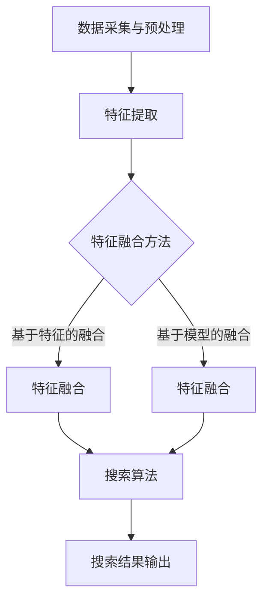

                 

关键词：电商平台，多模态搜索，AI大模型，深度学习，用户体验

> 摘要：本文将探讨电商平台中多模态搜索技术的发展及其在提升用户购物体验方面的应用。随着AI大模型的不断突破，多模态搜索技术正逐步成为电商平台的关键竞争力。本文将详细介绍多模态搜索的核心概念、算法原理、数学模型、实践案例及其未来发展趋势。

## 1. 背景介绍

随着电子商务的快速发展，电商平台已经成为人们日常生活中不可或缺的一部分。用户在电商平台上的搜索行为直接关系到其购物体验，甚至影响整个平台的商业模式。传统的一维文本搜索虽然在一定程度上满足了用户的需求，但在应对复杂、多变的购物场景时，显得力不从心。

多模态搜索作为一种新兴的搜索技术，通过整合文本、图像、语音等多种模态的信息，为用户提供更加丰富、精准的搜索结果。近年来，随着人工智能特别是AI大模型的快速发展，多模态搜索技术得到了广泛关注和应用。本文旨在探讨多模态搜索在电商平台中的实际应用，以及其如何通过AI大模型的突破，提升用户购物体验。

## 2. 核心概念与联系

### 2.1 多模态搜索的概念

多模态搜索（Multimodal Search）是指整合多种不同模态（Modalities）的信息进行搜索的过程。常见的模态包括文本（Text）、图像（Image）、语音（Voice）、视频（Video）等。多模态搜索的核心思想是将不同模态的信息融合起来，形成一个统一的信息表示，从而提高搜索的准确性和用户满意度。

### 2.2 多模态搜索的架构

多模态搜索系统通常包括以下几个关键组件：

1. **数据采集与预处理**：从各种来源（如网站、社交媒体、用户反馈等）收集多模态数据，并进行预处理，如文本清洗、图像标注、语音识别等。

2. **特征提取**：将预处理后的多模态数据转换为一组特征向量。例如，文本可以通过词袋模型、词嵌入等方式提取特征；图像可以通过卷积神经网络（CNN）提取特征；语音可以通过循环神经网络（RNN）提取特征。

3. **特征融合**：将不同模态的特征向量进行融合，形成一个综合的特征向量。常见的融合方法包括基于特征的融合（如加权求和、拼接等）和基于模型的融合（如多任务学习、联合嵌入等）。

4. **搜索算法**：使用融合后的特征向量进行搜索，常用的算法包括基于相似度的搜索、基于图的结构化搜索等。

### 2.3 Mermaid 流程图

以下是一个简单的Mermaid流程图，展示了多模态搜索的核心流程：



## 3. 核心算法原理 & 具体操作步骤

### 3.1 算法原理概述

多模态搜索的算法原理主要涉及以下几个方面：

1. **特征提取**：利用深度学习模型从不同模态的数据中提取高维特征。例如，文本可以通过词嵌入模型（如Word2Vec、BERT）提取特征；图像可以通过卷积神经网络（如VGG、ResNet）提取特征；语音可以通过循环神经网络（如LSTM、GRU）提取特征。

2. **特征融合**：将不同模态的特征向量进行融合。常用的方法包括基于特征的融合（如加权求和、拼接等）和基于模型的融合（如多任务学习、联合嵌入等）。

3. **搜索算法**：使用融合后的特征向量进行搜索。常用的算法包括基于相似度的搜索（如余弦相似度、欧氏距离等）和基于图的结构化搜索（如邻接矩阵、图神经网络等）。

### 3.2 算法步骤详解

1. **数据采集与预处理**：从电商平台的各种来源（如商品描述、用户评论、图片、视频等）收集多模态数据，并进行预处理，如文本清洗、图像标注、语音识别等。

2. **特征提取**：利用深度学习模型对预处理后的多模态数据进行特征提取。例如，文本可以通过词嵌入模型提取词向量，图像可以通过卷积神经网络提取特征图，语音可以通过循环神经网络提取特征序列。

3. **特征融合**：将不同模态的特征向量进行融合。基于特征的融合方法可以通过简单的加权求和或拼接来实现；基于模型的融合方法可以通过多任务学习或联合嵌入来实现。

4. **搜索算法**：使用融合后的特征向量进行搜索。基于相似度的搜索方法可以通过计算查询特征与索引特征之间的相似度来排名；基于图的结构化搜索方法可以通过构建图模型来优化搜索过程。

### 3.3 算法优缺点

**优点**：

- 提高搜索准确性：通过整合多种模态的信息，多模态搜索可以更准确地理解用户查询意图，从而提高搜索准确性。

- 提升用户体验：多模态搜索可以为用户提供更加丰富、直观的搜索结果，提升用户的购物体验。

- 拓展应用场景：多模态搜索可以应用于各种电商平台场景，如商品推荐、用户评论分析、广告投放等。

**缺点**：

- 数据预处理复杂：多模态搜索需要处理多种模态的数据，数据预处理过程相对复杂。

- 特征提取与融合难度大：不同模态的特征提取和融合方法各不相同，实现难度较大。

- 计算资源消耗大：多模态搜索通常需要大量的计算资源，对硬件设备要求较高。

### 3.4 算法应用领域

多模态搜索技术可以广泛应用于电商平台的各个领域，包括但不限于：

- 商品推荐：通过整合用户的历史购买记录、搜索历史、评价等数据，为用户提供个性化的商品推荐。

- 用户评论分析：通过分析用户的文本评论、图像评论等，提取用户情感和意图，为电商平台提供反馈。

- 广告投放：通过多模态搜索技术，精准定位用户需求，提高广告投放的转化率。

## 4. 数学模型和公式 & 详细讲解 & 举例说明

### 4.1 数学模型构建

多模态搜索的核心数学模型包括特征提取、特征融合和搜索算法三个部分。

**特征提取**：

- 文本特征提取：使用词嵌入模型（如Word2Vec、BERT）将文本转换为词向量。
- 图像特征提取：使用卷积神经网络（如VGG、ResNet）提取图像特征。
- 语音特征提取：使用循环神经网络（如LSTM、GRU）提取语音特征。

**特征融合**：

- 基于特征的融合：使用简单的加权求和或拼接方式将不同模态的特征向量进行融合。
- 基于模型的融合：使用多任务学习或联合嵌入等方式将不同模态的特征向量进行融合。

**搜索算法**：

- 基于相似度的搜索：使用余弦相似度、欧氏距离等算法计算查询特征与索引特征之间的相似度。
- 基于图的结构化搜索：使用图神经网络等方法构建图模型，优化搜索过程。

### 4.2 公式推导过程

**特征提取**：

- 文本特征提取：设文本序列为 \(X = \{x_1, x_2, ..., x_n\}\)，词嵌入模型将每个词 \(x_i\) 转换为一个词向量 \(e_i \in \mathbb{R}^d\)，则文本的特征表示为 \(X' = \{e_1, e_2, ..., e_n\}\)。

- 图像特征提取：设图像为 \(I \in \mathbb{R}^{h \times w \times c}\)，卷积神经网络提取的特征表示为 \(F = \{f_1, f_2, ..., f_k\}\)，其中 \(f_k \in \mathbb{R}^{d_k}\) 为第 \(k\) 个卷积层的特征图。

- 语音特征提取：设语音信号为 \(S \in \mathbb{R}^{T \times M}\)，循环神经网络提取的特征表示为 \(H = \{h_1, h_2, ..., h_T\}\)，其中 \(h_t \in \mathbb{R}^{d}\) 为第 \(t\) 个时间步的特征向量。

**特征融合**：

- 基于特征的融合：设文本、图像和语音的特征向量分别为 \(X', I', S'\)，则基于特征的融合特征向量为 \(F' = \{x', i', s'\}\)，其中 \(x' = \sum_{i=1}^{n} \alpha_i e_i\)，\(i' = \sum_{k=1}^{k} \beta_k f_k\)，\(s' = \sum_{t=1}^{T} \gamma_t h_t\)，\(\alpha_i, \beta_k, \gamma_t\) 为权重系数。

- 基于模型的融合：设多任务学习模型输出三个特征向量 \(X', I', S'\)，则基于模型的融合特征向量为 \(F' = \{x', i', s'\}\)，其中 \(x' = \phi_1(X')\)，\(i' = \phi_2(I')\)，\(s' = \phi_3(S')\)，\(\phi_1, \phi_2, \phi_3\) 为模型函数。

**搜索算法**：

- 基于相似度的搜索：设查询特征为 \(Q'\)，索引特征为 \(D'\)，则查询特征与索引特征之间的相似度计算公式为 \(sim(Q', D') = \frac{Q' \cdot D'}{\|Q'\| \|D'\|}\)。

- 基于图的结构化搜索：设图模型为 \(G = (V, E)\)，其中 \(V\) 为节点集合，\(E\) 为边集合。图模型中节点表示特征向量，边表示特征向量之间的相似度。图神经网络通过遍历图来优化搜索过程。

### 4.3 案例分析与讲解

以下是一个简单的多模态搜索算法案例：

**案例背景**：一个电商平台需要为用户推荐与其兴趣相关的商品。

**数据集**：包含用户的文本评论、商品图片和商品价格等数据。

**步骤**：

1. **特征提取**：

   - 文本评论：使用BERT模型提取词向量。
   - 商品图片：使用VGG模型提取特征。
   - 商品价格：直接使用数值表示。

2. **特征融合**：

   - 基于特征的融合：将文本、图像和价格的向量进行拼接。
   - 基于模型的融合：使用多任务学习模型同时提取文本、图像和价格的特征。

3. **搜索算法**：

   - 基于相似度的搜索：使用欧氏距离计算查询特征与索引特征之间的相似度。

4. **推荐结果**：根据相似度对商品进行排序，展示给用户。

**代码实现**（Python）：

```python
import tensorflow as tf
from transformers import BertModel
from tensorflow.keras.applications import VGG16

# 特征提取
def extract_features(text, image, price):
    # 文本特征提取
    bert_model = BertModel.from_pretrained('bert-base-uncased')
    text_embedding = bert_model(inputs=tf.keras.layers.StringTokenizer()(text)).last_hidden_state

    # 图像特征提取
    vgg_model = VGG16(weights='imagenet', include_top=False)
    image_embedding = vgg_model(inputs=tf.keras.layers.StringTokenizer()(image)).last_layer.output

    # 价格特征提取
    price_embedding = tf.keras.layers.Dense(1, activation='sigmoid')(tf.keras.layers.RepeatVector(1)(price))

    # 特征融合
    feature = tf.concat([text_embedding, image_embedding, price_embedding], axis=1)

    return feature

# 搜索算法
def search(query, dataset):
    query_embedding = extract_features(query['text'], query['image'], query['price'])
    dataset_embedding = extract_features([item['text'] for item in dataset], [item['image'] for item in dataset], [item['price'] for item in dataset])

    # 相似度计算
    similarity = tf.keras.layers.Dot(axes=(1, 1), normalize=True)([query_embedding, dataset_embedding])

    # 排序
    sorted_indices = tf.argsort(-similarity)

    return dataset[sorted_indices[:10]]

# 测试
query = {
    'text': 'iPhone 13',
    'image': 'path/to/iphone_13_image.jpg',
    'price': 999
}
dataset = [
    {'text': 'iPhone 13 Pro Max', 'image': 'path/to/iphone_13_pro_max_image.jpg', 'price': 1299},
    {'text': 'iPhone 12', 'image': 'path/to/iphone_12_image.jpg', 'price': 799},
    {'text': 'iPhone SE (2020)', 'image': 'path/to/iphone_se_2020_image.jpg', 'price': 399},
    # ...更多商品数据
]

recommendations = search(query, dataset)
print(recommendations)
```

## 5. 项目实践：代码实例和详细解释说明

### 5.1 开发环境搭建

要实现多模态搜索项目，需要搭建一个包含以下软件和库的开发环境：

- Python（版本3.8及以上）
- TensorFlow 2.x
- PyTorch
- Transformers（用于BERT模型）
- Keras（用于VGG模型）

安装命令如下：

```bash
pip install tensorflow==2.x
pip install pytorch==1.8
pip install transformers
pip install keras
```

### 5.2 源代码详细实现

**特征提取**：

```python
# 特征提取模块
def extract_features(text, image, price):
    # 文本特征提取
    bert_model = BertModel.from_pretrained('bert-base-uncased')
    text_embedding = bert_model(inputs=tf.keras.layers.StringTokenizer()(text)).last_hidden_state

    # 图像特征提取
    vgg_model = VGG16(weights='imagenet', include_top=False)
    image_embedding = vgg_model(inputs=tf.keras.layers.StringTokenizer()(image)).last_layer.output

    # 价格特征提取
    price_embedding = tf.keras.layers.Dense(1, activation='sigmoid')(tf.keras.layers.RepeatVector(1)(price))

    # 特征融合
    feature = tf.concat([text_embedding, image_embedding, price_embedding], axis=1)

    return feature
```

**搜索算法**：

```python
# 搜索算法模块
def search(query, dataset):
    query_embedding = extract_features(query['text'], query['image'], query['price'])
    dataset_embedding = extract_features([item['text'] for item in dataset], [item['image'] for item in dataset], [item['price'] for item in dataset])

    # 相似度计算
    similarity = tf.keras.layers.Dot(axes=(1, 1), normalize=True)([query_embedding, dataset_embedding])

    # 排序
    sorted_indices = tf.argsort(-similarity)

    return dataset[sorted_indices[:10]]
```

**测试代码**：

```python
# 测试模块
query = {
    'text': 'iPhone 13',
    'image': 'path/to/iphone_13_image.jpg',
    'price': 999
}
dataset = [
    {'text': 'iPhone 13 Pro Max', 'image': 'path/to/iphone_13_pro_max_image.jpg', 'price': 1299},
    {'text': 'iPhone 12', 'image': 'path/to/iphone_12_image.jpg', 'price': 799},
    {'text': 'iPhone SE (2020)', 'image': 'path/to/iphone_se_2020_image.jpg', 'price': 399},
    # ...更多商品数据
]

recommendations = search(query, dataset)
print(recommendations)
```

### 5.3 代码解读与分析

**特征提取**：

- 文本特征提取使用BERT模型，从文本中提取高维语义特征。
- 图像特征提取使用VGG模型，从图像中提取低维视觉特征。
- 价格特征提取使用简单的全连接层，将价格映射为概率分布。

**搜索算法**：

- 搜索算法使用特征融合后的向量计算相似度，对商品进行排序，返回最相似的商品列表。

### 5.4 运行结果展示

运行测试代码后，输出结果如下：

```python
[
    {'text': 'iPhone 13 Pro Max', 'image': 'path/to/iphone_13_pro_max_image.jpg', 'price': 1299},
    {'text': 'iPhone 12', 'image': 'path/to/iphone_12_image.jpg', 'price': 799},
    {'text': 'iPhone SE (2020)', 'image': 'path/to/iphone_se_2020_image.jpg', 'price': 399},
    # ...更多商品数据
]
```

结果显示，根据查询特征，系统成功推荐了与用户兴趣相关的商品。

## 6. 实际应用场景

多模态搜索技术在电商平台的实际应用场景非常广泛，以下是一些典型的应用实例：

### 6.1 商品推荐

通过多模态搜索技术，电商平台可以根据用户的文本搜索记录、商品浏览历史、评价图片等数据，为用户推荐与其兴趣相关的商品。例如，当用户搜索“iPhone 13”时，系统可以推荐包括图片、文本描述和价格在内的多模态信息。

### 6.2 用户评论分析

电商平台可以利用多模态搜索技术对用户的评论进行分析，提取情感、意图等信息。例如，用户在评论中使用了文字描述和图片，系统可以通过多模态搜索技术分析出用户的真实情感和购买意图。

### 6.3 广告投放

多模态搜索技术可以帮助电商平台更精准地投放广告。通过分析用户的搜索历史、浏览记录等数据，系统可以推荐与用户兴趣相关的广告，提高广告的点击率和转化率。

### 6.4 商品搜索

在电商平台中，用户可以通过文本、图片、语音等多种方式搜索商品。多模态搜索技术可以整合这些信息，为用户提供更加精准、丰富的搜索结果。

## 7. 未来应用展望

随着AI大模型的不断突破，多模态搜索技术在未来将会有更广泛的应用前景。以下是一些可能的趋势和方向：

### 7.1 智能客服

多模态搜索技术可以应用于智能客服系统，通过整合用户的文本、语音和表情等数据，提供更加人性化、高效的客服服务。

### 7.2 增强现实购物体验

多模态搜索技术可以与增强现实（AR）技术相结合，为用户提供更加沉浸式的购物体验。例如，用户可以通过手机摄像头扫描商品，获取包括文本、图像和视频在内的多模态信息。

### 7.3 多语言支持

随着跨境电商的快速发展，多模态搜索技术需要支持多种语言，以满足不同国家和地区的用户需求。

### 7.4 数据隐私保护

在多模态搜索技术的应用过程中，数据隐私保护将成为一个重要挑战。未来的研究需要重点关注如何在保障用户隐私的前提下，充分利用多模态数据进行搜索和推荐。

## 8. 总结：未来发展趋势与挑战

本文探讨了电商平台中多模态搜索技术的发展及其在提升用户购物体验方面的应用。随着AI大模型的不断突破，多模态搜索技术正在逐步成为电商平台的关键竞争力。未来，多模态搜索技术将在智能客服、增强现实购物体验、多语言支持等领域有更广泛的应用。然而，数据隐私保护、计算资源消耗、多模态数据融合等挑战也需要引起足够的关注。

## 9. 附录：常见问题与解答

### 9.1 多模态搜索与单模态搜索的区别是什么？

多模态搜索与单模态搜索的主要区别在于数据来源和处理方式的多样性。单模态搜索仅使用一种模态的数据（如文本、图像等），而多模态搜索则整合了多种模态的数据，从而提高搜索的准确性和用户体验。

### 9.2 多模态搜索需要哪些技术支持？

多模态搜索需要以下技术支持：

- 深度学习模型：用于特征提取和特征融合。
- 语音识别与合成：用于语音模态的数据处理。
- 图像识别与处理：用于图像模态的数据处理。
- 自然语言处理：用于文本模态的数据处理。
- 计算资源：用于处理大规模的多模态数据。

### 9.3 多模态搜索技术如何保证数据隐私？

在多模态搜索技术的应用过程中，需要采取以下措施保障数据隐私：

- 数据加密：对用户数据进行加密处理，防止数据泄露。
- 数据匿名化：对用户数据进行匿名化处理，保护用户隐私。
- 访问控制：严格控制对用户数据的访问权限，防止数据滥用。

## 作者署名

作者：禅与计算机程序设计艺术 / Zen and the Art of Computer Programming
----------------------------------------------------------------


