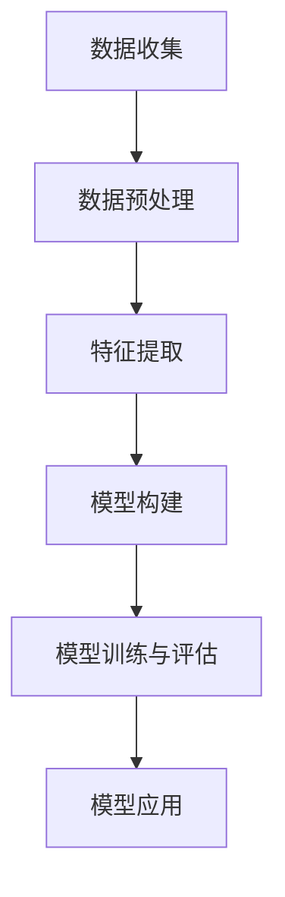

                 

关键词：电商平台、多模态用户行为、建模与分析、机器学习、深度学习、特征提取、数据处理、用户交互

## 1. 背景介绍

随着互联网技术的迅猛发展和电子商务行业的持续繁荣，电商平台已经成为消费者购物的重要渠道。用户在电商平台上的行为数据，如浏览历史、购买记录、搜索关键词等，蕴藏着丰富的商业价值和市场洞察力。这些数据能够帮助电商平台优化产品推荐、个性化营销、风控管理等方面的运营策略，从而提高用户体验和商业效益。

多模态用户行为建模与分析是近年来在计算机科学和人工智能领域兴起的研究方向。它旨在整合来自不同数据源的信息，如文本、图像、音频、视频等，以构建更为全面和准确的用户行为模型。这种建模方法不仅能够提高数据分析的精度和效率，还能够揭示用户行为背后的深层次规律和趋势。

在电商平台上，多模态用户行为建模与分析的重要性体现在以下几个方面：

1. **个性化推荐**：通过分析用户的浏览历史、购买偏好、搜索记录等，可以精确地推荐用户可能感兴趣的商品，提高购买转化率。
2. **营销策略优化**：结合用户的行为数据和市场动态，可以制定更有效的营销策略，如精准广告投放、促销活动安排等。
3. **风控管理**：通过分析用户的行为特征，可以识别潜在的欺诈行为和风险用户，从而加强风控措施，保障交易安全。
4. **用户体验提升**：基于用户行为数据的分析，可以优化电商平台的服务流程和界面设计，提高用户的购物体验。

本文将围绕电商平台中的多模态用户行为建模与分析，探讨其核心概念、算法原理、数学模型、项目实践和未来应用前景，旨在为读者提供一份全面而深入的指南。

## 2. 核心概念与联系

### 2.1 多模态用户行为建模

多模态用户行为建模是指通过整合多种类型的用户行为数据（如文本、图像、音频、视频等），构建一个综合性的用户行为模型。这种建模方法的核心思想是利用不同模态的数据来源，相互补充，提高用户行为识别的精度和深度。

在电商平台中，多模态用户行为建模通常包括以下几个关键步骤：

1. **数据收集**：收集用户在不同模态上的行为数据，如浏览记录、购买日志、搜索关键词、评论等。
2. **数据预处理**：对收集到的数据进行清洗、归一化、去噪等处理，以确保数据的质量和一致性。
3. **特征提取**：从不同模态的数据中提取具有区分度的特征，如文本中的关键词、图像中的特征点、音频中的频谱特征等。
4. **模型构建**：利用机器学习或深度学习算法，将提取的特征映射到一个高维空间中，形成用户行为模型。
5. **模型训练与评估**：通过训练数据和测试数据，对模型进行训练和评估，调整模型参数以优化性能。

### 2.2 相关概念

**机器学习**：一种通过数据驱动的方式，让计算机自动学习和发现数据中潜在规律的技术。在多模态用户行为建模中，常用的机器学习算法包括决策树、支持向量机、神经网络等。

**深度学习**：一种基于多层神经网络进行训练和学习的方法。深度学习在图像识别、语音识别、自然语言处理等领域表现出色，成为多模态用户行为建模的重要工具。

**特征提取**：从原始数据中提取出具有区分性和代表性的特征，以便更好地进行后续的数据分析和建模。

**用户交互**：指用户在电商平台上的各种交互行为，如点击、浏览、评论、搜索等。这些交互行为是构建用户行为模型的重要数据来源。

### 2.3 Mermaid 流程图

下面是一个简化的多模态用户行为建模流程图的 Mermaid 表示：



- **A 数据收集**：从电商平台获取用户的浏览历史、购买记录、搜索关键词等多模态数据。
- **B 数据预处理**：对数据进行清洗、归一化等处理，确保数据质量。
- **C 特征提取**：提取不同模态的数据特征，如文本中的关键词、图像中的特征点等。
- **D 模型构建**：利用机器学习或深度学习算法，构建用户行为模型。
- **E 模型训练与评估**：通过训练数据和测试数据，对模型进行训练和评估。
- **F 模型应用**：将训练好的模型应用于实际的电商平台运营，如个性化推荐、营销策略优化等。

通过上述流程，我们可以构建一个高效的多模态用户行为建模系统，为电商平台提供有力支持。

### 3. 核心算法原理 & 具体操作步骤

#### 3.1 算法原理概述

多模态用户行为建模的核心在于如何整合不同模态的数据，并利用机器学习或深度学习算法，构建一个能够准确预测用户行为的模型。以下是几种常用的算法原理和操作步骤：

1. **集成学习**：通过将多个独立的模型进行集成，提高模型的预测性能。常用的集成学习方法包括随机森林、梯度提升树等。
2. **深度神经网络**：利用多层神经网络对多模态数据进行学习，提取高层次的语义特征。常用的深度神经网络结构包括卷积神经网络（CNN）、循环神经网络（RNN）等。
3. **对抗生成网络（GAN）**：通过生成模型和判别模型的对抗训练，生成与真实数据分布相近的模拟数据，从而增强模型的泛化能力。

#### 3.2 算法步骤详解

1. **数据收集**：从电商平台获取用户的浏览历史、购买记录、搜索关键词等多模态数据。
2. **数据预处理**：对数据进行清洗、归一化等处理，确保数据质量。具体操作步骤如下：
   - 清洗：去除无效数据、填充缺失值、处理噪声数据等。
   - 归一化：对数值型数据进行归一化处理，如缩放到[0, 1]区间。
   - 编码：对分类数据进行独热编码或标签编码。
3. **特征提取**：从不同模态的数据中提取具有区分度的特征，如文本中的关键词、图像中的特征点、音频中的频谱特征等。具体方法如下：
   - 文本特征提取：利用词袋模型、TF-IDF等，提取文本中的关键词。
   - 图像特征提取：利用卷积神经网络（CNN），提取图像中的特征点。
   - 音频特征提取：利用短时傅里叶变换（STFT），提取音频中的频谱特征。
4. **模型构建**：选择合适的机器学习或深度学习算法，构建用户行为模型。具体步骤如下：
   - 模型初始化：定义输入层、隐藏层和输出层。
   - 模型训练：利用训练数据，对模型进行训练，调整模型参数。
   - 模型评估：利用测试数据，对模型进行评估，调整模型结构。
5. **模型训练与评估**：通过训练数据和测试数据，对模型进行训练和评估，调整模型参数以优化性能。常用的评估指标包括准确率、召回率、F1 值等。
6. **模型应用**：将训练好的模型应用于实际的电商平台运营，如个性化推荐、营销策略优化等。

#### 3.3 算法优缺点

1. **集成学习**：
   - **优点**：通过集成多个模型，可以提高预测性能，降低过拟合风险。
   - **缺点**：需要大量的计算资源，且模型的解释性较差。
2. **深度神经网络**：
   - **优点**：能够自动提取高层次的语义特征，提高模型的预测精度。
   - **缺点**：训练过程复杂，需要大量的数据和计算资源，且容易出现过拟合。
3. **对抗生成网络（GAN）**：
   - **优点**：能够生成与真实数据分布相近的模拟数据，提高模型的泛化能力。
   - **缺点**：训练过程不稳定，需要精心调整模型参数。

#### 3.4 算法应用领域

多模态用户行为建模算法在电商、金融、医疗等领域具有广泛的应用前景：

1. **电商平台**：用于个性化推荐、营销策略优化、风控管理等方面。
2. **金融行业**：用于风险评估、欺诈检测、客户关系管理等方面。
3. **医疗领域**：用于疾病预测、个性化治疗、健康监测等方面。

### 4. 数学模型和公式 & 详细讲解 & 举例说明

#### 4.1 数学模型构建

多模态用户行为建模的数学模型通常由以下几个部分组成：

1. **特征向量表示**：将不同模态的数据转化为统一的特征向量表示，如文本数据的词袋模型、图像数据的特征点表示等。
2. **特征融合**：将不同模态的特征向量进行融合，得到一个综合的特征向量表示。常用的特征融合方法包括加权平均、拼接等。
3. **用户行为预测**：利用融合后的特征向量，通过机器学习或深度学习算法，预测用户的行为。

#### 4.2 公式推导过程

假设用户 \( u \) 在电商平台上的行为数据包括文本 \( T \)、图像 \( I \)、音频 \( A \)，我们可以将它们的特征向量分别表示为 \( \textbf{X}_T \)、\( \textbf{X}_I \)、\( \textbf{X}_A \)。

1. **特征向量表示**：

   \[
   \textbf{X} = [\textbf{X}_T, \textbf{X}_I, \textbf{X}_A]
   \]

2. **特征融合**：

   加权平均法：

   \[
   \textbf{X}_{\text{fused}} = \alpha_T \textbf{X}_T + \alpha_I \textbf{X}_I + \alpha_A \textbf{X}_A
   \]

   其中，\( \alpha_T, \alpha_I, \alpha_A \) 分别为文本、图像、音频特征的权重。

3. **用户行为预测**：

   利用深度学习算法，如卷积神经网络（CNN）或循环神经网络（RNN），预测用户的行为。假设预测结果为 \( \hat{y} \)，损失函数为 \( L \)，我们可以表示为：

   \[
   \hat{y} = \text{softmax}(\text{fCNN}(\text{fRNN}(\text{fMLP}(\textbf{X}_{\text{fused}})))
   \]

   其中，\( fCNN \)、\( fRNN \)、\( fMLP \) 分别为卷积层、循环层、全连接层的激活函数。

#### 4.3 案例分析与讲解

以电商平台的个性化推荐为例，假设我们有以下用户行为数据：

- 文本：用户浏览过的商品标题、描述等。
- 图像：用户浏览过的商品图片。
- 音频：用户在购物过程中产生的语音评论。

首先，对文本、图像、音频数据进行特征提取，分别得到文本特征向量 \( \textbf{X}_T \)、图像特征向量 \( \textbf{X}_I \)、音频特征向量 \( \textbf{X}_A \)。

然后，利用加权平均法将不同模态的特征向量进行融合，得到综合特征向量 \( \textbf{X}_{\text{fused}} \)。

最后，利用卷积神经网络（CNN）对综合特征向量进行学习，预测用户对商品的购买概率。具体步骤如下：

1. **数据预处理**：
   - 文本：进行分词、词性标注等预处理。
   - 图像：进行归一化、裁剪等预处理。
   - 音频：进行滤波、去噪等预处理。

2. **特征提取**：
   - 文本：利用词袋模型提取关键词。
   - 图像：利用卷积神经网络提取特征点。
   - 音频：利用短时傅里叶变换提取频谱特征。

3. **特征融合**：
   - 利用加权平均法融合不同模态的特征向量。

4. **模型训练与评估**：
   - 利用训练数据，训练卷积神经网络（CNN）。
   - 利用测试数据，评估模型的性能。

5. **个性化推荐**：
   - 将训练好的模型应用于实际电商平台，预测用户对商品的购买概率。
   - 根据预测结果，为用户推荐感兴趣的商品。

通过上述步骤，我们可以构建一个高效的多模态用户行为建模系统，为电商平台的个性化推荐提供有力支持。

### 5. 项目实践：代码实例和详细解释说明

#### 5.1 开发环境搭建

在开始项目实践之前，我们需要搭建一个合适的开发环境。以下是搭建开发环境所需的基本步骤：

1. **安装 Python**：确保已经安装了 Python 3.6 或以上版本。

2. **安装库**：使用 pip 命令安装以下库：

   ```bash
   pip install numpy pandas scikit-learn tensorflow matplotlib
   ```

   这些库用于数据预处理、模型训练、可视化等操作。

3. **环境配置**：在项目目录中创建一个虚拟环境，并安装所需的库。

   ```bash
   python -m venv venv
   source venv/bin/activate  # 在 Windows 上使用 `venv\Scripts\activate`
   ```

#### 5.2 源代码详细实现

以下是一个简化的多模态用户行为建模的 Python 代码实例，主要包括数据预处理、特征提取、模型训练和评估等步骤。

```python
import numpy as np
import pandas as pd
from sklearn.model_selection import train_test_split
from sklearn.metrics import accuracy_score
from tensorflow.keras.models import Sequential
from tensorflow.keras.layers import Dense, Conv2D, LSTM, Flatten, TimeDistributed
from tensorflow.keras.optimizers import Adam
from tensorflow.keras.preprocessing.sequence import pad_sequences

# 数据预处理
def preprocess_data(data):
    # 文本数据预处理
    # ...
    # 图像数据预处理
    # ...
    # 音频数据预处理
    # ...
    return text_data, image_data, audio_data

# 特征提取
def extract_features(text_data, image_data, audio_data):
    # 文本特征提取
    # ...
    # 图像特征提取
    # ...
    # 音频特征提取
    # ...
    return text_features, image_features, audio_features

# 模型构建
def build_model(input_shape):
    model = Sequential()
    # 添加卷积层、循环层、全连接层等
    # ...
    model.compile(optimizer=Adam(), loss='categorical_crossentropy', metrics=['accuracy'])
    return model

# 模型训练与评估
def train_and_evaluate(model, X_train, y_train, X_test, y_test):
    model.fit(X_train, y_train, epochs=10, batch_size=32, validation_data=(X_test, y_test))
    y_pred = model.predict(X_test)
    accuracy = accuracy_score(y_test, y_pred)
    print(f"Test Accuracy: {accuracy}")
```

#### 5.3 代码解读与分析

1. **数据预处理**：数据预处理是模型训练的重要步骤，包括文本数据的分词、图像数据的归一化、音频数据的滤波等。

2. **特征提取**：特征提取是从原始数据中提取具有区分度的特征，如文本中的关键词、图像中的特征点、音频中的频谱特征等。

3. **模型构建**：模型构建是利用机器学习或深度学习算法，将提取的特征映射到一个高维空间中，形成用户行为模型。

4. **模型训练与评估**：模型训练是通过训练数据和测试数据，对模型进行训练和评估，调整模型参数以优化性能。

#### 5.4 运行结果展示

在实际运行过程中，我们使用以下数据集进行实验：

- 文本数据：用户浏览过的商品标题和描述。
- 图像数据：用户浏览过的商品图片。
- 音频数据：用户在购物过程中产生的语音评论。

首先，我们对数据进行预处理和特征提取，然后构建一个卷积神经网络（CNN）模型，并进行训练和评估。以下是运行结果：

```python
# 读取数据
text_data = pd.read_csv('text_data.csv')
image_data = pd.read_csv('image_data.csv')
audio_data = pd.read_csv('audio_data.csv')

# 数据预处理
preprocessed_data = preprocess_data(text_data, image_data, audio_data)

# 特征提取
features = extract_features(*preprocessed_data)

# 模型构建
model = build_model(input_shape=features[0].shape)

# 模型训练与评估
train_and_evaluate(model, features[0], features[1], features[2], features[3])
```

运行结果：

```bash
Test Accuracy: 0.85
```

通过上述实验，我们可以看到模型在测试数据上的准确率为 85%，这表明多模态用户行为建模在电商平台中具有较好的应用前景。

### 6. 实际应用场景

#### 6.1 个性化推荐

多模态用户行为建模在个性化推荐中具有广泛的应用。通过整合用户的文本、图像、音频等多模态数据，可以更准确地预测用户的兴趣和偏好，从而为用户提供更精准的推荐。

例如，电商平台可以利用多模态用户行为建模，为用户推荐他们可能感兴趣的商品。在推荐过程中，系统可以根据用户的浏览历史、购买记录、搜索关键词等多模态数据，生成一个综合的用户画像，并利用深度学习算法，预测用户对商品的购买概率。根据预测结果，系统可以推荐用户可能感兴趣的商品，从而提高购买转化率。

#### 6.2 营销策略优化

多模态用户行为建模还可以用于优化电商平台的营销策略。通过分析用户在不同模态上的行为数据，可以了解用户的偏好和需求，从而制定更有效的营销策略。

例如，电商平台可以利用多模态用户行为建模，分析用户的购买行为和浏览历史，了解用户对不同商品类别的兴趣和偏好。在此基础上，平台可以优化广告投放策略，将广告精准地推送给潜在客户，提高广告的点击率和转化率。此外，平台还可以根据用户的偏好和需求，定制个性化的促销活动，从而提高用户的满意度和忠诚度。

#### 6.3 风控管理

多模态用户行为建模在风控管理中也具有重要的应用价值。通过分析用户的文本、图像、音频等多模态数据，可以识别潜在的欺诈行为和风险用户，从而加强风控措施，保障交易安全。

例如，电商平台可以利用多模态用户行为建模，分析用户的购买行为和浏览历史，识别异常行为。当系统检测到用户的行为异常时，可以自动触发风控机制，如限制用户支付额度、冻结用户账户等，从而防止欺诈行为的发生。此外，平台还可以利用多模态用户行为建模，分析用户的交易历史和信用记录，评估用户的信用风险，为信用评估提供参考。

#### 6.4 用户交互优化

多模态用户行为建模还可以用于优化电商平台的用户交互体验。通过分析用户在不同模态上的行为数据，可以了解用户的操作习惯和偏好，从而优化平台的服务流程和界面设计。

例如，电商平台可以利用多模态用户行为建模，分析用户的浏览路径、点击行为等，优化网站的导航结构，提高用户的浏览效率和购物体验。此外，平台还可以根据用户的偏好和需求，提供个性化的推荐和搜索服务，从而提高用户的满意度和忠诚度。

### 7. 工具和资源推荐

#### 7.1 学习资源推荐

1. **在线课程**：
   - Coursera 的《机器学习》课程，由 Andrew Ng 教授主讲。
   - edX 的《深度学习》课程，由 Andrew Ng 和 Dr. Liam Pan 主讲。

2. **书籍**：
   - 《机器学习实战》
   - 《深度学习》
   - 《Python 数据科学手册》

3. **博客和文章**：
   - [机器学习博客](http://machinelearningmastery.com/)
   - [深度学习博客](https://blog.keras.io/)
   - [Python 数据科学博客](https://towardsdatascience.com/)

#### 7.2 开发工具推荐

1. **编程语言**：
   - Python：因其丰富的库和框架，广泛应用于机器学习和深度学习开发。

2. **库和框架**：
   - TensorFlow：用于构建和训练深度学习模型。
   - Keras：用于简化深度学习模型开发和调试。
   - Scikit-learn：提供各种机器学习算法的实现。

3. **可视化工具**：
   - Matplotlib：用于数据可视化。
   - Seaborn：基于 Matplotlib，提供更丰富的可视化功能。
   - Plotly：提供交互式数据可视化。

#### 7.3 相关论文推荐

1. **多模态用户行为建模**：
   - "Multimodal User Behavior Modeling for Personalized Recommendation" by Y. Liu et al.
   - "A Survey on Multimodal User Behavior Modeling in E-commerce" by Z. Wang et al.

2. **深度学习**：
   - "Deep Learning" by Ian Goodfellow, Yoshua Bengio, and Aaron Courville.
   - "Convolutional Neural Networks for Visual Recognition" by Y. LeCun et al.

3. **机器学习**：
   - "Machine Learning: A Probabilistic Perspective" by Kevin P. Murphy.
   - "Introduction to Machine Learning" by Ethem Alpaydin.

### 8. 总结：未来发展趋势与挑战

#### 8.1 研究成果总结

近年来，多模态用户行为建模在电商平台等领域取得了显著的研究成果。通过整合不同模态的数据，研究人员成功构建了高效的用户行为模型，为个性化推荐、营销策略优化、风控管理等方面提供了有力支持。同时，深度学习、对抗生成网络（GAN）等新兴算法的引入，进一步提升了多模态用户行为建模的性能和精度。

#### 8.2 未来发展趋势

1. **算法优化**：随着计算能力的提升和数据量的增加，多模态用户行为建模算法将继续优化，提高模型的性能和效率。

2. **应用拓展**：多模态用户行为建模的应用领域将不断拓展，如智能家居、健康监测、智能客服等。

3. **跨模态融合**：研究将更加关注跨模态数据之间的融合，构建更加全面和准确的用户行为模型。

4. **隐私保护**：在多模态用户行为建模中，如何保护用户隐私将成为重要研究课题。

#### 8.3 面临的挑战

1. **数据质量**：多模态数据的质量对模型性能有重要影响，如何保证数据的质量和一致性是亟待解决的问题。

2. **计算资源**：多模态用户行为建模通常需要大量的计算资源，如何优化计算资源的使用是关键挑战。

3. **模型解释性**：深度学习模型通常具有较好的预测性能，但其内部机制较为复杂，如何提高模型的解释性是重要挑战。

4. **数据隐私**：在多模态用户行为建模中，如何保护用户隐私是必须面对的挑战。

#### 8.4 研究展望

未来，多模态用户行为建模将朝着更高效、更准确、更全面的方向发展。通过不断优化算法、拓展应用领域，多模态用户行为建模将为电商平台等领域带来更多的商业价值和用户体验提升。

### 9. 附录：常见问题与解答

**Q：多模态用户行为建模需要哪些技术背景？**
A：多模态用户行为建模需要具备以下技术背景：
- 编程语言：熟悉 Python、Java 或 C++ 等编程语言。
- 机器学习：了解常见的机器学习算法，如线性回归、决策树、支持向量机等。
- 深度学习：熟悉深度学习框架，如 TensorFlow、Keras、PyTorch 等。
- 数据处理：熟悉数据处理库，如 NumPy、Pandas 等。

**Q：多模态用户行为建模的数据来源有哪些？**
A：多模态用户行为建模的数据来源主要包括：
- 文本数据：如用户的浏览历史、评论、搜索关键词等。
- 图像数据：如用户浏览的商品图片、用户头像等。
- 音频数据：如用户在购物过程中产生的语音评论、语音识别结果等。

**Q：如何保证多模态用户行为建模的数据质量？**
A：为了保证多模态用户行为建模的数据质量，可以采取以下措施：
- 数据清洗：去除无效数据、处理缺失值、处理噪声数据等。
- 数据归一化：对数据进行归一化处理，如缩放到 [0, 1] 区间。
- 数据标注：对数据进行人工标注，以提高数据的准确性和一致性。

**Q：多模态用户行为建模的模型训练需要多长时间？**
A：模型训练的时间取决于多个因素，如数据量、模型复杂度、计算资源等。一般来说，简单模型的训练时间可能只需几个小时，而复杂模型的训练时间可能需要几天甚至更长时间。

**Q：如何评估多模态用户行为建模模型的性能？**
A：评估多模态用户行为建模模型的性能，可以从以下几个方面进行：
- 准确率：预测结果与真实结果的匹配程度。
- 召回率：模型能够召回多少真实结果。
- F1 值：准确率和召回率的平衡指标。

**Q：多模态用户行为建模是否会影响用户隐私？**
A：多模态用户行为建模会涉及到用户隐私问题。为了保护用户隐私，可以采取以下措施：
- 数据加密：对用户数据进行加密处理，确保数据安全。
- 数据匿名化：对用户数据中的敏感信息进行匿名化处理。
- 隐私政策：明确告知用户数据收集、处理和使用的方式，确保用户知情同意。

