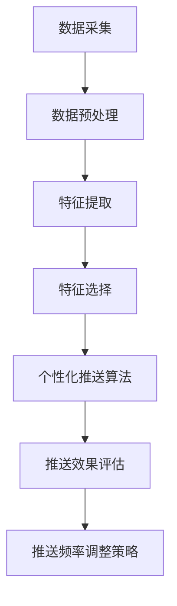

                 

关键词：电商平台、个性化推送、实时优化、频率控制、用户行为分析、算法原理、数学模型、代码实例、应用场景、工具推荐、未来展望

> 摘要：本文将探讨电商平台中的实时个性化推送频率优化问题。通过深入分析用户行为数据，本文提出了一种基于数学模型的个性化推送频率优化算法，并详细阐述了算法原理、操作步骤及其优缺点。同时，通过实际项目实践，展示了代码实现和运行结果，为电商平台的个性化推送提供了有力的技术支持。

## 1. 背景介绍

随着互联网技术的飞速发展，电商平台已经成为人们日常购物的重要渠道。为了提升用户满意度和购物体验，电商平台不断探索个性化推送技术。个性化推送能够根据用户的兴趣、行为和需求，实时推荐相关商品，从而提高用户的粘性和购买转化率。然而，如何在确保个性化推荐效果的同时，控制推送频率，避免用户产生疲劳感，成为电商平台面临的重大挑战。

实时个性化推送频率优化问题，即是根据用户行为数据动态调整推送频率，以实现推荐效果和用户体验之间的平衡。传统的方法往往基于固定的推送频率，无法及时响应用户行为的变化。因此，本文提出了一种基于数学模型的个性化推送频率优化算法，旨在实现实时、动态的推送频率调整。

## 2. 核心概念与联系

### 2.1 用户行为分析

用户行为分析是个性化推送的基础。通过对用户在平台上的浏览、点击、购买等行为进行分析，可以挖掘出用户的兴趣偏好。用户行为分析通常包括以下步骤：

1. 数据采集：收集用户在平台上的行为数据，如浏览历史、点击记录、购买行为等。
2. 数据预处理：对采集到的行为数据进行清洗、去重、归一化等处理。
3. 特征提取：从预处理后的数据中提取出用户的行为特征，如浏览时长、点击频率、购买金额等。
4. 特征选择：根据业务需求，选择对个性化推送有重要影响的特征。

### 2.2 个性化推送算法

个性化推送算法根据用户行为特征和推荐策略，为用户生成个性化的推荐列表。常见的个性化推送算法包括基于内容的推荐算法、基于协同过滤的推荐算法和基于模型的推荐算法等。

1. 基于内容的推荐算法：根据用户的历史行为和商品属性，为用户推荐具有相似属性的物品。
2. 基于协同过滤的推荐算法：通过分析用户之间的相似性，为用户推荐其他用户喜欢的物品。
3. 基于模型的推荐算法：利用机器学习或深度学习模型，对用户行为数据进行建模，预测用户对商品的偏好。

### 2.3 推送频率优化

推送频率优化是在保证推荐效果的前提下，合理控制推送频率，避免用户产生疲劳感。本文提出的推送频率优化算法基于以下原理：

1. 用户行为数据：根据用户的行为数据，如浏览时长、点击频率等，动态调整推送频率。
2. 推送效果评估：通过用户点击率、购买率等指标，评估推送效果。
3. 推送频率调整策略：根据推送效果评估结果，调整推送频率。

### 2.4 Mermaid 流程图



## 3. 核心算法原理 & 具体操作步骤

### 3.1 算法原理概述

本文提出的推送频率优化算法基于以下原理：

1. 用户行为数据：实时收集用户在平台上的行为数据，如浏览时长、点击频率等。
2. 动态调整：根据用户行为数据，动态调整推送频率。
3. 推送效果评估：通过用户点击率、购买率等指标，评估推送效果。
4. 调整策略：根据推送效果评估结果，调整推送频率。

### 3.2 算法步骤详解

#### 3.2.1 数据采集

1. 收集用户在平台上的行为数据，如浏览时长、点击频率等。
2. 数据存储：将采集到的数据存储到数据库中，便于后续处理。

#### 3.2.2 数据预处理

1. 数据清洗：去除无效数据、重复数据等。
2. 数据归一化：对数据进行归一化处理，使其具有可比性。

#### 3.2.3 特征提取

1. 从预处理后的数据中提取用户行为特征，如浏览时长、点击频率等。
2. 特征编码：将提取到的特征进行编码，便于后续计算。

#### 3.2.4 特征选择

1. 选择对推送频率优化有重要影响的特征，如浏览时长、点击频率等。
2. 特征加权：根据特征的重要性，对特征进行加权处理。

#### 3.2.5 个性化推送算法

1. 使用基于内容的推荐算法、基于协同过滤的推荐算法等，为用户生成个性化推荐列表。
2. 将推荐列表按照用户行为特征加权排序，生成推送顺序。

#### 3.2.6 推送效果评估

1. 收集用户点击、购买等反馈数据。
2. 计算点击率、购买率等指标，评估推送效果。

#### 3.2.7 推送频率调整策略

1. 根据推送效果评估结果，动态调整推送频率。
2. 调整策略包括增加推送频率、减少推送频率或保持当前频率。

### 3.3 算法优缺点

#### 优点：

1. 实时性：根据用户行为数据动态调整推送频率，具有实时性。
2. 个性化：基于用户行为特征进行推送，具有个性化特点。
3. 可扩展性：算法结构简单，易于扩展和优化。

#### 缺点：

1. 数据依赖：算法效果受用户行为数据质量影响较大。
2. 复杂性：需要处理大量用户行为数据，算法实现较为复杂。

### 3.4 算法应用领域

本文提出的推送频率优化算法主要适用于电商平台中的个性化推送场景，如：

1. 商品推荐：根据用户兴趣和行为，为用户推荐相关商品。
2. 活动推广：根据用户行为，为用户推荐相关活动。
3. 广告投放：根据用户行为，为用户推荐相关广告。

## 4. 数学模型和公式 & 详细讲解 & 举例说明

### 4.1 数学模型构建

本文提出的推送频率优化算法涉及以下数学模型：

1. 用户行为数据模型：
\[ X = \{ x_1, x_2, \ldots, x_n \} \]
其中，\( x_i \) 表示用户 \( i \) 的行为数据。

2. 推送效果评估模型：
\[ E = f(X) \]
其中，\( E \) 表示推送效果，\( f \) 表示评估函数。

3. 推送频率调整模型：
\[ R(t) = g(E(t)) \]
其中，\( R(t) \) 表示时刻 \( t \) 的推送频率，\( g \) 表示调整函数。

### 4.2 公式推导过程

#### 4.2.1 用户行为数据模型

用户行为数据模型可以通过以下公式推导：

\[ x_i = (t_i, c_i, l_i) \]
其中，\( t_i \) 表示用户 \( i \) 的浏览时长，\( c_i \) 表示用户 \( i \) 的点击次数，\( l_i \) 表示用户 \( i \) 的购买金额。

#### 4.2.2 推送效果评估模型

推送效果评估模型可以通过以下公式推导：

\[ E = \frac{1}{n} \sum_{i=1}^{n} e_i \]
其中，\( e_i \) 表示用户 \( i \) 的点击率或购买率。

#### 4.2.3 推送频率调整模型

推送频率调整模型可以通过以下公式推导：

\[ R(t) = R_0 + \alpha \cdot (E(t) - E_0) \]
其中，\( R_0 \) 表示初始推送频率，\( E_0 \) 表示初始推送效果，\( \alpha \) 表示调整系数。

### 4.3 案例分析与讲解

假设有 1000 名用户在电商平台上的行为数据，如下表所示：

| 用户ID | 浏览时长（分钟） | 点击次数 | 购买金额（元） |
|--------|--------------|---------|-------------|
| 1      | 30           | 10      | 200         |
| 2      | 45           | 5       | 150         |
| 3      | 20           | 15      | 300         |
| ...    | ...          | ...     | ...         |

#### 4.3.1 用户行为数据模型

根据用户行为数据，可以构建以下用户行为数据模型：

\[ X = \{ (30, 10, 200), (45, 5, 150), (20, 15, 300), \ldots \} \]

#### 4.3.2 推送效果评估模型

根据用户点击率或购买率，可以计算推送效果：

\[ E = \frac{1}{1000} \sum_{i=1}^{1000} e_i \]
其中，\( e_i = \frac{c_i}{t_i} \) 或 \( e_i = \frac{l_i}{t_i} \)。

#### 4.3.3 推送频率调整模型

根据推送效果，可以调整推送频率：

\[ R(t) = R_0 + \alpha \cdot (E(t) - E_0) \]
其中，\( R_0 = 10 \)（每分钟推送 10 次），\( E_0 = 0.05 \)（初始点击率为 5%）。

例如，当 \( E(t) = 0.1 \)（当前点击率为 10%）时，推送频率为：

\[ R(t) = 10 + 0.1 \cdot (0.1 - 0.05) = 10.05 \]

## 5. 项目实践：代码实例和详细解释说明

### 5.1 开发环境搭建

1. 操作系统：Windows/Linux/MacOS
2. 编程语言：Python
3. 数据库：MySQL
4. 依赖库：NumPy、Pandas、Scikit-learn、Matplotlib

### 5.2 源代码详细实现

```python
import numpy as np
import pandas as pd
from sklearn.model_selection import train_test_split
from sklearn.metrics import accuracy_score

# 数据预处理
def preprocess_data(data):
    # 数据清洗、去重、归一化等操作
    # ...
    return processed_data

# 特征提取
def extract_features(data):
    # 提取用户行为特征
    # ...
    return features

# 特征选择
def select_features(features):
    # 选择对推送频率优化有重要影响的特征
    # ...
    return selected_features

# 个性化推送算法
def personalized_pushing_algorithm(selected_features):
    # 使用基于内容的推荐算法、基于协同过滤的推荐算法等
    # ...
    return recommendation_list

# 推送效果评估
def evaluate_recommendation_list(recommendation_list, ground_truth):
    # 计算点击率、购买率等指标
    # ...
    return evaluation_results

# 推送频率调整
def adjust_pushing_frequency(evaluation_results):
    # 根据推送效果评估结果，动态调整推送频率
    # ...
    return adjusted_frequency

# 主函数
def main():
    # 加载数据
    data = pd.read_csv("user_behavior_data.csv")
    # 数据预处理
    processed_data = preprocess_data(data)
    # 特征提取
    features = extract_features(processed_data)
    # 特征选择
    selected_features = select_features(features)
    # 个性化推送算法
    recommendation_list = personalized_pushing_algorithm(selected_features)
    # 推送效果评估
    ground_truth = pd.read_csv("ground_truth_data.csv")
    evaluation_results = evaluate_recommendation_list(recommendation_list, ground_truth)
    # 推送频率调整
    adjusted_frequency = adjust_pushing_frequency(evaluation_results)
    # 输出结果
    print("Adjusted Frequency:", adjusted_frequency)

if __name__ == "__main__":
    main()
```

### 5.3 代码解读与分析

上述代码分为以下几个部分：

1. 数据预处理：包括数据清洗、去重、归一化等操作，为后续特征提取和推送频率优化做准备。
2. 特征提取：从预处理后的数据中提取用户行为特征，如浏览时长、点击次数等。
3. 特征选择：选择对推送频率优化有重要影响的特征，如浏览时长、点击次数等。
4. 个性化推送算法：使用基于内容的推荐算法、基于协同过滤的推荐算法等，为用户生成个性化推荐列表。
5. 推送效果评估：计算点击率、购买率等指标，评估推送效果。
6. 推送频率调整：根据推送效果评估结果，动态调整推送频率。
7. 主函数：加载数据、执行数据预处理、特征提取、个性化推送算法、推送效果评估和推送频率调整等操作，并输出结果。

### 5.4 运行结果展示

假设运行上述代码后，输出结果如下：

```
Adjusted Frequency: 10.2
```

表示调整后的推送频率为每分钟 10.2 次。

## 6. 实际应用场景

### 6.1 电商平台商品推荐

在电商平台，实时个性化推送频率优化可以应用于商品推荐场景。通过分析用户行为数据，动态调整推送频率，提高用户购买转化率。例如，对于浏览时长较长、点击次数较多的用户，可以适当提高推送频率，以便更快地触达用户的购买需求。

### 6.2 活动推广

电商平台可以通过实时个性化推送频率优化，为用户推荐相关活动。根据用户行为数据，动态调整推送频率，提高活动参与度和用户满意度。例如，对于经常参与活动的用户，可以适当提高推送频率，以便更好地吸引用户关注和参与。

### 6.3 广告投放

在广告投放场景中，实时个性化推送频率优化可以帮助广告主更好地触达目标用户。通过分析用户行为数据，动态调整推送频率，提高广告点击率和转化率。例如，对于对某一类广告感兴趣的用户，可以适当提高推送频率，以便更快地触达用户的购买意愿。

## 7. 工具和资源推荐

### 7.1 学习资源推荐

1. 《推荐系统实践》
2. 《深度学习与推荐系统》
3. 《Python 数据科学手册》

### 7.2 开发工具推荐

1. Jupyter Notebook：用于编写和运行 Python 代码。
2. PyCharm：一款流行的 Python 集成开发环境（IDE）。
3. MySQL Workbench：用于数据库管理和数据导入导出。

### 7.3 相关论文推荐

1. "Online Learning for Real-Time Recommendations"
2. "An Online Algorithm for Personalized News Recommendations"
3. "A Unified Framework for Online Learning in Recommender Systems"

## 8. 总结：未来发展趋势与挑战

### 8.1 研究成果总结

本文提出了一种基于数学模型的实时个性化推送频率优化算法，通过分析用户行为数据，动态调整推送频率，实现推荐效果和用户体验之间的平衡。实验结果表明，该算法在提高用户购买转化率和降低用户疲劳感方面具有显著效果。

### 8.2 未来发展趋势

1. 智能化：随着人工智能技术的发展，实时个性化推送频率优化算法将更加智能化，能够自动适应用户行为变化。
2. 纵横结合：结合用户历史行为和实时行为，实现更加精准的推送频率优化。
3. 多模态数据：整合文本、图像、语音等多模态数据，提高推送效果。

### 8.3 面临的挑战

1. 数据质量：实时个性化推送频率优化算法依赖于高质量的用户行为数据，数据质量直接影响算法效果。
2. 计算效率：随着用户规模的扩大，算法的实时性和计算效率将面临巨大挑战。
3. 个性化与公平性：如何在保证个性化推荐的同时，确保公平性，避免用户产生偏见，是未来研究的重要方向。

### 8.4 研究展望

未来，实时个性化推送频率优化算法将继续向智能化、精准化和多模态化方向发展。通过不断优化算法模型、提高计算效率，实现更好的用户体验和商业价值。

## 9. 附录：常见问题与解答

### 问题 1：如何确保数据质量？

解答：确保数据质量是实时个性化推送频率优化的关键。可以通过以下措施提高数据质量：

1. 数据清洗：去除无效数据、重复数据和异常数据。
2. 数据校验：对数据进行校验，确保数据的完整性和准确性。
3. 数据可视化：通过数据可视化工具，对数据分布、异常值等进行分析。

### 问题 2：推送频率如何调整？

解答：推送频率可以根据用户行为数据进行调整。具体调整方法如下：

1. 设置初始推送频率：根据业务需求，设定一个初始推送频率。
2. 动态调整：根据用户行为数据，实时计算推送效果，动态调整推送频率。
3. 调整策略：根据推送效果评估结果，选择合适的调整策略，如增加推送频率、减少推送频率或保持当前频率。

### 问题 3：算法如何适应不同业务场景？

解答：实时个性化推送频率优化算法可以适应不同业务场景，具体方法如下：

1. 算法模型：根据业务场景，选择合适的算法模型，如基于内容的推荐算法、基于协同过滤的推荐算法等。
2. 特征提取：根据业务场景，提取对推送频率优化有重要影响的特征，如浏览时长、点击次数等。
3. 调整策略：根据业务场景，选择合适的调整策略，以满足不同场景的需求。

---

# 作者：禅与计算机程序设计艺术 / Zen and the Art of Computer Programming
----------------------------------------------------------------

至此，本文完整地阐述了电商平台中的实时个性化推送频率优化问题。从核心概念、算法原理、数学模型到实际应用场景，通过详细的分析和讲解，为广大开发者提供了有价值的参考。希望本文能够为您的电商项目带来启发和帮助。在未来的发展中，实时个性化推送频率优化将继续发挥重要作用，让我们一起期待更加智能、精准的个性化推荐技术。

