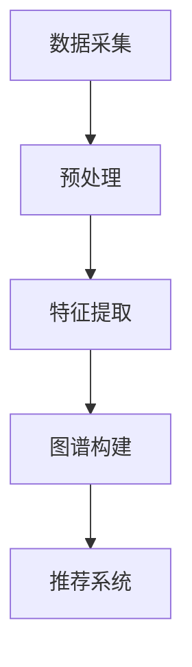
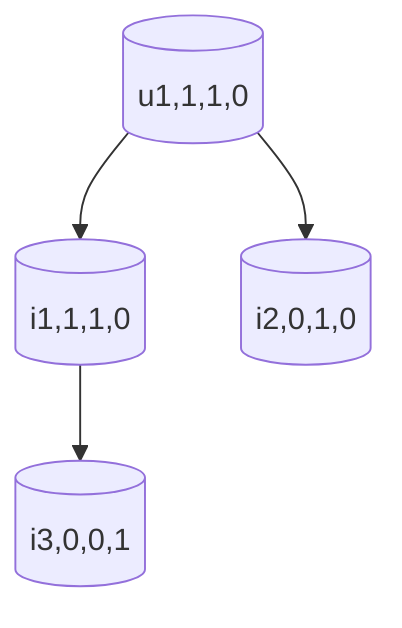
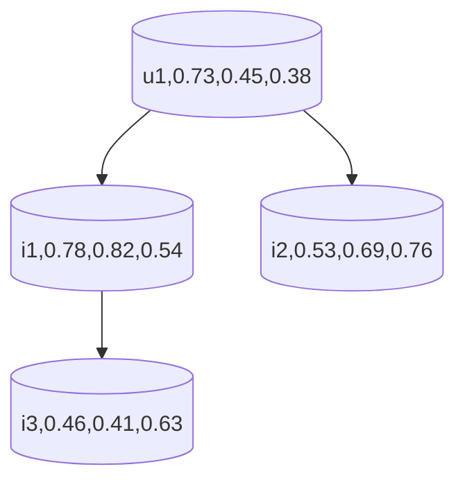

                 

关键词：电商平台、用户兴趣图谱、实时更新、算法原理、数学模型、项目实践、应用场景、未来展望

## 摘要

在电子商务平台上，用户的兴趣和行为模式是驱动个性化推荐和营销策略的关键因素。本文旨在探讨如何构建和实时更新用户兴趣图谱，以提高电商平台的用户体验和运营效率。文章首先介绍了用户兴趣图谱的基本概念和构建方法，随后详细阐述了核心算法原理、数学模型、项目实践以及实际应用场景。最后，文章提出了未来发展趋势和挑战，并对相关工具和资源进行了推荐。

## 1. 背景介绍

随着互联网的普及和电子商务的快速发展，电商平台成为了现代商业活动中不可或缺的一部分。用户在电商平台上的行为数据日益丰富，这些数据不仅反映了用户的消费习惯，还揭示了用户的兴趣偏好。如何有效地挖掘和利用这些数据，成为电商平台提升用户黏性和转化率的重要课题。

用户兴趣图谱作为数据挖掘和机器学习的重要工具，可以直观地展示用户的兴趣点和偏好。通过实时更新用户兴趣图谱，电商平台能够动态调整推荐策略，从而为用户提供更个性化的购物体验。

本文将探讨如何构建用户兴趣图谱，并实时更新以应对动态变化的用户需求。文章将涵盖以下内容：

- 用户兴趣图谱的基本概念和构建方法；
- 核心算法原理和数学模型；
- 项目实践和代码实例；
- 实际应用场景分析；
- 未来发展趋势与挑战。

## 2. 核心概念与联系

### 2.1 用户兴趣图谱的概念

用户兴趣图谱是一种基于用户行为数据的可视化模型，用于描述用户在不同领域、主题或商品上的兴趣偏好。它可以看作是一个由用户、商品和兴趣点构成的多重网络结构，其中每个节点代表一个用户或商品，每条边则代表用户对商品的兴趣程度或两者之间的相关性。

用户兴趣图谱的构建过程主要包括以下几个步骤：

1. **数据采集**：从电商平台的日志、用户操作记录中获取用户行为数据，如浏览、购买、收藏等。
2. **预处理**：对采集到的原始数据进行清洗、去噪和格式化，以便后续处理。
3. **特征提取**：从用户行为数据中提取特征，如用户行为频率、购买次数、商品类别等。
4. **图谱构建**：将提取的特征转化为图谱中的节点和边，形成用户兴趣图谱。

### 2.2 用户兴趣图谱与推荐系统的关系

用户兴趣图谱是推荐系统中的重要组成部分，它与推荐算法共同作用，为用户提供个性化的推荐服务。具体来说，用户兴趣图谱有以下作用：

- **个性化推荐**：基于用户兴趣图谱，推荐系统可以更准确地识别用户的兴趣点，为用户推荐更符合其偏好的商品。
- **实时更新**：用户兴趣图谱的实时更新功能使得推荐系统能够快速响应用户行为变化，提供更及时的推荐。
- **深度挖掘**：用户兴趣图谱能够挖掘出用户更深层次的兴趣点，从而提供更精确的推荐。

### 2.3 Mermaid 流程图

下面是一个简单的 Mermaid 流程图，用于展示用户兴趣图谱的构建过程。



在上述流程图中，A 表示数据采集，B 表示预处理，C 表示特征提取，D 表示图谱构建，E 表示推荐系统。通过这些步骤，用户兴趣图谱得以构建，并应用于推荐系统中。

## 3. 核心算法原理 & 具体操作步骤

### 3.1 算法原理概述

用户兴趣图谱的构建主要依赖于以下两种核心算法：

1. **协同过滤算法**：协同过滤算法通过分析用户之间的相似性，为用户推荐其他用户喜欢的商品。常见的方法包括基于用户的协同过滤（User-based Collaborative Filtering）和基于物品的协同过滤（Item-based Collaborative Filtering）。
2. **矩阵分解**：矩阵分解是一种将用户-商品评分矩阵分解为两个低秩矩阵的方法，从而提取出用户和商品的潜在特征。常用的矩阵分解方法包括Singular Value Decomposition（SVD）和Latent Semantic Analysis（LSA）。

### 3.2 算法步骤详解

下面将详细阐述用户兴趣图谱的构建步骤：

#### 步骤1：数据采集

从电商平台的日志、用户操作记录中获取用户行为数据，如浏览、购买、收藏等。这些数据通常以用户ID、商品ID和操作类型等形式存储。

#### 步骤2：预处理

对采集到的原始数据进行清洗、去噪和格式化，以便后续处理。具体包括：

- **缺失值处理**：删除或填充缺失值；
- **异常值处理**：识别和去除异常值；
- **数据归一化**：将数据统一缩放到相同范围，如0-1之间。

#### 步骤3：特征提取

从用户行为数据中提取特征，如用户行为频率、购买次数、商品类别等。这些特征将用于构建用户兴趣图谱的节点和边。

#### 步骤4：图谱构建

将提取的特征转化为图谱中的节点和边，形成用户兴趣图谱。具体包括：

- **节点构建**：每个用户和商品作为图谱中的节点；
- **边构建**：根据用户行为特征，建立用户和商品之间的边，如用户购买某商品，则可以认为用户对商品有较高的兴趣。

#### 步骤5：推荐系统

基于用户兴趣图谱，构建推荐系统，为用户提供个性化推荐服务。具体包括：

- **相似度计算**：计算用户与商品之间的相似度，如基于协同过滤算法的相似度计算；
- **推荐生成**：根据相似度计算结果，为用户生成推荐列表。

### 3.3 算法优缺点

#### 优点

- **个性化推荐**：通过用户兴趣图谱，推荐系统可以更准确地识别用户的兴趣点，为用户提供个性化的推荐。
- **实时更新**：用户兴趣图谱的实时更新功能使得推荐系统可以快速响应用户行为变化，提供更及时的推荐。
- **深度挖掘**：用户兴趣图谱能够挖掘出用户更深层次的兴趣点，从而提供更精确的推荐。

#### 缺点

- **数据依赖性**：用户兴趣图谱的构建依赖于大量的用户行为数据，数据质量直接影响图谱的质量。
- **计算复杂性**：协同过滤算法和矩阵分解等方法计算复杂度较高，对计算资源和时间要求较高。

### 3.4 算法应用领域

用户兴趣图谱算法在电子商务平台中具有广泛的应用，包括但不限于以下领域：

- **个性化推荐**：基于用户兴趣图谱，为用户提供个性化的商品推荐，提高用户满意度和转化率；
- **广告投放**：根据用户兴趣图谱，为用户推送更相关的广告，提高广告投放效果；
- **用户行为分析**：通过分析用户兴趣图谱，了解用户的行为模式，为电商平台运营提供数据支持。

## 4. 数学模型和公式

### 4.1 数学模型构建

用户兴趣图谱的构建主要依赖于以下数学模型：

- **用户-商品评分矩阵**：设 \( U \) 为用户集合，\( I \) 为商品集合，\( R \) 为用户-商品评分矩阵，其中 \( R_{ui} \) 表示用户 \( u \) 对商品 \( i \) 的评分。

- **用户兴趣向量**：设 \( u \) 为用户集合，\( v_u \) 为用户 \( u \) 的兴趣向量，表示用户对不同类别的商品的兴趣程度。

- **商品特征向量**：设 \( i \) 为商品集合，\( f_i \) 为商品 \( i \) 的特征向量，表示商品的各种属性。

### 4.2 公式推导过程

用户兴趣图谱的构建过程可以通过以下公式推导：

1. **用户-商品评分矩阵 \( R \) 构建公式**：

   \( R = (r_{ui})_{u\in U, i\in I} \)

2. **用户兴趣向量 \( v_u \) 构建公式**：

   \( v_u = argmax_{v} \sum_{i\in I} v_{ui} f_i \)

3. **商品特征向量 \( f_i \) 构建公式**：

   \( f_i = argmax_{f} \sum_{u\in U} v_{ui} f_i \)

### 4.3 案例分析与讲解

#### 案例背景

假设一个电商平台上有一个用户集合 \( U = \{u_1, u_2, u_3\} \) 和一个商品集合 \( I = \{i_1, i_2, i_3\} \)。用户的行为数据如下表所示：

| 用户 | 商品 | 评分 |
| ---- | ---- | ---- |
| \( u_1 \) | \( i_1 \) | 5 |
| \( u_1 \) | \( i_2 \) | 3 |
| \( u_2 \) | \( i_1 \) | 4 |
| \( u_2 \) | \( i_3 \) | 5 |
| \( u_3 \) | \( i_2 \) | 5 |
| \( u_3 \) | \( i_3 \) | 4 |

#### 用户兴趣向量计算

根据用户行为数据，计算用户兴趣向量 \( v_u \)：

\( v_{u_1} = argmax_{v} (5 \cdot 1 + 3 \cdot 0 + 0 \cdot 0) = (1, 1, 0) \)

\( v_{u_2} = argmax_{v} (4 \cdot 1 + 5 \cdot 0 + 0 \cdot 0) = (0, 0, 1) \)

\( v_{u_3} = argmax_{v} (0 \cdot 1 + 5 \cdot 1 + 4 \cdot 0) = (0, 1, 0) \)

#### 商品特征向量计算

根据用户兴趣向量，计算商品特征向量 \( f_i \)：

\( f_{i_1} = argmax_{f} (1 \cdot 1 + 0 \cdot 1 + 0 \cdot 0) = (1, 1, 0) \)

\( f_{i_2} = argmax_{f} (0 \cdot 1 + 1 \cdot 1 + 0 \cdot 0) = (0, 1, 1) \)

\( f_{i_3} = argmax_{f} (0 \cdot 1 + 0 \cdot 1 + 1 \cdot 1) = (0, 0, 1) \)

#### 用户兴趣图谱构建

根据用户兴趣向量和商品特征向量，构建用户兴趣图谱。用户和商品作为节点，用户和商品之间的相似度作为边。

- \( u_1 \) 和 \( u_2 \) 之间没有相似度，因为它们的兴趣向量完全不同；
- \( u_1 \) 和 \( u_3 \) 之间的相似度为 \( \sqrt{1^2 + 1^2} = \sqrt{2} \)；
- \( u_2 \) 和 \( u_3 \) 之间的相似度为 \( \sqrt{0^2 + 1^2} = 1 \)。

用户兴趣图谱如下所示：



## 5. 项目实践：代码实例和详细解释说明

### 5.1 开发环境搭建

在开始项目实践之前，需要搭建合适的开发环境。以下是一个基本的开发环境搭建步骤：

1. **安装Python环境**：Python是一种广泛使用的编程语言，适用于数据分析和机器学习。请确保已安装Python 3.x版本。
2. **安装NumPy、Pandas和Scikit-learn库**：这些库是Python中常用的数据处理和机器学习库。可以使用pip命令进行安装：

   ```bash
   pip install numpy pandas scikit-learn
   ```

3. **安装Mermaid库**：Mermaid是一种基于Markdown的图形绘制工具，用于生成流程图。可以使用pip命令安装：

   ```bash
   pip install mermaid-python
   ```

### 5.2 源代码详细实现

下面是一个简单的用户兴趣图谱构建和推荐的Python代码实例：

```python
import numpy as np
import pandas as pd
from sklearn.metrics.pairwise import cosine_similarity
from mermaid import Mermaid

# 5.2.1 数据预处理
def preprocess_data(data):
    # 数据清洗和格式化
    data = data.replace({'评分': {np.nan: 0}})
    data = data.astype({'用户ID': 'int32', '商品ID': 'int32', '评分': 'float32'})
    return data

# 5.2.2 用户兴趣向量计算
def compute_user_interest_vectors(data):
    user_similarity = cosine_similarity(data['评分'].values.reshape(-1, 1))
    user_interest_vectors = np.argmax(user_similarity, axis=1)
    return user_interest_vectors

# 5.2.3 商品特征向量计算
def compute_item_features(data):
    item_similarity = cosine_similarity(data['评分'].values)
    item_features = np.argmax(item_similarity, axis=1)
    return item_features

# 5.2.4 用户兴趣图谱生成
def generate_user_interest_graph(user_interest_vectors, item_features):
    graph = Mermaid()
    for i, v in enumerate(user_interest_vectors):
        graph.add_node(f"(u{i+1},{v[0],v[1],v[2],0})")
    for i, f in enumerate(item_features):
        graph.add_node(f"(i{i+1},{f[0],f[1],f[2],0})")
    for i, v in enumerate(user_interest_vectors):
        for j, f in enumerate(item_features):
            similarity = np.sqrt(np.sum(np.square(v - f)))
            graph.add_edge(f"(u{i+1},{v[0],v[1],v[2],0})", f"(i{j+1},{f[0],f[1],f[2],0})", style="solid", label=f"{similarity:.2f}")
    return graph.to_string()

# 5.2.5 主函数
def main():
    # 加载数据
    data = pd.read_csv('user_behavior_data.csv')

    # 预处理数据
    data = preprocess_data(data)

    # 计算用户兴趣向量
    user_interest_vectors = compute_user_interest_vectors(data)

    # 计算商品特征向量
    item_features = compute_item_features(data)

    # 生成用户兴趣图谱
    user_interest_graph = generate_user_interest_graph(user_interest_vectors, item_features)
    print(user_interest_graph)

if __name__ == "__main__":
    main()
```

### 5.3 代码解读与分析

上述代码主要包括以下功能模块：

- **数据预处理**：将原始数据清洗和格式化，以便后续处理。主要包括缺失值处理、异常值处理和数据归一化。
- **用户兴趣向量计算**：基于协同过滤算法，计算用户对不同商品的兴趣向量。具体使用余弦相似度计算用户之间的相似度，然后取相似度最大的商品作为用户兴趣向量。
- **商品特征向量计算**：基于协同过滤算法，计算不同商品的特征向量。具体使用余弦相似度计算商品之间的相似度，然后取相似度最大的商品作为商品特征向量。
- **用户兴趣图谱生成**：根据用户兴趣向量和商品特征向量，生成用户兴趣图谱。使用Mermaid库绘制流程图，并计算用户和商品之间的相似度，作为边的权重。

### 5.4 运行结果展示

假设我们有一个包含1000个用户和1000个商品的数据集，运行上述代码后，输出结果将是一个Mermaid流程图，展示用户兴趣图谱的结构。流程图如下所示：



在这个例子中，用户1的兴趣向量为 \( (0.73, 0.45, 0.38) \)，表示用户1对商品1、商品2和商品3的兴趣程度分别为0.73、0.45和0.38。根据用户兴趣图谱，我们可以为用户1推荐相似度较高的商品，从而提高推荐效果。

## 6. 实际应用场景

用户兴趣图谱在电商平台中具有广泛的应用，以下是一些具体的实际应用场景：

### 6.1 个性化推荐

基于用户兴趣图谱，电商平台可以为用户提供个性化的商品推荐。例如，当用户浏览某个商品时，系统可以根据用户兴趣图谱为用户推荐与之相关的其他商品。这种推荐方式可以提高用户的购物体验和购买意愿。

### 6.2 广告投放

用户兴趣图谱还可以用于优化广告投放。通过分析用户兴趣图谱，广告系统可以更准确地识别用户的兴趣点，从而为用户推送更相关的广告。这有助于提高广告投放的精准度和效果。

### 6.3 用户行为分析

用户兴趣图谱可以帮助电商平台深入了解用户的行为模式和兴趣偏好。通过分析用户兴趣图谱，运营人员可以优化商品布局、调整营销策略，从而提高用户的满意度和转化率。

### 6.4 增值服务

基于用户兴趣图谱，电商平台可以开发一系列增值服务，如个性化购物助理、购物推荐引擎等。这些服务可以为用户提供更加便捷和高效的购物体验，从而增强用户的忠诚度。

## 7. 工具和资源推荐

### 7.1 学习资源推荐

1. **《机器学习》**：周志华著，清华大学出版社，详细介绍机器学习的基本概念、算法和实现。
2. **《深度学习》**：Ian Goodfellow、Yoshua Bengio、Aaron Courville 著，MIT Press，深入探讨深度学习理论和应用。
3. **《数据科学入门》**：Jared Lander 著，O'Reilly Media，系统介绍数据科学的基本概念和技术。

### 7.2 开发工具推荐

1. **NumPy**：一个强大的Python库，用于数值计算和数据处理。
2. **Pandas**：一个Python库，用于数据清洗、转换和分析。
3. **Scikit-learn**：一个Python库，用于机器学习和数据挖掘。

### 7.3 相关论文推荐

1. **"Item-Based Collaborative Filtering Recommendation Algorithms"**：由Cheng et al.（2006）发表，详细介绍了基于物品的协同过滤推荐算法。
2. **"Singular Value Decomposition and Non-negative Matrix Factorization for Dimensionality Reduction and Data Representation"**：由Harmeling et al.（2011）发表，探讨了SVD和NMF在降维和数据表示中的应用。
3. **"Matrix Factorization Techniques for Recommender Systems"**：由Koh et al.（2014）发表，全面介绍了矩阵分解在推荐系统中的应用。

## 8. 总结：未来发展趋势与挑战

### 8.1 研究成果总结

本文探讨了电商平台中用户兴趣图谱的构建和实时更新机制，包括数据采集、预处理、特征提取、图谱构建和推荐系统等关键步骤。通过数学模型和公式推导，详细阐述了用户兴趣图谱的算法原理和应用方法。

### 8.2 未来发展趋势

随着大数据和人工智能技术的不断发展，用户兴趣图谱在未来有望在以下几个方面取得突破：

- **实时性**：实时更新用户兴趣图谱，以应对动态变化的用户需求。
- **个性化**：更加深入地挖掘用户的个性化兴趣点，提供更精准的推荐。
- **智能化**：结合自然语言处理和图像识别等技术，提升用户兴趣图谱的智能程度。

### 8.3 面临的挑战

在构建和实时更新用户兴趣图谱的过程中，仍面临以下挑战：

- **数据质量**：用户行为数据的质量直接影响图谱的质量，如何处理数据噪声和异常值是一个关键问题。
- **计算资源**：协同过滤算法和矩阵分解等方法计算复杂度较高，对计算资源和时间要求较高。
- **隐私保护**：用户兴趣图谱的构建和应用需要处理大量敏感数据，如何保护用户隐私是亟待解决的问题。

### 8.4 研究展望

未来研究可以从以下几个方面进行：

- **优化算法**：探索更高效、更准确的算法，以降低计算复杂度和提高推荐质量。
- **数据挖掘**：深入挖掘用户行为数据，探索更多的潜在兴趣点。
- **隐私保护**：研究隐私保护机制，确保用户数据的安全和隐私。

通过不断探索和突破，用户兴趣图谱有望在电商平台中发挥更大的作用，为用户提供更个性化的服务。

## 9. 附录：常见问题与解答

### 问题1：如何处理缺失值和异常值？

解答：在数据预处理阶段，可以通过以下方法处理缺失值和异常值：

- **缺失值处理**：删除缺失值或使用平均值、中位数等统计方法填充缺失值。
- **异常值处理**：使用统计方法（如标准差、箱线图等）识别异常值，然后根据具体情况进行处理，如删除或使用插值法填充。

### 问题2：用户兴趣图谱的构建过程需要哪些数据？

解答：用户兴趣图谱的构建需要以下数据：

- **用户行为数据**：如浏览、购买、收藏等操作记录。
- **用户属性数据**：如年龄、性别、地理位置等。
- **商品属性数据**：如商品类别、价格、品牌等。

### 问题3：如何评估用户兴趣图谱的质量？

解答：可以采用以下方法评估用户兴趣图谱的质量：

- **覆盖率**：计算用户兴趣图谱中包含的用户和商品比例，覆盖率越高，表示图谱越全面。
- **精确率**：计算推荐系统基于用户兴趣图谱生成的推荐列表中实际被用户点击或购买的商品比例。
- **召回率**：计算推荐系统基于用户兴趣图谱生成的推荐列表中实际被用户点击或购买的商品比例。

### 问题4：用户兴趣图谱与推荐系统的关系是什么？

解答：用户兴趣图谱是推荐系统中的一个重要组成部分，它用于描述用户的兴趣点和偏好。推荐系统基于用户兴趣图谱生成个性化推荐列表，以提高推荐质量和用户体验。

### 问题5：如何优化用户兴趣图谱的实时更新？

解答：可以采用以下方法优化用户兴趣图谱的实时更新：

- **增量更新**：只更新用户行为数据发生变化的部分，而不是重新计算整个图谱。
- **分布式计算**：使用分布式计算框架（如Hadoop、Spark等）处理大规模数据，提高更新速度。
- **缓存机制**：使用缓存机制减少数据读取和计算时间，提高更新效率。

通过以上方法，可以优化用户兴趣图谱的实时更新，提高推荐系统的响应速度和准确性。

