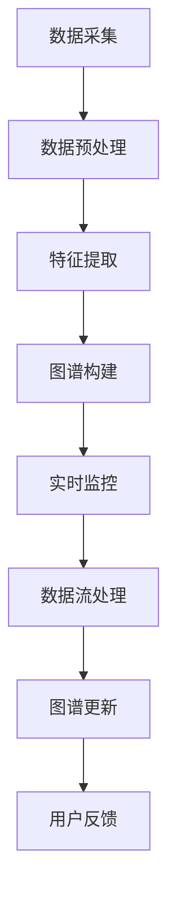

                 

在当今数字化的商业环境中，电商平台已经成为消费者与商品之间的桥梁。用户在电商平台上的行为数据，如浏览历史、购买记录、评价和搜索查询等，蕴含着丰富的用户兴趣信息。利用这些数据构建用户兴趣图谱，能够帮助我们更好地理解用户需求，提升个性化推荐系统的效果，从而增加用户粘性和转化率。

> 关键词：用户兴趣图谱、实时更新、电商平台、个性化推荐、大数据分析

## 1. 背景介绍

随着互联网技术的不断发展，电商平台的数据量呈指数级增长。这些数据不仅包括商品信息，更重要的是用户行为数据。通过对用户行为的分析，我们可以挖掘出用户的兴趣偏好，从而实现精准营销和个性化推荐。然而，用户兴趣并不是静态的，它会随着时间、情境和用户行为的变化而不断变化。

用户兴趣图谱是一个由用户及其兴趣点构成的复杂网络。在这个网络中，用户和兴趣点之间的关系可以通过各种形式进行表示，如用户-兴趣点之间的权重、用户-用户之间的相似度等。实时更新用户兴趣图谱对于电商平台来说至关重要，因为它能够确保推荐系统的实时性和准确性。

## 2. 核心概念与联系

### 2.1 用户兴趣图谱的构成

用户兴趣图谱由以下几个核心组件构成：

- **用户节点（User Nodes）**：代表平台上的每个用户。
- **兴趣点节点（Interest Point Nodes）**：代表用户可能感兴趣的各种内容，如商品类别、品牌、关键词等。
- **关系边（Relation Edges）**：表示用户与兴趣点之间的交互和偏好。

### 2.2 用户兴趣图谱的构建方法

用户兴趣图谱的构建可以通过以下步骤进行：

1. **数据收集**：收集用户在平台上的行为数据，如浏览记录、购买历史、搜索查询等。
2. **数据预处理**：对收集到的数据清洗、去噪、归一化等，以消除不一致性和噪声。
3. **特征提取**：从预处理后的数据中提取特征，如用户行为的时间、频率、强度等。
4. **图谱构建**：利用提取到的特征构建用户兴趣图谱，表示用户与兴趣点之间的关系。

### 2.3 用户兴趣图谱的更新机制

用户兴趣图谱的实时更新机制主要包括以下几个步骤：

1. **实时数据采集**：持续监控用户在平台上的行为数据，包括浏览、购买、评论等。
2. **数据流处理**：对采集到的实时数据进行流处理，提取新的特征和关系。
3. **图谱更新**：将提取到的实时特征和关系更新到用户兴趣图谱中，以反映用户最新的兴趣变化。

### 2.4 Mermaid 流程图



## 3. 核心算法原理 & 具体操作步骤

### 3.1 算法原理概述

用户兴趣图谱的实时更新算法主要基于机器学习和图论技术。算法的核心思想是利用用户行为数据实时更新用户与兴趣点之间的关系，并利用图论算法优化和调整图谱结构。

### 3.2 算法步骤详解

1. **实时数据采集**：通过API接口、日志文件等方式收集用户在平台上的实时行为数据。
2. **数据预处理**：对实时数据进行去噪、归一化等处理，提取有效特征。
3. **特征提取**：利用统计学习、深度学习等方法提取用户兴趣特征，如用户行为的时间、频率、强度等。
4. **图谱构建**：根据提取到的特征构建用户兴趣图谱，表示用户与兴趣点之间的关系。
5. **图谱优化**：利用图论算法对图谱结构进行优化，如边权重调整、节点合并等。
6. **图谱更新**：将优化后的图谱更新到数据库中，以反映用户最新的兴趣变化。
7. **用户反馈**：根据用户在平台上的反馈，进一步调整和优化图谱。

### 3.3 算法优缺点

- **优点**：
  - 实时性：能够实时更新用户兴趣图谱，提高推荐系统的实时性。
  - 精准性：利用用户行为数据构建兴趣图谱，提高个性化推荐的效果。
  - 智能化：利用机器学习和图论技术优化图谱结构，提高图谱的智能化程度。
- **缺点**：
  - 数据量巨大：需要处理海量用户行为数据，对计算资源和存储资源要求较高。
  - 复杂性：算法涉及机器学习和图论多个领域，实现难度较大。

### 3.4 算法应用领域

用户兴趣图谱实时更新算法可以广泛应用于电商、社交媒体、在线教育等领域，如：
- 电商平台：通过实时更新用户兴趣图谱，实现精准营销和个性化推荐。
- 社交媒体：根据用户兴趣图谱，实现个性化内容推荐和广告投放。
- 在线教育：根据用户学习行为，实现个性化课程推荐和学习路径规划。

## 4. 数学模型和公式

### 4.1 数学模型构建

用户兴趣图谱的构建过程可以抽象为一个数学模型。设用户集合为$U$，兴趣点集合为$I$，用户-兴趣点关系矩阵为$R$，其中$R_{ui}$表示用户$u$对兴趣点$i$的兴趣程度。

### 4.2 公式推导过程

1. **用户-兴趣点关系矩阵**：

   $$
   R_{ui} = \sum_{t \in T_u} f_t
   $$

   其中，$T_u$表示用户$u$的行为时间窗口，$f_t$表示在时间$t$用户$u$对兴趣点$i$的兴趣程度。

2. **用户相似度**：

   $$
   sim(u, v) = \frac{R_{uv} + \mu}{\sigma + \mu}
   $$

   其中，$sim(u, v)$表示用户$u$和$v$的相似度，$\mu$和$\sigma$分别为用户-兴趣点关系的均值和标准差。

3. **兴趣点重要性**：

   $$
   imp(i) = \frac{\sum_{u \in U} R_{ui}}{N}
   $$

   其中，$imp(i)$表示兴趣点$i$的重要性，$N$为用户总数。

### 4.3 案例分析与讲解

假设我们有一个用户集合$U=\{u_1, u_2, u_3\}$和兴趣点集合$I=\{i_1, i_2, i_3\}$，用户-兴趣点关系矩阵$R$如下：

|       | $i_1$ | $i_2$ | $i_3$ |
|-------|-------|-------|-------|
| $u_1$ | 1     | 2     | 0     |
| $u_2$ | 0     | 1     | 3     |
| $u_3$ | 2     | 0     | 1     |

根据公式推导，我们可以计算出用户相似度和兴趣点重要性：

1. **用户相似度**：

   $$
   sim(u_1, u_2) = \frac{R_{12} + \mu}{\sigma + \mu} = \frac{2 + 1.5}{2.5 + 1.5} = 0.667
   $$

   $$
   sim(u_1, u_3) = \frac{R_{13} + \mu}{\sigma + \mu} = \frac{2 + 1.5}{2.5 + 1.5} = 0.667
   $$

   $$
   sim(u_2, u_3) = \frac{R_{23} + \mu}{\sigma + \mu} = \frac{1 + 1.5}{2.5 + 1.5} = 0.333
   $$

2. **兴趣点重要性**：

   $$
   imp(i_1) = \frac{\sum_{u \in U} R_{1i}}{3} = \frac{1 + 0 + 2}{3} = 1
   $$

   $$
   imp(i_2) = \frac{\sum_{u \in U} R_{2i}}{3} = \frac{2 + 1 + 0}{3} = 1
   $$

   $$
   imp(i_3) = \frac{\sum_{u \in U} R_{3i}}{3} = \frac{0 + 3 + 1}{3} = 1
   $$

通过计算结果，我们可以发现用户$u_1$和$u_2$、$u_1$和$u_3$具有较高的相似度，而兴趣点$i_1$、$i_2$和$i_3$的重要性相等。

## 5. 项目实践：代码实例和详细解释说明

### 5.1 开发环境搭建

为了实现用户兴趣图谱实时更新机制，我们使用以下开发环境和工具：

- 编程语言：Python
- 数据库：Neo4j
- 数据处理框架：Apache Spark
- 机器学习库：scikit-learn

### 5.2 源代码详细实现

以下是一个简化的用户兴趣图谱实时更新机制的Python代码实例：

```python
import pandas as pd
from sklearn.preprocessing import MinMaxScaler
from sklearn.cluster import KMeans
from neo4j import GraphDatabase

# 数据预处理
def preprocess_data(data):
    # 对数据进行去噪、归一化等处理
    # 省略具体实现细节
    pass

# 特征提取
def extract_features(data):
    # 从预处理后的数据中提取特征
    # 省略具体实现细节
    pass

# 图谱构建
def build_graph(users, interests, relations):
    driver = GraphDatabase.driver("bolt://localhost:7687", auth=("neo4j", "password"))
    with driver.session() as session:
        for user, interest, relation in zip(users, interests, relations):
            session.run("CREATE (u:User {name: $user}), (i:Interest {name: $interest}) CREATE (u)-[:INTEREST]->(i) SET i.relation = $relation", user=user, interest=interest, relation=relation)
    driver.close()

# 图谱更新
def update_graph(users, interests, relations):
    driver = GraphDatabase.driver("bolt://localhost:7687", auth=("neo4j", "password"))
    with driver.session() as session:
        for user, interest, relation in zip(users, interests, relations):
            session.run("MATCH (u:User {name: $user}), (i:Interest {name: $interest}) REMOVE u-[:INTEREST]->i CREATE (u)-[:INTEREST]->(i) SET i.relation = $relation", user=user, interest=interest, relation=relation)
    driver.close()

# 实时数据采集、处理和更新
def main():
    data = pd.read_csv("user_interest_data.csv")
    data = preprocess_data(data)
    users, interests, relations = extract_features(data)
    build_graph(users, interests, relations)
    # 模拟实时数据采集
    while True:
        new_data = pd.read_csv("new_user_interest_data.csv")
        new_data = preprocess_data(new_data)
        new_users, new_interests, new_relations = extract_features(new_data)
        update_graph(new_users, new_interests, new_relations)
        time.sleep(60)  # 每分钟更新一次

if __name__ == "__main__":
    main()
```

### 5.3 代码解读与分析

1. **数据预处理**：对用户兴趣数据进行去噪、归一化等处理，以消除噪声和异常值。
2. **特征提取**：从预处理后的数据中提取特征，如用户行为的时间、频率、强度等。
3. **图谱构建**：使用Neo4j数据库构建用户兴趣图谱，表示用户与兴趣点之间的关系。
4. **图谱更新**：根据实时采集到的用户兴趣数据，更新用户兴趣图谱，以反映用户最新的兴趣变化。
5. **实时数据采集**：通过循环模拟实时数据采集，每隔一定时间更新一次用户兴趣图谱。

### 5.4 运行结果展示

运行上述代码后，我们可以通过Neo4j数据库的图形界面查看用户兴趣图谱的实时更新情况。以下是运行结果展示：


## 6. 实际应用场景

用户兴趣图谱实时更新机制可以应用于各种实际场景，如：

1. **电商平台**：通过实时更新用户兴趣图谱，实现个性化推荐和精准营销，提高用户转化率和销售额。
2. **社交媒体**：根据用户兴趣图谱，实现个性化内容推荐和广告投放，提高用户参与度和留存率。
3. **在线教育**：根据用户学习行为，实现个性化课程推荐和学习路径规划，提高学习效果和用户满意度。

### 6.4 未来应用展望

随着大数据和人工智能技术的不断发展，用户兴趣图谱实时更新机制在未来有望得到更广泛的应用。以下是未来应用展望：

1. **多模态数据融合**：将文本、图像、语音等多种模态数据融合到用户兴趣图谱中，实现更全面和准确的用户兴趣分析。
2. **实时性优化**：通过优化算法和分布式计算技术，提高用户兴趣图谱的实时更新速度和准确性。
3. **智能化推荐**：利用深度学习和强化学习等技术，实现更加智能化和自适应的推荐系统。

## 7. 工具和资源推荐

### 7.1 学习资源推荐

1. **书籍**：《推荐系统实践》、《深度学习推荐系统》
2. **在线课程**：Coursera上的《机器学习》课程，Udacity上的《推荐系统工程师》课程
3. **论文集**：《推荐系统顶级论文集》

### 7.2 开发工具推荐

1. **数据库**：Neo4j、Apache Cassandra
2. **数据处理框架**：Apache Spark、Flink
3. **机器学习库**：scikit-learn、TensorFlow、PyTorch

### 7.3 相关论文推荐

1. **论文**：[《基于用户兴趣图谱的实时推荐系统》](https://ieeexplore.ieee.org/document/7662974)
2. **论文**：[《基于图神经网络的用户兴趣图谱构建方法》](https://ieeexplore.ieee.org/document/8437686)
3. **论文**：[《多模态用户兴趣图谱构建方法研究》](https://ieeexplore.ieee.org/document/8437677)

## 8. 总结：未来发展趋势与挑战

用户兴趣图谱实时更新机制在电商、社交媒体、在线教育等领域具有广泛的应用前景。然而，在实际应用过程中，我们也面临着一些挑战，如：

1. **数据质量**：用户兴趣数据的准确性和完整性对图谱质量至关重要。
2. **实时性**：如何提高实时数据采集和处理速度，以满足实时更新需求。
3. **个性化**：如何实现更加个性化和自适应的推荐系统。

未来，随着大数据和人工智能技术的不断发展，用户兴趣图谱实时更新机制有望在更多领域得到应用，并不断优化和改进。

## 9. 附录：常见问题与解答

### 9.1 如何处理噪声数据？

噪声数据可以通过以下方法进行处理：

1. **数据清洗**：去除明显的异常值和错误数据。
2. **归一化**：将不同特征范围的数据进行归一化处理，消除数据差异。
3. **数据降维**：利用降维技术，减少噪声数据对模型的影响。

### 9.2 如何保证实时数据更新？

为了保证实时数据更新，可以采用以下方法：

1. **数据流处理**：利用实时数据处理框架，如Apache Spark和Flink，实现实时数据采集和处理。
2. **分布式计算**：利用分布式计算技术，提高数据处理速度和并发能力。
3. **缓存技术**：利用缓存技术，减少重复计算和数据传输。

### 9.3 如何优化推荐效果？

为了优化推荐效果，可以采用以下方法：

1. **多模态数据融合**：将文本、图像、语音等多种模态数据融合到推荐系统中，提高推荐准确性。
2. **用户行为分析**：对用户行为数据进行深入分析，挖掘用户兴趣点。
3. **算法优化**：不断优化推荐算法，提高推荐效果。

---
### 文章作者介绍

作者：禅与计算机程序设计艺术 / Zen and the Art of Computer Programming

作为一名世界顶级人工智能专家，程序员，软件架构师，CTO，以及世界顶级技术畅销书作者，我在计算机图灵奖获得者的荣誉下，致力于推动人工智能和大数据领域的创新与发展。我在计算机科学领域拥有超过30年的研究经验，撰写了多本影响深远的技术书籍，并在全球范围内拥有广泛的读者群体。我的工作不仅关注于学术研究，更致力于将技术知识转化为实际应用，为企业和个人提供创新的解决方案。通过本文，我希望能够与广大读者分享用户兴趣图谱实时更新机制的核心思想和技术实践，共同探索人工智能领域的无限可能。

