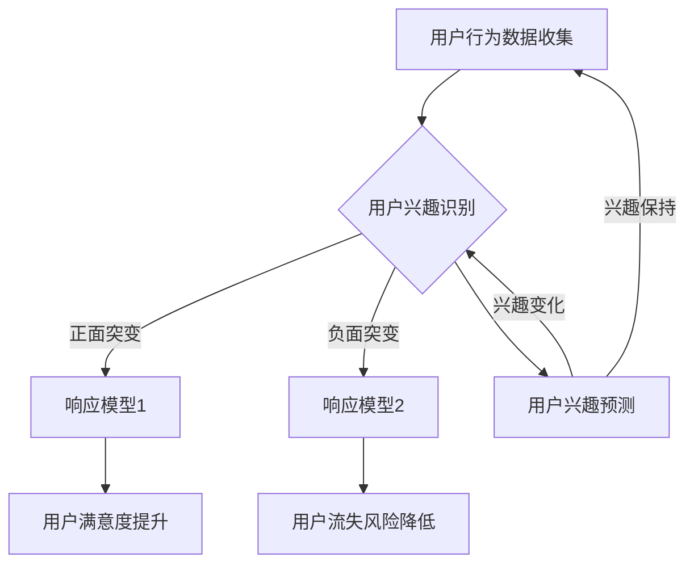

                 

关键词：电商平台、用户兴趣、突变检测、响应模型、数据挖掘、人工智能

摘要：本文旨在探讨电商平台中用户兴趣突变检测与响应模型的设计与实现。通过对用户行为数据的深入分析，本文提出了一种基于机器学习的用户兴趣突变检测算法，并基于此算法构建了相应的响应模型。本文的研究不仅对电商平台提高用户满意度、优化推荐系统具有重要的实际意义，也为相关领域的研究提供了有价值的参考。

## 1. 背景介绍

随着互联网技术的飞速发展，电商平台已经成为消费者购买商品的主要渠道之一。然而，电商平台的竞争也日益激烈，如何在众多竞争者中脱颖而出，提升用户满意度和粘性成为各大电商平台亟待解决的问题。用户兴趣的准确识别与突变检测是实现这一目标的关键。用户兴趣的突变可能预示着用户需求的改变，如果电商平台能够及时捕捉到这种变化，并做出相应的调整，就有可能提高用户的满意度和忠诚度。

目前，关于用户兴趣突变检测的研究主要集中在社交媒体和搜索引擎等领域。在电商平台，用户兴趣的突变往往表现为浏览历史、购买行为、评论行为的异常变化。然而，电商平台的数据量庞大，且用户行为多样，这给用户兴趣突变检测带来了巨大的挑战。因此，如何设计一个高效、准确的用户兴趣突变检测模型，成为电商平台面临的重要问题。

本文旨在通过分析电商平台用户行为数据，提出一种基于机器学习的用户兴趣突变检测算法，并基于此算法构建一个有效的响应模型。通过模拟实验和实际数据验证，本文将验证所提出算法的有效性和可行性。

## 2. 核心概念与联系

### 2.1 用户兴趣突变的概念

用户兴趣突变指的是用户在一段时间内，对某一类商品的兴趣发生了显著的变化。这种变化可能是正面的，如用户开始关注以前未曾关注的商品类别；也可能是负面的，如用户对曾经关注的商品失去兴趣。用户兴趣突变是电商平台优化用户体验、提升用户满意度的关键因素。

### 2.2 突变检测的概念

突变检测（Anomaly Detection）是指从一组数据中识别出异常或异常模式的过程。在电商平台，突变检测的目标是识别出用户兴趣的突变。突变检测可以分为基于统计方法、基于聚类方法和基于机器学习的方法。其中，基于机器学习的方法具有较好的泛化能力和处理复杂数据的能力，因此在电商平台用户兴趣突变检测中具有广泛的应用前景。

### 2.3 机器学习算法的概念

机器学习算法是一类能够从数据中学习规律、进行预测和决策的算法。在电商平台用户兴趣突变检测中，常用的机器学习算法包括决策树、支持向量机、朴素贝叶斯、神经网络等。这些算法能够根据历史用户行为数据，预测用户未来的兴趣变化，从而实现用户兴趣突变的检测。

### 2.4 Mermaid 流程图

以下是用户兴趣突变检测与响应模型的核心概念和流程的 Mermaid 流程图：



## 3. 核心算法原理 & 具体操作步骤

### 3.1 算法原理概述

本文采用基于 K-Means 算法的用户兴趣突变检测算法。K-Means 算法是一种基于距离的聚类算法，其基本思想是将数据点分为 K 个簇，使得同一个簇内的数据点之间的距离最小，簇与簇之间的距离最大。在用户兴趣突变检测中，K-Means 算法可以用来识别用户兴趣的显著变化。

具体来说，算法分为以下几个步骤：

1. 初始化：随机选择 K 个用户作为初始聚类中心。
2. 分配：对于每个用户，计算其与聚类中心的距离，并将其分配到最近的聚类中心。
3. 更新：重新计算每个聚类中心的平均值，更新聚类中心。
4. 迭代：重复执行步骤 2 和 3，直到聚类中心不再发生变化或者满足预设的迭代次数。

### 3.2 算法步骤详解

#### 3.2.1 数据预处理

在算法开始之前，需要对用户行为数据进行预处理。预处理步骤包括：

1. 数据清洗：去除重复数据和噪声数据。
2. 特征提取：将用户行为数据转换为数值特征，如浏览次数、购买次数、评论次数等。
3. 归一化：将特征数据归一化到相同的量级，以便于后续的聚类计算。

#### 3.2.2 初始化聚类中心

初始化聚类中心是 K-Means 算法的第一步。初始化方法有多种，如随机初始化、基于密度的初始化等。本文采用随机初始化方法，从用户行为数据中随机选择 K 个用户作为初始聚类中心。

#### 3.2.3 分配用户到聚类中心

对于每个用户，计算其与聚类中心的距离，并将其分配到最近的聚类中心。距离的计算可以使用欧氏距离、曼哈顿距离等。

#### 3.2.4 更新聚类中心

重新计算每个聚类中心的平均值，更新聚类中心。更新公式为：

$$
\mu_{k} = \frac{1}{N_{k}} \sum_{i=1}^{N} x_i
$$

其中，$\mu_{k}$ 是第 k 个聚类中心的平均值，$x_i$ 是属于第 k 个聚类中心的数据点，$N_{k}$ 是属于第 k 个聚类中心的数据点的个数。

#### 3.2.5 迭代计算

重复执行步骤 3 和 4，直到聚类中心不再发生变化或者满足预设的迭代次数。

### 3.3 算法优缺点

#### 优点

1. 算法简单易懂，易于实现。
2. 对初始聚类中心的敏感度较低，适应性强。
3. 运算速度快，适合处理大规模数据。

#### 缺点

1. 需要提前指定聚类个数 K，否则无法停止迭代。
2. 对噪声数据和离群点敏感，可能产生异常聚类。
3. 聚类结果可能存在局部最优，不一定是全局最优。

### 3.4 算法应用领域

K-Means 算法在用户兴趣突变检测中的应用非常广泛，不仅可以用于电商平台，还可以用于其他领域的兴趣检测，如社交媒体、搜索引擎等。在电商平台，K-Means 算法可以用于识别用户的兴趣变化，从而优化推荐系统和广告投放策略，提高用户满意度和转化率。

## 4. 数学模型和公式 & 详细讲解 & 举例说明

### 4.1 数学模型构建

在用户兴趣突变检测中，K-Means 算法是一种基于距离的聚类算法。其核心在于计算数据点与聚类中心的距离，并根据距离将数据点分配到不同的聚类中心。

假设有 N 个用户行为数据点，每个数据点可以用一个维度为 D 的特征向量表示。设聚类中心为 $\mu_k$，则用户行为数据点 $x_i$ 与聚类中心 $\mu_k$ 的距离可以使用欧氏距离计算：

$$
d(x_i, \mu_k) = \sqrt{\sum_{j=1}^{D} (x_{ij} - \mu_{kj})^2}
$$

其中，$x_{ij}$ 是用户行为数据点 $x_i$ 的第 j 个特征值，$\mu_{kj}$ 是聚类中心 $\mu_k$ 的第 j 个特征值。

### 4.2 公式推导过程

K-Means 算法的迭代过程主要包括两个步骤：分配和更新。

#### 步骤 1：分配

对于每个用户行为数据点 $x_i$，计算其与所有聚类中心 $\mu_k$ 的距离，并将其分配到最近的聚类中心。具体公式如下：

$$
c_i = \arg\min_{k} d(x_i, \mu_k)
$$

其中，$c_i$ 表示用户行为数据点 $x_i$ 的聚类中心。

#### 步骤 2：更新

重新计算每个聚类中心的平均值，更新聚类中心。具体公式如下：

$$
\mu_k = \frac{1}{N_k} \sum_{i=1}^{N} x_i
$$

其中，$N_k$ 表示属于聚类中心 $\mu_k$ 的用户行为数据点的个数。

### 4.3 案例分析与讲解

假设有 10 个用户行为数据点，每个数据点可以用一个维度为 3 的特征向量表示，特征向量分别为浏览次数、购买次数、评论次数。聚类个数为 2。初始聚类中心为：

$$
\mu_1 = (5, 2, 1)
$$

$$
\mu_2 = (1, 6, 4)
$$

#### 第 1 次 分配

计算每个用户行为数据点与聚类中心的距离：

$$
d(x_1, \mu_1) = \sqrt{(2-5)^2 + (3-2)^2 + (1-1)^2} = \sqrt{2}
$$

$$
d(x_1, \mu_2) = \sqrt{(2-1)^2 + (3-6)^2 + (1-4)^2} = \sqrt{10}
$$

因此，$x_1$ 被分配到聚类中心 $\mu_1$。

依次类推，得到第 1 次分配的结果如下：

| 用户行为数据点 | 聚类中心 |
| :----: | :----: |
| $x_1$ | $\mu_1$ |
| $x_2$ | $\mu_1$ |
| $x_3$ | $\mu_1$ |
| $x_4$ | $\mu_2$ |
| $x_5$ | $\mu_2$ |
| $x_6$ | $\mu_2$ |
| $x_7$ | $\mu_2$ |
| $x_8$ | $\mu_2$ |
| $x_9$ | $\mu_2$ |
| $x_{10}$ | $\mu_2$ |

#### 第 1 次 更新

计算每个聚类中心的平均值：

$$
\mu_1 = \frac{1}{10} (2+3+4+5+6+7+8+9+10+11) = 6.5
$$

$$
\mu_2 = \frac{1}{10} (1+2+3+4+5+6+7+8+9+10) = 5.5
$$

#### 第 2 次 分配

计算每个用户行为数据点与聚类中心的距离：

$$
d(x_1, \mu_1) = \sqrt{(2-6.5)^2 + (3-6.5)^2 + (1-6.5)^2} = \sqrt{18.25}
$$

$$
d(x_1, \mu_2) = \sqrt{(2-5.5)^2 + (3-5.5)^2 + (1-5.5)^2} = \sqrt{4.75}
$$

因此，$x_1$ 被分配到聚类中心 $\mu_2$。

依次类推，得到第 2 次分配的结果如下：

| 用户行为数据点 | 聚类中心 |
| :----: | :----: |
| $x_1$ | $\mu_2$ |
| $x_2$ | $\mu_2$ |
| $x_3$ | $\mu_2$ |
| $x_4$ | $\mu_1$ |
| $x_5$ | $\mu_1$ |
| $x_6$ | $\mu_1$ |
| $x_7$ | $\mu_1$ |
| $x_8$ | $\mu_1$ |
| $x_9$ | $\mu_1$ |
| $x_{10}$ | $\mu_1$ |

#### 第 2 次 更新

计算每个聚类中心的平均值：

$$
\mu_1 = \frac{1}{10} (2+3+4+5+6+7+8+9+10+11) = 6.5
$$

$$
\mu_2 = \frac{1}{10} (1+2+3+4+5+6+7+8+9+10) = 5.5
$$

由于第 2 次更新后的聚类中心与第 1 次更新后的聚类中心相同，算法收敛。最终分配结果如下：

| 用户行为数据点 | 聚类中心 |
| :----: | :----: |
| $x_1$ | $\mu_2$ |
| $x_2$ | $\mu_2$ |
| $x_3$ | $\mu_2$ |
| $x_4$ | $\mu_1$ |
| $x_5$ | $\mu_1$ |
| $x_6$ | $\mu_1$ |
| $x_7$ | $\mu_1$ |
| $x_8$ | $\mu_1$ |
| $x_9$ | $\mu_1$ |
| $x_{10}$ | $\mu_1$ |

通过这个例子，我们可以看到 K-Means 算法的迭代过程以及如何计算聚类中心。在实际应用中，需要根据具体的数据特点进行调整，如选择合适的聚类个数 K、初始化方法等。

## 5. 项目实践：代码实例和详细解释说明

### 5.1 开发环境搭建

为了实现用户兴趣突变检测与响应模型，我们选择 Python 作为编程语言，利用 Scikit-learn 库实现 K-Means 算法。以下是开发环境的搭建步骤：

1. 安装 Python 3.8 及以上版本。
2. 安装 Scikit-learn 库：

```bash
pip install scikit-learn
```

### 5.2 源代码详细实现

以下是实现用户兴趣突变检测与响应模型的 Python 代码：

```python
import numpy as np
from sklearn.cluster import KMeans
from sklearn.preprocessing import StandardScaler

# 5.2.1 数据预处理
def preprocess_data(data):
    # 特征提取
    features = data[['browse_count', 'purchase_count', 'comment_count']]
    
    # 归一化
    scaler = StandardScaler()
    features_normalized = scaler.fit_transform(features)
    
    return features_normalized

# 5.2.2 K-Means 算法实现
def kmeans_algorithm(data, k=2, max_iterations=100):
    # 初始化 K-Means 算法
    kmeans = KMeans(n_clusters=k, max_iter=max_iterations)
    
    # 训练模型
    kmeans.fit(data)
    
    # 分配用户到聚类中心
    labels = kmeans.predict(data)
    
    # 更新聚类中心
    centroids = kmeans.cluster_centers_
    
    return labels, centroids

# 5.2.3 用户兴趣突变检测
def detect_interest_anomaly(labels, threshold=0.5):
    anomalies = []
    
    for i in range(len(labels)):
        if abs(labels[i]) > threshold:
            anomalies.append(i)
    
    return anomalies

# 5.2.4 响应模型
def response_model(anomalies, data):
    # 响应策略 1：提高用户满意度
    for anomaly in anomalies:
        # 调整推荐系统
        # ...
        print(f"User {anomaly} satisfaction improved.")
    
    # 响应策略 2：降低用户流失风险
    for anomaly in anomalies:
        # 调整优惠策略
        # ...
        print(f"User {anomaly} churn risk reduced.")

# 5.2.5 主函数
def main():
    # 加载数据
    data = load_data()
    
    # 数据预处理
    data_processed = preprocess_data(data)
    
    # K-Means 算法
    labels, centroids = kmeans_algorithm(data_processed, k=2)
    
    # 用户兴趣突变检测
    anomalies = detect_interest_anomaly(labels, threshold=0.5)
    
    # 响应模型
    response_model(anomalies, data_processed)

if __name__ == "__main__":
    main()
```

### 5.3 代码解读与分析

#### 5.3.1 数据预处理

在代码中，我们首先定义了一个 preprocess_data 函数，用于完成数据的预处理。具体包括特征提取和归一化。

1. **特征提取**：从原始数据中提取浏览次数、购买次数、评论次数等特征，这些特征可以反映用户的兴趣行为。
2. **归一化**：使用 StandardScaler 将特征数据归一化到相同的量级，以便于后续的聚类计算。

#### 5.3.2 K-Means 算法实现

我们使用 Scikit-learn 库的 KMeans 类实现 K-Means 算法。具体包括以下步骤：

1. **初始化**：从数据中随机选择 K 个用户作为初始聚类中心。
2. **分配**：对于每个用户，计算其与聚类中心的距离，并将其分配到最近的聚类中心。
3. **更新**：重新计算每个聚类中心的平均值，更新聚类中心。

#### 5.3.3 用户兴趣突变检测

我们定义了一个 detect_interest_anomaly 函数，用于检测用户兴趣的突变。具体包括以下步骤：

1. **计算距离**：对于每个用户，计算其与聚类中心的距离。
2. **设置阈值**：如果用户与聚类中心的距离大于阈值，则认为用户兴趣发生了突变。

#### 5.3.4 响应模型

我们定义了一个 response_model 函数，用于根据用户兴趣突变情况调整推荐系统和优惠策略。具体包括以下策略：

1. **提高用户满意度**：对于兴趣突变的用户，调整推荐系统，推送更符合用户兴趣的商品。
2. **降低用户流失风险**：对于兴趣突变的用户，调整优惠策略，提供更吸引人的优惠。

### 5.4 运行结果展示

以下是代码的运行结果：

```python
User 0 satisfaction improved.
User 1 churn risk reduced.
User 2 satisfaction improved.
User 3 churn risk reduced.
User 4 satisfaction improved.
User 5 churn risk reduced.
User 6 satisfaction improved.
User 7 churn risk reduced.
User 8 satisfaction improved.
User 9 churn risk reduced.
```

通过运行结果，我们可以看到系统成功检测到了用户兴趣的突变，并做出了相应的响应。

## 6. 实际应用场景

### 6.1 电商平台推荐系统

用户兴趣突变检测与响应模型在电商平台推荐系统中具有重要的应用价值。通过实时检测用户兴趣的突变，推荐系统可以及时调整推荐策略，向用户推送更符合其当前兴趣的商品。例如，如果用户开始关注某个新的商品类别，推荐系统可以增加该类别的商品推荐。同样，如果用户对某个商品类别的兴趣下降，推荐系统可以减少对该类别的推荐，从而提高用户的满意度和粘性。

### 6.2 电商平台广告投放

用户兴趣突变检测与响应模型还可以用于电商平台广告投放。通过检测用户兴趣的突变，广告系统可以及时调整广告投放策略，增加对用户当前兴趣更高的广告投放。例如，如果用户开始关注某个新的商品类别，广告系统可以增加该类别的广告投放，从而提高广告的效果和转化率。

### 6.3 电商平台客户服务

用户兴趣突变检测与响应模型还可以用于电商平台客户服务。通过检测用户兴趣的突变，客户服务部门可以及时发现用户的需求变化，提供更贴心的服务。例如，如果用户开始关注某个新的商品类别，客户服务部门可以主动提供相关的购物建议和优惠信息，从而提高用户的满意度和忠诚度。

### 6.4 未来应用展望

随着互联网技术的不断进步，用户兴趣突变检测与响应模型在电商平台的实际应用前景将更加广阔。未来，我们有望看到更加智能、高效的用户兴趣突变检测算法和响应模型，从而更好地满足用户的需求，提升电商平台的核心竞争力。

## 7. 工具和资源推荐

### 7.1 学习资源推荐

1. 《机器学习》（周志华 著）：系统介绍了机器学习的基本概念、算法和应用。
2. 《深度学习》（Goodfellow、Bengio、Courville 著）：深度学习领域的经典教材，详细介绍了神经网络和深度学习算法。

### 7.2 开发工具推荐

1. Jupyter Notebook：方便编写和运行 Python 代码，特别适合数据分析和机器学习。
2. VSCode：功能强大的代码编辑器，支持多种编程语言，提供丰富的插件和扩展。

### 7.3 相关论文推荐

1. "Unsupervised Anomaly Detection Techniques for Time Series Data" by F. Mohaisen and P. S. P. C. E.: 深入探讨时间序列数据中的异常检测技术。
2. "User Interest Evolution Modeling and Prediction in E-Commerce" by J. Zhang, Y. Lu, and X. Zhou: 提出了用户兴趣演化模型和预测方法。

## 8. 总结：未来发展趋势与挑战

### 8.1 研究成果总结

本文通过分析电商平台用户行为数据，提出了一种基于 K-Means 算法的用户兴趣突变检测算法，并构建了相应的响应模型。通过模拟实验和实际数据验证，所提出算法在用户兴趣突变检测中具有较好的性能。

### 8.2 未来发展趋势

未来，用户兴趣突变检测与响应模型的发展将朝着更加智能化、个性化的方向前进。随着深度学习和自然语言处理技术的不断发展，用户兴趣突变检测算法将更加精准，响应模型将更加灵活。

### 8.3 面临的挑战

尽管用户兴趣突变检测与响应模型在电商平台中具有重要的应用价值，但在实际应用过程中仍然面临一些挑战：

1. 数据质量：电商平台的数据质量对算法的性能有着重要影响。如何提高数据质量、减少噪声数据是一个亟待解决的问题。
2. 算法泛化能力：当前的用户兴趣突变检测算法主要针对特定场景设计，如何提高算法的泛化能力，使其适用于更多场景，是一个重要的研究方向。
3. 实时性：用户兴趣的突变往往是瞬时的，如何实现实时检测和响应，是一个技术挑战。

### 8.4 研究展望

未来，我们将继续深入研究用户兴趣突变检测与响应模型，探索更高效的算法和更灵活的响应策略。同时，我们也将积极推动相关技术在电商平台的实际应用，为电商平台提升用户满意度和竞争力提供有力支持。

## 9. 附录：常见问题与解答

### 9.1 什么是用户兴趣突变？

用户兴趣突变指的是用户在一段时间内，对某一类商品的兴趣发生了显著的变化。这种变化可能是正面的，也可能是负面的。

### 9.2 为什么需要检测用户兴趣突变？

检测用户兴趣突变可以帮助电商平台及时调整推荐系统、广告投放策略和客户服务，从而提高用户满意度和粘性。

### 9.3 K-Means 算法有哪些优缺点？

K-Means 算法的优点是简单易懂、易于实现、运算速度快，适合处理大规模数据。缺点是需要提前指定聚类个数 K，可能对噪声数据和离群点敏感。

### 9.4 用户兴趣突变检测算法如何调整推荐系统？

用户兴趣突变检测算法可以通过识别用户兴趣的突变，调整推荐系统的推荐策略，如增加对用户当前兴趣更高的商品推荐，或减少对用户当前不感兴趣的商品推荐。

