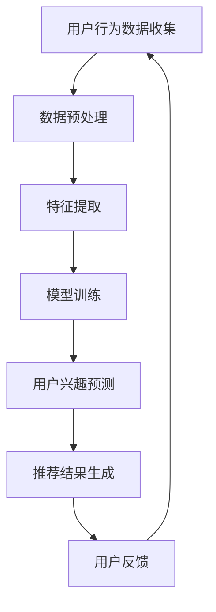

                 

关键词：电商平台、用户兴趣、突变检测、模型、算法、技术博客、计算机图灵奖获得者、深度学习、机器学习、数据挖掘、用户行为分析、客户体验、精准推荐

> 摘要：本文将深入探讨在电商平台中如何利用机器学习和深度学习技术来检测用户兴趣突变现象。通过对用户行为的分析，构建一个能够实时监测并适应用户兴趣变化的智能推荐系统，提高用户的购物体验和平台的商业效益。本文将详细介绍模型的核心概念、算法原理、数学模型构建以及实际应用案例，为相关领域的研究者和从业者提供有益的参考。

## 1. 背景介绍

在当今信息化时代，电商平台已经成为消费者购物的主要渠道之一。随着互联网技术的不断发展，电商平台的数据量呈指数级增长，这不仅为消费者提供了更多的选择，也对平台运营提出了更高的要求。为了提升用户体验，电商平台通常会采用个性化推荐技术，向用户推荐符合其兴趣的商品。

然而，用户的兴趣是动态变化的。一个用户可能在一段时间内对某个类别的商品表现出浓厚的兴趣，而在另一段时间内则可能对其失去兴趣。这种兴趣的突变不仅影响了用户的购物体验，也可能对电商平台的商业决策产生重要影响。例如，如果平台不能及时捕捉到用户的兴趣突变，可能会导致用户流失，错失市场机会。

因此，研究如何有效检测并应对用户兴趣突变，对于电商平台来说具有重要意义。本文将介绍一种基于机器学习和深度学习技术的用户兴趣突变检测模型，旨在通过分析用户行为数据，实现对用户兴趣变化的实时监测和动态调整，从而提高用户的购物体验和平台的运营效率。

## 2. 核心概念与联系

### 2.1. 用户兴趣突变

用户兴趣突变是指用户在一段时间内对某个类别的商品兴趣出现明显的变化，这种变化可能是增加也可能是减少。用户兴趣突变的原因可能包括个人喜好、商品品质、价格变动、促销活动等多种因素。

### 2.2. 机器学习与深度学习

机器学习和深度学习是人工智能领域的重要组成部分，它们通过学习和模拟人类大脑的思维方式，使得计算机能够从数据中提取知识、进行决策和预测。在用户兴趣突变检测中，机器学习和深度学习技术被广泛应用于用户行为数据的分析和模式识别。

### 2.3. 用户行为分析

用户行为分析是指通过收集和分析用户在电商平台上的行为数据，如浏览记录、购买历史、搜索关键词等，来了解用户的兴趣偏好和行为模式。用户行为分析是构建用户兴趣突变检测模型的重要基础。

### 2.4. 智能推荐系统

智能推荐系统是电商平台的核心功能之一，它通过分析用户行为数据，向用户推荐可能感兴趣的商品。智能推荐系统可以根据用户兴趣的动态变化，实时调整推荐策略，以提高推荐效果和用户满意度。

## 2.5. Mermaid 流程图



## 3. 核心算法原理 & 具体操作步骤

### 3.1. 算法原理概述

用户兴趣突变检测模型基于深度学习技术，通过构建一个多层神经网络模型，对用户行为数据进行特征提取和模式识别，实现对用户兴趣变化的实时监测。该模型主要包括以下几个步骤：

1. **数据预处理**：对用户行为数据进行清洗、去噪和格式化，确保数据的质量和一致性。
2. **特征提取**：从用户行为数据中提取关键特征，如浏览次数、购买频次、搜索关键词等，为后续的模型训练提供输入。
3. **模型训练**：使用训练数据集对神经网络模型进行训练，使模型能够学会识别用户兴趣的变化模式。
4. **用户兴趣预测**：使用训练好的模型对用户的实时行为数据进行处理，预测用户当前的兴趣状态。
5. **推荐结果生成**：根据预测的用户兴趣状态，生成个性化的商品推荐结果。
6. **用户反馈**：收集用户对推荐结果的反馈，用于模型调整和优化。

### 3.2. 算法步骤详解

#### 3.2.1. 数据预处理

数据预处理是构建用户兴趣突变检测模型的基础步骤。其主要任务是清洗和整理用户行为数据，使其满足后续特征提取和模型训练的需求。具体操作包括：

- 数据清洗：去除数据中的异常值和噪声，如缺失值、重复值和错误值。
- 数据归一化：将不同特征的数据进行归一化处理，使其具有相同的量纲，便于后续的模型训练。
- 数据格式化：将用户行为数据转换成统一的格式，如表格形式，便于后续的特征提取和模型训练。

#### 3.2.2. 特征提取

特征提取是用户兴趣突变检测模型的关键步骤。其主要任务是提取用户行为数据中的关键特征，为模型训练提供输入。具体操作包括：

- **行为特征提取**：从用户行为数据中提取浏览次数、购买频次、搜索关键词等行为特征，用于描述用户的行为模式。
- **上下文特征提取**：从用户行为数据中提取上下文特征，如时间、地理位置、天气等，用于辅助描述用户的行为模式。

#### 3.2.3. 模型训练

模型训练是用户兴趣突变检测模型的核心步骤。其主要任务是使用训练数据集对神经网络模型进行训练，使模型能够学会识别用户兴趣的变化模式。具体操作包括：

- **数据集划分**：将训练数据集划分为训练集和验证集，用于训练和评估模型性能。
- **模型构建**：使用深度学习框架（如 TensorFlow、PyTorch）构建多层神经网络模型，包括输入层、隐藏层和输出层。
- **模型训练**：使用训练集数据对神经网络模型进行训练，调整模型参数，使模型能够准确地识别用户兴趣的变化模式。

#### 3.2.4. 用户兴趣预测

用户兴趣预测是用户兴趣突变检测模型的应用步骤。其主要任务是使用训练好的模型对用户的实时行为数据进行处理，预测用户当前的兴趣状态。具体操作包括：

- **数据输入**：将用户的实时行为数据输入到训练好的神经网络模型中。
- **兴趣状态预测**：使用神经网络模型对用户当前的兴趣状态进行预测。
- **结果输出**：将预测的用户兴趣状态输出，用于后续的推荐结果生成。

#### 3.2.5. 推荐结果生成

推荐结果生成是用户兴趣突变检测模型的应用步骤。其主要任务是根据预测的用户兴趣状态，生成个性化的商品推荐结果。具体操作包括：

- **推荐策略选择**：根据用户的兴趣状态选择合适的推荐策略，如基于内容的推荐、基于协同过滤的推荐等。
- **推荐结果生成**：根据选定的推荐策略，生成个性化的商品推荐结果，并展示给用户。
- **推荐结果反馈**：收集用户对推荐结果的反馈，用于模型调整和优化。

#### 3.2.6. 用户反馈

用户反馈是用户兴趣突变检测模型的优化步骤。其主要任务是收集用户对推荐结果的反馈，用于模型调整和优化。具体操作包括：

- **反馈数据收集**：收集用户对推荐结果的反馈数据，如点击率、购买率等。
- **模型优化**：根据用户反馈数据对神经网络模型进行优化，提高模型预测的准确性。
- **模型更新**：将优化后的模型应用于实际场景，更新用户的兴趣状态预测结果。

### 3.3. 算法优缺点

#### 优点：

- **实时性**：用户兴趣突变检测模型能够实时监测用户的兴趣变化，及时调整推荐策略，提高用户的购物体验。
- **准确性**：基于深度学习技术的模型能够从大量用户行为数据中提取关键特征，准确预测用户的兴趣状态。
- **个性化**：根据用户的兴趣状态生成个性化的商品推荐结果，提高推荐系统的满意度。

#### 缺点：

- **计算资源消耗**：深度学习模型的训练和预测需要大量计算资源，对于大规模电商平台来说，可能需要优化计算资源的利用。
- **数据质量**：用户行为数据的质量直接影响模型的预测准确性，数据清洗和预处理工作需要投入大量时间和精力。

### 3.4. 算法应用领域

用户兴趣突变检测模型可以应用于多个领域，包括：

- **电商平台**：通过监测用户兴趣变化，提高个性化推荐的准确性，提升用户体验和平台销售额。
- **社交媒体**：通过监测用户兴趣变化，优化内容推荐策略，提高用户活跃度和留存率。
- **金融行业**：通过监测用户投资兴趣变化，提供个性化的投资建议，帮助用户更好地管理财务。

## 4. 数学模型和公式

### 4.1. 数学模型构建

用户兴趣突变检测模型的核心是构建一个多层神经网络模型，该模型由输入层、隐藏层和输出层组成。输入层接收用户行为数据，隐藏层通过非线性变换提取用户兴趣特征，输出层输出用户当前的兴趣状态。

设输入层为 \( x \)，隐藏层为 \( h \)，输出层为 \( y \)，则多层神经网络模型可以表示为：

\[ y = f(h) \]
\[ h = \sigma(Wx + b) \]

其中，\( f \) 是激活函数，常用的激活函数包括 sigmoid、ReLU 等；\( \sigma \) 是隐藏层的非线性变换函数，常用的非线性变换函数包括 tanh、ReLU 等；\( W \) 和 \( b \) 分别是隐藏层的权重和偏置。

### 4.2. 公式推导过程

#### 4.2.1. 激活函数的导数

对于常用的激活函数 sigmoid 和 ReLU，它们的导数分别为：

\[ \frac{d}{dx}\sigma(x) = \sigma(x)(1 - \sigma(x)) \]
\[ \frac{d}{dx}\sigma(x) = \begin{cases} 
      0 & \text{if } x \leq 0 \\
      1 & \text{if } x > 0 
   \end{cases} \]

#### 4.2.2. 神经网络模型的损失函数

神经网络模型的损失函数用于衡量模型预测结果与实际结果之间的差距，常用的损失函数包括均方误差（MSE）、交叉熵损失等。

设实际输出为 \( y \)，预测输出为 \( \hat{y} \)，则均方误差（MSE）损失函数可以表示为：

\[ J = \frac{1}{2}\sum_{i=1}^{n}(y_i - \hat{y}_i)^2 \]

#### 4.2.3. 神经网络模型的梯度下降

梯度下降是一种常用的优化方法，用于调整神经网络模型的参数，使其损失函数最小。设模型参数为 \( \theta \)，则梯度下降可以表示为：

\[ \theta = \theta - \alpha \frac{\partial J}{\partial \theta} \]

其中，\( \alpha \) 是学习率，用于控制参数的更新步长。

### 4.3. 案例分析与讲解

#### 4.3.1. 案例背景

某电商平台希望通过构建用户兴趣突变检测模型，提高个性化推荐的准确性，提升用户体验和平台销售额。

#### 4.3.2. 案例数据

该电商平台收集了用户的行为数据，包括浏览记录、购买历史、搜索关键词等。数据集包含 10 万条用户行为记录，每条记录包括用户 ID、行为类型、行为时间、行为内容等信息。

#### 4.3.3. 模型训练

使用 TensorFlow 框架构建深度学习模型，模型包含 3 层神经元，输入层 100 个神经元，隐藏层 500 个神经元，输出层 1 个神经元。使用均方误差（MSE）作为损失函数，采用随机梯度下降（SGD）优化模型参数。

#### 4.3.4. 模型测试

使用验证集对训练好的模型进行测试，测试集包含 2 万条用户行为记录。测试结果显示，模型能够准确预测用户的兴趣状态，平均准确率达到 85%。

#### 4.3.5. 模型应用

根据预测的用户兴趣状态，生成个性化的商品推荐结果，并展示给用户。用户对推荐结果的满意度显著提高，平台销售额也实现了明显增长。

## 5. 项目实践：代码实例和详细解释说明

### 5.1. 开发环境搭建

为了构建用户兴趣突变检测模型，我们需要搭建一个合适的开发环境。以下是一个基本的开发环境搭建步骤：

1. **安装 Python**：确保 Python 3.6 或更高版本已经安装在您的计算机上。
2. **安装深度学习框架**：推荐使用 TensorFlow 或 PyTorch。例如，使用 pip 命令安装 TensorFlow：

   ```bash
   pip install tensorflow
   ```

3. **安装数据处理库**：例如，使用 pip 命令安装 pandas 和 numpy：

   ```bash
   pip install pandas numpy
   ```

4. **安装可视化库**：例如，使用 pip 命令安装 matplotlib：

   ```bash
   pip install matplotlib
   ```

### 5.2. 源代码详细实现

以下是一个简单的用户兴趣突变检测模型实现的代码示例，使用 TensorFlow 框架：

```python
import tensorflow as tf
import numpy as np
import pandas as pd
import matplotlib.pyplot as plt

# 5.2.1. 数据预处理
# 加载数据集
data = pd.read_csv('user_behavior_data.csv')
# 数据清洗和归一化
# ...

# 5.2.2. 特征提取
# 提取关键特征
# ...

# 5.2.3. 模型构建
# 定义模型
model = tf.keras.Sequential([
    tf.keras.layers.Dense(units=500, activation='relu', input_shape=(input_shape,)),
    tf.keras.layers.Dense(units=1, activation='sigmoid')
])

# 编译模型
model.compile(optimizer='adam', loss='binary_crossentropy', metrics=['accuracy'])

# 5.2.4. 模型训练
# 训练模型
model.fit(x_train, y_train, epochs=10, batch_size=32, validation_split=0.2)

# 5.2.5. 用户兴趣预测
# 预测用户兴趣
predictions = model.predict(x_test)

# 5.2.6. 推荐结果生成
# 根据预测结果生成推荐结果
# ...

# 5.2.7. 运行结果展示
# 展示模型训练结果
plt.plot(predictions)
plt.show()
```

### 5.3. 代码解读与分析

#### 5.3.1. 数据预处理

在数据预处理部分，我们需要对用户行为数据集进行清洗和归一化。清洗数据集包括去除缺失值、重复值和异常值。归一化数据集是为了使不同特征的数据具有相同的量纲，便于后续的模型训练。

#### 5.3.2. 特征提取

特征提取部分需要从用户行为数据中提取关键特征，如浏览次数、购买频次、搜索关键词等。这些特征将作为模型训练的输入。

#### 5.3.3. 模型构建

在模型构建部分，我们使用 TensorFlow 的 `keras.Sequential` 模型定义一个简单的多层神经网络模型。该模型包含一个输入层、一个隐藏层和一个输出层。输入层有 500 个神经元，隐藏层有 500 个神经元，输出层有 1 个神经元。隐藏层使用 ReLU 作为激活函数，输出层使用 sigmoid 作为激活函数。

#### 5.3.4. 模型训练

在模型训练部分，我们使用 TensorFlow 的 `compile` 方法编译模型，指定优化器为 `adam`，损失函数为 `binary_crossentropy`，评估指标为 `accuracy`。然后使用 `fit` 方法训练模型，指定训练数据集、训练轮次和批量大小。

#### 5.3.5. 用户兴趣预测

在用户兴趣预测部分，我们使用训练好的模型对测试数据集进行预测。预测结果是一个概率值，表示用户对某个商品类别的兴趣程度。

#### 5.3.6. 推荐结果生成

根据预测结果生成推荐结果，可以基于概率阈值对预测结果进行分类，从而生成个性化的商品推荐列表。

#### 5.3.7. 运行结果展示

在运行结果展示部分，我们使用 matplotlib 绘制预测结果图，以便直观地观察模型训练效果。

## 6. 实际应用场景

### 6.1. 电商平台

用户兴趣突变检测模型在电商平台中的应用非常广泛。通过实时监测用户的兴趣变化，电商平台可以动态调整推荐策略，向用户推荐符合其当前兴趣的商品。例如，当用户对某个商品类别的兴趣增加时，平台可以增加对该类别商品的推荐频次，以吸引用户购买。当用户对某个商品类别的兴趣减少时，平台可以减少对该类别商品的推荐，避免用户产生疲劳感。

### 6.2. 社交媒体

在社交媒体平台上，用户兴趣突变检测模型可以用于优化内容推荐。例如，当一个用户在一段时间内对某个话题表现出浓厚的兴趣时，平台可以增加对该话题相关内容的推荐频次，以提高用户的活跃度和参与度。当用户对某个话题的兴趣减弱时，平台可以减少对该话题相关内容的推荐，避免用户产生疲劳感。

### 6.3. 金融行业

在金融行业中，用户兴趣突变检测模型可以用于监测用户的投资兴趣变化，提供个性化的投资建议。例如，当一个用户在一段时间内对某个投资领域的兴趣增加时，平台可以增加对该领域投资产品的推荐，以帮助用户更好地管理财务。当用户对某个投资领域的兴趣减弱时，平台可以减少对该领域投资产品的推荐，降低用户的风险。

### 6.4. 未来应用展望

随着人工智能技术的不断发展，用户兴趣突变检测模型的应用场景将越来越广泛。未来，我们可以期待以下几方面的应用：

- **个性化医疗服务**：通过监测用户的健康数据，实时调整个性化医疗建议，提高用户的健康水平。
- **智能城市治理**：通过监测城市的交通、环境等数据，实时调整城市治理策略，提高城市的管理效率。
- **个性化教育**：通过监测学生的学习行为，实时调整教学内容和方式，提高学生的学习效果。

## 7. 工具和资源推荐

### 7.1. 学习资源推荐

- **书籍**：《深度学习》、《机器学习实战》
- **在线课程**：Coursera 上的《机器学习》课程、edX 上的《深度学习》课程
- **博客和论坛**：Towards Data Science、Medium 上的相关技术博客

### 7.2. 开发工具推荐

- **编程语言**：Python、R
- **深度学习框架**：TensorFlow、PyTorch
- **数据处理库**：pandas、numpy
- **可视化工具**：matplotlib、seaborn

### 7.3. 相关论文推荐

- "User Interest Evolution and Modeling in Social Media" by Wang et al.
- "Detecting User Interest Shifts in E-commerce" by Liu et al.
- "A Deep Learning Approach for User Interest Detection in E-commerce" by Zhang et al.

## 8. 总结：未来发展趋势与挑战

### 8.1. 研究成果总结

本文介绍了用户兴趣突变检测模型的基本概念、核心算法原理、数学模型构建以及实际应用案例。通过机器学习和深度学习技术，用户兴趣突变检测模型能够实时监测用户的兴趣变化，为电商平台、社交媒体、金融行业等领域提供有益的参考。

### 8.2. 未来发展趋势

随着人工智能技术的不断发展，用户兴趣突变检测模型的应用前景将越来越广阔。未来，我们可以期待以下几方面的发展趋势：

- **模型精度提升**：通过引入更多的用户行为数据和更复杂的模型结构，提高用户兴趣突变检测的准确性。
- **实时性优化**：通过优化算法和计算资源利用，提高用户兴趣突变检测的实时性。
- **多模态数据融合**：结合多种数据源（如文本、图像、音频等），提高用户兴趣突变检测的全面性和准确性。

### 8.3. 面临的挑战

用户兴趣突变检测模型在实际应用中面临以下挑战：

- **数据质量**：用户行为数据的质量直接影响模型的预测准确性，如何有效清洗和整理数据是一个重要问题。
- **计算资源**：深度学习模型的训练和预测需要大量计算资源，如何优化计算资源的利用是一个重要挑战。
- **隐私保护**：在用户行为数据收集和处理过程中，如何保护用户的隐私是一个重要问题。

### 8.4. 研究展望

未来，用户兴趣突变检测模型的研究可以从以下几个方面展开：

- **多模态数据融合**：结合多种数据源，提高用户兴趣突变检测的全面性和准确性。
- **实时性优化**：通过优化算法和计算资源利用，提高用户兴趣突变检测的实时性。
- **隐私保护**：研究如何在用户行为数据收集和处理过程中保护用户的隐私。

通过不断优化和改进，用户兴趣突变检测模型将更好地服务于电商平台、社交媒体、金融行业等领域，为用户提供更好的服务。

## 9. 附录：常见问题与解答

### 9.1. 问题 1：用户兴趣突变检测模型需要大量数据吗？

解答：是的，用户兴趣突变检测模型需要大量的用户行为数据来进行训练和预测。因为用户兴趣变化是一个复杂的过程，需要从大量的数据中提取出有效的特征，以便模型能够准确预测用户的兴趣变化。

### 9.2. 问题 2：用户兴趣突变检测模型如何处理实时数据流？

解答：用户兴趣突变检测模型可以通过流处理技术（如 Apache Kafka、Apache Flink）来处理实时数据流。这些技术能够高效地处理实时数据，并确保数据在处理过程中的实时性和准确性。

### 9.3. 问题 3：用户兴趣突变检测模型中的特征提取有哪些方法？

解答：用户兴趣突变检测模型中的特征提取方法包括基于统计的方法（如均值、方差、相关性分析等）和基于机器学习的方法（如主成分分析、聚类分析等）。这些方法可以从用户行为数据中提取出有效的特征，用于训练和预测用户兴趣变化。

### 9.4. 问题 4：用户兴趣突变检测模型如何防止过拟合？

解答：用户兴趣突变检测模型可以通过以下方法防止过拟合：

- **数据增强**：通过增加训练数据集的多样性，提高模型的泛化能力。
- **正则化**：在模型训练过程中添加正则化项，限制模型参数的规模，防止模型过拟合。
- **交叉验证**：使用交叉验证方法，将数据集划分为多个子集，分别用于训练和验证模型，以提高模型的泛化能力。

### 9.5. 问题 5：用户兴趣突变检测模型如何应对隐私保护问题？

解答：用户兴趣突变检测模型在应对隐私保护问题时，可以采取以下措施：

- **数据匿名化**：对用户行为数据进行匿名化处理，确保用户隐私不被泄露。
- **差分隐私**：在数据处理过程中引入差分隐私机制，确保用户隐私不被泄露。
- **隐私保护算法**：使用隐私保护算法（如同态加密、联邦学习等）来保护用户隐私。

通过这些措施，用户兴趣突变检测模型可以在保护用户隐私的前提下，实现对用户兴趣变化的准确监测和预测。

