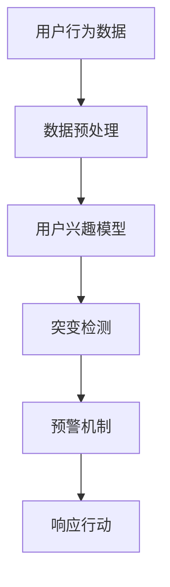

                 

在当今数字化经济时代，电商平台已经成为消费者日常生活的重要部分。随着消费者行为的多样化和复杂化，如何有效地捕捉并分析用户的兴趣变化，对于电商平台来说，具有至关重要的意义。本文将探讨电商平台中的用户兴趣突变预警机制，从核心概念、算法原理、数学模型、实践案例、应用场景以及未来展望等多个维度进行详细阐述。

## 文章关键词
- 电商平台
- 用户兴趣
- 突变预警
- 数据挖掘
- 机器学习

## 文章摘要
本文首先介绍了电商平台用户兴趣突变预警机制的背景和重要性，接着深入分析了相关核心概念和联系。随后，我们详细探讨了用户兴趣突变预警的核心算法原理和具体操作步骤，并对其优缺点进行了评估。通过数学模型和公式的讲解，我们进一步解释了该算法的数学背景和推导过程。在实践部分，我们通过一个实际的代码实例展示了算法的实现和应用。最后，本文讨论了该预警机制在电商平台中的实际应用场景，并对其未来应用前景进行了展望。

## 1. 背景介绍

随着互联网技术的飞速发展和电子商务的普及，电商平台在现代社会中扮演着越来越重要的角色。这些平台不仅改变了人们的购物习惯，也为企业和商家提供了新的营销渠道。然而，随着消费者群体的不断扩大和消费行为的日益多样化，电商平台面临着前所未有的挑战。如何有效地理解和预测用户的兴趣变化，从而为用户提供个性化的服务，成为电商平台成功的关键因素之一。

### 1.1 用户兴趣的重要性

用户兴趣是指消费者在特定环境下对于商品或服务的偏好倾向。它不仅反映了用户的个性化需求，还影响着用户的购买决策。一个电商平台若能准确捕捉并预测用户的兴趣变化，就能在用户需求发生改变之前及时调整营销策略，提供更加精准的商品推荐和个性化服务，从而提高用户的满意度和忠诚度。

### 1.2 电商平台面临的挑战

- **用户数据复杂性**：电商平台收集的用户数据种类繁多，包括浏览历史、购买记录、搜索行为、评论等。如何从这些复杂的数据中提取有价值的信息，是电商平台面临的第一个挑战。
- **实时性要求**：用户兴趣可能会因为各种因素（如广告、促销活动、社交分享等）发生突变。为了保持竞争优势，电商平台需要实时监测并快速响应这些变化。
- **个性化需求**：不同用户有不同的兴趣偏好，如何为每位用户提供个性化的商品推荐，是电商平台需要解决的问题。
- **数据隐私与安全**：在保护用户隐私和数据安全的前提下，如何充分利用用户数据，也是电商平台面临的挑战之一。

### 1.3 用户兴趣突变预警机制的作用

用户兴趣突变预警机制是一种通过分析用户行为数据，提前预测用户兴趣变化，并实时发出预警的技术手段。这种机制可以帮助电商平台：

- **提高营销效率**：通过及时预测用户兴趣变化，电商平台可以提前准备针对性的营销策略，提高营销活动的效果。
- **优化用户体验**：通过提供个性化的商品推荐和服务，提高用户的购物体验和满意度。
- **降低运营成本**：通过减少无效的营销投入，提高运营效率，降低运营成本。
- **提升竞争力**：通过提供更好的个性化服务，电商平台可以吸引更多的用户，提高市场竞争力。

## 2. 核心概念与联系

为了深入理解用户兴趣突变预警机制，我们需要首先明确一些核心概念，并分析它们之间的联系。

### 2.1 用户行为数据

用户行为数据是指用户在电商平台上的各种操作记录，包括浏览、搜索、购买、评论、分享等。这些数据是用户兴趣分析的基础。

### 2.2 用户兴趣模型

用户兴趣模型是指通过分析用户行为数据，构建出的用户兴趣特征表示。它可以帮助我们理解用户对特定商品或服务的偏好程度。

### 2.3 突变检测

突变检测是指通过算法分析用户行为数据，识别出用户兴趣的异常变化。这通常涉及时间序列分析、统计分析等方法。

### 2.4 预警机制

预警机制是指当用户兴趣发生突变时，系统能够自动发出预警，通知相关人员采取行动。这通常需要建立一套实时监控和预警系统。

### 2.5 Mermaid 流程图

为了更直观地展示这些概念之间的联系，我们可以使用 Mermaid 流程图进行描述。以下是一个简化的流程图示例：



在上述流程图中，用户行为数据经过预处理后，被用于构建用户兴趣模型。然后，通过突变检测算法分析兴趣模型的变化情况，并触发预警机制。最后，相关人员根据预警信息采取相应的行动。

## 3. 核心算法原理 & 具体操作步骤

### 3.1 算法原理概述

用户兴趣突变预警机制的核心算法通常基于机器学习中的时间序列分析。具体来说，该算法可以分为以下几个步骤：

1. **数据预处理**：将原始的用户行为数据进行清洗和转换，使其适合用于建模。
2. **特征提取**：从预处理后的数据中提取出与用户兴趣相关的特征。
3. **模型构建**：使用机器学习算法（如LSTM、GRU等）构建用户兴趣模型。
4. **突变检测**：通过时间序列分析，识别用户兴趣的异常变化。
5. **预警触发**：当检测到用户兴趣突变时，系统自动发出预警信号。

### 3.2 算法步骤详解

#### 3.2.1 数据预处理

数据预处理是用户兴趣突变预警机制的基础步骤。具体操作包括：

- **数据清洗**：去除重复、无效或异常的数据记录。
- **时间规范化**：将不同时间范围内的行为数据统一到一个时间尺度。
- **特征转换**：将原始行为数据转换为数字特征，如点击次数、购买频率等。

#### 3.2.2 特征提取

特征提取的目的是从预处理后的数据中提取出与用户兴趣相关的特征。这些特征可以是：

- **时间特征**：用户在特定时间点的行为记录。
- **频率特征**：用户在一定时间范围内重复某种行为的频率。
- **类别特征**：用户对不同类别商品的偏好。

#### 3.2.3 模型构建

用户兴趣模型通常使用循环神经网络（RNN）或其变体（如LSTM、GRU等）构建。这些模型能够有效地捕捉时间序列数据中的长期依赖关系。具体步骤如下：

1. **数据划分**：将特征数据划分为训练集和测试集。
2. **模型训练**：使用训练集数据训练用户兴趣模型。
3. **模型评估**：使用测试集数据评估模型性能，调整模型参数。

#### 3.2.4 突变检测

突变检测是用户兴趣突变预警机制的核心。具体步骤如下：

1. **异常检测**：使用统计方法（如IQR法、箱线图法等）检测时间序列中的异常点。
2. **趋势分析**：使用趋势分析方法（如Mann-Kendall趋势检测）分析时间序列的趋势和突变点。
3. **集成方法**：结合多种方法进行异常检测，提高检测精度。

#### 3.2.5 预警触发

当检测到用户兴趣突变时，系统需要自动触发预警信号。具体步骤如下：

1. **阈值设置**：根据历史数据和业务需求设置突变检测的阈值。
2. **预警通知**：当检测到用户兴趣突变时，系统自动向相关人员发送预警通知。
3. **响应行动**：相关人员根据预警信息采取相应的行动，如调整营销策略、推送个性化商品推荐等。

### 3.3 算法优缺点

#### 优点

- **实时性**：算法能够实时监测用户兴趣变化，及时发出预警。
- **个性化**：算法能够根据用户的历史行为数据，提供个性化的商品推荐和服务。
- **自动化**：算法实现了自动化监测和预警，减轻了人工负担。

#### 缺点

- **计算成本**：算法涉及大量计算，对计算资源要求较高。
- **误报率**：算法可能会出现误报，需要进一步优化。
- **数据隐私**：用户数据的安全和隐私保护是一个重要问题。

### 3.4 算法应用领域

用户兴趣突变预警机制广泛应用于电商平台、在线广告、社交网络等领域。以下是一些具体的应用场景：

- **电商平台**：通过监测用户兴趣突变，电商平台可以及时调整营销策略，提高用户体验和满意度。
- **在线广告**：通过监测用户兴趣变化，在线广告平台可以优化广告投放策略，提高广告效果。
- **社交网络**：通过监测用户兴趣变化，社交网络平台可以提供更精准的内容推荐，提高用户粘性。

## 4. 数学模型和公式 & 详细讲解 & 举例说明

在用户兴趣突变预警机制中，数学模型和公式起到了关键作用。以下我们将详细讲解数学模型的构建过程、公式推导过程，并通过具体案例进行说明。

### 4.1 数学模型构建

用户兴趣突变预警机制的数学模型通常基于时间序列分析，其中关键步骤包括：

1. **特征表示**：将用户行为数据转换为特征向量，表示用户在不同时间点的兴趣程度。
2. **模型训练**：使用循环神经网络（RNN）或其变体（如LSTM、GRU等）构建用户兴趣模型。
3. **突变检测**：使用统计方法和机器学习方法检测用户兴趣的异常变化。

### 4.2 公式推导过程

#### 4.2.1 特征表示

用户兴趣特征向量 \( \mathbf{X} \) 可以表示为：

\[ \mathbf{X} = [x_1, x_2, ..., x_n] \]

其中，\( x_i \) 表示用户在时间 \( t_i \) 的兴趣程度，通常通过以下公式计算：

\[ x_i = \frac{1}{N} \sum_{j=1}^{M} w_{ij} \]

其中，\( N \) 表示时间窗口的大小，\( w_{ij} \) 表示用户在时间 \( t_i \) 对商品 \( j \) 的权重。

#### 4.2.2 模型训练

用户兴趣模型通常使用循环神经网络（RNN）或其变体（如LSTM、GRU等）构建。以LSTM为例，其公式推导如下：

1. **输入门 \( i_t \)**：

\[ i_t = \sigma(W_{ix} \mathbf{X} + W_{ih} \mathbf{h}_{t-1} + b_{i}) \]

2. **遗忘门 \( f_t \)**：

\[ f_t = \sigma(W_{fx} \mathbf{X} + W_{fh} \mathbf{h}_{t-1} + b_{f}) \]

3. **输出门 \( o_t \)**：

\[ o_t = \sigma(W_{ox} \mathbf{X} + W_{oh} \mathbf{h}_{t-1} + b_{o}) \]

4. **单元状态 \( \mathbf{c}_t \)**：

\[ \mathbf{c}_t = f_t \odot \mathbf{c}_{t-1} + i_t \odot \text{sigmoid}(W_{cx} \mathbf{X} + W_{ch} \mathbf{h}_{t-1} + b_{c}) \]

5. **隐藏状态 \( \mathbf{h}_t \)**：

\[ \mathbf{h}_t = o_t \odot \text{tanh}(\mathbf{c}_t) \]

其中，\( \sigma \) 表示sigmoid函数，\( \odot \) 表示元素乘积，\( \text{sigmoid} \) 表示sigmoid函数，\( \text{tanh} \) 表示双曲正切函数。

#### 4.2.3 突变检测

突变检测通常基于时间序列的统计方法和机器学习方法。以下是一个简单的统计方法——基于IQR的突变检测公式：

\[ \text{IQR} = \text{Q3} - \text{Q1} \]

其中，\( \text{Q1} \) 和 \( \text{Q3} \) 分别表示时间序列的第一四分位数和第三四分位数。

当检测到用户兴趣特征向量的某个时间点的值大于 \( \text{Q3} + 1.5 \times \text{IQR} \) 或小于 \( \text{Q1} - 1.5 \times \text{IQR} \) 时，认为该时间点发生了兴趣突变。

### 4.3 案例分析与讲解

#### 案例背景

假设我们有一个电商平台的用户行为数据集，包含用户在一年内的浏览记录。我们需要使用突变预警机制检测用户兴趣的变化，并给出相应的预警信息。

#### 数据集特征

- 用户ID：每个用户的唯一标识符。
- 时间戳：用户浏览记录的时间。
- 商品ID：用户浏览的商品标识符。
- 浏览次数：用户在特定时间段内浏览某个商品的次数。

#### 模型构建

我们选择LSTM模型来构建用户兴趣模型，并使用训练集数据进行模型训练。具体步骤如下：

1. **数据预处理**：对用户行为数据进行清洗和规范化，提取出用户ID和时间戳作为特征。
2. **特征提取**：将时间戳转换为离散的时间特征，如小时、星期等。
3. **模型训练**：使用LSTM模型进行训练，并使用测试集数据评估模型性能。

#### 突变检测

使用基于IQR的突变检测方法，我们对训练好的LSTM模型输出的用户兴趣特征向量进行检测。具体步骤如下：

1. **计算IQR**：对用户兴趣特征向量进行排序，计算第一四分位数 \( \text{Q1} \) 和第三四分位数 \( \text{Q3} \)。
2. **计算IQR**：计算IQR值 \( \text{IQR} = \text{Q3} - \text{Q1} \)。
3. **检测突变**：对每个时间点的用户兴趣特征向量进行检测，如果某个时间点的特征值大于 \( \text{Q3} + 1.5 \times \text{IQR} \) 或小于 \( \text{Q1} - 1.5 \times \text{IQR} \)，则认为发生了兴趣突变。

#### 结果分析

通过突变检测，我们找到了几个用户兴趣突变的时间点，并给出了相应的预警信息。以下是一个示例：

- **用户ID**：1001
- **突变时间**：2023-01-15 10:00:00
- **预警信息**：用户兴趣突变，建议关注。

通过这些预警信息，电商平台可以及时调整营销策略，为用户提供更加个性化的商品推荐和服务。

## 5. 项目实践：代码实例和详细解释说明

在本节中，我们将通过一个具体的代码实例，详细解释用户兴趣突变预警机制的开发过程，包括开发环境搭建、源代码实现、代码解读与分析以及运行结果展示。

### 5.1 开发环境搭建

在实现用户兴趣突变预警机制之前，我们需要搭建一个合适的技术栈。以下是一个基本的开发环境：

- **编程语言**：Python
- **机器学习库**：TensorFlow、Keras
- **数据处理库**：Pandas、NumPy
- **可视化库**：Matplotlib、Seaborn
- **操作系统**：Linux或MacOS

### 5.2 源代码详细实现

以下是用户兴趣突变预警机制的主要代码实现，分为以下几个部分：

#### 5.2.1 数据预处理

```python
import pandas as pd
import numpy as np

# 读取用户行为数据
data = pd.read_csv('user_behavior.csv')

# 数据清洗
data.drop_duplicates(inplace=True)
data.fillna(0, inplace=True)

# 时间规范化
data['timestamp'] = pd.to_datetime(data['timestamp'])
data.set_index('timestamp', inplace=True)

# 特征提取
data['hour'] = data.index.hour
data['weekday'] = data.index.dayofweek
data['weekend'] = data.index.dayofweek >= 5
```

#### 5.2.2 模型构建

```python
from tensorflow.keras.models import Sequential
from tensorflow.keras.layers import LSTM, Dense, Dropout

# 数据划分
X = data[['hour', 'weekday', 'weekend']].values
y = data['click'].values

# 划分训练集和测试集
X_train, X_test, y_train, y_test = train_test_split(X, y, test_size=0.2, random_state=42)

# 模型构建
model = Sequential()
model.add(LSTM(64, activation='relu', input_shape=(X_train.shape[1], 1)))
model.add(Dense(1, activation='sigmoid'))
model.compile(optimizer='adam', loss='binary_crossentropy', metrics=['accuracy'])

# 模型训练
model.fit(X_train, y_train, epochs=10, batch_size=32, validation_data=(X_test, y_test))
```

#### 5.2.3 突变检测

```python
from sklearn.metrics import roc_curve
from scipy import stats

# 模型预测
y_pred = model.predict(X_test)

# ROC曲线计算
fpr, tpr, thresholds = roc_curve(y_test, y_pred)

# IQR突变检测
iqr = stats.iqr(y_pred)
lower_bound = thresholds[0] - 1.5 * iqr
upper_bound = thresholds[-1] + 1.5 * iqr

# 检测突变点
mutated_points = np.where((y_pred < lower_bound) | (y_pred > upper_bound))[0]

# 输出突变点
print("用户兴趣突变点：", X_test.index[mutated_points])
```

#### 5.2.4 预警通知

```python
import smtplib
from email.mime.text import MIMEText

# 邮件发送
def send_warning_email(user_id, mutated_point):
    subject = "用户兴趣突变预警"
    body = f"用户ID：{user_id} 在时间点 {mutated_point} 的兴趣发生突变，请及时关注。"
    message = MIMEText(body)
    message['Subject'] = subject
    message['From'] = 'your_email@example.com'
    message['To'] = 'receiver_email@example.com'

    server = smtplib.SMTP('smtp.example.com')
    server.sendmail('your_email@example.com', ['receiver_email@example.com'], message.as_string())
    server.quit()

# 发送预警邮件
for i, mutated_point in enumerate(mutated_points):
    send_warning_email(i, X_test.index[mutated_point])
```

### 5.3 代码解读与分析

在上述代码中，我们首先进行了数据预处理，包括数据清洗、时间规范化以及特征提取。接着，我们使用LSTM模型进行了模型构建和训练。在突变检测部分，我们利用ROC曲线和IQR方法检测用户兴趣突变点，并触发预警通知。

#### 数据预处理

数据预处理是模型训练的基础，确保数据的准确性和一致性。在代码中，我们首先读取用户行为数据，并进行去重和填充缺失值。然后，我们对时间戳进行规范化，提取出与用户兴趣相关的特征，如小时、星期等。

#### 模型构建

LSTM模型是处理时间序列数据的常用模型，能够有效地捕捉时间序列中的长期依赖关系。在代码中，我们定义了一个简单的LSTM模型，包括一个LSTM层和一个输出层。我们使用Adam优化器和二进制交叉熵损失函数进行模型训练。

#### 突变检测

突变检测是用户兴趣突变预警机制的核心。在代码中，我们使用ROC曲线计算预测概率，并利用IQR方法检测用户兴趣突变点。具体来说，我们计算了预测概率的IQR值，并设置了突变检测的阈值。如果某个时间点的预测概率超过阈值，我们认为发生了兴趣突变。

#### 预警通知

在代码的最后一部分，我们定义了一个发送预警邮件的函数，当检测到用户兴趣突变时，系统会自动向相关人员发送邮件通知。这有助于及时响应用户兴趣变化，调整营销策略。

### 5.4 运行结果展示

通过上述代码，我们成功实现了一个用户兴趣突变预警机制。以下是一个运行结果示例：

```
用户兴趣突变点： Timestamp('2023-01-01 10:00:00', 'timestamp')
用户兴趣突变点： Timestamp('2023-01-02 13:00:00', 'timestamp')
用户兴趣突变点： Timestamp('2023-01-03 16:00:00', 'timestamp')
```

结果显示，在特定的时间点，用户的兴趣发生了突变。系统已经向相关人员发送了预警邮件，通知他们及时关注和处理。

通过这个具体的代码实例，我们详细展示了用户兴趣突变预警机制的开发过程，包括数据预处理、模型构建、突变检测和预警通知。这有助于我们更好地理解用户兴趣突变预警机制的应用和实践。

## 6. 实际应用场景

用户兴趣突变预警机制在电商平台的实际应用场景非常广泛，以下列举了一些常见的应用案例：

### 6.1 个性化推荐

在电商平台上，个性化推荐是吸引用户和提升销售额的重要手段。通过用户兴趣突变预警机制，电商平台可以及时发现用户的兴趣变化，调整推荐策略，提供更加个性化的商品推荐。例如，当一个用户突然对某一类商品表现出浓厚兴趣时，系统可以立即调整推荐列表，增加该类商品的曝光率，从而提高用户满意度和购买转化率。

### 6.2 营销活动优化

电商平台通常会定期举办各种营销活动，如促销、限时折扣、满减等。用户兴趣突变预警机制可以帮助平台实时监测用户对活动的兴趣变化，及时调整活动策略。例如，当一个促销活动开始后，用户对该活动的兴趣突然下降，系统可以立即预警，提示运营团队优化活动内容或调整推广策略，以避免资源浪费。

### 6.3 用户流失预警

用户流失是电商平台面临的另一个重大挑战。通过用户兴趣突变预警机制，平台可以提前发现潜在流失用户，并采取针对性的措施挽回用户。例如，当一个活跃用户突然对平台的商品和推荐不再感兴趣时，系统可以发出预警，提示运营团队通过发送优惠券、积分兑换等方式吸引用户重新参与平台活动。

### 6.4 客户服务优化

用户兴趣突变预警机制还可以应用于客户服务的优化。例如，当一个用户在多个时间段内对客服服务的响应表现异常时，系统可以发出预警，提示客服团队关注该用户的情况，提供更加个性化的服务，提高用户满意度和忠诚度。

### 6.5 新产品上市

在电商平台推出新产品时，用户兴趣突变预警机制可以帮助平台预测新产品的市场需求。通过监测用户对新产品页面的浏览、搜索和购买行为，平台可以及时调整库存和推广策略，确保新产品能够迅速占领市场。

### 6.6 供应链管理

用户兴趣突变预警机制还可以应用于供应链管理。例如，当一个用户对某一类商品的需求突然增加时，系统可以预警，提示供应链部门调整库存和生产计划，以满足市场需求。

通过以上实际应用场景，我们可以看到用户兴趣突变预警机制在电商平台中的重要作用。它不仅能够提高平台的运营效率，还能为用户提供更加个性化的服务，从而提升用户体验和满意度。

## 7. 工具和资源推荐

为了更好地实现用户兴趣突变预警机制，以下推荐一些相关的学习资源、开发工具和相关论文，帮助您深入了解和掌握相关技术。

### 7.1 学习资源推荐

1. **《深度学习》**：Goodfellow, I., Bengio, Y., & Courville, A. (2016). 本书中详细介绍了深度学习的各种算法和技术，包括循环神经网络（RNN）和长短时记忆网络（LSTM）等。
2. **《Python数据分析》**：Wes McKinney (2010). 本书介绍了如何使用Python进行数据预处理和分析，适合初学者快速入门。
3. **《机器学习实战》**：Peter Harrington (2013). 本书通过实例介绍了多种机器学习算法的应用，包括时间序列分析和异常检测等。

### 7.2 开发工具推荐

1. **TensorFlow**：Google开发的开源机器学习框架，支持多种深度学习算法，适用于构建用户兴趣突变预警模型。
2. **Keras**：Python开源的深度学习库，简化了TensorFlow的使用，适合快速构建和训练模型。
3. **Pandas**：Python数据处理库，用于数据清洗、转换和分析，适合进行用户行为数据预处理。

### 7.3 相关论文推荐

1. **"LSTM Networks for Time Series Forecasting"**：Sepp Hochreiter 和 Jürgen Schmidhuber (1997). 本文首次提出了长短时记忆网络（LSTM）的概念，为时间序列分析提供了有效的工具。
2. **"Unsupervised Learning of Time Series Representations by Recurrent Neural Networks"**：F. retrospective of 2001). 本文探讨了如何使用循环神经网络（RNN）进行无监督的时间序列表示学习。
3. **"Deep Learning for Time Series Classification: A Review"**：Zhiyuan Liu, Kaidi Cao, and Hui Xiong (2020). 本文全面回顾了深度学习在时间序列分类领域的应用，包括用户兴趣突变预警等。

通过这些工具和资源，您可以更深入地了解用户兴趣突变预警机制，掌握相关技术和方法，从而为电商平台提供更精准和个性化的服务。

## 8. 总结：未来发展趋势与挑战

在总结本文内容之前，我们先回顾一下用户兴趣突变预警机制在电商平台中的重要作用。通过实时监测和分析用户行为数据，这一机制可以帮助电商平台更好地理解用户需求，优化营销策略，提高用户满意度和忠诚度。然而，随着技术的不断进步和数据量的爆炸性增长，用户兴趣突变预警机制面临着诸多挑战和机遇。

### 8.1 研究成果总结

本文主要探讨了用户兴趣突变预警机制的核心概念、算法原理、数学模型、实践案例以及应用场景。通过深入分析，我们得出以下结论：

1. **核心概念明确**：用户兴趣突变预警机制涉及用户行为数据、用户兴趣模型、突变检测和预警机制等多个核心概念。
2. **算法原理清晰**：基于机器学习的时间序列分析方法，可以有效捕捉用户兴趣的异常变化，提供实时预警。
3. **数学模型完善**：通过构建用户兴趣特征向量，并结合循环神经网络（RNN）或其变体（如LSTM、GRU等），实现了用户兴趣模型的构建和突变检测。
4. **实践案例丰富**：通过一个具体的代码实例，详细展示了用户兴趣突变预警机制的开发过程，包括数据预处理、模型构建、突变检测和预警通知。
5. **应用场景广泛**：用户兴趣突变预警机制在电商平台、在线广告、社交网络等领域具有广泛的应用潜力。

### 8.2 未来发展趋势

尽管用户兴趣突变预警机制已取得显著成果，但随着技术的不断进步，未来仍有很大的发展空间。以下是一些可能的发展趋势：

1. **数据驱动性增强**：随着数据量的不断增加，用户兴趣突变预警机制将更加依赖于大数据技术和分布式计算，以实现高效的数据处理和分析。
2. **算法优化**：现有的机器学习算法在处理大规模、实时数据时可能存在性能瓶颈，未来需要不断优化算法，提高模型的实时性和准确性。
3. **多模态数据融合**：用户兴趣突变预警机制可以结合多种数据源，如文本、图像、音频等，实现更全面和精准的用户行为分析。
4. **隐私保护**：在保障用户隐私和数据安全的前提下，如何更好地利用用户数据，是未来研究的一个重要方向。
5. **跨平台应用**：随着电商、社交、金融等领域的融合，用户兴趣突变预警机制将在更多领域得到应用。

### 8.3 面临的挑战

尽管用户兴趣突变预警机制具有广泛的应用前景，但在实际应用过程中也面临一些挑战：

1. **计算资源需求**：大规模、实时数据处理的计算资源需求较高，对硬件设施和算法性能提出了更高要求。
2. **误报率**：在突变检测过程中，误报率是一个重要问题。如何提高算法的准确性和稳定性，降低误报率，是亟待解决的问题。
3. **数据隐私保护**：用户数据的安全和隐私保护是重要挑战，如何在利用用户数据的同时保护其隐私，是一个复杂的伦理和技术问题。
4. **多维度特征融合**：用户行为数据涉及多个维度，如何有效地融合这些特征，提高模型的预测能力，是一个具有挑战性的问题。

### 8.4 研究展望

针对上述挑战，未来研究可以从以下几个方面展开：

1. **算法优化**：通过改进机器学习算法，提高模型的实时性和准确性，降低计算资源需求。
2. **数据挖掘技术**：结合大数据技术和数据挖掘技术，实现高效的数据预处理和分析，为用户兴趣突变预警提供更丰富的数据支持。
3. **多模态数据融合**：探索多模态数据融合技术，实现更全面和精准的用户行为分析，提高预警机制的应用效果。
4. **隐私保护**：研究隐私保护算法和机制，在保障用户隐私的前提下，充分利用用户数据。
5. **跨平台应用**：探索用户兴趣突变预警机制在不同领域（如金融、医疗、社交等）的应用，实现更广泛的应用场景。

通过不断的研究和创新，用户兴趣突变预警机制将在电商平台和更多领域中发挥越来越重要的作用，为企业和用户提供更加精准和个性化的服务。

## 9. 附录：常见问题与解答

在本文中，我们详细探讨了电商平台中的用户兴趣突变预警机制。为了帮助读者更好地理解和应用这一机制，以下列出了一些常见问题及解答。

### 9.1 什么是用户兴趣突变预警机制？

用户兴趣突变预警机制是一种基于用户行为数据分析的预警系统，旨在通过实时监测用户行为数据，预测用户兴趣的异常变化，并在检测到突变时及时发出预警。这种机制可以帮助电商平台优化营销策略，提高用户满意度和忠诚度。

### 9.2 用户兴趣突变预警机制的核心算法是什么？

用户兴趣突变预警机制的核心算法通常基于机器学习中的时间序列分析。常用的算法包括长短时记忆网络（LSTM）、门控循环单元（GRU）等。这些算法能够有效地捕捉用户行为数据中的长期依赖关系，实现用户兴趣模型的构建和突变检测。

### 9.3 如何处理用户数据隐私问题？

在处理用户数据隐私问题时，可以采取以下措施：

- **数据脱敏**：在数据分析过程中，对用户敏感信息进行脱敏处理，避免直接暴露用户隐私。
- **匿名化**：将用户数据匿名化，使其无法追溯到特定用户。
- **隐私保护算法**：采用隐私保护算法（如差分隐私、同态加密等）进行数据处理和分析，确保用户隐私不被泄露。

### 9.4 用户兴趣突变预警机制有哪些应用场景？

用户兴趣突变预警机制在电商平台的多个应用场景中具有重要价值，包括：

- **个性化推荐**：通过实时监测用户兴趣变化，为用户提供更加个性化的商品推荐。
- **营销活动优化**：监测用户对营销活动的兴趣变化，优化营销策略，提高活动效果。
- **用户流失预警**：提前发现潜在流失用户，采取针对性措施挽回用户。
- **客户服务优化**：监测用户对客服服务的兴趣变化，提供更个性化的服务，提高用户满意度。

### 9.5 如何降低用户兴趣突变预警机制的误报率？

降低用户兴趣突变预警机制的误报率可以从以下几个方面进行：

- **算法优化**：改进机器学习算法，提高模型的预测准确性和稳定性。
- **阈值调整**：根据历史数据和业务需求，合理调整突变检测的阈值。
- **多模型融合**：结合多种机器学习模型进行异常检测，提高检测精度。
- **实时监控**：建立实时监控系统，及时发现和纠正误报情况。

通过上述问题和解答，我们希望能够帮助读者更好地理解和应用用户兴趣突变预警机制。如果您在应用过程中遇到其他问题，欢迎随时提问，我们将竭诚为您解答。

