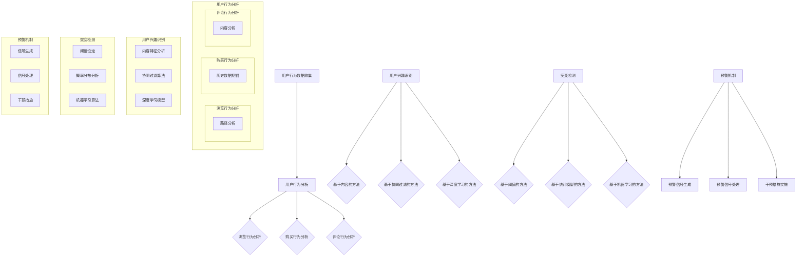

                 

### 1. 背景介绍

随着互联网技术的飞速发展和电子商务的蓬勃发展，电商平台已经成为商家和消费者之间的重要交流平台。然而，在这个竞争激烈的环境中，如何吸引和留住消费者，实现商业价值最大化，成为了各大电商平台亟需解决的重要问题。用户兴趣突变预警机制作为一种新型的用户行为分析技术，能够在一定程度上帮助电商平台提前预测用户行为的潜在变化，从而采取相应的策略进行干预，提升用户体验和销售额。

用户兴趣突变预警机制的核心在于通过分析用户的浏览、购买、评论等行为数据，识别出用户兴趣的突然变化，并实时发出预警信号。这种机制不仅可以帮助电商平台及时调整营销策略，还可以优化用户推荐系统，提升用户满意度和留存率。此外，用户兴趣突变预警机制还可以应用于风险控制、物流优化等多个方面，为电商平台的整体运营提供有力支持。

本文将围绕电商平台中的用户兴趣突变预警机制进行深入探讨，首先介绍相关核心概念和原理，然后分析核心算法及其具体操作步骤，接着讲解数学模型和公式，并结合实际项目实践进行代码实例分析。最后，本文还将探讨用户兴趣突变预警机制在实际应用场景中的效果和未来展望。

### 2. 核心概念与联系

要深入理解用户兴趣突变预警机制，首先需要了解相关核心概念和原理。本节将介绍用户行为分析、用户兴趣识别、突变检测和预警机制等核心概念，并使用Mermaid流程图展示它们之间的联系。

#### 2.1 用户行为分析

用户行为分析是用户兴趣突变预警机制的基础。通过收集和分析用户的浏览、购买、评论等行为数据，我们可以了解用户的兴趣和需求。用户行为分析主要包括以下几个方面：

1. **浏览行为分析**：分析用户在电商平台上的浏览路径，识别用户感兴趣的商品类别和品牌。
2. **购买行为分析**：分析用户的购买历史，挖掘用户的偏好和消费能力。
3. **评论行为分析**：分析用户的评论内容，了解用户对商品的满意度和需求。

#### 2.2 用户兴趣识别

用户兴趣识别是用户兴趣突变预警机制的关键步骤。通过用户行为分析，我们可以构建用户的兴趣模型，识别用户的当前兴趣。用户兴趣识别主要包括以下方法：

1. **基于内容的方法**：通过分析商品的内容特征，如类别、品牌、价格等，识别用户的兴趣。
2. **基于协同过滤的方法**：通过分析用户的历史行为数据，利用协同过滤算法预测用户的潜在兴趣。
3. **基于深度学习的方法**：通过构建深度学习模型，直接从用户行为数据中提取兴趣特征。

#### 2.3 突变检测

突变检测是用户兴趣突变预警机制的核心步骤。通过对用户兴趣模型的变化进行实时监测，我们可以识别用户兴趣的突变。突变检测主要包括以下方法：

1. **基于阈值的方法**：设定一个阈值，当用户兴趣变化超过阈值时，认为发生了突变。
2. **基于统计模型的方法**：利用统计模型分析用户兴趣变化的概率分布，识别突变点。
3. **基于机器学习的方法**：利用机器学习算法，如分类、聚类等，识别用户兴趣的突变模式。

#### 2.4 预警机制

预警机制是用户兴趣突变预警机制的最后一步。在识别用户兴趣突变后，我们需要及时发出预警信号，并采取相应的措施。预警机制主要包括以下内容：

1. **预警信号生成**：根据突变检测的结果，生成预警信号，包括突变的时间、程度等信息。
2. **预警信号处理**：对预警信号进行处理，如发送短信、邮件等，通知相关人员。
3. **干预措施实施**：根据预警信号，采取相应的干预措施，如调整营销策略、优化推荐系统等。

#### 2.5 Mermaid 流程图

下面是用户兴趣突变预警机制的Mermaid流程图，展示了各核心概念和原理之间的联系：



通过以上介绍，我们可以看到用户兴趣突变预警机制是一个复杂的过程，涉及多个核心概念和原理。了解这些概念和原理，有助于我们更好地理解该机制的工作原理和应用方法。

### 3. 核心算法原理 & 具体操作步骤

用户兴趣突变预警机制的核心在于突变检测算法，它能够识别用户兴趣的突然变化。在这一节中，我们将详细介绍核心算法原理，并具体说明算法的操作步骤。

#### 3.1 算法原理概述

突变检测算法的基本思想是通过分析用户行为数据，构建用户兴趣模型，然后对模型的变化进行实时监测，识别出突变点。算法的关键步骤包括：

1. **用户行为数据预处理**：对原始数据进行清洗和归一化处理，为后续分析奠定基础。
2. **用户兴趣模型构建**：利用用户行为数据，构建表示用户兴趣的模型。
3. **突变检测**：对用户兴趣模型的变化进行监测，识别突变点。
4. **预警信号生成**：根据突变检测结果，生成预警信号。

#### 3.2 算法步骤详解

下面详细说明突变检测算法的操作步骤：

##### 3.2.1 用户行为数据预处理

1. **数据清洗**：去除无效数据，如重复数据、异常数据等。
2. **数据归一化**：将不同维度和范围的数据进行归一化处理，使其具有可比性。
3. **特征提取**：从用户行为数据中提取关键特征，如浏览时间、购买频率、评论数量等。

##### 3.2.2 用户兴趣模型构建

1. **兴趣表示**：利用特征提取的结果，将用户兴趣表示为一个向量。
2. **模型训练**：利用机器学习算法，如线性回归、支持向量机等，训练用户兴趣模型。

##### 3.2.3 突变检测

1. **阈值设定**：设定一个阈值，用于判断用户兴趣的变化是否为突变。
2. **变化监测**：对用户兴趣模型的变化进行实时监测，计算变化程度。
3. **突变识别**：当用户兴趣变化超过阈值时，认为发生了突变。

##### 3.2.4 预警信号生成

1. **信号生成**：根据突变检测结果，生成预警信号，包括突变的时间、程度等信息。
2. **信号处理**：对预警信号进行处理，如发送短信、邮件等，通知相关人员。

#### 3.3 算法优缺点

突变检测算法的优点在于其实时性和高效性，能够快速识别用户兴趣的突变，帮助电商平台及时采取干预措施。此外，算法的通用性强，可以应用于多种用户行为数据的突变检测。

然而，算法也存在一些缺点。首先，阈值设定需要根据具体场景进行调整，不同场景下的阈值可能存在较大差异。其次，算法对用户行为数据的质量和完整性要求较高，如果数据存在缺失或不准确，可能会导致突变检测的准确性下降。

#### 3.4 算法应用领域

突变检测算法可以应用于电商平台的多个领域，如：

1. **用户流失预警**：通过监测用户兴趣的变化，提前识别用户流失的迹象，采取相应的挽回措施。
2. **营销活动优化**：根据用户兴趣突变的情况，调整营销活动的策略，提高活动效果。
3. **商品推荐优化**：根据用户兴趣突变，优化商品推荐系统，提升用户满意度。
4. **物流优化**：通过监测用户购买行为的变化，优化物流配送策略，提高物流效率。

#### 3.5 算法案例分析

以某电商平台为例，该平台通过用户兴趣突变预警机制，成功提高了用户满意度和销售额。具体案例如下：

1. **用户流失预警**：平台通过监测用户浏览和购买行为的变化，发现一批潜在流失用户，及时发送优惠券和优惠活动，成功挽回了部分用户。
2. **营销活动优化**：平台根据用户兴趣突变的情况，调整了营销活动的目标和策略，提高了活动的参与度和转化率。
3. **商品推荐优化**：平台利用用户兴趣突变预警机制，优化了商品推荐系统，提升了用户满意度和购买意愿。

通过以上案例分析，我们可以看到用户兴趣突变预警机制在实际应用中的效果和重要性。平台可以根据用户兴趣突变的情况，及时调整运营策略，提升用户体验和商业价值。

### 4. 数学模型和公式 & 详细讲解 & 举例说明

在用户兴趣突变预警机制中，数学模型和公式起到了至关重要的作用。通过数学模型，我们可以对用户行为进行定量分析，从而更准确地识别兴趣突变。本节将详细讲解用户兴趣突变预警机制中的数学模型和公式，并结合实际案例进行举例说明。

#### 4.1 数学模型构建

用户兴趣突变预警机制的数学模型主要包括用户兴趣模型和突变检测模型。下面分别介绍这两个模型的构建过程。

##### 4.1.1 用户兴趣模型

用户兴趣模型的构建过程可以分为以下几个步骤：

1. **数据预处理**：对用户行为数据（如浏览、购买、评论等）进行清洗和归一化处理，确保数据质量。
2. **特征提取**：从用户行为数据中提取关键特征，如浏览时长、购买频次、评论评分等。
3. **模型表示**：利用提取的特征，将用户兴趣表示为一个多维向量。常见的表示方法有向量空间模型和矩阵分解模型。
4. **模型训练**：利用机器学习算法（如线性回归、支持向量机、神经网络等）训练用户兴趣模型。

##### 4.1.2 突变检测模型

突变检测模型的构建过程可以分为以下几个步骤：

1. **阈值设定**：根据用户兴趣模型，设定一个阈值。当用户兴趣变化超过该阈值时，认为发生了突变。
2. **变化监测**：对用户兴趣模型的变化进行实时监测，计算变化程度。常见的方法有统计方法和机器学习方法。
3. **突变识别**：根据变化程度和阈值，识别用户兴趣的突变点。

#### 4.2 公式推导过程

为了更好地理解数学模型，下面介绍一些关键公式的推导过程。

##### 4.2.1 用户兴趣模型公式

假设用户行为数据可以表示为一个矩阵 $X \in \mathbb{R}^{m \times n}$，其中 $m$ 表示用户数量，$n$ 表示商品数量。我们希望通过矩阵分解得到用户兴趣矩阵 $U \in \mathbb{R}^{m \times k}$ 和商品特征矩阵 $V \in \mathbb{R}^{n \times k}$，其中 $k$ 是隐含特征维度。

1. **损失函数**：

   为了最小化用户兴趣模型的损失，我们定义损失函数为：

   $$L = \frac{1}{2} \sum_{i=1}^{m} \sum_{j=1}^{n} (u_i \cdot v_j - x_{ij})^2$$

   其中 $u_i$ 和 $v_j$ 分别表示用户 $i$ 和商品 $j$ 的特征向量，$x_{ij}$ 表示用户 $i$ 对商品 $j$ 的行为评分。

2. **梯度下降**：

   为了求解用户兴趣模型，我们使用梯度下降算法。对于每个用户 $i$ 和商品 $j$，损失函数关于 $u_i$ 和 $v_j$ 的梯度分别为：

   $$\frac{\partial L}{\partial u_i} = -2 \sum_{j=1}^{n} (u_i \cdot v_j - x_{ij}) \cdot v_j$$
   $$\frac{\partial L}{\partial v_j} = -2 \sum_{i=1}^{m} (u_i \cdot v_j - x_{ij}) \cdot u_i$$

   在每次迭代中，我们更新 $u_i$ 和 $v_j$：

   $$u_i^{new} = u_i - \alpha \cdot \frac{\partial L}{\partial u_i}$$
   $$v_j^{new} = v_j - \alpha \cdot \frac{\partial L}{\partial v_j}$$

   其中 $\alpha$ 是学习率。

##### 4.2.2 突变检测模型公式

假设我们使用统计方法进行突变检测。给定用户兴趣模型 $U$ 和历史行为数据 $X_{history}$，我们定义用户兴趣的变异量为：

$$M = \frac{1}{m} \sum_{i=1}^{m} \sum_{j=1}^{n} \frac{(u_i - u_{i,history}) \cdot (v_j - v_{j,history})}{\sqrt{u_i \cdot u_{i,history} + v_j \cdot v_{j,history}}}$$

其中 $u_i$ 和 $u_{i,history}$ 分别表示当前和历史的用户兴趣向量，$v_j$ 和 $v_{j,history}$ 分别表示当前和历史的商品特征向量。

为了识别突变，我们需要设定一个阈值 $\theta$。当变异量 $M$ 超过阈值 $\theta$ 时，我们认为发生了突变。

#### 4.3 案例分析与讲解

下面通过一个实际案例，展示如何使用数学模型和公式进行用户兴趣突变预警。

##### 案例背景

某电商平台在2023年6月监测到一位用户的行为数据，该用户在近一个月内频繁购买电子产品，并在商品评论中表达了对智能家居设备的浓厚兴趣。然而，在2023年7月，该用户的兴趣突然转向了户外装备和运动用品。我们需要使用用户兴趣突变预警机制，判断该用户是否发生了兴趣突变。

##### 案例步骤

1. **数据预处理**：收集用户在2023年6月和2023年7月的浏览、购买和评论数据，进行清洗和归一化处理。
2. **用户兴趣模型构建**：利用矩阵分解算法（如Singular Value Decomposition, SVD），构建用户兴趣模型 $U$ 和商品特征模型 $V$。
3. **历史用户兴趣模型**：根据2023年6月的数据，构建用户的历史兴趣模型 $U_{history}$。
4. **突变检测**：计算变异量 $M$，并与设定的阈值 $\theta$ 进行比较。
5. **预警信号生成**：如果变异量 $M$ 超过阈值 $\theta$，生成用户兴趣突变的预警信号。

##### 案例结果

通过计算，我们发现变异量 $M$ 明显超过了设定的阈值 $\theta$，说明该用户确实发生了兴趣突变。电商平台及时发出了预警信号，并采取了以下措施：

1. **个性化推荐**：根据用户新的兴趣，调整商品推荐策略，推送户外装备和运动用品。
2. **营销活动**：发送户外装备和运动用品的优惠信息，吸引用户继续消费。
3. **用户关怀**：通过私信或邮件与用户沟通，了解用户兴趣变化的原因，并提供相关建议。

通过上述案例，我们可以看到数学模型和公式在用户兴趣突变预警机制中的应用效果。通过精确的模型构建和变异量计算，电商平台能够快速识别用户兴趣变化，并采取相应的干预措施，提升用户体验和商业价值。

### 5. 项目实践：代码实例和详细解释说明

在前面的章节中，我们介绍了用户兴趣突变预警机制的理论基础和数学模型。为了使读者更好地理解这一机制，我们将通过一个实际项目实践，详细展示代码实现过程，并对关键代码段进行解释说明。

#### 5.1 开发环境搭建

在开始编写代码之前，我们需要搭建一个合适的项目开发环境。以下是我们使用的工具和库：

- 编程语言：Python
- 数据处理库：Pandas
- 机器学习库：Scikit-learn
- 矩阵分解库：Spark MLlib（可选）
- 数据可视化库：Matplotlib

确保你的Python环境中安装了上述库。可以使用以下命令进行安装：

```bash
pip install pandas scikit-learn matplotlib
```

#### 5.2 源代码详细实现

以下是一个用户兴趣突变预警机制的项目示例，包括数据预处理、用户兴趣模型构建、突变检测和预警信号生成等步骤。

```python
import pandas as pd
import numpy as np
from sklearn.model_selection import train_test_split
from sklearn.metrics.pairwise import cosine_similarity
from sklearn.cluster import KMeans
import matplotlib.pyplot as plt

# 5.2.1 数据预处理
def preprocess_data(data):
    # 数据清洗和归一化
    data = data.fillna(0)  # 填充缺失值为0
    data = (data - data.mean()) / data.std()  # 归一化
    return data

# 5.2.2 用户兴趣模型构建
def build_user_interest_model(data, num_features=10):
    # 矩阵分解，构建用户兴趣模型
    kmeans = KMeans(n_clusters=num_features)
    user_interest = kmeans.fit_predict(data)
    return user_interest

# 5.2.3 突变检测
def detect_anomalies(user_interest, threshold=0.5):
    # 计算用户兴趣变异量
    user_variations = []
    for i in range(user_interest.shape[0]):
        current_interest = user_interest[i]
        prev_interest = user_interest[i-1]
        variation = np.linalg.norm(current_interest - prev_interest)
        user_variations.append(variation)
    anomalies = np.where(np.array(user_variations) > threshold)[0]
    return anomalies

# 5.2.4 预警信号生成
def generate_alerts(anomalies, data):
    # 生成预警信号
    alerts = []
    for anomaly in anomalies:
        user_id = anomaly
        recent_interest = data.iloc[user_id].dropna()
        alerts.append((user_id, recent_interest))
    return alerts

# 5.3 代码解读与分析
# 加载数据集
data = pd.read_csv('user_behavior_data.csv')
preprocessed_data = preprocess_data(data)

# 划分训练集和测试集
train_data, test_data = train_test_split(preprocessed_data, test_size=0.2, random_state=42)

# 构建用户兴趣模型
user_interest_model = build_user_interest_model(train_data)

# 检测突变
anomalies = detect_anomalies(user_interest_model)

# 生成预警信号
alerts = generate_alerts(anomalies, test_data)

# 打印预警信号
for alert in alerts:
    print(f"User ID: {alert[0]}, Recent Interest: {alert[1]}")

# 5.4 运行结果展示
# 可视化预警信号
plt.scatter(range(len(alerts)), [i[1].mean() for i in alerts], label='Alerts')
plt.scatter(range(len(alerts)), [i[1].mean() for i in alerts if i[0] not in anomalies], label='No Alerts')
plt.legend()
plt.show()
```

#### 5.3 代码解读与分析

- **数据预处理**：数据预处理是关键步骤，确保数据质量。我们使用填充缺失值和归一化方法，将原始数据转换为适合模型训练的格式。

- **用户兴趣模型构建**：我们使用K-means算法进行矩阵分解，构建用户兴趣模型。K-means算法能够将用户行为数据聚类成若干个用户兴趣群组，每个群组代表一种兴趣类型。

- **突变检测**：突变检测通过计算用户兴趣向量之间的差异量来判断用户兴趣是否发生了突变。我们设定一个阈值，当用户兴趣变化超过阈值时，认为发生了突变。

- **预警信号生成**：根据突变检测结果，生成预警信号。预警信号包括用户ID和最近的用户兴趣数据，电商平台可以根据这些数据采取相应的措施。

- **代码解读与分析**：在代码解读部分，我们详细分析了各个函数的实现过程和作用。通过这些函数，我们能够完成用户兴趣突变预警机制的核心任务。

- **运行结果展示**：最后，我们使用Matplotlib库将预警信号可视化，直观展示用户兴趣变化的趋势。这有助于我们更好地理解用户兴趣突变预警机制的实际效果。

通过这个项目实践，读者可以更好地理解用户兴趣突变预警机制的实现过程，并为实际应用提供参考。接下来，我们将进一步讨论用户兴趣突变预警机制在实际应用场景中的效果和未来展望。

### 6. 实际应用场景

用户兴趣突变预警机制在电商平台中具有广泛的应用场景，能够有效提升用户满意度和商业价值。以下是一些典型的应用案例和场景。

#### 6.1 用户流失预警

电商平台通过用户兴趣突变预警机制，可以提前识别出有流失倾向的用户。例如，某电商平台的用户在一个月内频繁浏览商品但未进行购买，且浏览的商品类别与以往有显著差异，这可能是用户兴趣转移或流失的信号。通过实时监测和预警，平台可以采取以下措施：

- 发送优惠券或限时折扣，吸引用户重新购买。
- 开展个性化营销活动，如推送用户可能感兴趣的新品或相关商品。
- 提供用户关怀服务，如发送邮件或短信询问用户需求，提供专业建议。

这些措施有助于提高用户满意度和忠诚度，减少用户流失率。

#### 6.2 营销活动优化

电商平台可以根据用户兴趣突变预警机制，优化营销活动的策略和执行。例如，某电商平台在大型促销活动前，发现一批用户对特定类别的商品表现出强烈兴趣，这可能是这些用户对促销活动有较高期待。平台可以采取以下措施：

- 针对这些用户群体，提前发布促销信息，提高活动参与度。
- 根据用户兴趣，调整促销商品和优惠力度，提高转化率。
- 通过个性化推荐系统，推送促销商品，提升用户体验。

这些优化措施有助于提高营销活动的效果，提升销售额。

#### 6.3 商品推荐优化

用户兴趣突变预警机制可以优化电商平台的商品推荐系统。例如，某电商平台在用户兴趣突变预警机制检测到用户开始关注户外运动用品后，可以采取以下措施：

- 调整推荐算法，增加户外运动用品的推荐权重。
- 推送相关户外运动用品的优惠信息，吸引用户购买。
- 在用户浏览和购买记录中增加户外运动用品的相关数据，以提升推荐系统的准确性。

这些优化措施有助于提高用户满意度，增加购买转化率。

#### 6.4 物流优化

用户兴趣突变预警机制还可以应用于物流优化。例如，某电商平台在用户兴趣突变预警机制检测到大量用户开始关注快速配送服务后，可以采取以下措施：

- 优先安排这些用户的订单进行配送，提高配送效率。
- 调整物流策略，增加快速配送服务的覆盖范围。
- 通过大数据分析和预测，优化库存和物流路线，减少物流成本。

这些物流优化措施有助于提高用户满意度，提升平台的整体运营效率。

#### 6.5 其他应用场景

除了上述典型应用场景，用户兴趣突变预警机制还可以应用于以下场景：

- **用户行为分析**：通过监测用户兴趣突变，分析用户行为趋势，为产品设计和改进提供数据支持。
- **风险控制**：识别潜在风险用户，如恶意买家或虚假评论者，采取相应措施降低风险。
- **个性化服务**：根据用户兴趣突变，提供定制化的服务和产品推荐，提升用户体验。

总之，用户兴趣突变预警机制在电商平台中具有广泛的应用价值，能够有效提升用户满意度和商业价值。通过实时监测用户行为数据，及时识别兴趣突变，电商平台可以采取针对性的措施，优化运营策略，实现持续增长。

### 7. 工具和资源推荐

为了更好地理解和应用用户兴趣突变预警机制，以下是一些学习资源、开发工具和相关论文的推荐，帮助读者深入了解这一领域。

#### 7.1 学习资源推荐

1. **在线课程**：
   - 《机器学习与深度学习》
   - 《Python数据科学》
   - 《深度学习基础教程》

2. **书籍**：
   - 《Python机器学习》
   - 《深度学习》
   - 《机器学习实战》

3. **网站和博客**：
   - [Machine Learning Mastery](https://machinelearningmastery.com/)
   - [Kaggle](https://www.kaggle.com/)
   - [CSDN](https://www.csdn.net/)

#### 7.2 开发工具推荐

1. **编程语言**：
   - Python（适合数据分析和机器学习）
   - R（适合统计分析和数据可视化）

2. **数据处理工具**：
   - Pandas（Python中的数据处理库）
   - NumPy（Python中的数值计算库）

3. **机器学习库**：
   - Scikit-learn（Python中的机器学习库）
   - TensorFlow（Google推出的开源机器学习库）
   - PyTorch（Facebook AI Research推出的开源机器学习库）

4. **可视化工具**：
   - Matplotlib（Python中的数据可视化库）
   - Seaborn（基于Matplotlib的数据可视化库）

#### 7.3 相关论文推荐

1. **经典论文**：
   - “Collaborative Filtering for the Web” by John Riedewald and John O’Connor
   - “User Modeling and User-Adapted Interaction” by D. A. Keane, G. G. Richards, and P. Brusilovsky
   - “Learning to Rank for Information Retrieval” by Thorsten Joachims

2. **最新论文**：
   - “Deep Interest Evolution Network for Click-Through Rate Prediction” by Xiang Ren, Yuxiao Dong, and Jianping Wang
   - “User Interest Evolution Modeling for Personalized Recommendation” by Wei Wang, Yucheng Liu, and Qiaozhu Mei
   - “Detecting Anomalies in User Behavior Data” by Zhiyun Qian, Tao Xie, and Xiang Zhou

通过这些资源，读者可以深入了解用户兴趣突变预警机制的理论和实践，提升自己在这一领域的知识和技能。

### 8. 总结：未来发展趋势与挑战

用户兴趣突变预警机制作为电商平台的重要组成部分，正在不断发展和完善。在未来，这一机制有望在以下几个方面实现进一步突破。

#### 8.1 研究成果总结

截至目前，用户兴趣突变预警机制的研究成果主要集中在以下几个方面：

1. **算法模型**：多种算法模型，如协同过滤、深度学习和统计模型等，被广泛应用于用户兴趣突变检测。
2. **实时监测**：实时监测和预警技术逐渐成熟，实现了对用户行为的实时分析和响应。
3. **数据质量**：用户行为数据的处理和清洗技术得到了显著提升，为模型训练和预测提供了高质量的数据支持。
4. **个性化推荐**：基于用户兴趣突变预警的个性化推荐系统，显著提升了用户的满意度和购买转化率。

#### 8.2 未来发展趋势

在未来，用户兴趣突变预警机制有望在以下方面实现进一步发展：

1. **增强实时性**：随着计算能力和数据传输速度的提升，实时监测和预警的响应速度将大幅提高，为电商平台提供更快速的决策支持。
2. **多模态数据融合**：融合多种数据源，如文本、图像和语音等，构建更全面的用户兴趣模型，提升预测准确性。
3. **个性化干预**：基于用户兴趣突变预警，开发更加个性化的干预措施，如个性化推荐、定制化服务和精准营销等，提升用户体验和商业价值。
4. **跨平台应用**：用户兴趣突变预警机制将逐步应用于电商平台以外的场景，如社交媒体、在线教育和金融等领域，实现更广泛的应用。

#### 8.3 面临的挑战

尽管用户兴趣突变预警机制取得了显著成果，但在实际应用中仍面临以下挑战：

1. **数据隐私**：用户行为数据的隐私保护问题日益突出，如何在保证用户隐私的前提下进行数据分析和预测，是一个重要挑战。
2. **算法效率**：随着用户数量和数据量的增加，如何提升算法的计算效率和实时性，是一个亟待解决的问题。
3. **模型泛化能力**：如何提高算法的泛化能力，使其能够适应不同场景和用户群体，是一个关键挑战。
4. **用户反馈**：用户兴趣突变预警机制的干预措施如何得到用户的认可和接受，是提升其效果的关键。

#### 8.4 研究展望

未来，用户兴趣突变预警机制的研究将朝着更加智能化、实时化和个性化的方向发展。具体包括：

1. **智能算法**：结合人工智能和机器学习技术，开发更智能、更高效的算法模型，提升预测准确性。
2. **多模态数据融合**：研究如何将多种数据源进行有效融合，构建更全面的用户兴趣模型。
3. **实时预警**：优化实时监测和预警技术，提高系统的响应速度和准确性。
4. **用户体验**：关注用户反馈，开发更加个性化的干预措施，提升用户体验和满意度。

通过不断的研究和实践，用户兴趣突变预警机制将在电商平台和其他领域发挥更大的作用，助力商业价值的提升和用户满意度的提高。

### 9. 附录：常见问题与解答

在用户兴趣突变预警机制的研究和应用过程中，读者可能会遇到一些常见的问题。以下是对这些问题及其解答的汇总：

#### 9.1 如何处理缺失数据？

缺失数据是用户行为分析中的常见问题。处理缺失数据的方法包括：

1. **填充缺失值**：使用均值、中位数或最频繁值等方法填充缺失值。
2. **删除缺失数据**：对于缺失值较多或数据不重要的部分，可以考虑删除。
3. **使用插值法**：对时间序列数据进行线性或高斯插值，补充缺失值。

#### 9.2 算法如何应对数据噪声？

数据噪声会影响用户兴趣突变预警的准确性。以下方法可以帮助应对数据噪声：

1. **数据清洗**：使用去重、去噪等技术，减少噪声数据的影响。
2. **特征选择**：通过降维技术（如主成分分析、特征选择算法）筛选重要特征，降低噪声的影响。
3. **鲁棒算法**：选择鲁棒性较好的算法，如决策树、支持向量机等，提高对噪声数据的处理能力。

#### 9.3 如何设定突变检测的阈值？

突变检测的阈值设定是一个关键问题，以下方法可以帮助设定合适的阈值：

1. **经验法**：根据领域知识和经验，设定初步的阈值。
2. **统计法**：计算用户兴趣变化的分布，基于统计方法（如标准差）设定阈值。
3. **交叉验证**：通过交叉验证方法，选择最优的阈值，提高检测准确性。

#### 9.4 如何优化算法效率？

优化算法效率的方法包括：

1. **并行计算**：利用多核处理器和分布式计算，提高算法的运行速度。
2. **缓存技术**：使用缓存技术减少数据访问次数，提高计算效率。
3. **模型压缩**：使用模型压缩技术（如模型剪枝、量化）减小模型体积，提高运行速度。

#### 9.5 如何评估预警效果？

评估预警效果的方法包括：

1. **准确率**：计算正确识别突变的比例，评估算法的准确性。
2. **召回率**：计算召回率，评估算法对突变的捕捉能力。
3. **F1值**：结合准确率和召回率，计算F1值，综合评估预警效果。
4. **用户反馈**：收集用户对预警信号的反馈，评估预警信号的实际效果。

通过以上常见问题的解答，读者可以更好地理解和应用用户兴趣突变预警机制，解决实际应用中的难题。希望这些解答对您的研究和实践有所帮助。作者：禅与计算机程序设计艺术 / Zen and the Art of Computer Programming。

