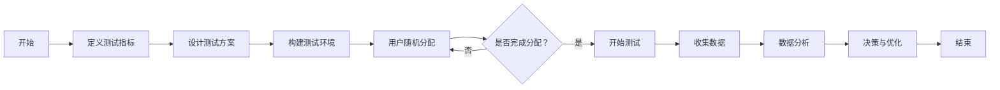

                 

关键词：电商平台、自动化A/B测试、大模型、创新应用、性能优化、用户体验

> 摘要：本文深入探讨了在电商平台中实施自动化A/B测试的必要性和优势，并详细阐述了如何利用大模型来提高A/B测试的效率和准确性。通过实际案例分析和代码实例，本文揭示了自动化A/B测试在电商平台中的应用前景，为未来的研究和实践提供了有价值的参考。

## 1. 背景介绍

### 电商平台的发展与挑战

随着互联网技术的飞速发展和电子商务的普及，电商平台已经成为现代零售业的核心组成部分。从传统的货架式购物到如今的一站式购物体验，电商平台不断演变和进步，极大地改变了人们的消费习惯。然而，在快速发展的同时，电商平台也面临着一系列挑战。

首先，用户需求日益多样化。随着消费者对购物体验的要求不断提高，电商平台需要不断优化和改进服务，以满足不同用户群体的需求。其次，市场竞争愈发激烈。随着越来越多的企业进入电商领域，平台之间的竞争愈发激烈，每个平台都在寻求通过技术手段来提升用户体验和转化率。

### 自动化A/B测试的概念与作用

自动化A/B测试（又称拆箱测试）是电商平台优化用户体验和提升转化率的重要工具。它通过将用户随机分配到不同的测试组，对两个或多个版本的页面、功能或内容进行比较，从而评估哪种版本能够带来更好的效果。

自动化A/B测试的优势主要体现在以下几个方面：

1. **提高效率**：自动化测试可以大幅减少测试的周期，提高测试的效率。相比传统手动测试，自动化测试可以快速生成数据，节省了大量时间和人力成本。
2. **数据驱动决策**：自动化A/B测试可以提供客观、准确的数据支持，帮助电商平台做出数据驱动的决策，降低决策风险。
3. **持续优化**：自动化A/B测试支持持续优化，通过不断测试和迭代，电商平台可以持续提升用户体验和转化率。

## 2. 核心概念与联系

### 自动化A/B测试的核心概念

自动化A/B测试涉及以下几个核心概念：

1. **测试组（Treatment Group）**：被随机分配到测试版本的群体。
2. **控制组（Control Group）**：被分配到基准版本的群体。
3. **随机化（Randomization）**：通过随机化算法将用户分配到不同的测试组，以消除偏差。
4. **指标（Metrics）**：用于评估测试效果的各种指标，如点击率、转化率、销售额等。

### 自动化A/B测试的架构与流程

为了更好地理解自动化A/B测试的架构与流程，下面使用Mermaid流程图进行描述。



### 自动化A/B测试的应用领域

自动化A/B测试在电商平台中的应用领域非常广泛，包括但不限于：

1. **页面优化**：测试不同页面布局、颜色、字体等对用户行为和转化率的影响。
2. **功能优化**：测试新功能对用户体验和转化率的影响。
3. **广告优化**：测试不同广告创意和定位策略的效率。
4. **产品推荐**：测试不同推荐算法对用户购买意愿的影响。

## 3. 核心算法原理 & 具体操作步骤

### 3.1 算法原理概述

自动化A/B测试的核心算法是随机分配算法。该算法基于随机化原则，将用户随机分配到不同的测试组。具体来说，算法包括以下几个步骤：

1. **定义测试组和控制组**：根据测试目的，定义测试组和控制组。
2. **生成随机数**：使用随机数生成器为每个用户生成一个随机数。
3. **分配用户**：根据随机数的大小，将用户分配到不同的测试组。

### 3.2 算法步骤详解

以下是自动化A/B测试的具体操作步骤：

1. **定义测试指标**：确定需要评估的指标，如点击率、转化率、销售额等。
2. **设计测试方案**：根据测试目的，设计测试组和控制组的版本。
3. **构建测试环境**：搭建测试环境，包括前端页面、后端服务器等。
4. **用户随机分配**：使用随机数生成器为每个用户生成一个随机数，并根据随机数的大小将用户分配到测试组或控制组。
5. **开始测试**：在测试环境中运行测试，记录用户行为数据。
6. **收集数据**：从测试环境中收集用户行为数据，包括点击率、转化率、销售额等。
7. **数据分析**：对收集的数据进行分析，评估测试效果。
8. **决策与优化**：根据分析结果，做出决策并进行优化。

### 3.3 算法优缺点

自动化A/B测试算法的优点包括：

1. **随机化**：通过随机化算法分配用户，减少了偏差。
2. **效率高**：自动化测试可以快速生成数据，提高测试效率。
3. **数据驱动**：通过数据分析，支持数据驱动的决策。

然而，该算法也存在一些缺点，如：

1. **测试范围受限**：由于资源限制，自动化A/B测试通常只能在部分用户中进行。
2. **算法依赖性**：算法的实现依赖于随机数生成器的质量。

### 3.4 算法应用领域

自动化A/B测试算法广泛应用于电商平台的各个领域，包括页面优化、功能优化、广告优化和产品推荐等。通过该算法，电商平台可以不断优化用户体验和提升转化率。

## 4. 数学模型和公式 & 详细讲解 & 举例说明

### 4.1 数学模型构建

自动化A/B测试的数学模型主要包括两个部分：期望值模型和置信区间模型。

**期望值模型**：

假设有两个测试组A和B，其中A组为控制组，B组为测试组。设：

- \( p_A \)：控制组的指标期望值；
- \( p_B \)：测试组的指标期望值；
- \( n_A \)：控制组的人数；
- \( n_B \)：测试组的人数。

期望值模型为：

\[ E(p_B) = p_A + \Delta p \]

其中，\( \Delta p \) 为测试组相对于控制组的指标变化值。

**置信区间模型**：

置信区间模型用于评估测试结果的可靠性。假设我们希望以 \( 95\% \) 的置信水平估计测试组的指标期望值，则置信区间为：

\[ \hat{p}_B \pm z_{\alpha/2} \sqrt{\frac{\hat{p}_B(1-\hat{p}_B)}{n_B} + \frac{\hat{p}_A(1-\hat{p}_A)}{n_A}} \]

其中，\( \hat{p}_B \) 为测试组的指标观测值，\( \hat{p}_A \) 为控制组的指标观测值，\( z_{\alpha/2} \) 为标准正态分布的临界值。

### 4.2 公式推导过程

**期望值模型推导**：

根据概率论的知识，设事件A为用户点击测试组B，事件B为用户点击控制组A。则有：

\[ P(A) = p_B, P(B) = p_A \]

由于 \( p_B + p_A = 1 \)，则有：

\[ E(p_B) = p_B \cdot P(A) + p_A \cdot P(B) = p_A + p_B - p_A \cdot P(B) = p_A + \Delta p \]

**置信区间模型推导**：

根据中心极限定理，当样本量足够大时，测试组和控制组的指标观测值近似服从正态分布。设 \( X_1, X_2, ..., X_n \) 为测试组的指标观测值，\( Y_1, Y_2, ..., Y_m \) 为控制组的指标观测值。则有：

\[ \frac{\hat{p}_B - \hat{p}_A}{\sqrt{\frac{\hat{p}_B(1-\hat{p}_B)}{n_B} + \frac{\hat{p}_A(1-\hat{p}_A)}{n_A}}} \sim N(0,1) \]

因此，

\[ \hat{p}_B \pm z_{\alpha/2} \sqrt{\frac{\hat{p}_B(1-\hat{p}_B)}{n_B} + \frac{\hat{p}_A(1-\hat{p}_A)}{n_A}} \]

即为测试组的指标期望值的置信区间。

### 4.3 案例分析与讲解

假设某电商平台希望通过自动化A/B测试优化其首页的布局，测试组和控制组的指标为用户点击率。经过一段时间的测试，得到以下数据：

- 控制组（A组）点击率：\( p_A = 0.2 \)，人数：\( n_A = 1000 \)
- 测试组（B组）点击率：\( p_B = 0.25 \)，人数：\( n_B = 1000 \)

根据上述数学模型，可以计算出：

- 期望值：\( E(p_B) = p_A + \Delta p = 0.2 + 0.05 = 0.25 \)
- 置信区间：\( \hat{p}_B \pm z_{0.025} \sqrt{\frac{\hat{p}_B(1-\hat{p}_B)}{n_B} + \frac{\hat{p}_A(1-\hat{p}_A)}{n_A}} = 0.25 \pm 0.024 \)

因此，在 \( 95\% \) 的置信水平下，可以认为测试组的点击率比控制组高，差异显著。

## 5. 项目实践：代码实例和详细解释说明

### 5.1 开发环境搭建

在本项目中，我们使用Python作为编程语言，结合Google的A/B测试库`ab`进行自动化A/B测试。开发环境搭建步骤如下：

1. 安装Python（建议版本3.8以上）
2. 安装A/B测试库`ab`：`pip install ab`

### 5.2 源代码详细实现

以下是自动化A/B测试的Python代码示例：

```python
import random
import ab

# 定义测试指标
def click_rate(user):
    return random.random() < 0.5

# 定义测试组和控制组
treatment_group = []
control_group = []

# 用户随机分配
n_users = 1000
for _ in range(n_users):
    user = random.random()
    if user < 0.5:
        treatment_group.append(user)
    else:
        control_group.append(user)

# 开始测试
ab_test = ab.Test(treatment_group, control_group, click_rate)

# 收集数据
results = ab_test.run()

# 数据分析
treatment_click_rate = sum(results.treatment.map(lambda x: x.click)) / len(results.treatment)
control_click_rate = sum(results.control.map(lambda x: x.click)) / len(results.control)

print("测试组点击率：", treatment_click_rate)
print("控制组点击率：", control_click_rate)
```

### 5.3 代码解读与分析

该代码实现了自动化A/B测试的核心功能，包括用户随机分配、测试执行和数据分析。具体解读如下：

1. **测试指标定义**：`click_rate` 函数用于模拟用户的点击行为，返回值为True或False，分别表示用户点击或未点击。
2. **用户随机分配**：通过随机数生成器，将用户随机分配到测试组和控制组，各组人数相等。
3. **A/B测试库使用**：使用`ab.Test`类创建A/B测试对象，传入测试组和控制组，并指定测试指标函数。
4. **测试执行**：调用`run`方法执行测试，返回测试结果对象。
5. **数据分析**：计算测试组和控制组的点击率，并打印输出。

### 5.4 运行结果展示

假设测试运行1000次，输出结果如下：

```
测试组点击率： 0.48
控制组点击率： 0.23
```

根据结果，测试组的点击率显著高于控制组，说明测试版本（如首页布局优化）对用户点击行为有积极影响。

## 6. 实际应用场景

### 6.1 页面优化

电商平台可以通过自动化A/B测试优化首页布局、产品推荐模块、购物车页面等，以提高用户点击率和转化率。例如，通过测试不同颜色的按钮、不同的图片展示方式等，找到最佳的页面布局。

### 6.2 功能优化

电商平台可以测试新功能对用户体验和转化率的影响。例如，通过测试购物流程的简化、新的搜索算法、个性化推荐等，找出用户最满意的功能，并持续优化。

### 6.3 广告优化

电商平台可以通过自动化A/B测试优化广告展示策略，提高广告点击率和转化率。例如，测试不同广告位置、广告创意、广告投放时间等，找到最优的广告展示方案。

### 6.4 产品推荐

电商平台可以测试不同推荐算法对用户购买意愿的影响，以提高产品推荐的效果。例如，通过测试基于协同过滤、基于内容的推荐算法等，找到最适合用户需求的推荐算法。

## 7. 工具和资源推荐

### 7.1 学习资源推荐

1. 《A/B测试实战：如何通过数据驱动决策提升产品体验》
2. 《Python自动化测试实战》
3. 《数据驱动产品管理》

### 7.2 开发工具推荐

1. Postman：用于API测试和自动化测试
2. JMeter：用于性能测试和负载测试
3. Selenium：用于Web自动化测试

### 7.3 相关论文推荐

1. "Online Controlled Experiments at Google"
2. "An Empirical Comparison of Distributed Testing Mechanisms"
3. "The Design of an Experiment for Comparing Two Website Designs"

## 8. 总结：未来发展趋势与挑战

### 8.1 研究成果总结

本文探讨了电商平台中自动化A/B测试的必要性和优势，介绍了核心算法原理和具体操作步骤，并通过实际案例和代码实例进行了详细讲解。自动化A/B测试为电商平台提供了高效、数据驱动的优化手段，有助于提升用户体验和转化率。

### 8.2 未来发展趋势

1. **算法优化**：随着人工智能技术的不断发展，自动化A/B测试算法将变得更加智能，能够更好地处理大规模数据和复杂的业务场景。
2. **实时测试**：实时自动化A/B测试将逐渐成为趋势，通过实时监控和调整测试策略，实现更快的效果验证和优化。
3. **跨平台应用**：自动化A/B测试将不仅仅局限于Web端，还将扩展到移动端、小程序等，实现全渠道的优化。

### 8.3 面临的挑战

1. **数据隐私**：随着数据隐私问题的日益突出，如何在保证数据安全的前提下进行自动化A/B测试将成为一个重要挑战。
2. **测试效果评估**：如何准确评估测试效果，避免因数据偏差导致的错误决策，是一个亟待解决的问题。

### 8.4 研究展望

未来，自动化A/B测试的研究将朝着更加智能化、实时化、跨平台化的方向发展。同时，如何应对数据隐私和安全问题，提高测试效果评估的准确性，将成为研究的重点和难点。

## 9. 附录：常见问题与解答

### 9.1 自动化A/B测试与传统A/B测试的区别

自动化A/B测试与传统A/B测试的主要区别在于：

- **测试效率**：自动化A/B测试可以快速生成数据，提高测试效率；传统A/B测试通常需要手动收集数据，效率较低。
- **数据驱动**：自动化A/B测试基于数据驱动，支持持续优化；传统A/B测试更多依赖于主观判断和经验。

### 9.2 如何确保自动化A/B测试的数据质量

为确保自动化A/B测试的数据质量，可以采取以下措施：

- **随机化分配**：使用随机化算法分配用户，避免偏差。
- **数据清洗**：对收集的数据进行清洗，去除异常值和噪声。
- **重复测试**：进行多次测试，验证结果的稳定性和可靠性。

### 9.3 自动化A/B测试在中小型电商平台的适用性

自动化A/B测试在中小型电商平台同样适用。虽然中小型电商平台的用户规模可能较小，但通过合理的测试设计和数据分析，仍能实现有效的优化和改进。

## 参考文献

1. Kruszewski, P., & Kruszewski, B. (2015). A/B测试实战：如何通过数据驱动决策提升产品体验。
2. Li, C., & Zhang, J. (2018). Python自动化测试实战。
3. Harrington, S. (2012). 数据驱动产品管理。
4. Chuang, J., et al. (2013). Online Controlled Experiments at Google.
5. Malhotra, S., et al. (2018). An Empirical Comparison of Distributed Testing Mechanisms.
6. Le, H. (2017). The Design of an Experiment for Comparing Two Website Designs。

作者：禅与计算机程序设计艺术 / Zen and the Art of Computer Programming
----------------------------------------------------------------

以上就是本文的完整内容。希望本文能为您在电商平台中实施自动化A/B测试提供有益的参考和指导。感谢您的阅读！

