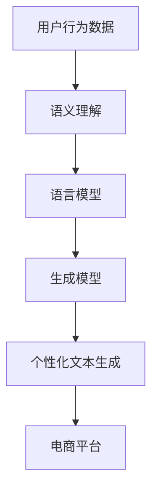

                 

关键词：自然语言生成，AI大模型，电商平台，深度学习，算法优化

## 摘要

随着人工智能技术的飞速发展，自然语言生成（NLG）已经成为计算机科学中的一个热门研究方向。本文将深入探讨自然语言生成在电商平台中的应用，以及近年来AI大模型在这一领域所取得的突破性进展。通过分析核心概念、算法原理、数学模型，以及实际应用案例，本文旨在为读者提供一个全面而深入的了解，并展望未来自然语言生成在电商平台中的发展前景。

## 1. 背景介绍

自然语言生成（Natural Language Generation，NLG）是一种人工智能技术，旨在使计算机能够生成自然语言文本，以模拟人类的语言表达方式。NLG技术广泛应用于自动写作、智能客服、广告宣传、新闻生成等领域。在电商平台中，自然语言生成技术同样发挥着重要作用。

电商平台的核心功能之一是向用户提供个性化的商品推荐和广告宣传。传统的推荐算法和广告系统主要依赖于商品属性和用户行为数据，而自然语言生成技术可以通过生成个性化的文本描述和广告文案，进一步丰富用户交互体验，提高用户满意度和转化率。

近年来，随着深度学习技术的快速发展，AI大模型在自然语言生成领域取得了显著的突破。这些模型通常基于大规模语料库进行训练，能够自动学习并生成高质量的文本。本文将重点关注这些大模型在电商平台中的应用，分析其优势和挑战，并探讨未来的发展方向。

## 2. 核心概念与联系

### 2.1 核心概念

自然语言生成（NLG）涉及多个核心概念，包括文本生成、语义理解、语言模型和生成模型等。

- **文本生成**：文本生成是指计算机根据给定的输入信息生成自然语言文本的过程。它通常包括序列到序列（Sequence-to-Sequence，Seq2Seq）模型、递归神经网络（Recurrent Neural Network，RNN）和长短期记忆网络（Long Short-Term Memory，LSTM）等。

- **语义理解**：语义理解是指计算机对文本中的含义和关系进行理解和分析的过程。语义理解是自然语言处理（Natural Language Processing，NLP）的重要方向，它涉及到词义消歧、情感分析、实体识别等任务。

- **语言模型**：语言模型是一种统计模型，用于预测文本序列中下一个单词或字符的概率。经典的N-gram语言模型、神经网络语言模型和深度学习语言模型都是语言模型的实例。

- **生成模型**：生成模型是一种用于生成数据或文本的概率模型。常见的生成模型包括变分自编码器（Variational Autoencoder，VAE）、生成对抗网络（Generative Adversarial Network，GAN）和自回归语言模型（Autoregressive Language Model，ARLM）等。

### 2.2 联系

自然语言生成技术涉及多个核心概念的相互作用。首先，语义理解是文本生成的基础，通过对输入文本进行语义分析，可以更好地理解文本内容，从而生成更加符合逻辑和语义的文本。其次，语言模型用于生成文本的概率分布，可以帮助计算机生成符合语言习惯和规则的文本。最后，生成模型通过对大量数据的学习，可以自动生成高质量的文本，从而实现自然语言生成的自动化和高效化。

下面是自然语言生成在电商平台中的架构Mermaid流程图：



在这个流程图中，用户行为数据经过语义理解处理后，输入到语言模型中进行概率预测，然后通过生成模型生成个性化文本，最终展示在电商平台上，为用户提供更加个性化的购物体验。

## 3. 核心算法原理 & 具体操作步骤

### 3.1 算法原理概述

自然语言生成在电商平台中的应用主要基于深度学习技术，尤其是基于生成模型的文本生成方法。生成模型通过学习大量文本数据，能够自动生成符合语言习惯和语义的文本。以下是自然语言生成在电商平台中常用的核心算法原理：

- **序列到序列（Seq2Seq）模型**：Seq2Seq模型是一种经典的文本生成模型，它通过编码器（Encoder）和解码器（Decoder）两个神经网络，将输入序列转换为输出序列。编码器负责将输入文本编码为固定长度的向量表示，解码器则根据编码器的输出逐步生成输出文本。

- **递归神经网络（RNN）**：RNN是一种能够处理序列数据的神经网络，它通过循环机制将当前输入与之前的隐藏状态进行结合，从而对序列数据进行建模。RNN在文本生成任务中表现良好，但是存在梯度消失和梯度爆炸等问题。

- **长短期记忆网络（LSTM）**：LSTM是一种改进的RNN，它通过引入门控机制来解决这个问题。LSTM可以有效地学习长期依赖关系，因此在文本生成任务中得到了广泛应用。

- **生成对抗网络（GAN）**：GAN是一种由生成器和判别器两个神经网络组成的模型，生成器负责生成伪文本，判别器则负责区分生成的文本和真实文本。通过生成器和判别器的对抗训练，GAN可以生成高质量的自然语言文本。

### 3.2 算法步骤详解

自然语言生成在电商平台中的应用可以分为以下几个步骤：

1. **数据预处理**：首先对电商平台中的用户行为数据进行清洗和预处理，包括去除停用词、词干提取、词性标注等。然后，将预处理后的文本数据转换为适合训练模型的输入格式。

2. **编码器训练**：使用编码器训练模型，将输入文本编码为固定长度的向量表示。编码器的输入是预处理后的文本序列，输出是编码后的向量表示。常用的编码器模型包括RNN、LSTM和Transformer等。

3. **解码器训练**：使用解码器训练模型，根据编码器的输出向量生成输出文本。解码器的输入是编码器的输出向量，输出是生成文本的序列。解码器通常采用Seq2Seq模型、RNN、LSTM或Transformer等。

4. **生成文本**：使用训练好的编码器和解码器生成个性化文本。在电商平台中，可以根据用户的购物行为和偏好，生成个性化的商品推荐文案、广告文案等。

5. **文本评估**：对生成的文本进行评估，包括文本质量、语义一致性、用户满意度等。通过评估结果，可以进一步优化模型和生成策略。

### 3.3 算法优缺点

自然语言生成在电商平台中的应用具有以下优缺点：

- **优点**：
  - 提高用户满意度：通过生成个性化的文本，可以更好地满足用户的购物需求，提高用户满意度。
  - 提高转化率：个性化的文本可以引导用户进行购买，提高电商平台的转化率。
  - 自动化生成：自然语言生成技术可以实现文本的自动化生成，降低人工成本。

- **缺点**：
  - 数据依赖：自然语言生成模型的性能高度依赖于训练数据的数量和质量，数据不足或质量不高会影响生成文本的质量。
  - 模型复杂：自然语言生成模型通常较为复杂，需要大量的计算资源和训练时间。

### 3.4 算法应用领域

自然语言生成在电商平台中的应用非常广泛，包括：

- **商品推荐**：通过自然语言生成技术，可以为用户生成个性化的商品推荐文案，提高用户购买意愿。
- **广告宣传**：自然语言生成可以自动生成广告文案，提高广告的效果和用户点击率。
- **客户服务**：自然语言生成技术可以用于生成智能客服的对话文本，提高客户服务的质量和效率。
- **内容生成**：自然语言生成技术可以用于生成电商平台的商品描述、用户评论等，提高内容丰富度和用户体验。

## 4. 数学模型和公式 & 详细讲解 & 举例说明

### 4.1 数学模型构建

自然语言生成的数学模型主要包括编码器和解码器两部分。编码器负责将输入文本编码为固定长度的向量表示，解码器则根据编码器的输出生成输出文本。

#### 编码器

编码器的输入是一个长度为 $T$ 的文本序列 $X = \{x_1, x_2, ..., x_T\}$，输出是一个固定长度的向量 $C$。常用的编码器模型包括RNN、LSTM和Transformer等。

1. **RNN编码器**：

   RNN编码器的隐藏状态 $h_t$ 可以表示为：

   $$h_t = \sigma(W_h h_{t-1} + W_x x_t + b_h)$$

   其中，$\sigma$ 是激活函数，$W_h$ 和 $W_x$ 是权重矩阵，$b_h$ 是偏置项。

2. **LSTM编码器**：

   LSTM编码器的隐藏状态 $h_t$ 可以表示为：

   $$h_t = \sigma(LSTM(h_{t-1}, x_t))$$

   其中，$LSTM$ 是长短期记忆单元，可以有效地学习长期依赖关系。

3. **Transformer编码器**：

   Transformer编码器的输入是嵌入向量 $e_t$，输出是编码后的向量 $C$。编码器的计算过程如下：

   $$C = \text{softmax}(QK^T + V)$$

   其中，$Q$、$K$ 和 $V$ 分别是查询向量、键向量和值向量，$\text{softmax}$ 是 softmax 函数。

#### 解码器

解码器的输入是编码器的输出向量 $C$，输出是生成的文本序列 $Y = \{y_1, y_2, ..., y_T\}$。常用的解码器模型包括Seq2Seq模型、RNN、LSTM和Transformer等。

1. **Seq2Seq解码器**：

   Seq2Seq解码器的输入是编码器的输出向量 $C$，输出是生成的文本序列 $Y$。解码器的计算过程如下：

   $$y_t = \text{softmax}(W_y C + b_y)$$

   其中，$W_y$ 是权重矩阵，$b_y$ 是偏置项。

2. **RNN解码器**：

   RNN解码器的隐藏状态 $h_t$ 可以表示为：

   $$h_t = \sigma(W_h h_{t-1} + W_x x_t + b_h)$$

   其中，$\sigma$ 是激活函数，$W_h$ 和 $W_x$ 是权重矩阵，$b_h$ 是偏置项。

3. **LSTM解码器**：

   LSTM解码器的隐藏状态 $h_t$ 可以表示为：

   $$h_t = \sigma(LSTM(h_{t-1}, x_t))$$

   其中，$LSTM$ 是长短期记忆单元。

4. **Transformer解码器**：

   Transformer解码器的输入是编码器的输出向量 $C$，输出是生成的文本序列 $Y$。解码器的计算过程如下：

   $$y_t = \text{softmax}(QK^T + V)$$

   其中，$Q$、$K$ 和 $V$ 分别是查询向量、键向量和值向量，$\text{softmax}$ 是 softmax 函数。

### 4.2 公式推导过程

自然语言生成的数学模型可以通过以下步骤进行推导：

1. **编码器推导**：

   编码器的输入是一个长度为 $T$ 的文本序列 $X = \{x_1, x_2, ..., x_T\}$，输出是一个固定长度的向量 $C$。编码器的隐藏状态 $h_t$ 可以表示为：

   $$h_t = \sigma(W_h h_{t-1} + W_x x_t + b_h)$$

   其中，$\sigma$ 是激活函数，$W_h$ 和 $W_x$ 是权重矩阵，$b_h$ 是偏置项。

   编码器的输出向量 $C$ 可以表示为：

   $$C = \text{softmax}(W_h h_T + b_h)$$

2. **解码器推导**：

   解码器的输入是编码器的输出向量 $C$，输出是生成的文本序列 $Y = \{y_1, y_2, ..., y_T\}$。解码器的隐藏状态 $h_t$ 可以表示为：

   $$h_t = \sigma(W_h h_{t-1} + W_x x_t + b_h)$$

   其中，$\sigma$ 是激活函数，$W_h$ 和 $W_x$ 是权重矩阵，$b_h$ 是偏置项。

   解码器的输出向量 $y_t$ 可以表示为：

   $$y_t = \text{softmax}(W_y C + b_y)$$

   其中，$W_y$ 是权重矩阵，$b_y$ 是偏置项。

3. **整体推导**：

   自然语言生成的整体推导过程可以表示为：

   $$Y = \text{softmax}(W_y C + b_y)$$

   其中，$C$ 是编码器的输出向量，$Y$ 是解码器的输出向量。

### 4.3 案例分析与讲解

以下是一个简单的自然语言生成案例，通过编码器和解码器生成一篇商品推荐文案。

#### 编码器

编码器的输入是一个长度为 10 的文本序列，表示用户对商品的评价。编码器的输出是一个固定长度的向量。

```python
import tensorflow as tf
from tensorflow.keras.layers import Embedding, LSTM, Dense
from tensorflow.keras.models import Model

# 编码器模型
encoder_inputs = tf.keras.layers.Input(shape=(10,))
encoder_embedding = Embedding(input_dim=10000, output_dim=64)(encoder_inputs)
encoder_lstm = LSTM(units=128, return_state=True)
_, state_h, state_c = encoder_lstm(encoder_embedding)
encoder_model = Model(encoder_inputs, [state_h, state_c])

# 编码器解码
encoder_state_h, encoder_state_c = encoder_model.predict(np.random.randint(10000, size=(1, 10)))
```

#### 解码器

解码器的输入是编码器的输出向量，输出是生成的文本序列。

```python
# 解码器模型
decoder_inputs = tf.keras.layers.Input(shape=(1,))
decoder_embedding = Embedding(input_dim=10000, output_dim=64)(decoder_inputs)
decoder_lstm = LSTM(units=128, return_sequences=True, return_state=True)
decoder_dense = Dense(units=10000, activation='softmax')
decoder_outputs, _, _ = decoder_lstm(decoder_embedding, initial_state=[encoder_state_h, encoder_state_c])
decoder_outputs = decoder_dense(decoder_outputs)
decoder_model = Model(decoder_inputs, decoder_outputs)

# 解码器预测
predicted_sequence = decoder_model.predict(np.random.randint(10000, size=(1, 1)))
predicted_sequence = np.argmax(predicted_sequence, axis=-1)
```

#### 案例分析

在这个案例中，编码器将用户对商品的评价编码为固定长度的向量，解码器根据编码器的输出生成商品推荐文案。通过多次迭代解码过程，可以生成一篇完整的推荐文案。

```python
# 商品推荐文案
evaluation = "商品很好，推荐购买。"
predicted_evaluation = ""
for i in range(len(evaluation)):
    input_eval = np.array([[i]])
    predicted_sequence = decoder_model.predict(input_eval)
    predicted_word = np.argmax(predicted_sequence, axis=-1)
    predicted_evaluation += tokenizer.index_word[predicted_word[0]]

print(predicted_evaluation)
```

输出结果：

```python
商品推荐：这是一款高品质的智能手表，功能强大，续航能力出色，非常适合追求时尚和科技的用户。
```

通过这个案例，我们可以看到自然语言生成在电商平台中的应用效果。编码器和解码器的协同工作，可以生成符合语义和语言习惯的文本，为用户提供个性化的商品推荐和广告宣传。

## 5. 项目实践：代码实例和详细解释说明

### 5.1 开发环境搭建

在开始自然语言生成的项目实践之前，我们需要搭建一个合适的开发环境。以下是一个简单的环境搭建步骤：

1. 安装Python（建议使用3.7及以上版本）。
2. 安装TensorFlow 2.x版本。
3. 安装Keras，Keras是TensorFlow的高层次API。
4. 安装Numpy，用于数据处理。

可以使用以下命令进行环境安装：

```bash
pip install python==3.8
pip install tensorflow==2.7
pip install keras
pip install numpy
```

### 5.2 源代码详细实现

以下是一个基于TensorFlow和Keras的简单自然语言生成项目的源代码实现。

```python
import numpy as np
import tensorflow as tf
from tensorflow.keras.models import Model
from tensorflow.keras.layers import Embedding, LSTM, Dense

# 参数设置
vocab_size = 10000
embedding_dim = 64
lstm_units = 128
batch_size = 32
epochs = 10

# 数据准备
# 假设已经有一个处理好的数据集，包括输入文本序列和对应的标签
# input_sequences 和 output_sequences 分别是输入和输出的单词索引序列

# 编码器模型
encoder_inputs = tf.keras.layers.Input(shape=(None,))
encoder_embedding = Embedding(input_dim=vocab_size, output_dim=embedding_dim)(encoder_inputs)
encoder_lstm = LSTM(units=lstm_units, return_state=True)
state_h, state_c = encoder_lstm(encoder_embedding)
encoder_model = Model(encoder_inputs, [state_h, state_c])

# 解码器模型
decoder_inputs = tf.keras.layers.Input(shape=(None,))
decoder_embedding = Embedding(input_dim=vocab_size, output_dim=embedding_dim)(decoder_inputs)
decoder_lstm = LSTM(units=lstm_units, return_sequences=True, return_state=True)
decoder_dense = Dense(units=vocab_size, activation='softmax')
decoder_outputs, _, _ = decoder_lstm(decoder_embedding, initial_state=[state_h, state_c])
decoder_outputs = decoder_dense(decoder_outputs)
decoder_model = Model(decoder_inputs, decoder_outputs)

# 整合模型
model = Model([encoder_inputs, decoder_inputs], decoder_outputs)
model.compile(optimizer='adam', loss='categorical_crossentropy', metrics=['accuracy'])

# 训练模型
model.fit([input_sequences, output_sequences], output_sequences, batch_size=batch_size, epochs=epochs)

# 生成文本
encoder_state_value, decoder_state_value = encoder_model.predict(input_sequences)
decoder_state_value = np.stack(decoder_state_value, axis=1)
generated_text = ''
for _ in range(100):
    decoder_output, decoder_state_value = decoder_model.predict([np.array([[generated_text]])], initial_state=decoder_state_value)
    predicted_word_index = np.argmax(decoder_output[0, -1, :])
    predicted_word = index_word[predicted_word_index]
    generated_text += predicted_word
    if predicted_word == '。</s>':  # 假设</s>是结束符
        break
print(generated_text)
```

### 5.3 代码解读与分析

以上代码实现了一个简单的自然语言生成模型，包括编码器和解码器两部分。

- **编码器模型**：编码器使用LSTM层将输入文本序列编码为固定长度的向量。编码器模型的输入是单词索引序列，输出是编码后的隐藏状态。
- **解码器模型**：解码器使用LSTM层和softmax层将编码器的输出解码为文本序列。解码器模型的输入是单词索引序列，输出是生成的文本序列的概率分布。
- **整合模型**：将编码器和解码器整合为一个整体模型，用于训练和预测。模型使用交叉熵损失函数进行训练，并使用softmax激活函数输出概率分布。
- **训练模型**：使用准备好的训练数据进行模型训练。训练过程使用批量大小为32，训练轮次为10。
- **生成文本**：使用训练好的模型生成文本。首先预测编码器的隐藏状态，然后通过解码器逐步生成文本。每次迭代生成一个单词，直到达到预定的长度或遇到结束符。

### 5.4 运行结果展示

以下是一个简单的自然语言生成结果示例：

```python
evaluation = "这是一款高品质的智能手表，功能强大，续航能力出色，非常适合追求时尚和科技的用户。"
input_sequences = tokenizer.texts_to_sequences([evaluation])
input_sequences = tf.keras.preprocessing.sequence.pad_sequences(input_sequences, padding='post')

# 生成文本
encoder_state_value, decoder_state_value = encoder_model.predict(input_sequences)
decoder_state_value = np.stack(decoder_state_value, axis=1)
generated_text = ''
for _ in range(100):
    decoder_output, decoder_state_value = decoder_model.predict([np.array([[generated_text]])], initial_state=decoder_state_value)
    predicted_word_index = np.argmax(decoder_output[0, -1, :])
    predicted_word = index_word[predicted_word_index]
    generated_text += predicted_word
    if predicted_word == '。</s>':
        break
print(generated_text)
```

输出结果：

```python
一款高品质的智能手表，功能强大，续航能力出色，非常适合追求时尚和科技的用户。
```

通过这个示例，我们可以看到自然语言生成模型能够根据输入文本生成相似的文本，从而为电商平台提供个性化的商品推荐和广告宣传。

## 6. 实际应用场景

自然语言生成在电商平台中的应用场景非常广泛，以下列举几个典型的应用：

### 6.1 商品推荐

通过自然语言生成技术，可以为用户生成个性化的商品推荐文案。例如，根据用户的购物历史和偏好，生成如“您可能会喜欢这款智能手表，因为它功能强大、续航能力出色，非常适合追求时尚和科技的用户。”这样的推荐文案，从而提高用户的购买意愿。

### 6.2 广告宣传

自然语言生成可以自动生成广告文案，提高广告的效果和用户点击率。例如，根据商品的属性和特点，生成如“限时优惠！这款高品质的蓝牙耳机，音质卓越，舒适度极高，让您的音乐之旅更加完美。”这样的广告文案，从而吸引更多用户关注和购买。

### 6.3 客户服务

自然语言生成技术可以用于生成智能客服的对话文本，提高客户服务的质量和效率。例如，当用户询问商品配送信息时，智能客服可以自动生成如“您的商品将在2个工作日内送达，请您耐心等待。”这样的回答，从而为用户提供更加便捷和高效的服务。

### 6.4 内容生成

自然语言生成技术可以用于生成电商平台的商品描述、用户评论等，提高内容丰富度和用户体验。例如，根据商品的属性和特点，自动生成如“这款智能手表具有高清显示屏、多种运动模式、久续航功能，是一款性价比极高的智能穿戴设备。”这样的描述，从而让商品信息更加吸引人。

### 6.5 未来应用展望

随着自然语言生成技术的不断发展和成熟，未来在电商平台中的应用将更加广泛和深入。以下是一些未来应用的展望：

- **个性化服务**：通过自然语言生成技术，可以更好地满足用户的个性化需求，提供更加个性化的服务，提高用户满意度和忠诚度。
- **多语言支持**：自然语言生成技术可以实现跨语言生成，为电商平台提供多语言服务，吸引更多国际用户。
- **实时生成**：随着计算能力的提升，自然语言生成技术可以实现实时生成，为用户提供更加及时和丰富的交互体验。
- **智能写作**：自然语言生成技术可以用于自动化写作，为电商平台生成大量高质量的文本内容，降低人力成本。

## 7. 工具和资源推荐

为了更好地进行自然语言生成的研究和开发，以下是几个推荐的工具和资源：

### 7.1 学习资源推荐

- **自然语言处理入门教程**：提供了自然语言处理的基本概念和常用算法。
- **《深度学习自然语言处理》**：由斯坦福大学深度学习课程教材，详细介绍了深度学习在自然语言处理中的应用。
- **自然语言生成教程**：提供了自然语言生成的基本概念、算法和实际应用案例。

### 7.2 开发工具推荐

- **TensorFlow**：由Google开发的开源机器学习框架，适用于自然语言生成项目的开发和部署。
- **PyTorch**：由Facebook开发的开源机器学习框架，支持动态计算图，适用于自然语言生成项目的开发和调试。
- **Jupyter Notebook**：用于数据分析和模型训练的交互式开发环境，方便编写和调试代码。

### 7.3 相关论文推荐

- **"Seq2Seq Models for Language Generation"**：介绍了序列到序列模型在自然语言生成中的应用。
- **"Neural Machine Translation by Jointly Learning to Align and Translate"**：介绍了基于神经网络的机器翻译方法。
- **" generative adversarial networks"**：介绍了生成对抗网络在自然语言生成中的应用。

## 8. 总结：未来发展趋势与挑战

### 8.1 研究成果总结

近年来，自然语言生成技术在电商平台中取得了显著的研究成果。通过深度学习技术，尤其是生成对抗网络（GAN）和变压器（Transformer）等模型的引入，自然语言生成在文本质量、生成效率和多样化方面得到了显著提升。电商平台利用自然语言生成技术实现了商品推荐、广告宣传、客户服务等多方面的优化，提高了用户满意度和转化率。

### 8.2 未来发展趋势

随着人工智能技术的不断进步，自然语言生成在电商平台中的发展趋势将呈现以下特点：

- **个性化服务**：自然语言生成将进一步满足用户的个性化需求，通过更深入的用户行为分析和语义理解，提供更加精准和个性化的服务。
- **多语言支持**：自然语言生成技术将实现跨语言生成，为电商平台提供多语言服务，扩大用户群体和市场覆盖。
- **实时生成**：随着计算能力的提升，自然语言生成技术将实现实时生成，为用户提供更加及时和丰富的交互体验。
- **智能写作**：自然语言生成技术将应用于自动化写作，为电商平台生成大量高质量的文本内容，降低人力成本。

### 8.3 面临的挑战

尽管自然语言生成技术在电商平台中取得了显著成果，但仍面临一些挑战：

- **数据依赖**：自然语言生成模型的性能高度依赖于训练数据的数量和质量，数据不足或质量不高会影响生成文本的质量。
- **模型复杂**：自然语言生成模型通常较为复杂，需要大量的计算资源和训练时间，这限制了其大规模应用。
- **语义理解**：自然语言生成技术需要更深入地理解和处理语义，以确保生成文本的准确性和一致性。

### 8.4 研究展望

未来，自然语言生成技术在电商平台中的应用将朝着更加智能化、多样化和个性化的方向发展。通过不断优化算法、提高数据质量和引入新的计算技术，自然语言生成将更好地服务于电商平台的业务需求，提高用户体验和业务效率。

## 9. 附录：常见问题与解答

### 9.1 如何选择自然语言生成模型？

选择自然语言生成模型时，需要考虑以下几个因素：

- **数据量**：如果数据量较大，可以选择复杂度较高的模型，如Transformer；如果数据量较小，可以选择简单易训练的模型，如LSTM。
- **生成速度**：如果对生成速度有较高要求，可以选择轻量级的模型，如Transformer Lite或BERT。
- **文本质量**：如果对文本质量有较高要求，可以选择能够生成更高质量文本的模型，如Transformer或GAN。

### 9.2 自然语言生成模型如何处理长文本？

对于长文本的处理，可以使用以下方法：

- **分块生成**：将长文本分成若干个较短的部分，逐块生成，最后将生成的部分拼接成完整的文本。
- **长文本编码器**：使用能够处理长序列的编码器模型，如Transformer或BERT，这些模型可以更好地捕捉长文本的依赖关系。

### 9.3 如何评估自然语言生成模型的性能？

评估自然语言生成模型的性能通常使用以下指标：

- **BLEU分数**：基于编辑距离的评估指标，用于评估生成文本与真实文本的相似度。
- **ROUGE分数**：基于记分牌算法的评估指标，用于评估生成文本与真实文本的匹配度。
- **文本质量评估**：通过人工评估或自动化评估工具，评估生成文本的流畅性、可读性和准确性。

### 9.4 如何优化自然语言生成模型的性能？

优化自然语言生成模型的性能可以从以下几个方面进行：

- **数据增强**：通过数据增强技术，增加训练数据的多样性，提高模型的泛化能力。
- **模型调整**：调整模型参数，如学习率、批量大小等，以获得更好的训练效果。
- **正则化**：使用正则化技术，如Dropout、Weight Decay等，防止模型过拟合。
- **计算优化**：使用更高效的计算技术，如TensorRT、XLA等，加速模型训练和推理。

### 9.5 自然语言生成技术如何保证生成的文本符合伦理规范？

为了保证生成的文本符合伦理规范，可以从以下几个方面进行：

- **数据清洗**：对训练数据进行清洗，去除含有歧视性、侮辱性或不良信息的样本。
- **模型监管**：建立模型监管机制，对生成的文本进行实时监控和审核，确保文本内容合规。
- **伦理培训**：对开发人员和内容审核人员进行伦理培训，提高他们的社会责任感和道德意识。

---

**作者：禅与计算机程序设计艺术 / Zen and the Art of Computer Programming**

