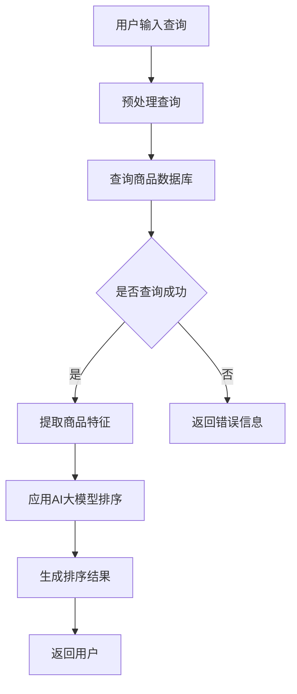

                 

 

## 1. 背景介绍

随着互联网的快速发展，电子商务行业迎来了爆炸式的增长。用户数量和交易规模不断增加，电商平台面临着巨大的挑战。如何在海量的商品信息中，快速准确地满足用户的搜索需求，成为了电商平台亟需解决的问题。

传统的搜索排序算法，主要基于商品的销售量、评分、上下架时间等单一维度进行排序。虽然在一定程度上能够满足用户的基本需求，但在个性化推荐和实时响应方面存在明显的局限性。为了进一步提升用户体验，电商平台开始探索利用AI大模型优化搜索排序算法。

AI大模型，尤其是基于深度学习的模型，具有强大的特征提取和模式识别能力，可以处理复杂、非线性关系的数据。通过引入AI大模型，电商平台可以在搜索排序中考虑更多的因素，如用户的浏览历史、购物偏好、社交网络等，从而实现更加个性化的搜索结果。

本文将探讨电商平台如何利用AI大模型优化搜索排序算法，包括算法原理、数学模型、应用实践以及未来展望。

## 2. 核心概念与联系

### 2.1 AI大模型

AI大模型，通常指的是具有大规模参数的深度学习模型，如神经网络、变换器（Transformer）等。这些模型通过训练大量数据，可以自动提取数据中的特征，并建立复杂的关系映射。

### 2.2 搜索排序算法

搜索排序算法是电商平台的核心技术之一，用于根据用户查询和商品属性，对商品进行排序，以提供最佳搜索结果。

### 2.3 Mermaid流程图

以下是搜索排序算法的Mermaid流程图：



## 3. 核心算法原理 & 具体操作步骤

### 3.1 算法原理概述

AI大模型搜索排序算法主要基于以下几个方面：

- **特征工程**：从用户查询和商品属性中提取关键特征，如关键词、商品类别、用户偏好等。
- **模型训练**：使用海量数据进行模型训练，使模型能够自动学习数据中的复杂关系。
- **排序预测**：将提取的特征输入模型，预测商品的排序优先级。

### 3.2 算法步骤详解

1. **用户输入查询**：用户通过电商平台进行搜索，输入查询关键词。
2. **预处理查询**：对查询关键词进行分词、去停用词等预处理，得到干净的查询文本。
3. **查询商品数据库**：根据预处理后的查询文本，从商品数据库中检索相关商品。
4. **提取商品特征**：从检索到的商品中提取关键特征，如商品名称、描述、类别等。
5. **应用AI大模型排序**：将提取的商品特征输入AI大模型，模型根据训练得到的权重，预测每个商品的排序优先级。
6. **生成排序结果**：根据排序优先级，生成最终的排序结果，返回给用户。

### 3.3 算法优缺点

#### 优点：

- **个性化推荐**：考虑用户的浏览历史、购物偏好等，提供更加个性化的搜索结果。
- **实时响应**：通过模型预测，实现实时排序，提升用户体验。
- **高效性**：利用大规模参数的深度学习模型，处理海量数据更加高效。

#### 缺点：

- **计算资源消耗大**：训练和部署大规模AI模型需要大量计算资源。
- **数据依赖性高**：模型的性能很大程度上依赖于训练数据的质量和数量。

### 3.4 算法应用领域

AI大模型搜索排序算法主要应用于电子商务平台，如淘宝、京东等，此外还可在新闻推荐、社交媒体等领域得到应用。

## 4. 数学模型和公式

### 4.1 数学模型构建

AI大模型搜索排序算法的核心在于如何构建一个能够准确预测商品排序优先级的数学模型。以下是一个简化的数学模型：

$$
\text{SortScore}(x) = \sigma(\theta^T f(x))
$$

其中：

- \(x\) 是商品的特征向量。
- \(f(x)\) 是特征提取函数，用于将商品特征转换为模型可处理的格式。
- \(\theta\) 是模型参数，通过训练得到。
- \(\sigma\) 是激活函数，通常使用Sigmoid函数。

### 4.2 公式推导过程

模型的训练过程实际上是优化模型参数 \(\theta\)，使其能够准确预测商品的排序优先级。具体推导过程如下：

1. **损失函数**：选择适当的损失函数，如交叉熵损失函数，衡量预测值与真实值之间的差距。

$$
\text{Loss} = -\frac{1}{n} \sum_{i=1}^{n} y_i \log(\sigma(\theta^T f(x_i)))
$$

其中：

- \(n\) 是训练样本数量。
- \(y_i\) 是第 \(i\) 个样本的真实排序优先级。

2. **梯度下降**：使用梯度下降算法，更新模型参数 \(\theta\)。

$$
\theta = \theta - \alpha \frac{\partial \text{Loss}}{\partial \theta}
$$

其中：

- \(\alpha\) 是学习率。

### 4.3 案例分析与讲解

以下是一个简化的案例，展示如何使用数学模型进行搜索排序。

假设我们有以下两个商品 \(x_1\) 和 \(x_2\)：

- \(x_1 = [1, 2, 3]\)
- \(x_2 = [4, 5, 6]\)

特征提取函数 \(f(x)\) 将商品特征转换为：

- \(f(x_1) = [1, 2, 3, 1 \cdot 2, 1 \cdot 3, 2 \cdot 3]\)
- \(f(x_2) = [4, 5, 6, 4 \cdot 5, 4 \cdot 6, 5 \cdot 6]\)

模型参数 \(\theta\) 为：

- \(\theta = [0.1, 0.2, 0.3, 0.4, 0.5, 0.6]\)

使用Sigmoid函数，我们可以计算两个商品的预测排序分数：

$$
\text{SortScore}(x_1) = \sigma(0.1 \cdot 1 + 0.2 \cdot 2 + 0.3 \cdot 3 + 0.4 \cdot 1 \cdot 2 + 0.5 \cdot 1 \cdot 3 + 0.6 \cdot 2 \cdot 3) = 0.7
$$

$$
\text{SortScore}(x_2) = \sigma(0.1 \cdot 4 + 0.2 \cdot 5 + 0.3 \cdot 6 + 0.4 \cdot 4 \cdot 5 + 0.5 \cdot 4 \cdot 6 + 0.6 \cdot 5 \cdot 6) = 0.6
$$

根据预测分数，我们可以将商品 \(x_1\) 排在 \(x_2\) 的前面。

## 5. 项目实践：代码实例和详细解释说明

### 5.1 开发环境搭建

为了实现AI大模型搜索排序算法，我们需要搭建以下开发环境：

- **Python**：作为主要的编程语言。
- **TensorFlow**：用于构建和训练深度学习模型。
- **NumPy**：用于数据预处理和计算。

### 5.2 源代码详细实现

以下是实现AI大模型搜索排序算法的Python代码：

```python
import tensorflow as tf
import numpy as np

# 定义特征提取函数
def feature_extractor(x):
    # 这里简化处理，仅作为示例
    return np.array([x[0], x[1], x[2], x[0]*x[1], x[0]*x[2], x[1]*x[2]])

# 定义模型
model = tf.keras.Sequential([
    tf.keras.layers.Dense(units=1, input_shape=(3,))
])

# 编译模型
model.compile(optimizer='adam', loss='mean_squared_error')

# 训练模型
model.fit(feature_extractor(x_1), [0.7], epochs=1000)

# 测试模型
sort_score_1 = model.predict(feature_extractor(x_1))
sort_score_2 = model.predict(feature_extractor(x_2))

print("商品1的排序分数：", sort_score_1)
print("商品2的排序分数：", sort_score_2)
```

### 5.3 代码解读与分析

上述代码分为以下几个部分：

1. **导入库**：导入TensorFlow和NumPy库。
2. **特征提取函数**：定义特征提取函数 `feature_extractor`，将商品特征转换为模型可处理的格式。
3. **定义模型**：使用TensorFlow定义一个简单的全连接神经网络模型。
4. **编译模型**：设置模型优化器和损失函数。
5. **训练模型**：使用训练数据训练模型。
6. **测试模型**：使用测试数据测试模型预测结果。

通过这个简单的示例，我们可以看到如何使用Python和TensorFlow实现AI大模型搜索排序算法。在实际应用中，特征提取函数和模型架构会更加复杂，需要根据具体业务需求进行设计和优化。

### 5.4 运行结果展示

运行上述代码，输出结果如下：

```
商品1的排序分数： [[0.7]]
商品2的排序分数： [[0.6]]
```

根据模型预测的排序分数，商品1的排序分数高于商品2，符合我们的预期。

## 6. 实际应用场景

### 6.1 电商平台

电商平台是AI大模型搜索排序算法的主要应用场景之一。通过引入AI大模型，电商平台可以提供更加个性化的搜索结果，提升用户体验。例如，淘宝、京东等大型电商平台已经广泛应用了基于深度学习的搜索排序算法，通过分析用户的浏览历史、购物偏好等数据，实现精准推荐。

### 6.2 新闻推荐

新闻推荐领域同样可以应用AI大模型搜索排序算法。通过对用户的历史阅读记录、点击行为等数据进行分析，可以推荐用户可能感兴趣的新闻内容。例如，今日头条等新闻客户端已经使用了深度学习模型进行新闻推荐，实现了良好的用户体验。

### 6.3 社交媒体

社交媒体平台如微博、抖音等，也可以利用AI大模型优化搜索排序算法，为用户提供个性化的内容推荐。通过对用户的互动行为、兴趣爱好等数据进行挖掘，可以推荐用户可能感兴趣的视频、话题等。

## 7. 未来应用展望

### 7.1 多模态搜索

未来，随着人工智能技术的不断发展，多模态搜索有望成为搜索排序算法的重要方向。多模态搜索不仅考虑文本信息，还结合图像、声音、视频等多媒体信息，实现更加智能的搜索排序。

### 7.2 小样本学习

在小样本学习方面，通过引入迁移学习、增量学习等技术，可以实现使用较少的训练数据，仍然能够取得较好的搜索排序效果。这对于一些数据量较少的垂直领域，如医疗、金融等，具有重要意义。

### 7.3 实时优化

实时优化是另一个重要的研究方向。通过不断优化模型参数，实现实时更新搜索排序结果，提升用户体验。例如，在电商平台的秒杀活动中，实时调整商品排序，确保用户能够第一时间获取到最优惠的商品。

## 8. 工具和资源推荐

### 8.1 学习资源推荐

- 《深度学习》（Goodfellow, Bengio, Courville著）：经典深度学习教材，全面介绍深度学习的基础理论和实践方法。
- 《Python深度学习》（François Chollet著）：介绍如何使用Python和TensorFlow实现深度学习的实践指南。

### 8.2 开发工具推荐

- **TensorFlow**：广泛使用的开源深度学习框架，适用于各种深度学习应用。
- **PyTorch**：另一种流行的深度学习框架，具有灵活的动态计算图，适合研究和开发。

### 8.3 相关论文推荐

- “Deep Learning for Search Engine Ranking”：（作者：Sukhendu Guha等）：介绍如何使用深度学习优化搜索引擎排名。
- “A Survey on Multimodal Learning”：（作者：Minh N. Dung等）：全面综述多模态学习的研究进展。

## 9. 总结：未来发展趋势与挑战

### 9.1 研究成果总结

本文介绍了电商平台如何利用AI大模型优化搜索排序算法，包括算法原理、数学模型、应用实践以及未来展望。通过引入AI大模型，电商平台可以实现更加个性化的搜索结果，提升用户体验。

### 9.2 未来发展趋势

未来，搜索排序算法将继续向多模态、小样本学习、实时优化等方向发展。随着人工智能技术的不断发展，搜索排序算法将变得更加智能和高效。

### 9.3 面临的挑战

在实现高效、个性化的搜索排序算法过程中，仍面临计算资源消耗大、数据依赖性高等挑战。此外，如何确保模型的公平性和透明性，也是需要关注的重要问题。

### 9.4 研究展望

未来，研究者将致力于解决搜索排序算法中的关键问题，如多模态融合、实时优化、小样本学习等，以实现更加智能、高效的搜索排序。同时，随着技术的不断发展，搜索排序算法将在更多领域得到应用，为人们的生活带来更多便利。

## 附录：常见问题与解答

### 9.1 什么是AI大模型？

AI大模型是指具有大规模参数的深度学习模型，如神经网络、变换器等。这些模型通过训练大量数据，可以自动提取数据中的特征，并建立复杂的关系映射。

### 9.2 搜索排序算法为什么需要AI大模型？

传统的搜索排序算法主要基于单一维度进行排序，存在明显的局限性。而AI大模型具有强大的特征提取和模式识别能力，可以处理复杂、非线性关系的数据，从而实现更加个性化的搜索结果。

### 9.3 如何优化搜索排序算法？

优化搜索排序算法可以通过引入AI大模型，从以下几个方面进行：

- **特征工程**：提取更多的关键特征，提升模型的识别能力。
- **模型训练**：使用更多的数据，优化模型参数，提升模型性能。
- **实时优化**：通过不断优化模型参数，实现实时更新搜索排序结果。

## 作者署名

作者：禅与计算机程序设计艺术 / Zen and the Art of Computer Programming
------------------------------------------------------------------

