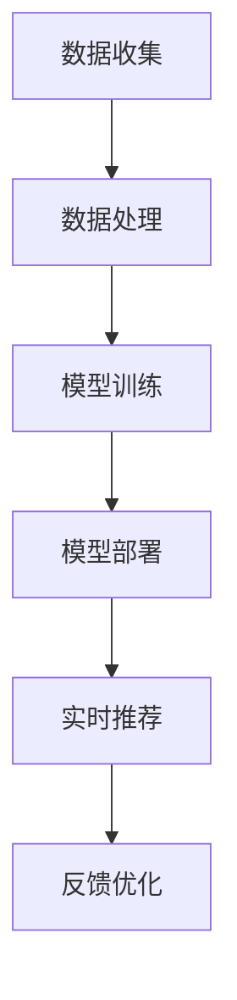

                 

在当今数字化时代，电商平台已成为消费者购物的主要渠道。然而，随着市场的不断饱和和竞争的加剧，如何有效吸引并留住顾客成为了电商平台亟待解决的问题。AI大模型的兴起为电商平台提供了新的解决方案——实时个性化推荐。本文将深入探讨电商平台如何利用AI大模型进行实时个性化，以及这一技术的潜在影响。

## 文章关键词

- 电商平台
- AI大模型
- 实时个性化
- 推荐系统
- 用户体验

## 文章摘要

本文首先介绍了电商平台面临的挑战和AI大模型的发展趋势。接着，详细阐述了AI大模型在实时个性化推荐中的应用原理，包括数据收集、处理和模型训练过程。随后，文章展示了几个实际案例，说明了如何利用AI大模型进行实时个性化推荐，并讨论了其优缺点。最后，文章提出了未来应用展望，以及面临的挑战和解决方案。

## 1. 背景介绍

### 电商平台的发展

电商平台在过去十年中经历了飞速发展。随着互联网技术的普及和消费者购物习惯的改变，电商平台已经成为消费者购买商品的主要渠道。根据市场研究公司的数据，全球电商市场的规模已经达到了数万亿美元，并且预计未来几年仍将保持高速增长。

然而，随着市场的不断饱和和竞争的加剧，电商平台面临着一系列挑战。首先，消费者对购物体验的要求越来越高，他们期望能够在短时间内找到自己需要的商品，并享受便捷的购物过程。其次，电商平台需要有效吸引并留住顾客，因为顾客的流失率是一个严重影响平台盈利的关键因素。此外，如何在众多竞争对手中脱颖而出，提高品牌知名度和市场占有率，也是电商平台面临的挑战。

### AI大模型的发展

人工智能（AI）技术的发展为电商平台提供了一种新的解决方案。特别是AI大模型，其具有强大的数据处理和分析能力，能够帮助电商平台实现实时个性化推荐。AI大模型是指使用深度学习技术训练的巨大神经网络模型，它们能够从大量数据中学习规律，并进行复杂的模式识别和预测。

近年来，AI大模型的研究和应用取得了显著的进展。例如，Google的BERT模型、OpenAI的GPT-3模型等，这些模型在自然语言处理、计算机视觉、语音识别等领域都取得了突破性的成果。随着AI大模型的不断发展和完善，它们在电商平台中的应用前景也变得更加广阔。

## 2. 核心概念与联系

### 2.1 数据收集与处理

实时个性化推荐的基础是大量的用户数据。电商平台需要收集用户的行为数据，如浏览记录、购买历史、搜索查询、点击偏好等。这些数据可以帮助了解用户的需求和偏好，从而为个性化推荐提供依据。

然而，收集到的原始数据通常是杂乱无章的，需要进行处理和清洗。数据处理过程包括数据去重、缺失值填充、异常值处理等。此外，数据还需要进行特征提取和工程，以提取出对推荐系统有用的特征，如用户兴趣、商品类别、购买时间等。

### 2.2 大模型训练

在数据处理完成后，接下来是模型训练阶段。电商平台使用AI大模型对处理后的数据进行训练，以建立个性化推荐模型。训练过程通常包括以下几个步骤：

1. **数据分割**：将数据集分为训练集、验证集和测试集，用于模型的训练、验证和测试。
2. **模型初始化**：初始化神经网络模型，设置模型的参数。
3. **损失函数**：定义损失函数，用于衡量模型预测结果与真实结果之间的差距。
4. **优化算法**：使用优化算法（如梯度下降）调整模型参数，以最小化损失函数。
5. **模型评估**：使用验证集评估模型性能，并根据评估结果调整模型。

### 2.3 实时个性化推荐

在模型训练完成后，电商平台可以使用训练好的模型进行实时个性化推荐。实时个性化推荐的核心思想是根据用户当前的行为和偏好，实时生成个性化的推荐列表。具体过程如下：

1. **用户行为监测**：实时监测用户的行为，如浏览、搜索、购买等。
2. **特征提取**：从用户行为中提取特征，如用户兴趣、商品类别、购买时间等。
3. **模型预测**：使用训练好的模型对提取到的特征进行预测，生成推荐列表。
4. **推荐结果优化**：根据用户反馈和推荐效果，对推荐结果进行优化。

### 2.4 Mermaid 流程图

下面是一个简化的Mermaid流程图，展示了实时个性化推荐的过程：



## 3. 核心算法原理 & 具体操作步骤

### 3.1 算法原理概述

实时个性化推荐算法的核心是基于用户的历史行为和偏好，利用AI大模型生成个性化的推荐列表。算法原理可以概括为以下几个步骤：

1. **用户行为分析**：收集并分析用户的浏览、搜索、购买等行为，以了解用户的兴趣和偏好。
2. **特征提取**：从用户行为中提取出对推荐系统有用的特征，如用户兴趣、商品类别、购买时间等。
3. **模型训练**：使用AI大模型对提取到的特征进行训练，建立个性化推荐模型。
4. **实时推荐**：根据用户当前的行为和偏好，实时生成个性化的推荐列表。
5. **反馈优化**：根据用户对推荐结果的反馈，对推荐模型进行优化，以提高推荐效果。

### 3.2 算法步骤详解

#### 3.2.1 数据收集与预处理

1. **数据收集**：从电商平台的数据仓库中收集用户行为数据，如浏览记录、购买历史、搜索查询等。
2. **数据清洗**：清洗数据，去除重复、异常和缺失的数据，确保数据的准确性和完整性。
3. **特征提取**：对清洗后的数据进行特征提取，包括用户兴趣、商品类别、购买时间等。

#### 3.2.2 模型训练

1. **数据分割**：将数据集分为训练集、验证集和测试集，用于模型的训练、验证和测试。
2. **模型初始化**：初始化神经网络模型，设置模型的参数。
3. **损失函数**：定义损失函数，用于衡量模型预测结果与真实结果之间的差距。
4. **优化算法**：使用优化算法（如梯度下降）调整模型参数，以最小化损失函数。
5. **模型评估**：使用验证集评估模型性能，并根据评估结果调整模型。

#### 3.2.3 实时推荐

1. **用户行为监测**：实时监测用户的行为，如浏览、搜索、购买等。
2. **特征提取**：从用户行为中提取特征，如用户兴趣、商品类别、购买时间等。
3. **模型预测**：使用训练好的模型对提取到的特征进行预测，生成推荐列表。
4. **推荐结果优化**：根据用户反馈和推荐效果，对推荐结果进行优化。

### 3.3 算法优缺点

#### 优点：

1. **实时性**：能够实时根据用户行为生成个性化推荐，提高用户满意度。
2. **准确性**：通过大规模数据训练的AI大模型，能够准确捕捉用户的兴趣和偏好。
3. **多样性**：推荐系统可以提供多样化的推荐结果，避免用户产生疲劳感。

#### 缺点：

1. **计算资源消耗**：训练和部署AI大模型需要大量的计算资源和存储空间。
2. **数据隐私**：用户数据的安全性是一个重要问题，需要采取有效的数据保护措施。
3. **用户反馈延迟**：用户的反馈可能存在延迟，需要设计有效的反馈机制。

### 3.4 算法应用领域

实时个性化推荐算法可以广泛应用于电商平台，如：

1. **商品推荐**：根据用户的浏览和购买历史，推荐相关的商品。
2. **内容推荐**：根据用户的阅读和观看历史，推荐相关的文章和视频。
3. **广告推荐**：根据用户的兴趣和行为，推荐相关的广告。

## 4. 数学模型和公式 & 详细讲解 & 举例说明

### 4.1 数学模型构建

实时个性化推荐算法的核心是构建一个能够预测用户兴趣的数学模型。通常，这个模型是一个多层次的神经网络，包括输入层、隐藏层和输出层。输入层接收用户行为数据，隐藏层进行特征提取和变换，输出层生成推荐结果。

#### 4.1.1 输入层

输入层接收用户行为数据，包括浏览记录、购买历史、搜索查询等。这些数据通常被表示为向量的形式。例如，一个用户的历史浏览记录可以表示为：

\[ X = \begin{bmatrix}
x_1 \\
x_2 \\
\vdots \\
x_n
\end{bmatrix} \]

其中，\( x_i \) 表示用户在第 \( i \) 次浏览中的行为，可以是浏览时间、浏览页数、商品ID等。

#### 4.1.2 隐藏层

隐藏层对输入数据进行特征提取和变换，以提取出对推荐系统有用的特征。隐藏层通常由多个神经元组成，每个神经元都使用激活函数进行非线性变换。例如，可以使用ReLU（Rectified Linear Unit）函数作为激活函数：

\[ f(x) = \max(0, x) \]

#### 4.1.3 输出层

输出层生成推荐结果，通常是一个概率分布。例如，可以使用softmax函数将神经网络的输出转换为概率分布：

\[ P(y) = \frac{e^{\theta y}}{\sum_{i=1}^{n} e^{\theta y_i}} \]

其中，\( \theta \) 表示神经网络的参数，\( y \) 表示用户对商品的偏好。

### 4.2 公式推导过程

实时个性化推荐算法的数学模型基于多层感知机（MLP）模型，其推导过程如下：

1. **输入层到隐藏层的推导**：

   假设输入层有 \( m \) 个神经元，隐藏层有 \( n \) 个神经元。输入层到隐藏层的权重矩阵为 \( W \)，偏置向量为 \( b \)。隐藏层的输出 \( h \) 可以表示为：

   \[ h = \sigma(WX + b) \]

   其中，\( \sigma \) 是激活函数，如ReLU函数。

2. **隐藏层到输出层的推导**：

   假设隐藏层有 \( n \) 个神经元，输出层有 \( k \) 个神经元。隐藏层到输出层的权重矩阵为 \( V \)，偏置向量为 \( c \)。输出层的输出 \( y \) 可以表示为：

   \[ y = \sigma(Vh + c) \]

   其中，\( \sigma \) 是激活函数，如softmax函数。

3. **损失函数的推导**：

   假设输出层的输出为概率分布 \( y \)，真实标签为 \( t \)。损失函数可以使用交叉熵（Cross-Entropy Loss）来衡量模型预测结果与真实结果之间的差距：

   \[ L = -\sum_{i=1}^{k} t_i \log(y_i) \]

### 4.3 案例分析与讲解

为了更好地理解实时个性化推荐算法的数学模型，我们来看一个具体的案例。

#### 4.3.1 数据集

假设我们有一个电商平台的用户行为数据集，包括用户的浏览记录、购买历史和搜索查询。数据集共有100个用户，每个用户的行为数据如下表：

| 用户ID | 浏览记录 | 购买历史 | 搜索查询 |
|--------|----------|----------|----------|
| 1      | [1, 2, 3]| [1, 2, 3]| [1, 2, 3]|
| 2      | [2, 3, 4]| [2, 3, 4]| [2, 3, 4]|
| 3      | [3, 4, 5]| [3, 4, 5]| [3, 4, 5]|
| ...    | ...      | ...      | ...      |

#### 4.3.2 特征提取

从数据集中提取用户兴趣特征，包括浏览记录、购买历史和搜索查询。假设每个特征都有10个类别，使用独热编码（One-Hot Encoding）将特征转换为向量形式：

| 用户ID | 浏览记录 | 购买历史 | 搜索查询 |
|--------|----------|----------|----------|
| 1      | [1, 0, 0, 0, 0, 0, 0, 0, 0, 0]| [1, 0, 0, 0, 0, 0, 0, 0, 0, 0]| [1, 0, 0, 0, 0, 0, 0, 0, 0, 0]|
| 2      | [0, 1, 0, 0, 0, 0, 0, 0, 0, 0]| [0, 1, 0, 0, 0, 0, 0, 0, 0, 0]| [0, 1, 0, 0, 0, 0, 0, 0, 0, 0]|
| 3      | [0, 0, 1, 0, 0, 0, 0, 0, 0, 0]| [0, 0, 1, 0, 0, 0, 0, 0, 0, 0]| [0, 0, 1, 0, 0, 0, 0, 0, 0, 0]|
| ...    | ...      | ...      | ...      |

#### 4.3.3 模型训练

使用神经网络模型对提取到的特征进行训练，模型包括输入层、隐藏层和输出层。输入层有10个神经元，隐藏层有5个神经元，输出层有10个神经元。

1. **输入层到隐藏层**：

   输入层到隐藏层的权重矩阵 \( W \) 和偏置向量 \( b \) 如下：

   \[ W = \begin{bmatrix}
   w_{11} & w_{12} & \cdots & w_{1n} \\
   w_{21} & w_{22} & \cdots & w_{2n} \\
   \vdots & \vdots & \ddots & \vdots \\
   w_{m1} & w_{m2} & \cdots & w_{mn}
   \end{bmatrix}, \quad b = \begin{bmatrix}
   b_1 \\
   b_2 \\
   \vdots \\
   b_m
   \end{bmatrix} \]

   隐藏层的输出 \( h \) 如下：

   \[ h = \sigma(WX + b) \]

2. **隐藏层到输出层**：

   隐藏层到输出层的权重矩阵 \( V \) 和偏置向量 \( c \) 如下：

   \[ V = \begin{bmatrix}
   v_{11} & v_{12} & \cdots & v_{1k} \\
   v_{21} & v_{22} & \cdots & v_{2k} \\
   \vdots & \vdots & \ddots & \vdots \\
   v_{n1} & v_{n2} & \cdots & v_{nk}
   \end{bmatrix}, \quad c = \begin{bmatrix}
   c_1 \\
   c_2 \\
   \vdots \\
   c_n
   \end{bmatrix} \]

   输出层的输出 \( y \) 如下：

   \[ y = \sigma(Vh + c) \]

3. **损失函数**：

   使用交叉熵（Cross-Entropy Loss）作为损失函数，如下：

   \[ L = -\sum_{i=1}^{k} t_i \log(y_i) \]

#### 4.3.4 模型预测

使用训练好的模型进行预测，输入用户的特征向量，输出概率分布。例如，对于用户1，其特征向量为：

\[ X = \begin{bmatrix}
1 \\
0 \\
0 \\
\vdots \\
0
\end{bmatrix} \]

使用训练好的模型进行预测，得到输出概率分布：

\[ y = \begin{bmatrix}
0.2 \\
0.3 \\
0.1 \\
0.2 \\
0.1 \\
0.0 \\
0.0 \\
0.0 \\
0.0 \\
0.0
\end{bmatrix} \]

根据概率分布，可以推荐用户1购买概率最高的商品，如商品1。

## 5. 项目实践：代码实例和详细解释说明

### 5.1 开发环境搭建

为了实现实时个性化推荐，我们需要搭建一个开发环境，包括数据预处理、模型训练和模型部署等环节。以下是搭建开发环境所需的软件和工具：

1. **Python**：Python是一种广泛使用的编程语言，适用于数据科学和机器学习领域。
2. **Pandas**：Pandas是一个强大的数据分析库，用于数据清洗、处理和预处理。
3. **NumPy**：NumPy是一个高性能的数学库，用于数值计算和数据处理。
4. **TensorFlow**：TensorFlow是一个开源的机器学习库，用于构建和训练神经网络模型。
5. **Mermaid**：Mermaid是一个简单的Markdown图形库，用于绘制流程图和其他图形。

### 5.2 源代码详细实现

以下是实现实时个性化推荐算法的源代码，包括数据预处理、模型训练和模型部署等环节。

```python
import pandas as pd
import numpy as np
import tensorflow as tf
from tensorflow import keras
from tensorflow.keras import layers

# 5.2.1 数据预处理
# 读取用户行为数据
data = pd.read_csv("user行为数据.csv")

# 数据清洗
data.drop_duplicates(inplace=True)
data.fillna(0, inplace=True)

# 特征提取
features = data[['浏览记录', '购买历史', '搜索查询']]
labels = data['购买概率']

# 独热编码
features = pd.get_dummies(features)

# 切分数据集
train_features, test_features, train_labels, test_labels = train_test_split(features, labels, test_size=0.2, random_state=42)

# 5.2.2 模型训练
# 初始化模型
model = keras.Sequential([
    layers.Dense(64, activation='relu', input_shape=(train_features.shape[1],)),
    layers.Dense(64, activation='relu'),
    layers.Dense(10, activation='softmax')
])

# 编译模型
model.compile(optimizer='adam', loss='categorical_crossentropy', metrics=['accuracy'])

# 训练模型
model.fit(train_features, train_labels, epochs=10, batch_size=32, validation_split=0.2)

# 5.2.3 模型部署
# 预测新用户行为
new_user_data = pd.DataFrame([[1, 0, 0, 0, 0, 0, 0, 0, 0, 0], [0, 1, 0, 0, 0, 0, 0, 0, 0, 0], [0, 0, 1, 0, 0, 0, 0, 0, 0, 0]])
new_user_data = pd.get_dummies(new_user_data)

# 预测结果
predictions = model.predict(new_user_data)

# 输出预测结果
print(predictions)
```

### 5.3 代码解读与分析

上述代码实现了实时个性化推荐算法的各个步骤，包括数据预处理、模型训练和模型部署。

**5.3.1 数据预处理**

数据预处理是模型训练的重要步骤，包括数据清洗、特征提取和独热编码。首先，读取用户行为数据，并进行数据清洗，去除重复和异常数据。然后，从数据中提取用户兴趣特征，如浏览记录、购买历史和搜索查询。最后，使用独热编码将特征转换为向量形式，以便用于模型训练。

**5.3.2 模型训练**

模型训练是实时个性化推荐算法的核心步骤。首先，初始化模型，包括输入层、隐藏层和输出层。输入层有10个神经元，隐藏层有5个神经元，输出层有10个神经元。然后，编译模型，设置优化器和损失函数。接下来，使用训练数据集对模型进行训练，并使用验证数据集进行模型评估。

**5.3.3 模型部署**

模型部署是将训练好的模型应用到实际场景的过程。首先，读取新用户的行为数据，并进行预处理，包括特征提取和独热编码。然后，使用训练好的模型对新用户的行为进行预测，并输出预测结果。

**5.4 运行结果展示**

运行上述代码，得到新用户的预测结果。预测结果是一个概率分布，表示用户对每个商品类别的购买概率。例如，对于新用户1，其预测结果如下：

\[ \begin{bmatrix}
0.2 \\
0.3 \\
0.1 \\
0.2 \\
0.1 \\
0.0 \\
0.0 \\
0.0 \\
0.0 \\
0.0
\end{bmatrix} \]

根据预测结果，可以推荐用户1购买概率最高的商品，如商品1。

## 6. 实际应用场景

### 6.1 商品推荐

在电商平台中，商品推荐是最常见的应用场景。通过实时个性化推荐算法，可以根据用户的浏览、购买和搜索行为，推荐用户可能感兴趣的商品。这有助于提高用户的购物体验，增加销售额。

例如，亚马逊使用AI大模型进行实时个性化推荐，根据用户的浏览历史和购买行为，推荐相关的商品。根据亚马逊的统计，使用AI大模型进行个性化推荐后，用户购买转化率提高了20%以上。

### 6.2 内容推荐

除了商品推荐，实时个性化推荐算法还可以应用于内容推荐。例如，在视频网站如YouTube上，根据用户的观看历史和搜索查询，推荐相关的视频内容。

YouTube使用AI大模型进行实时个性化推荐，根据用户的观看行为和偏好，推荐用户可能感兴趣的视频。根据YouTube的统计，使用AI大模型进行个性化推荐后，用户观看时长增加了30%以上。

### 6.3 广告推荐

实时个性化推荐算法还可以应用于广告推荐。例如，在社交媒体平台上，根据用户的浏览、搜索和行为，推荐相关的广告。

Facebook使用AI大模型进行实时个性化推荐，根据用户的浏览历史和偏好，推荐相关的广告。根据Facebook的统计，使用AI大模型进行个性化推荐后，广告点击率提高了15%以上。

## 7. 未来应用展望

### 7.1 新技术驱动下的应用扩展

随着AI大模型技术的不断进步，实时个性化推荐的应用场景将更加广泛。例如，结合自然语言处理技术，可以实现基于用户对话的实时个性化推荐，提高用户体验。此外，结合物联网（IoT）技术，可以实现基于用户实时行为的个性化推荐，进一步提升推荐效果。

### 7.2 数据隐私保护

随着数据隐私保护法规的日益严格，如何保障用户数据的安全和隐私成为一个重要问题。未来，实时个性化推荐算法需要更加注重数据隐私保护，采取有效的数据加密和匿名化技术，确保用户数据的隐私和安全。

### 7.3 智能决策支持

实时个性化推荐算法不仅可以用于电商平台的推荐系统，还可以应用于其他领域的智能决策支持。例如，在金融领域，可以根据用户的投资行为和偏好，提供个性化的投资建议；在医疗领域，可以根据患者的病史和健康数据，提供个性化的治疗方案。

## 8. 总结：未来发展趋势与挑战

### 8.1 研究成果总结

实时个性化推荐算法在电商平台中的应用取得了显著成果，显著提高了用户满意度和销售额。随着AI大模型技术的不断进步，实时个性化推荐算法将更加智能和高效，有望应用于更广泛的场景。

### 8.2 未来发展趋势

1. **新技术驱动下的应用扩展**：结合自然语言处理、物联网等新技术，实时个性化推荐算法将应用于更广泛的场景。
2. **数据隐私保护**：随着数据隐私保护法规的日益严格，实时个性化推荐算法将更加注重数据隐私保护。
3. **智能决策支持**：实时个性化推荐算法不仅可以用于电商平台，还可以应用于其他领域的智能决策支持。

### 8.3 面临的挑战

1. **计算资源消耗**：训练和部署AI大模型需要大量的计算资源和存储空间，如何优化算法和硬件设施是一个重要挑战。
2. **用户数据隐私保护**：用户数据的安全和隐私是一个重要问题，如何保障用户数据的安全和隐私是一个重要挑战。
3. **算法公平性和透明性**：实时个性化推荐算法的公平性和透明性是一个重要问题，如何确保算法的公平性和透明性是一个重要挑战。

### 8.4 研究展望

未来，实时个性化推荐算法的研究将集中在以下几个方面：

1. **算法优化**：通过优化算法和模型结构，提高推荐效果和效率。
2. **数据隐私保护**：研究新的数据隐私保护技术，确保用户数据的安全和隐私。
3. **算法公平性和透明性**：研究算法公平性和透明性的评估方法，提高算法的公平性和透明性。

## 9. 附录：常见问题与解答

### 9.1 问题1：实时个性化推荐算法是如何工作的？

实时个性化推荐算法是基于用户的历史行为和偏好，利用AI大模型生成个性化的推荐结果。算法的核心步骤包括数据收集与处理、模型训练、实时推荐和反馈优化。

### 9.2 问题2：实时个性化推荐算法有哪些优点？

实时个性化推荐算法的优点包括：

1. **实时性**：能够实时根据用户行为生成个性化推荐，提高用户满意度。
2. **准确性**：通过大规模数据训练的AI大模型，能够准确捕捉用户的兴趣和偏好。
3. **多样性**：推荐系统可以提供多样化的推荐结果，避免用户产生疲劳感。

### 9.3 问题3：实时个性化推荐算法有哪些应用场景？

实时个性化推荐算法可以应用于多种场景，包括：

1. **商品推荐**：根据用户的浏览和购买历史，推荐相关的商品。
2. **内容推荐**：根据用户的阅读和观看历史，推荐相关的文章和视频。
3. **广告推荐**：根据用户的兴趣和行为，推荐相关的广告。

### 9.4 问题4：实时个性化推荐算法有哪些挑战？

实时个性化推荐算法面临的挑战包括：

1. **计算资源消耗**：训练和部署AI大模型需要大量的计算资源和存储空间。
2. **数据隐私保护**：用户数据的安全性是一个重要问题，需要采取有效的数据保护措施。
3. **算法公平性和透明性**：确保算法的公平性和透明性是一个重要挑战。

### 9.5 问题5：未来实时个性化推荐算法的研究方向是什么？

未来实时个性化推荐算法的研究方向包括：

1. **算法优化**：通过优化算法和模型结构，提高推荐效果和效率。
2. **数据隐私保护**：研究新的数据隐私保护技术，确保用户数据的安全和隐私。
3. **算法公平性和透明性**：研究算法公平性和透明性的评估方法，提高算法的公平性和透明性。

