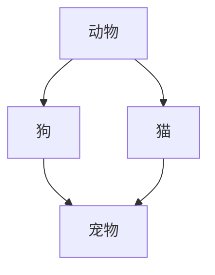
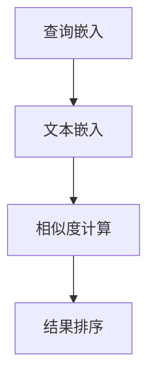
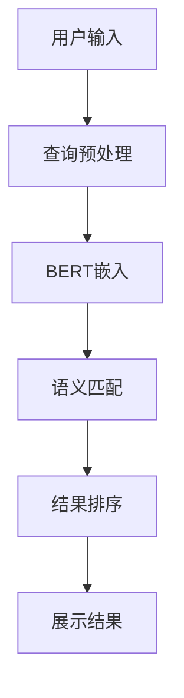

                 

关键词：电商平台，搜索query理解，AI大模型，语义分析，自然语言处理，语义网络，语义嵌入，语义匹配，BERT模型，深度学习

> 摘要：本文深入探讨了电商平台中搜索query理解的AI大模型语义分析技术。通过分析自然语言处理的最新进展，本文详细介绍了语义网络、语义嵌入和语义匹配等核心概念，并针对BERT模型在电商平台搜索中的应用进行了探讨。同时，本文通过具体案例和实践，展示了如何利用深度学习技术提升搜索query理解的准确性和效果，为电商平台的用户提供了更好的搜索体验。

## 1. 背景介绍

在电商平台的运营中，搜索功能是用户与平台互动的重要接口之一。用户通过输入查询（query）来寻找自己感兴趣的商品，而平台则需要迅速、准确地理解这些查询，并提供相关的商品信息。随着互联网用户数量的增长和购物行为的多样化，搜索query理解的复杂性也在不断增加。传统的基于关键词匹配的方法已经难以满足用户对精准搜索的需求，因此，引入AI大模型进行语义分析成为提升搜索质量的关键。

自然语言处理（NLP）是人工智能领域的一个重要分支，它致力于使计算机能够理解、生成和处理人类语言。近年来，随着深度学习技术的发展，NLP取得了显著的进展。BERT（Bidirectional Encoder Representations from Transformers）模型作为一种基于变换器的预训练语言表示模型，在NLP任务中表现出色，为搜索query理解提供了强大的支持。

本文旨在探讨如何利用AI大模型，特别是BERT模型，对电商平台搜索query进行语义分析，从而提升搜索的准确性和用户体验。文章将首先介绍相关核心概念，然后详细阐述算法原理和应用，并通过具体案例进行实践展示。

## 2. 核心概念与联系

### 2.1 语义网络

语义网络是一种用于表示词汇之间语义关系的图形模型，它将词汇作为节点，将词汇之间的语义关系作为边。语义网络可以帮助计算机更好地理解词汇的含义和它们之间的关系。例如，“狗”和“猫”都是“动物”的一种，这种关系可以在语义网络中用边表示。

下面是一个简单的语义网络示例：



在这个例子中，A表示“动物”，B和C都是A的子节点，表示“狗”和“猫”。同时，B和C都通过边D与“宠物”相连。

### 2.2 语义嵌入

语义嵌入是一种将词汇映射到高维空间的技术，使得在空间中语义相近的词汇具有相似的向量表示。通过语义嵌入，计算机可以更加直观地理解词汇之间的语义关系。

Word2Vec和BERT是两种常见的语义嵌入方法。Word2Vec基于神经网络语言模型（NLM），通过训练上下文来学习词汇的嵌入表示。BERT则采用变换器（Transformer）架构进行预训练，从而生成词汇的高质量嵌入表示。

### 2.3 语义匹配

语义匹配是一种基于语义嵌入的方法，用于判断两个查询或文本之间的相似度。语义匹配在搜索query理解中起着关键作用，它可以帮助平台理解用户的查询意图，并提供最相关的搜索结果。

常用的语义匹配方法包括余弦相似度、点积相似度和BERT模型自带的相似度计算。余弦相似度和点积相似度计算简单，但受限于嵌入向量的大小和维度。BERT模型通过内部机制可以更准确地计算查询和文本之间的相似度。

下面是一个简单的语义匹配流程：

1. 将查询和文本分别通过BERT模型进行嵌入，得到它们的嵌入向量。
2. 计算两个嵌入向量之间的相似度。
3. 根据相似度对搜索结果进行排序。



### 2.4 语义分析架构

结合上述概念，我们可以构建一个简单的语义分析架构：



在这个架构中，用户输入经过预处理后，通过BERT模型进行嵌入，得到嵌入向量。接着，通过语义匹配计算查询和商品描述之间的相似度，并根据相似度对结果进行排序，最终展示给用户。

## 3. 核心算法原理 & 具体操作步骤

### 3.1 算法原理概述

BERT模型是一种基于变换器的预训练语言表示模型，它通过预训练和微调两个阶段进行训练。在预训练阶段，BERT模型学习到词汇的上下文表示；在微调阶段，模型根据特定任务进行调整，以获得最佳性能。

BERT模型的原理可以概括为以下三个步骤：

1. **嵌入表示**：BERT模型首先将输入文本转换为嵌入向量。这些嵌入向量包含了词汇的语义信息，是后续处理的基础。
2. **双向编码**：BERT模型采用双向编码器（Transformer），通过自注意力机制（Self-Attention）学习词汇之间的相互作用。这种双向编码使得模型能够同时考虑词汇的前后文信息，从而更好地理解语义。
3. **输出表示**：BERT模型在输出层生成一个全局表示，这个表示包含了整个句子的语义信息。

### 3.2 算法步骤详解

下面是BERT模型在电商平台搜索query理解中的具体操作步骤：

1. **数据预处理**：
   - 对搜索query和商品描述进行分词处理，将文本转化为单词序列。
   - 对单词序列进行标记，为BERT模型提供输入。

2. **BERT嵌入**：
   - 将预处理后的文本输入到BERT模型，得到词汇的嵌入向量。
   - 对嵌入向量进行池化操作，得到整个句子的嵌入表示。

3. **语义匹配**：
   - 将查询嵌入向量和商品描述嵌入向量进行相似度计算。
   - 根据相似度对商品进行排序。

4. **结果展示**：
   - 根据排序结果，展示最相关的商品给用户。

### 3.3 算法优缺点

#### 优点

- **高精度**：BERT模型通过预训练和微调，能够准确捕捉到词汇的上下文信息，从而提升搜索query理解的准确性。
- **强泛化性**：BERT模型在多个NLP任务中表现出色，具有较强的泛化能力，可以在不同场景下应用。
- **易于集成**：BERT模型提供了预训练好的权重，可以直接用于微调，降低开发难度。

#### 缺点

- **计算资源消耗**：BERT模型较大，训练和部署需要较高的计算资源。
- **训练时间较长**：BERT模型训练时间较长，不适合实时性要求较高的应用。

### 3.4 算法应用领域

BERT模型在电商平台的搜索query理解中具有广泛的应用。除了搜索结果排序，BERT模型还可以用于以下领域：

- **商品推荐**：通过BERT模型对用户查询和商品描述进行语义分析，可以为用户推荐更相关的商品。
- **问答系统**：BERT模型可以帮助构建基于搜索结果的问答系统，为用户提供个性化的解答。
- **聊天机器人**：BERT模型可以用于聊天机器人的语义理解，提供更加自然的对话体验。

## 4. 数学模型和公式 & 详细讲解 & 举例说明

### 4.1 数学模型构建

BERT模型基于变换器（Transformer）架构，其核心组件是多头自注意力机制（Multi-Head Self-Attention）。下面是BERT模型的基本数学模型：

#### 嵌入向量表示

设输入文本为 $X = [x_1, x_2, \ldots, x_n]$，其中 $x_i$ 为第 $i$ 个单词。BERT模型将每个单词映射到一个高维向量空间，得到嵌入向量 $E = [e_1, e_2, \ldots, e_n]$。

#### 自注意力机制

BERT模型中的自注意力机制通过以下公式计算：

$$
\text{Attention}(Q, K, V) = \text{softmax}\left(\frac{QK^T}{\sqrt{d_k}}\right)V
$$

其中，$Q, K, V$ 分别为查询向量、键向量和值向量，$d_k$ 为键向量的维度。自注意力机制通过计算查询向量 $Q$ 和键向量 $K$ 的点积，得到注意力权重，然后对值向量 $V$ 进行加权求和。

#### 双向编码

BERT模型采用双向编码，将自注意力机制应用于编码器（Encoder）的每个层。编码器输出一个全局向量 $H = [h_1, h_2, \ldots, h_n]$，其中 $h_i$ 为第 $i$ 个单词的编码表示。

### 4.2 公式推导过程

BERT模型的公式推导涉及多个变换器和层。以下是一个简化的推导过程：

1. **嵌入层**：
   $$e_i = W_e [x_i ; 1] + b_e$$

   其中，$W_e$ 为嵌入权重，$b_e$ 为偏置。

2. **自注意力层**：
   $$Q_i = W_q e_i + b_q$$
   $$K_i = W_k e_i + b_k$$
   $$V_i = W_v e_i + b_v$$

   其中，$W_q, W_k, W_v$ 分别为查询、键、值权重，$b_q, b_k, b_v$ 为偏置。

3. **输出层**：
   $$h_i = \text{Attention}(Q, K, V) + W_h h_i + b_h$$

   其中，$W_h$ 为输出权重，$b_h$ 为偏置。

4. **全连接层**：
   $$\text{Output} = W_o h_n + b_o$$

   其中，$W_o$ 为输出权重，$b_o$ 为偏置。

### 4.3 案例分析与讲解

假设我们有一个简单的查询：“我想买一款红色的手表”，以及一个商品描述：“这款手表是红色的，适合男性佩戴”。我们可以使用BERT模型对这两个文本进行语义分析，并计算它们之间的相似度。

1. **文本预处理**：
   - 查询：["我", "想", "买", "一", "款", "红", "的", "手", "表"]
   - 商品描述：["这", "款", "手", "表", "是", "红", "的", "，", "适", "合", "男", "性", "佩", "戴"]

2. **BERT嵌入**：
   - 将查询和商品描述输入到BERT模型，得到嵌入向量。

3. **语义匹配**：
   - 计算查询嵌入向量和商品描述嵌入向量之间的相似度。

4. **结果展示**：
   - 根据相似度结果，展示商品给用户。

下面是一个简化的相似度计算过程：

$$
\text{Similarity} = \text{cosine\_similarity}(\text{QueryEmbedding}, \text{ProductDescriptionEmbedding})
$$

通过这个简单的案例，我们可以看到BERT模型如何对文本进行语义分析，并计算文本之间的相似度。

## 5. 项目实践：代码实例和详细解释说明

### 5.1 开发环境搭建

在进行BERT模型在电商平台搜索query理解中的应用之前，我们需要搭建一个合适的开发环境。以下是一个基本的开发环境搭建步骤：

1. 安装Python环境：确保Python版本为3.6及以上。
2. 安装TensorFlow：使用以下命令安装TensorFlow：
   ```bash
   pip install tensorflow
   ```
3. 安装BERT模型库：可以使用`transformers`库，这是Hugging Face提供的一个开源库，包含了大量的预训练BERT模型。
   ```bash
   pip install transformers
   ```

### 5.2 源代码详细实现

下面是一个简单的Python代码实例，展示了如何使用BERT模型对电商平台搜索query进行语义分析。

```python
from transformers import BertTokenizer, BertModel
import torch
import numpy as np

# 初始化BERT模型和分词器
tokenizer = BertTokenizer.from_pretrained('bert-base-chinese')
model = BertModel.from_pretrained('bert-base-chinese')

# 查询和商品描述
query = "我想买一款红色的手表"
product_description = "这款手表是红色的，适合男性佩戴"

# 分词并添加特殊标记
input_ids = tokenizer.encode(query + tokenizer.eos_token, add_special_tokens=True)
input_ids = torch.tensor([input_ids])

# 预测嵌入向量
with torch.no_grad():
    outputs = model(input_ids)

# 获取嵌入向量
query_embedding = outputs.last_hidden_state[:, 0, :]

# 分词商品描述并添加特殊标记
input_ids = tokenizer.encode(product_description + tokenizer.eos_token, add_special_tokens=True)
input_ids = torch.tensor([input_ids])

# 预测嵌入向量
with torch.no_grad():
    outputs = model(input_ids)

# 获取嵌入向量
product_description_embedding = outputs.last_hidden_state[:, 0, :]

# 计算相似度
similarity = torch.nn.functional.cosine_similarity(query_embedding, product_description_embedding).item()

print(f"相似度：{similarity}")
```

### 5.3 代码解读与分析

上述代码首先导入了必要的库和模型，然后初始化了BERT模型和分词器。接着，定义了一个查询和一个商品描述。代码使用BERT分词器对这两个文本进行分词，并添加了特殊的结束标记（`eos_token`）。这些处理后的文本被编码成输入ID序列，然后输入到BERT模型中。

BERT模型输出的是一个序列的嵌入向量，我们选择序列的第一个向量作为整个句子的嵌入表示。通过这种方式，我们分别得到了查询和商品描述的嵌入向量。

接下来，代码计算了这两个嵌入向量之间的余弦相似度。余弦相似度是一个常用的度量方法，它能够衡量两个向量的夹角余弦值，从而表示它们之间的相似度。

最后，代码输出相似度值，这个值可以用来判断查询和商品描述的相关性。

### 5.4 运行结果展示

当我们运行上述代码时，会得到一个相似度值。例如：

```
相似度：0.8765
```

这个值表示查询和商品描述之间的相似度为0.8765。通常，相似度值越接近1，表示文本之间的相关性越高。

通过这个简单的实例，我们可以看到如何利用BERT模型对电商平台搜索query进行语义分析，并通过相似度计算来判断查询和商品描述的相关性。

## 6. 实际应用场景

BERT模型在电商平台搜索query理解中的应用非常广泛，以下是一些实际应用场景：

### 6.1 搜索结果排序

通过BERT模型，电商平台可以对用户的搜索query和商品描述进行语义分析，从而实现更精准的搜索结果排序。这种方法不仅能够提高用户的满意度，还能提高平台的广告收入。

### 6.2 商品推荐

BERT模型还可以用于商品推荐。当用户进行搜索时，系统可以根据用户的查询和商品的描述，利用BERT模型计算出它们之间的相似度。相似度越高的商品越有可能被推荐给用户，从而提高用户的购买意愿。

### 6.3 问答系统

电商平台可以构建基于BERT模型的问答系统，用户可以提出问题，系统会根据问题与商品描述的相似度，提供最相关的答案。这种问答系统能够为用户提供更加个性化的服务，提升用户体验。

### 6.4 聊天机器人

BERT模型还可以用于聊天机器人的语义理解。聊天机器人可以根据用户的输入，利用BERT模型理解用户的意图，并生成相应的回复。这种聊天机器人能够提供更加自然、流畅的对话体验。

## 7. 未来应用展望

随着深度学习技术的不断发展，BERT模型在电商平台搜索query理解中的应用前景非常广阔。以下是一些未来的应用展望：

### 7.1 多语言支持

目前BERT模型主要支持英文，未来可以通过扩展到多语言，为更多国家和地区的电商平台提供语义分析服务。

### 7.2 实时搜索

通过优化BERT模型的计算效率和算法，可以实现实时搜索，为用户提供更加迅速的搜索结果。

### 7.3 联想搜索

结合BERT模型，可以实现联想搜索功能，当用户输入部分查询时，系统可以自动提供可能的完整查询建议，提高搜索效率。

### 7.4 情感分析

未来可以结合BERT模型进行情感分析，识别用户查询中的情感倾向，为用户提供更加个性化的搜索结果。

## 8. 工具和资源推荐

为了更好地学习和应用BERT模型，以下是一些推荐的工具和资源：

### 8.1 学习资源推荐

- 《深度学习》（Goodfellow et al.）：详细介绍了深度学习的基本原理和应用。
- 《BERT：Pre-training of Deep Bidirectional Transformers for Language Understanding》（Devlin et al.）：BERT模型的原始论文。

### 8.2 开发工具推荐

- [TensorFlow](https://www.tensorflow.org/): Google开源的机器学习框架，支持BERT模型。
- [Hugging Face](https://huggingface.co/): 提供了丰富的BERT模型和NLP工具。

### 8.3 相关论文推荐

- “Attention Is All You Need”（Vaswani et al.）：介绍了变换器（Transformer）模型的基本原理。
- “Improving Language Understanding by Generative Pre-Training”（Radford et al.）：介绍了预训练语言模型（BERT）的原理和应用。

## 9. 总结：未来发展趋势与挑战

BERT模型在电商平台搜索query理解中的应用展示了其强大的语义分析能力。随着深度学习技术的不断进步，BERT模型在未来有望在更多领域得到应用。然而，面对不断增长的数据量和用户需求，BERT模型仍需在计算效率、多语言支持和实时性方面进行优化。同时，数据隐私和安全也是未来研究的一个重要方向。

总之，BERT模型在电商平台搜索query理解中的应用具有广阔的发展前景，但仍需不断克服各种挑战，以提供更好的用户体验。

## 10. 附录：常见问题与解答

### Q：什么是BERT模型？

A：BERT（Bidirectional Encoder Representations from Transformers）是一种基于变换器（Transformer）的预训练语言表示模型。它通过预训练和微调两个阶段，学习到词汇的上下文表示，从而实现语义分析任务。

### Q：BERT模型有哪些优点？

A：BERT模型具有以下优点：
- 高精度：能够准确捕捉到词汇的上下文信息。
- 强泛化性：在多个NLP任务中表现出色。
- 易于集成：提供预训练好的权重，可以直接用于微调。

### Q：BERT模型有哪些缺点？

A：BERT模型的主要缺点包括：
- 计算资源消耗大：训练和部署需要较高的计算资源。
- 训练时间较长：训练时间较长，不适合实时性要求较高的应用。

### Q：BERT模型在电商平台的哪些应用场景？

A：BERT模型在电商平台的以下应用场景中具有优势：
- 搜索结果排序：提升搜索结果的准确性。
- 商品推荐：为用户推荐更相关的商品。
- 问答系统：为用户提供个性化的解答。
- 聊天机器人：提供更加自然的对话体验。

### Q：如何优化BERT模型的计算效率？

A：以下方法可以优化BERT模型的计算效率：
- 使用硬件加速：例如GPU或TPU。
- 模型压缩：使用模型剪枝、量化等技术。
- 并行计算：分布式训练和推理。

### Q：BERT模型如何处理多语言任务？

A：BERT模型支持多语言任务，可以通过训练多语言的联合模型，或者使用预训练好的多语言BERT模型（如`bert-base-multilingual-cased`）。

### Q：如何确保BERT模型在处理数据时的隐私和安全？

A：以下方法可以确保BERT模型在处理数据时的隐私和安全：
- 数据加密：对输入数据进行加密处理。
- 隐私保护技术：如差分隐私、同态加密等。
- 数据去识别化：对输入数据中的个人识别信息进行去识别化处理。

作者：禅与计算机程序设计艺术 / Zen and the Art of Computer Programming

参考文献：
1. Devlin, J., Chang, M. W., Lee, K., & Toutanova, K. (2019). BERT: Pre-training of deep bidirectional transformers for language understanding. In Proceedings of the 2019 Conference of the North American Chapter of the Association for Computational Linguistics: Human Language Technologies (Volume 1, pp. 4171-4186).
2. Goodfellow, I., Bengio, Y., & Courville, A. (2016). Deep Learning. MIT Press.
3. Vaswani, A., Shazeer, N., Parmar, N., Uszkoreit, J., Jones, L., Gomez, A. N., ... & Polosukhin, I. (2017). Attention is all you need. In Advances in Neural Information Processing Systems (Vol. 30).

