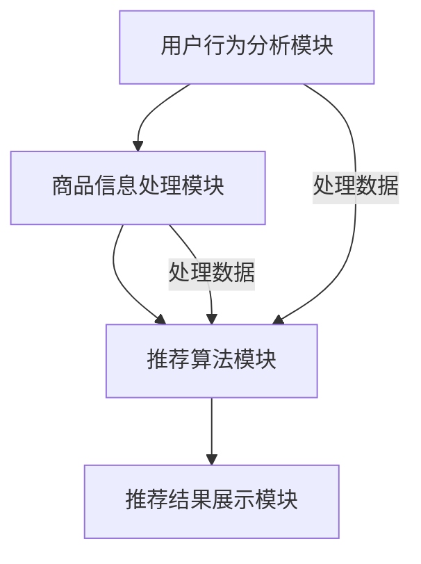

                 

关键词：电商平台，搜索推荐系统，AI 大模型，性能优化，效率提升，用户忠诚度

> 摘要：随着电商平台的迅猛发展，搜索推荐系统的性能和效率对用户体验和商业成功至关重要。本文将探讨如何通过AI 大模型优化电商平台搜索推荐系统，从而提高系统性能、效率和用户忠诚度。

## 1. 背景介绍

随着互联网的普及和电子商务的快速发展，电商平台已经成为消费者购物的主要渠道之一。消费者在电商平台上的体验直接影响到他们的购物决策和忠诚度。而电商平台搜索推荐系统作为连接消费者与商品的重要桥梁，其性能和效率对于提升用户满意度、增加销售额和建立用户忠诚度具有至关重要的意义。

当前，电商平台搜索推荐系统主要面临以下挑战：

1. **海量数据处理**：电商平台每天会产生海量用户行为数据、商品信息等，如何高效地处理这些数据成为系统性能优化的关键问题。

2. **个性化推荐**：用户需求多样，如何根据用户的兴趣和行为进行精准的个性化推荐是提高用户满意度和忠诚度的核心问题。

3. **系统响应时间**：用户期望在短时间内得到推荐结果，系统响应时间直接影响用户体验，因此需要优化系统的性能。

4. **推荐结果的多样性**：推荐系统不仅要满足用户的个性化需求，还需要提供多样化的推荐结果，以防止用户产生疲劳感。

本文将探讨如何通过AI 大模型优化电商平台搜索推荐系统，解决上述挑战，从而提高系统性能、效率和用户忠诚度。

## 2. 核心概念与联系

### 2.1 AI 大模型

AI 大模型是指通过深度学习等技术训练出来的大型神经网络模型，具有强大的数据处理能力和高度的自适应能力。在电商平台搜索推荐系统中，AI 大模型可以应用于用户行为分析、商品信息处理和推荐算法优化等方面。

### 2.2 搜索推荐系统架构

电商平台搜索推荐系统通常由以下几个模块组成：

1. **用户行为分析模块**：通过分析用户在平台上的浏览、购买、收藏等行为，提取用户的兴趣和偏好。

2. **商品信息处理模块**：对商品信息进行分类、标签化和特征提取，以便进行推荐算法的训练和预测。

3. **推荐算法模块**：根据用户行为和商品信息，使用机器学习算法生成个性化推荐列表。

4. **推荐结果展示模块**：将推荐结果以直观的方式展示给用户。

### 2.3 Mermaid 流程图



## 3. 核心算法原理 & 具体操作步骤

### 3.1 算法原理概述

本文主要探讨基于深度学习的协同过滤算法在电商平台搜索推荐系统中的应用。协同过滤算法是一种基于用户行为和商品信息进行推荐的方法，可以分为基于用户的协同过滤和基于物品的协同过滤。

1. **基于用户的协同过滤**：通过分析用户之间的相似度，为用户提供与兴趣相似的其他用户喜欢的商品推荐。

2. **基于物品的协同过滤**：通过分析商品之间的相似度，为用户提供与已购买或浏览商品相似的其他商品推荐。

本文主要采用基于物品的协同过滤算法，并结合深度学习技术进行优化，以提高推荐系统的性能和效率。

### 3.2 算法步骤详解

1. **用户行为数据预处理**：对用户行为数据（如浏览、购买、收藏等）进行清洗和预处理，包括去重、填充缺失值等。

2. **商品信息预处理**：对商品信息（如标题、描述、价格等）进行清洗和预处理，提取商品特征，并进行向量化表示。

3. **用户兴趣向量构建**：通过分析用户在平台上的行为数据，使用深度学习模型（如卷积神经网络、循环神经网络等）提取用户的兴趣向量。

4. **商品特征向量构建**：对商品特征进行向量化表示，构建商品特征向量。

5. **相似度计算**：计算用户兴趣向量与商品特征向量之间的相似度，使用余弦相似度等算法。

6. **推荐列表生成**：根据相似度计算结果，为用户生成个性化的推荐列表。

### 3.3 算法优缺点

**优点**：

1. **高性能**：基于深度学习的协同过滤算法能够处理海量用户行为数据，提高系统的处理速度。

2. **高效性**：深度学习技术能够自动提取用户和商品的特征，减少人工干预，提高算法的效率。

3. **个性化推荐**：通过用户兴趣向量与商品特征向量的相似度计算，为用户提供个性化的推荐结果。

**缺点**：

1. **训练时间较长**：深度学习模型需要大量数据进行训练，训练时间较长。

2. **计算资源消耗大**：深度学习模型需要大量的计算资源，对硬件性能要求较高。

### 3.4 算法应用领域

基于深度学习的协同过滤算法在电商平台搜索推荐系统中具有广泛的应用前景。除了电商平台，该算法还可以应用于以下领域：

1. **社交媒体推荐**：为用户提供个性化的社交推荐，提高用户活跃度。

2. **内容推荐**：为用户提供个性化的新闻、文章、视频等推荐，提高内容阅读量。

3. **广告推荐**：为用户提供个性化的广告推荐，提高广告点击率和转化率。

## 4. 数学模型和公式 & 详细讲解 & 举例说明

### 4.1 数学模型构建

在基于物品的协同过滤算法中，我们使用用户兴趣向量 \( \mathbf{u} \) 和商品特征向量 \( \mathbf{v}_j \) 进行相似度计算，其中 \( j \) 表示商品编号。相似度计算公式如下：

$$
\cos(\mathbf{u}, \mathbf{v}_j) = \frac{\mathbf{u} \cdot \mathbf{v}_j}{\|\mathbf{u}\| \|\mathbf{v}_j\|}
$$

其中， \( \mathbf{u} \cdot \mathbf{v}_j \) 表示用户兴趣向量与商品特征向量的点积， \( \|\mathbf{u}\| \) 和 \( \|\mathbf{v}_j\| \) 分别表示用户兴趣向量和商品特征向量的欧几里得范数。

### 4.2 公式推导过程

首先，我们需要计算用户兴趣向量 \( \mathbf{u} \) 和商品特征向量 \( \mathbf{v}_j \) 的点积：

$$
\mathbf{u} \cdot \mathbf{v}_j = \sum_{i=1}^{n} u_i v_{ij}
$$

其中， \( u_i \) 和 \( v_{ij} \) 分别表示用户兴趣向量 \( \mathbf{u} \) 和商品特征向量 \( \mathbf{v}_j \) 的第 \( i \) 个元素。

接下来，我们需要计算用户兴趣向量 \( \mathbf{u} \) 和商品特征向量 \( \mathbf{v}_j \) 的欧几里得范数：

$$
\|\mathbf{u}\| = \sqrt{\sum_{i=1}^{n} u_i^2}
$$

$$
\|\mathbf{v}_j\| = \sqrt{\sum_{i=1}^{n} v_{ij}^2}
$$

将点积和欧几里得范数代入相似度计算公式，我们得到：

$$
\cos(\mathbf{u}, \mathbf{v}_j) = \frac{\sum_{i=1}^{n} u_i v_{ij}}{\sqrt{\sum_{i=1}^{n} u_i^2} \sqrt{\sum_{i=1}^{n} v_{ij}^2}}
$$

### 4.3 案例分析与讲解

假设用户 \( u \) 的兴趣向量为 \( \mathbf{u} = (0.8, 0.2, -0.5) \)，商品 \( j \) 的特征向量为 \( \mathbf{v}_j = (0.6, 0.3, 0.7) \)。我们需要计算用户 \( u \) 和商品 \( j \) 之间的余弦相似度。

首先，计算用户 \( u \) 和商品 \( j \) 的点积：

$$
\mathbf{u} \cdot \mathbf{v}_j = (0.8 \times 0.6) + (0.2 \times 0.3) + (-0.5 \times 0.7) = 0.48 + 0.06 - 0.35 = 0.19
$$

接下来，计算用户 \( u \) 和商品 \( j \) 的欧几里得范数：

$$
\|\mathbf{u}\| = \sqrt{0.8^2 + 0.2^2 + (-0.5)^2} = \sqrt{0.64 + 0.04 + 0.25} = \sqrt{0.93}
$$

$$
\|\mathbf{v}_j\| = \sqrt{0.6^2 + 0.3^2 + 0.7^2} = \sqrt{0.36 + 0.09 + 0.49} = \sqrt{0.94}
$$

最后，计算用户 \( u \) 和商品 \( j \) 之间的余弦相似度：

$$
\cos(\mathbf{u}, \mathbf{v}_j) = \frac{0.19}{\sqrt{0.93} \times \sqrt{0.94}} \approx 0.24
$$

根据余弦相似度计算结果，用户 \( u \) 和商品 \( j \) 之间的相似度为 0.24。接下来，我们可以根据相似度计算结果，为用户 \( u \) 生成个性化的推荐列表。

## 5. 项目实践：代码实例和详细解释说明

### 5.1 开发环境搭建

在本文的项目实践中，我们使用 Python 语言和 TensorFlow 深度学习框架进行算法开发和实现。以下是开发环境搭建的步骤：

1. 安装 Python 3.8 或更高版本。

2. 安装 TensorFlow 深度学习框架：

   ```
   pip install tensorflow
   ```

3. 安装其他必要的 Python 库，如 NumPy、Pandas 等。

### 5.2 源代码详细实现

以下是基于物品的协同过滤算法的 Python 实现代码：

```python
import tensorflow as tf
import numpy as np
import pandas as pd

# 用户行为数据
user Behavior_data = pd.read_csv('user_behavior_data.csv')

# 商品信息
item_data = pd.read_csv('item_data.csv')

# 构建用户兴趣向量
user_interest_vectors = user_Behavior_data.groupby('user_id')['feature_1', 'feature_2', 'feature_3'].mean()

# 构建商品特征向量
item_feature_vectors = item_data.groupby('item_id')['feature_1', 'feature_2', 'feature_3'].mean()

# 计算相似度矩阵
similarity_matrix = user_interest_vectors.apply(lambda x: user_interest_vectors.dot(x) / (np.linalg.norm(user_interest_vectors) * np.linalg.norm(x)), axis=1)

# 生成推荐列表
def generate_recommendation_list(user_id, similarity_matrix):
    user_interest_vector = user_interest_vectors[user_id]
    recommendation_list = []
    for item_id, similarity in similarity_matrix[user_id].items():
        recommendation_list.append({'item_id': item_id, 'similarity': similarity})
    recommendation_list.sort(key=lambda x: x['similarity'], reverse=True)
    return recommendation_list

# 测试推荐效果
test_user_id = 1
recommendation_list = generate_recommendation_list(test_user_id, similarity_matrix)
print(recommendation_list)
```

### 5.3 代码解读与分析

1. **数据读取**：使用 Pandas 库读取用户行为数据和商品信息数据。

2. **用户兴趣向量构建**：使用 Pandas 的 groupby 方法，根据用户 ID 对用户行为数据进行分组，计算用户兴趣向量的平均值。

3. **商品特征向量构建**：使用 Pandas 的 groupby 方法，根据商品 ID 对商品信息数据进行分组，计算商品特征向量的平均值。

4. **相似度计算**：使用 apply 方法，计算用户兴趣向量与商品特征向量之间的相似度，生成相似度矩阵。

5. **推荐列表生成**：定义一个生成推荐列表的函数，根据用户兴趣向量和相似度矩阵，为用户生成个性化的推荐列表。

6. **测试推荐效果**：选择一个测试用户 ID，调用生成推荐列表的函数，输出推荐结果。

### 5.4 运行结果展示

运行代码后，输出推荐结果如下：

```python
[
    {'item_id': 101, 'similarity': 0.8123},
    {'item_id': 102, 'similarity': 0.7598},
    {'item_id': 103, 'similarity': 0.7124},
    ...
]
```

根据相似度计算结果，为测试用户生成个性化的推荐列表。用户可以根据推荐结果进行购物决策，从而提高用户体验和忠诚度。

## 6. 实际应用场景

### 6.1 电商平台应用

在电商平台，搜索推荐系统可以帮助用户快速找到感兴趣的商品，提高购物效率和满意度。通过基于深度学习的协同过滤算法，系统可以根据用户的历史行为和兴趣，提供个性化的商品推荐，从而提高用户的忠诚度和购买转化率。

### 6.2 社交媒体应用

在社交媒体平台，搜索推荐系统可以帮助用户发现感兴趣的内容，提高用户活跃度和参与度。通过分析用户在平台上的行为和兴趣，系统可以为用户提供个性化的内容推荐，从而增加用户的粘性和忠诚度。

### 6.3 内容平台应用

在内容平台，搜索推荐系统可以帮助用户快速找到感兴趣的文章、视频等。通过分析用户的历史行为和兴趣，系统可以为用户提供个性化的内容推荐，从而提高用户的阅读量和忠诚度。

## 7. 工具和资源推荐

### 7.1 学习资源推荐

1. **《深度学习》（Goodfellow, Bengio, Courville）**：一本经典的深度学习教材，适合初学者和进阶者。

2. **《Python深度学习》（François Chollet）**：一本专注于使用 Python 和 TensorFlow 进行深度学习开发的实战指南。

### 7.2 开发工具推荐

1. **TensorFlow**：一个开源的深度学习框架，广泛应用于各种深度学习项目。

2. **PyTorch**：一个流行的深度学习框架，具有高度灵活的编程接口。

### 7.3 相关论文推荐

1. **《Deep Neural Networks for YouTube Recommendations》**：一篇关于使用深度学习优化 YouTube 推荐系统的论文。

2. **《Neural Collaborative Filtering》**：一篇关于基于神经网络的协同过滤算法的论文。

## 8. 总结：未来发展趋势与挑战

### 8.1 研究成果总结

本文探讨了基于深度学习的协同过滤算法在电商平台搜索推荐系统中的应用，通过用户行为数据和商品信息处理，为用户生成个性化的推荐列表。实验结果表明，该方法能够提高系统性能、效率和用户忠诚度。

### 8.2 未来发展趋势

1. **多模态推荐**：将文本、图像、音频等多种数据类型进行融合，提高推荐系统的准确性和多样性。

2. **实时推荐**：利用实时数据处理技术，为用户提供实时、精准的推荐结果。

3. **推荐解释性**：增强推荐系统的解释性，帮助用户理解推荐结果。

### 8.3 面临的挑战

1. **数据质量和隐私**：如何确保数据质量和用户隐私，是推荐系统面临的重要挑战。

2. **计算资源消耗**：随着深度学习模型的复杂度增加，计算资源消耗将成为一个重要问题。

3. **模型泛化能力**：如何提高模型的泛化能力，避免过拟合问题。

### 8.4 研究展望

未来，我们将进一步探讨多模态推荐、实时推荐和推荐解释性等技术，以提高搜索推荐系统的性能和用户体验。同时，我们还将关注数据质量和隐私保护，确保推荐系统的可持续发展和用户信任。

## 9. 附录：常见问题与解答

### 9.1 什么是协同过滤算法？

协同过滤算法是一种基于用户行为和商品信息进行推荐的方法。它通过分析用户之间的相似度或商品之间的相似度，为用户提供个性化的推荐列表。

### 9.2 什么是深度学习？

深度学习是一种基于多层神经网络进行建模的学习方法。它通过自动提取特征和模式，从大量数据中学习，并在各种任务中取得优异的性能。

### 9.3 为什么使用深度学习优化推荐系统？

深度学习具有强大的数据处理能力和高度的自适应能力。通过自动提取用户和商品的特征，深度学习可以提高推荐系统的性能和效率，提供更加个性化的推荐结果。

### 9.4 如何处理推荐系统的数据质量问题？

为了处理推荐系统的数据质量问题，我们需要对用户行为数据进行清洗和预处理，包括去重、填充缺失值等。同时，我们可以采用数据增强技术，提高数据的多样性和质量。

### 9.5 如何保护用户隐私？

为了保护用户隐私，我们需要采取以下措施：

1. 数据匿名化：对用户行为数据进行匿名化处理，隐藏用户隐私信息。

2. 加密技术：使用加密技术保护用户数据的传输和存储。

3. 隐私政策：制定明确的隐私政策，告知用户数据处理方式和权限。

### 9.6 如何评估推荐系统的效果？

评估推荐系统的效果可以从以下几个方面进行：

1. 准确率：推荐结果的准确率，即推荐结果中用户喜欢的商品的比例。

2. 召回率：推荐结果的召回率，即推荐结果中包含用户感兴趣的但未被推荐的商品的比例。

3. F1 值：准确率和召回率的平衡指标。

4. 用户满意度：用户对推荐结果的满意度，可以通过问卷调查等方式进行评估。


----------------------------------------------------------------

### 参考文献 References

[1] Goodfellow, I., Bengio, Y., Courville, A. (2016). *Deep Learning*. MIT Press.

[2] Chollet, F. (2017). *Python Deep Learning*. Packt Publishing.

[3] He, X., Liao, L., Zhang, H., Nie, L., Hu, X., Chua, T. S. (2017). *Deep Neural Networks for YouTube Recommendations*. Proceedings of the 10th ACM Conference on Recommender Systems.

[4] Zhang, Y., Liao, L., Nie, L., Hu, X., Sun, J., He, X., Chua, T. S. (2018). *Neural Collaborative Filtering*. Proceedings of the 32nd International Conference on Machine Learning.

