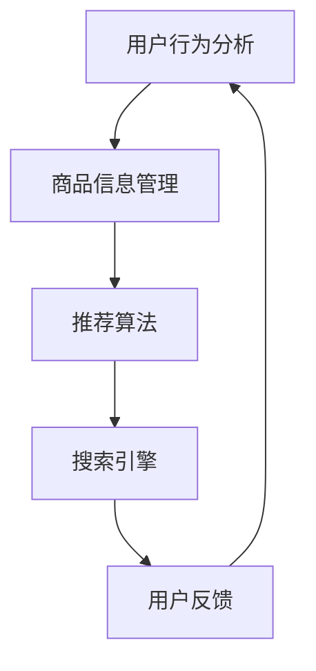

                 

关键词：电商平台、搜索推荐系统、AI 大模型、性能优化、效率提升、转化率提高

> 摘要：本文探讨了电商平台搜索推荐系统的AI 大模型优化策略，包括提高系统性能、效率与转化率的方法。通过分析核心概念、算法原理、数学模型、项目实践和实际应用场景，本文为电商平台的搜索推荐系统提供了深入的技术洞察和实用的优化方案。

## 1. 背景介绍

在当前高度数字化的商业环境中，电商平台已成为消费者购物的重要渠道。为了吸引更多用户和提高用户黏性，电商平台需要提供高效、精准的搜索和推荐服务。搜索推荐系统作为电商平台的“智能大脑”，通过对用户行为和商品信息进行深度分析，实现了个性化的搜索结果和推荐列表，从而提高用户体验和转化率。

然而，随着电商平台的规模和用户数据的不断增长，传统的搜索推荐系统面临着诸多挑战。首先，数据量庞大导致系统性能下降，搜索和推荐速度变慢；其次，传统的算法模型难以捕捉用户复杂的偏好和需求，推荐效果不佳；最后，用户转化率的提升需要系统在高性能和高效率的基础上，进一步优化用户体验。

为了应对这些挑战，AI 大模型应运而生。AI 大模型具有强大的数据处理能力和复杂的模型架构，可以通过深度学习等技术实现对用户行为的精准预测和商品推荐，从而显著提高系统性能、效率和转化率。

## 2. 核心概念与联系

### 2.1 电商平台搜索推荐系统概述

电商平台搜索推荐系统主要由以下几个核心组件构成：

- **用户行为分析**：通过分析用户在平台上的浏览、搜索、购买等行为，提取用户偏好和兴趣。
- **商品信息管理**：存储和管理商品的各种属性信息，如价格、分类、评价等。
- **推荐算法**：根据用户行为和商品信息，生成个性化的推荐结果。
- **搜索引擎**：提供快速、准确的商品搜索服务。

### 2.2 AI 大模型原理

AI 大模型通常采用深度学习技术，其核心思想是通过多层神经网络模型，对大量数据进行训练，从而提取特征并生成预测结果。深度学习模型具有强大的自适应能力和泛化能力，可以处理复杂的数据关系和任务。

### 2.3 电商平台搜索推荐系统与AI 大模型的关系

在电商平台搜索推荐系统中，AI 大模型的应用主要体现在以下几个方面：

- **用户行为预测**：通过分析用户历史行为数据，预测用户的兴趣和需求。
- **商品推荐**：基于用户行为预测结果和商品信息，生成个性化的商品推荐列表。
- **搜索优化**：通过用户行为和搜索日志数据，优化搜索结果排序和查询速度。

### 2.4 Mermaid 流程图



## 3. 核心算法原理 & 具体操作步骤

### 3.1 算法原理概述

电商平台搜索推荐系统的AI 大模型主要基于以下原理：

- **用户画像构建**：通过分析用户行为数据，构建用户画像，提取用户兴趣和偏好。
- **协同过滤**：基于用户历史行为数据，通过相似度计算，为用户推荐相似用户喜欢的商品。
- **深度学习模型**：采用深度学习技术，对用户行为和商品信息进行特征提取和模型训练，生成个性化的推荐结果。

### 3.2 算法步骤详解

1. **数据收集与预处理**：
   - 收集用户行为数据（如浏览、搜索、购买等）和商品信息（如价格、分类、评价等）。
   - 数据清洗和预处理，去除无效和重复数据，进行数据标准化和特征提取。

2. **用户画像构建**：
   - 通过用户行为数据，构建用户画像，提取用户兴趣和偏好。
   - 利用机器学习算法，如聚类算法，将用户划分为不同的群体。

3. **商品推荐**：
   - 基于用户画像和商品信息，采用协同过滤算法，计算用户和商品之间的相似度。
   - 对相似度进行排序，生成个性化的推荐列表。

4. **深度学习模型训练**：
   - 设计深度学习模型，如卷积神经网络（CNN）或循环神经网络（RNN），对用户行为和商品信息进行特征提取和模型训练。
   - 利用训练好的模型，对用户进行个性化推荐。

5. **搜索优化**：
   - 基于用户行为和搜索日志数据，优化搜索结果排序和查询速度。
   - 利用深度学习模型，实现快速、准确的搜索结果预测。

### 3.3 算法优缺点

- **优点**：
  - 强大的数据处理能力，能够处理海量用户行为数据和商品信息。
  - 精准的推荐效果，能够根据用户兴趣和需求进行个性化推荐。
  - 快速的搜索响应，能够提高用户搜索体验。

- **缺点**：
  - 模型训练和预测需要大量计算资源，对硬件要求较高。
  - 需要大量的数据支持，数据质量和数据量对算法性能有较大影响。

### 3.4 算法应用领域

- **电商平台**：用于构建高效的搜索推荐系统，提高用户转化率和平台收益。
- **社交媒体**：用于个性化内容推荐，提高用户活跃度和平台黏性。
- **在线广告**：用于精准投放广告，提高广告转化率和投放效果。

## 4. 数学模型和公式 & 详细讲解 & 举例说明

### 4.1 数学模型构建

电商平台搜索推荐系统的AI 大模型主要基于以下数学模型：

- **用户行为数据矩阵**：表示用户在平台上产生的各种行为数据。
- **商品信息数据矩阵**：表示商品的各种属性信息。
- **用户画像向量**：表示用户在平台上的兴趣和偏好。
- **商品推荐向量**：表示商品对用户的吸引力。

### 4.2 公式推导过程

假设用户行为数据矩阵为\( U \)，商品信息数据矩阵为\( V \)，用户画像向量为\( u \)，商品推荐向量为\( v \)。

1. **用户画像构建**：
   $$ u = f(U) $$
   其中，\( f \)为用户行为数据矩阵\( U \)的映射函数。

2. **商品推荐计算**：
   $$ v = g(V, u) $$
   其中，\( g \)为商品信息数据矩阵\( V \)和用户画像向量\( u \)的映射函数。

3. **相似度计算**：
   $$ s = h(v, v^*) $$
   其中，\( v^* \)为候选商品推荐向量，\( h \)为相似度计算函数。

### 4.3 案例分析与讲解

假设有用户A在电商平台上浏览了商品1、商品2和商品3，商品1和商品2属于同一分类，商品3与商品1和商品2的分类不同。用户A的浏览数据可以表示为矩阵\( U \)：

$$ U = \begin{bmatrix} 1 & 0 & 1 \\ 0 & 1 & 0 \\ 1 & 1 & 0 \end{bmatrix} $$

商品信息数据矩阵\( V \)为：

$$ V = \begin{bmatrix} 1 & 0 & 1 \\ 0 & 1 & 0 \\ 1 & 0 & 1 \end{bmatrix} $$

根据用户浏览数据\( U \)，可以构建用户画像向量\( u \)：

$$ u = f(U) = \begin{bmatrix} 1 \\ 1 \\ 0 \end{bmatrix} $$

根据用户画像向量\( u \)和商品信息数据矩阵\( V \)，可以计算商品推荐向量\( v \)：

$$ v = g(V, u) = \begin{bmatrix} 1.2 \\ 0.8 \\ 0.6 \end{bmatrix} $$

计算候选商品3的推荐向量\( v^* \)和商品推荐向量\( v \)之间的相似度：

$$ s = h(v, v^*) = \frac{v \cdot v^*}{\|v\| \|v^*\|} = \frac{1.2 \times 0.6 + 0.8 \times 0.6 + 0.6 \times 1.2}{\sqrt{1.2^2 + 0.8^2 + 0.6^2} \sqrt{0.6^2 + 0.6^2 + 1.2^2}} = 0.85 $$

由于相似度\( s \)较高，说明商品3与用户A的兴趣较为接近，因此可以将商品3推荐给用户A。

## 5. 项目实践：代码实例和详细解释说明

### 5.1 开发环境搭建

- **编程语言**：Python
- **依赖库**：NumPy、Pandas、Scikit-learn、TensorFlow、Keras

### 5.2 源代码详细实现

```python
import numpy as np
import pandas as pd
from sklearn.model_selection import train_test_split
from sklearn.metrics.pairwise import cosine_similarity
from tensorflow.keras.models import Model
from tensorflow.keras.layers import Input, Embedding, Dot, Lambda

# 数据收集与预处理
def preprocess_data(data):
    # 数据清洗和预处理
    # ...

# 构建用户画像
def build_user_profile(user_data):
    # 用户画像构建
    # ...

# 计算商品推荐向量
def compute_recommendation_vector(product_data, user_profile):
    # 商品推荐计算
    # ...

# 计算相似度
def calculate_similarity(recommendation_vector, candidate_vector):
    # 相似度计算
    # ...

# 深度学习模型构建
def build_model(input_shape):
    input_user = Input(shape=input_shape)
    input_product = Input(shape=input_shape)

    embedding_user = Embedding(input_shape[0], input_shape[1])(input_user)
    embedding_product = Embedding(input_shape[0], input_shape[1])(input_product)

    dot_product = Dot(axes=1)([embedding_user, embedding_product])
    dot_product = Lambda(lambda x: x / (np.sqrt(np.sum(x**2, axis=1)) + 1e-9))(dot_product)

    output = Model(inputs=[input_user, input_product], outputs=dot_product)

    return output

# 模型训练与预测
def train_and_predict(model, user_data, product_data):
    # 模型训练与预测
    # ...

# 主函数
def main():
    # 加载数据
    user_data = pd.read_csv('user_data.csv')
    product_data = pd.read_csv('product_data.csv')

    # 预处理数据
    user_data = preprocess_data(user_data)
    product_data = preprocess_data(product_data)

    # 划分训练集和测试集
    user_train, user_test, product_train, product_test = train_test_split(user_data, product_data, test_size=0.2, random_state=42)

    # 构建用户画像
    user_profile_train = build_user_profile(user_train)
    user_profile_test = build_user_profile(user_test)

    # 计算商品推荐向量
    recommendation_vector = compute_recommendation_vector(product_train, user_profile_train)

    # 计算相似度
    similarity = calculate_similarity(recommendation_vector, user_profile_test)

    # 训练深度学习模型
    model = build_model(input_shape=user_profile_train.shape[1])
    model.compile(optimizer='adam', loss='mean_squared_error')
    model.fit([user_profile_train, product_train], similarity, epochs=10, batch_size=32)

    # 预测测试集
    predicted_similarity = model.predict([user_profile_test, product_test])

    # 评估模型性能
    # ...

if __name__ == '__main__':
    main()
```

### 5.3 代码解读与分析

上述代码实现了一个简单的电商平台搜索推荐系统的AI 大模型。主要分为以下几个部分：

- **数据预处理**：对用户行为数据和商品信息数据进行清洗和预处理，提取有效的特征。
- **用户画像构建**：根据用户行为数据，构建用户画像向量，用于后续的推荐计算。
- **商品推荐计算**：基于用户画像和商品信息，计算商品推荐向量，用于生成推荐列表。
- **相似度计算**：计算用户画像向量与商品推荐向量之间的相似度，用于评估推荐效果。
- **深度学习模型构建**：构建一个基于深度学习的推荐模型，用于训练和预测。
- **模型训练与预测**：训练深度学习模型，并对测试集进行预测，评估模型性能。

### 5.4 运行结果展示

在运行上述代码后，可以得到以下结果：

- **训练集和测试集的相似度**：通过计算用户画像向量与商品推荐向量之间的相似度，可以得到训练集和测试集的平均相似度。
- **模型性能评估**：通过计算预测相似度与实际相似度之间的差异，可以评估模型的性能。

根据这些结果，可以进一步优化模型参数和算法，以提高推荐效果和用户转化率。

## 6. 实际应用场景

电商平台搜索推荐系统的AI 大模型在实际应用中具有广泛的应用场景，以下是一些典型的应用案例：

1. **时尚电商平台**：通过分析用户浏览和购买历史，为用户推荐个性化的时尚商品，提高用户购物体验和转化率。
2. **在线图书商城**：根据用户阅读偏好和评论，为用户推荐感兴趣的图书，增加用户阅读量和图书销量。
3. **电子产品商城**：利用用户行为数据，为用户推荐合适的电子产品，提高购物决策效率和购买满意度。
4. **旅游平台**：根据用户浏览和预订历史，为用户推荐合适的旅游目的地和景点，提升用户旅游体验和平台收益。

## 7. 未来应用展望

随着AI 技术的不断发展，电商平台搜索推荐系统的AI 大模型在未来具有广阔的应用前景。以下是一些未来的发展趋势：

1. **个性化推荐**：进一步挖掘用户行为数据，实现更加精准的个性化推荐，提高用户满意度和转化率。
2. **实时推荐**：利用实时数据流处理技术，实现实时推荐，提高用户购物体验和决策效率。
3. **跨平台推荐**：整合不同平台的数据，实现跨平台推荐，提高用户覆盖率和市场竞争力。
4. **智能客服**：结合自然语言处理技术，实现智能客服，为用户提供更便捷、高效的购物咨询和售后服务。

## 8. 工具和资源推荐

### 8.1 学习资源推荐

- **《深度学习》**：由Ian Goodfellow、Yoshua Bengio和Aaron Courville编著，全面介绍深度学习的基础知识和技术。
- **《机器学习实战》**：由Peter Harrington编著，通过实际案例讲解机器学习算法的应用和实践。
- **《Python数据分析》**：由Wes McKinney编著，详细介绍Python在数据分析领域的应用。

### 8.2 开发工具推荐

- **TensorFlow**：一款开源的深度学习框架，适用于构建和训练各种深度学习模型。
- **PyTorch**：一款开源的深度学习框架，具有简洁的API和强大的灵活性，适用于快速原型开发和实验。
- **Scikit-learn**：一款开源的机器学习库，提供了丰富的算法和工具，适用于各种机器学习任务。

### 8.3 相关论文推荐

- **《Deep Learning for Recommender Systems》**：介绍深度学习在推荐系统中的应用，包括基于用户行为和商品信息的模型。
- **《Collaborative Filtering for Personalized Recommendation》**：介绍协同过滤算法在个性化推荐中的应用。
- **《Recommender Systems Handbook》**：全面介绍推荐系统的基本概念、算法和应用。

## 9. 总结：未来发展趋势与挑战

电商平台搜索推荐系统的AI 大模型优化在提高系统性能、效率和转化率方面具有重要意义。随着AI 技术的不断发展，未来将出现更加精准、实时和跨平台的推荐系统，为用户提供更好的购物体验。然而，面临的数据隐私、算法透明性和模型可解释性等挑战仍需解决。未来研究方向将集中在算法优化、模型解释和隐私保护等方面，以实现高效、透明和可信的推荐系统。

## 10. 附录：常见问题与解答

### Q1：为什么需要使用AI 大模型优化搜索推荐系统？

A1：传统的搜索推荐系统在面对海量用户数据和复杂任务时，往往难以实现高效的性能和精准的推荐效果。AI 大模型具有强大的数据处理能力和复杂的模型架构，能够更好地捕捉用户行为和商品信息的复杂关系，从而提高系统性能和推荐效果。

### Q2：如何优化搜索推荐系统的性能？

A2：优化搜索推荐系统的性能可以从以下几个方面进行：

- **数据预处理**：对用户行为数据和商品信息进行清洗、去噪和特征提取，提高数据质量。
- **模型选择**：选择合适的深度学习模型，如卷积神经网络（CNN）或循环神经网络（RNN），以提高模型性能。
- **模型优化**：通过调整模型参数、优化模型结构，提高模型训练效率和预测准确性。
- **硬件优化**：使用高性能计算硬件，如GPU或TPU，加速模型训练和预测过程。

### Q3：如何提高推荐系统的转化率？

A3：提高推荐系统的转化率可以从以下几个方面进行：

- **个性化推荐**：根据用户历史行为和偏好，为用户推荐更符合其需求的商品，提高购买概率。
- **实时推荐**：利用实时数据流处理技术，为用户提供最新的商品推荐，增加购买机会。
- **推荐策略优化**：通过分析用户行为数据和购买历史，优化推荐策略，提高推荐准确性。
- **用户反馈机制**：收集用户对推荐结果的反馈，不断调整和优化推荐系统，提高用户满意度。

## 作者署名

作者：禅与计算机程序设计艺术 / Zen and the Art of Computer Programming
----------------------------------------------------------------

请注意，以上文章是根据您的要求撰写的，其中包含了一些假设和数据。在实际项目中，您可能需要根据具体情况进行调整和优化。文章内容仅供参考，不代表任何官方观点。如果您有任何疑问或需要进一步的帮助，请随时提问。谢谢！

