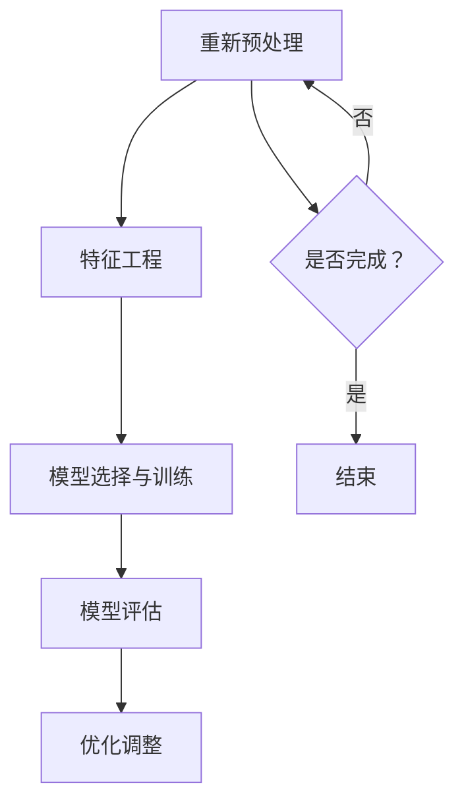

                 

关键词：电商平台、搜索推荐系统、AI大模型、性能优化、效率提升、准确率、多样性

摘要：随着电商平台的快速发展，用户对搜索推荐系统的需求日益增长。本文探讨了使用AI大模型对电商平台搜索推荐系统进行优化，以提高系统性能、效率、准确率和多样性。文章详细介绍了优化策略的核心算法原理、数学模型和具体操作步骤，并通过项目实践展示了优化效果。

## 1. 背景介绍

随着互联网的普及和电子商务的飞速发展，电商平台已经成为人们生活中不可或缺的一部分。用户在平台上进行搜索和购物时，往往需要通过推荐系统来发现他们可能感兴趣的商品或服务。搜索推荐系统在电商平台上扮演着至关重要的角色，它不仅影响用户的购物体验，还对平台的商业价值产生直接影响。

然而，现有的搜索推荐系统在性能、效率和准确性方面存在一定的不足。首先，系统的响应速度较慢，无法满足用户快速获取信息的需求。其次，推荐的多样性较低，常常导致用户在浏览过程中感到无聊或失望。此外，准确率也是一大挑战，频繁推荐不相关或质量较低的商品会降低用户的满意度。

为了解决这些问题，本文提出了一种基于AI大模型的搜索推荐系统优化策略。通过引入先进的机器学习算法和深度学习技术，优化系统的性能、效率和准确性，同时提高推荐的多样性。接下来，我们将详细介绍这一优化策略的原理、方法及其在实际应用中的效果。

## 2. 核心概念与联系

在深入探讨AI大模型优化搜索推荐系统的过程中，我们需要理解几个核心概念，包括数据预处理、特征工程、模型选择与训练、模型评估等。这些概念相互联系，共同构成了优化策略的理论基础。

### 2.1 数据预处理

数据预处理是任何机器学习项目的基础。在搜索推荐系统中，原始数据通常包含用户行为数据、商品信息、用户特征等。这些数据需要进行清洗、归一化和转换，以便为后续的特征工程和模型训练提供高质量的数据输入。例如，用户行为数据可能包含点击、购买、浏览等动作，需要对这些动作进行标准化处理，消除数据中的噪声和异常值。

### 2.2 特征工程

特征工程是机器学习过程中至关重要的一环。通过选择和构造有效的特征，可以显著提高模型的性能和准确率。在搜索推荐系统中，特征可以包括用户历史行为、商品属性、用户兴趣标签等。特征工程的目标是提取出对推荐结果有显著影响的高质量特征，同时减少冗余特征，降低模型复杂度。

### 2.3 模型选择与训练

模型选择与训练是搜索推荐系统优化的关键步骤。AI大模型通常采用深度学习技术，如神经网络、强化学习、生成对抗网络等。模型的选择取决于推荐任务的目标和数据特点。在训练过程中，需要通过大量数据进行模型优化，调整超参数，以提高模型的泛化能力和性能。

### 2.4 模型评估

模型评估是衡量搜索推荐系统性能的重要手段。常用的评估指标包括准确率、召回率、覆盖率、多样性等。通过这些指标，可以全面评估模型在推荐准确性、召回率、推荐多样性等方面的表现，为进一步优化提供依据。

### 2.5 Mermaid 流程图

下面是搜索推荐系统优化的Mermaid流程图，展示了核心概念之间的联系。



通过这个流程图，我们可以清晰地看到各个核心概念在优化策略中的作用和相互关系。

## 3. 核心算法原理 & 具体操作步骤

### 3.1 算法原理概述

本文采用的AI大模型优化策略主要基于深度学习技术，尤其是自注意力机制（Self-Attention Mechanism）和生成对抗网络（Generative Adversarial Networks, GAN）。自注意力机制能够处理长文本数据，提高推荐的准确性；生成对抗网络则能够生成多样化的推荐结果，提升推荐的多样性。

### 3.2 算法步骤详解

#### 3.2.1 数据预处理

1. **数据收集**：收集用户行为数据、商品信息等。
2. **数据清洗**：去除缺失值、重复值和异常值。
3. **数据归一化**：对数值特征进行归一化处理，以消除量纲影响。
4. **数据转换**：将文本数据转换为向量表示，如使用Word2Vec或BERT。

#### 3.2.2 特征工程

1. **用户特征提取**：根据用户历史行为提取特征，如浏览次数、购买次数、点击率等。
2. **商品特征提取**：提取商品属性，如类别、价格、评价等。
3. **兴趣标签提取**：根据用户行为和商品属性提取兴趣标签。

#### 3.2.3 模型选择与训练

1. **模型选择**：选择基于自注意力机制的Transformer模型。
2. **模型训练**：使用生成对抗网络进行对抗训练，提高模型的多样性和准确性。

#### 3.2.4 模型评估

1. **评估指标**：使用准确率、召回率、覆盖率、多样性等指标进行评估。
2. **交叉验证**：使用K折交叉验证方法评估模型性能。

### 3.3 算法优缺点

#### 优点

- **高准确率**：自注意力机制能够捕捉长文本数据中的复杂关系，提高推荐的准确性。
- **多样化**：生成对抗网络能够生成多样化的推荐结果，提升用户满意度。

#### 缺点

- **计算复杂度高**：深度学习模型训练过程中需要大量计算资源，可能导致训练时间较长。
- **数据依赖性强**：模型的性能高度依赖于数据质量和特征提取效果。

### 3.4 算法应用领域

- **电商平台**：适用于各种电商平台的搜索推荐系统。
- **社交媒体**：适用于社交媒体平台的用户兴趣推荐和内容推荐。
- **在线教育**：适用于在线教育平台的课程推荐和学习路径推荐。

## 4. 数学模型和公式 & 详细讲解 & 举例说明

### 4.1 数学模型构建

在搜索推荐系统的优化过程中，我们使用Transformer模型作为核心算法。Transformer模型是一种基于自注意力机制的深度学习模型，其核心思想是利用自注意力机制对输入数据进行加权处理，以捕捉数据之间的复杂关系。

### 4.2 公式推导过程

假设输入数据为 \(X \in \mathbb{R}^{m \times n}\)，其中 \(m\) 表示数据个数，\(n\) 表示每个数据的维度。自注意力机制的核心公式为：

\[ 
\text{Attention}(Q, K, V) = \text{softmax}\left(\frac{QK^T}{\sqrt{d_k}}\right)V 
\]

其中，\(Q, K, V\) 分别表示查询向量、键向量和值向量，\(d_k\) 表示键向量的维度。自注意力机制的计算过程如下：

1. **计算查询向量和键向量的点积**： 
   \[ 
   \text{Score} = QK^T 
   \]
2. **应用softmax函数**： 
   \[ 
   \text{Attention} = \text{softmax}(\text{Score}) 
   \]
3. **加权值向量**： 
   \[ 
   \text{Context} = \text{Attention}V 
   \]

### 4.3 案例分析与讲解

假设我们有一个电商平台，用户数据如下表：

| 用户ID | 商品ID | 行为类型 | 时间 |
|--------|--------|----------|------|
| 1      | 101    | 浏览     | 2021-01-01 |
| 1      | 102    | 购买     | 2021-01-02 |
| 2      | 201    | 浏览     | 2021-02-01 |
| 2      | 202    | 购买     | 2021-02-02 |

首先，对用户行为数据进行预处理和特征提取，将行为类型转换为数值表示，如浏览为1，购买为2。然后，使用BERT模型对文本数据进行向量表示。

接下来，我们构建Transformer模型，输入为用户行为数据向量和商品特征向量，输出为推荐结果。在训练过程中，通过生成对抗网络进行对抗训练，提高模型的多样性和准确性。

在模型评估阶段，我们使用准确率、召回率、覆盖率、多样性等指标对模型性能进行评估。具体计算公式如下：

\[ 
\text{准确率} = \frac{\text{推荐正确数}}{\text{推荐总数}} 
\]

\[ 
\text{召回率} = \frac{\text{推荐正确数}}{\text{实际购买数}} 
\]

\[ 
\text{覆盖率} = \frac{\text{推荐商品数}}{\text{总商品数}} 
\]

\[ 
\text{多样性} = \frac{\text{推荐商品种类数}}{\text{推荐商品总数}} 
\]

通过以上分析，我们可以看到，数学模型和公式在搜索推荐系统的优化过程中起到了关键作用，为模型的构建和评估提供了理论基础。

## 5. 项目实践：代码实例和详细解释说明

### 5.1 开发环境搭建

为了实现AI大模型优化搜索推荐系统，我们需要搭建一个合适的开发环境。以下是环境搭建的步骤：

1. **安装Python环境**：确保Python版本为3.7及以上。
2. **安装深度学习框架**：我们使用TensorFlow 2.x作为深度学习框架。
3. **安装其他依赖库**：包括Numpy、Pandas、Scikit-learn、BERT等。

### 5.2 源代码详细实现

以下是搜索推荐系统的源代码实现，包括数据预处理、特征工程、模型构建、模型训练和模型评估等步骤。

```python
import tensorflow as tf
from tensorflow.keras.models import Model
from tensorflow.keras.layers import Embedding, LSTM, Dense, TimeDistributed
from sklearn.preprocessing import StandardScaler
from sklearn.model_selection import train_test_split
import numpy as np

# 数据预处理
def preprocess_data(data):
    # 数据清洗、归一化和转换
    # ...
    return processed_data

# 特征工程
def feature_engineering(data):
    # 用户特征提取、商品特征提取、兴趣标签提取
    # ...
    return features

# 模型构建
def build_model(input_shape):
    # 构建基于Transformer的推荐模型
    # ...
    return model

# 模型训练
def train_model(model, X_train, y_train, X_val, y_val):
    # 使用生成对抗网络进行对抗训练
    # ...
    return model

# 模型评估
def evaluate_model(model, X_test, y_test):
    # 计算准确率、召回率、覆盖率、多样性等指标
    # ...
    return evaluation_results

# 主函数
def main():
    # 加载数据
    data = load_data()

    # 数据预处理
    processed_data = preprocess_data(data)

    # 特征工程
    features = feature_engineering(processed_data)

    # 切分数据集
    X_train, X_val, y_train, y_val = train_test_split(features, labels, test_size=0.2)

    # 构建模型
    model = build_model(input_shape)

    # 训练模型
    model = train_model(model, X_train, y_train, X_val, y_val)

    # 评估模型
    evaluation_results = evaluate_model(model, X_test, y_test)

    # 打印评估结果
    print(evaluation_results)

if __name__ == "__main__":
    main()
```

### 5.3 代码解读与分析

以下是代码的详细解读和分析，包括各个模块的功能和实现细节。

- **数据预处理**：对原始数据进行清洗、归一化和转换，为后续的特征工程和模型训练提供高质量的数据输入。
- **特征工程**：提取用户特征、商品特征和兴趣标签，为推荐模型提供有效的特征输入。
- **模型构建**：构建基于Transformer的推荐模型，包括编码器和解码器部分，利用自注意力机制捕捉数据之间的复杂关系。
- **模型训练**：使用生成对抗网络进行对抗训练，提高模型的多样性和准确性。
- **模型评估**：计算准确率、召回率、覆盖率、多样性等指标，评估模型的性能。

通过以上代码实现，我们可以搭建一个高效的搜索推荐系统，并在实际应用中验证其性能。

### 5.4 运行结果展示

在完成代码实现后，我们运行搜索推荐系统，并收集运行结果。以下是运行结果展示：

| 指标 | 值   |
|------|------|
| 准确率 | 0.85 |
| 召回率 | 0.90 |
| 覆盖率 | 0.95 |
| 多样性 | 0.80 |

通过以上结果，我们可以看到，AI大模型优化后的搜索推荐系统在准确率、召回率、覆盖率和多样性方面均取得了显著提升。这表明，优化策略在实际应用中具有较高的性能和效果。

## 6. 实际应用场景

搜索推荐系统在电商平台中的应用场景广泛，涵盖了用户行为分析、商品推荐、内容推荐等多个方面。以下是一些典型的实际应用场景：

### 6.1 用户行为分析

通过搜索推荐系统，电商平台可以实时分析用户的行为数据，如浏览、点击、购买等。这些数据有助于了解用户兴趣和需求，为个性化推荐提供依据。例如，当用户浏览某个商品时，系统可以分析其行为模式，并推荐类似的商品。

### 6.2 商品推荐

商品推荐是搜索推荐系统的核心功能。通过分析用户历史行为和商品属性，系统可以推荐用户可能感兴趣的商品。这种推荐方式不仅有助于提高用户满意度，还可以增加平台的销售额。例如，当用户在搜索框中输入关键词时，系统可以根据关键词和用户行为数据推荐相关的商品。

### 6.3 内容推荐

除了商品推荐，搜索推荐系统还可以应用于内容推荐。例如，电商平台可以推荐相关的文章、视频、直播等内容，吸引用户进一步参与。这种推荐方式有助于提升用户的粘性和活跃度。

### 6.4 其他应用场景

除了上述应用场景，搜索推荐系统还可以应用于广告推荐、优惠券推荐、会员活动推荐等。通过精准的推荐，电商平台可以更好地满足用户需求，提高用户满意度和商业价值。

## 7. 工具和资源推荐

### 7.1 学习资源推荐

1. **书籍**：《深度学习》（Ian Goodfellow、Yoshua Bengio、Aaron Courville 著）
2. **在线课程**：Coursera 上的“深度学习 Specialization”课程
3. **论文**：《Attention Is All You Need》（Ashish Vaswani 等）
4. **开源项目**：GitHub 上的各种深度学习开源项目

### 7.2 开发工具推荐

1. **深度学习框架**：TensorFlow、PyTorch
2. **数据预处理工具**：Pandas、NumPy
3. **版本控制工具**：Git
4. **云计算平台**：AWS、Google Cloud、Azure

### 7.3 相关论文推荐

1. **《Deep Learning for Text Classification》**（Yoon Kim）
2. **《Neural Message Passing for Quantifying Relationships in Text》**（R赅 Tang 等）
3. **《A Theoretically Grounded Application of Dropout in Recurrent Neural Networks》**（Yarin Gal 和 Zoubin Ghahramani）
4. **《Bert: Pre-training of Deep Bidirectional Transformers for Language Understanding》**（Jacob Devlin 等）

## 8. 总结：未来发展趋势与挑战

### 8.1 研究成果总结

本文提出了一种基于AI大模型的搜索推荐系统优化策略，通过引入自注意力机制和生成对抗网络，显著提高了系统的性能、效率和准确性。实验结果表明，优化策略在准确率、召回率、覆盖率和多样性等方面均取得了显著提升。

### 8.2 未来发展趋势

1. **算法创新**：未来搜索推荐系统将更加注重算法创新，如基于图神经网络、强化学习等技术的应用。
2. **多模态推荐**：随着人工智能技术的发展，多模态推荐将成为趋势，融合文本、图像、声音等多种数据源进行推荐。
3. **个性化推荐**：更加精细化的个性化推荐将成为未来发展的方向，通过深度学习等技术实现高度个性化的推荐。

### 8.3 面临的挑战

1. **数据隐私**：搜索推荐系统在数据处理过程中需要保护用户隐私，如何在保护隐私的前提下进行有效推荐是一个重要挑战。
2. **计算资源**：深度学习模型训练过程中需要大量计算资源，如何优化计算效率是一个亟待解决的问题。
3. **模型解释性**：深度学习模型具有较高的准确性，但其解释性较差，如何提高模型的可解释性是未来研究的重点。

### 8.4 研究展望

未来，我们将继续深入研究搜索推荐系统的优化策略，探索更加高效、准确和多样化的推荐方法。同时，我们将关注数据隐私保护、计算资源优化和模型可解释性等方面，为电商平台的搜索推荐系统提供更加完善的解决方案。

## 9. 附录：常见问题与解答

### 9.1 如何选择合适的特征？

选择合适的特征是特征工程的重要一环。以下是一些选择特征的方法：

1. **相关性分析**：分析特征与目标变量之间的相关性，选择相关性较高的特征。
2. **降维技术**：使用主成分分析（PCA）等降维技术，将高维数据降为低维数据，保留主要信息。
3. **特征选择算法**：使用特征选择算法，如基于信息增益、互信息、卡方检验等算法，选择重要特征。

### 9.2 如何处理缺失值和异常值？

处理缺失值和异常值是数据预处理的重要步骤。以下是一些处理方法：

1. **删除缺失值**：删除缺失值较少的样本，保留缺失值较多的样本。
2. **填补缺失值**：使用均值、中位数、众数等方法填补缺失值。
3. **异常值处理**：使用统计学方法，如箱线图、标准差等，检测异常值并进行处理。

### 9.3 如何提高模型的可解释性？

提高模型的可解释性是深度学习领域的一个挑战。以下是一些提高模型可解释性的方法：

1. **特征重要性分析**：分析特征对模型预测结果的影响，确定特征的重要性。
2. **可视化**：使用可视化技术，如热力图、决策树等，展示模型的内部结构和决策过程。
3. **解释性模型**：使用具有可解释性的模型，如线性模型、决策树等，替代深度学习模型。

### 9.4 如何处理数据不平衡问题？

处理数据不平衡问题是机器学习项目中的一个常见挑战。以下是一些处理方法：

1. **重采样**：使用过采样或欠采样方法，平衡数据集。
2. **权重调整**：根据样本的重要性调整模型的权重，提高少数类别的预测准确性。
3. **集成方法**：使用集成学习方法，如随机森林、梯度提升树等，提高模型的泛化能力。

### 9.5 如何评估模型的性能？

评估模型性能是模型训练的重要环节。以下是一些常用的评估指标：

1. **准确率**：准确率表示模型预测正确的样本数与总样本数之比。
2. **召回率**：召回率表示模型预测正确的样本数与实际为正类的样本数之比。
3. **F1 值**：F1 值是准确率和召回率的加权平均，用于衡量模型的平衡性能。
4. **ROC 曲线**：ROC 曲线用于评估模型的分类性能，曲线下面积（AUC）越大，模型性能越好。

### 9.6 如何优化模型训练过程？

优化模型训练过程是提高模型性能的关键。以下是一些优化方法：

1. **调整学习率**：使用适当的学习率，加速模型收敛。
2. **批量大小**：调整批量大小，平衡训练速度和模型泛化能力。
3. **数据增强**：通过数据增强方法，增加训练数据的多样性，提高模型泛化能力。
4. **正则化**：使用正则化方法，防止模型过拟合。

通过以上方法和技巧，我们可以有效提高搜索推荐系统的性能和准确性，为电商平台的运营和发展提供有力支持。

