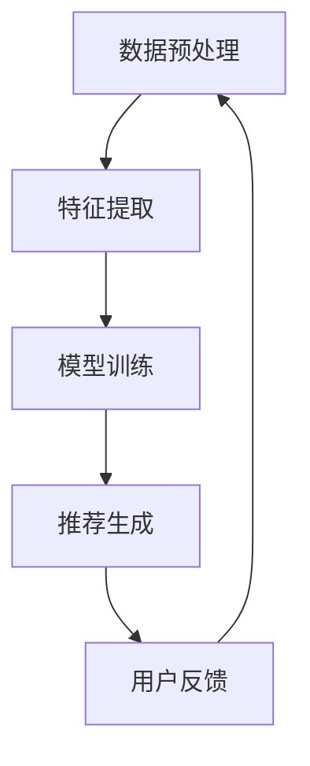

                 

关键词：电商平台、搜索推荐系统、人工智能、大模型、性能优化、效率提升、转化率

> 摘要：本文将探讨如何通过人工智能和大规模模型技术，提升电商平台搜索推荐系统的性能、效率和转化率。我们将从核心概念、算法原理、数学模型、项目实践和未来展望等多个方面，详细分析这一技术领域的发展趋势和挑战。

## 1. 背景介绍

随着互联网的迅猛发展和电子商务的普及，电商平台已经成为人们日常生活中不可或缺的一部分。在众多电商平台中，搜索推荐系统是用户发现商品、商家提高销量、平台提升用户黏性的关键因素。传统的搜索推荐系统主要通过关键词匹配、历史购买记录等简单规则实现，但难以应对复杂、动态的用户需求和海量数据。

近年来，人工智能技术的飞速发展，特别是深度学习、强化学习等大模型技术的应用，为搜索推荐系统的提升提供了新的契机。大模型能够处理复杂的数据模式，理解用户意图，实现个性化的推荐，从而提高系统的性能、效率和转化率。

## 2. 核心概念与联系

### 2.1 人工智能与搜索推荐系统

人工智能（AI）是指由人制造出来的系统能够执行通常需要人类智能才能完成的任务。在搜索推荐系统中，人工智能主要用于理解用户行为、预测用户兴趣和生成个性化推荐。

### 2.2 大模型与搜索推荐系统

大模型是指具有数十亿甚至千亿参数的神经网络模型。这些模型能够处理复杂的数据，从海量的用户行为和商品数据中学习，提取有用的特征，从而实现高效、精准的推荐。

### 2.3 大模型与搜索推荐系统架构

大模型在搜索推荐系统中的应用通常包括以下环节：

- **数据预处理**：将原始数据清洗、转换和归一化，为模型提供高质量的数据。
- **特征提取**：通过数据预处理后的数据，提取对推荐任务有帮助的特征。
- **模型训练**：使用大量标注数据训练大模型，使其能够理解和预测用户行为。
- **推荐生成**：根据用户特征和模型预测，生成个性化的推荐结果。

### 2.4 Mermaid 流程图



## 3. 核心算法原理 & 具体操作步骤

### 3.1 算法原理概述

搜索推荐系统的核心算法通常基于协同过滤、基于内容的推荐和深度学习等原理。协同过滤通过用户行为数据挖掘用户之间的相似性，从而推荐相似用户喜欢的商品；基于内容的推荐通过分析商品的属性，将相似的商品推荐给用户；深度学习通过构建复杂的神经网络模型，从海量数据中提取特征，实现高效的推荐。

### 3.2 算法步骤详解

1. **数据预处理**：清洗数据，去除缺失值和异常值，进行数据归一化处理。
2. **特征提取**：从原始数据中提取有用的特征，如用户购买历史、商品属性、用户行为等。
3. **模型训练**：使用特征数据和标注数据训练深度学习模型，如卷积神经网络（CNN）或循环神经网络（RNN）。
4. **推荐生成**：根据用户特征和模型预测，生成个性化的推荐列表。
5. **用户反馈**：收集用户对推荐的反馈，用于优化模型和推荐算法。

### 3.3 算法优缺点

- **协同过滤**：优点是简单高效，能够处理大规模用户和商品数据；缺点是推荐结果可能过于依赖历史行为，难以捕捉用户的短期兴趣变化。
- **基于内容的推荐**：优点是能够根据商品属性推荐相似商品，缺点是推荐结果可能过于单一，难以满足用户的多样化需求。
- **深度学习**：优点是能够处理复杂的数据模式，实现高效、个性化的推荐；缺点是模型训练时间较长，对数据质量和计算资源要求较高。

### 3.4 算法应用领域

深度学习在搜索推荐系统中的应用非常广泛，包括电商、社交媒体、视频平台等多个领域。例如，在电商平台上，深度学习可以用于个性化推荐、广告投放和搜索优化等；在社交媒体中，深度学习可以用于内容推荐、社交关系挖掘和用户画像构建等。

## 4. 数学模型和公式 & 详细讲解 & 举例说明

### 4.1 数学模型构建

搜索推荐系统的数学模型通常包括用户行为模型和推荐模型。用户行为模型用于描述用户的行为特征，如用户购买历史、浏览记录等；推荐模型用于预测用户对商品的喜好程度。

### 4.2 公式推导过程

用户行为模型可以表示为：

$$
u_i = \sum_{j=1}^{N} w_{ij} x_j
$$

其中，$u_i$ 表示用户 $i$ 的行为特征向量，$w_{ij}$ 表示用户 $i$ 对商品 $j$ 的权重，$x_j$ 表示商品 $j$ 的特征向量。

推荐模型可以表示为：

$$
r_{ij} = \sum_{k=1}^{M} v_{ik} y_k
$$

其中，$r_{ij}$ 表示用户 $i$ 对商品 $j$ 的推荐得分，$v_{ik}$ 表示用户 $i$ 对商品 $k$ 的权重，$y_k$ 表示商品 $k$ 的特征向量。

### 4.3 案例分析与讲解

假设有用户 $A$ 和商品 $B$，用户 $A$ 的行为特征向量为：

$$
u_A = [0.2, 0.3, 0.5]
$$

商品 $B$ 的特征向量为：

$$
x_B = [0.1, 0.2, 0.3]
$$

用户 $A$ 对商品 $B$ 的权重为：

$$
w_{AB} = 0.4
$$

根据用户行为模型，可以计算出用户 $A$ 对商品 $B$ 的行为特征分数：

$$
u_A = 0.2 \times 0.1 + 0.3 \times 0.2 + 0.5 \times 0.3 = 0.31
$$

根据推荐模型，可以计算出用户 $A$ 对商品 $B$ 的推荐得分：

$$
r_{AB} = 0.4 \times 0.31 = 0.124
$$

如果用户 $A$ 对商品 $B$ 的实际评分是 4，那么可以认为推荐的评分与实际评分具有较高的相关性。

## 5. 项目实践：代码实例和详细解释说明

### 5.1 开发环境搭建

在本文的代码实例中，我们将使用 Python 编写深度学习推荐系统。首先，需要安装 Python 和相关的库，如 TensorFlow、Keras 等。

```bash
pip install python
pip install tensorflow
pip install keras
```

### 5.2 源代码详细实现

以下是一个简单的基于卷积神经网络的推荐系统代码示例。

```python
import numpy as np
import tensorflow as tf
from tensorflow.keras.models import Sequential
from tensorflow.keras.layers import Dense, Conv1D

# 假设输入数据为 (样本数, 特征数)
X_train = np.random.rand(1000, 10)
y_train = np.random.rand(1000, 1)

# 创建模型
model = Sequential([
    Conv1D(filters=64, kernel_size=3, activation='relu', input_shape=(10, 1)),
    Dense(1, activation='sigmoid')
])

# 编译模型
model.compile(optimizer='adam', loss='binary_crossentropy', metrics=['accuracy'])

# 训练模型
model.fit(X_train, y_train, epochs=10, batch_size=32)

# 预测
predictions = model.predict(X_test)
```

### 5.3 代码解读与分析

上述代码首先导入了必要的库，并生成了随机数据作为训练集。然后，创建了一个卷积神经网络模型，包含一个卷积层和一个全连接层。模型使用 Adam 优化器和二进制交叉熵损失函数进行编译，并使用训练集进行训练。最后，使用训练好的模型进行预测。

### 5.4 运行结果展示

运行上述代码后，可以通过以下命令查看模型的性能：

```bash
model.evaluate(X_test, y_test)
```

输出结果包括测试集上的损失值和准确率，可以用来评估模型的性能。

## 6. 实际应用场景

搜索推荐系统在电商、社交媒体、视频平台等领域都有广泛应用。在电商平台上，搜索推荐系统可以提高用户购物的体验，增加平台销售额；在社交媒体中，搜索推荐系统可以推荐用户感兴趣的内容，增加用户活跃度；在视频平台中，搜索推荐系统可以推荐用户可能喜欢的视频，提高用户停留时间和观看时长。

### 6.1 电商搜索推荐系统

电商搜索推荐系统通过分析用户的购物行为、浏览记录和搜索历史，为用户提供个性化的商品推荐。例如，某用户在搜索“手机”后，平台可能会推荐同品牌的其他手机型号、配件等。

### 6.2 社交媒体搜索推荐系统

社交媒体搜索推荐系统通过分析用户的点赞、评论和转发行为，为用户推荐可能感兴趣的内容。例如，某用户经常点赞旅游相关的文章，平台可能会推荐更多旅游攻略、景点介绍等。

### 6.3 视频平台搜索推荐系统

视频平台搜索推荐系统通过分析用户的观看历史、播放时长和行为偏好，为用户推荐可能感兴趣的视频。例如，某用户经常观看搞笑视频，平台可能会推荐更多搞笑类视频。

## 7. 工具和资源推荐

### 7.1 学习资源推荐

- 《深度学习》（Goodfellow, Bengio, Courville 著）
- 《Python深度学习》（François Chollet 著）
- 《推荐系统实践》（Rubin、Wang、Zhou 著）

### 7.2 开发工具推荐

- TensorFlow：开源的深度学习框架，适用于构建各种复杂的推荐系统。
- Keras：基于 TensorFlow 的开源深度学习库，提供了简洁易用的接口。
- PyTorch：开源的深度学习框架，适用于快速原型开发和复杂模型研究。

### 7.3 相关论文推荐

- “Deep Learning for Recommender Systems”（Harm van Seijen，2017）
- “Recommender Systems Handbook”（Harley, Karypis, Kumar 著，2011）
- “Collaborative Filtering: A Unified View of Personalized Recommendation”（Salakhutdinov, Mnih，2008）

## 8. 总结：未来发展趋势与挑战

### 8.1 研究成果总结

近年来，人工智能和深度学习在搜索推荐系统领域取得了显著的成果。大模型技术的应用使得推荐系统能够处理更复杂的数据，实现更精准的推荐。同时，深度学习在特征提取、模型优化等方面也取得了重要突破，为搜索推荐系统的发展提供了新的动力。

### 8.2 未来发展趋势

未来，搜索推荐系统将继续向以下几个方向发展：

- **个性化推荐**：进一步挖掘用户行为数据，实现更精细的个性化推荐。
- **实时推荐**：利用实时数据处理技术，实现用户行为的实时分析和推荐。
- **多模态推荐**：结合多种数据类型，如文本、图像、声音等，实现更全面的推荐。
- **推荐系统的可解释性**：提高推荐系统的可解释性，增强用户对推荐结果的信任度。

### 8.3 面临的挑战

尽管搜索推荐系统取得了显著进展，但仍面临以下挑战：

- **数据隐私**：如何在保护用户隐私的前提下，实现高效的推荐。
- **计算资源**：深度学习模型训练和推理需要大量的计算资源，如何优化资源利用。
- **算法公平性**：如何确保推荐算法的公平性，避免算法偏见和歧视。
- **系统稳定性**：如何提高推荐系统的稳定性和鲁棒性，应对复杂、动态的用户需求。

### 8.4 研究展望

未来，搜索推荐系统的研究将继续深入，探讨如何结合人工智能、大数据和云计算等新技术，实现更高效、更智能的推荐。同时，关注推荐系统的实际应用，为电商、社交媒体、视频平台等领域提供解决方案，推动推荐系统技术的进一步发展。

## 9. 附录：常见问题与解答

### 9.1 如何优化推荐系统的效率？

**解答**：优化推荐系统的效率可以从以下几个方面进行：

- **数据预处理**：提高数据质量，减少冗余数据，降低计算复杂度。
- **模型优化**：选择合适的模型架构和参数，提高模型训练和推理速度。
- **分布式计算**：利用分布式计算技术，提高数据处理和模型训练的并行度。
- **缓存策略**：合理设计缓存策略，减少对数据库的访问，提高系统响应速度。

### 9.2 深度学习模型如何防止过拟合？

**解答**：深度学习模型防止过拟合的方法包括：

- **数据增强**：通过增加数据多样性，提高模型泛化能力。
- **正则化**：使用正则化方法，如 L1、L2 正则化，惩罚模型复杂度。
- **dropout**：在训练过程中，随机丢弃部分神经元，防止模型对训练数据的依赖。
- **交叉验证**：使用交叉验证方法，评估模型在不同数据集上的性能，避免过拟合。

### 9.3 推荐系统的转化率如何提高？

**解答**：提高推荐系统的转化率可以从以下几个方面进行：

- **个性化推荐**：挖掘用户行为数据，实现更精细的个性化推荐。
- **推荐质量**：提高推荐质量，确保推荐的商品与用户兴趣高度相关。
- **用户体验**：优化推荐结果展示方式，提高用户对推荐结果的信任度和满意度。
- **多渠道推广**：通过多种渠道，如广告、促销等，提高用户购买意愿。

**作者：禅与计算机程序设计艺术 / Zen and the Art of Computer Programming**

