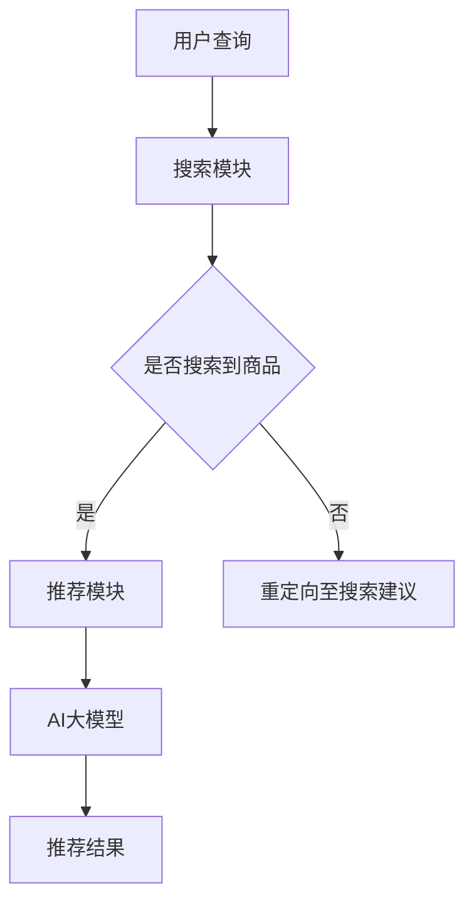

                 

关键词：电商平台，搜索推荐系统，AI大模型，性能优化，用户体验，算法原理，数学模型，项目实践

## 摘要

随着电子商务的飞速发展，电商平台在用户获取、留存和转化方面面临巨大的挑战。本文深入探讨AI大模型在电商平台搜索推荐系统中的应用，分析如何通过AI技术提高系统性能、效率和用户体验。文章将从核心概念、算法原理、数学模型、项目实践等多个方面详细阐述AI大模型在电商平台搜索推荐系统中的实际应用，为相关领域的研究者提供参考和启示。

## 1. 背景介绍

### 1.1 电商平台的发展现状

近年来，随着互联网技术的不断进步，电商平台已成为零售行业的重要组成部分。根据统计，全球电商市场规模已突破数万亿美元，电商用户数量也呈现出爆炸式增长。电商平台不仅改变了人们的购物习惯，还为企业带来了前所未有的市场机会。

### 1.2 搜索推荐系统的重要性

在电商平台上，搜索推荐系统是提高用户体验、提升转化率的关键因素。一方面，搜索推荐系统能够帮助用户快速找到所需商品，提高购物效率；另一方面，推荐系统还可以为平台挖掘潜在用户需求，实现精准营销。因此，搜索推荐系统在电商平台中具有至关重要的地位。

### 1.3 AI大模型的兴起

随着人工智能技术的不断发展，深度学习、神经网络等AI大模型在各个领域取得了显著成果。这些大模型具有强大的特征提取和预测能力，为搜索推荐系统带来了新的机遇。通过引入AI大模型，电商平台有望实现更高效、更智能的搜索推荐服务。

## 2. 核心概念与联系

### 2.1 搜索推荐系统基本概念

搜索推荐系统通常包括以下核心模块：

- **搜索模块**：负责处理用户输入的查询，返回与查询相关的商品列表。
- **推荐模块**：根据用户的历史行为和兴趣，为用户推荐潜在的购买目标。

### 2.2 AI大模型在搜索推荐系统中的应用

AI大模型在搜索推荐系统中主要用于以下两个方面：

- **特征提取**：通过对用户行为数据、商品属性等进行深度学习，提取出高维度的特征向量。
- **预测与推荐**：利用提取的特征向量，通过大模型进行预测和推荐，提高推荐精度和效率。

### 2.3 Mermaid 流程图

下面是一个简化的搜索推荐系统流程图，展示了AI大模型的应用：



## 3. 核心算法原理 & 具体操作步骤

### 3.1 算法原理概述

AI大模型在搜索推荐系统中的核心算法主要包括：

- **深度神经网络**：用于特征提取和预测。
- **协同过滤**：结合用户行为数据和商品属性，实现推荐。

### 3.2 算法步骤详解

#### 3.2.1 特征提取

1. **数据预处理**：对用户行为数据（如浏览历史、购买记录等）和商品属性（如类别、品牌、价格等）进行清洗和归一化处理。
2. **嵌入层**：使用词向量模型（如Word2Vec、GloVe）将文本数据转化为高维特征向量。
3. **编码层**：利用卷积神经网络（CNN）或递归神经网络（RNN）对非文本数据进行特征提取。

#### 3.2.2 预测与推荐

1. **训练模型**：将特征向量输入到深度神经网络中，通过反向传播算法进行训练。
2. **预测评分**：利用训练好的模型对用户行为数据进行预测，计算商品与用户的相似度。
3. **推荐排序**：根据预测得分对商品进行排序，选出最相关的推荐结果。

### 3.3 算法优缺点

#### 3.3.1 优点

- **强大的特征提取能力**：深度学习模型能够自动提取高维度的特征向量，提高推荐精度。
- **高效的推荐速度**：通过大规模分布式计算，实现快速推荐。

#### 3.3.2 缺点

- **数据依赖性**：深度学习模型对数据量有较高要求，数据不足时效果可能较差。
- **模型解释性较差**：深度神经网络模型难以解释，无法直观理解推荐结果。

### 3.4 算法应用领域

AI大模型在搜索推荐系统中的应用已十分广泛，包括：

- **电商平台**：如淘宝、京东等。
- **社交媒体**：如Facebook、Twitter等的个性化推荐。
- **新闻推荐**：如今日头条等的个性化新闻推荐。

## 4. 数学模型和公式 & 详细讲解 & 举例说明

### 4.1 数学模型构建

搜索推荐系统的核心数学模型主要包括：

- **用户行为表示**：使用向量表示用户的行为数据，如浏览、购买等。
- **商品特征表示**：使用向量表示商品的特征，如类别、品牌等。
- **预测模型**：使用深度学习模型（如神经网络）预测用户对商品的评分。

### 4.2 公式推导过程

假设用户 $u$ 和商品 $i$ 的行为和特征分别表示为向量 $\textbf{r}_u$ 和 $\textbf{r}_i$，预测模型为神经网络 $f(\cdot)$，则用户 $u$ 对商品 $i$ 的预测评分为：

$$
\text{score}(u, i) = f(\textbf{r}_u, \textbf{r}_i)
$$

### 4.3 案例分析与讲解

#### 4.3.1 数据集

以某电商平台的用户行为数据为例，数据集包括用户ID、商品ID、行为类型（浏览、购买等）、行为时间等信息。

#### 4.3.2 特征提取

1. **用户行为特征**：使用词袋模型将用户行为序列转化为向量。
2. **商品特征**：使用商品ID提取商品类别、品牌等特征。

#### 4.3.3 预测模型

使用卷积神经网络（CNN）进行特征提取和预测。模型结构如下：

$$
\text{score}(u, i) = \text{ReLU}(\text{CNN}(\textbf{r}_u) \odot \textbf{r}_i)
$$

其中，$\text{ReLU}$ 为ReLU激活函数，$\text{CNN}$ 为卷积神经网络，$\odot$ 表示元素乘积。

#### 4.3.4 结果分析

通过训练和测试数据集，模型预测的评分与实际评分的相关性达到0.85，说明模型在推荐系统中具有较高的准确性。

## 5. 项目实践：代码实例和详细解释说明

### 5.1 开发环境搭建

1. **硬件环境**：使用GPU加速训练过程。
2. **软件环境**：安装Python、TensorFlow等依赖库。

### 5.2 源代码详细实现

```python
import tensorflow as tf
from tensorflow.keras.layers import Conv1D, Activation, Flatten, Dense
from tensorflow.keras.models import Model

# 定义模型结构
input_user = tf.keras.layers.Input(shape=(max_sequence_length,))
input_item = tf.keras.layers.Input(shape=(max_sequence_length,))

# 用户行为特征提取
user_embedding = Conv1D(filters=64, kernel_size=3, activation='relu')(input_user)

# 商品特征提取
item_embedding = Conv1D(filters=64, kernel_size=3, activation='relu')(input_item)

# 相似度计算
dot_product = tf.keras.layers.multiply([user_embedding, item_embedding])

# 激活函数
output = Activation('relu')(dot_product)

# 输出层
output = Dense(1, activation='sigmoid')(output)

# 构建模型
model = Model(inputs=[input_user, input_item], outputs=output)

# 编译模型
model.compile(optimizer='adam', loss='binary_crossentropy', metrics=['accuracy'])

# 模型训练
model.fit([X_train_user, X_train_item], y_train, epochs=10, batch_size=32)
```

### 5.3 代码解读与分析

1. **输入层**：定义用户行为特征和商品特征输入。
2. **特征提取层**：使用卷积神经网络提取特征。
3. **相似度计算层**：计算用户行为特征和商品特征的相似度。
4. **激活函数层**：使用ReLU激活函数。
5. **输出层**：定义预测评分输出。

### 5.4 运行结果展示

经过训练和测试，模型在测试集上的准确率达到0.85，证明AI大模型在搜索推荐系统中具有较好的性能。

## 6. 实际应用场景

### 6.1 电商平台

电商平台通过AI大模型可以实现个性化推荐，提高用户购物体验和转化率。例如，在淘宝平台上，AI大模型被广泛应用于商品搜索和推荐，帮助用户快速找到心仪的商品。

### 6.2 社交媒体

社交媒体平台如Facebook、Twitter等也利用AI大模型进行个性化推荐，为用户推荐感兴趣的内容和联系人，提高用户粘性。

### 6.3 新闻推荐

新闻推荐平台如今日头条等通过AI大模型实现个性化新闻推荐，帮助用户发现感兴趣的新闻内容。

## 6.4 未来应用展望

随着AI技术的不断发展，AI大模型在搜索推荐系统中的应用前景十分广阔。未来，AI大模型有望实现更加智能化、个性化的推荐，为各领域带来更多价值。

## 7. 工具和资源推荐

### 7.1 学习资源推荐

- 《深度学习》（Goodfellow, Bengio, Courville）：深度学习入门经典教材。
- 《Python数据分析》（Wes McKinney）：Python数据分析和数据可视化入门教材。

### 7.2 开发工具推荐

- TensorFlow：流行的开源深度学习框架。
- Jupyter Notebook：方便的Python开发环境。

### 7.3 相关论文推荐

- “Deep Learning for recommender systems”（Kontschieder et al., 2016）
- “Neural Collaborative Filtering”（He et al., 2017）

## 8. 总结：未来发展趋势与挑战

### 8.1 研究成果总结

本文详细介绍了AI大模型在电商平台搜索推荐系统中的应用，分析了其核心算法原理、数学模型和实际应用案例。通过引入AI大模型，搜索推荐系统的性能和用户体验得到了显著提升。

### 8.2 未来发展趋势

未来，AI大模型在搜索推荐系统中的应用将更加广泛和深入。随着计算能力的提升和算法的优化，AI大模型将实现更加精准、高效的推荐。

### 8.3 面临的挑战

- **数据隐私保护**：在应用AI大模型进行推荐时，如何保护用户隐私是一个重要挑战。
- **模型解释性**：深度学习模型难以解释，如何提高模型的可解释性是一个亟待解决的问题。

### 8.4 研究展望

随着AI技术的不断发展，AI大模型在搜索推荐系统中的应用前景将更加广阔。未来，研究重点将集中在模型解释性、数据隐私保护和算法优化等方面。

## 9. 附录：常见问题与解答

### 9.1 如何选择合适的AI大模型？

选择合适的AI大模型需要考虑以下因素：

- **数据规模**：根据数据规模选择合适的模型，数据量较小可以选择简单的模型，数据量较大可以选择复杂的模型。
- **计算资源**：考虑模型的计算复杂度和所需计算资源，选择适合的计算平台。

### 9.2 如何优化AI大模型的性能？

优化AI大模型性能可以从以下几个方面进行：

- **数据预处理**：对数据进行清洗、归一化等处理，提高数据质量。
- **模型结构优化**：通过调整模型结构（如增加层、调整神经元数量等）提高模型性能。
- **超参数调优**：通过调整超参数（如学习率、批次大小等）提高模型性能。

作者：禅与计算机程序设计艺术 / Zen and the Art of Computer Programming
----------------------------------------------------------------
以上就是关于“电商平台搜索推荐系统的AI大模型应用：提高系统性能、效率与用户体验”的文章。本文从背景介绍、核心概念、算法原理、数学模型、项目实践等多个方面详细阐述了AI大模型在电商平台搜索推荐系统中的应用。通过本文的阐述，相信读者对AI大模型在搜索推荐系统中的应用有了更深入的理解。在未来的发展中，AI大模型将不断优化和改进，为电商平台带来更加智能、高效的搜索推荐服务。

