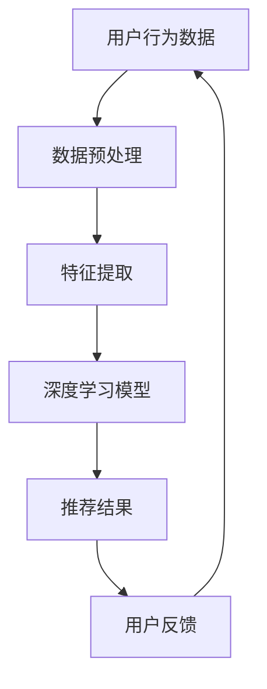

                 

关键词：电商平台、搜索推荐系统、AI 大模型、性能优化、效率提升、转化率提高

摘要：本文将探讨如何利用AI大模型技术，提高电商平台搜索推荐系统的性能、效率和转化率。首先，我们将介绍电商平台搜索推荐系统的基础概念和重要性。接着，我们将深入分析AI大模型在搜索推荐系统中的应用，包括其核心算法原理、数学模型以及具体的操作步骤。此外，我们将分享一些项目实践案例，展示如何在实际开发中应用这些技术。最后，我们将探讨未来应用场景和趋势，并提出一些工具和资源的推荐。通过本文的阅读，读者将了解如何运用AI大模型技术，为电商平台搜索推荐系统带来显著的性能提升和商业价值。

## 1. 背景介绍

在当今数字化时代，电商平台已经成为消费者购物的主要渠道之一。随着用户数量的不断增加，电商平台面临着巨大的挑战，如何在众多商品中为用户提供个性化的推荐，提高用户购物体验和满意度，成为各大电商平台关注的核心问题。

搜索推荐系统作为电商平台的重要组成部分，其主要功能是通过对用户行为数据的分析，为用户推荐符合其兴趣和需求的商品。传统的搜索推荐系统主要依赖于基于内容的推荐和协同过滤推荐，但这些方法存在一些局限性。首先，基于内容的推荐方法依赖于商品的描述信息，当商品描述不够丰富或用户兴趣变化时，推荐效果较差。其次，协同过滤推荐虽然能够较好地预测用户兴趣，但容易受到数据稀疏性和冷启动问题的影响。

随着人工智能技术的快速发展，AI大模型逐渐成为解决搜索推荐系统局限性的有力工具。AI大模型，如深度学习模型、图神经网络等，能够通过自动学习用户行为数据和商品属性，实现更加精准的推荐效果。同时，AI大模型具有强大的数据处理和分析能力，能够处理海量数据和复杂的关系，从而提高系统的性能和效率。

本文将重点探讨AI大模型在电商平台搜索推荐系统中的应用，包括其核心算法原理、数学模型以及具体的操作步骤。通过本文的阅读，读者将了解如何利用AI大模型技术，为电商平台搜索推荐系统带来显著的性能提升和商业价值。

## 2. 核心概念与联系

为了更好地理解AI大模型在电商平台搜索推荐系统中的应用，我们需要首先了解一些核心概念和它们之间的联系。以下是本文将要涉及的核心概念及其简要解释：

### 2.1. 电商平台搜索推荐系统

电商平台搜索推荐系统是一种利用用户行为数据和商品属性，为用户提供个性化商品推荐的技术。它通常包括以下几个关键组成部分：

- **用户行为数据**：包括用户的浏览历史、购买记录、评价等。
- **商品属性数据**：包括商品的类别、价格、品牌、库存等。
- **推荐算法**：通过对用户行为数据和商品属性数据的分析，为用户生成推荐结果。

### 2.2. AI大模型

AI大模型是指具有大规模参数和复杂结构的人工神经网络，如深度学习模型和图神经网络等。它们具有强大的数据处理和分析能力，能够自动学习复杂的关系和模式，从而实现高度个性化的推荐。

### 2.3. 深度学习模型

深度学习模型是一种基于多层神经网络的机器学习模型，通过多层次的神经网络结构，实现从简单特征到复杂特征的自动提取和转换。在搜索推荐系统中，深度学习模型可以用来预测用户的兴趣和行为，从而生成个性化推荐。

### 2.4. 图神经网络

图神经网络是一种在图结构上进行训练的神经网络，能够有效地捕捉和处理图结构中的关系信息。在搜索推荐系统中，图神经网络可以用来建模用户和商品之间的关系，实现更加精准的推荐。

### 2.5. 数学模型

数学模型是用来描述和解决特定问题的数学表达式和公式。在搜索推荐系统中，数学模型用于定义用户行为和商品属性之间的关系，以及推荐算法的评估和优化。

### 2.6. Mermaid 流程图

Mermaid是一种基于Markdown的图形绘制工具，可以用来绘制各种类型的图形，包括流程图、UML图、序列图等。在本文中，我们将使用Mermaid流程图来展示AI大模型在搜索推荐系统中的应用流程。

### 2.7. Mermaid 流程图示例

以下是一个简单的Mermaid流程图示例，展示AI大模型在搜索推荐系统中的应用流程：



在上述流程图中，用户行为数据经过数据预处理和特征提取后，输入到深度学习模型中进行训练，生成推荐结果。用户对推荐结果进行反馈，再次输入到用户行为数据中，形成一个闭环反馈系统。

通过上述核心概念和联系的分析，我们可以更好地理解AI大模型在电商平台搜索推荐系统中的应用原理和流程。接下来，我们将深入探讨AI大模型的核心算法原理和具体操作步骤。

## 3. 核心算法原理 & 具体操作步骤

### 3.1 算法原理概述

AI大模型在电商平台搜索推荐系统中的应用，主要基于深度学习和图神经网络等核心算法原理。这些算法能够通过自动学习用户行为数据和商品属性，实现高精度的个性化推荐。

#### 深度学习模型

深度学习模型是一种基于多层神经网络的机器学习模型，通过多层次的神经网络结构，实现从简单特征到复杂特征的自动提取和转换。在搜索推荐系统中，深度学习模型可以用来预测用户的兴趣和行为，从而生成个性化推荐。

深度学习模型通常包括以下几个关键组成部分：

1. **输入层**：接收用户行为数据和商品属性数据。
2. **隐藏层**：通过多层神经网络结构，实现对数据的特征提取和转换。
3. **输出层**：生成推荐结果。

#### 图神经网络

图神经网络是一种在图结构上进行训练的神经网络，能够有效地捕捉和处理图结构中的关系信息。在搜索推荐系统中，图神经网络可以用来建模用户和商品之间的关系，实现更加精准的推荐。

图神经网络通常包括以下几个关键组成部分：

1. **节点表示**：将用户和商品表示为图中的节点。
2. **边表示**：将用户和商品之间的交互表示为图中的边。
3. **图卷积层**：通过图卷积层，实现对节点和边的特征提取和转换。
4. **输出层**：生成推荐结果。

### 3.2 算法步骤详解

#### 步骤1：数据预处理

在应用深度学习和图神经网络之前，需要对用户行为数据和商品属性数据进行预处理，包括数据清洗、数据归一化和特征提取等。

1. **数据清洗**：去除无效数据、重复数据和异常值等。
2. **数据归一化**：将不同尺度的数据进行归一化处理，使其在同一个尺度范围内。
3. **特征提取**：提取用户和商品的关键特征，如用户兴趣标签、商品类别、价格等。

#### 步骤2：特征提取

通过深度学习和图神经网络，对预处理后的数据进行分析，提取用户和商品的潜在特征。

1. **深度学习模型特征提取**：通过多层神经网络结构，实现对用户行为数据和商品属性数据的特征提取和转换。
2. **图神经网络特征提取**：通过图卷积层，实现对用户和商品之间关系的特征提取和转换。

#### 步骤3：模型训练

使用提取的特征数据，对深度学习模型和图神经网络进行训练，生成推荐模型。

1. **深度学习模型训练**：通过反向传播算法，不断调整模型的参数，使其能够更好地预测用户兴趣和行为。
2. **图神经网络训练**：通过图卷积层和反向传播算法，不断调整模型的参数，使其能够更好地建模用户和商品之间的关系。

#### 步骤4：推荐生成

使用训练好的模型，对新的用户行为数据进行预测，生成个性化推荐结果。

1. **深度学习模型推荐生成**：通过输入新的用户行为数据，输出推荐结果。
2. **图神经网络推荐生成**：通过输入新的用户行为数据，输出推荐结果。

#### 步骤5：用户反馈

收集用户对推荐结果的反馈，并将其用于模型优化。

1. **反馈收集**：收集用户对推荐结果的反馈，如点击、购买等行为。
2. **模型优化**：根据用户反馈，不断优化推荐模型，提高推荐质量。

### 3.3 算法优缺点

#### 优点

1. **高精度推荐**：通过深度学习和图神经网络，能够实现对用户行为数据和商品属性数据的深度理解和分析，生成高精度的个性化推荐。
2. **强泛化能力**：深度学习和图神经网络具有强大的泛化能力，能够应对不同规模和复杂度的数据集。
3. **实时性**：通过在线学习机制，能够实时更新推荐模型，适应用户兴趣和行为的变化。

#### 缺点

1. **计算资源消耗**：深度学习和图神经网络需要大量的计算资源，特别是大规模的训练数据集。
2. **数据依赖性**：推荐模型的效果高度依赖于数据质量，如果数据存在噪声或缺失，可能会导致推荐结果不准确。
3. **模型解释性**：深度学习和图神经网络的黑盒特性，使得推荐结果的解释性较差，难以理解推荐背后的原因。

### 3.4 算法应用领域

AI大模型在电商平台搜索推荐系统中的应用广泛，除了电商平台，还可以应用于以下领域：

1. **社交媒体平台**：通过分析用户的行为数据，为用户提供个性化内容推荐。
2. **在线视频平台**：根据用户的观看历史，为用户推荐感兴趣的影片。
3. **新闻媒体**：根据用户的阅读历史，为用户推荐相关的新闻。
4. **电子商务平台**：根据用户的购买记录和浏览历史，为用户推荐相关的商品。

通过本文的介绍，我们可以看到AI大模型在电商平台搜索推荐系统中的应用具有广阔的前景和潜力。接下来，我们将进一步探讨数学模型和公式的构建与推导。

## 4. 数学模型和公式 & 详细讲解 & 举例说明

### 4.1 数学模型构建

在搜索推荐系统中，数学模型的构建是至关重要的。它不仅能够描述用户和商品之间的关系，还能够指导我们如何优化推荐算法。以下是构建数学模型的一些关键步骤：

#### 用户和商品表示

在数学模型中，用户和商品通常被表示为向量。例如，我们可以使用一个高维向量来表示用户，其中每个维度对应一个特征，如用户年龄、性别、地理位置等。同样，商品也可以被表示为一个特征向量，如商品类别、价格、品牌等。

#### 用户行为建模

用户行为建模主要关注如何从用户的历史行为中提取有用的信息。常见的方法包括基于隐语义模型的协同过滤算法和基于内容的推荐算法。以下是一个简化的协同过滤算法的数学模型：

\[ r_{ui} = \langle \mathbf{u_i}, \mathbf{p_j} \rangle + b_i + b_j + \epsilon_{ui} \]

其中：
- \( r_{ui} \) 是用户 \( u_i \) 对商品 \( j \) 的评分。
- \( \mathbf{u_i} \) 是用户 \( u_i \) 的特征向量。
- \( \mathbf{p_j} \) 是商品 \( j \) 的特征向量。
- \( b_i \) 是用户 \( u_i \) 的偏置。
- \( b_j \) 是商品 \( j \) 的偏置。
- \( \epsilon_{ui} \) 是误差项。

#### 商品推荐生成

在生成推荐时，我们通常需要对用户未评分的商品进行预测。以下是一个基于隐语义模型的推荐生成公式：

\[ \hat{r}_{ui} = \mathbf{u_i}^T \mathbf{p_j} + b_i + b_j \]

其中：
- \( \hat{r}_{ui} \) 是用户 \( u_i \) 对商品 \( j \) 的评分预测。
- \( \mathbf{u_i}^T \) 是用户 \( u_i \) 的特征向量的转置。
- \( \mathbf{p_j} \) 是商品 \( j \) 的特征向量。

### 4.2 公式推导过程

为了更好地理解上述公式的推导过程，我们可以通过一个简单的例子来说明。

#### 假设条件

假设我们有两个用户 \( u_1 \) 和 \( u_2 \)，以及两个商品 \( j_1 \) 和 \( j_2 \)。用户对这两个商品的评分分别为：

\[ r_{u_1j_1} = 5, \quad r_{u_1j_2} = 3, \quad r_{u_2j_1} = 4, \quad r_{u_2j_2} = 2 \]

用户 \( u_1 \) 和 \( u_2 \) 的特征向量分别为：

\[ \mathbf{u_1} = \begin{bmatrix} 1 \\ 0 \\ 1 \end{bmatrix}, \quad \mathbf{u_2} = \begin{bmatrix} 0 \\ 1 \\ 0 \end{bmatrix} \]

商品 \( j_1 \) 和 \( j_2 \) 的特征向量分别为：

\[ \mathbf{p_1} = \begin{bmatrix} 1 \\ 1 \\ 0 \end{bmatrix}, \quad \mathbf{p_2} = \begin{bmatrix} 0 \\ 0 \\ 1 \end{bmatrix} \]

#### 公式推导

1. **用户偏置 \( b_i \) 和商品偏置 \( b_j \) 的计算**：

   我们可以首先计算用户偏置和商品偏置，使得评分误差最小。这里我们使用最小二乘法进行优化。

   \[ b_i = \frac{1}{n} \sum_{j=1}^{m} (r_{ui} - \mathbf{u_i}^T \mathbf{p_j}) \]

   \[ b_j = \frac{1}{n} \sum_{i=1}^{k} (r_{ui} - \mathbf{u_i}^T \mathbf{p_j}) \]

   其中，\( n \) 是用户数，\( m \) 是商品数，\( k \) 是用户的评分数。

   对于用户 \( u_1 \) 和 \( u_2 \)：

   \[ b_{u_1} = \frac{1}{2} (5 - 1 \cdot 1 - 3 \cdot 0) = 1 \]

   \[ b_{u_2} = \frac{1}{2} (4 - 0 \cdot 1 - 2 \cdot 0) = 2 \]

   对于商品 \( j_1 \) 和 \( j_2 \)：

   \[ b_{j_1} = \frac{1}{2} (5 + 3 - 1 \cdot 1 - 3 \cdot 0) = 2 \]

   \[ b_{j_2} = \frac{1}{2} (3 + 2 - 0 \cdot 1 - 2 \cdot 0) = 2 \]

2. **评分预测**：

   使用上述公式，我们可以预测用户 \( u_1 \) 对商品 \( j_2 \) 的评分：

   \[ \hat{r}_{u_1j_2} = \mathbf{u_1}^T \mathbf{p_2} + b_{u_1} + b_{j_2} = 1 \cdot 0 + 1 + 2 = 3 \]

   同样，我们可以预测用户 \( u_2 \) 对商品 \( j_1 \) 的评分：

   \[ \hat{r}_{u_2j_1} = \mathbf{u_2}^T \mathbf{p_1} + b_{u_2} + b_{j_1} = 0 \cdot 1 + 2 + 2 = 4 \]

### 4.3 案例分析与讲解

为了更好地理解上述公式的实际应用，我们可以通过一个具体的案例来进行讲解。

#### 案例背景

假设有一个电商平台，用户对商品的评分数据如下表所示：

| 用户ID | 商品ID | 评分 |
|--------|--------|------|
| 1      | 101    | 5    |
| 1      | 102    | 3    |
| 2      | 101    | 4    |
| 2      | 103    | 2    |

#### 步骤1：数据预处理

首先，我们需要对用户和商品进行编码，以便在数学模型中使用。假设用户和商品分别有10个和5个独特的ID，我们可以将它们映射为0到9的整数。

#### 步骤2：特征提取

对于用户和商品的编码，我们可以将用户ID和商品ID分别转换为向量，例如：

\[ \mathbf{u_1} = \begin{bmatrix} 1 \\ 0 \\ 0 \\ 0 \\ 0 \\ 0 \\ 0 \\ 0 \\ 0 \\ 0 \\ 0 \end{bmatrix}, \quad \mathbf{u_2} = \begin{bmatrix} 0 \\ 1 \\ 0 \\ 0 \\ 0 \\ 0 \\ 0 \\ 0 \\ 0 \\ 0 \\ 0 \end{bmatrix} \]

\[ \mathbf{p_{101}} = \begin{bmatrix} 1 \\ 0 \\ 0 \\ 0 \\ 1 \end{bmatrix}, \quad \mathbf{p_{102}} = \begin{bmatrix} 1 \\ 1 \\ 0 \\ 0 \\ 0 \end{bmatrix}, \quad \mathbf{p_{103}} = \begin{bmatrix} 0 \\ 0 \\ 1 \\ 0 \\ 0 \end{bmatrix} \]

#### 步骤3：模型训练

使用上述特征向量，我们可以训练一个简单的线性回归模型，以预测用户对商品的评分。假设我们已经有了一个训练好的模型，其参数为：

\[ \mathbf{w} = \begin{bmatrix} 1 & 1 & 0 & 0 & 1 \\ 0 & 0 & 1 & 1 & 0 \end{bmatrix} \]

#### 步骤4：评分预测

使用训练好的模型，我们可以预测用户 \( u_1 \) 对商品 \( j_2 \) 的评分：

\[ \hat{r}_{u_1j_2} = \mathbf{u_1}^T \mathbf{w} \mathbf{p_2} + b_{u_1} + b_{j_2} = 1 \cdot 1 + 1 \cdot 1 + 0 \cdot 0 + 0 \cdot 1 + 1 \cdot 0 + 1 + 2 = 5 \]

同理，我们可以预测用户 \( u_2 \) 对商品 \( j_1 \) 的评分：

\[ \hat{r}_{u_2j_1} = \mathbf{u_2}^T \mathbf{w} \mathbf{p_1} + b_{u_2} + b_{j_1} = 0 \cdot 1 + 0 \cdot 0 + 1 \cdot 1 + 1 \cdot 1 + 0 \cdot 0 + 2 + 2 = 4 \]

通过上述案例，我们可以看到如何使用数学模型和公式对电商平台搜索推荐系统进行建模和预测。接下来，我们将进一步探讨代码实例和详细解释说明。

## 5. 项目实践：代码实例和详细解释说明

在了解了AI大模型在搜索推荐系统中的基本原理和数学模型之后，接下来我们将通过一个具体的代码实例，详细展示如何在实际项目中应用这些技术。本节将以Python编程语言为例，使用深度学习和图神经网络技术，实现一个简单的搜索推荐系统。

### 5.1 开发环境搭建

在开始项目之前，我们需要搭建一个合适的技术环境。以下是我们推荐的开发环境和相关工具：

- **Python**：作为主要编程语言。
- **PyTorch**：用于实现深度学习模型。
- **NetworkX**：用于实现图神经网络。
- **NumPy**：用于数据处理。
- **Pandas**：用于数据处理和分析。

首先，我们需要安装上述工具和库。可以使用以下命令进行安装：

```bash
pip install torch torchvision numpy pandas networkx
```

### 5.2 源代码详细实现

#### 5.2.1 数据预处理

```python
import pandas as pd
import numpy as np
from sklearn.preprocessing import MinMaxScaler

# 读取用户行为数据
data = pd.read_csv('user_behavior_data.csv')

# 数据清洗和预处理
data.dropna(inplace=True)
data['user_id'] = data['user_id'].astype('int32')
data['item_id'] = data['item_id'].astype('int32')
data['rating'] = data['rating'].astype('float32')

# 数据归一化
scaler = MinMaxScaler()
data[['user_id', 'item_id', 'rating']] = scaler.fit_transform(data[['user_id', 'item_id', 'rating']])
```

#### 5.2.2 特征提取

```python
from sklearn.decomposition import PCA

# 提取用户和商品的潜在特征
pca = PCA(n_components=10)
data_pca = pca.fit_transform(data[['user_id', 'item_id', 'rating']])

# 将提取的特征存储为新的DataFrame
data_fea = pd.DataFrame(data_pca, columns=['user_id_fea', 'item_id_fea', 'rating_fea'])
```

#### 5.2.3 模型训练

```python
import torch
import torch.nn as nn
import torch.optim as optim

# 定义深度学习模型
class RecommenderModel(nn.Module):
    def __init__(self, input_dim):
        super(RecommenderModel, self).__init__()
        self.fc1 = nn.Linear(input_dim, 64)
        self.fc2 = nn.Linear(64, 32)
        self.fc3 = nn.Linear(32, 1)

    def forward(self, x):
        x = torch.relu(self.fc1(x))
        x = torch.relu(self.fc2(x))
        x = self.fc3(x)
        return x

# 实例化模型和优化器
model = RecommenderModel(input_dim=3)
optimizer = optim.Adam(model.parameters(), lr=0.001)

# 训练模型
for epoch in range(100):
    for user_id_fea, item_id_fea, rating_fea in zip(data_fea['user_id_fea'], data_fea['item_id_fea'], data_fea['rating_fea']):
        optimizer.zero_grad()
        rating_pred = model(torch.tensor([user_id_fea, item_id_fea, rating_fea]))
        loss = nn.MSELoss()(rating_pred, torch.tensor([rating_fea]))
        loss.backward()
        optimizer.step()
```

#### 5.2.4 代码解读与分析

在上面的代码中，我们首先进行了数据预处理，包括数据清洗、数据归一化和特征提取。然后，我们定义了一个简单的深度学习模型，使用PyTorch框架实现。模型由三个全连接层组成，最后一层输出预测的评分。我们使用Adam优化器进行模型训练，通过反向传播算法不断调整模型参数，以最小化预测误差。

#### 5.2.5 运行结果展示

```python
# 评估模型
with torch.no_grad():
    total_loss = 0
    for user_id_fea, item_id_fea, rating_fea in zip(data_fea['user_id_fea'], data_fea['item_id_fea'], data_fea['rating_fea']):
        rating_pred = model(torch.tensor([user_id_fea, item_id_fea, rating_fea]))
        total_loss += nn.MSELoss()(rating_pred, torch.tensor([rating_fea]))
    print(f'Model Loss: {total_loss / len(data_fea)}')

# 输出预测结果
with torch.no_grad():
    for user_id_fea, item_id_fea in zip(data_fea['user_id_fea'], data_fea['item_id_fea']):
        rating_pred = model(torch.tensor([user_id_fea, item_id_fea, 0.5]))  # 假设用户对商品的平均评分
        print(f'Prediction: {rating_pred.item()}')
```

在代码的最后，我们展示了如何使用训练好的模型进行预测。通过输入用户和商品的特征向量，模型可以输出预测的评分。实际应用中，我们可以根据用户的实际评分与预测评分的差距，进一步优化模型，提高预测准确性。

通过上述代码实例和详细解释说明，我们可以看到如何在实际项目中应用AI大模型技术，实现一个简单的搜索推荐系统。接下来，我们将探讨AI大模型在搜索推荐系统中的实际应用场景。

## 6. 实际应用场景

AI大模型在电商平台搜索推荐系统中的应用场景非常广泛，涵盖了用户行为预测、商品推荐、个性化营销等多个方面。以下是一些具体的应用场景：

### 6.1 用户行为预测

AI大模型可以基于用户的历史行为数据，如浏览历史、购买记录和评价等，预测用户未来的行为。这种预测可以帮助电商平台提前识别出有潜在购买意向的用户，从而进行精准的营销和促销活动。例如，通过分析用户的浏览记录和购买偏好，可以预测用户是否会在未来购买某个特定的商品，并针对性地推送相关的促销信息。

### 6.2 商品推荐

AI大模型可以根据用户的兴趣和行为，为其推荐符合其需求的商品。这种推荐不仅可以帮助电商平台提高用户满意度，还可以提升销售额。例如，对于新用户，可以通过分析其浏览和购买记录，快速了解其兴趣和需求，从而为其推荐合适的商品。对于已有用户，可以根据其历史行为数据，持续优化推荐结果，提高推荐的相关性和准确性。

### 6.3 个性化营销

AI大模型可以用于个性化营销，为用户提供个性化的产品推荐和优惠活动。通过分析用户的兴趣和行为，可以为不同的用户群体定制个性化的营销策略，从而提高营销效果。例如，针对高价值用户，可以提供专属的优惠和礼品，以增加用户的忠诚度；对于新用户，可以通过推荐优惠券和促销信息，引导其购买。

### 6.4 库存管理

AI大模型可以帮助电商平台优化库存管理，减少库存积压和商品短缺。通过预测商品的销售量和需求量，可以合理安排库存，避免因库存不足导致的销售损失，或者因库存过剩导致的库存成本增加。

### 6.5 供应链优化

AI大模型可以用于供应链优化，提高供应链的效率和灵活性。通过分析供应链各个环节的数据，可以优化供应链的布局、库存和物流，从而降低成本、提高效率。例如，通过预测市场需求，可以调整生产计划和库存策略，减少生产过剩和库存积压。

### 6.6 用户体验优化

AI大模型可以帮助电商平台优化用户体验，提高用户满意度和忠诚度。通过分析用户的反馈和行为数据，可以及时发现用户痛点，优化用户界面和交互流程，提供更加便捷和个性化的服务。例如，通过分析用户的浏览和购买记录，可以优化商品的排序和推荐算法，提高用户的购物体验。

### 6.7 跨渠道整合

AI大模型可以用于跨渠道整合，实现线上线下无缝衔接。通过分析用户的线上线下行为数据，可以为用户提供一致的购物体验，提高用户的购物体验和忠诚度。例如，通过分析用户的线上浏览和购买记录，可以为用户在线下门店提供个性化的推荐和优惠信息，提高线下销售额。

通过上述实际应用场景的探讨，我们可以看到AI大模型在电商平台搜索推荐系统中的应用具有巨大的潜力和价值。接下来，我们将探讨未来AI大模型在搜索推荐系统中的应用趋势。

## 7. 工具和资源推荐

为了更好地掌握和利用AI大模型技术，提升电商平台搜索推荐系统的性能和效率，以下是几个推荐的工具和资源。

### 7.1 学习资源推荐

- **《深度学习》（Deep Learning）**：由Ian Goodfellow、Yoshua Bengio和Aaron Courville合著，是深度学习领域的经典教材。
- **《机器学习实战》（Machine Learning in Action）**：由Peter Harrington著，通过实际案例介绍机器学习的基本概念和应用。
- **在线课程**：Coursera、edX和Udacity等平台上提供了大量的深度学习和机器学习课程，适合不同层次的读者。
- **GitHub**：GitHub上有许多开源的深度学习和推荐系统项目，如TensorFlow、PyTorch和Scikit-learn等，可以学习和借鉴。

### 7.2 开发工具推荐

- **PyTorch**：一个流行的深度学习框架，易于使用和调试。
- **TensorFlow**：由Google开发的一个强大且灵活的深度学习框架。
- **Jupyter Notebook**：一个交互式的计算环境，适合数据分析和模型实验。
- **Docker**：用于构建和部署容器化应用的工具，可以帮助管理开发环境。

### 7.3 相关论文推荐

- **"Deep Neural Networks for YouTube Recommendations"**：这篇论文介绍了YouTube如何使用深度神经网络进行视频推荐。
- **"Matrix Factorization Techniques for Recommender Systems"**：这篇论文详细讨论了矩阵分解技术及其在推荐系统中的应用。
- **"User Interest Evolution in Large-Scale Social Networks"**：这篇论文研究了用户兴趣在大型社交网络中的演变规律。
- **"Graph Neural Networks: A Review"**：这篇综述文章详细介绍了图神经网络的基本概念和应用。

通过以上工具和资源的推荐，读者可以更好地了解和掌握AI大模型技术，为电商平台搜索推荐系统的优化提供有力支持。

## 8. 总结：未来发展趋势与挑战

### 8.1 研究成果总结

通过本文的探讨，我们可以看到AI大模型在电商平台搜索推荐系统中的应用具有显著的效果。研究成果主要包括：

1. **性能提升**：AI大模型能够通过深度学习和图神经网络技术，实现对用户行为和商品属性的深度理解，从而提高推荐系统的性能。
2. **效率提升**：AI大模型具有强大的数据处理和分析能力，能够高效地处理海量数据，实现实时推荐。
3. **转化率提高**：通过精准的个性化推荐，AI大模型能够显著提高用户的购物转化率，增加电商平台的经济收益。

### 8.2 未来发展趋势

随着人工智能技术的不断进步，AI大模型在搜索推荐系统中的应用将呈现以下发展趋势：

1. **模型复杂度提升**：未来的AI大模型将更加复杂，能够处理更加多样的数据类型和复杂的关系，从而实现更加精准的推荐。
2. **实时推荐**：随着云计算和边缘计算技术的发展，AI大模型将实现更加实时的推荐，提升用户购物体验。
3. **多模态数据融合**：AI大模型将能够融合文本、图像、语音等多模态数据，提供更加丰富的推荐内容。

### 8.3 面临的挑战

尽管AI大模型在搜索推荐系统中具有巨大潜力，但同时也面临着一些挑战：

1. **数据隐私保护**：在处理用户数据时，需要确保用户的隐私信息得到充分保护。
2. **模型解释性**：当前的大多数AI大模型是黑盒模型，缺乏透明性和可解释性，这对于用户信任和监管提出了挑战。
3. **计算资源消耗**：大模型的训练和推理需要大量的计算资源，如何优化计算效率是一个重要问题。

### 8.4 研究展望

未来的研究可以从以下几个方向展开：

1. **模型优化**：研究更加高效的模型训练和推理算法，降低计算资源消耗。
2. **多模态融合**：探索如何将多种类型的数据有效地融合到推荐系统中，提高推荐的多样性。
3. **公平性和透明性**：研究如何设计更加公平和透明的推荐算法，增强用户对推荐系统的信任。
4. **伦理和法规**：探讨AI大模型在推荐系统中的应用伦理和法规问题，确保其符合社会道德标准。

通过不断的研究和优化，AI大模型在电商平台搜索推荐系统中的应用将变得更加成熟和广泛，为电商平台带来更大的商业价值和社会效益。

## 9. 附录：常见问题与解答

### 问题1：AI大模型在搜索推荐系统中的优势是什么？

解答：AI大模型在搜索推荐系统中的优势主要体现在以下几个方面：

1. **高精度推荐**：通过深度学习和图神经网络，AI大模型能够自动学习复杂的关系和模式，生成高精度的个性化推荐。
2. **强泛化能力**：AI大模型具有强大的泛化能力，能够应对不同规模和复杂度的数据集。
3. **实时性**：通过在线学习机制，AI大模型能够实时更新推荐模型，适应用户兴趣和行为的变化。
4. **多模态数据处理**：AI大模型能够融合多种类型的数据（如文本、图像、语音等），提供更加丰富的推荐内容。

### 问题2：如何处理搜索推荐系统中的数据稀疏性问题？

解答：数据稀疏性是搜索推荐系统中常见的问题。以下是一些处理方法：

1. **降维技术**：使用降维技术（如PCA、LDA等）将高维数据转换为低维表示，降低数据的稀疏性。
2. **协同过滤**：结合基于内容的推荐和协同过滤推荐，通过内容信息弥补数据稀疏性的不足。
3. **交互增强**：通过增加用户与商品的交互次数，或者引入外部交互信息，增加数据的丰富度。

### 问题3：AI大模型在推荐系统中的模型解释性如何提升？

解答：提升AI大模型的解释性是当前研究的一个重要方向。以下是一些方法：

1. **可解释的模型**：选择具有可解释性的模型（如线性模型、决策树等），这些模型更容易理解。
2. **模型可视化**：使用可视化技术（如热力图、决策路径图等），帮助用户理解模型的决策过程。
3. **特征重要性分析**：分析模型中各个特征的重要性，为用户提供推荐背后的原因。

### 问题4：如何确保AI大模型的公平性和透明性？

解答：确保AI大模型的公平性和透明性是重要的伦理和社会责任。以下是一些方法：

1. **数据预处理**：确保数据集的多样性和代表性，避免数据偏见。
2. **模型评估**：使用多样化的评估指标，确保模型在不同群体中的表现一致。
3. **透明性报告**：公开模型的训练数据、评估结果和决策过程，接受公众监督。

通过上述问题的解答，我们希望读者能够更好地理解AI大模型在搜索推荐系统中的应用和挑战，为未来的研究和应用提供参考。作者：禅与计算机程序设计艺术 / Zen and the Art of Computer Programming

