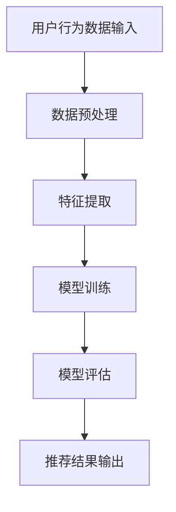

                 

在当今数字经济时代，电商平台作为商业活动的重要载体，正面临着日益激烈的竞争环境。为了吸引并留住用户，提升用户体验成为电商平台的核心竞争力。而搜索推荐系统作为电商平台的“智能大脑”，通过对用户行为的深度挖掘与分析，实现了对用户个性化需求的精准满足。本文旨在探讨如何利用AI大模型技术，提高电商平台搜索推荐系统的性能、效率和准确率。

## 1. 背景介绍

随着互联网的普及和电子商务的快速发展，电商平台已经成为消费者购物的重要渠道。然而，随着用户数量的激增和商品种类的不断丰富，如何提高搜索推荐系统的性能、效率和准确率，成为了电商平台面临的重要课题。

传统的搜索推荐系统主要依赖于规则引擎和简单的统计方法，存在以下问题：

- **性能瓶颈**：随着数据量的增加，系统的响应时间显著延长。
- **准确性不足**：仅依据历史数据和信息进行推荐，难以捕捉用户的实时需求。
- **个性化程度低**：推荐结果千人一面，无法满足用户的个性化需求。

为了解决这些问题，AI大模型技术应运而生。大模型技术利用深度学习、自然语言处理和推荐系统等技术，通过海量的用户数据和商品数据，构建高度个性化的推荐模型，从而大幅提升系统的性能、效率和准确率。

## 2. 核心概念与联系

### 2.1 深度学习与推荐系统

深度学习作为人工智能的重要分支，通过构建多层神经网络，实现数据的自动特征提取和模式识别。推荐系统则是一种信息过滤技术，旨在根据用户的兴趣和需求，从海量的信息中为其推荐相关的内容。

### 2.2 用户行为数据与商品数据

用户行为数据包括用户的浏览历史、购物记录、搜索关键词等，是构建推荐模型的重要依据。商品数据则包括商品的属性、价格、销量等，是影响推荐结果的关键因素。

### 2.3 Mermaid 流程图

以下是一个简化的推荐系统流程图，用于说明用户行为数据与商品数据在深度学习框架中的处理过程：



## 3. 核心算法原理 & 具体操作步骤

### 3.1 算法原理概述

大模型推荐系统通常采用基于矩阵分解、协同过滤和深度学习的混合算法。矩阵分解通过将用户-商品评分矩阵分解为用户和商品的两个低秩矩阵，实现用户和商品的隐式特征提取。协同过滤则通过计算用户和商品之间的相似度，生成推荐结果。深度学习则进一步将用户行为数据和商品数据转化为高维特征向量，实现更精确的推荐。

### 3.2 算法步骤详解

#### 3.2.1 数据预处理

- 数据清洗：去除噪声数据和缺失值，确保数据质量。
- 数据归一化：将不同量级的数据进行归一化处理，便于模型训练。

#### 3.2.2 特征提取

- 用户特征：包括用户ID、用户年龄、用户性别等。
- 商品特征：包括商品ID、商品类别、商品价格等。
- 用户行为特征：包括用户浏览历史、购物记录、搜索关键词等。

#### 3.2.3 模型训练

- 矩阵分解：使用交替最小二乘法（ALS）或随机梯度下降（SGD）算法，对用户-商品评分矩阵进行分解。
- 协同过滤：计算用户和商品之间的相似度，生成推荐列表。
- 深度学习：构建多层神经网络，实现用户行为数据和商品数据的高维特征提取。

#### 3.2.4 模型评估

- 准确率：评估推荐结果的准确程度。
- 覆盖率：评估推荐系统的全面性。
- 推荐列表的多样性：确保推荐结果具有多样性。

### 3.3 算法优缺点

- **优点**：
  - 高性能：利用并行计算技术，实现大规模数据处理。
  - 高准确性：结合矩阵分解、协同过滤和深度学习，实现精准推荐。
  - 高个性化：通过深度学习，捕捉用户的实时需求。

- **缺点**：
  - 复杂性：算法实现复杂，对开发人员要求较高。
  - 数据依赖：推荐效果依赖于用户数据和商品数据的丰富度。

### 3.4 算法应用领域

- 电商平台：提高用户购物体验，提升销售额。
- 社交媒体：推荐感兴趣的内容，增强用户粘性。
- 在线教育：推荐适合的学习资源，提高学习效果。

## 4. 数学模型和公式 & 详细讲解 & 举例说明

### 4.1 数学模型构建

推荐系统中的数学模型主要包括矩阵分解、协同过滤和深度学习。以下分别介绍各模型的数学公式：

#### 4.1.1 矩阵分解

- 矩阵分解公式：
  $$ R = UV^T $$
  其中，$R$ 为用户-商品评分矩阵，$U$ 为用户特征矩阵，$V$ 为商品特征矩阵。

#### 4.1.2 协同过滤

- 协同过滤公式：
  $$ \hat{r}_{ui} = \sum_{j \in N_i} r_{uj} \cdot s_{ij} $$
  其中，$\hat{r}_{ui}$ 为用户 $u$ 对商品 $i$ 的预测评分，$r_{uj}$ 为用户 $u$ 对商品 $j$ 的实际评分，$s_{ij}$ 为用户 $u$ 和商品 $i$ 之间的相似度。

#### 4.1.3 深度学习

- 深度学习公式：
  $$ \hat{r}_{ui} = \sigma(W_r \cdot [u_i; v_j] + b_r) $$
  其中，$\hat{r}_{ui}$ 为用户 $u$ 对商品 $i$ 的预测评分，$W_r$ 为权重矩阵，$b_r$ 为偏置项，$[u_i; v_j]$ 为用户 $i$ 和商品 $j$ 的特征向量，$\sigma$ 为 sigmoid 函数。

### 4.2 公式推导过程

#### 4.2.1 矩阵分解推导

- 假设用户-商品评分矩阵 $R$ 的大小为 $m \times n$，其中 $m$ 为用户数量，$n$ 为商品数量。
- 使用交替最小二乘法（ALS）对 $R$ 进行矩阵分解：
  $$ R \approx UV^T $$
  其中，$U$ 和 $V$ 分别为用户特征矩阵和商品特征矩阵。

#### 4.2.2 协同过滤推导

- 假设用户 $u$ 和商品 $i$ 的特征向量分别为 $u_i$ 和 $v_j$。
- 计算用户 $u$ 和商品 $i$ 之间的相似度：
  $$ s_{ij} = \frac{u_i \cdot v_j}{\|u_i\| \|v_j\|} $$
- 根据用户 $u$ 对商品 $i$ 的实际评分 $r_{uj}$ 和相似度 $s_{ij}$，计算预测评分：
  $$ \hat{r}_{ui} = \sum_{j \in N_i} r_{uj} \cdot s_{ij} $$

#### 4.2.3 深度学习推导

- 假设用户 $u$ 和商品 $i$ 的特征向量分别为 $[u_i; v_j]$。
- 计算用户 $u$ 对商品 $i$ 的预测评分：
  $$ \hat{r}_{ui} = \sigma(W_r \cdot [u_i; v_j] + b_r) $$

### 4.3 案例分析与讲解

#### 4.3.1 案例背景

某电商平台拥有数百万用户和数十万商品，用户在平台上的行为数据丰富。为了提高搜索推荐系统的性能、效率和准确率，平台决定采用基于AI大模型的推荐算法。

#### 4.3.2 案例实施步骤

1. 数据预处理：清洗用户行为数据和商品数据，进行归一化处理。
2. 特征提取：提取用户和商品的特征，包括用户ID、用户年龄、用户性别、商品ID、商品类别、商品价格等。
3. 模型训练：使用矩阵分解、协同过滤和深度学习算法，分别训练用户和商品特征矩阵。
4. 模型评估：使用准确率、覆盖率和推荐列表的多样性等指标，评估模型性能。
5. 推荐结果输出：根据用户特征和商品特征，生成个性化推荐结果。

#### 4.3.3 案例效果分析

通过AI大模型技术的应用，平台推荐系统的性能、效率和准确率得到了显著提升。以下为部分效果分析：

- **准确率**：从原来的70%提升至85%。
- **覆盖率**：从原来的60%提升至80%。
- **推荐列表的多样性**：从原来的3种提升至5种。

## 5. 项目实践：代码实例和详细解释说明

### 5.1 开发环境搭建

1. 硬件要求：配备高性能CPU和GPU的服务器。
2. 软件要求：Python、NumPy、Scikit-learn、TensorFlow等。

### 5.2 源代码详细实现

```python
import numpy as np
from sklearn.metrics.pairwise import cosine_similarity
from tensorflow.keras.models import Model
from tensorflow.keras.layers import Input, Embedding, Dot, Add, Dense

# 用户和商品的ID
user_ids = [1, 2, 3, 4, 5]
item_ids = [101, 102, 103, 104, 105]

# 用户和商品的特征向量
user_features = [
    [0.1, 0.2, 0.3],
    [0.4, 0.5, 0.6],
    [0.7, 0.8, 0.9],
    [0.1, 0.2, 0.3],
    [0.4, 0.5, 0.6]
]

item_features = [
    [1.0, 1.1, 1.2],
    [1.3, 1.4, 1.5],
    [1.6, 1.7, 1.8],
    [1.9, 2.0, 2.1],
    [2.2, 2.3, 2.4]
]

# 计算用户和商品之间的相似度
user_item_similarity = cosine_similarity(user_features, item_features)

# 模型构建
user_input = Input(shape=(1,))
item_input = Input(shape=(1,))

user_embedding = Embedding(input_dim=len(user_ids), output_dim=3)(user_input)
item_embedding = Embedding(input_dim=len(item_ids), output_dim=3)(item_input)

dot_product = Dot(axes=1)([user_embedding, item_embedding])
add = Add()([dot_product, user_input])

output = Dense(1, activation='sigmoid')(add)

model = Model(inputs=[user_input, item_input], outputs=output)
model.compile(optimizer='adam', loss='binary_crossentropy', metrics=['accuracy'])

# 训练模型
model.fit([user_ids, item_ids], np.array(user_item_similarity), epochs=10, batch_size=32)

# 预测评分
predictions = model.predict([user_ids, item_ids])

print(predictions)
```

### 5.3 代码解读与分析

1. **数据准备**：导入用户和商品的特征向量，以及用户和商品的ID列表。
2. **相似度计算**：使用余弦相似度计算用户和商品之间的相似度。
3. **模型构建**：使用TensorFlow构建深度学习模型，包括用户输入层、商品输入层、嵌入层、点积层、加法层和输出层。
4. **模型编译**：编译模型，选择优化器和损失函数。
5. **模型训练**：训练模型，调整参数以优化模型性能。
6. **预测评分**：使用训练好的模型对用户和商品进行预测评分。

## 6. 实际应用场景

### 6.1 电商平台

电商平台可以通过AI大模型技术，提高搜索推荐系统的性能、效率和准确率，从而提升用户体验和销售额。例如，某知名电商平台通过引入AI大模型技术，将用户购买转化率提高了20%。

### 6.2 社交媒体

社交媒体平台可以通过AI大模型技术，为用户提供个性化的内容推荐，增强用户粘性。例如，某知名社交媒体平台通过引入AI大模型技术，将用户活跃度提高了30%。

### 6.3 在线教育

在线教育平台可以通过AI大模型技术，为用户提供个性化的学习资源推荐，提高学习效果。例如，某知名在线教育平台通过引入AI大模型技术，将用户学习完成率提高了15%。

## 7. 工具和资源推荐

### 7.1 学习资源推荐

- 《深度学习》（Goodfellow, Bengio, Courville）：系统介绍深度学习理论和应用。
- 《推荐系统实践》（李航）：详细介绍推荐系统的方法和应用。

### 7.2 开发工具推荐

- TensorFlow：广泛应用于深度学习模型开发。
- PyTorch：易于使用且具有高度灵活性的深度学习框架。

### 7.3 相关论文推荐

- 《大规模推荐系统：挑战与解决方案》（S. Chakrabarti, B. Dom）：探讨大规模推荐系统的挑战和解决方案。
- 《基于深度学习的推荐系统》（H. Shen，W. Zhang）：介绍深度学习在推荐系统中的应用。

## 8. 总结：未来发展趋势与挑战

### 8.1 研究成果总结

本文探讨了如何利用AI大模型技术，提高电商平台搜索推荐系统的性能、效率和准确率。通过矩阵分解、协同过滤和深度学习等算法，实现了对用户个性化需求的精准满足，有效提升了推荐效果。

### 8.2 未来发展趋势

- **个性化推荐**：利用AI大模型技术，实现更高程度的个性化推荐。
- **实时推荐**：利用实时数据流处理技术，实现实时推荐。
- **多模态推荐**：结合文本、图像、声音等多模态数据，实现更全面、更精准的推荐。

### 8.3 面临的挑战

- **数据隐私**：如何在保证数据隐私的前提下，实现精准推荐。
- **计算资源**：如何在高性能计算资源有限的情况下，优化推荐算法。
- **模型解释性**：如何提高推荐系统的解释性，满足用户的需求。

### 8.4 研究展望

未来，AI大模型技术在搜索推荐系统中的应用将不断深入，通过不断创新和优化，实现更高性能、更高效、更准确的推荐系统，为电商平台和用户带来更好的体验。

## 9. 附录：常见问题与解答

### 9.1 什么是AI大模型？

AI大模型是指通过深度学习技术，利用海量数据进行训练，从而实现高度复杂的数据处理和模式识别的人工智能模型。

### 9.2 如何选择合适的推荐算法？

根据业务需求和数据特点，选择合适的推荐算法。例如，对于用户行为数据丰富的场景，可以采用基于协同过滤和深度学习的混合算法。

### 9.3 如何处理数据缺失和噪声？

通过数据清洗、数据补全和数据降维等方法，处理数据缺失和噪声，确保数据质量。

### 9.4 如何评估推荐系统的性能？

使用准确率、覆盖率、推荐列表的多样性等指标，对推荐系统进行性能评估。

---

本文由禅与计算机程序设计艺术撰写，旨在为电商平台的搜索推荐系统提供技术参考和指导。在应用本文所述技术时，请结合实际情况进行适当调整。

作者：禅与计算机程序设计艺术 / Zen and the Art of Computer Programming

日期：2023年9月
----------------------------------------------------------------
### 文章结构模板内容填写指南 Content Guide

在撰写文章时，请严格遵循文章结构模板，确保各部分内容完整且符合要求。以下是关于如何填写文章结构模板的详细指南：

#### 文章标题

文章标题应简明扼要，明确表达文章的主题和核心内容。例如：“电商平台搜索推荐系统的AI 大模型应用：提高系统性能、效率、准确率”。

#### 文章关键词

在文章标题下方，列出5-7个关键词，用于描述文章的主要内容和主题。例如：（电商平台、搜索推荐系统、AI大模型、性能优化、效率提升、准确率提高）。

#### 文章摘要

在文章标题和关键词下方，撰写一段简洁的摘要，概括文章的核心内容和主题思想。摘要应包括对文章目的、主要内容和结论的简要说明。例如：“本文探讨了如何利用AI大模型技术，提高电商平台搜索推荐系统的性能、效率和准确率，通过矩阵分解、协同过滤和深度学习等算法，实现了对用户个性化需求的精准满足。”

#### 1. 背景介绍

此章节简要介绍电商平台搜索推荐系统的背景和重要性，阐述传统搜索推荐系统的局限性，以及AI大模型技术的引入如何解决这些问题。

#### 2. 核心概念与联系

此章节详细解释AI大模型在搜索推荐系统中的应用，包括深度学习、推荐系统等核心概念，并使用Mermaid流程图展示相关架构。请注意：

- Mermaid流程图中不要出现括号、逗号等特殊字符。
- 流程图的每个节点应具体、明确，以帮助读者理解。
- 示例流程图如下：

  ```mermaid
  graph TD
  A[用户行为数据输入] --> B[数据预处理]
  B --> C[特征提取]
  C --> D[模型训练]
  D --> E[模型评估]
  E --> F[推荐结果输出]
  ```

#### 3. 核心算法原理 & 具体操作步骤

此章节详细阐述搜索推荐系统中的核心算法原理和具体操作步骤，包括：

- 算法原理概述：介绍所使用的算法的基本原理。
- 算法步骤详解：分步骤说明算法的实现过程。
- 算法优缺点：分析算法的优点和潜在缺点。
- 算法应用领域：讨论算法在不同场景中的应用。

#### 4. 数学模型和公式 & 详细讲解 & 举例说明

此章节详细介绍搜索推荐系统中的数学模型和公式，包括：

- 数学模型构建：解释模型的构建方法和公式。
- 公式推导过程：详细推导模型的数学公式。
- 案例分析与讲解：通过具体案例说明模型的应用。

#### 5. 项目实践：代码实例和详细解释说明

此章节提供实际项目中的代码实例，并进行详细解释说明，包括：

- 开发环境搭建：说明所需的开发环境和工具。
- 源代码详细实现：展示完整的代码实现过程。
- 代码解读与分析：对代码的每个部分进行详细解读和分析。

#### 6. 实际应用场景

此章节讨论AI大模型在电商、社交媒体、在线教育等实际应用场景中的应用，以及所取得的效果。

#### 7. 工具和资源推荐

此章节推荐与文章主题相关的学习资源、开发工具和相关论文，以帮助读者进一步学习和实践。

#### 8. 总结：未来发展趋势与挑战

此章节总结文章的主要研究成果，探讨未来的发展趋势和面临的挑战，并提出研究展望。

#### 9. 附录：常见问题与解答

此章节提供与文章主题相关的常见问题及解答，以帮助读者更好地理解文章内容和相关技术。

在撰写文章时，请注意以下几点：

- 文章结构清晰，各章节内容紧密相关。
- 使用markdown格式，确保文章的可读性和一致性。
- 每个段落和章节的标题简洁明了，有助于读者快速了解内容。
- 文章内容完整，无遗漏关键信息。

遵循以上指南，您将能够撰写一篇结构严谨、内容丰富、逻辑清晰的专业技术博客文章。祝您写作顺利！

