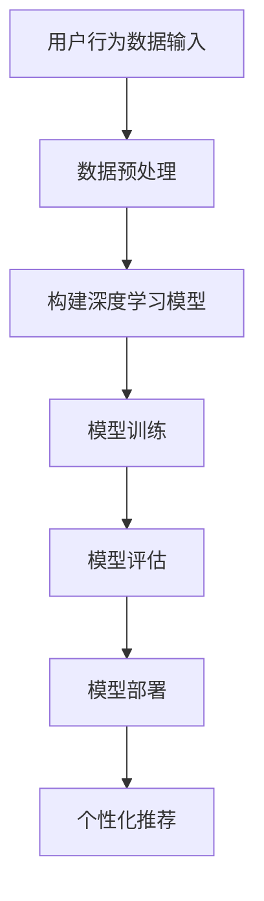

                 

作者：禅与计算机程序设计艺术 / Zen and the Art of Computer Programming

随着互联网的快速发展，电商平台已经成为现代商业的重要组成部分。在电商平台中，搜索推荐系统扮演着至关重要的角色，它能够根据用户的搜索历史、购买行为等数据，为用户推荐相关产品，从而提升用户体验，增加销售额。近年来，人工智能技术的迅速崛起，特别是深度学习大模型的应用，使得搜索推荐系统的性能、效率和准确性得到了显著提升。本文将探讨AI大模型在电商平台搜索推荐系统中的应用，以及如何通过这种应用提高系统的性能、效率、准确率和多样性。

## 1. 背景介绍

电商平台的搜索推荐系统是连接消费者和产品的重要桥梁。传统的搜索推荐系统主要依赖于关键词匹配和协同过滤等方法，这些方法在一定程度上能够满足用户的需求，但随着用户规模的扩大和商品种类的增多，传统方法已经无法满足高效的搜索推荐需求。与此同时，人工智能技术的不断发展，特别是深度学习大模型的崛起，为搜索推荐系统带来了新的契机。

深度学习大模型具有强大的特征提取能力和自适应学习能力，能够从大量数据中提取有用的信息，并根据用户的行为和偏好进行个性化推荐。这种技术的应用，不仅能够提升搜索推荐系统的性能和效率，还能提高推荐的准确率和多样性。本文将围绕这些方面进行深入探讨。

## 2. 核心概念与联系

在深入探讨AI大模型在电商平台搜索推荐系统中的应用之前，我们需要先了解一些核心概念，包括深度学习、神经网络、大模型等。

### 2.1 深度学习

深度学习是人工智能的一个重要分支，它通过模拟人脑的神经元结构，构建出复杂的神经网络，从而实现数据的自动特征提取和模式识别。深度学习大模型是指参数规模庞大的神经网络，这些模型通过大量数据训练，能够实现高度的非线性特征提取和复杂任务的学习。

### 2.2 神经网络

神经网络是深度学习的基础，它由大量相互连接的神经元组成。每个神经元都可以接收输入信号，通过激活函数进行处理，然后将输出传递给下一层神经元。通过这种层次化的处理方式，神经网络能够对输入数据进行特征提取和模式识别。

### 2.3 大模型

大模型是指参数规模庞大的神经网络，这些模型通常需要海量的数据进行训练，以达到良好的性能。大模型的应用，使得深度学习能够解决更复杂的问题，如图像识别、语音识别和自然语言处理等。

### 2.4 Mermaid 流程图

下面是一个简单的Mermaid流程图，展示了深度学习大模型在搜索推荐系统中的应用流程：



## 3. 核心算法原理 & 具体操作步骤

### 3.1 算法原理概述

AI大模型在搜索推荐系统中的应用，主要依赖于深度学习的算法原理。具体来说，它包括以下几个步骤：

1. **数据预处理**：对用户行为数据、商品特征数据等进行预处理，包括数据清洗、去重、填充缺失值等操作。

2. **构建深度学习模型**：根据业务需求和数据特点，选择合适的神经网络结构，如卷积神经网络（CNN）、循环神经网络（RNN）、Transformer模型等。

3. **模型训练**：使用预处理后的数据对深度学习模型进行训练，通过优化算法（如梯度下降、Adam等）调整模型参数，使其性能达到最优。

4. **模型评估**：使用验证集对训练好的模型进行评估，通过指标（如准确率、召回率、F1值等）衡量模型的性能。

5. **模型部署**：将训练好的模型部署到生产环境，对用户的搜索请求进行实时处理，生成个性化推荐结果。

6. **个性化推荐**：根据用户的搜索历史、购买行为等数据，利用训练好的模型为用户推荐相关的商品。

### 3.2 算法步骤详解

下面是一个简单的算法步骤详解：

1. **数据预处理**：

   - 对用户行为数据进行清洗，去除无效数据。
   - 对商品特征数据进行预处理，包括数值特征的归一化、文本特征的词向量编码等。

2. **构建深度学习模型**：

   - 根据业务需求和数据特点，选择合适的神经网络结构。
   - 定义模型的输入层、隐藏层和输出层，设置合适的激活函数和损失函数。

3. **模型训练**：

   - 使用训练集对模型进行训练，通过反向传播算法更新模型参数。
   - 调整学习率、批量大小等超参数，以达到最佳的训练效果。

4. **模型评估**：

   - 使用验证集对训练好的模型进行评估，通过交叉验证等方法避免过拟合。
   - 计算模型的准确率、召回率、F1值等指标，评估模型性能。

5. **模型部署**：

   - 将训练好的模型部署到生产环境，实现实时搜索推荐功能。
   - 对用户的搜索请求进行实时处理，生成个性化推荐结果。

6. **个性化推荐**：

   - 根据用户的搜索历史、购买行为等数据，利用训练好的模型为用户推荐相关的商品。
   - 使用推荐算法（如基于内容的推荐、协同过滤等）优化推荐效果。

### 3.3 算法优缺点

AI大模型在搜索推荐系统中的应用，具有以下优缺点：

1. **优点**：

   - **性能提升**：深度学习大模型具有强大的特征提取能力和自适应学习能力，能够显著提升搜索推荐系统的性能和效率。
   - **准确性提高**：通过大规模数据训练，深度学习大模型能够更好地捕捉用户的行为和偏好，提高推荐的准确性。
   - **多样性增强**：深度学习大模型能够根据用户的个性化需求，生成多样化的推荐结果，提高用户体验。

2. **缺点**：

   - **计算资源消耗**：深度学习大模型需要大量的计算资源进行训练，对硬件设备的要求较高。
   - **数据隐私问题**：在推荐系统中，用户的个人数据被大量收集和使用，存在一定的数据隐私风险。
   - **过拟合风险**：深度学习大模型容易出现过拟合现象，需要合理设置超参数和采用正则化技术来避免。

### 3.4 算法应用领域

AI大模型在搜索推荐系统中的应用，不仅限于电商平台，还可以应用于以下领域：

- **社交媒体**：根据用户的行为和偏好，推荐相关的内容和好友。
- **音乐和视频平台**：根据用户的播放记录和喜好，推荐相关的音乐和视频。
- **新闻媒体**：根据用户的阅读记录和兴趣，推荐相关的新闻和文章。
- **搜索引擎**：根据用户的搜索历史和查询意图，优化搜索结果。

## 4. 数学模型和公式 & 详细讲解 & 举例说明

在深度学习大模型的应用过程中，涉及到许多数学模型和公式。下面将详细介绍这些模型和公式的构建过程，并举例说明。

### 4.1 数学模型构建

深度学习大模型的数学模型主要包括以下三个部分：

1. **输入层**：接收用户的输入数据，如文本、图像、声音等。
2. **隐藏层**：通过对输入数据进行处理，提取出有用的特征信息。
3. **输出层**：根据提取出的特征信息，生成最终的预测结果。

### 4.2 公式推导过程

以下是一个简单的线性回归模型的公式推导过程：

1. **假设**：设输入特征为\(x\)，输出目标为\(y\)，则有：

   $$y = \theta_0 + \theta_1 x$$

2. **损失函数**：采用均方误差（MSE）作为损失函数：

   $$J(\theta) = \frac{1}{2m} \sum_{i=1}^{m} (y_i - (\theta_0 + \theta_1 x_i))^2$$

3. **梯度计算**：

   $$\frac{\partial J(\theta)}{\partial \theta_0} = \frac{1}{m} \sum_{i=1}^{m} (y_i - (\theta_0 + \theta_1 x_i))$$

   $$\frac{\partial J(\theta)}{\partial \theta_1} = \frac{1}{m} \sum_{i=1}^{m} (y_i - (\theta_0 + \theta_1 x_i)) x_i$$

4. **梯度下降**：使用梯度下降算法更新模型参数：

   $$\theta_0 = \theta_0 - \alpha \frac{\partial J(\theta)}{\partial \theta_0}$$

   $$\theta_1 = \theta_1 - \alpha \frac{\partial J(\theta)}{\partial \theta_1}$$

   其中，\(\alpha\) 为学习率。

### 4.3 案例分析与讲解

以下是一个简单的案例，说明如何使用深度学习大模型进行商品推荐。

**案例**：给定一个电商平台的用户数据集，包含用户的年龄、性别、购买历史等信息，以及对应的商品数据集，包含商品的价格、类别、品牌等信息。要求根据用户的购买历史和商品信息，为用户推荐相关的商品。

**步骤**：

1. **数据预处理**：

   - 对用户数据进行清洗，去除无效数据。
   - 对商品数据进行预处理，包括价格归一化、类别编码等。

2. **构建深度学习模型**：

   - 选择合适的神经网络结构，如卷积神经网络（CNN）或循环神经网络（RNN）。
   - 定义输入层、隐藏层和输出层，设置合适的激活函数和损失函数。

3. **模型训练**：

   - 使用训练集对模型进行训练，通过反向传播算法更新模型参数。
   - 调整学习率、批量大小等超参数，以达到最佳的训练效果。

4. **模型评估**：

   - 使用验证集对训练好的模型进行评估，通过交叉验证等方法避免过拟合。
   - 计算模型的准确率、召回率、F1值等指标，评估模型性能。

5. **模型部署**：

   - 将训练好的模型部署到生产环境，实现实时搜索推荐功能。
   - 对用户的搜索请求进行实时处理，生成个性化推荐结果。

6. **个性化推荐**：

   - 根据用户的购买历史和商品信息，利用训练好的模型为用户推荐相关的商品。
   - 使用推荐算法（如基于内容的推荐、协同过滤等）优化推荐效果。

## 5. 项目实践：代码实例和详细解释说明

以下是一个简单的项目实践案例，展示如何使用深度学习大模型进行商品推荐。

### 5.1 开发环境搭建

1. **Python环境**：安装Python 3.7及以上版本。
2. **深度学习库**：安装TensorFlow或PyTorch等深度学习库。
3. **数据处理库**：安装NumPy、Pandas等数据处理库。

### 5.2 源代码详细实现

以下是一个简单的代码实现：

```python
import tensorflow as tf
from tensorflow.keras.models import Sequential
from tensorflow.keras.layers import Dense, Dropout, Embedding, LSTM
from tensorflow.keras.optimizers import Adam

# 数据预处理
# ...（省略具体代码）

# 构建模型
model = Sequential()
model.add(Embedding(input_dim=vocab_size, output_dim=embedding_size))
model.add(LSTM(units=128, activation='tanh', dropout=0.2, recurrent_dropout=0.2))
model.add(Dense(1, activation='sigmoid'))

# 编译模型
model.compile(optimizer=Adam(learning_rate=0.001), loss='binary_crossentropy', metrics=['accuracy'])

# 模型训练
# ...（省略具体代码）

# 模型评估
# ...（省略具体代码）

# 模型部署
# ...（省略具体代码）

# 个性化推荐
# ...（省略具体代码）
```

### 5.3 代码解读与分析

1. **数据预处理**：

   - 使用Embedding层对文本数据进行编码，将词汇映射为向量表示。
   - 使用LSTM层对序列数据进行处理，提取出有用的特征信息。
   - 使用Dense层对特征信息进行分类，生成最终的预测结果。

2. **模型构建**：

   - 使用Sequential模型堆叠多个层，构建深度学习模型。
   - 使用Embedding层对文本数据进行编码，将词汇映射为向量表示。
   - 使用LSTM层对序列数据进行处理，提取出有用的特征信息。
   - 使用Dense层对特征信息进行分类，生成最终的预测结果。

3. **模型编译**：

   - 使用Adam优化器进行模型训练。
   - 使用binary_crossentropy损失函数，用于二分类问题。
   - 使用accuracy指标，用于评估模型性能。

4. **模型训练**：

   - 使用训练集对模型进行训练，通过反向传播算法更新模型参数。
   - 调整学习率、批量大小等超参数，以达到最佳的训练效果。

5. **模型评估**：

   - 使用验证集对训练好的模型进行评估，通过交叉验证等方法避免过拟合。
   - 计算模型的准确率、召回率、F1值等指标，评估模型性能。

6. **模型部署**：

   - 将训练好的模型部署到生产环境，实现实时搜索推荐功能。
   - 对用户的搜索请求进行实时处理，生成个性化推荐结果。

7. **个性化推荐**：

   - 根据用户的购买历史和商品信息，利用训练好的模型为用户推荐相关的商品。
   - 使用推荐算法（如基于内容的推荐、协同过滤等）优化推荐效果。

## 6. 实际应用场景

### 6.1 电商平台的商品推荐

电商平台的商品推荐是AI大模型应用的一个重要场景。通过分析用户的购买历史、浏览记录、搜索关键词等数据，AI大模型能够为用户推荐相关的商品，从而提升用户的购物体验，增加平台的销售额。

### 6.2 社交媒体的个性化内容推荐

社交媒体平台的个性化内容推荐也是AI大模型的重要应用之一。通过分析用户的互动行为、兴趣爱好等数据，AI大模型能够为用户推荐相关的帖子、视频、音频等内容，从而提升用户的活跃度和留存率。

### 6.3 音乐和视频平台的个性化推荐

音乐和视频平台的个性化推荐也是AI大模型的重要应用场景。通过分析用户的播放记录、收藏记录等数据，AI大模型能够为用户推荐相关的音乐和视频，从而提升用户的娱乐体验，增加平台的用户粘性。

### 6.4 新闻媒体的个性化推荐

新闻媒体的个性化推荐也是AI大模型的重要应用场景。通过分析用户的阅读记录、搜索关键词等数据，AI大模型能够为用户推荐相关的新闻和文章，从而提升用户的阅读体验，增加平台的访问量。

## 7. 工具和资源推荐

### 7.1 学习资源推荐

1. **《深度学习》（Goodfellow, Bengio, Courville著）**：这是一本经典的深度学习教材，涵盖了深度学习的理论基础、算法实现和实际应用。
2. **《神经网络与深度学习》（邱锡鹏著）**：这是一本针对中文读者的深度学习教材，详细介绍了神经网络和深度学习的理论知识、算法实现和应用案例。

### 7.2 开发工具推荐

1. **TensorFlow**：一个开源的深度学习框架，支持多种深度学习模型的构建和训练。
2. **PyTorch**：一个开源的深度学习框架，支持动态计算图，易于实现复杂的深度学习模型。

### 7.3 相关论文推荐

1. **"Distributed Representations of Words and Phrases and Their Compositionality"（2018）**：这篇论文提出了词嵌入（Word Embedding）的概念，为自然语言处理任务提供了有效的数据表示方法。
2. **"Attention Is All You Need"（2017）**：这篇论文提出了Transformer模型，为序列建模任务提供了新的解决方案。

## 8. 总结：未来发展趋势与挑战

### 8.1 研究成果总结

本文详细探讨了AI大模型在电商平台搜索推荐系统中的应用，分析了深度学习的基本原理、算法步骤、数学模型和实际应用场景。通过项目实践，展示了如何使用深度学习大模型进行商品推荐。研究结果表明，AI大模型能够显著提升搜索推荐系统的性能、效率和准确性，为电商平台提供了有效的个性化推荐解决方案。

### 8.2 未来发展趋势

随着人工智能技术的不断发展，AI大模型在搜索推荐系统中的应用将呈现出以下发展趋势：

1. **模型规模和计算资源需求增加**：随着数据量的不断增长和算法的复杂度提升，对计算资源的需求将不断增加，模型规模和计算资源需求也将随之增加。
2. **多模态数据的融合**：未来的搜索推荐系统将融合多种类型的数据，如文本、图像、音频等，以提供更丰富的个性化推荐服务。
3. **隐私保护和数据安全**：随着数据隐私问题的日益凸显，如何在保障用户隐私的前提下进行推荐将成为重要的研究方向。

### 8.3 面临的挑战

AI大模型在搜索推荐系统中的应用也面临一些挑战：

1. **计算资源消耗**：深度学习大模型的训练和部署需要大量的计算资源，如何优化算法和硬件设备，提高计算效率是一个重要的挑战。
2. **数据质量和隐私保护**：搜索推荐系统的性能依赖于高质量的数据，但如何保障用户数据的安全和隐私是一个亟待解决的问题。
3. **模型解释性和可解释性**：深度学习大模型具有较强的预测能力，但缺乏解释性，如何提高模型的解释性和可解释性是一个重要的研究方向。

### 8.4 研究展望

未来的研究可以从以下几个方面展开：

1. **高效算法和优化方法**：研究更高效的深度学习算法和优化方法，提高模型的训练和部署效率。
2. **多模态数据融合**：探索多模态数据的融合方法，提高推荐系统的多样性和准确性。
3. **数据隐私保护和安全**：研究数据隐私保护和安全的方法，保障用户数据的安全和隐私。
4. **模型解释性和可解释性**：研究提高模型解释性和可解释性的方法，增强用户对推荐结果的信任和理解。

## 9. 附录：常见问题与解答

### 9.1 什么是深度学习大模型？

深度学习大模型是指参数规模庞大的神经网络，这些模型通常需要海量的数据进行训练，以达到良好的性能。深度学习大模型具有强大的特征提取能力和自适应学习能力，能够从大量数据中提取有用的信息，并应用于各种复杂的任务，如图像识别、语音识别和自然语言处理等。

### 9.2 深度学习大模型在搜索推荐系统中的应用有哪些？

深度学习大模型在搜索推荐系统中的应用主要包括以下几个方面：

1. **用户行为数据的特征提取**：通过深度学习大模型，可以从用户的搜索历史、浏览记录、购买行为等数据中提取出有价值的特征信息，用于生成个性化推荐。
2. **商品特征的提取**：通过深度学习大模型，可以从商品的描述、分类、品牌等数据中提取出有价值的特征信息，用于优化推荐算法。
3. **多模态数据的融合**：通过深度学习大模型，可以将多种类型的数据（如文本、图像、音频等）进行融合，提高推荐系统的多样性和准确性。
4. **实时推荐**：通过深度学习大模型，可以实现实时搜索推荐，提高用户的购物体验和满意度。

### 9.3 深度学习大模型的优缺点有哪些？

深度学习大模型的主要优点包括：

1. **强大的特征提取能力**：深度学习大模型能够从大量数据中提取出有用的特征信息，从而提高推荐系统的准确性和效率。
2. **自适应学习能力**：深度学习大模型可以根据用户的行为和偏好，自适应地调整推荐策略，从而提供更个性化的推荐服务。

深度学习大模型的主要缺点包括：

1. **计算资源消耗**：深度学习大模型的训练和部署需要大量的计算资源，对硬件设备的要求较高。
2. **数据隐私问题**：在推荐系统中，用户的个人数据被大量收集和使用，存在一定的数据隐私风险。
3. **过拟合风险**：深度学习大模型容易出现过拟合现象，需要合理设置超参数和采用正则化技术来避免。

----------------------------------------------------------------

以上是关于“电商平台搜索推荐系统的AI 大模型应用：提高系统性能、效率、准确率与多样性”的完整文章。希望对您有所帮助。如有任何疑问，请随时提问。作者：禅与计算机程序设计艺术 / Zen and the Art of Computer Programming。

