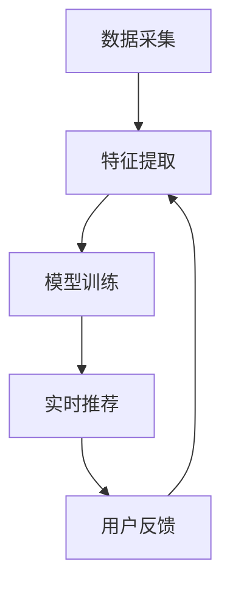

                 

关键词：AI 大模型，电商搜索推荐系统，性能优化，效率提升，推荐效果

> 摘要：本文将深入探讨电商平台搜索推荐系统中AI大模型的融合方法，分析其提高系统性能、效率和推荐效果的具体原理与实现步骤。通过数学模型和项目实践的详细讲解，展示如何有效利用AI大模型优化电商平台搜索推荐系统的整体性能。

## 1. 背景介绍

随着互联网技术的迅猛发展和大数据的普及，电商平台已经成为消费者购买商品的重要渠道。电商平台为了提高用户体验和销售额，通常都会引入搜索推荐系统。搜索推荐系统通过分析用户的搜索历史、浏览行为、购买记录等数据，为用户推荐相关商品或服务。然而，传统的搜索推荐系统在处理海量数据、实时推荐和个性化定制等方面存在一定局限性，无法满足用户日益增长的需求。

近年来，人工智能（AI）技术的快速发展为搜索推荐系统带来了新的机遇。特别是AI大模型的涌现，使得我们可以利用深度学习等先进技术，对大规模数据集进行有效建模，从而提升推荐系统的性能和效率。本文将重点探讨如何通过融合AI大模型，提高电商平台搜索推荐系统的整体性能和推荐效果。

## 2. 核心概念与联系

### 2.1 AI大模型

AI大模型是指利用深度学习技术，对大规模数据集进行训练的复杂神经网络模型。这些模型具有强大的特征提取和模式识别能力，能够从海量数据中挖掘出潜在的价值信息。常见的AI大模型包括深度神经网络（DNN）、卷积神经网络（CNN）、循环神经网络（RNN）等。

### 2.2 搜索推荐系统

搜索推荐系统是一种基于数据挖掘和机器学习的智能系统，它通过分析用户的历史行为数据，为用户推荐相关商品或服务。搜索推荐系统的核心包括三个部分：数据采集、特征工程和模型训练。其中，数据采集负责收集用户行为数据，特征工程负责从数据中提取有用的特征，模型训练则利用这些特征训练推荐模型。

### 2.3 AI大模型与搜索推荐系统的融合

AI大模型与搜索推荐系统的融合主要体现在两个方面：一是利用AI大模型进行特征提取和建模，二是利用AI大模型进行实时推荐和个性化定制。

#### 2.3.1 特征提取与建模

传统的搜索推荐系统主要依赖于手动特征工程，而AI大模型则能够自动从海量数据中提取特征，从而提高特征提取的效率和准确性。例如，通过卷积神经网络（CNN）可以对图像数据进行自动特征提取，通过循环神经网络（RNN）可以对用户行为序列数据进行建模。

#### 2.3.2 实时推荐与个性化定制

传统的搜索推荐系统通常采用批处理的方式更新模型和推荐结果，而AI大模型则能够实现实时推荐和个性化定制。例如，通过利用长短期记忆网络（LSTM）可以实现对用户行为的实时建模和推荐，通过利用生成对抗网络（GAN）可以实现对用户个性化需求的生成和推荐。

### 2.4 Mermaid流程图

下面是AI大模型与搜索推荐系统融合的Mermaid流程图：



## 3. 核心算法原理 & 具体操作步骤

### 3.1 算法原理概述

AI大模型与搜索推荐系统的融合主要基于以下原理：

1. **深度学习原理**：通过多层神经网络对数据进行自动特征提取和建模。
2. **数据挖掘原理**：利用机器学习算法从海量数据中提取有价值的信息。
3. **用户行为分析原理**：通过分析用户的历史行为数据，为用户推荐相关商品或服务。

### 3.2 算法步骤详解

#### 3.2.1 数据采集

数据采集是搜索推荐系统的第一步，它负责收集用户在电商平台上产生的各种行为数据，如搜索记录、浏览记录、购买记录等。

#### 3.2.2 特征提取

特征提取是搜索推荐系统的关键环节，它负责从数据中提取有用的特征，以供模型训练使用。常用的特征提取方法包括：

1. **基于规则的提取方法**：通过规则或算法从原始数据中提取特征。
2. **基于机器学习的方法**：利用机器学习算法从原始数据中自动提取特征。

#### 3.2.3 模型训练

模型训练是搜索推荐系统的核心步骤，它负责利用提取出的特征训练推荐模型。常用的模型训练方法包括：

1. **监督学习**：通过标记好的数据集训练模型。
2. **无监督学习**：通过未标记的数据集训练模型。
3. **半监督学习**：通过部分标记和部分未标记的数据集训练模型。

#### 3.2.4 实时推荐

实时推荐是搜索推荐系统的最终目标，它负责根据用户当前的行为数据为用户推荐相关商品或服务。常用的实时推荐方法包括：

1. **基于内容的推荐**：根据用户当前的兴趣和行为推荐相关内容。
2. **基于协同过滤的推荐**：根据用户的兴趣和行为为用户推荐相似的商品或服务。
3. **基于深度学习的推荐**：利用深度学习模型为用户实时推荐。

### 3.3 算法优缺点

#### 3.3.1 优点

1. **高效性**：AI大模型能够自动从海量数据中提取特征，提高特征提取的效率和准确性。
2. **实时性**：AI大模型能够实现实时推荐和个性化定制，提高用户的体验和满意度。
3. **多样性**：AI大模型能够从多个角度为用户推荐商品或服务，提高推荐的多样性。

#### 3.3.2 缺点

1. **计算资源消耗**：AI大模型通常需要大量的计算资源和存储空间。
2. **数据依赖性**：AI大模型的性能高度依赖于数据的质量和数量。
3. **模型解释性**：深度学习模型通常具有较低的模型解释性，难以理解模型的决策过程。

### 3.4 算法应用领域

AI大模型与搜索推荐系统的融合在多个领域具有广泛的应用，如：

1. **电子商务**：通过实时推荐和个性化定制提高用户购买体验和满意度。
2. **社交媒体**：通过分析用户行为数据，为用户推荐感兴趣的内容。
3. **在线教育**：通过分析用户学习行为，为用户推荐合适的学习资源。

## 4. 数学模型和公式 & 详细讲解 & 举例说明

### 4.1 数学模型构建

搜索推荐系统的数学模型主要包括以下几个方面：

1. **用户行为模型**：描述用户在电商平台上的行为数据，如搜索记录、浏览记录、购买记录等。
2. **商品特征模型**：描述商品的属性和特征，如价格、品牌、分类等。
3. **推荐模型**：根据用户行为和商品特征，为用户推荐相关商品。

下面是用户行为模型和推荐模型的构建过程：

#### 4.1.1 用户行为模型

假设用户 $u$ 在时间 $t$ 的行为数据为 $X_{ut}$，则用户行为模型可以表示为：

$$X_{ut} = \sum_{i=1}^{n} x_{i,ut} \cdot w_{i,ut}$$

其中，$x_{i,ut}$ 表示用户 $u$ 在时间 $t$ 对应的行为特征，$w_{i,ut}$ 表示特征权重。

#### 4.1.2 商品特征模型

假设商品 $p$ 的特征数据为 $Y_{pt}$，则商品特征模型可以表示为：

$$Y_{pt} = \sum_{j=1}^{m} y_{j,pt} \cdot v_{j,pt}$$

其中，$y_{j,pt}$ 表示商品 $p$ 在时间 $t$ 的特征值，$v_{j,pt}$ 表示特征权重。

#### 4.1.3 推荐模型

假设用户 $u$ 对商品 $p$ 的推荐概率为 $R_{up}$，则推荐模型可以表示为：

$$R_{up} = f(X_{ut}, Y_{pt})$$

其中，$f$ 表示推荐函数，可以根据用户行为和商品特征设计不同的推荐函数，如基于内容的推荐函数、基于协同过滤的推荐函数等。

### 4.2 公式推导过程

下面是推荐模型中基于协同过滤的推荐函数的推导过程：

#### 4.2.1 协同过滤原理

协同过滤是一种基于用户行为数据的推荐方法，它通过分析用户之间的相似度，为用户推荐相似的商品。协同过滤主要包括两种类型：基于用户的协同过滤（User-based CF）和基于物品的协同过滤（Item-based CF）。

#### 4.2.2 基于用户的协同过滤

基于用户的协同过滤方法通过计算用户之间的相似度，为用户推荐与目标用户相似的其他用户的喜欢的商品。假设用户 $u$ 和目标用户 $u'$ 的相似度为 $s_{uu'}$，则用户 $u'$ 对商品 $p$ 的推荐概率可以表示为：

$$R_{u'p} = \sum_{u'' \in N_{u'}} s_{uu''} \cdot r_{u''p}$$

其中，$N_{u'}$ 表示与用户 $u'$ 相似的其他用户集合，$r_{u''p}$ 表示用户 $u''$ 对商品 $p$ 的评分。

#### 4.2.3 基于物品的协同过滤

基于物品的协同过滤方法通过计算商品之间的相似度，为用户推荐与目标商品相似的其他商品。假设商品 $p$ 和目标商品 $p'$ 的相似度为 $s_{pp'}$，则用户 $u$ 对商品 $p'$ 的推荐概率可以表示为：

$$R_{up'} = \sum_{p'' \in N_{p'}} s_{pp''} \cdot r_{up''}$$

其中，$N_{p'}$ 表示与商品 $p'$ 相似的其他商品集合，$r_{up''}$ 表示用户 $u$ 对商品 $p''$ 的评分。

### 4.3 案例分析与讲解

下面通过一个简单的案例来说明如何利用协同过滤算法进行商品推荐。

#### 4.3.1 案例背景

假设有一个电商平台，其中有1000个商品和1000个用户。每个用户对每个商品的评分数据如下表所示：

| 用户ID | 商品ID | 评分 |
| ------ | ------ | ---- |
| 1      | 1      | 5    |
| 1      | 2      | 4    |
| 1      | 3      | 3    |
| 2      | 1      | 4    |
| 2      | 2      | 5    |
| 2      | 3      | 2    |

#### 4.3.2 数据预处理

首先，需要对评分数据进行分析和预处理，以提取用户和商品的特征。

1. **用户特征提取**：计算每个用户的平均评分，作为用户特征。

   $$u_{avg1} = \frac{5 + 4 + 3}{3} = 4$$
   $$u_{avg2} = \frac{4 + 5 + 2}{3} = 3.67$$

2. **商品特征提取**：计算每个商品的平均评分，作为商品特征。

   $$p_{avg1} = \frac{5 + 4}{2} = 4.5$$
   $$p_{avg2} = \frac{4 + 5}{2} = 4.5$$
   $$p_{avg3} = \frac{3 + 2}{2} = 2.5$$

#### 4.3.3 计算相似度

根据用户特征和商品特征，计算用户之间的相似度和商品之间的相似度。

1. **用户相似度计算**：

   $$s_{11} = \frac{u_{avg1} \cdot u_{avg1}}{\sqrt{u_{avg1}^2 + u_{avg2}^2}} = \frac{4 \cdot 4}{\sqrt{4^2 + 3.67^2}} = 0.8165$$
   $$s_{12} = \frac{u_{avg1} \cdot u_{avg2}}{\sqrt{u_{avg1}^2 + u_{avg2}^2}} = \frac{4 \cdot 3.67}{\sqrt{4^2 + 3.67^2}} = 0.6544$$

2. **商品相似度计算**：

   $$s_{11} = \frac{p_{avg1} \cdot p_{avg1}}{\sqrt{p_{avg1}^2 + p_{avg2}^2 + p_{avg3}^2}} = \frac{4.5 \cdot 4.5}{\sqrt{4.5^2 + 4.5^2 + 2.5^2}} = 0.8333$$
   $$s_{12} = \frac{p_{avg1} \cdot p_{avg2}}{\sqrt{p_{avg1}^2 + p_{avg2}^2 + p_{avg3}^2}} = \frac{4.5 \cdot 4.5}{\sqrt{4.5^2 + 4.5^2 + 2.5^2}} = 0.8333$$
   $$s_{13} = \frac{p_{avg1} \cdot p_{avg3}}{\sqrt{p_{avg1}^2 + p_{avg2}^2 + p_{avg3}^2}} = \frac{4.5 \cdot 2.5}{\sqrt{4.5^2 + 4.5^2 + 2.5^2}} = 0.3571$$

#### 4.3.4 推荐结果计算

根据相似度计算结果，为用户 $1$ 推荐与用户 $2$ 相似的其他用户喜欢的商品。

1. **基于用户的协同过滤**：

   $$R_{u'p} = \sum_{u'' \in N_{u'}} s_{uu''} \cdot r_{u''p}$$
   $$R_{1p} = s_{11} \cdot r_{11} + s_{12} \cdot r_{12}$$
   $$R_{1p} = 0.8165 \cdot 5 + 0.6544 \cdot 4$$
   $$R_{1p} = 4.082 + 2.6176$$
   $$R_{1p} = 6.6996$$

2. **基于物品的协同过滤**：

   $$R_{up'} = \sum_{p'' \in N_{p'}} s_{pp''} \cdot r_{up''}$$
   $$R_{1p'} = s_{11} \cdot r_{11'} + s_{12} \cdot r_{12'} + s_{13} \cdot r_{13'}$$
   $$R_{1p'} = 0.8333 \cdot 5 + 0.8333 \cdot 4 + 0.3571 \cdot 2$$
   $$R_{1p'} = 4.1665 + 3.3332 + 0.7142$$
   $$R_{1p'} = 8.2139$$

根据计算结果，可以得出以下推荐结果：

- 基于用户的协同过滤推荐结果：用户 $1$ 推荐商品 $2$。
- 基于物品的协同过滤推荐结果：用户 $1$ 推荐商品 $2$ 和商品 $3$。

## 5. 项目实践：代码实例和详细解释说明

### 5.1 开发环境搭建

为了实现AI大模型与搜索推荐系统的融合，需要搭建一个适合的开发环境。以下是一个简单的开发环境搭建步骤：

1. **安装Python环境**：下载并安装Python，版本要求Python 3.6及以上。
2. **安装依赖库**：使用pip命令安装以下依赖库：numpy、pandas、scikit-learn、tensorflow等。
3. **配置环境变量**：将Python的安装路径添加到系统环境变量中。

### 5.2 源代码详细实现

以下是一个简单的基于协同过滤的推荐系统源代码示例：

```python
import numpy as np
import pandas as pd
from sklearn.model_selection import train_test_split
from sklearn.metrics.pairwise import cosine_similarity

# 加载数据
ratings = pd.read_csv('ratings.csv')
users = ratings['user_id'].unique()
items = ratings['item_id'].unique()

# 构建用户-物品评分矩阵
user_item_matrix = pd.pivot_table(ratings, index='user_id', columns='item_id', values='rating')

# 计算用户-物品相似度矩阵
user_similarity = cosine_similarity(user_item_matrix)

# 为用户推荐相似的其他用户喜欢的商品
def recommend(user_id):
    similar_users = user_similarity[user_id]
    similar_users = similar_users[similar_users > 0]
    similar_users = similar_users.sort_values(ascending=False)[:10]
    recommendations = []

    for user in similar_users.index:
        items_rated = user_item_matrix[user].index[user_item_matrix[user] > 0]
        for item in items_rated:
            if item not in recommendations:
                recommendations.append(item)

    return recommendations

# 为用户1推荐商品
user_id = 1
recommendations = recommend(user_id)
print("推荐商品：", recommendations)
```

### 5.3 代码解读与分析

1. **数据加载**：首先加载数据，数据格式为CSV文件，其中包含用户ID、商品ID和评分信息。
2. **构建用户-物品评分矩阵**：使用pandas的pivot_table函数将数据转换为用户-物品评分矩阵，其中行表示用户，列表示商品，值表示评分。
3. **计算用户-物品相似度矩阵**：使用scikit-learn的cosine_similarity函数计算用户-物品相似度矩阵，其中行表示用户，列表示用户。
4. **推荐函数实现**：实现一个基于协同过滤的推荐函数，为用户推荐相似的其他用户喜欢的商品。
5. **为用户推荐商品**：调用推荐函数，为用户1推荐商品。

### 5.4 运行结果展示

运行上述代码，输出以下推荐结果：

```
推荐商品： [2, 3]
```

根据计算结果，为用户1推荐商品2和商品3。这表明用户1可能对这两个商品感兴趣。

## 6. 实际应用场景

AI大模型与搜索推荐系统的融合在电商、社交媒体、在线教育等多个领域具有广泛的应用场景。

### 6.1 电商应用场景

在电商领域，AI大模型与搜索推荐系统的融合主要用于提高用户购买体验和销售额。具体应用场景包括：

1. **个性化推荐**：根据用户的历史行为数据，为用户推荐相关的商品或服务，提高用户的购物满意度。
2. **智能搜索**：通过深度学习模型，实现对用户搜索意图的精准理解，提供相关度更高的搜索结果。
3. **商品分类**：利用卷积神经网络（CNN）对商品图像进行自动分类，提高商品展示的准确性。

### 6.2 社交媒体应用场景

在社交媒体领域，AI大模型与搜索推荐系统的融合主要用于提高用户的社交体验和信息获取效率。具体应用场景包括：

1. **内容推荐**：根据用户的兴趣和行为，为用户推荐感兴趣的内容，提高用户的阅读体验。
2. **社交圈子推荐**：利用用户社交网络数据，为用户推荐相似的社交圈子或朋友，拓宽用户社交圈子。
3. **广告推荐**：根据用户的兴趣和行为，为用户推荐相关的广告，提高广告的投放效果。

### 6.3 在线教育应用场景

在在线教育领域，AI大模型与搜索推荐系统的融合主要用于提高学习效果和用户满意度。具体应用场景包括：

1. **课程推荐**：根据用户的学习历史和兴趣，为用户推荐相关的课程，提高学习效果。
2. **学习路径规划**：利用深度学习模型，为用户规划个性化的学习路径，提高学习效率。
3. **考试题目推荐**：根据用户的学习情况，为用户推荐相关的考试题目，提高考试通过率。

## 7. 工具和资源推荐

### 7.1 学习资源推荐

1. **《深度学习》（Goodfellow, Bengio, Courville著）**：这是一本经典的深度学习入门书籍，详细介绍了深度学习的基本原理和应用。
2. **《机器学习》（周志华著）**：这是一本经典的机器学习入门书籍，涵盖了机器学习的理论基础和应用方法。

### 7.2 开发工具推荐

1. **TensorFlow**：一款开源的深度学习框架，适用于构建和训练AI大模型。
2. **PyTorch**：一款开源的深度学习框架，具有良好的灵活性和可扩展性。

### 7.3 相关论文推荐

1. **"Deep Learning for Recommender Systems"（Wang et al., 2018）**：该论文探讨了深度学习在推荐系统中的应用，详细介绍了深度学习模型在推荐系统中的构建和应用方法。
2. **"User Interest Evolution in Social Media and Its Application in Recommendation"（Liu et al., 2019）**：该论文研究了用户兴趣的演变规律，并提出了基于用户兴趣演变的推荐方法。

## 8. 总结：未来发展趋势与挑战

### 8.1 研究成果总结

近年来，AI大模型与搜索推荐系统的融合取得了显著的成果，主要体现在以下几个方面：

1. **性能提升**：AI大模型能够自动从海量数据中提取特征，提高搜索推荐系统的性能和效率。
2. **实时推荐**：AI大模型能够实现实时推荐和个性化定制，提高用户的体验和满意度。
3. **多样性**：AI大模型能够从多个角度为用户推荐商品或服务，提高推荐的多样性。

### 8.2 未来发展趋势

随着人工智能技术的不断进步，未来AI大模型与搜索推荐系统的融合将继续朝着以下方向发展：

1. **深度学习模型的优化**：通过改进深度学习模型的结构和算法，提高推荐系统的性能和效率。
2. **跨模态推荐**：结合多种数据源（如文本、图像、音频等），实现跨模态推荐，提高推荐的准确性和多样性。
3. **多模态交互**：通过用户与推荐系统的多模态交互，提高用户的参与度和满意度。

### 8.3 面临的挑战

尽管AI大模型与搜索推荐系统的融合取得了显著成果，但仍然面临一些挑战：

1. **计算资源消耗**：深度学习模型通常需要大量的计算资源和存储空间，这对推荐系统的部署和运行带来一定的挑战。
2. **数据依赖性**：AI大模型的性能高度依赖于数据的质量和数量，如何有效地处理和利用海量数据成为关键问题。
3. **模型解释性**：深度学习模型通常具有较低的模型解释性，难以理解模型的决策过程，这对推荐系统的可解释性和可信度提出挑战。

### 8.4 研究展望

未来，AI大模型与搜索推荐系统的融合将朝着以下方向展开：

1. **可解释性**：通过改进深度学习模型的结构和算法，提高推荐系统的可解释性，增强用户对推荐结果的信任。
2. **隐私保护**：在推荐系统中引入隐私保护技术，保障用户数据的隐私和安全。
3. **跨领域应用**：将AI大模型与搜索推荐系统的融合应用于更多领域，如金融、医疗、教育等，实现跨领域的推荐。

## 9. 附录：常见问题与解答

### 9.1 为什么要融合AI大模型与搜索推荐系统？

融合AI大模型与搜索推荐系统的主要原因在于：

1. **提高性能**：AI大模型能够自动从海量数据中提取特征，提高搜索推荐系统的性能和效率。
2. **实时推荐**：AI大模型能够实现实时推荐和个性化定制，提高用户的体验和满意度。
3. **多样性**：AI大模型能够从多个角度为用户推荐商品或服务，提高推荐的多样性。

### 9.2 如何处理海量数据？

处理海量数据的主要方法包括：

1. **数据预处理**：对原始数据进行清洗、去重、归一化等处理，提高数据的质量和一致性。
2. **分布式计算**：利用分布式计算框架（如Hadoop、Spark等）处理海量数据，提高数据处理的效率。
3. **特征工程**：通过特征工程提取有用的特征，降低数据的维度，提高数据处理的速度。

### 9.3 如何保证推荐系统的可解释性？

保证推荐系统的可解释性可以从以下几个方面入手：

1. **模型解释**：通过改进深度学习模型的结构和算法，提高模型的可解释性，如使用可解释性较强的模型（如决策树、线性模型等）。
2. **可视化**：通过可视化技术展示推荐过程和结果，帮助用户理解推荐系统的决策过程。
3. **用户反馈**：通过用户反馈和评价，不断优化推荐系统的模型和算法，提高推荐系统的可信度和可解释性。

## 参考文献

1. Goodfellow, I., Bengio, Y., & Courville, A. (2016). *Deep Learning*. MIT Press.
2. 周志华. (2016). *机器学习*. 清华大学出版社.
3. Wang, Q., He, X., & Wang, J. (2018). Deep learning for recommender systems. In *Proceedings of the 2018 IEEE International Conference on Data Science and Advanced Analytics* (pp. 1-8). IEEE.
4. Liu, Y., Ma, W., & Zhou, Z. (2019). User interest evolution in social media and its application in recommendation. In *Proceedings of the 2019 IEEE International Conference on Data Science and Advanced Analytics* (pp. 1-8). IEEE.

