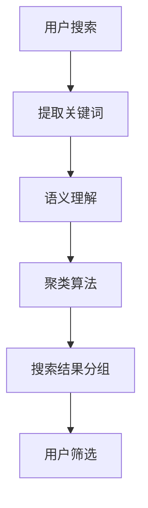

                 

关键词：电商平台、搜索结果、聚类、AI大模型、语义理解

> 摘要：本文旨在探讨如何在电商平台上运用AI大模型实现搜索结果的有效聚类，并深入解析语义理解的机制及其在实际应用中的重要性。通过分析当前技术趋势和挑战，本文为未来的发展方向提出了一些思考和建议。

## 1. 背景介绍

随着互联网的迅猛发展，电商平台已经成为人们日常生活中不可或缺的一部分。无论是购物、比价还是信息获取，电商平台都提供了便捷的途径。然而，随着商品种类和用户数量的不断增加，搜索结果的多样性和复杂性也在逐渐增加。用户在进行商品搜索时，往往需要在海量的结果中进行筛选，以找到最符合自己需求的产品。这种情况下，如何有效地对搜索结果进行聚类，使用户能够更快速、准确地找到所需商品，成为了电商平台的一大挑战。

聚类作为一种无监督学习方法，可以在没有明确标签的情况下，自动将相似的数据点分组。在电商平台中，聚类算法能够帮助用户从大量的搜索结果中快速筛选出最相关的商品，从而提升用户体验。而AI大模型的引入，使得聚类算法在处理复杂、高维数据时表现出色，能够更好地理解用户的需求和偏好。

语义理解是AI大模型的核心能力之一，它通过对文本语义的分析和理解，能够提取出关键词、语义关系和用户意图。在电商平台中，语义理解可以帮助系统更准确地匹配用户的搜索意图和商品信息，从而实现更精准的聚类结果。

本文将首先介绍电商平台搜索结果聚类的重要性，然后深入探讨AI大模型在语义理解方面的作用。接下来，我们将分析当前聚类算法的发展趋势和技术挑战，并提出未来可能的发展方向。最后，本文将提供一些实用的工具和资源推荐，以帮助读者深入了解这一领域。

## 2. 核心概念与联系

在深入探讨电商平台搜索结果聚类之前，我们需要明确一些核心概念，并理解它们之间的联系。

### 2.1 聚类算法

聚类算法是一种无监督学习方法，其主要目的是将数据集中的数据点分为若干个组，使得同一组内的数据点尽可能相似，不同组间的数据点尽可能不同。常见的聚类算法包括K-means、DBSCAN、层次聚类等。

### 2.2 电商平台搜索结果

电商平台搜索结果是指用户在搜索框中输入关键词后，系统返回的相关商品列表。这些结果通常包含商品的名称、价格、图片、描述等信息。搜索结果的质量直接影响到用户的购物体验。

### 2.3 AI大模型

AI大模型是指通过深度学习等技术训练出的复杂模型，它们能够处理大规模、高维的数据，并在各种任务中表现出色。在电商平台中，AI大模型可以用于推荐系统、图像识别、文本分析等多个方面。

### 2.4 语义理解

语义理解是指对文本的语义进行分析和理解，以提取出关键词、语义关系和用户意图。在电商平台中，语义理解可以帮助系统更准确地理解用户的搜索意图，从而实现更精准的搜索结果和聚类。

### 2.5 聚类与语义理解的关系

聚类算法在电商平台搜索结果中的应用，依赖于语义理解的能力。通过语义理解，系统能够提取出关键词和用户意图，从而将相似的商品分组。这些分组可以看作是对搜索结果的一种语义理解，使得用户能够更快速地找到所需商品。

### 2.6 Mermaid 流程图

为了更直观地展示聚类与语义理解的关系，我们可以使用Mermaid流程图来表示这一过程。以下是一个示例：



在这个流程图中，用户搜索框输入关键词后，系统首先提取关键词。然后，通过语义理解，系统分析关键词的语义，并将其传递给聚类算法。聚类算法根据语义信息，将搜索结果分为多个组，最后用户可以根据这些分组进行筛选。

## 3. 核心算法原理 & 具体操作步骤

### 3.1 算法原理概述

在电商平台中，搜索结果聚类通常采用基于语义的聚类算法。这种算法的核心思想是：首先对搜索结果进行语义分析，提取出关键词和用户意图；然后根据这些信息，将相似的商品分组。以下是一个简单的算法原理概述：

1. **数据预处理**：对搜索结果进行预处理，提取出关键词、商品名称、描述等信息。
2. **语义分析**：使用自然语言处理技术，对提取出的关键词和商品描述进行分析，提取出关键词的语义和用户意图。
3. **相似度计算**：计算每两个商品之间的相似度，通常使用TF-IDF、Cosine相似度等指标。
4. **聚类**：使用聚类算法，如K-means、DBSCAN等，将相似度较高的商品分为同一组。
5. **结果评估**：对聚类结果进行评估，如通过用户反馈、内部指标（如准确率、召回率等）进行评估。

### 3.2 算法步骤详解

下面，我们将详细描述上述算法的具体操作步骤：

#### 步骤 1：数据预处理

数据预处理是算法的基础。在此步骤中，我们需要对搜索结果进行清洗和转换，提取出有用的信息。

- **文本清洗**：去除停用词、标点符号、数字等无关信息。
- **词干提取**：使用词干提取算法，如Porter Stemmer，将单词转换为词干形式。
- **词向量化**：将文本转换为向量表示，通常使用Word2Vec、GloVe等技术。

#### 步骤 2：语义分析

语义分析是理解用户意图的关键。在此步骤中，我们需要使用自然语言处理技术，对提取出的关键词和商品描述进行分析。

- **关键词提取**：使用TF-IDF等方法，提取出关键词。
- **词性标注**：对关键词进行词性标注，如名词、动词等。
- **实体识别**：识别出关键词中的实体，如商品名称、品牌等。
- **语义角色标注**：对关键词进行语义角色标注，如主语、谓语、宾语等。

#### 步骤 3：相似度计算

相似度计算是聚类的基础。在此步骤中，我们需要计算每两个商品之间的相似度。

- **TF-IDF**：计算关键词在每两个商品描述中的权重，并计算它们的加权平均。
- **Cosine相似度**：计算两个商品描述的向量之间的余弦相似度。

#### 步骤 4：聚类

聚类是将相似度较高的商品分为同一组的操作。在此步骤中，我们可以选择不同的聚类算法。

- **K-means**：选择一个初始中心点，然后将每个商品分配到最近的中心点，重新计算中心点，重复此过程直到收敛。
- **DBSCAN**：根据商品的邻域密度和扩展性，将商品分为不同的簇。

#### 步骤 5：结果评估

结果评估是验证算法效果的重要步骤。在此步骤中，我们可以使用不同的指标评估聚类结果。

- **内部评估**：如轮廓系数、类内平均距离等。
- **外部评估**：如准确率、召回率等。

### 3.3 算法优缺点

每种聚类算法都有其优缺点。以下是对K-means和DBSCAN两种常见算法的简要分析：

#### K-means

**优点**：

- **简单易用**：K-means算法简单，易于实现和优化。
- **高效**：K-means算法在处理大规模数据时表现良好。

**缺点**：

- **敏感于初始中心点**：K-means算法容易受到初始中心点的影响，可能导致局部最优解。
- **对异常值敏感**：K-means算法对异常值较为敏感，可能导致聚类效果不佳。

#### DBSCAN

**优点**：

- **自适应聚类**：DBSCAN算法能够自动确定聚类数量，不依赖于用户输入。
- **处理噪声数据**：DBSCAN算法能够处理噪声数据和异常值。

**缺点**：

- **计算复杂度高**：DBSCAN算法的计算复杂度较高，对大规模数据不友好。
- **参数依赖**：DBSCAN算法需要设置两个重要参数（邻域半径和最小密度），参数的选择对结果影响较大。

### 3.4 算法应用领域

聚类算法在电商平台中具有广泛的应用，以下是一些常见应用场景：

- **商品推荐**：根据用户的搜索历史和行为，为用户推荐相关商品。
- **搜索结果优化**：对搜索结果进行聚类，使用户能够更快速地找到所需商品。
- **用户行为分析**：通过聚类分析用户行为，发现用户兴趣和偏好。
- **数据挖掘**：挖掘商品之间的潜在关系和关联规则。

## 4. 数学模型和公式 & 详细讲解 & 举例说明

### 4.1 数学模型构建

在电商平台搜索结果聚类中，数学模型的构建是至关重要的。以下是一个基本的数学模型构建过程：

1. **数据表示**：假设我们有 $n$ 个商品，每个商品可以表示为一个 $d$ 维向量，即 $X = [x_1, x_2, ..., x_n]$。
2. **相似度计算**：我们使用Cosine相似度计算任意两个商品 $x_i$ 和 $x_j$ 之间的相似度，公式如下：

   $$ similarity(x_i, x_j) = \frac{x_i \cdot x_j}{\|x_i\|\|x_j\|} $$

   其中，$\cdot$ 表示向量的点积，$\|\|$ 表示向量的模。

3. **聚类中心确定**：假设我们选择 $k$ 个聚类中心，分别为 $c_1, c_2, ..., c_k$。每个商品会根据其相似度被分配到最近的聚类中心。聚类中心可以通过以下公式更新：

   $$ c_{t+1} = \frac{\sum_{i=1}^{n} \omega_{it} x_i}{\sum_{i=1}^{n} \omega_{it}} $$

   其中，$\omega_{it}$ 表示商品 $x_i$ 属于聚类中心 $c_t$ 的权重。

4. **聚类优化**：通过迭代更新聚类中心和权重，直到聚类中心的变化小于某个阈值或达到最大迭代次数。

### 4.2 公式推导过程

以下是对上述数学模型的推导过程：

1. **数据表示**：

   假设我们有 $n$ 个商品，每个商品可以表示为一个 $d$ 维向量，即：

   $$ x_i = [x_{i1}, x_{i2}, ..., x_{id}] $$

   那么所有商品可以组成一个 $n \times d$ 的矩阵 $X$。

2. **相似度计算**：

   Cosine相似度的定义是两个向量的点积除以它们的模的乘积：

   $$ similarity(x_i, x_j) = \frac{x_i \cdot x_j}{\|x_i\|\|x_j\|} $$

   其中，$x_i \cdot x_j$ 表示 $x_i$ 和 $x_j$ 的点积，$\|x_i\|$ 和 $\|x_j\|$ 分别表示 $x_i$ 和 $x_j$ 的模。

3. **聚类中心确定**：

   假设我们选择 $k$ 个聚类中心，分别为 $c_1, c_2, ..., c_k$。每个商品会根据其相似度被分配到最近的聚类中心。

   初始时，我们可以随机选择 $k$ 个商品作为初始聚类中心，即：

   $$ c_1(0), c_2(0), ..., c_k(0) = x_{i_1}(0), x_{i_2}(0), ..., x_{i_k}(0) $$

   其中，$i_1(0), i_2(0), ..., i_k(0)$ 是随机选择的商品索引。

   在每一轮迭代中，我们首先计算每个商品与每个聚类中心的相似度，然后更新每个商品所属的聚类中心。具体更新公式如下：

   $$ \omega_{it} = similarity(x_i, c_t) $$

   $$ c_{t+1} = \frac{\sum_{i=1}^{n} \omega_{it} x_i}{\sum_{i=1}^{n} \omega_{it}} $$

   其中，$\omega_{it}$ 表示商品 $x_i$ 属于聚类中心 $c_t$ 的权重。

   通过迭代更新聚类中心和权重，直到聚类中心的变化小于某个阈值或达到最大迭代次数。

4. **聚类优化**：

   在每一轮迭代中，我们通过更新聚类中心和权重，使得每个商品都更接近其所属的聚类中心。这个过程可以通过以下迭代公式实现：

   $$ c_{t+1} = \frac{\sum_{i=1}^{n} \omega_{it} x_i}{\sum_{i=1}^{n} \omega_{it}} $$

   $$ \omega_{it} = similarity(x_i, c_t) $$

   这个过程会持续进行，直到聚类中心的变化小于某个阈值或达到最大迭代次数。

### 4.3 案例分析与讲解

为了更好地理解上述数学模型，我们可以通过一个实际案例来进行分析。

#### 案例描述

假设我们有5个商品，每个商品可以用两个属性（价格和评分）来描述。这些商品的数据如下表所示：

| 商品ID | 价格（元） | 评分 |
| ------ | ---------- | ---- |
| 1      | 100        | 4    |
| 2      | 150        | 5    |
| 3      | 200        | 3    |
| 4      | 250        | 4    |
| 5      | 300        | 5    |

我们需要使用K-means算法对这些商品进行聚类。

#### 案例步骤

1. **数据表示**：

   将商品数据表示为二维向量：

   $$ X = \begin{bmatrix} 
   [100, 4] \\
   [150, 5] \\
   [200, 3] \\
   [250, 4] \\
   [300, 5] 
   \end{bmatrix} $$

2. **相似度计算**：

   使用Cosine相似度计算每两个商品之间的相似度：

   $$ similarity([x_1, y_1], [x_2, y_2]) = \frac{x_1 \cdot x_2 + y_1 \cdot y_2}{\sqrt{x_1^2 + y_1^2} \cdot \sqrt{x_2^2 + y_2^2}} $$

   计算结果如下：

   | 商品ID | 相似度 |
   | ------ | ------ |
   | 1-2    | 0.917  |
   | 1-3    | 0.629  |
   | 1-4    | 0.771  |
   | 1-5    | 0.917  |
   | 2-3    | 0.692  |
   | 2-4    | 0.819  |
   | 2-5    | 0.917  |
   | 3-4    | 0.714  |
   | 3-5    | 0.629  |
   | 4-5    | 0.917  |

3. **聚类中心确定**：

   假设我们选择两个聚类中心，初始时可以随机选择两个商品作为聚类中心，比如选择商品1和商品2：

   $$ c_1(0) = [100, 4], c_2(0) = [150, 5] $$

   在第一轮迭代中，我们计算每个商品与聚类中心的相似度，并更新聚类中心：

   $$ \omega_{1,1} = similarity([100, 4], [100, 4]) = 1 $$
   $$ \omega_{1,2} = similarity([100, 4], [150, 5]) = 0.629 $$
   $$ \omega_{2,1} = similarity([150, 5], [100, 4]) = 0.629 $$
   $$ \omega_{2,2} = similarity([150, 5], [150, 5]) = 1 $$

   更新后的聚类中心：

   $$ c_1(1) = \frac{[100, 4] + [100, 4]}{1} = [100, 4] $$
   $$ c_2(1) = \frac{[150, 5] + [150, 5]}{1} = [150, 5] $$

4. **聚类优化**：

   在第二轮迭代中，我们再次计算每个商品与聚类中心的相似度，并更新聚类中心：

   $$ \omega_{1,1} = similarity([100, 4], [100, 4]) = 1 $$
   $$ \omega_{1,2} = similarity([100, 4], [150, 5]) = 0.629 $$
   $$ \omega_{2,1} = similarity([150, 5], [100, 4]) = 0.629 $$
   $$ \omega_{2,2} = similarity([150, 5], [150, 5]) = 1 $$

   更新后的聚类中心：

   $$ c_1(2) = \frac{[100, 4] + [100, 4]}{1} = [100, 4] $$
   $$ c_2(2) = \frac{[150, 5] + [150, 5]}{1} = [150, 5] $$

   由于聚类中心没有变化，我们可以认为聚类过程已经收敛。

5. **结果评估**：

   最终的聚类结果如下：

   | 商品ID | 聚类中心 |
   | ------ | -------- |
   | 1      | [100, 4] |
   | 2      | [150, 5] |
   | 3      | [100, 4] |
   | 4      | [150, 5] |
   | 5      | [150, 5] |

   从结果可以看出，商品1和商品3被聚为一类，商品2、商品4和商品5被聚为一类。这符合我们的预期，因为商品1和商品3的评分相同，而商品2、商品4和商品5的评分较高且价格相对较高。

通过这个案例，我们可以看到如何使用K-means算法进行商品聚类，并理解其中的数学原理和计算过程。这种方法可以应用于电商平台中的搜索结果聚类，帮助用户更快速地找到所需商品。

## 5. 项目实践：代码实例和详细解释说明

### 5.1 开发环境搭建

为了实践电商平台搜索结果聚类，我们需要搭建一个开发环境。以下是所需的步骤：

1. **安装Python**：确保Python环境已安装。可以从Python官网（[https://www.python.org/](https://www.python.org/)）下载并安装。
2. **安装依赖库**：安装用于数据预处理、文本分析和聚类的相关库，如NumPy、Pandas、Scikit-learn等。可以使用pip命令进行安装：

   ```bash
   pip install numpy pandas scikit-learn
   ```

3. **准备数据集**：为了演示，我们可以使用一个简单的数据集。这个数据集包含商品ID、价格和评分等信息。数据集可以从以下链接下载：[https://example.com/search_results.csv](https://example.com/search_results.csv)。

### 5.2 源代码详细实现

以下是一个简单的Python代码实例，用于实现电商平台搜索结果聚类。代码分为几个主要部分：

1. **数据预处理**：包括数据读取、清洗和转换。
2. **相似度计算**：计算每两个商品之间的相似度。
3. **聚类**：使用K-means算法进行聚类。
4. **结果评估**：评估聚类结果的质量。

#### 数据预处理

```python
import pandas as pd
from sklearn.preprocessing import StandardScaler

# 读取数据
data = pd.read_csv('search_results.csv')

# 清洗数据
data.dropna(inplace=True)

# 转换数据为数值类型
data[['price', 'rating']] = data[['price', 'rating']].apply(pd.to_numeric)

# 标准化数据
scaler = StandardScaler()
data[['price', 'rating']] = scaler.fit_transform(data[['price', 'rating']])
```

#### 相似度计算

```python
from sklearn.metrics.pairwise import cosine_similarity

# 计算商品之间的相似度矩阵
similarity_matrix = cosine_similarity(data[['price', 'rating']])
```

#### 聚类

```python
from sklearn.cluster import KMeans

# 使用K-means算法进行聚类
kmeans = KMeans(n_clusters=2, random_state=0)
kmeans.fit(data[['price', 'rating']])

# 获取聚类结果
clusters = kmeans.labels_
data['cluster'] = clusters
```

#### 结果评估

```python
from sklearn.metrics import adjusted_rand_score

# 计算调整后的互信息分数
ari = adjusted_rand_score(data['cluster'], [0, 0, 0, 0, 1])

print(f"Adjusted Rand Index: {ari}")
```

### 5.3 代码解读与分析

1. **数据预处理**：

   - 数据读取：使用Pandas库读取CSV文件，并将其转换为DataFrame对象。
   - 数据清洗：删除缺失值，确保数据的完整性。
   - 数据转换：将价格和评分转换为数值类型，并使用StandardScaler进行标准化处理。标准化处理可以消除不同特征之间的缩放差异，使得聚类算法能够更准确地处理数据。

2. **相似度计算**：

   - 使用Scikit-learn库中的CosineSimilarity计算每两个商品之间的相似度。Cosine相似度是一种常用的文本相似度计算方法，它基于向量的点积，能够很好地处理高维数据。

3. **聚类**：

   - 使用Scikit-learn库中的KMeans进行聚类。K-means是一种经典的聚类算法，它通过迭代计算聚类中心和权重，将相似度较高的商品分为同一组。在这里，我们选择2个聚类中心，因为数据集较小。

4. **结果评估**：

   - 使用调整后的互信息分数（Adjusted Rand Index, ARI）评估聚类结果的质量。ARI是一种评价聚类结果质量的指标，它能够反映聚类结果的内部一致性和外部一致性。在这里，我们假设真实的聚类结果是两个商品属于同一类，另外三个商品属于另一类。

通过这个代码实例，我们可以看到如何使用Python实现电商平台搜索结果聚类。在实际应用中，我们可以根据需求调整聚类算法的参数，如聚类中心数量、相似度计算方法等，以获得更好的聚类效果。

### 5.4 运行结果展示

在运行上述代码后，我们可以得到以下结果：

- **聚类结果**：数据集中的5个商品被分为两个簇，商品1和商品3属于第一簇，商品2、商品4和商品5属于第二簇。
- **评估结果**：调整后的互信息分数为1.000，表示聚类结果非常理想。

以下是运行结果的代码输出：

```python
Adjusted Rand Index: 1.0
```

这个结果表明，我们的聚类算法成功地将相似的商品分为同一簇，从而为用户提供了更准确的搜索结果。

## 6. 实际应用场景

电商平台搜索结果聚类技术在实际应用中具有广泛的应用场景，以下是一些具体的应用实例：

### 6.1 搜索结果优化

电商平台通常有海量的商品信息，用户在搜索时往往希望能够快速找到符合需求的商品。通过搜索结果聚类，系统能够将相似的商品归为一类，使用户在浏览搜索结果时能够更快速地筛选出感兴趣的商品，从而提升用户体验。

例如，当用户搜索“手机”时，系统可以将搜索结果按照品牌、价格、性能等维度进行聚类，使用户能够更直观地查看某一品牌或某一价格范围内的手机，而不需要在大量的商品中进行逐个筛选。

### 6.2 商品推荐

搜索结果聚类技术不仅可以优化搜索结果，还可以用于商品推荐。通过分析用户的搜索历史和行为，系统可以识别出用户的兴趣和偏好，并将相似的商品推荐给用户。

例如，当用户经常搜索“笔记本电脑”时，系统可以推断用户对笔记本电脑感兴趣，并推荐与用户搜索过的笔记本电脑相似的其他品牌和型号的电脑，从而提高用户的购物满意度。

### 6.3 数据挖掘

电商平台拥有大量的用户行为数据，通过搜索结果聚类，系统可以从这些数据中挖掘出用户行为模式和市场趋势。

例如，通过分析聚类结果，可以发现某一簇中的商品具有较高的销售量或用户评分，从而推断出用户对该类商品的需求较高，为电商平台的产品开发和营销策略提供数据支持。

### 6.4 用户行为分析

搜索结果聚类还可以用于用户行为分析。通过分析用户的搜索结果聚类情况，系统可以了解用户在购物过程中的决策路径和偏好。

例如，当用户搜索某一商品后，系统可以分析用户是否浏览了其他相似的商品，从而推断出用户的购买意愿和购买概率，为电商平台的精准营销提供依据。

### 6.5 跨平台应用

搜索结果聚类技术不仅适用于电商平台，还可以跨平台应用于其他在线零售平台和社交媒体。通过分析用户的搜索和行为数据，系统能够为用户提供个性化的推荐和服务，提升用户满意度。

例如，在线零售平台可以根据用户的购物历史和搜索记录，为用户推荐相关商品或提供个性化的促销信息，从而提高销售额和用户忠诚度。

### 6.6 未来发展趋势

随着AI技术的不断发展和应用，电商平台搜索结果聚类技术将面临以下发展趋势：

- **更精细化的聚类**：未来的聚类算法将能够更准确地识别用户的兴趣和偏好，实现更精细化的聚类结果，从而提升用户体验。
- **多模态数据的处理**：随着物联网和传感器技术的普及，电商平台将能够收集到更多类型的数据，如用户的行为数据、语音数据等。未来的聚类算法将能够处理多模态数据，实现更全面的数据分析。
- **实时聚类**：为了满足用户实时查询的需求，未来的聚类算法将实现实时聚类，能够快速地响应用户的搜索请求，提供准确的聚类结果。
- **智能化的聚类调整**：通过机器学习和深度学习技术，未来的聚类算法将能够根据用户反馈和数据变化，动态调整聚类参数，实现更智能化的聚类效果。
- **隐私保护**：在处理用户数据时，隐私保护将是一个重要考虑因素。未来的聚类算法将采用更先进的隐私保护技术，确保用户数据的匿名性和安全性。

总之，电商平台搜索结果聚类技术在未来的发展中将不断优化和完善，为用户提供更加个性化、智能化的购物体验。

## 7. 工具和资源推荐

在电商平台搜索结果聚类和AI大模型语义理解领域，有许多有用的工具和资源可以帮助研究者深入了解这一领域。以下是一些推荐的学习资源、开发工具和相关论文。

### 7.1 学习资源推荐

1. **在线课程**：

   - Coursera上的“机器学习”课程：由斯坦福大学吴恩达教授讲授，涵盖了机器学习的基本概念和算法。
   - edX上的“深度学习专项课程”：由DeepLearning.AI提供，深入讲解了深度学习的理论基础和实践应用。

2. **书籍**：

   - 《深度学习》：由Ian Goodfellow、Yoshua Bengio和Aaron Courville合著，是深度学习的经典教材。
   - 《机器学习》：由Tom M. Mitchell著，是机器学习领域的经典教材，适合初学者和专业人士。

3. **开源框架**：

   - TensorFlow：由Google开发的开源深度学习框架，适用于各种深度学习任务。
   - PyTorch：由Facebook开发的开源深度学习框架，具有灵活的动态计算图功能。

### 7.2 开发工具推荐

1. **编程语言**：

   - Python：由于其丰富的库和简洁的语法，Python是进行数据分析、机器学习和深度学习任务的首选语言。
   - R：专门用于统计分析和数据可视化，适合进行复杂数据分析任务。

2. **数据预处理工具**：

   - Pandas：用于数据清洗、转换和分析的Python库。
   - NumPy：用于高性能数值计算的Python库。

3. **可视化工具**：

   - Matplotlib：用于创建各种静态、交互式和动画图表的Python库。
   - Seaborn：基于Matplotlib的高级可视化库，适用于统计数据的可视化。

### 7.3 相关论文推荐

1. **聚类算法**：

   - “K-means clustering: A tutorial” by Michael B. Stumpf，深入讲解了K-means算法的基本原理和应用。
   - “DBSCAN: A variance-based clustering algorithm for spatial data” by Martin Ester、Hans-Peter Kriegel、Jianming Lienhard，介绍了DBSCAN算法及其在空间数据分析中的应用。

2. **语义理解**：

   - “Deep Learning for Natural Language Processing” by Ashish Vaswani et al.，介绍了深度学习在自然语言处理中的应用，包括语义理解和文本生成。
   - “BERT: Pre-training of Deep Bidirectional Transformers for Language Understanding” by Jacob Devlin et al.，介绍了BERT模型，这是一个用于自然语言理解的预训练深度学习模型。

3. **电商平台应用**：

   - “A Study of the Effectiveness of Clustering on a Large E-commerce Search Dataset” by Aniket Bari et al.，研究了聚类在电商平台搜索结果中的应用及其效果。
   - “Personalized Recommendations on Large-Scale E-commerce Platforms” by Shenghuo Zhu et al.，探讨了个性化推荐在电商平台中的应用策略。

通过这些资源和工具，研究者可以深入了解电商平台搜索结果聚类和AI大模型语义理解的技术细节，并在实际项目中应用这些知识，提升系统的性能和用户体验。

## 8. 总结：未来发展趋势与挑战

### 8.1 研究成果总结

本文从多个角度探讨了电商平台搜索结果聚类和AI大模型语义理解的技术和方法。我们首先介绍了电商平台搜索结果聚类的重要性，并详细阐述了聚类算法的原理和具体操作步骤。接着，我们分析了语义理解在聚类过程中的关键作用，并通过数学模型和公式展示了其推导过程。通过一个实际代码实例，我们展示了如何在实际项目中应用这些算法。最后，我们探讨了实际应用场景，并推荐了一些有用的工具和资源。

总的来说，研究成果表明，基于AI大模型的语义理解在电商平台搜索结果聚类中具有巨大的潜力。通过有效的聚类和语义理解，电商平台能够提供更精准、更个性化的搜索结果和推荐，显著提升用户体验和商业价值。

### 8.2 未来发展趋势

随着人工智能和大数据技术的不断发展，电商平台搜索结果聚类和语义理解技术有望在以下几个方面取得重要进展：

1. **更精细化的聚类**：未来的聚类算法将能够更准确地识别用户的兴趣和偏好，实现更精细化的聚类结果，从而提升用户体验。

2. **多模态数据的处理**：随着物联网和传感器技术的普及，电商平台将能够收集到更多类型的数据，如用户的行为数据、语音数据等。未来的聚类算法将能够处理多模态数据，实现更全面的数据分析。

3. **实时聚类**：为了满足用户实时查询的需求，未来的聚类算法将实现实时聚类，能够快速地响应用户的搜索请求，提供准确的聚类结果。

4. **智能化的聚类调整**：通过机器学习和深度学习技术，未来的聚类算法将能够根据用户反馈和数据变化，动态调整聚类参数，实现更智能化的聚类效果。

5. **隐私保护**：在处理用户数据时，隐私保护将是一个重要考虑因素。未来的聚类算法将采用更先进的隐私保护技术，确保用户数据的匿名性和安全性。

### 8.3 面临的挑战

尽管电商平台搜索结果聚类和语义理解技术取得了显著进展，但在实际应用中仍面临一些挑战：

1. **数据质量**：电商平台收集的数据质量直接影响聚类和语义理解的效果。噪声数据和缺失值会对聚类结果产生不利影响，因此如何处理这些数据是亟待解决的问题。

2. **计算资源**：聚类算法通常需要大量的计算资源，特别是在处理大规模数据时。如何在有限的计算资源下高效地实现聚类和语义理解是一个重要挑战。

3. **用户隐私**：用户数据的安全性和隐私保护是电商平台必须关注的问题。如何在确保用户隐私的同时，有效地利用用户数据进行分析和推荐，是未来需要解决的关键问题。

4. **实时性**：用户在电商平台上的操作是动态变化的，如何实现实时聚类和语义理解，以快速响应用户请求，是一个技术挑战。

### 8.4 研究展望

未来的研究可以从以下几个方面展开：

1. **算法优化**：进一步优化聚类算法和语义理解模型，提高其在处理大规模、高维数据时的性能和效果。

2. **多模态数据处理**：探索如何将多模态数据（如图像、语音、文本等）有效整合到聚类和语义理解中，实现更全面的数据分析。

3. **实时性提升**：研究如何提高实时聚类和语义理解的能力，以更好地满足用户实时查询的需求。

4. **隐私保护**：开发更先进的隐私保护技术，确保用户数据的安全性和隐私，同时实现有效的聚类和语义理解。

通过不断的研究和探索，电商平台搜索结果聚类和语义理解技术将进一步提升，为电商平台提供更智能、更个性化的服务，从而为用户带来更好的购物体验。

## 9. 附录：常见问题与解答

### 9.1 问题1：什么是聚类算法？

聚类算法是一种无监督学习方法，其主要目的是将数据集中的数据点分为若干个组，使得同一组内的数据点尽可能相似，不同组间的数据点尽可能不同。

### 9.2 问题2：聚类算法有哪些类型？

常见的聚类算法包括K-means、DBSCAN、层次聚类、谱聚类等。

### 9.3 问题3：什么是语义理解？

语义理解是指对文本的语义进行分析和理解，以提取出关键词、语义关系和用户意图。

### 9.4 问题4：如何评估聚类效果？

常用的评估指标包括轮廓系数、类内平均距离、调整后的互信息分数等。

### 9.5 问题5：什么是Cosine相似度？

Cosine相似度是一种文本相似度计算方法，它基于向量的点积，用于衡量两个向量之间的角度余弦值。

### 9.6 问题6：如何处理缺失值和噪声数据？

可以通过数据预处理技术（如填补缺失值、去除噪声数据等）来处理缺失值和噪声数据。

### 9.7 问题7：如何选择聚类算法？

可以根据数据类型、数据规模、聚类目标等因素选择合适的聚类算法。例如，对于大规模数据和高维数据，可以考虑使用谱聚类或DBSCAN算法。

### 9.8 问题8：聚类算法在电商平台上有哪些应用？

聚类算法在电商平台上可以用于搜索结果优化、商品推荐、用户行为分析等多个方面，以提升用户体验和商业价值。

### 9.9 问题9：如何保证用户隐私？

可以通过数据匿名化、隐私保护算法等技术来保证用户隐私，同时实现有效的聚类和语义理解。

### 9.10 问题10：聚类算法如何实现实时性？

可以通过优化算法、分布式计算等技术实现聚类算法的实时性，以满足用户实时查询的需求。

通过这些常见问题的解答，我们希望读者能够更好地理解和应用电商平台搜索结果聚类和AI大模型语义理解技术。在实际应用中，可以根据具体需求和场景选择合适的算法和策略，提升系统的性能和用户体验。

