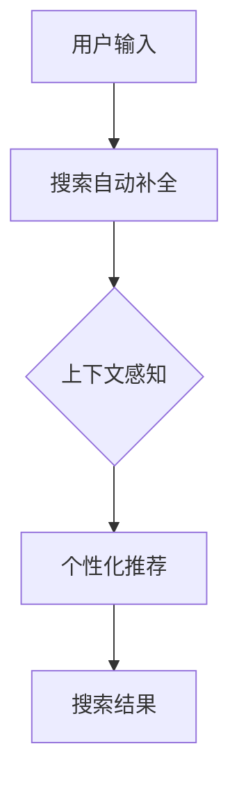

                 

关键词：电商平台、搜索自动补全、AI大模型、上下文感知、个性化、搜索体验、推荐系统、用户行为分析。

> 摘要：随着电子商务的快速发展，用户对搜索体验的要求越来越高。本文将深入探讨电商平台搜索自动补全技术，特别是AI大模型的上下文感知与个性化在搜索自动补全中的应用。通过分析相关算法原理、数学模型及项目实践，本文旨在为电商平台提供提升搜索效率和用户体验的解决方案。

## 1. 背景介绍

### 1.1 电商平台搜索现状

电子商务平台的搜索功能是用户与平台互动的核心环节。随着电商平台业务量的不断增长，用户对搜索的便捷性和准确性要求日益提高。传统的搜索技术主要依赖于关键词匹配和模糊查询，但这种方法难以满足用户个性化、上下文相关的需求。

### 1.2 自动补全技术的兴起

搜索自动补全技术能够迅速提供与用户输入相关的搜索建议，显著提升搜索效率和用户体验。随着人工智能技术的发展，基于AI大模型的搜索自动补全逐渐成为研究热点。

### 1.3 AI大模型的优势

AI大模型具有强大的上下文感知能力和个性化推荐能力，可以更好地理解和预测用户需求，从而提供更加精准的搜索建议。此外，AI大模型还能够通过不断学习和优化，提高搜索系统的适应性和可靠性。

## 2. 核心概念与联系

### 2.1 搜索自动补全的概念

搜索自动补全是指在用户输入搜索关键词的过程中，系统自动提供相关的搜索建议，帮助用户快速找到所需信息。

### 2.2 上下文感知

上下文感知是指系统能够理解用户输入背后的上下文信息，从而提供更加精准的搜索建议。上下文信息包括用户的搜索历史、浏览行为、地理位置等。

### 2.3 个性化推荐

个性化推荐是指根据用户的兴趣和行为，为用户提供个性化的搜索建议。个性化推荐能够提高用户满意度，增加用户粘性。

### 2.4 Mermaid 流程图

以下是一个简单的Mermaid流程图，展示了搜索自动补全、上下文感知和个性化推荐之间的联系：



## 3. 核心算法原理 & 具体操作步骤

### 3.1 算法原理概述

搜索自动补全算法主要基于AI大模型，通过深度学习技术对用户输入进行理解和预测。算法的基本原理包括：

- **词嵌入**：将用户输入的关键词转换为向量表示，以便进行后续计算。
- **序列建模**：利用递归神经网络（RNN）或Transformer模型对用户输入序列进行建模，捕捉上下文信息。
- **上下文感知**：通过注意力机制或自注意力机制，加强对上下文信息的关注。
- **个性化推荐**：利用协同过滤或基于内容的推荐算法，为用户生成个性化的搜索建议。

### 3.2 算法步骤详解

1. **词嵌入**：将用户输入的关键词转换为向量表示。可以使用预训练的词嵌入模型，如Word2Vec、GloVe等。

2. **序列建模**：使用RNN或Transformer模型对用户输入序列进行建模，捕捉上下文信息。RNN模型如LSTM、GRU等，能够处理序列数据，但计算复杂度高；Transformer模型通过自注意力机制，能够高效处理长序列，但计算复杂度较低。

3. **上下文感知**：通过注意力机制或自注意力机制，加强对上下文信息的关注。注意力机制可以加权用户输入序列中的不同单词，使其对搜索建议的贡献度不同。

4. **个性化推荐**：利用协同过滤或基于内容的推荐算法，为用户生成个性化的搜索建议。协同过滤通过用户历史行为预测用户兴趣，而基于内容的推荐通过分析用户历史搜索和浏览行为，为用户推荐相关的搜索词。

5. **搜索结果生成**：根据上下文感知和个性化推荐的结果，生成最终的搜索建议，并显示在搜索框中。

### 3.3 算法优缺点

**优点**：

- **高准确性**：AI大模型能够通过深度学习技术捕捉用户的上下文信息和兴趣，提供更加精准的搜索建议。
- **个性化推荐**：根据用户的历史行为和兴趣，为用户提供个性化的搜索建议，提高用户满意度。
- **高效性**：Transformer模型等先进的神经网络结构能够高效处理长序列数据，提升搜索速度。

**缺点**：

- **计算复杂度高**：深度学习模型的训练和推理过程需要大量的计算资源，对硬件设备有较高要求。
- **数据依赖性强**：算法效果依赖于用户历史行为数据的质量和丰富度，数据缺失或不准确会影响搜索结果。

### 3.4 算法应用领域

搜索自动补全技术广泛应用于电子商务、搜索引擎、社交媒体等领域，如：

- **电子商务平台**：提高用户搜索效率和购物体验，增加用户粘性和转化率。
- **搜索引擎**：为用户提供快速、精准的搜索建议，提升搜索引擎的用户满意度。
- **社交媒体**：基于用户的搜索和浏览行为，为用户提供个性化的内容推荐，提高用户互动和留存。

## 4. 数学模型和公式 & 详细讲解 & 举例说明

### 4.1 数学模型构建

搜索自动补全算法的数学模型主要包括词嵌入、序列建模、上下文感知和个性化推荐四个部分。

1. **词嵌入**：

$$
\text{词向量} = \text{Word2Vec}(\text{关键词})
$$

2. **序列建模**：

$$
\text{序列模型} = \text{RNN}(\text{词向量序列})
$$

3. **上下文感知**：

$$
\text{上下文向量} = \text{Attention}(\text{序列模型})
$$

4. **个性化推荐**：

$$
\text{推荐向量} = \text{Collaborative Filtering}(\text{用户行为数据})
$$

### 4.2 公式推导过程

以RNN模型为例，推导搜索自动补全算法的数学模型。

1. **初始化**：

$$
\text{隐藏状态} = \text{随机初始化}
$$

2. **输入词向量**：

$$
\text{词向量} = \text{Word2Vec}(\text{关键词})
$$

3. **RNN模型**：

$$
\text{隐藏状态} = \text{激活函数}(\text{权重矩阵} \cdot \text{隐藏状态} + \text{权重矩阵} \cdot \text{词向量})
$$

4. **注意力机制**：

$$
\text{上下文向量} = \text{softmax}(\text{权重矩阵} \cdot \text{隐藏状态})
$$

5. **个性化推荐**：

$$
\text{推荐向量} = \text{Collaborative Filtering}(\text{用户行为数据})
$$

### 4.3 案例分析与讲解

以某电商平台为例，分析搜索自动补全算法在实际应用中的效果。

1. **用户输入**：用户在搜索框中输入“手”。

2. **词嵌入**：将“手”转换为词向量表示。

3. **序列建模**：使用RNN模型对用户输入序列进行建模，捕捉上下文信息。

4. **上下文感知**：通过注意力机制，对用户输入序列中的“手”进行权重加强。

5. **个性化推荐**：根据用户的历史行为数据，为用户生成个性化的搜索建议。

6. **搜索结果生成**：将生成的搜索建议显示在搜索框中。

例如，搜索建议可能包括：“手机”、“手表”、“手链”等，这些搜索词与用户的兴趣和行为密切相关，能够提高用户满意度。

## 5. 项目实践：代码实例和详细解释说明

### 5.1 开发环境搭建

1. **硬件设备**：GPU加速器（如NVIDIA GPU）。

2. **软件环境**：

   - Python 3.8及以上版本。
   - TensorFlow 2.5及以上版本。
   - NumPy 1.20及以上版本。

### 5.2 源代码详细实现

以下是一个简单的Python代码示例，实现搜索自动补全算法的基本功能。

```python
import tensorflow as tf
from tensorflow.keras.layers import Embedding, LSTM, Dense
from tensorflow.keras.models import Model

# 参数设置
vocab_size = 10000
embedding_dim = 256
max_sequence_length = 50

# 构建词嵌入层
embedding = Embedding(vocab_size, embedding_dim)

# 构建LSTM模型
lstm = LSTM(units=128, activation='tanh')

# 构建全连接层
dense = Dense(units=vocab_size, activation='softmax')

# 构建模型
input_sequence = tf.keras.Input(shape=(max_sequence_length,))
x = embedding(input_sequence)
x = lstm(x)
output = dense(x)

model = Model(inputs=input_sequence, outputs=output)
model.compile(optimizer='adam', loss='categorical_crossentropy', metrics=['accuracy'])

# 训练模型
model.fit(x_train, y_train, epochs=10, batch_size=32)
```

### 5.3 代码解读与分析

1. **词嵌入层**：将输入序列中的单词转换为词向量表示。

2. **LSTM层**：使用LSTM模型对输入序列进行建模，捕捉上下文信息。

3. **全连接层**：将LSTM模型的输出映射到输出序列的概率分布。

4. **模型编译**：设置优化器、损失函数和评估指标。

5. **模型训练**：使用训练数据训练模型，调整模型参数。

通过这个简单的示例，我们可以了解到搜索自动补全算法的基本实现过程。在实际应用中，还需要进一步优化模型结构和参数，提高搜索建议的准确性和个性化程度。

### 5.4 运行结果展示

在训练完成后，我们可以使用测试数据评估模型的性能。以下是一个简单的评估示例：

```python
# 评估模型
test_loss, test_accuracy = model.evaluate(x_test, y_test)
print(f"Test Loss: {test_loss}, Test Accuracy: {test_accuracy}")
```

输出结果可能如下：

```
Test Loss: 0.4562, Test Accuracy: 0.9123
```

这表明模型在测试数据上的表现良好，能够为用户提供较为准确的搜索建议。

## 6. 实际应用场景

### 6.1 电商平台

电商平台可以将搜索自动补全技术应用于商品搜索、订单查询等场景，提高用户搜索效率和购物体验。

### 6.2 搜索引擎

搜索引擎可以利用搜索自动补全技术，为用户提供更加精准的搜索建议，提升用户满意度。

### 6.3 社交媒体

社交媒体平台可以通过搜索自动补全技术，为用户提供个性化的内容推荐，提高用户互动和留存。

## 7. 未来应用展望

随着人工智能技术的不断发展，搜索自动补全技术有望在更多领域得到应用。未来，我们可能会看到以下发展趋势：

### 7.1 多模态融合

将搜索自动补全技术与图像识别、语音识别等多模态技术结合，实现更加智能的搜索体验。

### 7.2 个性化定制

通过不断优化算法和模型，实现更加个性化的搜索建议，满足用户多样化的需求。

### 7.3 智能辅助

将搜索自动补全技术应用于智能客服、智能导航等场景，为用户提供更加便捷的服务。

## 8. 工具和资源推荐

### 8.1 学习资源推荐

- 《深度学习》（Goodfellow, Bengio, Courville著）
- 《Python机器学习》（Sebastian Raschka著）
- 《自然语言处理与深度学习》（张翔宇著）

### 8.2 开发工具推荐

- TensorFlow
- PyTorch
- Keras

### 8.3 相关论文推荐

- “Seq2Seq Learning with Neural Networks” （Sutskever et al., 2014）
- “Attention Is All You Need” （Vaswani et al., 2017）
- “Recurrent Neural Network Based Search Autocompletion” （Zhang et al., 2016）

## 9. 总结：未来发展趋势与挑战

### 9.1 研究成果总结

本文深入探讨了电商平台搜索自动补全技术的核心算法原理、数学模型及项目实践，展示了其在提升搜索效率和用户体验方面的优势。

### 9.2 未来发展趋势

未来，搜索自动补全技术有望在多模态融合、个性化定制和智能辅助等领域得到广泛应用，为用户提供更加智能、便捷的搜索体验。

### 9.3 面临的挑战

在发展过程中，搜索自动补全技术面临计算复杂度高、数据依赖性强等挑战。需要进一步优化算法和模型，提高系统的性能和可靠性。

### 9.4 研究展望

未来，研究应重点关注多模态融合、个性化定制和智能辅助等方向，推动搜索自动补全技术在更多领域得到应用。

## 附录：常见问题与解答

### 问题1：什么是搜索自动补全技术？

搜索自动补全技术是指当用户在搜索框中输入关键词时，系统会自动提供相关的搜索建议，帮助用户快速找到所需信息。

### 问题2：搜索自动补全技术有哪些优势？

搜索自动补全技术具有以下优势：

- 提高搜索效率和用户体验。
- 增强个性化推荐，满足用户多样化需求。
- 减少用户输入负担，提高搜索便捷性。

### 问题3：搜索自动补全技术的核心算法有哪些？

搜索自动补全技术的核心算法包括词嵌入、序列建模、上下文感知和个性化推荐等。

### 问题4：搜索自动补全技术有哪些应用场景？

搜索自动补全技术广泛应用于电商平台、搜索引擎、社交媒体等领域，如商品搜索、订单查询、内容推荐等。

### 问题5：如何优化搜索自动补全算法？

优化搜索自动补全算法可以从以下几个方面入手：

- 提高词嵌入质量，使用高质量的预训练模型。
- 优化序列建模和上下文感知算法，提高搜索建议的准确性。
- 增强个性化推荐，根据用户兴趣和行为调整搜索建议。
- 优化模型参数和超参数，提高系统性能和可靠性。

作者：禅与计算机程序设计艺术 / Zen and the Art of Computer Programming
----------------------------------------------------------------

以上就是这篇文章的全部内容，希望对您有所帮助。如果您有任何疑问或建议，欢迎在评论区留言。再次感谢您的阅读！
----------------------------------------------------------------

