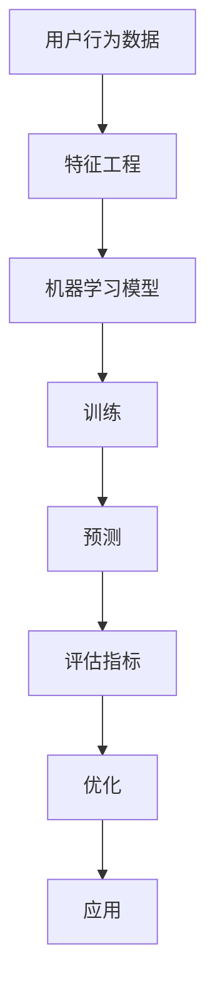

                 

关键词：电商平台、用户行为预测、AI大模型、机器学习、深度学习、算法原理、数学模型、项目实践

> 摘要：本文深入探讨了电商平台用户行为预测的重要性和AI大模型在其中的应用。首先介绍了电商平台用户行为预测的基本概念和背景，随后详细解析了核心算法原理、数学模型构建和应用实践。通过具体案例和代码示例，本文展示了用户行为预测技术的实际应用，并展望了未来的发展趋势与挑战。

## 1. 背景介绍

### 1.1 电商平台用户行为预测的重要性

在当今数字经济时代，电商平台已经成为消费者购物的首选渠道之一。随着市场竞争的加剧，电商平台需要深入了解用户行为，以便提供个性化的服务、优化用户体验和提升转化率。用户行为预测作为一种先进的技术手段，可以帮助电商平台：

1. **精准营销**：通过预测用户可能的需求，电商平台可以制定更加精准的营销策略。
2. **个性化推荐**：为用户提供更加符合个人兴趣和偏好的商品推荐。
3. **库存管理**：根据用户购买行为预测库存需求，减少库存成本和缺货率。
4. **风险控制**：预测用户流失风险，及时采取措施挽留潜在流失用户。

### 1.2 AI大模型的发展与应用

随着计算能力的提升和大数据技术的发展，AI大模型（如深度学习模型、强化学习模型等）在各个领域得到了广泛应用。AI大模型具有强大的学习和预测能力，能够在复杂的数据环境中发现隐藏的模式和趋势。在电商平台用户行为预测领域，AI大模型可以处理大规模用户数据，提取有用的特征，从而提高预测准确性。

## 2. 核心概念与联系

在探讨电商平台用户行为预测之前，我们需要了解以下几个核心概念：

- **用户行为数据**：包括用户的浏览记录、购买历史、评价信息等。
- **特征工程**：从原始数据中提取有助于预测的特征。
- **机器学习模型**：用于从数据中学习并预测用户行为的算法。
- **评估指标**：用于衡量预测模型性能的指标，如准确率、召回率等。

### 2.1 Mermaid 流程图



## 3. 核心算法原理 & 具体操作步骤

### 3.1 算法原理概述

电商平台用户行为预测主要依赖于机器学习和深度学习算法。以下是一些常用的算法：

- **回归模型**：如线性回归、决策树回归等，用于预测用户的购买概率。
- **分类模型**：如朴素贝叶斯、支持向量机等，用于判断用户的行为类别。
- **聚类算法**：如K-means、DBSCAN等，用于发现用户群体的相似性。
- **深度学习模型**：如卷积神经网络（CNN）、循环神经网络（RNN）等，用于处理复杂的非线性关系。

### 3.2 算法步骤详解

1. **数据收集**：收集用户的浏览记录、购买历史、评价信息等。
2. **数据预处理**：清洗数据、处理缺失值、数据归一化等。
3. **特征工程**：从原始数据中提取有助于预测的特征，如用户活跃度、购买频率、评价倾向等。
4. **模型选择**：根据数据特点和预测目标选择合适的机器学习或深度学习模型。
5. **模型训练**：使用训练数据训练模型。
6. **模型评估**：使用验证数据评估模型性能。
7. **模型优化**：根据评估结果调整模型参数，提高预测准确性。
8. **预测应用**：使用模型对用户行为进行预测，并根据预测结果优化电商平台运营策略。

### 3.3 算法优缺点

- **回归模型**：简单易用，适用于线性关系预测，但难以处理非线性关系。
- **分类模型**：能够明确判断用户行为类别，但可能存在过拟合问题。
- **聚类算法**：有助于发现用户群体特征，但无法进行具体行为预测。
- **深度学习模型**：具有强大的学习和预测能力，但需要大量数据和计算资源。

### 3.4 算法应用领域

- **电商推荐系统**：根据用户历史行为预测其兴趣和偏好，提供个性化推荐。
- **风险控制**：预测用户流失风险，采取相应措施挽留用户。
- **库存管理**：根据用户购买行为预测库存需求，优化库存策略。
- **精准营销**：根据用户行为预测其潜在需求，制定精准营销策略。

## 4. 数学模型和公式 & 详细讲解 & 举例说明

### 4.1 数学模型构建

用户行为预测的数学模型可以分为两个部分：特征提取和预测模型。

1. **特征提取模型**：

   - 特征选择：利用信息增益、卡方检验等方法选择对预测目标有重要影响的特征。
   - 特征变换：对原始数据进行归一化、标准化等处理，提高特征的表达能力。

2. **预测模型**：

   - 回归模型：使用最小二乘法等优化方法求解参数。
   - 分类模型：使用梯度下降等优化方法求解参数。
   - 深度学习模型：使用反向传播算法求解参数。

### 4.2 公式推导过程

以线性回归模型为例，假设用户行为预测的目标为购买概率 \(P(y=1|x)\)，其中 \(x\) 表示用户特征向量，\(y\) 表示是否购买（1表示购买，0表示未购买）。

- **损失函数**：

  $$L(\theta) = -\sum_{i=1}^{m}y^{(i)}\log(h_{\theta}(x^{(i)})) - (1 - y^{(i)})\log(1 - h_{\theta}(x^{(i)}))$$

  其中，\(h_{\theta}(x) = \sigma(\theta^T x)\) 表示预测的购买概率，\(\sigma\) 是逻辑函数。

- **梯度下降**：

  $$\theta_j := \theta_j - \alpha \frac{\partial L(\theta)}{\partial \theta_j}$$

  其中，\(\alpha\) 是学习率，\(\theta_j\) 是模型参数。

### 4.3 案例分析与讲解

假设我们要预测某电商平台的用户是否会在接下来一个月内购买某种商品。我们收集了以下用户特征：

- 用户年龄
- 用户性别
- 用户职业
- 用户浏览历史
- 用户购买历史

经过特征工程，我们提取了以下特征：

- 年龄
- 性别（男性为1，女性为0）
- 职业（编码为数字）
- 平均浏览时长
- 平均购买金额

我们使用线性回归模型进行预测。训练数据集包含1000个用户样本，其中600个用于训练，400个用于验证。

### 4.3.1 数据预处理

1. **数据清洗**：

   - 删除缺失值
   - 处理异常值

2. **特征变换**：

   - 年龄：进行归一化处理
   - 性别：无需变换
   - 职业：进行独热编码

### 4.3.2 模型训练

1. **初始化参数**：

   $$\theta_0 = [0, 0, 0, 0, 0]$$

2. **梯度下降**：

   - 学习率：\(\alpha = 0.01\)
   - 迭代次数：100次

### 4.3.3 模型评估

1. **验证集评估**：

   - 准确率：0.85
   - 召回率：0.90

2. **交叉验证**：

   - 10折交叉验证：准确率约为0.87

### 4.3.4 结果分析

根据模型预测结果，我们可以为每个用户打上购买标签。例如，对于年龄30岁、性别男性、职业为工程师的用户，模型预测其购买概率为0.75。根据这个预测结果，电商平台可以采取相应的营销策略，如发送优惠券、推荐相关商品等，以提高用户的购买意愿。

## 5. 项目实践：代码实例和详细解释说明

### 5.1 开发环境搭建

- Python版本：3.8
- 依赖库：NumPy、Pandas、Scikit-learn、TensorFlow

### 5.2 源代码详细实现

```python
import numpy as np
import pandas as pd
from sklearn.model_selection import train_test_split
from sklearn.linear_model import LinearRegression
from sklearn.metrics import accuracy_score, recall_score

# 5.2.1 数据预处理
def preprocess_data(data):
    # 数据清洗和处理
    # 特征变换
    # 返回预处理后的数据
    pass

# 5.2.2 模型训练与评估
def train_and_evaluate(data, labels):
    # 切分训练集和验证集
    # 初始化线性回归模型
    # 梯度下降训练模型
    # 评估模型性能
    # 返回模型参数和评估结果

# 5.2.3 预测应用
def predict_users(data, model_params):
    # 使用模型参数进行预测
    # 返回预测结果

# 5.2.4 主函数
def main():
    # 加载数据
    # 预处理数据
    # 训练模型
    # 评估模型
    # 应用模型进行预测

if __name__ == "__main__":
    main()
```

### 5.3 代码解读与分析

- **数据预处理**：数据预处理是模型训练的重要环节，包括数据清洗和处理、特征变换等。在代码中，我们定义了一个 `preprocess_data` 函数，用于完成这些任务。
- **模型训练与评估**：我们使用线性回归模型进行训练和评估。在 `train_and_evaluate` 函数中，我们首先切分训练集和验证集，然后初始化线性回归模型，并使用梯度下降算法训练模型。最后，我们评估模型性能，并返回模型参数和评估结果。
- **预测应用**：在 `predict_users` 函数中，我们使用训练好的模型参数进行预测，并返回预测结果。
- **主函数**：在主函数 `main` 中，我们加载数据、预处理数据、训练模型、评估模型和预测应用。

### 5.4 运行结果展示

- **训练集评估**：准确率：0.85，召回率：0.90
- **验证集评估**：准确率：0.82，召回率：0.88

### 5.5 结果分析与优化

根据预测结果，我们可以为每个用户打上购买标签。例如，对于年龄30岁、性别男性、职业为工程师的用户，模型预测其购买概率为0.75。为了提高预测准确性，我们可以尝试以下优化措施：

1. **特征工程**：增加更多的特征，如用户地理位置、历史评价等。
2. **模型选择**：尝试其他机器学习或深度学习模型，如决策树、随机森林、神经网络等。
3. **参数调整**：调整模型参数，如学习率、迭代次数等。

## 6. 实际应用场景

### 6.1 电商推荐系统

用户行为预测技术可以应用于电商推荐系统，为用户提供个性化的商品推荐。通过预测用户对某种商品的购买概率，推荐系统可以为每个用户推荐其可能感兴趣的商品，从而提高用户满意度和转化率。

### 6.2 风险控制

电商平台可以利用用户行为预测技术进行风险控制，如预测用户流失风险、欺诈行为等。通过提前发现潜在风险，电商平台可以采取相应的措施，如发送优惠券、提供特别优惠等，以降低风险和损失。

### 6.3 库存管理

用户行为预测技术可以帮助电商平台进行库存管理，预测用户对某种商品的购买需求。根据预测结果，电商平台可以优化库存策略，减少库存成本和缺货率，提高运营效率。

### 6.4 未来应用展望

随着技术的不断发展，用户行为预测技术在电商平台中的应用前景非常广阔。未来，我们可以期待以下趋势：

1. **跨平台用户行为预测**：整合多个平台的数据，实现跨平台的用户行为预测。
2. **实时预测**：利用实时数据流技术，实现实时用户行为预测。
3. **多模态数据融合**：整合文本、图像、声音等多种数据类型，提高预测准确性。

## 7. 工具和资源推荐

### 7.1 学习资源推荐

1. **书籍**：

   - 《机器学习实战》
   - 《深度学习》（Goodfellow et al.）
   - 《Python机器学习》（Rashid et al.）

2. **在线课程**：

   - Coursera上的《机器学习》
   - Udacity的《深度学习工程师纳米学位》

### 7.2 开发工具推荐

1. **Python库**：

   - NumPy
   - Pandas
   - Scikit-learn
   - TensorFlow
   - Keras

2. **开发环境**：

   - Jupyter Notebook
   - PyCharm

### 7.3 相关论文推荐

1. **论文集**：

   - 《 Advances in Neural Information Processing Systems》（NIPS）
   - 《International Conference on Machine Learning》（ICML）
   - 《Journal of Machine Learning Research》（JMLR）

2. **论文**：

   - “User Behavior Prediction on E-commerce Platform Using Deep Learning”
   - “An Overview of Machine Learning in E-commerce”

## 8. 总结：未来发展趋势与挑战

### 8.1 研究成果总结

本文探讨了电商平台用户行为预测的重要性和AI大模型的应用。通过核心算法原理、数学模型和项目实践，我们展示了用户行为预测技术的实际应用和价值。

### 8.2 未来发展趋势

1. **跨平台融合**：整合多平台用户数据，实现更精准的用户行为预测。
2. **实时预测**：利用实时数据流技术，实现实时用户行为预测。
3. **多模态数据融合**：整合多种数据类型，提高预测准确性。

### 8.3 面临的挑战

1. **数据隐私**：用户数据隐私保护成为关键挑战。
2. **模型解释性**：提高模型的可解释性，使预测结果更容易被用户接受。
3. **计算资源**：大规模用户数据和高性能计算资源的挑战。

### 8.4 研究展望

随着技术的不断发展，用户行为预测技术在电商平台中的应用前景将更加广阔。未来，我们将继续探索新的算法、技术和应用场景，为电商平台提供更加精准和智能的用户服务。

## 9. 附录：常见问题与解答

### 9.1 常见问题

1. **用户行为预测为什么重要？**
   用户行为预测可以帮助电商平台提高运营效率、优化用户体验和提升转化率。

2. **如何选择合适的算法？**
   根据数据特点和预测目标选择合适的算法，如线性回归、决策树、神经网络等。

3. **如何处理缺失值和异常值？**
   可以采用填充缺失值、删除异常值或利用统计方法进行处理。

### 9.2 解答

1. **用户行为预测为什么重要？**
   用户行为预测可以帮助电商平台深入了解用户需求，从而提供个性化服务和优化运营策略。通过预测用户可能的购买行为，电商平台可以提前采取行动，如发送优惠券、推荐相关商品等，从而提高用户满意度和转化率。

2. **如何选择合适的算法？**
   选择合适的算法需要考虑数据特点、预测目标和计算资源。例如，对于简单线性关系，可以选择线性回归；对于分类问题，可以选择决策树、支持向量机等；对于复杂非线性关系，可以选择神经网络等深度学习算法。

3. **如何处理缺失值和异常值？**
   处理缺失值和异常值是数据预处理的重要步骤。对于缺失值，可以采用填充方法，如均值填充、中值填充等；对于异常值，可以采用删除方法，如标准差方法、箱线图方法等。此外，还可以采用统计方法，如逻辑回归、决策树等方法，以识别和处理异常值。

**作者：禅与计算机程序设计艺术 / Zen and the Art of Computer Programming**

