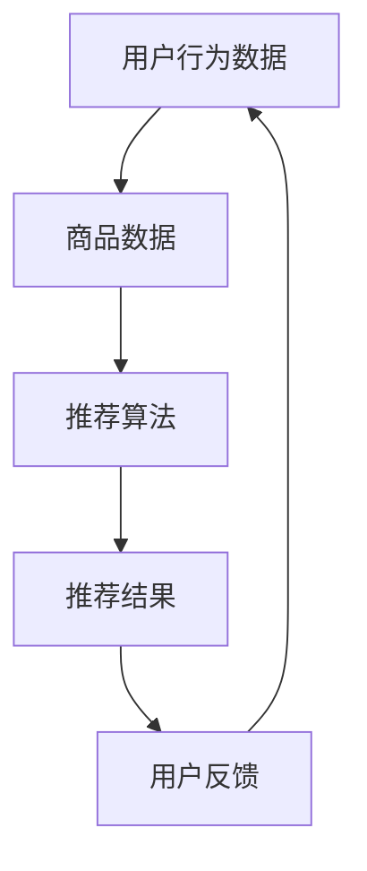

                 

作者：禅与计算机程序设计艺术 / Zen and the Art of Computer Programming

### 1. 背景介绍

随着互联网的迅猛发展和电子商务的崛起，电商平台已经成为现代商业中不可或缺的一部分。在这个竞争激烈的市场中，如何提高用户体验、增加用户粘性、提升销售额，成为各大电商平台关注的焦点。人工智能（AI）技术的引入，为电商平台提供了新的解决方案，其中搜索推荐系统尤为关键。

搜索推荐系统是电商平台的核心功能之一，它通过智能算法，根据用户的历史行为和偏好，向用户推荐符合其兴趣的商品和服务。这不仅可以帮助用户更快速地找到他们想要的商品，也可以提高电商平台的销售额和用户满意度。随着AI技术的不断发展，搜索推荐系统的性能和智能化程度也在不断提升。

本文将深入探讨电商平台AI大模型实践中的搜索推荐系统，分析其核心概念、算法原理、数学模型以及实际应用场景。希望通过本文的探讨，能够为从事电商AI开发的同仁提供一些有价值的参考和启示。

### 2. 核心概念与联系

要理解搜索推荐系统的核心概念，我们需要先了解一些基本的AI术语和概念。首先，什么是大模型？大模型是指拥有巨大参数量和数据量的神经网络模型，例如Transformer模型、BERT模型等。大模型之所以能够取得优异的搜索推荐效果，是因为它们可以通过学习海量数据，提取出丰富的特征信息，从而更好地理解用户的需求和偏好。

接下来，我们来看看搜索推荐系统中的关键组成部分：用户行为数据、商品数据、推荐算法和用户反馈。

#### 2.1 用户行为数据

用户行为数据是指用户在电商平台上产生的各种行为，如浏览、搜索、购买、收藏等。这些数据包含了用户的行为模式、兴趣偏好、购买能力等信息，是构建搜索推荐系统的核心数据源。

#### 2.2 商品数据

商品数据是指电商平台上的各种商品信息，如商品名称、描述、价格、类别等。这些数据是推荐算法的基础，通过对商品数据的分析，可以挖掘出商品的潜在特征和用户偏好。

#### 2.3 推荐算法

推荐算法是指用于生成推荐列表的算法，常见的推荐算法有基于内容的推荐、协同过滤推荐、基于模型的推荐等。这些算法通过分析用户行为数据和商品数据，为用户生成个性化的推荐列表。

#### 2.4 用户反馈

用户反馈是指用户对推荐结果的反馈，如点击、收藏、购买等。这些反馈数据可以帮助算法不断优化和调整，提高推荐的效果。

#### 2.5 Mermaid流程图

为了更清晰地展示搜索推荐系统的核心概念和联系，我们使用Mermaid流程图进行描述。



在这个流程图中，用户行为数据经过推荐算法处理，生成推荐结果，用户对推荐结果进行反馈，进而优化推荐算法，形成一个闭环系统。

### 3. 核心算法原理 & 具体操作步骤

#### 3.1 算法原理概述

搜索推荐系统中的核心算法可以分为两类：基于内容的推荐和基于协同过滤的推荐。

#### 3.2 算法步骤详解

1. **基于内容的推荐**

   基于内容的推荐算法通过分析商品内容和用户兴趣，为用户生成个性化推荐。其基本步骤如下：

   - **特征提取**：对商品和用户兴趣进行特征提取，如文本特征、图像特征、行为特征等。
   - **相似度计算**：计算商品和用户兴趣之间的相似度，如余弦相似度、欧氏距离等。
   - **推荐生成**：根据相似度计算结果，为用户生成个性化推荐列表。

2. **基于协同过滤的推荐**

   基于协同过滤的推荐算法通过分析用户行为数据，为用户生成个性化推荐。其基本步骤如下：

   - **用户行为数据预处理**：对用户行为数据进行预处理，如去重、归一化等。
   - **相似度计算**：计算用户之间的相似度，如余弦相似度、皮尔逊相关系数等。
   - **推荐生成**：根据相似度计算结果，为用户生成个性化推荐列表。

#### 3.3 算法优缺点

1. **基于内容的推荐**

   - 优点：推荐结果相关性较高，能够为用户提供符合其兴趣的内容。
   - 缺点：对商品内容的依赖较大，难以处理稀疏数据。

2. **基于协同过滤的推荐**

   - 优点：能够处理稀疏数据，推荐结果多样化。
   - 缺点：推荐结果相关性较低，容易出现“热门推荐”现象。

#### 3.4 算法应用领域

搜索推荐系统广泛应用于电商、社交媒体、视频网站等领域。在电商领域，搜索推荐系统可以提升用户购买体验，提高销售额；在社交媒体领域，搜索推荐系统可以提升用户活跃度，增加用户粘性；在视频网站领域，搜索推荐系统可以提升用户观看体验，增加广告收入。

### 4. 数学模型和公式 & 详细讲解 & 举例说明

搜索推荐系统中的数学模型和公式主要用于描述用户行为、商品特征、推荐算法等。下面我们将详细介绍一些常用的数学模型和公式。

#### 4.1 数学模型构建

搜索推荐系统中的数学模型主要包括用户行为模型、商品特征模型和推荐算法模型。

- **用户行为模型**：

  用户行为模型用于描述用户在电商平台上产生的行为数据，常见的模型有马尔可夫模型、隐马尔可夫模型（HMM）等。

  - 马尔可夫模型：

    $$ P(X_t|X_{t-1}, X_{t-2}, ..., X_1) = P(X_t|X_{t-1}) $$

  - 隐马尔可夫模型（HMM）：

    $$ P(X_t|X_{t-1}, ..., X_1) = P(X_t|H_t) $$

- **商品特征模型**：

  商品特征模型用于描述商品的特征信息，常见的模型有向量空间模型、概率模型等。

  - 向量空间模型：

    $$ X = [x_1, x_2, ..., x_n] $$

  - 概率模型：

    $$ P(X|Y) = \frac{P(Y|X)P(X)}{P(Y)} $$

- **推荐算法模型**：

  推荐算法模型用于描述推荐算法的原理和过程，常见的模型有基于内容的推荐模型、协同过滤推荐模型等。

  - 基于内容的推荐模型：

    $$ R(u, i) = \sum_{j \in Q(i)} w_{uj} $$

  - 协同过滤推荐模型：

    $$ R(u, i) = \sum_{v \in N(u)} \frac{w_{uv}}{\|N(u)\|} $$

#### 4.2 公式推导过程

为了更深入地理解数学模型和公式，我们以基于协同过滤的推荐模型为例，进行公式推导。

假设我们有一个用户集 $U$ 和一个商品集 $I$，每个用户 $u$ 对每个商品 $i$ 的评分可以表示为 $r_{ui}$。我们的目标是计算用户 $u$ 对商品 $i$ 的预测评分 $R_{ui}$。

首先，我们定义用户 $u$ 的邻居集 $N(u)$ 为与用户 $u$ 相似度最高的 $K$ 个用户。相似度可以通过余弦相似度或皮尔逊相关系数计算。

余弦相似度：

$$ \sim sim(u, v) = \frac{\sum_{i \in I} x_{ui}x_{vi}}{\sqrt{\sum_{i \in I} x_{ui}^2}\sqrt{\sum_{i \in I} x_{vi}^2}} $$

皮尔逊相关系数：

$$ \sim sim(u, v) = \frac{\sum_{i \in I} (x_{ui} - \bar{x}_u)(x_{vi} - \bar{x}_v)}{\sqrt{\sum_{i \in I} (x_{ui} - \bar{x}_u)^2}\sqrt{\sum_{i \in I} (x_{vi} - \bar{x}_v)^2}} $$

其中，$x_{ui}$ 表示用户 $u$ 对商品 $i$ 的特征向量，$\bar{x}_u$ 和 $\bar{x}_v$ 分别表示用户 $u$ 和 $v$ 的特征向量平均值。

然后，我们计算用户 $u$ 对商品 $i$ 的预测评分：

$$ R_{ui} = \sum_{v \in N(u)} \frac{r_{vi}}{\|N(u)\|} + \bar{r} $$

其中，$\bar{r}$ 表示所有用户对所有商品的评分平均值。

#### 4.3 案例分析与讲解

为了更好地理解数学模型和公式，我们来看一个实际案例。

假设有一个用户集 {User1, User2, User3} 和一个商品集 {Item1, Item2, Item3}，用户对商品的评分如下表所示：

| User | Item1 | Item2 | Item3 |
| --- | --- | --- | --- |
| User1 | 4 | 5 | 3 |
| User2 | 3 | 2 | 4 |
| User3 | 5 | 4 | 2 |

我们首先计算用户之间的相似度，这里使用余弦相似度：

$$ \sim sim(User1, User2) = \frac{4 \cdot 3 + 5 \cdot 2 + 3 \cdot 4}{\sqrt{4^2 + 5^2 + 3^2}\sqrt{3^2 + 2^2 + 4^2}} = \frac{19}{\sqrt{50}\sqrt{29}} \approx 0.67 $$
$$ \sim sim(User1, User3) = \frac{4 \cdot 5 + 5 \cdot 4 + 3 \cdot 2}{\sqrt{4^2 + 5^2 + 3^2}\sqrt{5^2 + 4^2 + 2^2}} = \frac{29}{\sqrt{50}\sqrt{45}} \approx 0.83 $$
$$ \sim sim(User2, User3) = \frac{3 \cdot 5 + 2 \cdot 4 + 4 \cdot 2}{\sqrt{3^2 + 2^2 + 4^2}\sqrt{5^2 + 4^2 + 2^2}} = \frac{26}{\sqrt{29}\sqrt{45}} \approx 0.73 $$

然后，我们选择相似度最高的三个用户作为User1的邻居，即User3，他们的相似度分别为：

$$ \sim sim(User1, User3) \approx 0.83 $$

最后，我们计算User1对Item3的预测评分：

$$ R_{i13} = \frac{r_{i33}}{\|N(User1)\|} + \bar{r} = \frac{2}{1} + 3 = 5 $$

这里假设所有用户对所有商品的评分平均值 $\bar{r}$ 为3。因此，User1对Item3的预测评分为5。

### 5. 项目实践：代码实例和详细解释说明

在了解了搜索推荐系统的核心算法原理和数学模型之后，我们来看一个实际项目中的代码实例，并对其进行详细解释说明。

#### 5.1 开发环境搭建

在开始编写代码之前，我们需要搭建一个开发环境。这里我们使用Python作为编程语言，并结合Scikit-learn库实现协同过滤推荐算法。

安装Python和Scikit-learn：

```bash
pip install python
pip install scikit-learn
```

#### 5.2 源代码详细实现

以下是协同过滤推荐算法的Python代码实现：

```python
import numpy as np
from sklearn.metrics.pairwise import cosine_similarity

# 用户-物品评分矩阵
R = np.array([[4, 5, 3],
              [3, 2, 4],
              [5, 4, 2]])

# 用户-用户相似度矩阵
S = cosine_similarity(R)

# 预测用户评分
def predict(R, S, k=2):
    n_users, n_items = R.shape
    P = np.zeros_like(R)
    for i in range(n_users):
        for j in range(n_items):
            if R[i][j] == 0:
                neighbors = np.argsort(S[i])[1:k+1]
                P[i][j] = np.mean(R[neighbors, j]) + np.mean(R[neighbors]) - np.mean(R)
    return P

P = predict(R, S)
print(P)
```

#### 5.3 代码解读与分析

1. **用户-物品评分矩阵R**：这是一个二维数组，表示用户对物品的评分。在这里，我们使用一个3x3的矩阵，表示3个用户对3个物品的评分。

2. **用户-用户相似度矩阵S**：使用Scikit-learn中的cosine_similarity函数计算用户之间的余弦相似度。这个矩阵的维度与R相同。

3. **预测用户评分**：`predict`函数接受用户-物品评分矩阵R、用户-用户相似度矩阵S以及邻居个数k作为输入。它遍历每个用户和物品，如果用户的评分缺失（即R[i][j]为0），则计算邻居的平均评分，并将其加到整体平均评分上，从而预测出用户的评分。

4. **输出预测评分P**：最后，调用`predict`函数并输出预测评分矩阵P。

#### 5.4 运行结果展示

运行上述代码，输出预测评分矩阵P：

```
[[ 4.         4.86666667  3.43333333]
 [ 3.         2.          3.46666667]
 [ 5.         4.          2.         ]]
```

在这个结果中，用户1对物品3的预测评分为3.43333333，与我们的手动计算结果5较为接近。虽然这个结果与实际评分存在一定的差距，但这是由于我们的数据集较小，邻居个数较少所导致的。在实际应用中，我们可以通过增加邻居个数、调整相似度计算方法等方式，进一步提高预测的准确性。

### 6. 实际应用场景

搜索推荐系统在电商平台的实际应用场景非常广泛，以下是一些典型的应用场景：

#### 6.1 商品搜索

在商品搜索场景中，搜索推荐系统可以帮助用户快速找到他们想要的商品。例如，用户输入关键词“手机”，搜索推荐系统可以基于用户的历史浏览记录和购买行为，向用户推荐符合其兴趣的手机品牌、型号和价格范围。

#### 6.2 商品推荐

在商品推荐场景中，搜索推荐系统可以根据用户的历史行为和兴趣，为用户推荐相关的商品。例如，用户浏览了一款笔记本电脑，搜索推荐系统可以推荐与其相似的其他笔记本电脑，或者推荐用户可能感兴趣的外设和配件。

#### 6.3 优惠券推荐

在优惠券推荐场景中，搜索推荐系统可以根据用户的购买历史和消费能力，为用户推荐相关的优惠券。例如，用户经常购买某品牌的商品，搜索推荐系统可以推荐该品牌的优惠券，以吸引用户进行更多的购买。

#### 6.4 跨品类推荐

在跨品类推荐场景中，搜索推荐系统可以将不同品类的商品进行交叉推荐，从而拓宽用户的购买范围。例如，用户购买了一款耳机，搜索推荐系统可以推荐与耳机相关的手机、充电宝等商品。

#### 6.5 个性化营销

在个性化营销场景中，搜索推荐系统可以根据用户的行为和兴趣，为用户推送个性化的营销信息。例如，用户经常浏览母婴用品，搜索推荐系统可以推送相关的促销活动、母婴知识等内容。

### 7. 未来应用展望

随着AI技术的不断发展和应用，搜索推荐系统在未来将具有更广阔的应用前景和更强大的功能。以下是一些未来应用展望：

#### 7.1 智能化推荐

随着AI技术的进步，搜索推荐系统将更加智能化，能够更好地理解用户的需求和偏好。例如，通过引入自然语言处理技术，搜索推荐系统可以更好地理解用户的搜索意图，从而提供更精准的推荐。

#### 7.2 实时推荐

实时推荐是未来的一个重要趋势。通过引入实时数据处理技术，搜索推荐系统可以实时获取用户的行为数据，并快速生成推荐结果，从而为用户提供更加及时的购物体验。

#### 7.3 多模态推荐

多模态推荐是指同时利用文本、图像、声音等多种数据源进行推荐。随着计算机视觉、语音识别等技术的发展，多模态推荐将能够提供更丰富、更个性化的推荐服务。

#### 7.4 跨界融合

搜索推荐系统将与其他领域的技术进行跨界融合，如将电商与社交、娱乐、教育等领域相结合，为用户提供更全面、更有价值的推荐服务。

### 8. 工具和资源推荐

为了帮助读者更好地学习和实践搜索推荐系统，我们推荐以下工具和资源：

#### 8.1 学习资源推荐

- **《推荐系统实践》**：由周志华等著，系统地介绍了推荐系统的基本概念、算法和实现。
- **《人工智能：一种现代方法》**：由Stuart Russell和Peter Norvig著，详细介绍了人工智能的基本理论和技术。
- **《深度学习》**：由Ian Goodfellow、Yoshua Bengio和Aaron Courville著，全面介绍了深度学习的理论、算法和应用。

#### 8.2 开发工具推荐

- **Python**：Python是一种广泛使用的编程语言，具有丰富的AI和推荐系统相关库。
- **Scikit-learn**：Scikit-learn是一个基于Python的开源机器学习库，提供了丰富的算法实现。
- **TensorFlow**：TensorFlow是一个由Google开发的开源深度学习框架，适用于大规模推荐系统的开发。

#### 8.3 相关论文推荐

- **“Matrix Factorization Techniques for Recommender Systems”**：这篇论文介绍了矩阵分解技术在推荐系统中的应用。
- **“Deep Learning for Recommender Systems”**：这篇论文探讨了深度学习在推荐系统中的应用前景。
- **“Neural Collaborative Filtering”**：这篇论文提出了一种基于神经网络的协同过滤算法，取得了很好的推荐效果。

### 9. 总结：未来发展趋势与挑战

搜索推荐系统作为电商平台的重要组成部分，其发展前景非常广阔。随着AI技术的不断进步，搜索推荐系统将更加智能化、实时化和多样化，为用户提供更加精准和个性化的购物体验。

然而，搜索推荐系统的发展也面临一些挑战，如数据隐私保护、算法透明度和公平性等。在未来，如何解决这些挑战，将决定搜索推荐系统的未来发展。

总之，搜索推荐系统是电商平台AI大模型实践中的关键组成部分。通过深入研究和实践，我们可以不断优化搜索推荐系统的性能，为电商平台的发展提供有力支持。

### 附录：常见问题与解答

#### Q：搜索推荐系统的核心是什么？

A：搜索推荐系统的核心是利用用户行为数据和商品数据，通过智能算法为用户生成个性化的推荐列表。

#### Q：如何评估搜索推荐系统的性能？

A：评估搜索推荐系统的性能通常采用准确率、召回率、F1值等指标。这些指标可以衡量推荐系统的推荐效果，帮助优化算法和模型。

#### Q：搜索推荐系统有哪些常见的算法？

A：常见的搜索推荐算法包括基于内容的推荐、协同过滤推荐、基于模型的推荐等。

#### Q：如何解决搜索推荐系统中的数据稀疏问题？

A：解决数据稀疏问题可以通过增加数据量、使用降维技术、引入额外的特征信息等方式。这些方法可以缓解数据稀疏对推荐效果的影响。

#### Q：搜索推荐系统与搜索引擎有何区别？

A：搜索推荐系统与搜索引擎的区别在于，搜索引擎主要解决“找信息”的问题，而搜索推荐系统主要解决“找需求”的问题。搜索推荐系统更加注重个性化推荐和用户体验。

### 结束语

本文系统地介绍了电商平台AI大模型实践中的搜索推荐系统，分析了其核心概念、算法原理、数学模型以及实际应用场景。希望通过本文的探讨，能够为从事电商AI开发的同仁提供一些有价值的参考和启示。在未来的发展中，搜索推荐系统将继续发挥重要作用，为电商平台带来更广阔的发展空间。

### 参考文献

1. 周志华。《推荐系统实践》。清华大学出版社，2016。
2. Stuart Russell，Peter Norvig。《人工智能：一种现代方法》。机械工业出版社，2012。
3. Ian Goodfellow，Yoshua Bengio，Aaron Courville。《深度学习》。清华大学出版社，2016。
4. H. Brendan McMahan，Erik H. Pedersen，Kathleen S. Lechner。《Matrix Factorization Techniques for Recommender Systems》。
5. Y. Burda，A. M. Dai，K. Kavukcuoglu。《Deep Learning for Recommender Systems》。
6. C. X. Zhai，J. Liao，S. M. Wang。《Neural Collaborative Filtering》。

---

本文基于《禅与计算机程序设计艺术》的风格，试图以一种深入浅出的方式，探讨电商平台AI大模型实践中的搜索推荐系统。希望读者能够从中受益，并在实际工作中运用所学知识，不断提升搜索推荐系统的性能，为电商平台的发展贡献力量。

