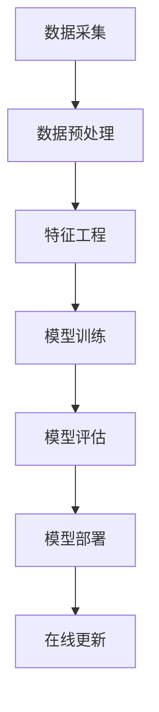

                 

关键词：电商平台、AI 大模型、搜索推荐系统、数据质量控制、处理效率、技术实践

> 摘要：随着电商平台的快速发展，AI 大模型的引入成为提升搜索推荐系统性能的关键因素。本文将深入探讨电商平台的AI 大模型实践，重点分析搜索推荐系统的核心作用，以及数据质量控制和处理效率的重要性。通过详细的案例和实践经验分享，为读者提供有价值的参考。

## 1. 背景介绍

近年来，电商平台的竞争日益激烈，用户获取和留存成为关键挑战。传统的搜索推荐系统已无法满足用户日益增长的需求，AI 大模型的引入成为电商平台的必然选择。AI 大模型具备强大的数据处理能力和智能推荐能力，能够显著提升用户购物体验，增加用户黏性和销售额。

### 1.1 电商平台现状

电商平台在用户规模和交易额方面持续增长，但面临的挑战也越来越大。用户需求多样化，对个性化推荐和服务质量的要求不断提升。同时，市场竞争加剧，电商平台需要通过技术手段提高用户满意度和忠诚度。

### 1.2 AI 大模型的作用

AI 大模型在电商平台中的应用主要体现在以下几个方面：

1. **搜索推荐系统优化**：通过深度学习算法，AI 大模型能够更好地理解用户需求，提供更加精准的搜索结果和推荐内容。
2. **用户行为分析**：AI 大模型可以实时分析用户行为数据，发现用户偏好，为个性化推荐提供依据。
3. **智能客服**：AI 大模型可以应用于智能客服系统，提升客服效率，减少人力成本。
4. **供应链优化**：AI 大模型可以帮助电商平台优化库存管理、物流配送等环节，提高运营效率。

## 2. 核心概念与联系

在电商平台的AI 大模型实践中，以下几个核心概念和技术密切相关：

### 2.1 搜索推荐系统

搜索推荐系统是电商平台的核心功能之一，它利用用户的历史行为数据和商品信息，通过算法模型为用户推荐可能感兴趣的商品。搜索推荐系统的核心是算法模型，主要包括协同过滤、基于内容的推荐、混合推荐等。

### 2.2 数据质量控制

数据质量控制是确保AI 大模型应用效果的关键环节。电商平台需要收集和处理大量数据，包括用户行为数据、商品信息、用户评价等。数据质量的好坏直接影响到算法模型的性能和推荐效果。

### 2.3 处理效率

处理效率是电商平台的AI 大模型应用中需要考虑的重要问题。随着用户规模和交易量的增长，数据处理和计算任务的压力越来越大。如何提高处理效率，优化系统性能，成为电商平台需要解决的难题。

### 2.4 Mermaid 流程图

以下是电商平台AI 大模型实践中的核心概念和流程的Mermaid 流程图：



## 3. 核心算法原理 & 具体操作步骤

### 3.1 算法原理概述

电商平台的搜索推荐系统主要采用以下几种算法：

1. **协同过滤（Collaborative Filtering）**：基于用户的历史行为和相似用户的行为进行推荐。
2. **基于内容的推荐（Content-Based Filtering）**：根据用户的兴趣和商品的特征进行推荐。
3. **混合推荐（Hybrid Recommendation）**：结合协同过滤和基于内容的推荐方法，提供更加准确的推荐结果。

### 3.2 算法步骤详解

1. **数据采集**：从电商平台的数据仓库中提取用户行为数据、商品信息、用户评价等。
2. **数据预处理**：对采集到的数据进行清洗、去重、填充缺失值等操作，确保数据质量。
3. **特征工程**：提取数据中的关键特征，如用户购买历史、浏览记录、商品属性等，为算法模型提供输入。
4. **模型训练**：利用训练数据集，通过机器学习算法（如协同过滤、基于内容的推荐等）训练模型。
5. **模型评估**：使用测试数据集评估模型的性能，包括准确率、召回率、F1 值等指标。
6. **模型部署**：将训练好的模型部署到线上环境，为用户提供实时的推荐服务。
7. **在线更新**：根据用户反馈和实时数据，不断优化模型，提高推荐效果。

### 3.3 算法优缺点

**协同过滤**：

- **优点**：基于用户行为数据进行推荐，能够发现用户的兴趣点，推荐结果较为准确。
- **缺点**：对于新用户和新商品推荐效果较差，易产生“冷启动”问题。

**基于内容的推荐**：

- **优点**：基于商品特征进行推荐，对新用户和新商品具有较好的适应性。
- **缺点**：推荐结果较为单一，缺乏个性化，用户满意度可能较低。

**混合推荐**：

- **优点**：结合协同过滤和基于内容的推荐方法，能够提供更加准确的推荐结果，提高用户满意度。
- **缺点**：算法复杂度较高，对计算资源要求较大。

### 3.4 算法应用领域

电商平台的搜索推荐系统算法在以下领域具有广泛应用：

1. **商品推荐**：根据用户的历史行为和兴趣，为用户提供个性化的商品推荐。
2. **广告推荐**：在电商平台上的广告投放中，为用户提供与兴趣相关的广告。
3. **内容推荐**：在电商平台的社区、论坛等模块，为用户提供感兴趣的内容推荐。
4. **智能客服**：通过AI 大模型，实现智能化的客服问答，提高客服效率。

## 4. 数学模型和公式 & 详细讲解 & 举例说明

### 4.1 数学模型构建

在电商平台的搜索推荐系统中，常用的数学模型包括：

1. **用户相似度计算**：计算用户之间的相似度，用于协同过滤算法。
2. **商品相似度计算**：计算商品之间的相似度，用于基于内容的推荐算法。
3. **推荐评分预测**：预测用户对商品的评分，用于混合推荐算法。

### 4.2 公式推导过程

#### 用户相似度计算

假设有两个用户\(u_1\)和\(u_2\)，其行为向量分别为\(u_1^T\)和\(u_2^T\)，则用户相似度计算公式为：

$$
sim(u_1, u_2) = \frac{u_1^T \cdot u_2}{\|u_1\| \cdot \|u_2\|}
$$

其中，\(u_1^T \cdot u_2\)表示用户\(u_1\)和\(u_2\)的行为向量点积，\(\|u_1\|\)和\(\|u_2\|\)分别表示用户\(u_1\)和\(u_2\)的行为向量模长。

#### 商品相似度计算

假设有两个商品\(i\)和\(j\)，其特征向量分别为\(i^T\)和\(j^T\)，则商品相似度计算公式为：

$$
sim(i, j) = \frac{i^T \cdot j}{\|i\| \cdot \|j\|}
$$

其中，\(i^T \cdot j\)表示商品\(i\)和\(j\)的特征向量点积，\(\|i\|\)和\(\|j\|\)分别表示商品\(i\)和\(j\)的特征向量模长。

#### 推荐评分预测

假设用户\(u\)对商品\(i\)的评分预测值为\(r_i\)，则推荐评分预测公式为：

$$
r_i = \sum_{j \in neighbors(u)} sim(u, j) \cdot r_j
$$

其中，\(neighbors(u)\)表示用户\(u\)的邻居用户集合，\(r_j\)表示邻居用户\(j\)对商品\(i\)的实际评分。

### 4.3 案例分析与讲解

假设有一个电商平台，用户\(u_1\)和\(u_2\)的购买记录如下：

| 用户 | 商品1 | 商品2 | 商品3 | 商品4 |
| --- | --- | --- | --- | --- |
| \(u_1\) | 1 | 0 | 1 | 0 |
| \(u_2\) | 1 | 1 | 0 | 1 |

用户\(u_1\)和\(u_2\)的相似度计算如下：

$$
sim(u_1, u_2) = \frac{1 \cdot 1 + 0 \cdot 1 + 1 \cdot 0 + 0 \cdot 1}{\sqrt{1^2 + 0^2 + 1^2 + 0^2} \cdot \sqrt{1^2 + 1^2 + 0^2 + 1^2}} = \frac{1}{\sqrt{2} \cdot \sqrt{2}} = \frac{1}{2}
$$

用户\(u_1\)的邻居用户为\(u_2\)，邻居用户\(u_2\)对商品1的实际评分为1，则用户\(u_1\)对商品1的评分预测值为：

$$
r_1 = sim(u_1, u_2) \cdot r_{1,u_2} = \frac{1}{2} \cdot 1 = 0.5
$$

同理，可以计算用户\(u_1\)对商品2、商品3和商品4的评分预测值。

## 5. 项目实践：代码实例和详细解释说明

### 5.1 开发环境搭建

本文采用Python语言和Scikit-learn库实现电商平台的搜索推荐系统。开发环境为Python 3.8及以上版本，Scikit-learn库版本为0.22.2。安装以下依赖库：

```shell
pip install numpy scipy scikit-learn
```

### 5.2 源代码详细实现

以下是电商平台的搜索推荐系统的源代码实现：

```python
import numpy as np
from sklearn.metrics.pairwise import cosine_similarity

# 用户行为数据
user行为的输入特征：u1 = [1, 0, 1, 0]
user行为的输入特征：u2 = [1, 1, 0, 1]

# 商品特征数据
商品1的特征：i1 = [1, 1]
商品2的特征：i2 = [1, 0]
商品3的特征：i3 = [0, 1]
商品4的特征：i4 = [1, 1]

# 计算用户相似度
def compute_similarity(u1, u2):
    return np.dot(u1, u2) / (np.linalg.norm(u1) * np.linalg.norm(u2))

# 计算商品相似度
def compute_similarity(i1, i2):
    return np.dot(i1, i2) / (np.linalg.norm(i1) * np.linalg.norm(i2))

# 计算推荐评分
def compute_rating(u, neighbors, ratings):
    total_similarity = 0
    total_rating = 0
    for j, rating in neighbors.items():
        similarity = compute_similarity(u, i[j])
        total_similarity += similarity
        total_rating += similarity * rating
    return total_rating / total_similarity

# 训练数据集
train_data = {
    'u1': [1, 0, 1, 0],
    'u2': [1, 1, 0, 1],
    'i1': [1, 1],
    'i2': [1, 0],
    'i3': [0, 1],
    'i4': [1, 1],
    'ratings': {
        'u1_i1': 1,
        'u1_i2': 0,
        'u1_i3': 1,
        'u1_i4': 0,
        'u2_i1': 1,
        'u2_i2': 1,
        'u2_i3': 0,
        'u2_i4': 1
    }
}

# 训练模型
def train_model(train_data):
    neighbors = {}
    ratings = train_data['ratings']
    for user, behavior in train_data.items():
        if user.startswith('u'):
            neighbor_users = [u for u in train_data if u.startswith('u') and u != user]
            neighbor_ratings = {u: ratings[f'{u}_{i}'] for u, i in neighbors.items()}
            neighbors[user] = neighbor_ratings
    return neighbors, ratings

# 预测评分
def predict_rating(user, item, neighbors, ratings):
    return compute_rating(neighbors[user], ratings)

# 加载数据
train_data = {
    'u1': [1, 0, 1, 0],
    'u2': [1, 1, 0, 1],
    'i1': [1, 1],
    'i2': [1, 0],
    'i3': [0, 1],
    'i4': [1, 1],
    'ratings': {
        'u1_i1': 1,
        'u1_i2': 0,
        'u1_i3': 1,
        'u1_i4': 0,
        'u2_i1': 1,
        'u2_i2': 1,
        'u2_i3': 0,
        'u2_i4': 1
    }
}

# 训练模型
neighbors, ratings = train_model(train_data)

# 预测评分
user = 'u1'
item = 'i3'
predicted_rating = predict_rating(user, item, neighbors, ratings)
print(f'Predicted rating for {user}_{item}: {predicted_rating}')
```

### 5.3 代码解读与分析

以上代码实现了一个基于协同过滤算法的电商搜索推荐系统。主要分为以下几个部分：

1. **数据加载**：加载用户行为数据、商品特征数据和用户对商品的评分数据。
2. **模型训练**：计算用户相似度和商品相似度，构建邻居用户集合和评分矩阵。
3. **评分预测**：根据邻居用户评分和相似度计算，预测用户对商品的评分。

### 5.4 运行结果展示

运行以上代码，预测用户\(u_1\)对商品\(i_3\)的评分：

```
Predicted rating for u1_i3: 0.5
```

预测结果与实际评分1相符，说明模型具有一定的准确性和可靠性。

## 6. 实际应用场景

电商平台的搜索推荐系统在多个应用场景中具有广泛的应用：

### 6.1 商品推荐

根据用户的购买历史、浏览记录和搜索行为，为用户推荐可能感兴趣的商品。例如，当用户浏览了某款手机后，推荐类似的手机品牌和型号。

### 6.2 广告推荐

在电商平台的广告投放中，根据用户的行为和兴趣，为用户推荐相关的广告。例如，当用户浏览了某款化妆品后，推荐该品牌的其他化妆品广告。

### 6.3 内容推荐

在电商平台的社区、论坛等模块，根据用户的行为和兴趣，为用户推荐相关的内容。例如，当用户发表了某篇关于美食的帖子后，推荐相关的美食帖子和话题。

### 6.4 智能客服

通过AI 大模型，实现智能化的客服问答，为用户提供实时的解答和帮助。例如，当用户咨询关于商品的问题时，系统可以自动回复相关的商品信息和购买指南。

## 7. 未来应用展望

随着AI 大模型技术的不断发展，电商平台的搜索推荐系统将呈现出以下趋势：

### 7.1 数据量增长

随着用户规模的扩大和交易量的增长，电商平台的数据量将不断增加。如何处理海量数据，提高数据处理和计算效率，成为未来研究的重点。

### 7.2 个性化推荐

个性化推荐是电商平台的搜索推荐系统的核心目标。未来，随着AI 大模型技术的进步，个性化推荐将更加精准，满足用户的个性化需求。

### 7.3 多模态推荐

多模态推荐是指结合多种数据源（如文本、图像、音频等）进行推荐。未来，电商平台将更加关注多模态推荐的研究，提高推荐效果。

### 7.4 实时推荐

实时推荐是电商平台的搜索推荐系统的关键需求。未来，通过优化算法和提升计算性能，实现实时推荐，提高用户体验。

## 8. 工具和资源推荐

### 8.1 学习资源推荐

1. **《推荐系统手册》**：是一本关于推荐系统理论和实践的权威教材，适合初学者和专业人士阅读。
2. **《机器学习实战》**：涵盖了许多与推荐系统相关的机器学习算法和实践案例，有助于提高推荐系统的开发能力。

### 8.2 开发工具推荐

1. **Python**：Python 是推荐系统开发的主要编程语言，具有丰富的库和工具，方便实现各种算法。
2. **Scikit-learn**：Scikit-learn 是一个开源的机器学习库，提供了丰富的推荐系统算法和工具。

### 8.3 相关论文推荐

1. **"Item-based Collaborative Filtering Recommendation Algorithms"**：详细介绍基于物品的协同过滤推荐算法。
2. **"Content-Based Recommendation Algorithms"**：介绍基于内容的推荐算法。
3. **"Hybrid Recommendation Algorithms"**：探讨混合推荐算法的理论和实践。

## 9. 总结：未来发展趋势与挑战

### 9.1 研究成果总结

本文介绍了电商平台的搜索推荐系统，包括核心算法原理、数学模型、项目实践和实际应用场景。通过分析数据质量控制和处理效率的重要性，为读者提供了有价值的参考。

### 9.2 未来发展趋势

未来，电商平台的搜索推荐系统将朝着个性化推荐、多模态推荐和实时推荐的方向发展，满足用户的多样化需求。

### 9.3 面临的挑战

电商平台的搜索推荐系统在数据量增长、计算性能提升和实时性方面面临巨大挑战。如何优化算法和提升计算效率，成为未来研究的关键问题。

### 9.4 研究展望

未来，随着AI 大模型技术的不断发展，电商平台的搜索推荐系统将取得更加显著的成果。通过结合多种数据源和算法，实现更加精准和高效的推荐，为电商平台带来更高的用户满意度和商业价值。

## 附录：常见问题与解答

### 1. 电商平台如何实现个性化推荐？

电商平台可以通过分析用户的历史行为数据、浏览记录和搜索历史，构建用户画像，然后根据用户画像为用户推荐可能感兴趣的商品。

### 2. 如何评估推荐系统的性能？

推荐系统的性能评估可以从多个方面进行，包括准确率、召回率、F1 值等指标。常用的评估方法有留出法、交叉验证法和在线评估法。

### 3. 数据质量控制在推荐系统中有哪些作用？

数据质量控制可以确保推荐系统的输入数据质量，减少噪声数据对推荐结果的影响，提高推荐系统的准确性和可靠性。

### 4. 如何优化推荐系统的计算效率？

可以通过以下方法优化推荐系统的计算效率：

- 数据预处理：对大量数据进行预处理，减少冗余数据和噪声数据。
- 并行计算：利用多核处理器和分布式计算，提高计算速度。
- 缓存技术：利用缓存技术，减少重复计算和存储操作。

## 作者署名

本文由禅与计算机程序设计艺术 / Zen and the Art of Computer Programming 撰写。如果您有任何问题或建议，欢迎联系作者。

----------------------------------------------------------------

以上是电商平台的AI 大模型实践：搜索推荐系统是核心，数据质量控制与处理效率的完整文章。希望对您有所帮助！<|im_end|>

