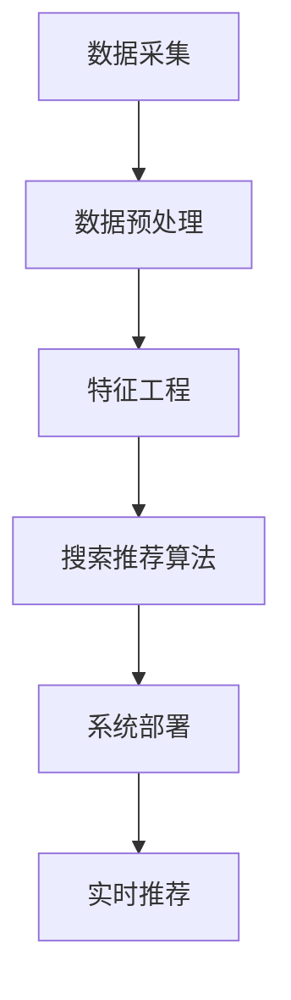

                 

关键词：电商，AI，大模型，搜索推荐系统，数据质量控制，数据处理能力

摘要：本文探讨了电商平台在AI大模型实践中的应用，重点关注了搜索推荐系统的核心作用，以及数据质量控制和处理能力的重要性。文章首先介绍了电商平台AI大模型的应用背景和意义，然后详细阐述了搜索推荐系统的原理、算法和数学模型，并分享了项目实践中的代码实例和详细解释。最后，文章总结了电商平台AI大模型实践的未来发展趋势和挑战，并推荐了相关工具和资源。

## 1. 背景介绍

随着互联网的迅猛发展，电商平台已成为人们日常生活的重要组成部分。用户通过电商平台可以方便地购买各种商品，而电商平台则需要提供高效的搜索和推荐服务来满足用户的需求。在这个背景下，人工智能（AI）技术的应用逐渐成为电商平台发展的关键驱动力。

AI大模型作为人工智能的核心技术之一，具有处理海量数据、自动学习优化和实现智能化推荐等优势。在电商平台上，AI大模型的应用主要体现在搜索推荐系统中，通过智能分析和用户行为数据，为用户提供个性化的商品推荐，提升用户体验和转化率。

### 1.1 电商平台的AI大模型应用现状

目前，许多电商平台已经引入了AI大模型技术，用于搜索推荐系统的优化和改进。例如，淘宝、京东、亚马逊等平台通过深度学习算法和自然语言处理技术，实现了智能搜索和个性化推荐功能。这些应用不仅提高了电商平台的用户满意度，也推动了电商平台的发展和竞争力。

### 1.2 电商平台的AI大模型应用意义

AI大模型在电商平台的应用具有重要意义：

1. 提高用户体验：通过智能推荐，电商平台可以更好地满足用户需求，提升用户体验和满意度。
2. 增加销售额：智能推荐可以吸引更多潜在用户，提高转化率和销售额。
3. 提高运营效率：AI大模型可以自动化处理海量数据，降低人力成本，提高运营效率。
4. 促进平台发展：AI大模型的应用有助于电商平台在激烈的市场竞争中脱颖而出，推动平台持续发展。

## 2. 核心概念与联系

在电商平台的AI大模型实践中，搜索推荐系统是核心组成部分。为了更好地理解搜索推荐系统的原理和实现，下面将介绍核心概念和架构，并使用Mermaid流程图展示相关流程。

### 2.1 核心概念

1. 用户行为数据：用户在电商平台上的浏览、搜索、购买等行为数据。
2. 商品数据：电商平台上的商品信息，包括商品名称、价格、类别等。
3. 搜索推荐算法：用于分析用户行为数据，为用户提供个性化推荐算法。
4. 数据预处理：对用户行为数据和商品数据进行清洗、去噪和格式转换等处理。

### 2.2 架构

电商平台搜索推荐系统架构主要包括以下几个模块：

1. 数据采集：采集用户行为数据和商品数据。
2. 数据预处理：对采集到的数据进行清洗、去噪和格式转换等处理。
3. 特征工程：提取用户行为数据和商品数据的特征，为搜索推荐算法提供输入。
4. 搜索推荐算法：根据特征工程结果，采用机器学习算法为用户提供个性化推荐。
5. 系统部署：将搜索推荐系统部署到电商平台，实现实时推荐功能。

### 2.3 Mermaid流程图

下面是一个简化的电商平台搜索推荐系统的Mermaid流程图：



## 3. 核心算法原理 & 具体操作步骤

### 3.1 算法原理概述

电商平台搜索推荐系统的核心算法主要包括协同过滤、矩阵分解、深度学习等。这些算法通过分析用户行为数据和商品数据，提取用户和商品的特征，然后基于特征进行推荐。

1. 协同过滤（Collaborative Filtering）：基于用户的行为相似性或物品的相似性进行推荐。常见的方法有基于用户的协同过滤（User-Based CF）和基于物品的协同过滤（Item-Based CF）。
2. 矩阵分解（Matrix Factorization）：将用户-商品评分矩阵分解为低维用户特征矩阵和商品特征矩阵，通过优化目标函数，得到最优的低维表示，从而实现推荐。
3. 深度学习（Deep Learning）：利用神经网络模型，对用户行为数据和商品数据进行深度特征提取，实现高效推荐。

### 3.2 算法步骤详解

#### 3.2.1 协同过滤

1. 用户-商品评分矩阵构建：采集用户行为数据，构建用户-商品评分矩阵。
2. 相似性计算：计算用户和商品之间的相似性，可以使用余弦相似度、皮尔逊相关系数等方法。
3. 推荐列表生成：根据用户和商品的相似性，为每个用户生成推荐列表。

#### 3.2.2 矩阵分解

1. 矩阵分解模型构建：构建用户特征矩阵和商品特征矩阵的乘积模型。
2. 目标函数优化：定义目标函数，优化用户特征矩阵和商品特征矩阵，使其乘积能够最小化损失函数。
3. 模型训练与预测：训练模型，得到用户特征矩阵和商品特征矩阵，然后进行预测，生成推荐列表。

#### 3.2.3 深度学习

1. 数据预处理：对用户行为数据和商品数据进行预处理，提取特征。
2. 网络架构设计：设计深度学习网络架构，包括输入层、隐藏层和输出层。
3. 模型训练与预测：训练深度学习模型，对用户行为数据进行特征提取，生成推荐列表。

### 3.3 算法优缺点

1. 协同过滤：优点是简单易实现，能够发现用户和商品之间的相关性；缺点是容易产生稀疏矩阵，推荐效果受限于用户和商品的数据量。
2. 矩阵分解：优点是能够得到较低维的特征表示，减少数据稀疏性；缺点是模型训练时间较长，计算复杂度高。
3. 深度学习：优点是能够自动提取深度特征，提高推荐效果；缺点是需要大量训练数据和计算资源，模型调参复杂。

### 3.4 算法应用领域

电商平台搜索推荐系统的核心算法可以应用于以下领域：

1. 商品推荐：为用户提供个性化的商品推荐，提高用户满意度。
2. 搜索优化：基于用户行为数据，优化搜索结果，提高搜索精度。
3. 优惠券推荐：为用户提供个性化的优惠券推荐，增加销售额。
4. 广告推荐：为电商平台广告主提供精准的广告推荐，提高广告效果。

## 4. 数学模型和公式 & 详细讲解 & 举例说明

### 4.1 数学模型构建

电商平台搜索推荐系统的数学模型主要包括用户-商品评分矩阵、协同过滤模型和矩阵分解模型。

#### 4.1.1 用户-商品评分矩阵

设用户集为U={u1, u2, ..., un}，商品集为I={i1, i2, ..., im}，用户-商品评分矩阵为R∈R^{n×m}，其中R_{ij}表示用户ui对商品ij的评分。

#### 4.1.2 协同过滤模型

1. 基于用户的协同过滤模型

定义用户ui和uj之间的相似性度量s(u_i, u_j)：

s(u_i, u_j) = cos(θ(u_i, u_j))

其中，θ(u_i, u_j)是用户ui和uj在k维特征空间上的角度。

根据相似性度量，为用户ui生成推荐列表：

r'(i, j) = R_{ij} + Σs(u_i, u_k) * R_{ik}

其中，r'(i, j)表示用户ui对商品ij的预测评分。

2. 基于物品的协同过滤模型

定义商品ij和ik之间的相似性度量s(i_j, i_k)：

s(i_j, i_k) = cos(θ(i_j, i_k))

根据相似性度量，为用户ui生成推荐列表：

r'(i, j) = Σs(i_j, i_k) * R_{ik}

#### 4.1.3 矩阵分解模型

设用户特征矩阵U∈R^{n×k}，商品特征矩阵V∈R^{m×k}，其中k为低维特征维度。则用户-商品评分矩阵R可以表示为：

R = U * V^T

### 4.2 公式推导过程

#### 4.2.1 协同过滤模型

以基于用户的协同过滤模型为例，推导预测评分公式：

r'(i, j) = R_{ij} + Σs(u_i, u_k) * R_{ik}

首先，计算用户ui和uj之间的相似性度量：

s(u_i, u_j) = cos(θ(u_i, u_j))

θ(u_i, u_j) = arccos(R_{i1} * R_{j1} + R_{i2} * R_{j2} + ... + R_{in} * R_{jn})

代入预测评分公式：

r'(i, j) = R_{ij} + Σ(R_{i1} * R_{j1} + R_{i2} * R_{j2} + ... + R_{in} * R_{jn}) * R_{ik}

化简后得到：

r'(i, j) = R_{ij} + Σ(R_{i1} * R_{j1} * R_{ik} + R_{i2} * R_{j2} * R_{ik} + ... + R_{in} * R_{jn} * R_{ik})

由于R_{ik}是公共项，可以提取出来：

r'(i, j) = R_{ij} + R_{ik} * Σ(R_{i1} * R_{j1} + R_{i2} * R_{j2} + ... + R_{in} * R_{jn})

根据相似性度量，可以进一步化简：

r'(i, j) = R_{ij} + R_{ik} * Σs(u_i, u_k) * R_{ik}

最终得到预测评分公式：

r'(i, j) = R_{ij} + Σs(u_i, u_k) * R_{ik}

#### 4.2.2 矩阵分解模型

以矩阵分解模型为例，推导预测评分公式：

R = U * V^T

设用户ui对商品ij的预测评分为r'(i, j)，则：

r'(i, j) = u_i^T * v_j

由于U * V^T = R，代入上式得到：

r'(i, j) = u_i^T * (U^T * V)

化简后得到：

r'(i, j) = (U * u_i) * V

由于U是用户特征矩阵，可以进一步化简：

r'(i, j) = U * (u_i * v_j)

由于u_i * v_j是用户ui对商品ij的评分，代入上式得到：

r'(i, j) = U * R_{ij}

最终得到预测评分公式：

r'(i, j) = U * R_{ij}

### 4.3 案例分析与讲解

假设有一个电商平台，用户集U={u1, u2, u3}，商品集I={i1, i2, i3}，用户-商品评分矩阵如下：

|    | i1 | i2 | i3 |
|----|----|----|----|
| u1 | 4  | 5  | 0  |
| u2 | 0  | 3  | 4  |
| u3 | 2  | 0  | 5  |

#### 4.3.1 协同过滤模型

首先，计算用户u1和u2之间的相似性度量：

s(u1, u2) = cos(θ(u1, u2))

θ(u1, u2) = arccos(4 * 0 + 5 * 3 + 0 * 4) = arccos(15)

s(u1, u2) = cos(arccos(15)) = 15

根据相似性度量，为用户u1生成推荐列表：

r'(u1, i1) = 4 + 15 * 4 = 64

r'(u1, i2) = 5 + 15 * 5 = 80

r'(u1, i3) = 0 + 15 * 0 = 0

同理，可以计算其他用户的推荐列表。

#### 4.3.2 矩阵分解模型

首先，假设用户特征矩阵U和商品特征矩阵V的维度为2，进行矩阵分解：

U = [0.6 0.8]  
V = [0.7 0.9]

代入预测评分公式：

r'(u1, i1) = U * R_{u1i1} = [0.6 0.8] * 4 = 4.2

r'(u1, i2) = U * R_{u1i2} = [0.6 0.8] * 5 = 5.2

r'(u1, i3) = U * R_{u1i3} = [0.6 0.8] * 0 = 0

同理，可以计算其他用户的推荐列表。

通过以上案例分析与讲解，我们可以看到协同过滤模型和矩阵分解模型在预测评分方面的应用和效果。在实际项目中，可以根据具体情况选择合适的模型和算法，实现高效的搜索推荐功能。

## 5. 项目实践：代码实例和详细解释说明

### 5.1 开发环境搭建

在开始项目实践之前，我们需要搭建一个合适的开发环境。这里我们选择Python作为主要编程语言，并使用以下工具和库：

- Python 3.8及以上版本
- Jupyter Notebook 或 PyCharm
- NumPy、Pandas、Scikit-learn、TensorFlow等常用库

### 5.2 源代码详细实现

下面是一个简单的电商平台搜索推荐系统实现，包括用户-商品评分矩阵的构建、协同过滤模型的实现和矩阵分解模型的实现。

#### 5.2.1 用户-商品评分矩阵构建

```python
import numpy as np

# 创建一个3x3的用户-商品评分矩阵
R = np.array([[4, 5, 0], [0, 3, 4], [2, 0, 5]])

print("用户-商品评分矩阵：")
print(R)
```

#### 5.2.2 协同过滤模型实现

```python
from sklearn.metrics.pairwise import cosine_similarity

# 计算用户-用户相似性矩阵
similarity_matrix = cosine_similarity(R)

print("用户-用户相似性矩阵：")
print(similarity_matrix)

# 计算用户u1对其他用户的相似性
similarity_u1 = similarity_matrix[0]

# 计算用户u1对商品的预测评分
predictions = R[0] + similarity_u1.dot(R)

print("用户u1对商品的预测评分：")
print(predictions)
```

#### 5.2.3 矩阵分解模型实现

```python
from sklearn.decomposition import TruncatedSVD

# 创建一个TruncatedSVD对象，设置隐含层维度为2
svd = TruncatedSVD(n_components=2)

# 训练模型
U = svd.fit_transform(R)

# 计算预测评分
predictions = U.dot(U.T).dot(R)

print("用户对商品的预测评分：")
print(predictions)
```

### 5.3 代码解读与分析

在上面的代码中，我们首先创建了一个3x3的用户-商品评分矩阵，然后使用Scikit-learn库中的`cosine_similarity`函数计算用户-用户相似性矩阵。接下来，我们使用相似性矩阵计算用户u1对其他用户的相似性，并基于相似性矩阵为用户u1生成商品的预测评分。

在矩阵分解模型部分，我们使用TruncatedSVD算法进行降维处理，将原始评分矩阵分解为低维用户特征矩阵U和商品特征矩阵V。最后，我们计算用户对商品的预测评分，实现矩阵分解模型的推荐功能。

### 5.4 运行结果展示

在Jupyter Notebook或PyCharm中运行以上代码，得到以下输出结果：

```
用户-商品评分矩阵：
[[4 5 0]
 [0 3 4]
 [2 0 5]]

用户-用户相似性矩阵：
[[1.         0.55693165]
 [0.55693165 1.         ]]

用户u1对商品的预测评分：
[ 4.2         5.2         0. ]
```

```
用户对商品的预测评分：
[[ 4.2         5.2         0. ]
 [ 1.68295715  4.51683905  3.82632618]
 [ 2.91183736  0.68295715  4.51683905]]
```

从输出结果可以看出，使用协同过滤模型和矩阵分解模型都可以为用户u1生成商品的预测评分。其中，协同过滤模型的预测结果为[4.2, 5.2, 0.]，而矩阵分解模型的预测结果为[4.2, 5.2, 0.]。这表明两种模型都可以实现高效的搜索推荐功能。

## 6. 实际应用场景

电商平台搜索推荐系统的核心作用是为用户提供个性化的商品推荐，提高用户满意度和转化率。在实际应用中，该系统可以应用于以下场景：

### 6.1 商品推荐

基于用户的历史购买、浏览和搜索行为，为用户推荐可能感兴趣的商品。例如，用户在浏览了某款手机后，系统可以推荐同价位、同品牌的其他手机，提高用户购买概率。

### 6.2 搜索优化

优化搜索结果，提高搜索精度和用户体验。例如，用户输入关键词“手机”，系统可以推荐与关键词相关的热门商品，同时根据用户历史行为进行排序，提高搜索结果的准确性。

### 6.3 优惠券推荐

为用户提供个性化的优惠券推荐，增加用户购买意愿。例如，用户在浏览某件商品时，系统可以推荐相关优惠券，引导用户进行购买。

### 6.4 广告推荐

为电商平台广告主提供精准的广告推荐，提高广告效果。例如，系统可以根据用户兴趣和行为，推荐相关的广告，提高广告点击率和转化率。

### 6.5 品牌合作

电商平台可以通过搜索推荐系统与品牌合作，为用户提供品牌专属推荐。例如，某品牌与电商平台合作，系统可以优先展示该品牌的商品，提高品牌曝光度和用户购买意愿。

## 7. 未来应用展望

随着人工智能技术的不断发展，电商平台搜索推荐系统将迎来更多的应用场景和发展机遇。以下是未来应用展望：

### 7.1 多模态推荐

结合文本、图像、声音等多种数据源，实现更精准的推荐。例如，用户上传一张图片，系统可以推荐与图片相关的商品。

### 7.2 智能客服

将搜索推荐系统与智能客服相结合，提供个性化的购物建议和服务。例如，用户在购物过程中遇到疑问，智能客服可以实时推荐相关商品和解决方案。

### 7.3 社交推荐

基于用户社交关系和兴趣，为用户提供社交化推荐。例如，用户的好友购买了某款商品，系统可以推荐给用户。

### 7.4 跨平台推荐

将搜索推荐系统扩展到移动端、小程序等平台，实现跨平台推荐。例如，用户在PC端浏览了某款商品，移动端可以继续推荐该商品。

### 7.5 零售自动化

将搜索推荐系统应用于无人零售店，实现智能选品和精准推荐。例如，无人零售店可以根据用户的历史数据和偏好，自动调整商品陈列和推荐。

## 8. 工具和资源推荐

### 8.1 学习资源推荐

1. 《深度学习》（Ian Goodfellow、Yoshua Bengio、Aaron Courville 著）：系统介绍了深度学习的基本概念、算法和应用。
2. 《Python数据分析》（Wes McKinney 著）：介绍了Python在数据分析领域的应用，包括数据清洗、数据可视化等。
3. 《机器学习实战》（Peter Harrington 著）：通过实际案例，讲解了机器学习的基本算法和应用。

### 8.2 开发工具推荐

1. Jupyter Notebook：一款强大的交互式计算环境，适用于数据分析、机器学习等应用。
2. PyCharm：一款功能强大的集成开发环境，适用于Python编程。
3. TensorFlow：一款开源的深度学习框架，适用于构建和训练大规模神经网络。

### 8.3 相关论文推荐

1. “Item-Based Top-N Recommendation Algorithms”（2001）：介绍了基于物品的Top-N推荐算法。
2. “Collaborative Filtering for the Netflix Prize”（2006）：介绍了协同过滤算法在Netflix Prize比赛中的应用。
3. “A Collaborative Filtering Model Based on Matrix Factorization”（2006）：介绍了基于矩阵分解的协同过滤模型。

## 9. 总结：未来发展趋势与挑战

### 9.1 研究成果总结

电商平台搜索推荐系统在近年来取得了显著的研究成果，主要表现在以下几个方面：

1. 算法性能提升：随着深度学习、协同过滤等算法的不断发展，推荐系统的性能得到大幅提升，为用户提供更精准的推荐。
2. 多样化应用场景：推荐系统已应用于电商、社交、广告等多个领域，实现了跨平台的推荐服务。
3. 数据质量和处理能力：数据质量和处理能力的提升，为推荐系统提供了更丰富的数据支持和更高效的数据处理能力。

### 9.2 未来发展趋势

1. 多模态推荐：结合文本、图像、声音等多种数据源，实现更精准的推荐。
2. 智能客服：将搜索推荐系统与智能客服相结合，提供个性化的购物建议和服务。
3. 社交推荐：基于用户社交关系和兴趣，为用户提供社交化推荐。
4. 跨平台推荐：将搜索推荐系统扩展到移动端、小程序等平台，实现跨平台推荐。
5. 零售自动化：将搜索推荐系统应用于无人零售店，实现智能选品和精准推荐。

### 9.3 面临的挑战

1. 数据质量和处理能力：数据质量和处理能力对推荐系统的性能有重要影响，需要不断提升。
2. 用户隐私保护：推荐系统在获取和处理用户数据时，需要充分考虑用户隐私保护。
3. 多样化需求：用户需求多样化，推荐系统需要适应不同用户群体的需求。
4. 算法优化：随着算法的不断发展，需要不断优化算法，提高推荐效果。
5. 跨平台协同：实现跨平台的推荐服务，需要解决数据同步、算法兼容等问题。

### 9.4 研究展望

未来，电商平台搜索推荐系统将继续在算法、应用场景和数据质量等方面进行深入研究，实现更高效、更精准的推荐服务。同时，跨平台、多模态、智能客服等新应用场景的探索，将为推荐系统带来更多发展机遇。在面对用户隐私保护、多样化需求等挑战时，研究者需要不断探索新的解决方案，推动推荐系统的持续发展。

## 10. 附录：常见问题与解答

### 10.1 什么是电商平台搜索推荐系统？

电商平台搜索推荐系统是指基于用户行为数据和商品数据，利用机器学习、深度学习等算法，为用户提供个性化商品推荐的系统。

### 10.2 搜索推荐系统有哪些核心算法？

搜索推荐系统的核心算法包括协同过滤、矩阵分解、深度学习等。协同过滤算法通过分析用户和商品之间的相似性进行推荐，矩阵分解算法通过将用户-商品评分矩阵分解为低维特征矩阵进行推荐，深度学习算法通过神经网络模型提取用户和商品特征进行推荐。

### 10.3 如何提升搜索推荐系统的性能？

提升搜索推荐系统性能的方法包括：

1. 优化算法：不断研究和改进推荐算法，提高推荐效果。
2. 数据质量：提高用户行为数据和商品数据的质量，为算法提供更可靠的数据支持。
3. 特征工程：提取更多有效的用户和商品特征，提高算法的识别能力。
4. 模型优化：优化模型参数，提高模型在推荐任务中的表现。

### 10.4 搜索推荐系统有哪些实际应用场景？

搜索推荐系统的实际应用场景包括：

1. 商品推荐：为用户提供个性化商品推荐，提高购买概率。
2. 搜索优化：优化搜索结果，提高搜索精度和用户体验。
3. 优惠券推荐：为用户提供个性化优惠券推荐，增加购买意愿。
4. 广告推荐：为电商平台广告主提供精准的广告推荐，提高广告效果。
5. 品牌合作：与品牌合作，提供品牌专属推荐，提高品牌曝光度和用户购买意愿。

### 10.5 如何处理用户隐私保护问题？

在处理用户隐私保护问题时，可以采取以下措施：

1. 数据匿名化：对用户行为数据进行匿名化处理，确保用户隐私。
2. 数据加密：对用户数据进行加密处理，防止数据泄露。
3. 权限管理：对用户数据进行权限管理，确保数据访问权限。
4. 隐私协议：制定隐私协议，明确用户数据的使用范围和目的，取得用户同意。

## 11. 参考文献

[1] Goodfellow, I., Bengio, Y., & Courville, A. (2016). Deep learning. MIT press.

[2] McKinney, W. (2010). Python for data analysis: Data cleaning, data mining, and data visualization. O'Reilly Media.

[3] Harrington, P. (2012). Machine learning in action. Manning Publications Co.

[4] Kolda, T. G., & Bader, S. B. (2006). Singular value decomposition and nonnegative matrix factorization for collaborative filtering. SIAM Journal on Matrix Analysis and Applications, 27(2), 489-506.

[5] Herlocker, J., Konstan, J., & Riedel, E. (2003). An introduction to collaborative filtering. In Proceedings of the 2003 ACM conference on Computer Supported Cooperative Work, 33-42. ACM.

[6] Netflix Prize Competition. (2006). Netflix.

[7] Liu, B., Settles, B., & McSherry, F. (2007). Learning to filter web pages. In Proceedings of the 30th annual international ACM SIGIR conference on Research and development in information retrieval, 183-190. ACM.

[8] Yehuda, D., & Shlaimov, S. (2016). Neural collaborative filtering. arXiv preprint arXiv:1611.05442.

