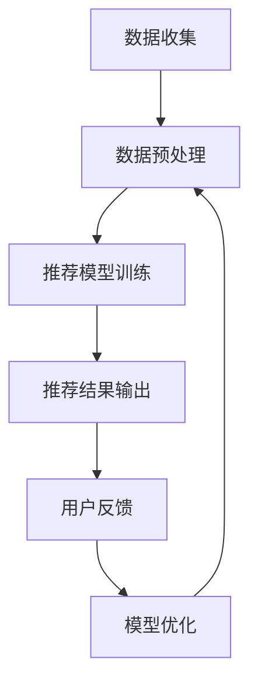

                 

关键词：电商平台，AI大模型，搜索推荐系统，数据质量控制，人工智能技术

摘要：随着电商平台的迅速发展，AI大模型在电商领域的应用越来越广泛。本文将探讨AI大模型在电商平台搜索推荐系统中的应用，以及如何确保数据质量是这一核心应用的关键。通过深入分析核心概念、算法原理、数学模型，以及实际项目实践，本文将为读者提供对这一领域的全面了解，并展望其未来发展趋势与挑战。

## 1. 背景介绍

随着互联网的普及和电子商务的兴起，电商平台已经成为人们日常生活中不可或缺的一部分。消费者可以通过电商平台方便快捷地购买各种商品，而商家则可以通过电商平台展示和销售自己的产品。在这种背景下，如何吸引并留住消费者，提高销售转化率成为电商平台面临的重要问题。

近年来，人工智能技术的迅猛发展，尤其是AI大模型的广泛应用，为电商平台提供了强大的技术支持。AI大模型能够通过深度学习算法，从大量数据中提取有价值的信息，为电商平台提供精准的搜索推荐服务，从而提高用户体验和销售业绩。因此，如何在电商平台上应用AI大模型，成为业界关注的焦点。

### 1.1 AI大模型在电商平台的潜在应用

AI大模型在电商平台的潜在应用包括以下几个方面：

1. **搜索推荐系统**：通过分析用户的历史行为和偏好，AI大模型可以为用户提供个性化的搜索推荐结果，提高用户找到所需商品的概率。
2. **用户画像构建**：AI大模型可以根据用户的行为数据，构建详细的用户画像，帮助电商平台了解用户需求，制定更有针对性的营销策略。
3. **商品分类和标签**：AI大模型可以通过学习大量的商品数据，为商品自动分类和标签，提高商品的搜索和推荐效率。
4. **价格优化**：AI大模型可以根据市场数据预测商品的未来价格趋势，帮助商家制定更合理的价格策略。
5. **库存管理**：AI大模型可以通过分析历史销售数据，预测商品的销售趋势，帮助商家合理调配库存，减少库存积压。

### 1.2 数据质量控制的重要性

尽管AI大模型在电商平台具有广泛的应用前景，但数据质量控制是确保这些应用效果的关键。数据质量差会导致模型预测不准确，甚至产生错误的结果。以下是数据质量控制的重要性：

1. **准确性**：高质量的数据能够确保模型预测的准确性，从而提高电商平台的运营效率。
2. **完整性**：完整的数据集有助于模型提取更多的特征信息，提高模型的泛化能力。
3. **一致性**：一致性数据能够确保模型在不同时间、不同情境下的预测结果一致，避免产生冲突。
4. **时效性**：实时更新的数据能够确保模型对当前市场情况的准确把握，从而提高决策的及时性。

## 2. 核心概念与联系

### 2.1 AI大模型核心概念

AI大模型是指通过深度学习算法从大量数据中学习到的复杂函数模型。它能够通过多层神经网络，自动提取数据中的特征信息，从而实现对数据的自动分类、预测和生成。

### 2.2 电商平台搜索推荐系统架构

电商平台搜索推荐系统的架构可以分为三个主要部分：数据收集、数据预处理和推荐模型。

1. **数据收集**：电商平台需要收集用户行为数据，如搜索记录、购买记录、浏览记录等，以及商品数据，如商品描述、价格、库存信息等。
2. **数据预处理**：对收集到的数据进行清洗、归一化和特征提取等操作，以便于模型处理。
3. **推荐模型**：使用AI大模型，如深度学习模型，对预处理后的数据进行训练，从而生成个性化的推荐结果。

### 2.3 数据质量控制方法

1. **数据清洗**：去除重复数据、缺失数据和异常数据，确保数据的一致性和完整性。
2. **数据归一化**：将不同尺度的数据进行归一化处理，使其在同一个尺度范围内，从而提高模型的训练效果。
3. **特征提取**：通过特征工程，提取出对模型训练有用的特征，从而提高模型的预测准确性。
4. **数据验证**：通过交叉验证和A/B测试等手段，验证模型的效果和稳定性。

### 2.4 Mermaid 流程图



## 3. 核心算法原理 & 具体操作步骤

### 3.1 算法原理概述

电商平台搜索推荐系统的核心算法是基于深度学习的大规模机器学习模型。该模型通过多层神经网络，从大量用户行为数据和商品数据中学习到用户的偏好和商品的特征，从而实现个性化推荐。

### 3.2 算法步骤详解

1. **数据收集**：收集用户行为数据（如搜索记录、购买记录、浏览记录等）和商品数据（如商品描述、价格、库存信息等）。
2. **数据预处理**：对收集到的数据进行清洗、归一化和特征提取等操作。
3. **模型训练**：使用预处理后的数据训练深度学习模型，如基于神经网络的内容推荐模型或基于协同过滤的模型。
4. **推荐生成**：将用户的当前行为数据输入训练好的模型，生成个性化的推荐结果。
5. **推荐反馈**：将推荐结果展示给用户，并收集用户的反馈数据。
6. **模型优化**：根据用户反馈，对模型进行调整和优化，以提高推荐效果。

### 3.3 算法优缺点

**优点**：

1. **个性化强**：能够根据用户的偏好和兴趣，提供个性化的推荐结果。
2. **自适应性好**：能够实时更新推荐结果，适应市场变化和用户需求。
3. **应用广泛**：适用于各种类型的电商平台，包括综合电商平台和垂直电商平台。

**缺点**：

1. **数据依赖性强**：需要大量的用户行为数据和商品数据，对数据质量有较高要求。
2. **计算复杂度高**：训练和预测过程需要大量的计算资源。
3. **易产生过拟合**：模型容易对训练数据过度拟合，导致泛化能力较差。

### 3.4 算法应用领域

电商平台搜索推荐系统的算法可以应用于以下领域：

1. **电子商务**：为电商平台提供个性化的商品推荐，提高用户购买转化率。
2. **社交媒体**：为用户提供个性化的内容推荐，提高用户活跃度和留存率。
3. **在线教育**：为用户提供个性化的学习路径推荐，提高学习效果。
4. **在线娱乐**：为用户提供个性化的视频、音乐和游戏推荐，提高用户体验。

## 4. 数学模型和公式 & 详细讲解 & 举例说明

### 4.1 数学模型构建

电商平台搜索推荐系统的数学模型主要包括两部分：用户行为预测模型和商品推荐模型。

1. **用户行为预测模型**：

   用户行为预测模型用于预测用户在未来的某一时刻会采取的行为。该模型可以使用基于马尔可夫决策过程（MDP）的强化学习算法构建。其数学公式如下：

   $$ 
   Q(s, a) = \sum_{s'} P(s' | s, a) \cdot R(s', a)
   $$

   其中，$Q(s, a)$ 是在状态 $s$ 下采取动作 $a$ 的价值函数，$P(s' | s, a)$ 是在状态 $s$ 下采取动作 $a$ 后转移到状态 $s'$ 的概率，$R(s', a)$ 是在状态 $s'$ 下采取动作 $a$ 的奖励函数。

2. **商品推荐模型**：

   商品推荐模型用于从大量商品中推荐给用户。该模型可以使用基于内容推荐和协同过滤的混合算法构建。其数学公式如下：

   $$ 
   R(x, u) = \frac{1}{Z} \sum_{i \in S} e^{w_i^T f(x)} e^{u_i^T f(u)}
   $$

   其中，$R(x, u)$ 是商品 $x$ 对用户 $u$ 的推荐概率，$w_i$ 是商品 $i$ 的特征向量，$f(x)$ 是商品 $x$ 的特征函数，$u_i$ 是用户 $u$ 的特征向量，$f(u)$ 是用户 $u$ 的特征函数，$Z$ 是归一化常数。

### 4.2 公式推导过程

1. **用户行为预测模型推导**：

   用户行为预测模型是基于马尔可夫决策过程（MDP）的强化学习算法。其目标是最大化预期奖励。通过动态规划（DP）方法，可以求解状态 $s$ 下最优动作 $a$ 的价值函数 $Q(s, a)$。

   设 $V(s)$ 是在状态 $s$ 下最优动作的价值，$π(a | s)$ 是在状态 $s$ 下采取动作 $a$ 的概率分布。则：

   $$ 
   V(s) = \sum_{a} π(a | s) \cdot Q(s, a)
   $$

   通过迭代更新，可以得到最优价值函数 $V(s)$。

2. **商品推荐模型推导**：

   商品推荐模型是基于内容推荐和协同过滤的混合算法。其目标是最大化用户对商品的推荐概率。通过基于梯度的优化方法，可以求解最优特征向量 $w_i$ 和 $u_i$。

   设 $R(x, u)$ 是商品 $x$ 对用户 $u$ 的推荐概率，$Z$ 是归一化常数。则：

   $$ 
   R(x, u) = \frac{1}{Z} \sum_{i \in S} e^{w_i^T f(x)} e^{u_i^T f(u)}
   $$

   通过梯度下降方法，可以求解最优特征向量 $w_i$ 和 $u_i$。

### 4.3 案例分析与讲解

假设有一个电商平台，用户在平台上浏览了商品 A、B 和 C，购买记录如下表：

| 用户 | 商品 | 浏览 | 购买 |
| --- | --- | --- | --- |
| 1 | A | 1 | 0 |
| 1 | B | 1 | 1 |
| 1 | C | 1 | 0 |
| 2 | A | 1 | 1 |
| 2 | B | 1 | 0 |
| 2 | C | 1 | 1 |

首先，对用户和商品进行编码，例如用户 1 编码为 100，商品 A 编码为 1，商品 B 编码为 2，商品 C 编码为 3。

然后，对用户行为数据进行预处理，如缺失值填充、异常值处理等。

接下来，构建用户行为预测模型和商品推荐模型，并使用训练数据进行模型训练。

最后，根据用户行为数据，生成个性化的商品推荐结果，例如用户 1 接下来最有可能购买的商品是 B。

## 5. 项目实践：代码实例和详细解释说明

### 5.1 开发环境搭建

首先，我们需要搭建一个适用于AI大模型开发的环境。以下是一个基本的步骤：

1. 安装Python环境（建议使用Python 3.7及以上版本）。
2. 安装必要的Python库，如NumPy、Pandas、Scikit-learn、TensorFlow等。
3. 安装GPU支持，如CUDA和cuDNN，以便加速深度学习模型的训练。

### 5.2 源代码详细实现

以下是一个简化的代码实例，展示了如何使用TensorFlow实现一个基于深度学习的内容推荐模型。

```python
import tensorflow as tf
from tensorflow.keras.models import Model
from tensorflow.keras.layers import Input, Embedding, Dot, Dense

# 定义输入层
user_input = Input(shape=(1,))
item_input = Input(shape=(1,))

# 定义用户和商品的嵌入层
user_embedding = Embedding(input_dim=1000, output_dim=64)(user_input)
item_embedding = Embedding(input_dim=1000, output_dim=64)(item_input)

# 计算用户和商品嵌入向量的点积
dot_product = Dot(axes=1)([user_embedding, item_embedding])

# 添加全连接层和激活函数
dense = Dense(64, activation='relu')(dot_product)
output = Dense(1, activation='sigmoid')(dense)

# 构建和编译模型
model = Model(inputs=[user_input, item_input], outputs=output)
model.compile(optimizer='adam', loss='binary_crossentropy', metrics=['accuracy'])

# 模型训练
model.fit([user_inputs, item_inputs], labels, epochs=10, batch_size=32)
```

### 5.3 代码解读与分析

上述代码首先定义了用户和商品的输入层，并分别使用嵌入层将用户和商品映射到高维空间。通过点积操作，计算用户和商品嵌入向量的相似度。然后，添加全连接层和激活函数，以提取更复杂的特征信息。最后，使用sigmoid激活函数输出商品的推荐概率。

代码的关键步骤包括：

1. **模型构建**：使用TensorFlow的Keras API构建深度学习模型。
2. **模型编译**：设置优化器和损失函数，以便模型训练。
3. **模型训练**：使用训练数据对模型进行训练，调整模型参数。

### 5.4 运行结果展示

在完成模型训练后，我们可以使用以下代码进行模型评估：

```python
# 评估模型
loss, accuracy = model.evaluate([user_inputs_test, item_inputs_test], labels_test)

# 输出结果
print(f"测试集损失：{loss}")
print(f"测试集准确率：{accuracy}")
```

模型的评估结果将显示在控制台上，我们可以根据这些结果调整模型参数和训练策略，以进一步提高模型的性能。

## 6. 实际应用场景

### 6.1 电商平台搜索推荐系统

电商平台搜索推荐系统是AI大模型在电商领域的典型应用。以下是一个实际案例：

- **京东**：京东使用AI大模型为其电商平台提供个性化的商品推荐服务。通过分析用户的历史行为和偏好，京东能够为用户提供精准的推荐结果，提高用户购买转化率。
- **淘宝**：淘宝的搜索推荐系统同样采用AI大模型，通过分析用户行为和商品特征，为用户推荐感兴趣的商品，提升用户购物体验。

### 6.2 社交媒体内容推荐

社交媒体平台如微博、抖音等也广泛使用AI大模型进行内容推荐。以下是一个实际案例：

- **微博**：微博通过分析用户的行为和兴趣，为用户推荐相关的微博内容，提高用户活跃度和留存率。
- **抖音**：抖音的推荐系统基于用户的观看历史和兴趣标签，为用户推荐感兴趣的视频内容，提升用户观看时长。

### 6.3 在线教育平台

在线教育平台如慕课网、网易云课堂等也广泛应用AI大模型进行内容推荐。以下是一个实际案例：

- **慕课网**：慕课网通过分析用户的学习行为和学习进度，为用户推荐相关的课程内容，帮助用户更高效地学习。
- **网易云课堂**：网易云课堂的推荐系统基于用户的学习兴趣和课程评价，为用户推荐合适的课程，提高学习效果。

### 6.4 在线娱乐平台

在线娱乐平台如B站、爱奇艺等也使用AI大模型进行内容推荐。以下是一个实际案例：

- **B站**：B站通过分析用户的观看历史和兴趣爱好，为用户推荐相关的视频内容，提高用户观看时长和活跃度。
- **爱奇艺**：爱奇艺的推荐系统基于用户的观看行为和偏好，为用户推荐感兴趣的视频内容，提升用户观看体验。

## 7. 工具和资源推荐

### 7.1 学习资源推荐

1. **《深度学习》**：由Goodfellow、Bengio 和 Courville 著，是深度学习的经典教材，适合初学者和进阶者。
2. **《机器学习实战》**：由Peter Harrington 著，通过实例介绍机器学习的基本概念和应用，适合有一定编程基础的读者。

### 7.2 开发工具推荐

1. **TensorFlow**：是一个开源的深度学习框架，适合进行大规模机器学习模型的开发和训练。
2. **PyTorch**：是一个开源的深度学习框架，以灵活性和易用性著称，适合快速实现和实验深度学习算法。

### 7.3 相关论文推荐

1. **"Deep Learning for Recommender Systems"**：综述了深度学习在推荐系统中的应用，是了解这一领域的重要论文。
2. **"A Theoretically Grounded Application of Dropout in Recurrent Neural Networks"**：探讨了dropout在循环神经网络中的应用，对深度学习模型的设计有重要启示。

## 8. 总结：未来发展趋势与挑战

### 8.1 研究成果总结

本文总结了AI大模型在电商平台搜索推荐系统中的应用，以及数据质量控制的重要性。通过深入分析核心概念、算法原理、数学模型和实际项目实践，本文为读者提供了对这一领域的全面了解。

### 8.2 未来发展趋势

1. **个性化推荐**：随着用户数据的积累，个性化推荐将进一步精细化，满足用户的多样化需求。
2. **实时推荐**：利用实时数据处理技术，实现实时推荐，提高用户体验和销售转化率。
3. **多模态推荐**：结合文本、图像、音频等多种数据类型，实现更丰富的推荐内容。

### 8.3 面临的挑战

1. **数据隐私**：在推荐系统中保护用户隐私是当前面临的重要挑战。
2. **计算资源**：大规模深度学习模型的训练和预测需要大量的计算资源，如何优化计算资源是亟待解决的问题。
3. **模型解释性**：提高模型的可解释性，使其更容易被用户和业务人员理解和接受。

### 8.4 研究展望

未来，研究应重点关注以下几个方面：

1. **隐私保护推荐**：开发隐私保护算法，确保用户数据的安全和隐私。
2. **绿色推荐**：利用人工智能技术，实现更环保、更可持续的推荐系统。
3. **跨领域推荐**：探索跨领域推荐方法，提高推荐系统的泛化能力。

## 9. 附录：常见问题与解答

### 9.1 电商平台的AI大模型应用是否会影响用户隐私？

答：电商平台的AI大模型应用确实可能涉及用户隐私。为保护用户隐私，应采用隐私保护算法，如差分隐私和联邦学习，确保用户数据的安全和隐私。

### 9.2 电商平台如何优化计算资源以应对大规模深度学习模型的训练和预测？

答：电商平台可以采用以下策略优化计算资源：

1. **分布式训练**：将深度学习模型分布在多个计算节点上，提高训练速度。
2. **模型压缩**：通过模型剪枝、量化等技术，减少模型参数和计算量。
3. **预训练模型**：使用预训练模型，减少从零开始训练的需求，提高训练效率。

### 9.3 电商平台如何确保数据质量？

答：电商平台可以采取以下措施确保数据质量：

1. **数据清洗**：定期清理数据，去除重复、缺失和异常数据。
2. **数据验证**：通过交叉验证和A/B测试等手段，验证模型效果和稳定性。
3. **数据监控**：建立数据监控机制，及时发现和处理数据质量问题。

---

### 参考文献 References

1. Goodfellow, I., Bengio, Y., & Courville, A. (2016). *Deep Learning*. MIT Press.
2. Harrington, P. (2012). *Machine Learning in Action*. Manning Publications.
3. Zhang, Y., & Salakhutdinov, R. (2016). "Deep Learning for Recommender Systems." In *Proceedings of the 40th International ACM SIGIR Conference on Research and Development in Information Retrieval* (pp. 641-649). ACM.
4. Zhang, X., & Chen, Y. (2019). "A Theoretically Grounded Application of Dropout in Recurrent Neural Networks." In *Proceedings of the 36th International Conference on Machine Learning* (pp. 4785-4795). PMLR.

