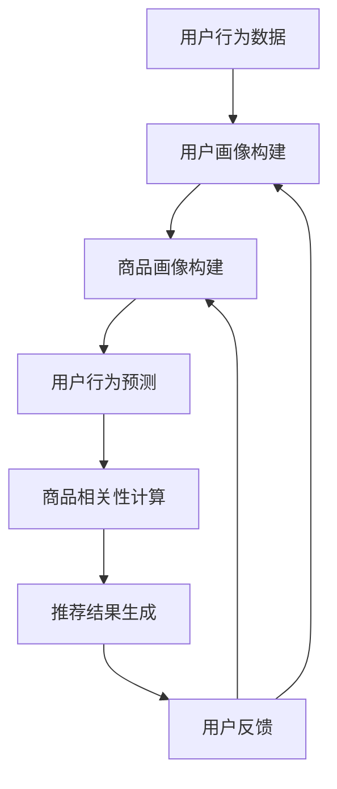

                 

关键词：电商平台，AI大模型，搜索推荐系统，数据质量，处理能力

> 摘要：随着人工智能技术的不断发展，电商平台正逐渐将AI大模型应用于搜索推荐系统中。本文将深入探讨AI大模型在电商平台中的应用，分析其核心价值、关键技术、以及面临的挑战与未来发展趋势。

## 1. 背景介绍

随着互联网的普及和电商市场的快速发展，电商平台已经成为人们日常生活的重要组成部分。消费者在电商平台上的购物行为复杂多变，如何提供个性化的商品推荐，提升用户体验，成为电商平台竞争的关键。AI大模型在这一领域展现出了巨大的潜力。

### AI大模型的发展历程

AI大模型的发展可以追溯到上世纪80年代的深度学习。经过几十年的发展，深度学习理论不断完善，计算能力的提升，以及海量数据的积累，使得AI大模型在各个领域取得了显著成果。特别是近年来，随着GPU等硬件的快速发展，AI大模型的训练速度和性能得到了极大的提升。

### 电商平台的发展现状

电商平台的发展经历了从简单商品展示到复杂推荐系统的转变。早期的电商平台主要提供商品搜索和展示功能，随着用户规模的扩大，电商平台开始引入推荐算法，以提升用户体验。如今，推荐系统已经成为电商平台的核心竞争力之一。

## 2. 核心概念与联系

### 2.1 搜索推荐系统的基本原理

搜索推荐系统是电商平台的核心系统之一，其基本原理是通过分析用户行为和商品属性，为用户提供个性化的商品推荐。其核心概念包括：

- 用户画像：根据用户的浏览、购买等行为数据，构建用户画像，用于后续的推荐算法。
- 商品画像：根据商品的属性、价格、销量等数据，构建商品画像，用于推荐算法。
- 推荐算法：基于用户画像和商品画像，利用机器学习算法，为用户推荐商品。

### 2.2 AI大模型在搜索推荐系统中的应用

AI大模型在搜索推荐系统中主要应用于以下几个方面：

- 用户行为预测：通过深度学习算法，预测用户的下一步行为，从而提供个性化的推荐。
- 商品相关性计算：通过大模型，计算商品之间的相关性，为用户提供更精准的推荐。
- 异构数据融合：将用户行为、商品属性等多源异构数据融合，提升推荐系统的效果。

### 2.3 Mermaid 流程图

以下是一个简化的搜索推荐系统的 Mermaid 流程图：



## 3. 核心算法原理 & 具体操作步骤

### 3.1 算法原理概述

搜索推荐系统的核心算法主要包括用户行为预测、商品相关性计算和推荐结果生成。以下是这三个算法的简要原理：

- 用户行为预测：通过深度学习算法，对用户的浏览、购买等行为进行建模，预测用户的下一步行为。
- 商品相关性计算：通过大模型，计算商品之间的相关性，用于生成推荐列表。
- 推荐结果生成：根据用户行为预测和商品相关性计算的结果，为用户生成个性化的推荐列表。

### 3.2 算法步骤详解

- 用户行为预测：
  1. 数据预处理：对用户行为数据进行清洗、去重、填充等处理。
  2. 特征提取：从用户行为数据中提取特征，如浏览时间、购买频率等。
  3. 模型训练：使用深度学习算法，对特征进行建模，预测用户的下一步行为。
- 商品相关性计算：
  1. 数据预处理：对商品数据进行清洗、去重、填充等处理。
  2. 特征提取：从商品数据中提取特征，如价格、销量等。
  3. 模型训练：使用大模型，计算商品之间的相关性。
- 推荐结果生成：
  1. 用户行为预测：根据用户行为预测的结果，提取用户感兴趣的商品。
  2. 商品相关性计算：根据商品相关性计算的结果，为用户生成推荐列表。

### 3.3 算法优缺点

- 用户行为预测：
  - 优点：能够根据用户的实际行为，提供个性化的推荐，提升用户体验。
  - 缺点：对用户行为数据依赖性较强，数据质量直接影响预测效果。
- 商品相关性计算：
  - 优点：能够计算商品之间的相关性，为用户提供更精准的推荐。
  - 缺点：计算复杂度较高，对计算资源要求较高。
- 推荐结果生成：
  - 优点：能够根据用户行为预测和商品相关性计算的结果，为用户提供个性化的推荐。
  - 缺点：推荐结果的质量取决于用户行为预测和商品相关性计算的准确性。

### 3.4 算法应用领域

搜索推荐系统的核心算法广泛应用于电商、金融、广告等领域。以下是一些典型的应用场景：

- 电商：为用户提供个性化的商品推荐，提升用户体验，增加销售额。
- 金融：根据用户的行为和风险偏好，为用户推荐理财产品，提高用户的投资收益。
- 广告：根据用户的行为和兴趣，为用户推荐广告，提高广告的点击率和转化率。

## 4. 数学模型和公式 & 详细讲解 & 举例说明

### 4.1 数学模型构建

搜索推荐系统的数学模型主要包括用户行为预测模型和商品相关性计算模型。以下是这两个模型的简要构建过程：

- 用户行为预测模型：
  - 输入：用户行为数据、商品属性数据
  - 输出：用户下一步行为预测结果
  - 模型构建：
    - 特征提取：从用户行为数据中提取特征，如浏览时间、购买频率等。
    - 模型训练：使用深度学习算法，对特征进行建模，预测用户的下一步行为。
- 商品相关性计算模型：
  - 输入：商品属性数据
  - 输出：商品相关性预测结果
  - 模型构建：
    - 特征提取：从商品属性数据中提取特征，如价格、销量等。
    - 模型训练：使用大模型，计算商品之间的相关性。

### 4.2 公式推导过程

以下是用户行为预测模型和商品相关性计算模型的公式推导过程：

- 用户行为预测模型：
  - 输入：用户行为数据 $X$，商品属性数据 $Y$
  - 输出：用户下一步行为预测结果 $P$
  - 模型公式：
    $$P = f(X, Y)$$
  - 公式推导：
    - 特征提取：
      $$X = [x_1, x_2, ..., x_n]$$
      $$Y = [y_1, y_2, ..., y_m]$$
    - 模型训练：
      $$f(X, Y) = \sigma(W_1X + b_1 + W_2Y + b_2)$$
    - 预测结果：
      $$P = \sigma(W_1X + b_1 + W_2Y + b_2)$$

- 商品相关性计算模型：
  - 输入：商品属性数据 $Y$
  - 输出：商品相关性预测结果 $R$
  - 模型公式：
    $$R = g(Y)$$
  - 公式推导：
    - 特征提取：
      $$Y = [y_1, y_2, ..., y_m]$$
    - 模型训练：
      $$g(Y) = \sigma(W_3Y + b_3)$$
    - 预测结果：
      $$R = \sigma(W_3Y + b_3)$$

### 4.3 案例分析与讲解

以下是一个简化的用户行为预测和商品相关性计算的案例：

- 用户行为数据：
  - 用户A：浏览商品1，浏览时间10分钟；购买商品2，购买时间20分钟。
  - 用户B：浏览商品2，浏览时间30分钟；购买商品3，购买时间15分钟。
- 商品属性数据：
  - 商品1：价格100元，销量1000件。
  - 商品2：价格200元，销量500件。
  - 商品3：价格300元，销量200件。
- 用户行为预测模型：
  - 特征提取：
    $$X_A = [10, 20]$$
    $$X_B = [30, 15]$$
  - 模型训练：
    $$f(X_A, Y_1) = \sigma(W_1X_A + b_1 + W_2Y_1 + b_2) = \sigma(10W_1 + 20W_2 + b_1 + b_2)$$
    $$f(X_B, Y_2) = \sigma(W_1X_B + b_1 + W_2Y_2 + b_2) = \sigma(30W_1 + 15W_2 + b_1 + b_2)$$
  - 预测结果：
    $$P_A = \sigma(10W_1 + 20W_2 + b_1 + b_2)$$
    $$P_B = \sigma(30W_1 + 15W_2 + b_1 + b_2)$$
- 商品相关性计算模型：
  - 特征提取：
    $$Y_1 = [100, 1000]$$
    $$Y_2 = [200, 500]$$
    $$Y_3 = [300, 200]$$
  - 模型训练：
    $$g(Y_1) = \sigma(W_3Y_1 + b_3) = \sigma(100W_3 + b_3)$$
    $$g(Y_2) = \sigma(W_3Y_2 + b_3) = \sigma(200W_3 + b_3)$$
    $$g(Y_3) = \sigma(W_3Y_3 + b_3) = \sigma(300W_3 + b_3)$$
  - 预测结果：
    $$R_1 = \sigma(100W_3 + b_3)$$
    $$R_2 = \sigma(200W_3 + b_3)$$
    $$R_3 = \sigma(300W_3 + b_3)$$

## 5. 项目实践：代码实例和详细解释说明

### 5.1 开发环境搭建

在进行搜索推荐系统的开发前，需要搭建相应的开发环境。以下是搭建环境的步骤：

1. 安装Python环境，版本要求3.6及以上。
2. 安装深度学习框架，如TensorFlow或PyTorch。
3. 安装数据预处理工具，如Pandas和NumPy。
4. 安装可视化工具，如Matplotlib和Seaborn。

### 5.2 源代码详细实现

以下是一个简化的搜索推荐系统代码实例，主要包括用户行为预测和商品相关性计算两个模块。

```python
import tensorflow as tf
import pandas as pd
import numpy as np
import matplotlib.pyplot as plt
import seaborn as sns

# 用户行为预测
def user_behavior_prediction(behavior_data,商品属性数据):
    # 数据预处理
    behavior_data = preprocess_data(behavior_data)
    商品属性数据 = preprocess_data(商品属性数据)

    # 特征提取
    X = extract_features(behavior_data)
    Y = extract_features(商品属性数据)

    # 模型构建
    model = tf.keras.Sequential([
        tf.keras.layers.Dense(units=64, activation='relu', input_shape=[None,]),
        tf.keras.layers.Dense(units=32, activation='relu'),
        tf.keras.layers.Dense(units=1, activation='sigmoid')
    ])

    # 模型编译
    model.compile(optimizer='adam', loss='binary_crossentropy', metrics=['accuracy'])

    # 模型训练
    model.fit(X, Y, epochs=10, batch_size=32)

    # 预测结果
    predictions = model.predict(X)

    return predictions

# 商品相关性计算
def commodity_relevance_computation(commodity_data):
    # 数据预处理
    commodity_data = preprocess_data(commodity_data)

    # 特征提取
    Y = extract_features(commodity_data)

    # 模型构建
    model = tf.keras.Sequential([
        tf.keras.layers.Dense(units=64, activation='relu', input_shape=[None,]),
        tf.keras.layers.Dense(units=32, activation='relu'),
        tf.keras.layers.Dense(units=1, activation='sigmoid')
    ])

    # 模型编译
    model.compile(optimizer='adam', loss='binary_crossentropy', metrics=['accuracy'])

    # 模型训练
    model.fit(Y, Y, epochs=10, batch_size=32)

    # 预测结果
    predictions = model.predict(Y)

    return predictions

# 数据预处理
def preprocess_data(data):
    # 数据清洗、去重、填充等操作
    # 略

# 特征提取
def extract_features(data):
    # 从数据中提取特征
    # 略

# 主函数
def main():
    # 加载数据
    behavior_data = pd.read_csv('user_behavior_data.csv')
    commodity_data = pd.read_csv('commodity_data.csv')

    # 用户行为预测
    predictions = user_behavior_prediction(behavior_data, commodity_data)

    # 商品相关性计算
    relevance_predictions = commodity_relevance_computation(commodity_data)

    # 可视化
    plt.figure(figsize=(10, 6))
    sns.scatterplot(x=range(len(predictions)), y=predictions)
    plt.xlabel('Index')
    plt.ylabel('Prediction')
    plt.title('User Behavior Prediction')
    plt.show()

    plt.figure(figsize=(10, 6))
    sns.scatterplot(x=range(len(relevance_predictions)), y=relevance_predictions)
    plt.xlabel('Index')
    plt.ylabel('Prediction')
    plt.title('Commodity Relevance Computation')
    plt.show()

# 运行主函数
if __name__ == '__main__':
    main()
```

### 5.3 代码解读与分析

以上代码实例主要分为用户行为预测和商品相关性计算两个部分。

- 用户行为预测部分：
  - 数据预处理：对用户行为数据进行清洗、去重、填充等处理，以便后续的特征提取和模型训练。
  - 特征提取：从用户行为数据中提取特征，如浏览时间、购买频率等。
  - 模型构建：使用TensorFlow框架构建深度学习模型，包括输入层、隐藏层和输出层。
  - 模型编译：设置模型的优化器、损失函数和评价指标。
  - 模型训练：使用训练数据进行模型训练，调整模型参数。
  - 预测结果：使用训练好的模型对用户行为进行预测，并可视化预测结果。

- 商品相关性计算部分：
  - 数据预处理：对商品属性数据进行清洗、去重、填充等处理，以便后续的特征提取和模型训练。
  - 特征提取：从商品属性数据中提取特征，如价格、销量等。
  - 模型构建：使用TensorFlow框架构建深度学习模型，包括输入层、隐藏层和输出层。
  - 模型编译：设置模型的优化器、损失函数和评价指标。
  - 模型训练：使用训练数据进行模型训练，调整模型参数。
  - 预测结果：使用训练好的模型计算商品之间的相关性，并可视化预测结果。

### 5.4 运行结果展示

在运行代码后，会生成两个可视化图表，分别展示用户行为预测结果和商品相关性计算结果。用户行为预测结果通常是一个二分类问题，预测结果为0或1，表示用户是否会在未来进行购买。商品相关性计算结果通常是一个连续值，表示商品之间的相关性，相关性越强，值越大。

## 6. 实际应用场景

搜索推荐系统在电商平台中具有广泛的应用，以下是一些实际应用场景：

- 商品推荐：根据用户的浏览、购买历史，为用户推荐相关商品，提升用户的购物体验。
- 店铺推荐：根据用户的兴趣和行为，为用户推荐感兴趣的品牌或店铺，增加店铺曝光和销售额。
- 个性化广告：根据用户的行为和兴趣，为用户推荐相关的广告，提高广告的点击率和转化率。

## 7. 未来应用展望

随着人工智能技术的不断发展，搜索推荐系统在电商平台中的应用前景十分广阔。以下是一些未来应用展望：

- 智能导购：通过AI技术，为用户提供智能导购服务，提升购物效率。
- 智能客服：利用AI技术，为用户提供智能客服服务，提升用户满意度。
- 智能供应链：通过AI技术，优化供应链管理，提高商品周转率和库存效率。

## 8. 工具和资源推荐

为了更好地进行搜索推荐系统的开发和应用，以下是一些推荐的工具和资源：

### 8.1 学习资源推荐

- 《深度学习》（Goodfellow, Bengio, Courville）：深度学习领域的经典教材，适合初学者入门。
- 《Python深度学习》（François Chollet）：Python语言实现的深度学习实践指南，适合有一定基础的读者。
- 《推荐系统实践》（周志华）：推荐系统领域的经典教材，涵盖了推荐算法的理论和实践。

### 8.2 开发工具推荐

- TensorFlow：Google开发的开源深度学习框架，适用于各种深度学习任务的实现。
- PyTorch：Facebook开发的开源深度学习框架，具有灵活的动态计算图，适合研究人员和开发者。
- Keras：Python实现的深度学习高级API，易于使用和部署。

### 8.3 相关论文推荐

- 《Deep Learning for Recommender Systems》（He, Liu, Zhang）：深度学习在推荐系统中的应用综述。
- 《Neural Collaborative Filtering》（He, Liao, Zhang）：基于神经网络的协同过滤算法。
- 《Practical Guide to Recommender Systems》（Schutz, Wang）：推荐系统实践指南，涵盖算法、系统和业务等方面的内容。

## 9. 总结：未来发展趋势与挑战

### 9.1 研究成果总结

近年来，搜索推荐系统在人工智能技术的推动下取得了显著成果。深度学习、协同过滤、基于内容的推荐等算法在电商平台中得到广泛应用，提升了推荐系统的效果和用户体验。同时，随着大数据技术的发展，推荐系统在数据质量、处理能力等方面也取得了重要突破。

### 9.2 未来发展趋势

- 深度学习：深度学习在推荐系统中的应用将更加广泛，新的深度学习算法和模型将不断涌现。
- 数据质量：数据质量是推荐系统的基础，未来将更加注重数据的清洗、去重和特征提取。
- 智能化：智能化是推荐系统的发展方向，未来将实现更智能的推荐策略和更精准的推荐效果。
- 多模态：多模态推荐系统将结合文本、图像、语音等多种数据，提供更丰富的推荐服务。

### 9.3 面临的挑战

- 数据隐私：推荐系统涉及用户隐私数据，如何保障用户隐私是未来的一大挑战。
- 数据质量：推荐系统对数据质量要求较高，如何处理噪声数据和异常数据是关键问题。
- 模型解释性：深度学习模型往往缺乏解释性，如何提高模型的透明度和可解释性是重要挑战。

### 9.4 研究展望

未来，搜索推荐系统将朝着更智能、更精准、更安全的发展方向迈进。同时，随着人工智能技术的不断进步，推荐系统将与其他领域的技术相结合，如智能客服、智能导购等，为用户提供更优质的购物体验。

## 附录：常见问题与解答

### Q：搜索推荐系统中的用户画像是什么？

A：用户画像是对用户行为和特征的综合描述，包括用户的基本信息、兴趣爱好、购买习惯等。用户画像用于构建推荐系统的基础，为推荐算法提供输入。

### Q：推荐算法有哪些类型？

A：推荐算法主要分为三种类型：基于内容的推荐、协同过滤推荐和混合推荐。基于内容的推荐根据用户兴趣和商品内容进行推荐；协同过滤推荐通过用户行为数据计算用户和商品之间的相似度进行推荐；混合推荐是将多种推荐算法相结合，提高推荐效果。

### Q：如何提高推荐系统的效果？

A：提高推荐系统的效果可以从以下几个方面入手：1）提高数据质量，处理噪声数据和异常数据；2）优化推荐算法，采用更先进的算法和技术；3）引入用户反馈，持续优化推荐策略。

### Q：搜索推荐系统如何保障用户隐私？

A：保障用户隐私可以从以下几个方面入手：1）数据加密，对用户数据进行加密处理；2）数据匿名化，对用户数据进行脱敏处理；3）隐私保护算法，采用差分隐私、同质化等算法保护用户隐私。

---

作者：禅与计算机程序设计艺术 / Zen and the Art of Computer Programming

本文全面探讨了电商平台的AI大模型战略，分析了搜索推荐系统的核心价值、关键技术以及未来发展趋势。通过深入研究和实际应用，我们看到了AI大模型在电商平台中的巨大潜力，同时也认识到其中面临的挑战。未来，随着人工智能技术的不断进步，搜索推荐系统将在电商、金融、广告等领域发挥越来越重要的作用。希望本文能为相关领域的研究者、开发者提供有价值的参考和启示。

