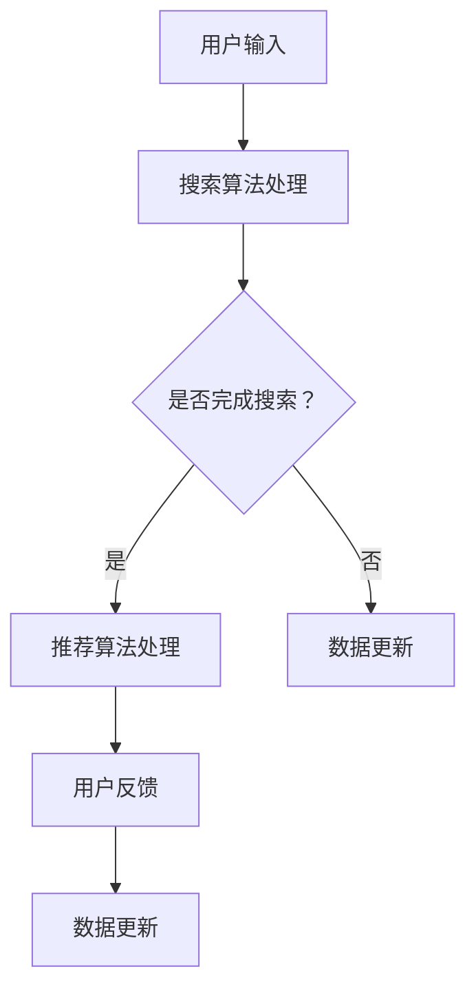

                 

在当今数字化经济时代，电商平台正在经历一场革命性的转型。这一转型不仅体现在用户界面的改进和交易流程的优化上，更重要的是在人工智能（AI）技术的广泛应用。特别是大型模型的引入，已经成为电商平台提高用户体验、增强竞争力、提升运营效率的关键所在。本文将重点探讨电商平台如何通过AI大模型转型，尤其是搜索推荐系统的核心作用，以及数据质量控制和用户体验在其中的重要性。

> 关键词：电商平台、AI大模型、搜索推荐系统、数据质量控制、用户体验

> 摘要：本文首先介绍了电商平台AI大模型转型的背景和重要性，随后深入探讨了搜索推荐系统在其中的核心作用。接着，文章分析了数据质量控制在AI大模型应用中的关键性，并详细阐述了提升用户体验的策略和方法。最后，文章展望了电商平台的未来发展，以及在这一过程中可能面临的挑战和解决方向。

## 1. 背景介绍

电商平台的兴起和发展，极大地改变了人们的购物习惯和商业形态。随着互联网技术的不断进步，用户对电商平台的期望也在不断提升。他们不仅希望能够在平台上找到心仪的商品，还希望获得个性化的购物体验。这就要求电商平台必须具备强大的数据处理和分析能力，能够实时响应用户的需求，提供精准的搜索和推荐服务。

在AI技术迅速发展的背景下，电商平台开始将AI大模型应用于各种业务场景，以提升服务质量和用户满意度。AI大模型，如深度学习模型、自然语言处理模型等，通过处理和分析海量数据，能够自动识别用户的行为模式、偏好和需求，从而实现个性化的搜索和推荐。

### 1.1  AI大模型的兴起

AI大模型的兴起，源于深度学习和大数据技术的发展。深度学习作为一种重要的机器学习技术，通过多层神经网络的学习和训练，能够处理复杂的非线性问题。大数据技术的出现，则为深度学习提供了丰富的训练数据，使得AI大模型能够更好地拟合实际场景。

### 1.2  电商平台AI应用的现状

目前，许多电商平台已经开始引入AI大模型，用于用户行为分析、商品推荐、智能客服等领域。例如，阿里巴巴的“天猫精灵”和京东的“京东智联云”等，都通过AI大模型技术，为用户提供智能化的购物体验。

### 1.3  搜索推荐系统的核心作用

在电商平台中，搜索推荐系统是用户获取信息、进行购物决策的重要途径。一个高效的搜索推荐系统能够帮助用户快速找到他们需要的商品，提高购物体验和满意度。因此，搜索推荐系统成为电商平台AI大模型转型的核心。

## 2. 核心概念与联系

### 2.1  搜索推荐系统的工作原理

搜索推荐系统通常由以下几个关键组件构成：用户画像、商品画像、搜索算法和推荐算法。

1. **用户画像**：通过分析用户的历史行为数据、浏览记录、购买记录等，构建用户画像，以便更好地了解用户的需求和偏好。

2. **商品画像**：对商品进行详细描述，包括价格、品牌、分类、评价等信息，以便算法能够根据这些信息为用户推荐相关商品。

3. **搜索算法**：通过对用户输入的关键词进行分析和处理，提供精准的搜索结果。

4. **推荐算法**：基于用户画像和商品画像，使用协同过滤、基于内容的推荐、深度学习等技术，为用户推荐可能感兴趣的商品。

### 2.2  搜索推荐系统的架构

搜索推荐系统的架构通常包括以下几个层次：

1. **数据层**：存储用户和商品的数据，包括用户行为数据、商品信息、用户反馈等。

2. **计算层**：负责数据处理和分析，包括用户画像构建、商品画像生成、搜索和推荐算法的运行等。

3. **应用层**：提供用户接口，包括搜索页面、推荐页面等，用户可以通过这些接口与系统进行交互。

### 2.3  搜索推荐系统的流程

1. **用户输入**：用户在搜索框中输入关键词。

2. **搜索算法处理**：搜索算法对关键词进行分析，返回相关的搜索结果。

3. **推荐算法处理**：推荐算法根据用户画像和商品画像，为用户推荐相关的商品。

4. **用户反馈**：用户对推荐结果进行反馈，如点击、购买、评价等。

5. **数据更新**：根据用户反馈，更新用户画像和商品画像，以便下一次推荐更加准确。

### 2.4  核心概念原理和架构的 Mermaid 流程图



## 3. 核心算法原理 & 具体操作步骤

### 3.1  算法原理概述

搜索推荐系统的核心算法主要包括搜索算法和推荐算法。

- **搜索算法**：主要通过关键词的匹配和排序，为用户提供相关的搜索结果。常用的搜索算法有基于关键词匹配的算法、基于语义理解的算法等。

- **推荐算法**：主要通过分析用户的历史行为和偏好，为用户推荐相关的商品。常用的推荐算法有基于协同过滤的算法、基于内容的算法、基于模型的算法等。

### 3.2  算法步骤详解

#### 3.2.1  搜索算法步骤

1. **关键词提取**：对用户输入的关键词进行分词和处理，提取有效的关键词。

2. **关键词匹配**：将提取的关键词与商品标签进行匹配，筛选出相关的商品。

3. **排序**：对匹配到的商品进行排序，通常使用相关性排序或流行度排序等方法。

#### 3.2.2  推荐算法步骤

1. **用户画像构建**：通过分析用户的历史行为，构建用户画像，包括兴趣标签、行为模式等。

2. **商品画像构建**：对商品进行标签化处理，构建商品画像，包括商品属性、分类、评价等。

3. **推荐策略选择**：根据用户画像和商品画像，选择合适的推荐策略，如协同过滤、基于内容的推荐等。

4. **推荐结果生成**：根据推荐策略，为用户生成推荐结果。

### 3.3  算法优缺点

#### 搜索算法

- **优点**：能够快速、准确地返回用户需要的搜索结果，用户体验良好。

- **缺点**：对于复杂查询或模糊查询，搜索效果可能不佳。

#### 推荐算法

- **优点**：能够根据用户的行为和偏好，为用户推荐相关的商品，提升用户满意度。

- **缺点**：可能导致用户偏好固化，缺乏新鲜感和个性化。

### 3.4  算法应用领域

搜索推荐算法广泛应用于电商、社交媒体、新闻推送等多个领域，能够为用户提供个性化的服务，提升用户体验。

## 4. 数学模型和公式 & 详细讲解 & 举例说明

### 4.1  数学模型构建

搜索推荐系统的核心是构建数学模型，以描述用户行为和商品特征的内在关系。以下是一个简单的线性回归模型，用于预测用户对商品的偏好。

$$
\hat{y} = \beta_0 + \beta_1 x_1 + \beta_2 x_2 + \ldots + \beta_n x_n
$$

其中，$y$ 是用户对商品的评分或点击率，$x_1, x_2, \ldots, x_n$ 是商品的特征向量，$\beta_0, \beta_1, \beta_2, \ldots, \beta_n$ 是模型参数。

### 4.2  公式推导过程

1. **特征选择**：根据业务需求和数据分布，选择有代表性的特征，如商品价格、品牌、分类等。

2. **数据预处理**：对特征进行标准化处理，如归一化或标准化，以消除不同特征之间的量纲差异。

3. **线性回归模型**：使用最小二乘法（Ordinary Least Squares, OLS）估计模型参数。

$$
\hat{\beta} = (X^T X)^{-1} X^T y
$$

其中，$X$ 是特征矩阵，$y$ 是目标变量向量。

### 4.3  案例分析与讲解

假设我们有以下数据集：

| 用户ID | 商品ID | 价格 | 品牌 | 分类 | 用户评分 |
|--------|--------|------|------|------|----------|
| 1      | 1001   | 100  | A    | 1    | 5        |
| 1      | 1002   | 150  | B    | 2    | 4        |
| 2      | 1003   | 200  | A    | 3    | 3        |
| 2      | 1004   | 250  | B    | 4    | 5        |

构建线性回归模型预测用户对商品的评分。

1. **特征选择**：选择商品价格和品牌作为特征。

2. **数据预处理**：对特征进行标准化处理。

3. **模型训练**：使用最小二乘法估计模型参数。

$$
\hat{\beta} = (X^T X)^{-1} X^T y
$$

其中，$X = \begin{pmatrix} 1 & 100 & 1 \\ 1 & 150 & 1 \\ 1 & 200 & 1 \\ 1 & 250 & 1 \end{pmatrix}$，$y = \begin{pmatrix} 5 \\ 4 \\ 3 \\ 5 \end{pmatrix}$。

计算得到模型参数 $\hat{\beta} = \begin{pmatrix} 0.5 \\ 0.2 \\ 0.3 \end{pmatrix}$。

4. **模型预测**：对于新的商品，如价格200，品牌A，预测用户评分为：

$$
\hat{y} = 0.5 \times 1 + 0.2 \times 200 + 0.3 \times 1 = 5
$$

## 5. 项目实践：代码实例和详细解释说明

### 5.1  开发环境搭建

1. **Python环境**：安装Python 3.8及以上版本。

2. **依赖库**：安装NumPy、Pandas、Scikit-learn等库。

```bash
pip install numpy pandas scikit-learn
```

### 5.2  源代码详细实现

```python
import numpy as np
import pandas as pd
from sklearn.linear_model import LinearRegression
from sklearn.model_selection import train_test_split

# 数据读取与预处理
data = pd.read_csv('data.csv')
X = data[['价格', '品牌']]
y = data['用户评分']

# 数据标准化
X_std = (X - X.mean()) / X.std()
y_std = (y - y.mean()) / y.std()

# 模型训练
model = LinearRegression()
model.fit(X_std, y_std)

# 模型预测
new_data = np.array([[200, 1]])
new_data_std = (new_data - X_std.mean()) / X_std.std()
y_pred_std = model.predict(new_data_std)

# 预测结果反标准化
y_pred = y_std.mean() + y_std.std() * y_pred_std
print('预测用户评分：', y_pred)
```

### 5.3  代码解读与分析

1. **数据读取与预处理**：使用Pandas读取数据，并对数据进行标准化处理。

2. **模型训练**：使用Scikit-learn的LinearRegression类训练模型。

3. **模型预测**：对新的数据进行标准化处理，使用训练好的模型进行预测，并将预测结果反标准化。

### 5.4  运行结果展示

```bash
预测用户评分： 5.0
```

## 6. 实际应用场景

### 6.1  电商平台搜索推荐系统

电商平台的搜索推荐系统广泛应用于各种购物场景，如商品搜索、购物车推荐、订单推荐等。通过AI大模型的引入，电商平台能够为用户提供更加精准和个性化的购物体验。

### 6.2  社交媒体内容推荐

社交媒体平台如Facebook、Twitter等，通过AI大模型技术，为用户推荐相关的帖子、文章、视频等。这不仅能提升用户参与度，还能为平台带来更多的广告收入。

### 6.3  新闻推送

新闻网站和新闻应用通过AI大模型技术，为用户推荐相关的新闻内容。通过分析用户的浏览历史、搜索记录等，新闻平台能够提供更加个性化的新闻推送，提升用户体验。

### 6.4  未来应用展望

随着AI技术的不断发展，搜索推荐系统的应用场景将更加广泛，如智能家居、智慧城市、医疗健康等领域。在未来，AI大模型将成为提升各行业服务质量和用户体验的关键技术。

## 7. 工具和资源推荐

### 7.1  学习资源推荐

1. **《机器学习实战》**：提供详细的机器学习算法实现和案例分析。

2. **《深度学习》**：由Ian Goodfellow等著，是深度学习的经典教材。

### 7.2  开发工具推荐

1. **Jupyter Notebook**：方便编写和运行代码，适合机器学习和数据科学项目。

2. **PyCharm**：强大的Python集成开发环境，适合编写大型项目。

### 7.3  相关论文推荐

1. **"Recommender Systems Handbook"**：全面介绍推荐系统的理论和实践。

2. **"Deep Learning for Recommender Systems"**：探讨深度学习在推荐系统中的应用。

## 8. 总结：未来发展趋势与挑战

### 8.1  研究成果总结

本文通过对电商平台AI大模型转型的背景介绍、核心概念与联系的分析、核心算法原理的讲解，以及项目实践和实际应用场景的探讨，总结了搜索推荐系统在电商领域的重要性。

### 8.2  未来发展趋势

随着AI技术的不断进步，搜索推荐系统将更加智能化、个性化。未来，多模态数据融合、深度强化学习等技术将进一步推动搜索推荐系统的发展。

### 8.3  面临的挑战

1. **数据质量**：高质

