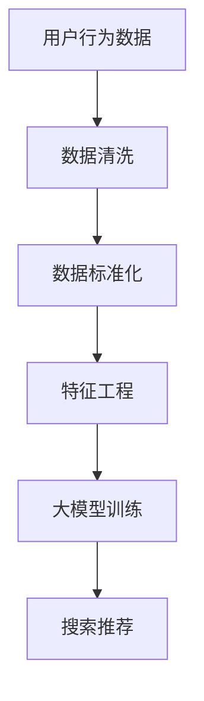

                 

关键词：电商平台，人工智能，大模型，搜索推荐系统，数据质量控制，技术变革

摘要：在电子商务的快速发展中，人工智能大模型的引入成为电商平台转型的关键。本文将探讨如何利用AI大模型优化搜索推荐系统，并深入分析数据质量控制在这一过程中的重要作用，同时展望未来的发展趋势和面临的挑战。

## 1. 背景介绍

随着互联网的普及和消费习惯的改变，电子商务已经成为全球商业活动的重要组成部分。电商平台通过提供个性化的商品推荐和高效的搜索服务，吸引了大量用户并实现了商业价值的最大化。然而，传统的推荐系统往往依赖于简单的规则和统计模型，难以应对日益复杂的用户需求和市场变化。

人工智能（AI）的迅猛发展为电商平台提供了新的机遇。通过引入大模型技术，电商平台可以实现更高水平的个性化推荐和更精准的搜索结果，从而提升用户体验和转化率。然而，AI大模型的引入不仅需要强大的计算能力和复杂的算法设计，还面临着数据质量控制这一关键挑战。

## 2. 核心概念与联系

### 2.1 人工智能大模型

人工智能大模型是指基于深度学习技术构建的，能够处理大规模数据并生成高精度预测和推荐的神经网络模型。这些模型通常具有海量的参数和复杂的结构，能够在图像识别、自然语言处理、语音识别等领域取得突破性成果。

### 2.2 搜索推荐系统

搜索推荐系统是指通过算法分析用户行为和偏好，为用户提供个性化搜索结果和商品推荐的服务系统。它通常包括用户画像、内容挖掘、协同过滤、深度学习等多个模块。

### 2.3 数据质量控制

数据质量控制是指对电商平台数据源进行筛选、清洗、去噪、标准化等处理，以确保数据质量的过程。高质量的数据是AI大模型训练和推荐系统运行的基础。

### 2.4 Mermaid 流程图

## 3. 核心算法原理 & 具体操作步骤

### 3.1 算法原理概述

大模型推荐系统通常基于深度学习技术，通过多层神经网络对用户行为和商品特征进行建模，从而实现精准的推荐。其主要原理包括：

- **用户画像生成**：通过用户的历史行为数据构建用户画像，包括用户兴趣、消费习惯、购买偏好等。
- **商品特征提取**：通过商品属性、用户评价、销售数据等构建商品特征向量。
- **协同过滤**：基于用户行为相似性进行推荐，分为基于用户和基于物品的协同过滤。
- **深度学习模型**：采用神经网络对用户和商品特征进行融合和建模，实现个性化推荐。

### 3.2 算法步骤详解

1. **数据收集与预处理**：从电商平台多个数据源收集用户行为数据，进行数据清洗、去噪和标准化。
2. **用户画像构建**：通过分析用户的历史行为，生成用户画像。
3. **商品特征提取**：提取商品的关键属性，构建商品特征向量。
4. **模型训练**：采用深度学习框架（如TensorFlow或PyTorch）训练推荐模型。
5. **模型评估与优化**：通过A/B测试评估模型效果，不断优化模型参数。
6. **搜索与推荐**：根据用户画像和商品特征，实现个性化搜索和推荐。

### 3.3 算法优缺点

**优点**：

- **高精度**：深度学习模型能够捕捉用户行为和商品特征之间的复杂关系，实现精准推荐。
- **灵活性**：能够动态适应用户需求和市场变化，提高用户满意度。
- **自动化**：通过自动化数据预处理和模型训练，降低人工干预成本。

**缺点**：

- **计算资源消耗**：大模型训练需要大量计算资源和时间。
- **数据质量要求高**：数据质量直接影响到模型的性能，需要严格的数据质量控制。
- **过拟合风险**：深度学习模型容易过拟合，需要充分的训练数据和有效的正则化策略。

### 3.4 算法应用领域

- **电子商务**：实现个性化商品推荐和搜索，提高用户转化率和留存率。
- **内容平台**：根据用户偏好推荐视频、文章等，提升用户活跃度和粘性。
- **社交媒体**：个性化推荐用户可能感兴趣的朋友、群组和话题，促进社区互动。

## 4. 数学模型和公式 & 详细讲解 & 举例说明

### 4.1 数学模型构建

推荐系统的核心是用户和商品之间的相似度计算和推荐算法设计。以下是常见的两种数学模型：

- **协同过滤模型**：

  $$ \text{相似度} = \frac{\sum_{i \in R} x_i y_i}{\|x\|\|y\|} $$

  其中，$x_i$ 和 $y_i$ 分别表示用户 $i$ 和商品 $j$ 的特征向量，$R$ 为共同行为的集合。

- **深度学习模型**：

  $$ \text{推荐评分} = \sigma(W_1 \cdot [u, p] + b_1) $$

  其中，$u$ 和 $p$ 分别表示用户和商品的特征向量，$W_1$ 和 $b_1$ 分别为模型权重和偏置，$\sigma$ 为激活函数。

### 4.2 公式推导过程

以协同过滤模型为例，推导用户 $i$ 对商品 $j$ 的推荐评分：

1. **用户行为矩阵**：假设用户行为矩阵为 $X \in \mathbb{R}^{m \times n}$，其中 $m$ 表示用户数量，$n$ 表示商品数量，$X_{ij}$ 表示用户 $i$ 对商品 $j$ 的评分。
2. **用户和商品特征向量**：分别表示为 $u_i \in \mathbb{R}^d$ 和 $p_j \in \mathbb{R}^d$，其中 $d$ 表示特征维度。
3. **相似度计算**：使用余弦相似度计算用户 $i$ 和用户 $j$ 之间的相似度，得到相似度矩阵 $S \in \mathbb{R}^{m \times m}$。
4. **预测评分**：对于每个用户 $i$，选择与用户 $i$ 最相似的 $k$ 个用户，计算其平均评分作为推荐评分：

   $$ \text{预测评分}_{ij} = \frac{\sum_{j \in \text{邻近用户}} X_{ij} \cdot X_{ji}}{\|u_i\|\|u_j\|} $$

### 4.3 案例分析与讲解

假设一个电商平台有1000名用户和10000件商品，用户对商品进行评分的行为数据已经收集完成。现在需要使用协同过滤模型进行推荐。

1. **数据预处理**：对用户行为数据进行标准化处理，将评分矩阵 $X$ 转化为用户和商品特征向量矩阵 $U$ 和 $P$。
2. **相似度计算**：计算用户和用户之间的相似度矩阵 $S$。
3. **预测评分**：选择与用户 $i$ 最相似的 $k$ 个用户（例如 $k=10$），计算其平均评分作为推荐评分。

例如，对于用户 $i=1$，选择与用户 $1$ 最相似的 $10$ 个用户，其平均评分为：

$$ \text{预测评分}_{ij} = \frac{\sum_{j=2}^{11} X_{1j} \cdot X_{j1}}{\|u_1\|\|u_j\|} = \frac{X_{12} \cdot X_{21} + X_{13} \cdot X_{31} + \ldots + X_{1

