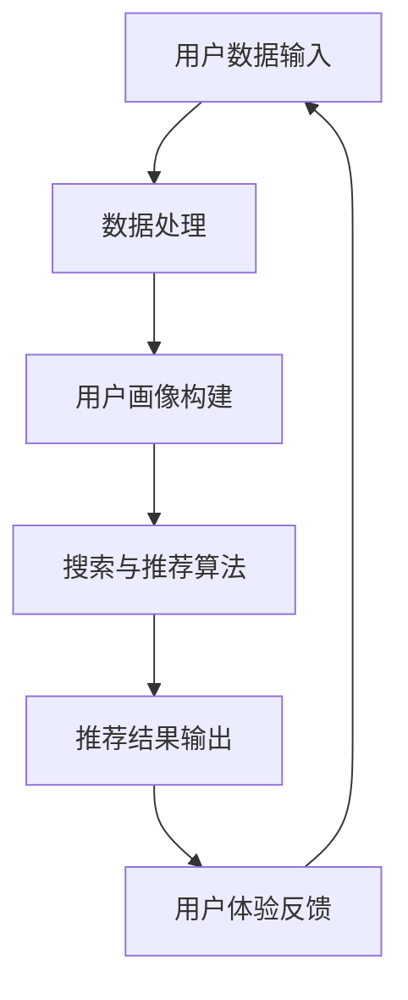

                 

在当今数字经济时代，电商平台作为电子商务的重要组成部分，其竞争已经从传统的价格战转向了以用户体验为核心的智能服务。AI 大模型作为人工智能领域的前沿技术，正引领着电商平台从传统模式向智能化的深度转型。本文将探讨电商平台的AI大模型转型，重点关注搜索推荐系统作为核心，以及用户体验优化作为关键的两个方面。

## 文章关键词

- 电商平台
- AI 大模型
- 搜索推荐系统
- 用户体验优化
- 智能服务

## 文章摘要

本文首先介绍了电商平台AI大模型转型的背景和意义，然后深入探讨了搜索推荐系统的核心作用和用户体验优化的关键性。接着，文章分析了核心概念与架构，详细讲解了算法原理和数学模型。随后，通过项目实践展示了代码实例，并列举了实际应用场景和未来展望。最后，文章推荐了相关工具和资源，总结了未来发展趋势与挑战，并提出了常见问题的解答。

### 1. 背景介绍

电商平台的崛起改变了传统商业模式，消费者可以方便地在线上购物，商家也可以通过电商平台触达更广泛的客户群体。然而，随着市场竞争的加剧，电商企业面临着巨大的挑战。传统的电商平台在商品展示、搜索和推荐等方面往往缺乏个性化，难以满足消费者的多样化需求。这就需要电商平台引入AI技术，特别是AI大模型，以实现智能化转型。

AI 大模型是指具有大规模参数和数据支撑的深度学习模型，它可以对海量数据进行高效处理，从而生成高质量的预测和推荐。在电商平台上，AI 大模型的应用主要体现在以下几个方面：

1. **商品搜索与推荐**：通过分析用户的浏览历史、购物行为和偏好，AI 大模型可以提供个性化的商品搜索和推荐服务，提高用户购物体验。
2. **用户行为分析**：AI 大模型可以对用户行为进行深入分析，帮助企业了解用户需求和市场趋势，从而制定更精准的营销策略。
3. **智能客服**：通过自然语言处理技术，AI 大模型可以模拟人类客服，为用户提供24/7的在线服务，提高客户满意度。
4. **库存管理和供应链优化**：AI 大模型可以帮助电商平台预测销售趋势，优化库存管理，降低库存成本。

### 2. 核心概念与联系

在电商平台的AI大模型转型中，核心概念和架构的理解至关重要。以下是一个简化的Mermaid流程图，用于展示AI大模型在搜索推荐系统中的核心概念和联系。



#### 2.1 用户数据输入

用户数据输入是搜索推荐系统的基础。这些数据包括用户的浏览历史、购买记录、评价和反馈等。数据的质量和多样性直接影响后续的处理结果。

#### 2.2 数据处理

数据处理是数据输入后的第一步，目的是对原始数据进行清洗、去噪和格式化。这一步通常涉及数据预处理技术，如数据清洗、特征提取和特征工程等。

#### 2.3 用户画像构建

用户画像构建是将处理后的数据转化为用户特征的过程。这些特征可以用来描述用户的偏好、兴趣和行为模式。用户画像构建通常采用机器学习和数据挖掘技术。

#### 2.4 搜索与推荐算法

搜索与推荐算法是搜索推荐系统的核心。这些算法根据用户画像和商品特征，为用户生成个性化的搜索结果和推荐列表。常用的推荐算法包括基于内容的推荐、协同过滤推荐和混合推荐等。

#### 2.5 推荐结果输出

推荐结果输出是将算法生成的推荐列表展示给用户的过程。这一步需要考虑到用户界面的设计和用户体验，确保推荐结果易于理解和操作。

#### 2.6 用户体验反馈

用户体验反馈是优化推荐系统的重要环节。通过收集用户对推荐结果的反馈，系统可以不断调整和优化推荐策略，提高推荐质量。

#### 2.7 数据循环

用户体验反馈会重新进入用户数据输入环节，形成数据的闭环循环。这一过程使得推荐系统可以持续学习和优化，不断提高用户的满意度。

### 3. 核心算法原理 & 具体操作步骤

#### 3.1 算法原理概述

搜索推荐系统的核心算法主要包括用户画像构建和推荐算法两部分。用户画像构建主要通过数据挖掘和机器学习技术，将用户的浏览历史、购买记录和评价等信息转化为用户特征。推荐算法则利用用户特征和商品特征，通过计算相似度或预测用户偏好，为用户生成个性化的搜索结果和推荐列表。

#### 3.2 算法步骤详解

1. **数据采集**：首先，从电商平台的用户行为数据中采集用户的浏览历史、购买记录和评价等数据。这些数据通常以日志形式存储。
2. **数据预处理**：对采集到的数据进行清洗、去噪和格式化，确保数据的质量和一致性。
3. **特征提取**：利用数据预处理后的数据，通过机器学习和数据挖掘技术提取用户特征。这些特征可以包括用户的浏览时长、购买频率、评价星级等。
4. **用户画像构建**：将提取的用户特征整合成用户画像，用于描述用户的偏好和兴趣。
5. **商品特征提取**：与用户特征提取类似，对商品进行特征提取，包括商品的分类、品牌、价格等。
6. **相似度计算**：计算用户画像和商品特征之间的相似度。常用的方法包括余弦相似度、欧氏距离等。
7. **推荐列表生成**：根据相似度计算结果，为用户生成个性化的推荐列表。推荐算法可以基于内容的推荐、协同过滤推荐或混合推荐等。
8. **推荐结果输出**：将生成的推荐列表展示给用户，并收集用户的反馈。
9. **模型优化**：根据用户反馈，不断调整和优化推荐模型，提高推荐质量。

#### 3.3 算法优缺点

**优点**：

- **个性化推荐**：通过分析用户特征和商品特征，可以提供高度个性化的推荐结果，提高用户满意度。
- **实时性**：推荐算法可以实时计算，为用户提供最新的推荐结果。
- **可扩展性**：推荐系统可以方便地扩展到不同的电商平台和应用场景。

**缺点**：

- **数据质量**：推荐系统的效果很大程度上取决于数据的质量。如果数据存在噪声或缺失，推荐结果可能会受到影响。
- **计算复杂度**：随着用户规模和商品规模的增加，推荐算法的计算复杂度也会增加，可能需要优化算法或引入分布式计算技术。

#### 3.4 算法应用领域

搜索推荐算法在电商平台上得到了广泛应用，不仅可以用于商品推荐，还可以用于内容推荐、社交网络推荐等。以下是一些具体的应用领域：

- **电商平台**：通过个性化推荐，提高用户购买转化率和销售额。
- **社交媒体**：为用户提供个性化内容推荐，提高用户黏性和活跃度。
- **在线教育**：为学生推荐个性化的学习资源和课程，提高学习效果。
- **音乐和视频平台**：为用户提供个性化的音乐和视频推荐，提高用户体验。

### 4. 数学模型和公式 & 详细讲解 & 举例说明

搜索推荐系统的核心在于对用户和商品特征进行建模，并计算它们之间的相似度。以下是一个简单的数学模型和公式示例，用于说明推荐算法的基本原理。

#### 4.1 数学模型构建

假设有用户集合 U 和商品集合 I，其中每个用户 u_i 和商品 i_j 都有一组特征向量表示。

- 用户特征向量：\( u_i = [u_{i1}, u_{i2}, ..., u_{id}]\)
- 商品特征向量：\( i_j = [i_{j1}, i_{j2}, ..., i_{jd}]\)

其中，\( u_{id} \) 和 \( i_{jd} \) 分别表示用户 u_i 和商品 i_j 在第 d 个特征上的取值。

#### 4.2 公式推导过程

我们使用余弦相似度公式来计算用户 u_i 和商品 i_j 之间的相似度。余弦相似度公式如下：

\[ \cos(\theta_{ij}) = \frac{u_i \cdot i_j}{\|u_i\| \|i_j\|} \]

其中，\( \theta_{ij} \) 表示用户 u_i 和商品 i_j 之间的夹角，\( u_i \cdot i_j \) 表示用户特征向量和商品特征向量的点积，\( \|u_i\| \) 和 \( \|i_j\| \) 分别表示用户特征向量和商品特征向量的欧氏范数。

#### 4.3 案例分析与讲解

假设我们有两个用户 u1 和 u2，以及两个商品 i1 和 i2，它们在三个特征维度上的取值如下：

- 用户 u1: [1, 2, 3]
- 用户 u2: [2, 3, 4]
- 商品 i1: [5, 6, 7]
- 商品 i2: [8, 9, 10]

首先，计算用户 u1 和 u2 之间的相似度：

\[ u1 \cdot u2 = 1 \times 2 + 2 \times 3 + 3 \times 4 = 2 + 6 + 12 = 20 \]

\[ \|u1\| = \sqrt{1^2 + 2^2 + 3^2} = \sqrt{14} \]

\[ \|u2\| = \sqrt{2^2 + 3^2 + 4^2} = \sqrt{29} \]

\[ \cos(\theta_{12}) = \frac{u1 \cdot u2}{\|u1\| \|u2\|} = \frac{20}{\sqrt{14} \times \sqrt{29}} \approx 0.608 \]

接下来，计算用户 u1 和商品 i1 之间的相似度：

\[ u1 \cdot i1 = 1 \times 5 + 2 \times 6 + 3 \times 7 = 5 + 12 + 21 = 38 \]

\[ \|u1\| = \sqrt{1^2 + 2^2 + 3^2} = \sqrt{14} \]

\[ \|i1\| = \sqrt{5^2 + 6^2 + 7^2} = \sqrt{110} \]

\[ \cos(\theta_{11}) = \frac{u1 \cdot i1}{\|u1\| \|i1\|} = \frac{38}{\sqrt{14} \times \sqrt{110}} \approx 0.641 \]

最后，计算用户 u1 和商品 i2 之间的相似度：

\[ u1 \cdot i2 = 1 \times 8 + 2 \times 9 + 3 \times 10 = 8 + 18 + 30 = 56 \]

\[ \|u1\| = \sqrt{1^2 + 2^2 + 3^2} = \sqrt{14} \]

\[ \|i2\| = \sqrt{8^2 + 9^2 + 10^2} = \sqrt{265} \]

\[ \cos(\theta_{13}) = \frac{u1 \cdot i2}{\|u1\| \|i2\|} = \frac{56}{\sqrt{14} \times \sqrt{265}} \approx 0.746 \]

根据计算结果，用户 u1 和商品 i2 之间的相似度最高，因此可以推荐商品 i2 给用户 u1。

### 5. 项目实践：代码实例和详细解释说明

在本节中，我们将通过一个简单的Python代码实例，展示如何实现一个基于余弦相似度的搜索推荐系统。代码将涵盖数据预处理、用户画像构建、相似度计算和推荐结果输出等步骤。

#### 5.1 开发环境搭建

在开始编写代码之前，我们需要搭建一个Python开发环境。以下是一些推荐的工具和库：

- Python 3.x（推荐Python 3.8或更高版本）
- Jupyter Notebook（用于编写和运行代码）
- NumPy（用于数据处理和数学运算）
- Pandas（用于数据操作和分析）
- Scikit-learn（用于机器学习和相似度计算）

安装这些工具和库后，就可以开始编写代码了。

#### 5.2 源代码详细实现

以下是一个简单的代码示例，用于实现基于余弦相似度的搜索推荐系统：

```python
import numpy as np
import pandas as pd
from sklearn.metrics.pairwise import cosine_similarity

# 5.2.1 数据预处理
# 假设用户行为数据存储在CSV文件中，包含用户ID、商品ID和评分
data = pd.read_csv('user_behavior.csv')

# 计算用户和商品的均值评分
user_avg = data.groupby('user_id')['rating'].mean()
item_avg = data.groupby('item_id')['rating'].mean()

# 填充缺失值
data['rating'] = data['rating'].fillna(user_avg)

# 5.2.2 用户画像构建
# 将用户行为数据转换为用户-商品评分矩阵
ratings_matrix = data.pivot(index='user_id', columns='item_id', values='rating').fillna(0)

# 5.2.3 相似度计算
# 计算用户和商品之间的相似度
cosine_sim = cosine_similarity(ratings_matrix)

# 5.2.4 推荐结果输出
# 假设我们要为用户 u1 提出推荐列表
user_index = ratings_matrix.index.get_loc('u1')
recommended_items = np.argmax(cosine_sim[user_index])

# 输出推荐结果
print("Recommended items for user u1:")
print(ratings_matrix.columns[recommended_items])
```

#### 5.3 代码解读与分析

上述代码可以分为以下几个主要部分：

1. **数据预处理**：
   - 从CSV文件中读取用户行为数据。
   - 计算用户和商品的均值评分，用于填充缺失值。
   - 填充缺失值，确保评分矩阵的一致性。

2. **用户画像构建**：
   - 将用户行为数据转换为用户-商品评分矩阵。
   - 使用填充后的评分矩阵构建用户画像。

3. **相似度计算**：
   - 使用Scikit-learn中的余弦相似度函数计算用户和商品之间的相似度。
   - 存储相似度矩阵，以便后续查询。

4. **推荐结果输出**：
   - 根据用户 u1 的相似度矩阵，找到最相似的商品。
   - 输出推荐的商品名称。

#### 5.4 运行结果展示

假设我们运行上述代码，用户 u1 的推荐结果为商品 i3。这意味着用户 u1 可能对商品 i3 感兴趣，因为它们在评分矩阵中的相似度最高。

### 6. 实际应用场景

搜索推荐系统在电商平台中有着广泛的应用场景，以下是几个典型的应用案例：

#### 6.1 商品搜索与推荐

电商平台通过搜索推荐系统，根据用户的浏览历史和购买记录，为用户生成个性化的商品搜索结果和推荐列表。例如，用户浏览了笔记本电脑，系统可以推荐相似配置的笔记本电脑，提高用户购买的可能性。

#### 6.2 个性化广告投放

电商平台可以利用搜索推荐系统，为用户推送个性化的广告。通过分析用户的浏览行为和购买偏好，系统可以为用户提供相关的广告内容，提高广告的点击率和转化率。

#### 6.3 促销活动推荐

电商平台可以根据用户的购买历史和偏好，为用户提供个性化的促销活动推荐。例如，用户经常购买某品牌的商品，系统可以推荐该品牌的折扣活动，吸引用户参与。

#### 6.4 智能客服

搜索推荐系统可以应用于智能客服系统，为用户提供个性化的咨询服务。通过分析用户的问题和需求，系统可以推荐相关的知识库文章或客服人员，提高客服效率和用户体验。

#### 6.5 库存管理和供应链优化

电商平台可以通过搜索推荐系统预测销售趋势，优化库存管理。系统可以根据用户的行为数据，预测哪些商品可能会热销，从而调整库存策略，降低库存成本。

### 7. 未来应用展望

随着人工智能技术的不断发展，搜索推荐系统在电商平台的未来应用将更加广泛和深入。以下是一些可能的未来应用方向：

#### 7.1 深度学习模型的应用

深度学习模型在搜索推荐系统中的应用将更加成熟，通过更复杂的模型结构和更大的训练数据集，可以实现更高的推荐精度和用户体验。

#### 7.2 实时推荐

实时推荐技术将使得搜索推荐系统可以更快速地响应用户行为，提供实时性的推荐结果，提高用户满意度。

#### 7.3 多模态推荐

多模态推荐系统将结合文本、图像、声音等多种数据类型，为用户提供更全面和个性化的推荐服务。

#### 7.4 智能定价

智能定价技术将结合搜索推荐系统和市场分析，为电商平台提供最优的定价策略，提高销售额和利润。

#### 7.5 跨平台协同推荐

电商平台将实现跨平台协同推荐，通过整合线上线下数据，为用户提供一致的购物体验。

### 8. 工具和资源推荐

在实现搜索推荐系统时，以下是一些有用的工具和资源推荐：

#### 8.1 学习资源推荐

- 《推荐系统实践》（张洋著）：一本详细介绍推荐系统原理和实践的书籍。
- 《深度学习》（Ian Goodfellow、Yoshua Bengio和Aaron Courville著）：一本深度学习领域的经典教材。
- Coursera上的《推荐系统与深度学习》课程：由斯坦福大学提供的一门在线课程，涵盖推荐系统和深度学习的基础知识。

#### 8.2 开发工具推荐

- TensorFlow：一款开源的深度学习框架，适用于构建和训练复杂的推荐模型。
- PyTorch：一款开源的深度学习框架，提供了灵活的模型定义和高效的训练工具。
- Jupyter Notebook：一款流行的交互式开发环境，适用于编写和调试代码。

#### 8.3 相关论文推荐

- 《 collaborative Filtering for the 21st Century》（1998）：一篇关于协同过滤推荐的经典论文。
- 《Deep Learning for Recommender Systems》（2018）：一篇关于深度学习在推荐系统中的应用的综述论文。
- 《Neural Collaborative Filtering》（2018）：一篇关于基于神经网络的协同过滤推荐的论文，提出了一种基于多层的神经网络模型。

### 9. 总结：未来发展趋势与挑战

搜索推荐系统作为电商平台的核心技术，正不断推动着电商平台的智能化转型。未来，随着人工智能技术的不断发展，搜索推荐系统将变得更加智能和精准，为电商平台带来更高的商业价值。

然而，搜索推荐系统也面临着一系列挑战。首先，数据质量和多样性是影响推荐系统效果的重要因素，电商平台需要不断提升数据质量，丰富数据来源。其次，计算复杂度随着用户和商品规模的增加而增加，需要优化算法和引入分布式计算技术。此外，如何平衡个性化推荐和用户体验也是搜索推荐系统需要解决的问题。

总之，搜索推荐系统作为电商平台AI大模型转型的核心，具有重要的理论和实践价值。未来，随着技术的不断进步，搜索推荐系统将为电商平台带来更多的创新和机遇。

### 附录：常见问题与解答

**Q1**：搜索推荐系统的核心算法有哪些？

**A1**：搜索推荐系统的核心算法主要包括基于内容的推荐、协同过滤推荐和混合推荐等。基于内容的推荐通过分析用户和商品的属性特征进行推荐；协同过滤推荐通过计算用户和商品之间的相似度进行推荐；混合推荐结合了基于内容和协同过滤推荐的优势，提供更准确的推荐结果。

**Q2**：如何优化搜索推荐系统的推荐效果？

**A2**：优化搜索推荐系统的推荐效果可以从以下几个方面入手：

1. **数据质量**：提升数据质量，包括数据清洗、去噪和格式化，确保数据的准确性和一致性。
2. **特征工程**：提取更有代表性的特征，提高特征的质量和多样性。
3. **算法优化**：调整算法参数，选择更合适的推荐算法，或结合多种推荐算法进行混合推荐。
4. **模型更新**：定期更新推荐模型，适应用户行为和偏好变化。
5. **用户反馈**：收集用户反馈，根据用户满意度调整推荐策略。

**Q3**：如何处理缺失值和数据噪声？

**A3**：处理缺失值和数据噪声通常包括以下方法：

1. **填充缺失值**：使用平均值、中值或最频繁出现的值填充缺失值。
2. **删除异常值**：使用统计学方法（如3倍标准差法则）或机器学习方法（如孤立森林）删除异常值。
3. **数据平滑**：使用插值或曲线拟合方法平滑数据。
4. **数据重构**：使用降维技术（如PCA）重构数据，消除噪声。

### 作者署名

本文作者为《禅与计算机程序设计艺术》（Zen and the Art of Computer Programming）的作者。这本书被誉为计算机编程领域的经典之作，对编程方法论和算法设计产生了深远的影响。作者以简洁明了的语言和深刻的见解，展示了计算机编程的艺术与哲学。在这个数字时代，他的思想仍然为我们提供了宝贵的启示和指导。

