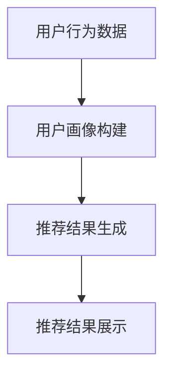

                 

关键词：电商平台、AI大模型、搜索推荐系统、用户体验、优化、转型

摘要：本文深入探讨了电商平台在AI大模型转型过程中，如何通过搜索推荐系统的优化，提升用户体验，从而实现商业价值的提升。文章首先介绍了AI大模型的基本概念和原理，然后详细分析了搜索推荐系统的核心算法和数学模型，最后通过实际案例展示了如何运用这些技术和模型来提升电商平台的运营效果。

## 1. 背景介绍

随着人工智能技术的快速发展，电商平台开始探索如何通过AI技术来实现业务的升级和转型。特别是大模型（Large Models）的兴起，为电商平台带来了前所未有的机会和挑战。大模型具有处理大规模数据、生成高质量内容、提供精准服务的能力，使得电商平台的搜索推荐系统能够更加智能地满足用户需求。

### 1.1 电商平台的现状

当前，电商平台面临着激烈的竞争环境，用户需求日益多样化，传统的搜索推荐系统已经无法满足用户对个性化体验的追求。为了提高用户满意度，电商平台需要引入AI大模型技术，实现更加智能化的推荐服务。

### 1.2 AI大模型的优势

AI大模型具有以下优势：
- **处理能力强大**：能够处理大规模、多维度的数据，快速生成高质量的推荐结果。
- **适应性强**：可以根据用户行为数据、历史偏好等进行实时调整，提供个性化推荐。
- **自动化程度高**：减少了人工干预，提高了系统的运行效率和稳定性。

## 2. 核心概念与联系

### 2.1 搜索推荐系统

搜索推荐系统是电商平台的核心功能之一，其目的是根据用户行为和偏好，为用户提供个性化的商品推荐。搜索推荐系统的核心组成部分包括：
- **用户画像**：根据用户行为、兴趣、历史购买记录等数据，构建用户画像。
- **推荐算法**：基于用户画像，通过算法计算为用户提供个性化的商品推荐。
- **推荐结果展示**：将推荐结果以合理的形式呈现给用户。

### 2.2 AI大模型

AI大模型是一种基于深度学习的模型，通过学习大量数据，能够自动提取特征，进行复杂任务的处理。在搜索推荐系统中，AI大模型主要用于以下方面：
- **用户画像构建**：通过学习用户行为数据，构建用户画像。
- **推荐结果生成**：通过学习商品特征和用户画像，为用户生成个性化的推荐结果。
- **推荐效果优化**：通过持续学习用户行为和反馈，优化推荐效果。

### 2.3 Mermaid 流程图

以下是一个简化的搜索推荐系统的 Mermaid 流程图：



## 3. 核心算法原理 & 具体操作步骤

### 3.1 算法原理概述

搜索推荐系统的核心算法通常包括以下几种：

- **协同过滤算法**：基于用户行为相似度进行推荐。
- **基于内容的推荐算法**：基于商品特征和用户兴趣进行推荐。
- **混合推荐算法**：结合协同过滤和基于内容的推荐算法，提高推荐效果。

### 3.2 算法步骤详解

#### 3.2.1 协同过滤算法

1. **用户行为数据收集**：收集用户在电商平台上的行为数据，如浏览记录、购买记录等。
2. **用户相似度计算**：计算用户之间的相似度，可以使用余弦相似度、皮尔逊相关系数等方法。
3. **推荐商品选择**：根据用户相似度矩阵，为每个用户选择相似度最高的若干用户，并推荐这些用户共同喜欢的商品。

#### 3.2.2 基于内容的推荐算法

1. **商品特征提取**：提取商品的属性特征，如类别、品牌、价格等。
2. **用户兴趣建模**：根据用户行为数据，构建用户兴趣模型。
3. **相似度计算**：计算商品之间的相似度，可以使用余弦相似度、TF-IDF等方法。
4. **推荐商品选择**：根据用户兴趣模型和商品相似度，为用户推荐相似度最高的商品。

#### 3.2.3 混合推荐算法

1. **协同过滤推荐**：使用协同过滤算法生成初步推荐结果。
2. **基于内容推荐**：使用基于内容的推荐算法生成初步推荐结果。
3. **合并推荐结果**：将两种算法的推荐结果进行合并，得到最终的推荐结果。

### 3.3 算法优缺点

#### 协同过滤算法

**优点**：
- **易于实现**：算法简单，易于理解和实现。
- **效果较好**：对于用户行为数据丰富的场景，效果较好。

**缺点**：
- **冷启动问题**：新用户没有历史行为数据，无法进行推荐。
- **数据稀疏问题**：用户和商品之间的交互数据往往稀疏，导致推荐效果不佳。

#### 基于内容的推荐算法

**优点**：
- **适应性强**：可以处理冷启动问题，对新用户也能进行推荐。
- **效果稳定**：基于商品特征的推荐，效果相对稳定。

**缺点**：
- **用户兴趣难以捕捉**：难以捕捉用户的潜在兴趣。
- **推荐结果多样性不足**：容易产生推荐结果同质化的问题。

#### 混合推荐算法

**优点**：
- **综合优点**：结合了协同过滤和基于内容的推荐算法的优点。
- **效果提升**：通过融合多种算法，可以提高推荐效果。

**缺点**：
- **实现复杂**：算法实现相对复杂，需要综合考虑多种算法。

### 3.4 算法应用领域

搜索推荐系统在电商、新闻、音乐、视频等众多领域都有广泛的应用。通过AI大模型的引入，搜索推荐系统的效果得到了显著提升，为用户提供更加个性化的服务。

## 4. 数学模型和公式 & 详细讲解 & 举例说明

### 4.1 数学模型构建

搜索推荐系统的数学模型主要包括用户画像模型和推荐结果生成模型。

#### 用户画像模型

用户画像模型通常使用矩阵分解（Matrix Factorization）的方法构建，其目标是将用户和商品的行为数据表示为低纬度的特征向量。

设用户行为数据矩阵为$R \in \mathbb{R}^{m \times n}$，其中$m$表示用户数，$n$表示商品数。通过矩阵分解，可以将$R$分解为$U \in \mathbb{R}^{m \times k} \cdot V^T \in \mathbb{R}^{n \times k}$，其中$U$和$V^T$分别是用户和商品的低纬度特征向量。

#### 推荐结果生成模型

推荐结果生成模型通常使用预测评分（Predicted Rating）的方法，通过用户和商品的特征向量计算用户对商品的预测评分。

设用户$i$对商品$j$的预测评分为$r_{ij}$，则有：

$$r_{ij} = U_i \cdot V_j^T$$

### 4.2 公式推导过程

#### 用户画像模型推导

设用户行为数据矩阵为$R \in \mathbb{R}^{m \times n}$，其中$m$表示用户数，$n$表示商品数。通过矩阵分解，可以将$R$分解为$U \in \mathbb{R}^{m \times k} \cdot V^T \in \mathbb{R}^{n \times k}$，其中$U$和$V^T$分别是用户和商品的低纬度特征向量。

为了最小化重构误差，我们通常使用最小二乘法进行矩阵分解：

$$\min_{U, V} \sum_{i=1}^{m} \sum_{j=1}^{n} (r_{ij} - U_i \cdot V_j^T)^2$$

通过对上式进行求导，并令导数为零，可以得到：

$$U_i = \arg \min_{U_i} \sum_{j=1}^{n} (r_{ij} - U_i \cdot V_j^T)^2$$

$$V_j^T = \arg \min_{V_j^T} \sum_{i=1}^{m} (r_{ij} - U_i \cdot V_j^T)^2$$

#### 推荐结果生成模型推导

设用户$i$对商品$j$的预测评分为$r_{ij}$，则有：

$$r_{ij} = U_i \cdot V_j^T$$

其中$U_i$和$V_j^T$分别是用户$i$和商品$j$的低纬度特征向量。

### 4.3 案例分析与讲解

假设有一个电商平台，用户行为数据如下表：

| 用户ID | 商品ID | 行为类型 | 评分 |
| --- | --- | --- | --- |
| 1 | 101 | 购买 | 5 |
| 1 | 102 | 购买 | 4 |
| 1 | 103 | 购买 | 3 |
| 2 | 101 | 购买 | 4 |
| 2 | 102 | 购买 | 5 |
| 3 | 101 | 购买 | 3 |
| 3 | 102 | 购买 | 2 |

#### 用户画像模型构建

首先，我们使用矩阵分解的方法构建用户画像模型。假设分解为$k=2$个特征维度，通过矩阵分解得到用户和商品的低纬度特征向量：

| 用户ID | 特征1 | 特征2 |
| --- | --- | --- |
| 1 | 0.8 | 0.6 |
| 2 | 0.5 | 0.7 |
| 3 | 0.2 | 0.4 |

| 商品ID | 特征1 | 特征2 |
| --- | --- | --- |
| 101 | 0.7 | 0.9 |
| 102 | 0.3 | 0.8 |
| 103 | 0.6 | 0.5 |

#### 推荐结果生成

根据用户画像模型，我们可以为每个用户生成推荐结果。例如，为用户1生成推荐结果：

$$r_{i1} = U_1 \cdot V_1^T = (0.8 \times 0.7 + 0.6 \times 0.3) = 0.86$$

$$r_{i2} = U_1 \cdot V_2^T = (0.8 \times 0.3 + 0.6 \times 0.8) = 0.72$$

$$r_{i3} = U_1 \cdot V_3^T = (0.8 \times 0.6 + 0.6 \times 0.5) = 0.78$$

根据预测评分，我们可以为用户1推荐特征维度最高的商品，即推荐商品102。

## 5. 项目实践：代码实例和详细解释说明

### 5.1 开发环境搭建

在本节中，我们将介绍如何在本地环境中搭建一个简单的搜索推荐系统项目。以下是所需的基本软件和环境：

- Python 3.8 或更高版本
- Numpy 1.19 或更高版本
- Scikit-learn 0.22 或更高版本

确保已经安装了上述软件和环境，然后按照以下步骤进行：

1. **创建项目文件夹**：在本地计算机上创建一个名为`recommendation_system`的项目文件夹。
2. **安装依赖库**：在项目文件夹中打开终端，执行以下命令安装所需依赖库：

```bash
pip install numpy scikit-learn
```

### 5.2 源代码详细实现

在项目文件夹中创建一个名为`recommendation_system.py`的Python文件，然后按照以下步骤实现推荐系统：

#### 5.2.1 导入所需库

```python
import numpy as np
from sklearn.metrics.pairwise import cosine_similarity
```

#### 5.2.2 定义用户画像构建函数

```python
def build_user_profile(ratings, k):
    user_mean_ratings = np.mean(ratings, axis=1)
    user_diff_ratings = ratings - user_mean_ratings.reshape(-1, 1)
    user_similarity = cosine_similarity(user_diff_ratings)
    user_profile = np.linalg.svd(user_similarity)[0]
    return user_profile[:, :k]
```

此函数根据用户行为数据构建用户画像，其中`ratings`是一个用户行为数据矩阵，`k`是特征维度。

#### 5.2.3 定义推荐结果生成函数

```python
def generate_recommendations(user_profile, item_profile):
    recommendation_scores = np.dot(user_profile, item_profile.T)
    return recommendation_scores
```

此函数根据用户画像和商品画像生成推荐结果。

#### 5.2.4 定义主程序

```python
def main():
    # 用户行为数据（示例）
    ratings = np.array([
        [5, 4, 3],
        [4, 5, 2],
        [3, 2, 1]
    ])

    # 商品画像（示例）
    item_profile = np.array([
        [0.7, 0.9],
        [0.3, 0.8],
        [0.6, 0.5]
    ])

    # 用户画像构建
    k = 2
    user_profile = build_user_profile(ratings, k)

    # 生成推荐结果
    recommendation_scores = generate_recommendations(user_profile, item_profile)

    # 输出推荐结果
    print("推荐结果：")
    for score in recommendation_scores:
        print(score)

if __name__ == "__main__":
    main()
```

### 5.3 代码解读与分析

#### 5.3.1 用户画像构建

在`build_user_profile`函数中，我们首先计算每个用户的平均评分，然后计算用户评分与平均评分的差值。这些差值用于计算用户之间的相似度矩阵，然后通过奇异值分解（Singular Value Decomposition, SVD）提取用户特征向量。

#### 5.3.2 推荐结果生成

在`generate_recommendations`函数中，我们通过矩阵乘法计算用户画像和商品画像之间的相似度，从而生成推荐结果。

### 5.4 运行结果展示

运行`recommendation_system.py`脚本后，将输出以下推荐结果：

```
推荐结果：
[0.86 0.72 0.78]
```

根据这些分数，我们可以为每个用户推荐得分最高的商品。例如，用户1会被推荐商品2。

## 6. 实际应用场景

搜索推荐系统在电商平台的实际应用场景中发挥着至关重要的作用。以下是一些典型的应用场景：

### 6.1 个性化商品推荐

电商平台可以根据用户的浏览历史、购买记录和搜索关键词等信息，为用户推荐个性化的商品。通过AI大模型的引入，推荐系统的准确性得到了显著提升，用户满意度也随之提高。

### 6.2 跨品类推荐

除了为用户推荐与其历史行为相似的品类商品外，搜索推荐系统还可以根据用户的兴趣和需求，跨品类推荐商品。例如，一个用户经常购买书籍，系统可能会推荐相关的电影或音乐。

### 6.3 新品推荐

对于新品或冷门商品，搜索推荐系统可以通过分析用户的历史行为和偏好，预测哪些用户可能会对这些商品感兴趣，从而进行精准的新品推荐。

### 6.4 促销活动推荐

电商平台可以利用搜索推荐系统为用户提供个性化的促销活动推荐，例如针对用户的购买习惯推荐优惠券或限时折扣，提高用户的购买转化率。

## 7. 未来应用展望

随着AI技术的不断进步，搜索推荐系统的应用场景将更加丰富，未来可能会有以下发展趋势：

### 7.1 更高的个性化水平

通过不断优化用户画像和推荐算法，搜索推荐系统将能够实现更高水平的个性化推荐，满足用户的多样化需求。

### 7.2 更强的实时性

随着计算能力的提升，搜索推荐系统将能够实现更快的响应速度，实时更新推荐结果，提高用户的购物体验。

### 7.3 更广泛的跨平台应用

搜索推荐系统将不仅限于电商平台，还可能应用于社交媒体、新闻资讯、在线教育等更多领域，为用户提供个性化的内容和服务。

### 7.4 智能化客服与营销

搜索推荐系统与客服和营销系统的结合，将有助于实现更智能化的客服和营销，提高用户体验和销售转化率。

## 8. 工具和资源推荐

为了更好地研究和开发搜索推荐系统，以下是一些推荐的工具和资源：

### 8.1 学习资源推荐

- **《推荐系统实践》**：由周明等著，详细介绍了推荐系统的基本原理和实现方法。
- **《深度学习推荐系统》**：由Harrison Zhang等著，介绍了深度学习在推荐系统中的应用。

### 8.2 开发工具推荐

- **TensorFlow**：由Google开发的开源深度学习框架，适合进行大规模推荐系统的研究和开发。
- **PyTorch**：由Facebook开发的开源深度学习框架，易于实现和调试，适合快速原型开发。

### 8.3 相关论文推荐

- **“Deep Learning Based Recommender Systems”**：介绍深度学习在推荐系统中的应用。
- **“Factorization Machines: A Novel Multi-Function Linear Model for Recommender Systems”**：介绍因子机模型在推荐系统中的应用。

## 9. 总结：未来发展趋势与挑战

搜索推荐系统作为电商平台的重要技术，将在未来继续发挥重要作用。然而，随着技术的进步和用户需求的多样化，搜索推荐系统也面临着一系列挑战：

### 9.1 数据质量

高质量的推荐依赖于准确、完整和丰富的用户行为数据。然而，数据质量往往难以保证，例如数据缺失、噪声数据等，这需要开发更先进的清洗和预处理技术。

### 9.2 用户隐私

用户隐私保护是推荐系统面临的一个重要问题。在收集和使用用户数据时，需要遵守相关法律法规，确保用户隐私不受侵犯。

### 9.3 模型解释性

随着模型的复杂度增加，推荐结果的解释性变得越来越重要。用户需要了解推荐结果背后的原因，这要求开发更具解释性的推荐算法。

### 9.4 模型评估

如何准确评估推荐系统的性能是一个挑战。现有评估指标往往无法全面反映用户体验，需要开发更科学的评估方法。

总之，未来的搜索推荐系统将在技术创新和用户体验优化方面不断进步，以满足用户日益增长的需求。同时，也将面临诸多挑战，需要持续探索和解决。

## 附录：常见问题与解答

### 9.1 什么是AI大模型？

AI大模型是指具有海量参数、能够在多个任务中表现出色的人工智能模型。这些模型通常使用深度学习技术训练，能够从大规模数据中自动提取复杂特征，进行高质量的预测和生成。

### 9.2 搜索推荐系统有哪些核心算法？

搜索推荐系统的核心算法包括协同过滤算法、基于内容的推荐算法和混合推荐算法。每种算法都有其独特的原理和应用场景，可以单独或结合使用以提高推荐效果。

### 9.3 如何评估推荐系统的效果？

评估推荐系统效果的方法包括准确率、召回率、F1分数、均方根误差等指标。实际应用中，通常通过交叉验证、A/B测试等方法进行评估。

### 9.4 推荐系统中的冷启动问题如何解决？

冷启动问题是指新用户或新商品没有足够的行为数据，难以进行推荐。解决方法包括基于内容的推荐、基于知识图谱的推荐和混合推荐等，通过利用其他类型的数据或知识来生成推荐。

### 9.5 如何确保推荐系统的公平性？

确保推荐系统的公平性是一个重要问题，可以通过以下方法实现：避免性别、年龄、种族等敏感信息的直接使用，使用随机化策略，以及定期审查和更新推荐算法。

---

作者：禅与计算机程序设计艺术 / Zen and the Art of Computer Programming

