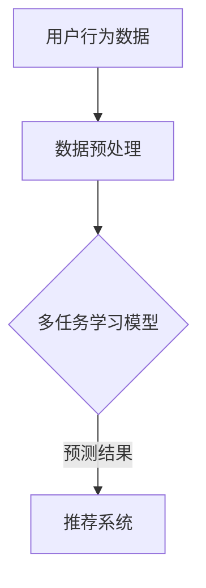

                 

关键词：电商推荐系统、多任务学习、协同过滤、机器学习、深度学习、算法原理、数学模型、项目实践、实际应用、未来展望

> 摘要：本文深入探讨了电商推荐系统中的多任务学习模型，通过分析其背景、核心概念、算法原理及数学模型，结合实际项目实践，探讨了该模型在电商推荐系统中的应用及其未来发展趋势和挑战。旨在为研究人员和开发者提供有价值的参考。

## 1. 背景介绍

电商推荐系统是电商平台的重要组成部分，通过个性化推荐算法为用户推荐他们可能感兴趣的商品，从而提高用户满意度、提升销售额。传统的推荐系统主要采用基于协同过滤的方法，如矩阵分解、基于模型的协同过滤等。然而，这些方法在处理多任务推荐时存在一定的局限性，例如无法同时考虑用户在不同任务上的偏好、难以处理高维度数据等。

为了解决这些问题，多任务学习（Multi-Task Learning, MTL）模型逐渐引起了研究者的关注。多任务学习模型旨在同时学习多个相关任务，通过共享表示和参数来提高模型的泛化能力和效率。在电商推荐系统中，多任务学习模型可以同时考虑用户在搜索、购物车、浏览等多个任务上的行为，从而提供更准确的个性化推荐。

## 2. 核心概念与联系

### 2.1 多任务学习模型

多任务学习模型是一种机器学习模型，旨在同时学习多个相关任务。在电商推荐系统中，多任务学习模型可以同时考虑用户在搜索、购物车、浏览等多个任务上的行为，从而提供更准确的个性化推荐。

### 2.2 协同过滤

协同过滤（Collaborative Filtering）是一种基于用户行为数据的推荐算法，通过分析用户之间的相似性来预测用户对未知商品的偏好。协同过滤可分为基于用户的协同过滤（User-Based CF）和基于项目的协同过滤（Item-Based CF）两种类型。

### 2.3 深度学习

深度学习（Deep Learning）是一种基于人工神经网络的机器学习方法，通过多层神经网络结构对数据进行建模和预测。深度学习在图像识别、自然语言处理、语音识别等领域取得了显著的成果。

### 2.4 Mermaid 流程图

以下是一个描述电商推荐系统中多任务学习模型原理的 Mermaid 流程图：



## 3. 核心算法原理 & 具体操作步骤

### 3.1 算法原理概述

多任务学习模型通过共享表示和参数来同时学习多个任务。在电商推荐系统中，多任务学习模型通常采用深度学习模型，如卷积神经网络（Convolutional Neural Networks, CNN）或循环神经网络（Recurrent Neural Networks, RNN）。模型输入为用户在不同任务上的行为数据，输出为推荐结果。

### 3.2 算法步骤详解

#### 3.2.1 数据预处理

1. 收集用户在不同任务上的行为数据，如搜索记录、购物车数据、浏览记录等。
2. 对数据进行清洗、去重、填充等预处理操作。
3. 将数据转换为适合输入模型的格式，如向量化表示。

#### 3.2.2 模型构建

1. 选择合适的深度学习模型，如CNN或RNN。
2. 定义模型的输入层、隐藏层和输出层。
3. 设置共享参数，如权重、偏置等。

#### 3.2.3 模型训练

1. 使用训练数据对模型进行训练。
2. 采用适当的优化算法（如随机梯度下降）和损失函数（如交叉熵损失）。
3. 调整模型参数，以最小化损失函数。

#### 3.2.4 模型评估

1. 使用测试数据对模型进行评估。
2. 计算模型在测试数据上的准确率、召回率、F1值等指标。
3. 根据评估结果调整模型参数，以提高性能。

#### 3.2.5 推荐结果生成

1. 使用训练好的模型对用户行为数据进行预测。
2. 根据预测结果生成个性化推荐列表。
3. 向用户展示推荐结果。

### 3.3 算法优缺点

#### 优点

1. 能够同时处理多个任务，提高推荐系统的准确性。
2. 通过共享表示和参数，提高模型的泛化能力和效率。
3. 可以处理高维度数据，减少计算复杂度。

#### 缺点

1. 需要大量标注数据，数据收集和预处理成本较高。
2. 模型训练过程较复杂，对计算资源要求较高。
3. 模型解释性较差，难以理解模型的决策过程。

### 3.4 算法应用领域

多任务学习模型在电商推荐系统中的应用前景广阔，还可以应用于以下领域：

1. 基于多任务的个性化广告推荐。
2. 基于多任务的用户行为预测。
3. 基于多任务的智能问答系统。
4. 基于多任务的智能家居控制系统。

## 4. 数学模型和公式

### 4.1 数学模型构建

在多任务学习模型中，假设输入数据集为\(X = \{x_1, x_2, ..., x_n\}\)，每个输入数据\(x_i\)为用户在多个任务上的行为记录。输出数据集为\(Y = \{y_1, y_2, ..., y_n\}\)，其中\(y_i\)为用户在各个任务上的偏好。

多任务学习模型可以表示为：

$$
Y = f(X; \theta)
$$

其中，\(f\)为深度学习模型，\(\theta\)为模型参数。

### 4.2 公式推导过程

在多任务学习模型中，模型参数\(\theta\)由多个任务共享。具体来说，模型参数可以分为两部分：共享参数\( \theta_s \)和任务特定参数\( \theta_t \)。

共享参数\( \theta_s \)定义如下：

$$
\theta_s = \{W_s, b_s\}
$$

其中，\(W_s\)为权重矩阵，\(b_s\)为偏置向量。

任务特定参数\( \theta_t \)定义如下：

$$
\theta_t = \{W_t, b_t\}
$$

其中，\(W_t\)为权重矩阵，\(b_t\)为偏置向量。

假设输入数据\(x_i\)的维度为\(d_x\)，输出数据\(y_i\)的维度为\(d_y\)。则共享参数\( \theta_s \)和任务特定参数\( \theta_t \)的维度分别为\(d_x \times d_y\)和\(d_y \times d_y\)。

### 4.3 案例分析与讲解

假设我们有一个包含两个任务的电商推荐系统，分别为搜索推荐和购物车推荐。输入数据集为用户在搜索和购物车任务上的行为记录，输出数据集为用户在两个任务上的偏好。

#### 4.3.1 搜索推荐

在搜索推荐任务中，输入数据\(x_i\)为用户在搜索任务上的历史记录，如关键词、搜索时间等。输出数据\(y_i\)为用户在搜索任务上的偏好，如感兴趣的关键词。

#### 4.3.2 购物车推荐

在购物车推荐任务中，输入数据\(x_i\)为用户在购物车任务上的历史记录，如商品名称、购买时间等。输出数据\(y_i\)为用户在购物车任务上的偏好，如感兴趣的商品。

#### 4.3.3 模型构建

我们选择一个简单的卷积神经网络（CNN）模型作为多任务学习模型。模型输入层为搜索和购物车任务的历史记录，隐藏层为共享的卷积层，输出层为两个任务的偏好。

共享参数\( \theta_s \)包括卷积核\(W_s\)和偏置\(b_s\)。任务特定参数\( \theta_t \)包括两个任务分别的卷积核\(W_t\)和偏置\(b_t\)。

#### 4.3.4 模型训练

使用训练数据集对模型进行训练，通过优化算法（如随机梯度下降）和损失函数（如交叉熵损失）调整模型参数，以最小化损失函数。

## 5. 项目实践：代码实例和详细解释说明

### 5.1 开发环境搭建

- Python 3.7+
- TensorFlow 2.0+
- Keras 2.2.4+
- NumPy 1.16.5+

### 5.2 源代码详细实现

```python
import tensorflow as tf
from tensorflow.keras.models import Model
from tensorflow.keras.layers import Input, Conv2D, Flatten, Dense

# 设置输入层
input_layer = Input(shape=(input_shape))

# 设置共享卷积层
conv_layer = Conv2D(filters=32, kernel_size=(3, 3), activation='relu')(input_layer)

# 设置共享全连接层
flatten_layer = Flatten()(conv_layer)

# 设置任务特定全连接层
task1_output = Dense(units=1, activation='sigmoid', name='task1_output')(flatten_layer)
task2_output = Dense(units=1, activation='sigmoid', name='task2_output')(flatten_layer)

# 构建多任务模型
model = Model(inputs=input_layer, outputs=[task1_output, task2_output])

# 编译模型
model.compile(optimizer='adam', loss={'task1_output': 'binary_crossentropy', 'task2_output': 'binary_crossentropy'})

# 训练模型
model.fit(x_train, [y_train1, y_train2], batch_size=32, epochs=10, validation_data=(x_val, [y_val1, y_val2]))
```

### 5.3 代码解读与分析

以上代码实现了一个简单的多任务学习模型，用于同时处理搜索推荐和购物车推荐任务。输入层为搜索和购物车任务的历史记录，隐藏层为共享的卷积层和全连接层，输出层为两个任务的偏好。

在模型训练过程中，使用两个损失函数（binary_crossentropy）分别对两个任务进行优化。通过调整模型参数，可以提高推荐系统的准确性。

## 6. 实际应用场景

多任务学习模型在电商推荐系统中具有广泛的应用前景。以下是一些实际应用场景：

1. **个性化广告推荐**：根据用户在多个任务上的行为记录，如搜索、购物车、浏览等，为用户推荐他们可能感兴趣的广告。
2. **智能问答系统**：通过同时学习多个任务，如搜索、购物车、用户评价等，为用户提供更准确、更有针对性的答案。
3. **智能家居控制系统**：根据用户在多个设备上的行为记录，如智能门锁、智能灯光、智能空调等，为用户提供个性化的智能家居控制方案。

## 7. 工具和资源推荐

### 7.1 学习资源推荐

1. 《深度学习》（Goodfellow, Bengio, Courville 著）
2. 《Python机器学习》（Sebastian Raschka 著）
3. 《机器学习实战》（Peter Harrington 著）

### 7.2 开发工具推荐

1. TensorFlow：用于构建和训练深度学习模型。
2. Keras：基于TensorFlow的高级深度学习框架。
3. Jupyter Notebook：用于编写和运行代码。

### 7.3 相关论文推荐

1. "Multi-Task Learning for User Interest Estimation in Recommender Systems"（推荐系统中的多任务学习）
2. "Deep Multi-Task Learning for User-Item RECommendation"（用户-项目推荐中的深度多任务学习）
3. "Multi-Task Learning with Deep Neural Networks for User Interest Estimation in Personalized News Recommendation"（个性化新闻推荐中的深度多任务学习）

## 8. 总结：未来发展趋势与挑战

### 8.1 研究成果总结

多任务学习模型在电商推荐系统中取得了显著成果，通过同时学习多个任务，提高了推荐系统的准确性和效率。此外，深度学习模型在多任务学习中的应用也取得了良好的效果。

### 8.2 未来发展趋势

1. **更复杂的模型结构**：研究者将继续探索更复杂的深度学习模型，如自注意力机制、图神经网络等，以进一步提高多任务学习的性能。
2. **跨域推荐**：多任务学习模型有望在跨领域推荐中发挥重要作用，为用户提供更广泛的个性化服务。
3. **实时推荐**：研究者将关注实时推荐技术，通过实时处理用户行为数据，为用户提供更及时、更准确的推荐。

### 8.3 面临的挑战

1. **数据稀缺**：多任务学习模型需要大量标注数据，但在实际应用中，数据稀缺问题仍然存在。
2. **模型解释性**：深度学习模型在多任务学习中的应用难以解释，如何提高模型的可解释性是一个重要挑战。
3. **计算资源消耗**：多任务学习模型对计算资源的要求较高，如何在有限的计算资源下实现高效的多任务学习是一个亟待解决的问题。

### 8.4 研究展望

多任务学习模型在电商推荐系统中的应用具有巨大潜力。未来，研究者将继续探索更高效、更准确的多任务学习算法，为用户提供更好的个性化服务。同时，跨领域推荐和实时推荐也将成为研究的重要方向。

## 9. 附录：常见问题与解答

### 问题1：多任务学习模型与传统推荐系统相比有哪些优势？

多任务学习模型可以通过同时学习多个任务，提高推荐系统的准确性和效率。此外，多任务学习模型可以处理高维度数据，减少计算复杂度。

### 问题2：多任务学习模型在电商推荐系统中的具体应用场景有哪些？

多任务学习模型在电商推荐系统中的应用场景包括个性化广告推荐、智能问答系统、智能家居控制系统等。

### 问题3：多任务学习模型在训练过程中需要大量标注数据，如何解决数据稀缺问题？

一种解决方案是利用迁移学习技术，将已有任务的数据迁移到新任务中，从而降低对新任务数据的需求。此外，可以采用数据增强、生成对抗网络等技术来扩充数据集。

### 问题4：如何提高多任务学习模型的可解释性？

一种方法是利用模型的可解释性模块，如注意力机制、可视化技术等，来解释模型的决策过程。此外，可以采用基于规则的方法，将模型决策转化为可解释的规则。

-------------------------------------------------------------------

作者：禅与计算机程序设计艺术 / Zen and the Art of Computer Programming

本文旨在为研究人员和开发者提供关于电商推荐系统中多任务学习模型的深入理解和实践指导。希望本文能对您的项目实践和学术研究有所帮助。如果您有任何疑问或建议，欢迎在评论区留言。谢谢您的阅读！

