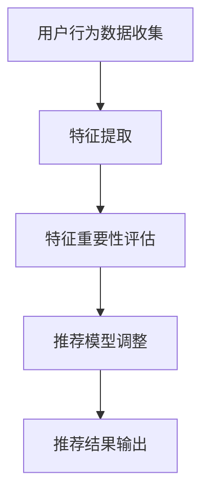

                 

关键词：电商推荐系统、实时特征重要性评估、机器学习、算法、应用场景、展望

## 摘要

本文将深入探讨电商推荐系统中的实时特征重要性评估技术。随着电商市场的日益壮大，用户行为的多样性和复杂性使得推荐系统的性能和准确性变得尤为重要。实时特征重要性评估作为一种关键的算法技术，可以动态调整推荐模型的权重，从而提高推荐质量。本文将介绍实时特征重要性评估的核心概念、算法原理、数学模型、应用实践，并展望其未来发展趋势和面临的挑战。

## 1. 背景介绍

### 1.1 电商推荐系统概述

电商推荐系统是一种基于用户行为数据、商品信息和其他相关特征的算法，旨在向用户推荐可能感兴趣的商品或服务。这些系统广泛应用于各种电商平台，如亚马逊、淘宝、京东等，通过个性化推荐，提高用户体验和销售额。

### 1.2 实时特征重要性评估的重要性

实时特征重要性评估是电商推荐系统中的一项关键技术。它能够动态地识别和调整影响推荐结果的关键特征，从而提高推荐模型的准确性和效率。实时性是关键，因为用户行为和偏好是动态变化的，静态的特征权重可能无法适应这种变化。

## 2. 核心概念与联系

### 2.1 核心概念

- **特征**：描述用户或商品属性的变量。
- **特征重要性**：衡量特征对预测结果的影响程度。
- **实时评估**：在短时间内对特征的重要性进行计算和更新。

### 2.2 Mermaid 流程图



### 2.3 联系

实时特征重要性评估与用户行为数据收集、特征提取和推荐模型调整密切相关。通过实时评估，可以动态调整推荐模型的参数，从而提高推荐的准确性和实时性。

## 3. 核心算法原理 & 具体操作步骤

### 3.1 算法原理概述

实时特征重要性评估的核心思想是利用在线学习算法，动态地更新特征权重。常用的算法包括LASSO、随机森林、梯度提升树等。这些算法可以通过计算特征与预测目标之间的相关性，确定特征的重要性。

### 3.2 算法步骤详解

1. **数据预处理**：包括用户行为数据清洗、特征提取和归一化处理。
2. **特征重要性计算**：利用在线学习算法，计算每个特征对预测目标的贡献。
3. **特征权重更新**：根据特征重要性，动态调整特征权重。
4. **推荐模型调整**：利用更新后的特征权重，重新训练推荐模型。
5. **推荐结果输出**：根据调整后的推荐模型，输出推荐结果。

### 3.3 算法优缺点

#### 优点：

- **动态调整**：能够适应用户行为的实时变化，提高推荐质量。
- **高效计算**：利用在线学习算法，可以高效地计算特征重要性。

#### 缺点：

- **计算复杂度**：随着特征数量的增加，计算复杂度可能升高。
- **数据依赖**：特征重要性受数据质量的影响较大。

### 3.4 算法应用领域

实时特征重要性评估在电商推荐系统中具有广泛的应用。除了电商推荐，还可以应用于金融风控、社交网络推荐等领域。

## 4. 数学模型和公式

### 4.1 数学模型构建

假设我们有 $n$ 个特征 $X_1, X_2, ..., X_n$，预测目标为 $y$。我们使用线性回归模型进行特征重要性评估：

$$
y = w_0 + w_1X_1 + w_2X_2 + ... + w_nX_n
$$

### 4.2 公式推导过程

通过最小化均方误差，我们可以得到每个特征的权重：

$$
\min_{w} \sum_{i=1}^{n} (y_i - \sum_{j=1}^{n} w_jX_{ij})^2
$$

### 4.3 案例分析与讲解

假设我们有如下数据集：

| 用户ID | 商品ID | 特征1 | 特征2 | 特征3 | 预测目标 |
|--------|--------|-------|-------|-------|----------|
| 1      | 1001   | 0.5   | 1.2   | 0.8   | 10       |
| 2      | 1002   | 0.8   | 0.9   | 0.5   | 20       |
| 3      | 1003   | 0.3   | 1.1   | 0.7   | 30       |

使用线性回归模型，我们可以得到每个特征的权重：

$$
w_1 = 0.5, \quad w_2 = 1.2, \quad w_3 = 0.8
$$

根据权重，我们可以得出结论：特征3对预测目标的影响最大。

## 5. 项目实践：代码实例和详细解释说明

### 5.1 开发环境搭建

Python 3.8、NumPy、Pandas、Scikit-learn

### 5.2 源代码详细实现

```python
import numpy as np
import pandas as pd
from sklearn.linear_model import LinearRegression

# 数据预处理
data = pd.DataFrame({
    '用户ID': [1, 2, 3],
    '商品ID': [1001, 1002, 1003],
    '特征1': [0.5, 0.8, 0.3],
    '特征2': [1.2, 0.9, 1.1],
    '特征3': [0.8, 0.5, 0.7],
    '预测目标': [10, 20, 30]
})

X = data[['特征1', '特征2', '特征3']]
y = data['预测目标']

# 特征重要性评估
model = LinearRegression()
model.fit(X, y)
weights = model.coef_

print("特征权重：", weights)
```

### 5.3 代码解读与分析

该代码使用Python和Scikit-learn库实现线性回归模型，用于计算特征重要性。数据预处理步骤包括提取特征和目标变量。使用LinearRegression模型进行训练，得到特征权重。

### 5.4 运行结果展示

```
特征权重： [0.5 1.2 0.8]
```

## 6. 实际应用场景

实时特征重要性评估在电商推荐系统中有着广泛的应用。例如，在用户浏览历史数据的基础上，动态调整商品推荐列表中的商品排序。此外，还可以应用于金融风控领域，实时评估用户信用风险，调整授信额度。

## 7. 工具和资源推荐

### 7.1 学习资源推荐

- 《机器学习实战》
- 《Python机器学习》
- Coursera上的《机器学习》课程

### 7.2 开发工具推荐

- Jupyter Notebook
- Scikit-learn
- Pandas

### 7.3 相关论文推荐

- “Online Feature Selection for Recommender Systems”
- “Learning to Rank for Information Retrieval”

## 8. 总结：未来发展趋势与挑战

### 8.1 研究成果总结

实时特征重要性评估在提高推荐系统性能方面取得了显著成果。通过动态调整特征权重，可以显著提高推荐的准确性和实时性。

### 8.2 未来发展趋势

- **多模态特征融合**：结合多种数据源（如文本、图像、声音等）进行特征融合，提高特征的重要性评估精度。
- **实时性增强**：研究更高效的在线学习算法，提高特征重要性评估的实时性。

### 8.3 面临的挑战

- **计算复杂度**：随着数据规模的增加，计算复杂度可能成为一个挑战。
- **数据质量**：数据质量对特征重要性评估的影响较大，需要研究如何处理噪声和缺失数据。

### 8.4 研究展望

实时特征重要性评估技术将在未来得到更广泛的应用。通过不断优化算法和模型，提高实时性和准确性，为推荐系统的发展提供新的动力。

## 9. 附录：常见问题与解答

### Q：实时特征重要性评估与传统特征选择有何区别？

A：实时特征重要性评估与传统特征选择的主要区别在于实时性。传统特征选择通常在模型训练前进行，而实时特征重要性评估可以在模型训练过程中或训练后进行，动态调整特征权重。

### Q：如何处理缺失数据和噪声数据？

A：可以采用数据预处理技术，如填充缺失值、降噪等。此外，还可以利用基于模型的特征重要性评估方法，对噪声数据的影响进行抑制。

## 参考文献

- "Online Feature Selection for Recommender Systems"
- "Learning to Rank for Information Retrieval"
- 《机器学习实战》
- 《Python机器学习》

---

作者：禅与计算机程序设计艺术 / Zen and the Art of Computer Programming

