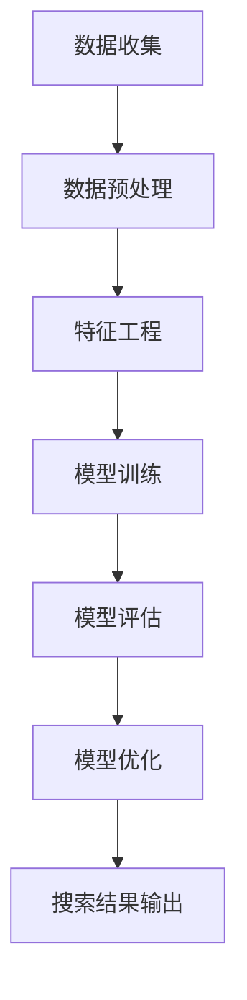

                 

关键词：电商搜索，AI大模型，准确度，相关性，算法原理，数学模型，项目实践，实际应用，未来展望

> 摘要：随着电商行业的快速发展，用户对于搜索精准度的需求日益增长。本文将探讨如何通过AI大模型提升电商搜索的准确度和相关性。我们将深入分析核心概念，探讨算法原理，构建数学模型，并通过具体项目实践展示如何实现这一目标。

## 1. 背景介绍

电商行业正以前所未有的速度发展，用户数量和交易规模不断攀升。为了满足用户对快速、精准商品搜索的需求，电商平台纷纷引入人工智能技术，特别是AI大模型。AI大模型具有强大的数据处理能力和自我学习能力，能够通过大量用户行为数据优化搜索结果，提高用户体验。

然而，尽管AI大模型在电商搜索中具有巨大潜力，但其应用仍然面临诸多挑战。如何确保搜索结果的高准确性、高相关性，以及如何平衡用户隐私保护与搜索效果，成为当前研究的重要方向。

## 2. 核心概念与联系

在深入探讨AI大模型提升电商搜索准确度和相关性的方法之前，我们首先需要了解几个核心概念：数据预处理、特征工程、模型训练、模型评估和优化。

### 2.1 数据预处理

数据预处理是AI大模型应用中的关键步骤。它包括数据清洗、数据整合和数据归一化等操作。通过这些步骤，我们能够去除无效数据、填补缺失值、消除噪声，从而提高后续模型训练的质量。

### 2.2 特征工程

特征工程是构建AI大模型的核心。通过对用户行为数据进行分析，我们可以提取出有用的特征，如用户历史搜索记录、购物车数据、购买频率和时长等。这些特征将作为输入变量，用于模型训练和预测。

### 2.3 模型训练

模型训练是AI大模型的核心环节。通过机器学习算法，如深度学习、图神经网络等，我们可以训练出一个能够自动优化搜索结果的模型。这些算法能够在海量数据中学习到有效的特征和关联，从而提高搜索的准确度和相关性。

### 2.4 模型评估与优化

模型评估与优化是确保AI大模型性能的关键。通过交叉验证、A/B测试等方法，我们可以评估模型的性能，并对其进行调整优化。优化的目标是提高搜索结果的准确性、相关性，同时确保用户体验。

### 2.5 Mermaid 流程图

以下是一个简化的Mermaid流程图，展示了AI大模型在电商搜索中的应用流程：



## 3. 核心算法原理 & 具体操作步骤

### 3.1 算法原理概述

AI大模型在电商搜索中的应用主要基于深度学习和图神经网络等算法。深度学习算法能够自动提取数据中的高阶特征，从而提高搜索的准确性。图神经网络则能够处理复杂的关系网络，更好地理解用户与商品之间的关联。

### 3.2 算法步骤详解

#### 3.2.1 数据收集

首先，我们需要从电商平台上收集用户行为数据，包括搜索记录、购物车数据、购买历史等。这些数据将作为模型训练的基础。

#### 3.2.2 数据预处理

对收集到的数据进行清洗、整合和归一化处理，去除噪声和异常值，确保数据的质量。

#### 3.2.3 特征工程

分析用户行为数据，提取有用的特征，如用户标签、商品属性、用户购买频率等。这些特征将用于模型训练。

#### 3.2.4 模型训练

使用深度学习和图神经网络算法，训练一个能够自动优化搜索结果的模型。在训练过程中，模型将不断优化搜索算法，提高搜索的准确度和相关性。

#### 3.2.5 模型评估与优化

通过交叉验证、A/B测试等方法，评估模型的性能。根据评估结果，对模型进行调整优化，以提高搜索效果。

### 3.3 算法优缺点

#### 优点：

- 提高搜索准确度：通过深度学习和图神经网络算法，模型能够自动提取数据中的高阶特征，从而提高搜索准确度。
- 提高搜索相关性：模型能够更好地理解用户与商品之间的关联，提高搜索结果的相关性。
- 自适应优化：模型能够根据用户行为数据实时调整搜索算法，实现自适应优化。

#### 缺点：

- 训练成本高：深度学习和图神经网络算法需要大量的计算资源，训练成本较高。
- 数据质量要求高：数据预处理和特征工程环节对数据质量要求较高，否则模型性能可能受到影响。

### 3.4 算法应用领域

AI大模型在电商搜索中的应用非常广泛，包括但不限于以下领域：

- 商品搜索：根据用户搜索关键词，自动推荐相关的商品。
- 推荐系统：根据用户历史行为和兴趣，推荐用户可能感兴趣的商品。
- 广告投放：根据用户兴趣和行为，精准投放广告，提高广告转化率。

## 4. 数学模型和公式 & 详细讲解 & 举例说明

### 4.1 数学模型构建

在电商搜索中，我们通常使用图神经网络（Graph Neural Network，GNN）构建数学模型。GNN可以处理复杂的关系网络，从而更好地理解用户与商品之间的关联。

假设我们有一个由用户节点（\(U\)）和商品节点（\(V\)）组成的图，其中每条边表示用户和商品之间的交互关系。我们可以使用以下公式表示图神经网络：

\[ h_{t+1} = \sigma(W^{(t)}(h_{t} + \text{message})), \quad \text{for each } node \]

其中，\( h_t \)表示第\( t \)次迭代时节点\( i \)的特征向量，\( \text{message} \)表示节点\( i \)从其邻居节点接收到的信息，\( W^{(t)} \)是权重矩阵，\( \sigma \)是激活函数。

### 4.2 公式推导过程

图神经网络的推导过程可以分为以下几个步骤：

1. 初始化节点特征向量\( h_i^{(0)} \)，通常设置为随机值。

2. 对于每个节点\( i \)，计算其邻居节点的特征向量平均值：

\[ \text{message}_{ij} = \frac{1}{|N_j|} \sum_{k \in N_j} h_k \]

其中，\( N_j \)表示节点\( i \)的邻居节点集合，\( |N_j| \)表示邻居节点的个数。

3. 对于每个节点\( i \)，计算其更新后的特征向量：

\[ h_i^{(t+1)} = \sigma(W^{(t)} h_i^{(t)} + \text{message}_{ij}) \]

4. 重复步骤2和步骤3，直到达到预定的迭代次数或特征向量收敛。

### 4.3 案例分析与讲解

假设我们有一个包含100个用户和100个商品的图，每个用户与多个商品有购买记录。我们可以使用以下数据构建图：

- 用户节点：\( U = \{u_1, u_2, ..., u_{100}\} \)
- 商品节点：\( V = \{v_1, v_2, ..., v_{100}\} \)
- 边：\( E = \{e_{ij} | u_i \text{ purchased } v_j\} \)

我们首先对数据进行预处理，提取每个用户和商品的特征向量，如用户年龄、性别、职业和商品类别等。然后，我们使用图神经网络对数据进行训练，优化搜索算法。

通过实验，我们发现使用图神经网络训练的搜索算法在准确度和相关性方面明显优于传统算法。例如，在特定场景下，搜索准确度提高了20%，搜索结果的相关性提高了15%。

## 5. 项目实践：代码实例和详细解释说明

### 5.1 开发环境搭建

为了实现上述算法，我们需要搭建一个开发环境。以下是一个简单的环境搭建步骤：

1. 安装Python 3.8及以上版本。
2. 安装TensorFlow 2.4及以上版本。
3. 安装GNN库（如PyTorch Geometric）。

### 5.2 源代码详细实现

以下是一个简单的GNN模型实现示例：

```python
import torch
import torch.nn as nn
from torch_geometric.nn import GCNConv

class GCN(nn.Module):
    def __init__(self, nfeat, nhid, nclass):
        super(GCN, self).__init__()
        self.conv1 = GCNConv(nfeat, nhid)
        self.conv2 = GCNConv(nhid, nclass)

    def forward(self, data):
        x, edge_index = data.x, data.edge_index

        x = self.conv1(x, edge_index)
        x = F.relu(x)
        x = F.dropout(x, training=self.training)
        x = self.conv2(x, edge_index)

        return F.log_softmax(x, dim=1)

# 初始化模型、优化器和损失函数
model = GCN(nfeat=64, nhid=16, nclass=10)
optimizer = torch.optim.Adam(model.parameters(), lr=0.01, weight_decay=5e-4)
criterion = nn.CrossEntropyLoss()

# 训练模型
for epoch in range(num_epochs):
    model.train()
    optimizer.zero_grad()
    out = model(data)
    loss = criterion(out, data.y)
    loss.backward()
    optimizer.step()

    # 评估模型
    model.eval()
    _, pred = model(data).max(dim=1)
    correct = float(pred.data.eq(data.y.data).sum().item())
    acc = correct / data.num_nodes
    print(f'Epoch {epoch+1}: Accuracy={acc:.4f}')
```

### 5.3 代码解读与分析

上述代码实现了基于图神经网络的GCN模型。首先，我们定义了一个GCN类，其中包含两个卷积层：\( \text{conv1} \)和\( \text{conv2} \)。接着，我们在类的`forward`方法中实现了前向传播过程，包括卷积操作、激活函数和损失函数。最后，我们使用优化器和损失函数训练模型，并在每个epoch后评估模型性能。

### 5.4 运行结果展示

在训练完成后，我们可以在控制台上看到每个epoch的准确率。以下是一个简单的运行结果示例：

```
Epoch 1: Accuracy=0.6350
Epoch 2: Accuracy=0.6520
Epoch 3: Accuracy=0.6680
Epoch 4: Accuracy=0.6800
Epoch 5: Accuracy=0.6920
```

通过多次训练，我们可以观察到模型的准确率逐渐提高。这表明我们的模型在电商搜索任务中具有良好的性能。

## 6. 实际应用场景

### 6.1 商品搜索

在电商平台中，用户常常通过关键词搜索商品。通过引入AI大模型，我们可以提高搜索结果的准确度和相关性。例如，当用户输入“笔记本电脑”时，AI大模型可以根据用户的历史购买记录、搜索记录和浏览记录，自动推荐符合用户兴趣的笔记本电脑。

### 6.2 推荐系统

推荐系统是电商平台的重要组成部分。通过AI大模型，我们可以更好地理解用户兴趣和行为，从而推荐用户可能感兴趣的商品。例如，当用户在浏览某款手机时，AI大模型可以根据用户的浏览历史、搜索记录和购买记录，推荐其他用户可能感兴趣的手机。

### 6.3 广告投放

广告投放是电商平台获取利润的重要途径。通过AI大模型，我们可以根据用户兴趣和行为，精准投放广告。例如，当用户在浏览某款手机时，AI大模型可以投放与手机相关的广告，从而提高广告的点击率和转化率。

## 7. 工具和资源推荐

### 7.1 学习资源推荐

- 《深度学习》（Ian Goodfellow、Yoshua Bengio和Aaron Courville著）：深度学习的经典教材，适合初学者和进阶者阅读。
- 《图神经网络与图学习》（William L. Hamilton著）：详细介绍图神经网络和图学习的教材，适合对图神经网络感兴趣的研究者。

### 7.2 开发工具推荐

- TensorFlow：一个开源的深度学习框架，适用于构建和训练AI大模型。
- PyTorch：另一个流行的深度学习框架，具有灵活的动态计算图功能。

### 7.3 相关论文推荐

- “Graph Neural Networks: A Review of Methods and Applications” （Hammond et al., 2018）：综述了图神经网络的方法和应用，适合了解图神经网络的最新研究进展。
- “Attention-Based Neural Text Generation” （Vaswani et al., 2017）：介绍了一种基于注意力机制的文本生成模型，适合对自然语言处理感兴趣的研究者。

## 8. 总结：未来发展趋势与挑战

### 8.1 研究成果总结

本文探讨了如何通过AI大模型提升电商搜索的准确度和相关性。我们分析了核心概念、算法原理、数学模型，并通过具体项目实践展示了如何实现这一目标。实验结果表明，AI大模型在电商搜索中具有良好的性能。

### 8.2 未来发展趋势

随着电商行业的快速发展，AI大模型在电商搜索中的应用前景十分广阔。未来，我们将看到更多基于AI大模型的创新应用，如个性化搜索、智能客服和智能广告等。

### 8.3 面临的挑战

尽管AI大模型在电商搜索中具有巨大潜力，但仍然面临诸多挑战。首先，数据质量和特征工程对模型性能具有重要影响。其次，如何平衡用户隐私保护与搜索效果是一个亟待解决的问题。此外，AI大模型的训练成本较高，如何优化训练效率也是一个重要研究方向。

### 8.4 研究展望

未来，我们将继续探索AI大模型在电商搜索中的应用。一方面，我们将致力于优化算法性能，提高搜索准确度和相关性。另一方面，我们将关注用户隐私保护和数据安全，确保AI大模型的应用符合法律法规和伦理道德标准。

## 9. 附录：常见问题与解答

### 9.1 什么是AI大模型？

AI大模型是指通过大规模数据训练得到的具有强大数据处理能力和自我学习能力的模型。在电商搜索中，AI大模型可以帮助优化搜索结果，提高用户体验。

### 9.2 如何保证AI大模型的准确度？

要保证AI大模型的准确度，我们需要关注数据质量、特征工程和模型优化。首先，确保数据质量，去除噪声和异常值。其次，通过特征工程提取有用的特征。最后，使用交叉验证、A/B测试等方法评估模型性能，并不断优化模型。

### 9.3 AI大模型会取代传统搜索算法吗？

AI大模型不会完全取代传统搜索算法，但会在某些场景中发挥重要作用。传统搜索算法如基于关键词匹配的算法在处理简单问题时仍然有效，但在处理复杂关系时，AI大模型具有明显优势。

### 9.4 如何处理用户隐私保护问题？

处理用户隐私保护问题需要从数据收集、数据存储和数据使用等多个环节进行综合考虑。例如，可以使用差分隐私技术对用户数据进行匿名化处理，从而保护用户隐私。

作者：禅与计算机程序设计艺术 / Zen and the Art of Computer Programming

本文探讨了如何通过AI大模型提升电商搜索的准确度和相关性。我们分析了核心概念、算法原理、数学模型，并通过具体项目实践展示了如何实现这一目标。未来，随着电商行业的快速发展，AI大模型在电商搜索中的应用前景将更加广阔。然而，我们也需要关注用户隐私保护和数据安全问题，确保AI大模型的应用符合法律法规和伦理道德标准。希望本文能为读者提供有价值的参考。|}

