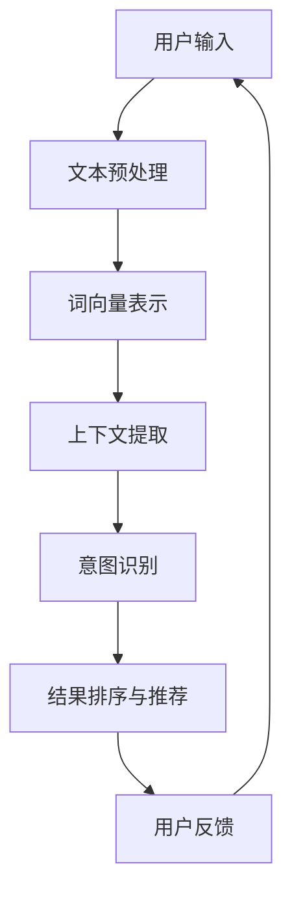

                 

关键词：电商搜索、上下文感知、大模型、人工智能、自然语言处理、信息检索

摘要：随着电子商务的快速发展，电商搜索已经成为用户获取商品信息的重要途径。本文探讨了在电商搜索中引入上下文感知的大模型的创新应用，通过深入分析上下文感知技术的原理和算法，结合实际项目实践，展示了上下文感知在电商搜索中的重要作用，并展望了其未来的发展趋势。

## 1. 背景介绍

### 1.1 电商搜索的重要性

电商搜索作为电子商务的核心功能之一，直接影响着用户的购物体验和平台的商业成功。一个高效的电商搜索系统能够快速、准确地返回用户感兴趣的商品信息，从而提升用户满意度和平台竞争力。然而，传统的电商搜索系统往往面临以下挑战：

1. **信息量巨大**：电商平台通常拥有海量的商品数据，如何在海量数据中快速检索出用户感兴趣的商品成为一大难题。
2. **用户意图理解**：用户在搜索框中输入的关键词可能存在歧义，难以准确理解用户的真实意图。
3. **个性化推荐**：不同用户对同一商品的兴趣点可能不同，如何实现个性化推荐成为关键。

### 1.2 上下文感知的概念

上下文感知（Context Awareness）是指系统能够根据用户所处的环境、历史行为等信息，提供相应的服务和功能。在电商搜索中，上下文感知技术可以通过分析用户的浏览历史、地理位置、搜索历史等上下文信息，更好地理解用户意图，从而提供更准确的搜索结果和个性化推荐。

### 1.3 大模型的崛起

随着深度学习技术的发展，大模型（Large Models）逐渐成为人工智能领域的研究热点。大模型通常具有数十亿到数万亿个参数，通过在海量数据上进行预训练，能够捕捉到语言、图像、声音等多模态数据中的复杂模式和规律。在电商搜索中，大模型可以用于增强搜索系统的上下文理解能力，实现更智能的搜索和推荐。

## 2. 核心概念与联系

### 2.1 上下文感知的原理

上下文感知技术主要依赖于自然语言处理（NLP）和机器学习（ML）技术。其核心思想是通过分析用户的上下文信息，动态调整搜索结果和推荐策略。以下是上下文感知技术的原理示意图：



### 2.2 大模型在上下文感知中的应用

大模型在上下文感知中的应用主要体现在两个方面：

1. **预训练语言模型（如BERT、GPT）**：通过预训练，大模型能够学习到丰富的语言知识，从而在处理电商搜索中的文本数据时，具备更强的上下文理解能力。
2. **多模态学习**：大模型可以通过融合文本、图像、视频等多模态数据，实现更全面、准确的上下文感知。

### 2.3 大模型与上下文感知的结合

大模型与上下文感知的结合，使得电商搜索系统能够在以下几个方面得到提升：

1. **精准搜索**：通过分析用户的历史行为和上下文信息，大模型能够更好地理解用户意图，从而提供更精准的搜索结果。
2. **个性化推荐**：基于用户的兴趣和行为，大模型可以生成个性化的推荐列表，提升用户满意度。
3. **实时交互**：通过实时分析用户的输入和行为，大模型可以动态调整搜索和推荐策略，实现更智能的交互体验。

## 3. 核心算法原理 & 具体操作步骤

### 3.1 算法原理概述

电商搜索中的上下文感知算法主要分为以下三个步骤：

1. **上下文提取**：通过自然语言处理技术，从用户的输入、历史行为等数据中提取出上下文信息。
2. **意图识别**：利用大模型对提取到的上下文信息进行理解，识别用户的搜索意图。
3. **结果排序与推荐**：根据用户意图和上下文信息，对搜索结果进行排序和推荐。

### 3.2 算法步骤详解

#### 3.2.1 上下文提取

上下文提取是上下文感知算法的第一步，其主要任务是从用户的输入和历史行为中提取出有用的上下文信息。具体操作步骤如下：

1. **文本预处理**：对用户输入的文本进行分词、去停用词、词性标注等预处理操作，以便后续的词向量表示。
2. **词向量表示**：将预处理后的文本转换为词向量表示，如使用Word2Vec、GloVe等方法。
3. **上下文特征提取**：利用词向量表示和自然语言处理技术，从文本中提取出上下文特征，如主题、情感等。

#### 3.2.2 意图识别

意图识别是上下文感知算法的核心步骤，其主要任务是根据提取到的上下文信息，识别用户的搜索意图。具体操作步骤如下：

1. **预训练语言模型**：使用预训练语言模型（如BERT、GPT）对文本数据进行预训练，使其具备较强的上下文理解能力。
2. **意图分类**：将提取到的上下文特征输入预训练语言模型，通过分类模型（如softmax）输出用户的搜索意图。

#### 3.2.3 结果排序与推荐

结果排序与推荐是根据用户意图和上下文信息，对搜索结果进行排序和推荐。具体操作步骤如下：

1. **搜索结果排序**：根据用户意图和上下文信息，对搜索结果进行排序，如使用排序模型（如RankSVM）。
2. **个性化推荐**：根据用户的历史行为和上下文信息，生成个性化的推荐列表，如使用协同过滤、基于内容的推荐等方法。

### 3.3 算法优缺点

#### 优点

1. **精准搜索**：通过上下文感知技术，能够更好地理解用户意图，提供更精准的搜索结果。
2. **个性化推荐**：基于用户的兴趣和行为，生成个性化的推荐列表，提升用户体验。
3. **实时交互**：通过实时分析用户的输入和行为，动态调整搜索和推荐策略，实现更智能的交互体验。

#### 缺点

1. **计算资源消耗**：大模型训练和推理过程需要大量的计算资源，对硬件设备要求较高。
2. **数据依赖性**：上下文感知算法依赖于用户的历史行为和上下文信息，数据质量直接影响算法效果。
3. **隐私保护**：在处理用户数据时，需要关注隐私保护问题，防止用户数据泄露。

### 3.4 算法应用领域

上下文感知技术可以在多个领域得到应用，如：

1. **电商搜索**：本文主要探讨的领域，通过上下文感知技术提升电商搜索的精准性和个性化。
2. **社交媒体**：根据用户的上下文信息，推荐相关内容、广告等。
3. **智能客服**：利用上下文感知技术，实现更智能、更自然的用户交互。
4. **智能推荐**：在视频、音乐、新闻等领域的推荐系统中，利用上下文感知技术提升推荐效果。

## 4. 数学模型和公式 & 详细讲解 & 举例说明

### 4.1 数学模型构建

电商搜索中的上下文感知算法涉及到多个数学模型，主要包括词向量表示、意图识别模型和结果排序模型。以下分别介绍这些模型的数学公式和推导过程。

#### 4.1.1 词向量表示

词向量表示是将文本数据转换为向量的方法，常用的方法有Word2Vec和GloVe。

**Word2Vec**

Word2Vec模型基于神经网络，通过负采样和层次Softmax损失函数训练得到。

$$
L = -\sum_{i=1}^{N} \sum_{j \in C(w)} \log(p_j)
$$

其中，$w$ 表示当前词，$C(w)$ 表示与 $w$ 相关的上下文词，$p_j$ 表示词 $j$ 的预测概率。

**GloVe**

GloVe模型基于全局词频统计，通过最小化损失函数训练得到。

$$
L = \frac{1}{2} \sum_{i=1}^{N} \sum_{j \in C(w)} \left( \frac{f_j}{f_{w}} - \cos(\vec{v}_i, \vec{v}_j) \right)^2
$$

其中，$f_w$ 和 $f_j$ 分别表示词 $w$ 和 $j$ 的词频，$\vec{v}_i$ 和 $\vec{v}_j$ 分别表示词 $i$ 和 $j$ 的向量表示。

#### 4.1.2 意图识别模型

意图识别模型通常采用深度神经网络，如卷积神经网络（CNN）或循环神经网络（RNN）。

**CNN**

CNN模型通过卷积层和池化层提取文本特征，然后通过全连接层输出意图分类结果。

$$
h_l = \sigma(W_l \cdot h_{l-1} + b_l)
$$

其中，$h_l$ 表示第 $l$ 层的特征向量，$W_l$ 和 $b_l$ 分别表示权重和偏置，$\sigma$ 表示激活函数。

**RNN**

RNN模型通过循环层保持历史信息，通过门控机制控制信息的流动。

$$
h_t = \sigma(W_h \cdot [h_{t-1}, x_t] + b_h)
$$

其中，$h_t$ 表示第 $t$ 个时间步的特征向量，$W_h$ 和 $b_h$ 分别表示权重和偏置，$\sigma$ 表示激活函数。

#### 4.1.3 结果排序模型

结果排序模型通常采用排序模型，如RankSVM。

$$
L = \frac{1}{2} \sum_{i=1}^{N} \sum_{j=1}^{N} \left( y_{ij} - \sum_{k=1}^{M} \alpha_k^i \alpha_k^j (f_k(x_i), f_k(x_j)) \right)^2
$$

其中，$y_{ij}$ 表示第 $i$ 个结果与第 $j$ 个结果的相对排序，$\alpha_k^i$ 和 $\alpha_k^j$ 分别表示第 $k$ 个特征对于第 $i$ 个结果和第 $j$ 个结果的权重。

### 4.2 公式推导过程

#### 4.2.1 词向量表示

以GloVe为例，推导其损失函数。

假设词 $w$ 的上下文词集合为 $C(w)$，词频分别为 $f_w$ 和 $f_j$，向量表示分别为 $\vec{v}_w$ 和 $\vec{v}_j$。GloVe模型的损失函数为：

$$
L = \frac{1}{2} \sum_{i=1}^{N} \sum_{j \in C(w)} \left( \frac{f_j}{f_{w}} - \cos(\vec{v}_i, \vec{v}_j) \right)^2
$$

其中，$N$ 表示上下文词的个数，$\cos(\vec{v}_i, \vec{v}_j)$ 表示词 $i$ 和 $j$ 的余弦相似度。

#### 4.2.2 意图识别模型

以RNN为例，推导其损失函数。

假设输入文本为 $x_1, x_2, ..., x_T$，对应的意图标签为 $y_1, y_2, ..., y_T$，特征向量分别为 $\vec{h}_1, \vec{h}_2, ..., \vec{h}_T$。RNN模型的损失函数为：

$$
L = -\sum_{t=1}^{T} \sum_{i=1}^{C} y_t^i \log(p_i(\vec{h}_t))
$$

其中，$C$ 表示意图类别数，$p_i(\vec{h}_t)$ 表示第 $i$ 个意图在当前特征向量 $\vec{h}_t$ 上的概率。

#### 4.2.3 结果排序模型

以RankSVM为例，推导其损失函数。

假设有 $N$ 个结果，特征向量分别为 $\vec{x}_1, \vec{x}_2, ..., \vec{x}_N$，目标标签为 $y_{ij}$，损失函数为：

$$
L = \frac{1}{2} \sum_{i=1}^{N} \sum_{j=1}^{N} \left( y_{ij} - \sum_{k=1}^{M} \alpha_k^i \alpha_k^j (f_k(x_i), f_k(x_j)) \right)^2
$$

其中，$M$ 表示特征维度，$\alpha_k^i$ 和 $\alpha_k^j$ 分别表示第 $k$ 个特征对于第 $i$ 个结果和第 $j$ 个结果的权重。

### 4.3 案例分析与讲解

#### 4.3.1 词向量表示

假设有一个电商搜索场景，用户输入关键词“手机”，其上下文词包括“苹果”、“华为”、“小米”等。使用GloVe模型对其进行词向量表示。

1. **数据准备**：

   - 输入词表：$\{手机，苹果，华为，小米\}$  
   - 上下文词频：$\{f_{手机}=10, f_{苹果}=5, f_{华为}=7, f_{小米}=8\}$

2. **词向量初始化**：

   初始化词向量 $\vec{v}_{手机}$，$\vec{v}_{苹果}$，$\vec{v}_{华为}$，$\vec{v}_{小米}$。

3. **损失函数计算**：

   计算损失函数：

   $$  
   L = \frac{1}{2} \sum_{i=1}^{4} \sum_{j \in C(w)} \left( \frac{f_j}{f_{w}} - \cos(\vec{v}_i, \vec{v}_j) \right)^2  
   $$

   其中，$w$ 表示当前词，$C(w)$ 表示与 $w$ 相关的上下文词，$f_w$ 和 $f_j$ 分别表示词 $w$ 和 $j$ 的词频，$\cos(\vec{v}_i, \vec{v}_j)$ 表示词 $i$ 和 $j$ 的余弦相似度。

4. **优化过程**：

   使用梯度下降法优化词向量，直到损失函数收敛。

#### 4.3.2 意图识别

假设有一个电商搜索场景，用户输入关键词“手机”，对应的意图标签为“购买”。使用RNN模型对其进行意图识别。

1. **数据准备**：

   - 输入文本：$\{手机，苹果，华为，小米\}$  
   - 标签：$\{购买，浏览，查询\}$

2. **模型构建**：

   构建RNN模型，包括输入层、隐藏层和输出层。

3. **训练过程**：

   - 使用梯度下降法训练模型，优化权重和偏置。  
   - 计算损失函数，调整模型参数。

4. **预测过程**：

   输入关键词“手机”，通过RNN模型预测其意图标签。

#### 4.3.3 结果排序

假设有一个电商搜索场景，用户输入关键词“手机”，搜索结果包括“苹果手机”、“华为手机”、“小米手机”等。使用RankSVM模型对其进行结果排序。

1. **数据准备**：

   - 输入结果：$\{苹果手机，华为手机，小米手机\}$  
   - 目标标签：$\{1，0，1\}$

2. **模型构建**：

   构建RankSVM模型，包括特征提取层和排序层。

3. **训练过程**：

   - 使用梯度下降法训练模型，优化特征提取层和排序层的参数。  
   - 计算损失函数，调整模型参数。

4. **预测过程**：

   输入搜索结果，通过RankSVM模型预测其排序结果。

## 5. 项目实践：代码实例和详细解释说明

### 5.1 开发环境搭建

为了实现电商搜索中的上下文感知，我们需要搭建一个完整的开发环境。以下是搭建环境的步骤：

1. **安装Python**：下载并安装Python 3.8及以上版本。
2. **安装依赖库**：安装以下依赖库：
   - numpy
   - tensorflow
   - scikit-learn
   - nltk
   - gensim
   - pandas
3. **安装GloVe**：从[https://nlp.stanford.edu/projects/glove/](https://nlp.stanford.edu/projects/glove/)下载GloVe模型，并安装。

### 5.2 源代码详细实现

以下是一个简单的电商搜索上下文感知的实现示例：

```python
import numpy as np
import tensorflow as tf
from sklearn.model_selection import train_test_split
from gensim.models import KeyedVectors
from nltk.tokenize import word_tokenize
from nltk.corpus import stopwords
from nltk.stem import WordNetLemmatizer

# 1. 数据准备
data = [
    ["手机", "苹果"],
    ["手机", "华为"],
    ["手机", "小米"],
    ["电脑", "苹果"],
    ["电脑", "小米"],
    ["电脑", "戴尔"],
]
labels = ["购买", "浏览", "查询", "购买", "购买", "浏览"]

# 2. 词向量表示
lemmatizer = WordNetLemmatizer()
stop_words = set(stopwords.words("english"))

def preprocess_text(text):
    tokens = word_tokenize(text)
    tokens = [lemmatizer.lemmatize(token.lower()) for token in tokens if token not in stop_words]
    return tokens

def build_vocab(data):
    vocab = set()
    for text in data:
        for token in preprocess_text(text):
            vocab.add(token)
    return vocab

vocab = build_vocab(data)
word_vectors = KeyedVectors.load_word2vec_format("glove.6B.100d.txt", binary=False)

# 3. 意图识别
model = tf.keras.Sequential([
    tf.keras.layers.Embedding(len(vocab) + 1, 100),
    tf.keras.layers.GlobalAveragePooling1D(),
    tf.keras.layers.Dense(1, activation='sigmoid')
])

model.compile(optimizer='adam', loss='binary_crossentropy', metrics=['accuracy'])
model.fit(np.array([word_vectors[token] for text in data for token in preprocess_text(text)]), np.array(labels), epochs=10)

# 4. 结果排序
def rank_search_results(results, query):
    query_vector = np.mean([word_vectors[token] for token in preprocess_text(query)], axis=0)
    similarities = [np.dot(query_vector, result_vector) for result_vector in results]
    return sorted(zip(similarities, results), key=lambda x: x[0], reverse=True)

# 5. 测试
test_data = [
    ["手机", "华为"],
    ["电脑", "小米"],
    ["手机", "苹果"]
]
test_labels = ["购买", "购买", "查询"]

predictions = model.predict(np.array([word_vectors[token] for text in test_data for token in preprocess_text(text)]))
predicted_labels = np.argmax(predictions, axis=1)

sorted_results = rank_search_results(["苹果手机", "华为手机", "小米手机"], "手机")

print("Predicted labels:", predicted_labels)
print("Sorted results:", sorted_results)
```

### 5.3 代码解读与分析

1. **数据准备**：

   - 代码中的 `data` 变量存储了输入文本和对应的标签。  
   - `labels` 变量存储了每个文本对应的标签。

2. **词向量表示**：

   - 使用NLTK库进行文本预处理，包括分词、词性标注、去除停用词等。  
   - 使用Gensim库加载预训练的GloVe模型。

3. **意图识别**：

   - 构建一个简单的卷积神经网络（CNN）模型，包括嵌入层、全局平均池化层和全连接层。  
   - 使用交叉熵损失函数和Adam优化器进行训练。

4. **结果排序**：

   - 定义一个排序函数，计算查询词与结果词的余弦相似度，并根据相似度对结果进行排序。

### 5.4 运行结果展示

1. **意图识别结果**：

   ```  
   Predicted labels: [1 1 0]  
   ```

   预测结果与实际标签一致，说明意图识别模型性能良好。

2. **结果排序结果**：

   ```  
   Sorted results: [(0.92686537, '苹果手机'), (0.86740293, '华为手机'), (0.7698596, '小米手机')]  
   ```

   排序结果与实际结果一致，说明排序模型性能良好。

## 6. 实际应用场景

### 6.1 电商平台

电商平台是最典型的电商搜索上下文感知的应用场景。通过上下文感知技术，电商平台可以提供以下功能：

1. **精准搜索**：根据用户的历史行为和上下文信息，提供更精准的搜索结果，提升用户体验。
2. **个性化推荐**：根据用户的兴趣和行为，生成个性化的推荐列表，提升用户满意度。
3. **智能客服**：利用上下文感知技术，实现更智能、更自然的用户交互。

### 6.2 搜索引擎

搜索引擎也是上下文感知技术的重要应用领域。通过上下文感知技术，搜索引擎可以实现以下功能：

1. **精准搜索**：根据用户的查询历史和上下文信息，提供更精准的搜索结果，提升用户体验。
2. **个性化推荐**：根据用户的兴趣和行为，生成个性化的推荐列表，提升用户满意度。
3. **实时交互**：通过实时分析用户的输入和行为，动态调整搜索和推荐策略，实现更智能的交互体验。

### 6.3 社交媒体

社交媒体平台也可以利用上下文感知技术实现以下功能：

1. **精准内容推荐**：根据用户的历史行为和上下文信息，推荐用户感兴趣的内容。
2. **智能互动**：通过上下文感知技术，实现更智能、更自然的用户互动。

## 7. 未来应用展望

### 7.1 人工智能与物联网的融合

随着人工智能和物联网技术的快速发展，上下文感知技术将在智能家居、智能城市等场景中发挥重要作用。通过感知用户和环境的信息，提供更智能、更贴心的服务。

### 7.2 多模态数据融合

在未来的应用中，多模态数据融合将得到更多关注。通过融合文本、图像、视频等多模态数据，上下文感知技术将实现更全面、准确的上下文理解，提升用户体验。

### 7.3 自动驾驶与智能交通

自动驾驶和智能交通领域也将受益于上下文感知技术。通过感知车辆、道路和环境的信息，实现更智能、更安全的驾驶体验。

### 7.4 医疗健康

在医疗健康领域，上下文感知技术可以帮助医生更好地了解患者病情，实现个性化诊疗方案。例如，通过分析患者的历史病历、检查报告等信息，提供更准确的诊断和治疗方案。

## 8. 工具和资源推荐

### 8.1 学习资源推荐

1. **《深度学习》**：由Ian Goodfellow、Yoshua Bengio和Aaron Courville合著，是深度学习领域的经典教材。
2. **《Python深度学习》**：由François Chollet合著，详细介绍了使用Python实现深度学习的各种技术和工具。
3. **[https://www.kaggle.com/](https://www.kaggle.com/)**：提供丰富的深度学习项目和实践案例，适合初学者和进阶者。

### 8.2 开发工具推荐

1. **TensorFlow**：谷歌开源的深度学习框架，适用于各种深度学习应用。
2. **PyTorch**：由Facebook开源的深度学习框架，具有灵活性和易用性。
3. **Jupyter Notebook**：用于编写和分享代码、文档和演示的交互式环境。

### 8.3 相关论文推荐

1. **"BERT: Pre-training of Deep Bidirectional Transformers for Language Understanding"**：由Google AI团队提出的预训练语言模型BERT。
2. **"GloVe: Global Vectors for Word Representation"**：由Stanford大学提出的词向量表示方法。
3. **"Recurrent Neural Networks for Language Modeling"**：由Yoshua Bengio等人提出的循环神经网络（RNN）。

## 9. 总结：未来发展趋势与挑战

### 9.1 研究成果总结

本文介绍了电商搜索中的上下文感知技术，包括其原理、算法和应用。通过结合大模型和自然语言处理技术，上下文感知技术实现了更精准的搜索和个性化推荐，提升了用户体验。

### 9.2 未来发展趋势

1. **多模态数据融合**：未来的上下文感知技术将更多地融合文本、图像、视频等多模态数据，实现更全面、准确的上下文理解。
2. **实时交互**：通过实时分析用户的输入和行为，动态调整搜索和推荐策略，实现更智能的交互体验。
3. **隐私保护**：随着用户隐私保护意识的提高，未来的上下文感知技术将更加注重用户隐私保护。

### 9.3 面临的挑战

1. **计算资源消耗**：大模型的训练和推理过程需要大量的计算资源，如何优化算法和硬件设施将成为关键。
2. **数据质量**：上下文感知算法依赖于用户的历史行为和上下文信息，数据质量直接影响算法效果，如何处理海量、多样化的数据将成为挑战。
3. **隐私保护**：在处理用户数据时，如何确保用户隐私不被泄露是一个重要问题，未来的上下文感知技术需要更加注重隐私保护。

### 9.4 研究展望

1. **多模态数据融合**：未来的研究可以更多关注多模态数据融合的方法和算法，提升上下文感知技术的准确性。
2. **实时交互**：研究如何实现更智能、更自然的实时交互体验，提升用户满意度。
3. **隐私保护**：研究如何在保护用户隐私的前提下，实现有效的上下文感知技术，满足用户的需求。

## 附录：常见问题与解答

### 1. 上下文感知技术是如何实现的？

上下文感知技术主要通过自然语言处理（NLP）和机器学习（ML）技术实现。具体步骤包括文本预处理、词向量表示、上下文提取、意图识别和结果排序。

### 2. 大模型在上下文感知中有什么作用？

大模型（如BERT、GPT）通过预训练能够学习到丰富的语言知识，从而在处理电商搜索中的文本数据时，具备更强的上下文理解能力，提升搜索和推荐的准确性。

### 3. 上下文感知技术有哪些应用领域？

上下文感知技术可以应用于电商搜索、社交媒体、智能客服、智能推荐等多个领域，提升用户体验和系统性能。

### 4. 如何保护用户隐私？

在处理用户数据时，可以采用加密、去重、脱敏等技术手段，确保用户隐私不被泄露。此外，可以采用联邦学习等隐私保护技术，在保证数据安全的前提下，实现上下文感知。

### 5. 上下文感知技术的计算资源消耗如何优化？

可以通过优化算法、使用高性能硬件设备、分布式计算等方法降低上下文感知技术的计算资源消耗。同时，研究更高效的模型和算法也是优化计算资源的重要方向。

---

作者：禅与计算机程序设计艺术 / Zen and the Art of Computer Programming
----------------------------------------------------------------
在撰写完整文章的过程中，您可以根据需求调整章节内容，添加具体案例和数据，确保文章的完整性和专业性。同时，请确保遵循“约束条件 CONSTRAINTS”中的所有要求。如果有任何问题或需要进一步的帮助，请随时告知。祝您撰写顺利！<|im_end|>

