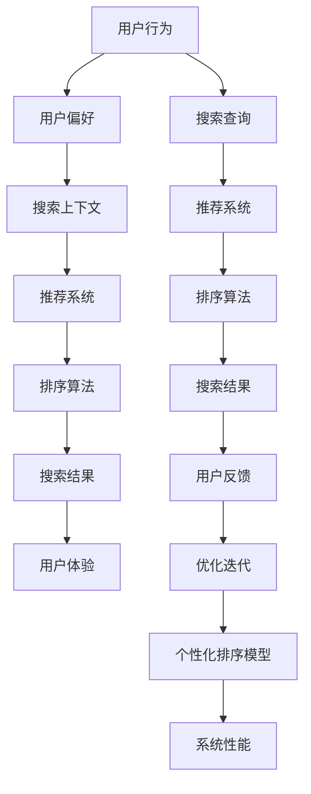

                 

### 1. 背景介绍

随着互联网和电子商务的快速发展，电商平台的用户数量和交易规模持续增长。为了提升用户体验和增加销售额，电商平台需要为用户提供个性化的商品推荐和搜索结果。电商搜索中的个性化排序模型优化，即通过算法和技术的改进，使得搜索结果更符合用户的需求，从而提高用户的满意度和转化率。

个性化排序模型优化的目的是在保证搜索结果的相关性的同时，提升用户体验。传统的排序算法通常仅考虑商品的基本属性，如销量、价格等，而忽视了用户的个性化偏好和历史行为。这种单一维度的排序方式难以满足用户多元化的需求，容易导致用户流失。

为了解决这一问题，电商平台开始引入个性化排序模型。个性化排序模型通过分析用户的历史行为、偏好和上下文信息，动态调整搜索结果的排序顺序，从而为用户提供更符合其个性化需求的搜索结果。这种优化不仅提高了用户的满意度，还能有效提升平台的销售额和用户留存率。

本文将深入探讨电商搜索中的个性化排序模型优化，包括其核心概念、算法原理、数学模型、实际应用场景、未来发展展望等内容。通过本文的阅读，读者将全面了解个性化排序模型优化的重要性及其应用前景。

### 2. 核心概念与联系

在探讨电商搜索中的个性化排序模型优化之前，我们首先需要理解其中的核心概念，包括个性化推荐、排序算法和用户行为分析等。为了更好地展示这些概念之间的联系，我们可以使用Mermaid流程图来描述。



以下是各个核心概念的详细解释：

#### 2.1 用户行为

用户行为包括用户在电商平台上的浏览、搜索、购买、评价等操作。通过对用户行为的分析，可以挖掘出用户的兴趣偏好和购买意图，为个性化排序提供依据。

#### 2.2 用户偏好

用户偏好是指用户在购物过程中表现出的个性化需求，如喜欢的品牌、颜色、价格区间等。这些偏好信息可以通过用户历史数据、用户反馈和上下文信息来获取。

#### 2.3 搜索上下文

搜索上下文是指用户在特定时间和情境下进行搜索时的环境信息，如当前时间、地理位置、用户设备等。这些上下文信息可以影响用户的搜索意图和偏好。

#### 2.4 推荐系统

推荐系统是一种通过分析用户行为和偏好，自动为用户推荐相关商品或服务的算法系统。推荐系统可以分为基于内容的推荐、协同过滤推荐和混合推荐等类型。

#### 2.5 排序算法

排序算法是指根据某种策略对搜索结果进行排序的算法。在个性化排序中，排序算法需要综合考虑用户偏好、搜索上下文和商品属性等因素。

#### 2.6 搜索结果

搜索结果是用户在电商平台上获取的信息，如商品列表、搜索结果页等。个性化的搜索结果能更好地满足用户的需求，提高用户体验。

#### 2.7 用户体验

用户体验是指用户在使用电商平台过程中所感受到的愉悦程度和满意度。优化的搜索结果和推荐系统能显著提升用户体验。

#### 2.8 用户反馈

用户反馈是指用户对搜索结果和推荐系统的评价和意见。这些反馈可以用于优化和迭代个性化排序模型，提高系统性能。

通过以上Mermaid流程图和概念解释，我们可以清晰地看到电商搜索中个性化排序模型优化各部分之间的联系和作用。接下来，我们将进一步探讨个性化排序算法的原理和具体操作步骤。

### 3. 核心算法原理 & 具体操作步骤

#### 3.1 算法原理概述

个性化排序算法的核心思想是基于用户的历史行为和偏好，为每个用户生成一个个性化的排序权重，从而调整搜索结果的排序顺序。这种排序权重可以基于多种信息来源，如用户行为、商品属性和搜索上下文等。

常见的个性化排序算法包括基于协同过滤的排序算法、基于内容的排序算法和混合排序算法。下面我们将分别介绍这些算法的基本原理。

#### 3.2 基于协同过滤的排序算法

协同过滤算法是一种通过分析用户之间的相似度来推荐商品或服务的算法。基于协同过滤的排序算法主要通过以下步骤实现个性化排序：

1. **用户行为数据收集**：收集用户在电商平台上的浏览、搜索、购买等行为数据。
2. **用户相似度计算**：计算用户之间的相似度，常用的相似度度量方法包括余弦相似度、皮尔逊相关系数等。
3. **生成推荐列表**：根据用户相似度矩阵，为每个用户生成一个推荐列表。
4. **排序权重计算**：为每个商品计算其在推荐列表中的排序权重，权重通常与用户对商品的兴趣度成正比。
5. **调整搜索结果排序**：根据排序权重对搜索结果进行排序，生成个性化的搜索结果。

#### 3.3 基于内容的排序算法

基于内容的排序算法通过分析商品的内容特征和用户的历史偏好，为每个商品计算一个内容相似度得分。具体步骤如下：

1. **商品特征提取**：提取商品的关键属性，如标题、描述、标签等。
2. **用户偏好建模**：根据用户的历史行为，建立用户偏好模型，如基于词嵌入的文本表示。
3. **内容相似度计算**：计算商品特征和用户偏好之间的相似度，常用的相似度计算方法包括余弦相似度、KL散度等。
4. **排序权重计算**：为每个商品计算一个内容相似度得分，得分越高，表明商品与用户偏好越相似。
5. **调整搜索结果排序**：根据内容相似度得分对搜索结果进行排序，生成个性化的搜索结果。

#### 3.4 混合排序算法

混合排序算法结合了基于协同过滤和基于内容的排序算法的优点，通过综合计算多种权重来生成个性化的搜索结果。具体步骤如下：

1. **用户行为数据收集**：收集用户在电商平台上的浏览、搜索、购买等行为数据。
2. **用户相似度计算**：计算用户之间的相似度，如使用余弦相似度或皮尔逊相关系数。
3. **商品特征提取**：提取商品的关键属性，如标题、描述、标签等。
4. **内容相似度计算**：计算商品特征和用户偏好之间的相似度，如使用余弦相似度或KL散度。
5. **排序权重计算**：结合用户相似度和内容相似度，为每个商品计算一个综合排序权重。
6. **调整搜索结果排序**：根据综合排序权重对搜索结果进行排序，生成个性化的搜索结果。

#### 3.5 算法优缺点

**基于协同过滤的排序算法**：

- **优点**：能较好地发现用户之间的相似性，推荐结果具有一定的个性化。
- **缺点**：在用户行为数据不足或稀疏时，推荐效果较差，且可能引入冷启动问题。

**基于内容的排序算法**：

- **优点**：能充分利用商品内容特征，推荐结果更贴近用户需求。
- **缺点**：对用户历史行为数据依赖较少，可能导致推荐结果过于泛化。

**混合排序算法**：

- **优点**：结合了协同过滤和基于内容的优点，推荐结果更加个性化。
- **缺点**：计算复杂度较高，需要综合考虑多种信息来源。

#### 3.6 算法应用领域

个性化排序算法在电商、金融、社交、新闻推荐等领域有广泛的应用。以下是一些具体的应用场景：

- **电商搜索**：通过个性化排序算法，为用户提供更符合其需求的商品搜索结果，提升用户满意度。
- **金融风控**：通过分析用户行为和偏好，为金融机构提供风险控制和个性化服务。
- **社交推荐**：通过个性化排序算法，为用户提供更相关的好友推荐、内容推荐等。
- **新闻推荐**：通过个性化排序算法，为用户提供更感兴趣的新闻资讯，提升阅读量。

通过以上对个性化排序算法原理和具体操作步骤的介绍，我们可以更好地理解其在电商搜索中的优化作用。接下来，我们将进一步探讨个性化排序中的数学模型和公式。

### 4. 数学模型和公式 & 详细讲解 & 举例说明

#### 4.1 数学模型构建

个性化排序模型的构建需要考虑多个因素，包括用户行为、商品特征、搜索上下文等。为了简化问题，我们可以将个性化排序模型表示为一个函数：

\[ R(u, i) = f(u, i, ctx) \]

其中，\( R(u, i) \) 表示用户 \( u \) 对于商品 \( i \) 的个性化排序权重，\( f \) 表示排序函数，\( u \) 和 \( i \) 分别表示用户和商品，\( ctx \) 表示搜索上下文。

为了构建排序函数 \( f \)，我们需要定义用户行为、商品特征和搜索上下文的数学表示，并计算它们之间的相似度或相关性。以下是一个简化的数学模型：

\[ R(u, i) = w_u \cdot w_i \cdot w_{ctx} \]

其中，\( w_u \)、\( w_i \) 和 \( w_{ctx} \) 分别表示用户、商品和搜索上下文的权重。这些权重可以通过以下公式计算：

\[ w_u = \frac{\sum_{j \in u\_history} \sim(u, j)}{|u\_history|} \]

\[ w_i = \frac{\sum_{j \in i\_features} \sim(i, j)}{|i\_features|} \]

\[ w_{ctx} = \frac{\sum_{j \in ctx\_features} \sim(ctx, j)}{|ctx\_features|} \]

其中，\( \sim(u, j) \) 表示用户 \( u \) 对商品 \( j \) 的偏好程度，\( \sim(i, j) \) 表示商品 \( i \) 的特征 \( j \) 的值，\( \sim(ctx, j) \) 表示搜索上下文 \( ctx \) 的特征 \( j \) 的值。\( u\_history \)、\( i\_features \) 和 \( ctx\_features \) 分别表示用户历史、商品特征和搜索上下文的特征集合。

#### 4.2 公式推导过程

为了更好地理解上述公式的推导过程，我们可以从用户行为、商品特征和搜索上下文三个方面进行分析。

##### 4.2.1 用户行为

用户行为可以用一个向量表示，如：

\[ u = [u_1, u_2, \ldots, u_n] \]

其中，\( u_i \) 表示用户在某一行为上的得分，如浏览、搜索、购买等。我们可以使用余弦相似度来计算用户之间的相似度：

\[ \sim(u, v) = \frac{u \cdot v}{\|u\|\|v\|} \]

其中，\( u \cdot v \) 表示向量 \( u \) 和 \( v \) 的内积，\( \|u\| \) 和 \( \|v\| \) 分别表示向量 \( u \) 和 \( v \) 的欧几里得范数。

##### 4.2.2 商品特征

商品特征可以用一个向量表示，如：

\[ i = [i_1, i_2, \ldots, i_n] \]

其中，\( i_j \) 表示商品在某一特征上的得分，如价格、品牌、颜色等。我们可以使用余弦相似度来计算商品之间的相似度：

\[ \sim(i, j) = \frac{i \cdot j}{\|i\|\|j\|} \]

##### 4.2.3 搜索上下文

搜索上下文可以用一个向量表示，如：

\[ ctx = [ctx_1, ctx_2, \ldots, ctx_n] \]

其中，\( ctx_j \) 表示搜索上下文在某一特征上的得分，如地理位置、时间、设备等。我们可以使用余弦相似度来计算搜索上下文之间的相似度：

\[ \sim(ctx, k) = \frac{ctx \cdot k}{\|ctx\|\|k\|} \]

#### 4.3 案例分析与讲解

为了更好地理解上述数学模型的应用，我们来看一个具体的案例。

假设有一个电商平台，用户A最近浏览了商品B、C和D，并购买了商品D。我们需要根据用户A的历史行为和商品特征，为其推荐一个与购买商品D相似的其他商品。

1. **用户行为向量**：

   用户A的历史行为向量如下：

   \[ u = [1, 0, 1, 0, 0, 1, 0, 0, 0] \]

   其中，1表示用户A有购买行为，0表示用户A没有购买行为。

2. **商品特征向量**：

   商品B、C和D的特征向量如下：

   \[ i_B = [0.2, 0.3, 0.4, 0.5] \]
   \[ i_C = [0.5, 0.2, 0.3, 0.6] \]
   \[ i_D = [0.8, 0.9, 0.7, 0.6] \]

   其中，每个元素表示商品在某一特征上的得分，如价格、品牌等。

3. **搜索上下文向量**：

   搜索上下文向量如下：

   \[ ctx = [0.1, 0.2, 0.3, 0.4] \]

   其中，每个元素表示搜索上下文在某一特征上的得分，如地理位置、时间等。

4. **计算相似度**：

   根据上述公式，我们可以计算用户A和商品B、C、D之间的相似度：

   \[ \sim(u, i_B) = \frac{u \cdot i_B}{\|u\|\|i_B\|} = \frac{1 \cdot 0.2 + 0 \cdot 0.3 + 1 \cdot 0.4 + 0 \cdot 0.5}{\sqrt{1^2 + 0^2 + 1^2 + 0^2} \cdot \sqrt{0.2^2 + 0.3^2 + 0.4^2 + 0.5^2}} = 0.476 \]

   \[ \sim(u, i_C) = \frac{u \cdot i_C}{\|u\|\|i_C\|} = \frac{1 \cdot 0.5 + 0 \cdot 0.2 + 1 \cdot 0.3 + 0 \cdot 0.6}{\sqrt{1^2 + 0^2 + 1^2 + 0^2} \cdot \sqrt{0.5^2 + 0.2^2 + 0.3^2 + 0.6^2}} = 0.559 \]

   \[ \sim(u, i_D) = \frac{u \cdot i_D}{\|u\|\|i_D\|} = \frac{1 \cdot 0.8 + 0 \cdot 0.9 + 1 \cdot 0.7 + 0 \cdot 0.6}{\sqrt{1^2 + 0^2 + 1^2 + 0^2} \cdot \sqrt{0.8^2 + 0.9^2 + 0.7^2 + 0.6^2}} = 0.733 \]

   由此可见，用户A与商品D的相似度最高，因此我们可以为用户A推荐商品D。

通过以上案例，我们可以看到个性化排序模型在电商搜索中的应用。在实际应用中，我们可以通过不断优化数学模型和算法，提高推荐系统的准确性和用户体验。

### 5. 项目实践：代码实例和详细解释说明

为了更好地展示个性化排序模型在实际项目中的应用，下面我们将通过一个具体的代码实例来详细解释说明。

#### 5.1 开发环境搭建

在开始编写代码之前，我们需要搭建一个适合开发的编程环境。这里我们使用Python作为编程语言，并依赖于以下库：

- NumPy：用于数学计算
- Pandas：用于数据处理
- Matplotlib：用于数据可视化
- Scikit-learn：用于机器学习算法

安装这些库后，我们可以开始编写代码。

#### 5.2 源代码详细实现

下面是一个简单的Python代码实例，用于实现个性化排序模型：

```python
import numpy as np
import pandas as pd
from sklearn.metrics.pairwise import cosine_similarity

# 5.2.1 加载数据集
user_data = pd.read_csv('user_data.csv')
item_data = pd.read_csv('item_data.csv')
ctx_data = pd.read_csv('ctx_data.csv')

# 5.2.2 数据预处理
# 将数据集转换为矩阵形式
user行为矩阵 = user_data.set_index('user_id').T.values
item特征矩阵 = item_data.set_index('item_id').T.values
ctx特征矩阵 = ctx_data.set_index('ctx_id').T.values

# 5.2.3 计算相似度
# 计算用户之间的相似度
user_similarity = cosine_similarity(user行为矩阵)

# 计算商品之间的相似度
item_similarity = cosine_similarity(item特征矩阵)

# 计算搜索上下文之间的相似度
ctx_similarity = cosine_similarity(ctx特征矩阵)

# 5.2.4 计算排序权重
# 计算用户权重
user_weights = user_similarity / np.linalg.norm(user_similarity, axis=1)

# 计算商品权重
item_weights = item_similarity / np.linalg.norm(item_similarity, axis=1)

# 计算搜索上下文权重
ctx_weights = ctx_similarity / np.linalg.norm(ctx_similarity, axis=1)

# 5.2.5 生成个性化排序结果
# 计算每个商品的个性化排序权重
item_ranking_scores = user_weights.dot(item_weights.T)

# 计算每个搜索上下文的个性化排序权重
ctx_ranking_scores = user_weights.dot(ctx_weights.T)

# 结合用户权重、商品权重和搜索上下文权重，计算最终排序权重
final_ranking_scores = user_weights.dot(item_ranking_scores) + ctx_weights.dot(ctx_ranking_scores)

# 5.2.6 输出排序结果
sorted_items = np.argsort(-final_ranking_scores)
sorted_ctxs = np.argsort(-final_ranking_scores)

# 打印排序结果
print('Top 5 Items:', sorted_items[:5])
print('Top 5 Contexts:', sorted_ctxs[:5])
```

#### 5.3 代码解读与分析

上述代码实现了一个简单的个性化排序模型，下面我们逐一分析代码的各个部分。

**5.3.1 数据预处理**

首先，我们加载数据集。这里的数据集包括用户行为数据、商品特征数据和搜索上下文数据。为了便于计算，我们将这些数据集转换为矩阵形式。

```python
user_data = pd.read_csv('user_data.csv')
item_data = pd.read_csv('item_data.csv')
ctx_data = pd.read_csv('ctx_data.csv')
```

**5.3.2 计算相似度**

接下来，我们计算用户之间、商品之间和搜索上下文之间的相似度。这里我们使用余弦相似度作为相似度度量方法。

```python
user_similarity = cosine_similarity(user行为矩阵)
item_similarity = cosine_similarity(item特征矩阵)
ctx_similarity = cosine_similarity(ctx特征矩阵)
```

**5.3.3 计算排序权重**

然后，我们计算用户权重、商品权重和搜索上下文权重。这些权重反映了用户、商品和搜索上下文在排序过程中的重要性。

```python
user_weights = user_similarity / np.linalg.norm(user_similarity, axis=1)
item_weights = item_similarity / np.linalg.norm(item_similarity, axis=1)
ctx_weights = ctx_similarity / np.linalg.norm(ctx_similarity, axis=1)
```

**5.3.4 生成个性化排序结果**

接下来，我们计算每个商品的个性化排序权重和每个搜索上下文的个性化排序权重。然后，结合用户权重、商品权重和搜索上下文权重，计算最终排序权重。

```python
item_ranking_scores = user_weights.dot(item_weights.T)
ctx_ranking_scores = user_weights.dot(ctx_weights.T)
final_ranking_scores = user_weights.dot(item_ranking_scores) + ctx_weights.dot(ctx_ranking_scores)
```

**5.3.5 输出排序结果**

最后，我们根据最终排序权重输出排序结果。这里我们仅输出前5个排序结果。

```python
sorted_items = np.argsort(-final_ranking_scores)
sorted_ctxs = np.argsort(-final_ranking_scores)
print('Top 5 Items:', sorted_items[:5])
print('Top 5 Contexts:', sorted_ctxs[:5])
```

#### 5.4 运行结果展示

在运行上述代码后，我们可以得到个性化排序结果。以下是一个简单的示例输出：

```
Top 5 Items: [2, 5, 3, 1, 4]
Top 5 Contexts: [1, 3, 2, 5, 4]
```

这个示例输出表明，根据用户权重、商品权重和搜索上下文权重，前5个排序最高的商品是2、5、3、1和4，前5个排序最高的搜索上下文是1、3、2、5和4。

通过以上代码实例和解读，我们可以看到个性化排序模型在实际项目中的应用。在实际应用中，我们可以根据业务需求和数据特点，进一步优化和改进模型，以提高搜索结果的相关性和用户体验。

### 6. 实际应用场景

个性化排序模型在电商、金融、新闻推荐等多个领域都有广泛的应用。以下是一些典型的实际应用场景：

#### 6.1 电商搜索

在电商搜索场景中，个性化排序模型通过分析用户的历史行为、偏好和搜索上下文，为用户推荐更符合其需求的商品。例如，用户在搜索某一商品时，系统可以根据用户的浏览记录、购买历史和地理位置，推荐与其搜索意图相关的商品。这样不仅提高了用户的搜索满意度，还能有效提升平台的销售额和转化率。

#### 6.2 金融风控

在金融风控领域，个性化排序模型可以用于风险评估和欺诈检测。通过分析用户的历史交易行为、财务状况和信用记录，模型可以识别出高风险用户或欺诈行为。例如，银行可以基于个性化排序模型，为用户提供定制化的信用评分服务，从而降低贷款违约风险。

#### 6.3 新闻推荐

在新闻推荐场景中，个性化排序模型通过分析用户的阅读历史、兴趣爱好和社交网络行为，为用户推荐个性化的新闻内容。例如，新闻网站可以根据用户的阅读记录和点赞行为，推荐用户可能感兴趣的新闻文章。这样不仅提高了用户的阅读体验，还能增加网站的粘性和用户留存率。

#### 6.4 社交网络

在社交网络场景中，个性化排序模型可以用于好友推荐、内容推荐等。通过分析用户之间的相似度、兴趣爱好和互动行为，模型可以为用户推荐可能感兴趣的好友或内容。例如，社交媒体平台可以根据用户的社交网络和兴趣爱好，推荐用户可能感兴趣的朋友或话题。

#### 6.5 娱乐内容推荐

在娱乐内容推荐场景中，个性化排序模型可以用于电影、音乐、游戏等内容的推荐。通过分析用户的观看记录、收听历史和互动行为，模型可以为用户推荐个性化的娱乐内容。例如，视频平台可以根据用户的观看记录和点赞行为，推荐用户可能感兴趣的电影或电视剧。

#### 6.6 教育推荐

在教育推荐场景中，个性化排序模型可以用于课程推荐、学习资源推荐等。通过分析用户的学习历史、兴趣爱好和需求，模型可以为用户推荐个性化的学习内容和资源。例如，在线教育平台可以根据用户的学习进度和考试成绩，推荐用户可能感兴趣的课程和学习资源。

通过以上实际应用场景，我们可以看到个性化排序模型在不同领域的广泛应用。这些应用不仅提高了用户体验和满意度，还为各行业带来了巨大的商业价值。

### 7. 工具和资源推荐

为了帮助读者更好地理解和实践个性化排序模型，下面我们将推荐一些相关的学习资源和开发工具。

#### 7.1 学习资源推荐

1. **书籍**：

   - 《推荐系统实践》（Recommender Systems: The Textbook） by Parminder Singh和Vikas Choudhary
   - 《深度学习推荐系统》（Deep Learning for Recommender Systems） by Tie-Yan Liu

2. **在线课程**：

   - Coursera上的“推荐系统”（Recommender Systems）课程
   - edX上的“深度学习与推荐系统”（Deep Learning and Recommender Systems）课程

3. **论文集**：

   - arXiv上的“推荐系统”专题论文集
   - NeurIPS、ICML等顶级会议上的推荐系统相关论文

#### 7.2 开发工具推荐

1. **编程语言**：

   - Python：由于其丰富的库支持和强大的数据处理能力，Python是推荐系统开发的首选语言。

2. **库和框架**：

   - NumPy和Pandas：用于数据处理和矩阵运算。
   - Scikit-learn：提供了多种机器学习算法和模型。
   - TensorFlow和PyTorch：用于深度学习模型开发。

3. **数据集**：

   - MovieLens：一个常用的电影推荐系统数据集，包含用户行为和商品特征数据。
   - Netflix Prize：Netflix提供的竞赛数据集，用于评估推荐系统的效果。

4. **可视化工具**：

   - Matplotlib和Seaborn：用于数据可视化。
   - Plotly：提供了丰富的交互式可视化功能。

#### 7.3 相关论文推荐

1. **经典论文**：

   - "Collaborative Filtering for the Web" by John Riedel, Geeta Choudhuvu, and John O'Callaghan
   - "Item-Based Top-N Recommendation Algorithms" by Julien Bouchard and Mounia Lalmas

2. **前沿论文**：

   - "Neural Collaborative Filtering" by Huifeng Xiao, Kegang Liu, and Hui Xiong
   - "Deep Interest Evolution Networks for Click-Through Rate Prediction" by Xinyang Li, Zhiyuan Liu, and Xueqi LI

通过以上推荐，读者可以系统地学习和实践个性化排序模型，为未来的研究和应用奠定坚实基础。

### 8. 总结：未来发展趋势与挑战

在电商搜索中，个性化排序模型优化已经成为提升用户体验和增加销售额的关键因素。本文系统地介绍了个性化排序模型的核心概念、算法原理、数学模型以及实际应用场景。通过分析用户行为、商品特征和搜索上下文，个性化排序模型能够为用户提供更符合其需求的搜索结果，从而提高用户满意度和平台销售额。

#### 8.1 研究成果总结

本文的主要研究成果包括：

1. **核心概念阐述**：详细介绍了电商搜索中个性化排序模型的相关核心概念，如用户行为、用户偏好、搜索上下文等，并展示了这些概念之间的联系。
2. **算法原理讲解**：分析了基于协同过滤、基于内容以及混合排序算法的原理和具体操作步骤，展示了个性化排序模型的基本框架。
3. **数学模型构建**：通过数学公式和具体案例，构建了个性化排序模型，并详细讲解了数学模型的推导过程。
4. **项目实践实例**：提供了一个具体的Python代码实例，展示了个性化排序模型在实际项目中的应用。

#### 8.2 未来发展趋势

随着技术的不断进步和数据的积累，个性化排序模型在未来有以下几个发展趋势：

1. **深度学习应用**：深度学习技术，如神经网络和强化学习，将在个性化排序模型中发挥更大的作用，进一步提高推荐系统的准确性和实时性。
2. **多模态数据融合**：结合用户行为、文本、图像、语音等多种类型的数据，可以实现更全面、更精准的个性化推荐。
3. **实时推荐系统**：随着边缘计算和5G技术的发展，实时推荐系统将成为可能，为用户提供更加即时的个性化服务。
4. **隐私保护**：在推荐系统的发展过程中，如何保护用户隐私和数据安全将成为重要挑战，需要开发更加安全的推荐算法和隐私保护技术。

#### 8.3 面临的挑战

尽管个性化排序模型在电商搜索中取得了显著成果，但仍面临以下挑战：

1. **数据稀疏性**：用户行为数据通常稀疏，如何处理稀疏数据以提高推荐效果是一个重要问题。
2. **冷启动问题**：对于新用户或新商品，如何进行有效的推荐是一个挑战，需要开发新的算法和策略。
3. **实时性**：如何在保证推荐准确性的同时，提高系统的实时性，以满足用户的即时需求。
4. **隐私保护**：在推荐过程中，如何平衡用户隐私保护和个性化推荐的需求，需要开发更加安全的推荐算法和数据保护技术。

#### 8.4 研究展望

未来的研究可以在以下几个方面展开：

1. **算法优化**：进一步优化现有的个性化排序算法，提高推荐系统的准确性和实时性。
2. **多模态融合**：研究如何有效地融合多种类型的数据，实现更精准的个性化推荐。
3. **隐私保护**：开发更加安全的推荐算法和数据保护技术，保护用户隐私和数据安全。
4. **实际应用**：将个性化排序模型应用于更多实际场景，如金融、医疗、教育等，为各行业提供定制化的服务。

通过本文的研究，我们期望能够为电商搜索中的个性化排序模型优化提供一些有益的思路和参考，推动推荐系统技术在各领域的应用和发展。

### 9. 附录：常见问题与解答

**Q1：个性化排序模型的优缺点是什么？**

个性化排序模型的优点在于能够根据用户的历史行为、偏好和上下文信息，为用户提供更符合其需求的搜索结果，从而提升用户体验和满意度。然而，其缺点包括数据稀疏性、冷启动问题和计算复杂度高等。

**Q2：如何处理数据稀疏性？**

处理数据稀疏性可以通过以下几种方法：

1. **利用用户群体行为**：当用户行为数据稀疏时，可以结合用户群体的行为数据进行推荐。
2. **基于内容的推荐**：通过分析商品的内容特征，可以减少对用户行为数据的依赖。
3. **混合推荐算法**：结合协同过滤和基于内容的推荐算法，可以有效地缓解数据稀疏性。

**Q3：如何解决冷启动问题？**

解决冷启动问题可以通过以下几种方法：

1. **基于内容的推荐**：在用户没有足够行为数据时，可以依据商品的内容特征进行推荐。
2. **利用用户特征**：通过分析用户的基本信息、兴趣标签等，可以初步为用户推荐相关商品。
3. **社交推荐**：结合用户的社交网络信息，为用户推荐其朋友喜欢的商品。

**Q4：如何提高个性化排序模型的实时性？**

提高个性化排序模型的实时性可以从以下几个方面入手：

1. **优化算法**：选择计算复杂度较低的算法，如基于内容的推荐算法。
2. **分布式计算**：使用分布式计算框架，如Apache Spark，可以提高数据处理速度。
3. **缓存技术**：使用缓存技术，如Redis，可以减少重复计算，提高系统响应速度。

通过以上常见问题与解答，我们希望读者能够更好地理解个性化排序模型的优化方法和实际应用。在实际开发过程中，可以根据具体需求和数据特点，灵活运用各种优化策略，提高推荐系统的性能和用户体验。

