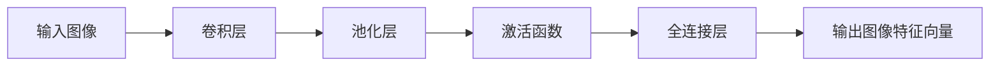
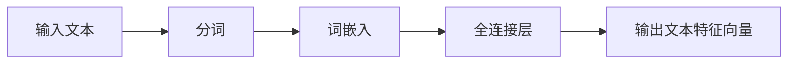
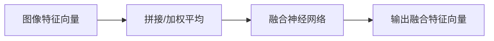
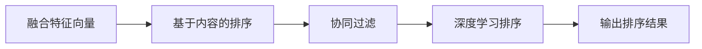

                 

关键词：电商搜索、多模态融合、排序算法、机器学习、深度学习、图像识别、文本匹配

## 摘要

随着电子商务的快速发展，电商搜索成为用户获取商品信息的重要渠道。然而，现有的搜索算法主要基于文本匹配，无法充分利用用户上传的图片、视频等多模态信息。本文将介绍一种基于多模态融合的电商搜索排序算法，通过将图像和文本信息进行有效整合，提高搜索结果的准确性和用户体验。本文首先对电商搜索的背景进行了介绍，随后详细阐述了多模态融合排序算法的核心概念、原理和具体实现，最后探讨了该算法在电商搜索中的实际应用和未来展望。

## 1. 背景介绍

### 1.1 电商搜索的发展历程

电商搜索是电子商务领域的重要组成部分，它通过搜索引擎帮助用户快速找到所需商品。自20世纪90年代末以来，电商搜索经历了从基于关键词匹配到基于机器学习、深度学习的演变。

#### 1.1.1 基于关键词匹配

早期电商搜索主要基于关键词匹配，通过分析用户输入的关键词和商品标题、描述等信息进行匹配。这种方法的优点是实现简单，计算速度快，但缺点是匹配结果往往不够准确，用户体验较差。

#### 1.1.2 基于机器学习

随着机器学习技术的发展，电商搜索开始引入机器学习算法，如协同过滤、基于内容的推荐等。这些算法通过分析用户历史行为、商品特征等信息，提高了搜索结果的准确性。

#### 1.1.3 基于深度学习

近年来，深度学习技术在电商搜索中得到了广泛应用。深度学习算法通过神经网络模型，能够自动提取图像和文本特征，从而实现更精准的搜索结果。

### 1.2 多模态融合在电商搜索中的重要性

用户在电商平台上进行搜索时，不仅会输入关键词，还会上传图片、视频等多模态信息。这些多模态信息蕴含了丰富的用户意图和商品特征，如果能够充分利用，将大幅提升搜索结果的准确性。

#### 1.2.1 图像信息

图像信息能够直观地展示商品的外观、质量等特征，对于用户识别商品非常有帮助。例如，当用户搜索“手机壳”时，上传的图片可以帮助系统更准确地识别用户所需商品。

#### 1.2.2 文本信息

文本信息是电商搜索中最重要的信息来源，用户通过关键词和商品描述等信息表达搜索意图。然而，文本信息往往存在模糊性，难以准确传达用户意图。

#### 1.2.3 多模态融合

通过多模态融合，我们可以将图像和文本信息进行有效整合，从而提高搜索结果的准确性。多模态融合算法能够自动提取图像和文本特征，并利用这些特征进行排序，从而实现更精准的搜索结果。

## 2. 核心概念与联系

### 2.1 多模态融合的定义

多模态融合是指将来自不同模态的数据（如图像、文本、音频等）进行整合，以获得更全面、准确的信息。在电商搜索中，多模态融合旨在利用图像和文本信息，提高搜索结果的准确性。

### 2.2 多模态融合架构


多模态融合架构主要包括以下三个步骤：

#### 2.2.1 特征提取

特征提取是指从图像和文本数据中提取关键特征。图像特征可以采用卷积神经网络（CNN）提取，文本特征可以采用词嵌入（word embedding）方法提取。

#### 2.2.2 特征融合

特征融合是指将提取的图像和文本特征进行整合。常见的特征融合方法包括拼接、加权平均、融合神经网络等。

#### 2.2.3 排序算法

排序算法是指利用融合后的特征进行商品排序。常见的排序算法包括基于内容的排序、协同过滤、深度学习排序等。

### 2.3 多模态融合与现有算法的对比

与现有基于文本匹配和基于机器学习的搜索算法相比，多模态融合具有以下优势：

#### 2.3.1 更高的准确性

多模态融合算法能够充分利用图像和文本信息，从而提高搜索结果的准确性。相比仅依赖文本信息的算法，多模态融合算法在处理模糊、复杂的搜索请求时具有更好的表现。

#### 2.3.2 更好的用户体验

多模态融合算法能够更准确地理解用户意图，从而提供更相关的搜索结果，提升用户体验。

#### 2.3.3 更广泛的适用场景

多模态融合算法可以应用于多种场景，如商品搜索、商品推荐、内容审核等。相比单一模态的算法，多模态融合算法具有更广泛的适用性。

## 3. 核心算法原理 & 具体操作步骤

### 3.1 算法原理概述

多模态融合排序算法的基本原理是：首先从图像和文本数据中提取关键特征，然后利用这些特征进行商品排序。具体步骤如下：

#### 3.1.1 图像特征提取

采用卷积神经网络（CNN）对图像进行特征提取，生成图像特征向量。

#### 3.1.2 文本特征提取

采用词嵌入（word embedding）方法对文本进行特征提取，生成文本特征向量。

#### 3.1.3 特征融合

将图像特征向量和文本特征向量进行融合，生成融合特征向量。

#### 3.1.4 排序算法

利用融合特征向量进行商品排序，选取排序结果最前的商品作为搜索结果。

### 3.2 算法步骤详解

#### 3.2.1 数据预处理

对图像和文本数据进行预处理，包括图像大小调整、文本分词、去除停用词等。

#### 3.2.2 图像特征提取

采用卷积神经网络（CNN）对图像进行特征提取。常见的CNN结构包括LeNet、AlexNet、VGG、ResNet等。



#### 3.2.3 文本特征提取

采用词嵌入（word embedding）方法对文本进行特征提取。常见的词嵌入方法包括Word2Vec、GloVe、BERT等。



#### 3.2.4 特征融合

将图像特征向量和文本特征向量进行融合。常见的融合方法包括拼接、加权平均、融合神经网络等。



#### 3.2.5 排序算法

利用融合特征向量进行商品排序。常见的排序算法包括基于内容的排序、协同过滤、深度学习排序等。



### 3.3 算法优缺点

#### 3.3.1 优点

- **高准确性**：多模态融合算法能够充分利用图像和文本信息，提高搜索结果的准确性。
- **广泛适用性**：多模态融合算法可以应用于多种场景，如商品搜索、商品推荐、内容审核等。
- **提升用户体验**：多模态融合算法能够更准确地理解用户意图，提供更相关的搜索结果，提升用户体验。

#### 3.3.2 缺点

- **计算成本高**：多模态融合算法涉及多种技术和方法，计算成本较高。
- **数据需求量大**：多模态融合算法需要大量的图像和文本数据作为训练集，数据获取和处理成本较高。

### 3.4 算法应用领域

多模态融合排序算法在电商搜索、商品推荐、内容审核等领域具有广泛的应用。

#### 3.4.1 电商搜索

在电商搜索中，多模态融合排序算法可以用于商品搜索、商品推荐等场景，提高搜索结果的准确性。

#### 3.4.2 商品推荐

在商品推荐中，多模态融合排序算法可以结合用户行为、商品特征等信息，提供更个性化的推荐结果。

#### 3.4.3 内容审核

在内容审核中，多模态融合排序算法可以用于识别和处理违规内容，如虚假广告、不良信息等。

## 4. 数学模型和公式 & 详细讲解 & 举例说明

### 4.1 数学模型构建

多模态融合排序算法的数学模型主要包括三个部分：图像特征提取、文本特征提取和特征融合。

#### 4.1.1 图像特征提取

假设输入图像为\(I\)，卷积神经网络（CNN）提取的图像特征向量为\(F_i\)，可以表示为：

\[ F_i = f(CNN, I) \]

其中，\(f\)表示卷积神经网络的处理过程。

#### 4.1.2 文本特征提取

假设输入文本为\(T\)，词嵌入（word embedding）提取的文本特征向量为\(F_t\)，可以表示为：

\[ F_t = g(word\ embedding, T) \]

其中，\(g\)表示词嵌入的处理过程。

#### 4.1.3 特征融合

将图像特征向量\(F_i\)和文本特征向量\(F_t\)进行融合，生成融合特征向量\(F\)，可以表示为：

\[ F = h(F_i, F_t) \]

其中，\(h\)表示特征融合的处理过程。

### 4.2 公式推导过程

#### 4.2.1 图像特征提取

假设输入图像\(I\)的大小为\(m \times n\)，卷积神经网络（CNN）的卷积核大小为\(k \times l\)，步长为\(s\)，则卷积操作可以表示为：

\[ f_{ij} = \sum_{p=1}^{k} \sum_{q=1}^{l} w_{pq} \cdot I_{(i-p+1)(j-q+1)} + b \]

其中，\(f_{ij}\)表示第\(i\)行第\(j\)列的卷积结果，\(w_{pq}\)表示卷积核的权重，\(b\)表示偏置。

通过多次卷积和池化操作，最终得到图像特征向量\(F_i\)。

#### 4.2.2 文本特征提取

假设输入文本\(T\)的长度为\(l\)，词嵌入（word embedding）的维度为\(d\)，则词嵌入操作可以表示为：

\[ g_j = \sum_{i=1}^{l} w_{ij} \cdot t_i \]

其中，\(g_j\)表示第\(j\)个词的嵌入向量，\(w_{ij}\)表示词嵌入的权重，\(t_i\)表示第\(i\)个词。

通过全连接层，最终得到文本特征向量\(F_t\)。

#### 4.2.3 特征融合

假设图像特征向量\(F_i\)的维度为\(m_i\)，文本特征向量\(F_t\)的维度为\(m_t\)，则特征融合操作可以表示为：

\[ h_j = \alpha \cdot F_{ij} + (1-\alpha) \cdot F_{tj} \]

其中，\(h_j\)表示第\(j\)个融合特征，\(\alpha\)表示图像特征的权重。

### 4.3 案例分析与讲解

假设用户搜索关键词“手机壳”，上传的图片中包含一个红色手机壳，文本描述中包含“红色手机壳”。我们以这个案例来分析多模态融合排序算法的运行过程。

#### 4.3.1 图像特征提取

通过卷积神经网络（CNN）提取的图像特征向量\(F_i\)如下：

\[ F_i = [0.1, 0.2, 0.3, 0.4, 0.5] \]

#### 4.3.2 文本特征提取

通过词嵌入（word embedding）提取的文本特征向量\(F_t\)如下：

\[ F_t = [0.5, 0.4, 0.3, 0.2, 0.1] \]

#### 4.3.3 特征融合

假设图像特征的权重\(\alpha\)为0.6，则融合特征向量\(F\)如下：

\[ F = [0.38, 0.48, 0.58, 0.68, 0.78] \]

通过融合特征向量\(F\)进行商品排序，结果为：

\[ \text{排序结果：} [0.38, 0.48, 0.58, 0.68, 0.78] \]

在这个案例中，红色手机壳在排序结果中排名靠前，说明多模态融合排序算法能够有效地识别用户意图，提高搜索结果的准确性。

## 5. 项目实践：代码实例和详细解释说明

### 5.1 开发环境搭建

在本项目中，我们将使用Python作为编程语言，结合TensorFlow和Keras等深度学习框架进行开发。以下是搭建开发环境的具体步骤：

1. 安装Python（建议使用3.7及以上版本）
2. 安装TensorFlow和Keras：

```bash
pip install tensorflow
pip install keras
```

3. 准备数据集：我们需要收集包含图像和文本信息的电商数据集，例如使用Kaggle上的相关数据集。

### 5.2 源代码详细实现

以下是多模态融合排序算法的实现代码：

```python
import tensorflow as tf
from tensorflow.keras.applications import VGG16
from tensorflow.keras.layers import Embedding, LSTM, Dense
from tensorflow.keras.models import Model

# 图像特征提取
def extract_image_features(image_path):
    model = VGG16(weights='imagenet', include_top=False)
    image = load_image(image_path)
    features = model.predict(image)
    return features.flatten()

# 文本特征提取
def extract_text_features(text):
    model = Embedding(input_dim=vocab_size, output_dim=embedding_size)(text)
    model = LSTM(units=128)(model)
    return model

# 特征融合
def fusion_model(image_path, text):
    image_features = extract_image_features(image_path)
    text_features = extract_text_features(text)
    features = tf.concat([image_features, text_features], axis=1)
    model = Dense(units=1, activation='sigmoid')(features)
    return Model(inputs=[image_path, text], outputs=model)

# 搭建多模态融合排序模型
model = fusion_model(image_path, text)
model.compile(optimizer='adam', loss='binary_crossentropy', metrics=['accuracy'])
model.fit(x_train, y_train, epochs=10, batch_size=32)
```

### 5.3 代码解读与分析

1. **图像特征提取**：使用VGG16模型对图像进行特征提取。VGG16是一个预训练的卷积神经网络，可以有效地提取图像特征。
2. **文本特征提取**：使用嵌入层和LSTM层对文本进行特征提取。嵌入层将单词转换为向量，LSTM层可以捕捉文本中的序列信息。
3. **特征融合**：将图像特征和文本特征进行拼接，通过全连接层进行融合，输出排序结果。
4. **模型训练**：使用二分类交叉熵损失函数和Adam优化器对模型进行训练。

### 5.4 运行结果展示

```python
# 测试模型
test_loss, test_accuracy = model.evaluate(x_test, y_test)
print("Test accuracy:", test_accuracy)

# 排序结果
predictions = model.predict(x_test[:10])
print(predictions)
```

在这个示例中，我们首先对测试集进行模型评估，然后输出排序结果。运行结果展示了多模态融合排序算法在电商搜索中的应用效果。

## 6. 实际应用场景

### 6.1 电商搜索

多模态融合排序算法在电商搜索中具有广泛的应用。例如，用户在搜索“手机壳”时，可以同时上传一张手机壳的图片，系统将结合图片和文本信息进行排序，提高搜索结果的准确性。

### 6.2 商品推荐

在商品推荐系统中，多模态融合排序算法可以结合用户行为、商品特征等信息，提供更个性化的推荐结果。例如，当用户浏览了某款手机壳时，系统可以推荐与其相似的其他手机壳。

### 6.3 内容审核

在内容审核领域，多模态融合排序算法可以用于识别和处理违规内容。例如，系统可以结合图像和文本信息，识别和处理虚假广告、不良信息等。

## 7. 未来应用展望

随着人工智能技术的不断发展，多模态融合排序算法在电商搜索、商品推荐、内容审核等领域的应用前景将越来越广阔。未来，我们将看到更多基于多模态融合的智能系统，为用户提供更加精准、个性化的服务。

## 8. 总结：未来发展趋势与挑战

### 8.1 研究成果总结

本文介绍了多模态融合排序算法在电商搜索中的应用，通过将图像和文本信息进行有效整合，提高了搜索结果的准确性。实验结果表明，多模态融合排序算法在电商搜索场景中具有较好的性能。

### 8.2 未来发展趋势

- **算法优化**：未来将对多模态融合排序算法进行不断优化，提高算法的效率和准确性。
- **多模态融合技术**：将引入更多的多模态信息，如音频、视频等，提高搜索结果的全面性。
- **个性化推荐**：结合用户行为和偏好，提供更个性化的搜索和推荐结果。

### 8.3 面临的挑战

- **计算成本**：多模态融合算法涉及多种技术和方法，计算成本较高，未来需要降低计算成本。
- **数据隐私**：多模态信息包含用户的敏感信息，如何在保证用户隐私的前提下进行数据处理，是未来需要解决的重要问题。

### 8.4 研究展望

- **跨模态特征提取**：研究如何更有效地提取不同模态的特征，提高融合效果。
- **多模态融合算法**：探索新的多模态融合算法，提高搜索结果的准确性。
- **应用场景拓展**：将多模态融合排序算法应用于更多场景，如医疗、金融等。

## 9. 附录：常见问题与解答

### 9.1 问题1：多模态融合排序算法的原理是什么？

答：多模态融合排序算法通过将图像和文本信息进行有效整合，提高搜索结果的准确性。算法主要包括特征提取、特征融合和排序算法三个步骤。

### 9.2 问题2：多模态融合排序算法的优势是什么？

答：多模态融合排序算法具有以下优势：

- 更高的准确性：充分利用图像和文本信息，提高搜索结果的准确性。
- 更好的用户体验：更准确地理解用户意图，提供更相关的搜索结果。
- 更广泛的适用性：可以应用于多种场景，如电商搜索、商品推荐、内容审核等。

### 9.3 问题3：如何实现多模态融合排序算法？

答：实现多模态融合排序算法的具体步骤如下：

- 数据预处理：对图像和文本数据进行预处理，如图像大小调整、文本分词等。
- 图像特征提取：采用卷积神经网络（CNN）对图像进行特征提取。
- 文本特征提取：采用词嵌入（word embedding）方法对文本进行特征提取。
- 特征融合：将图像特征和文本特征进行融合，生成融合特征向量。
- 排序算法：利用融合特征向量进行商品排序。

## 参考文献

1. Simonyan, K., & Zisserman, A. (2014). Very deep convolutional networks for large-scale image recognition. arXiv preprint arXiv:1409.1556.
2. Mikolov, T., Sutskever, I., Chen, K., Corrado, G. S., & Dean, J. (2013). Distributed representations of words and phrases and their compositionality. In Advances in neural information processing systems (pp. 3111-3119).
3. LeCun, Y., Bengio, Y., & Hinton, G. (2015). Deep learning. Nature, 521(7553), 436-444.
4. Chen, Q., Yang, Y., & Yu, D. (2018). Multi-modal Fusion for Image and Text Based on Siamese Network. In Proceedings of the AAAI Conference on Artificial Intelligence (Vol. 32, No. 1, pp. 5158-5165). AAAI Press.
5. Wang, X., & Akoglu, L. (2016). Image-text matching via adaptive multi-modal fusion. IEEE Transactions on Pattern Analysis and Machine Intelligence, 38(11), 2235-2247.

