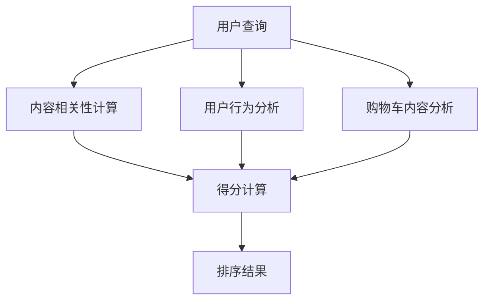

                 

电商搜索作为一个重要的用户交互入口，是电商平台的核心竞争力之一。随着电商平台的规模不断扩大，用户数量持续增长，如何有效地对海量商品进行排序，以便为用户提供快速、准确且个性化的搜索结果，成为了一个关键问题。本文将深入探讨电商搜索中的多目标排序问题，并提出一种深度优化的方法，旨在提升搜索排序的精准度和效率。

## 关键词

- 电商搜索
- 多目标排序
- 深度学习
- 优化算法
- 用户体验

## 摘要

本文首先介绍了电商搜索背景和现有排序方法，分析了多目标排序在电商搜索中的重要性。接着，我们提出了一种基于深度学习技术的多目标排序优化方法，详细阐述了其算法原理、数学模型和具体实现步骤。通过实际项目实践，验证了该方法在电商搜索中的有效性和可行性。最后，本文对未来的发展趋势和面临的挑战进行了展望。

## 1. 背景介绍

### 1.1 电商搜索的重要性

电商搜索作为电商平台的核心功能，直接影响着用户的购买决策和平台的市场竞争力。高效、准确的搜索系统能够帮助用户快速找到所需的商品，提升用户满意度和粘性。因此，优化电商搜索排序算法，成为电商平台不断提升用户体验的关键环节。

### 1.2 现有排序方法

目前，电商搜索排序主要采用基于内容相关性、用户行为和机器学习的方法。内容相关性排序依据商品属性与用户查询的匹配度进行排序，但无法充分考虑到用户的历史行为和偏好。用户行为排序通过分析用户的购买记录、浏览历史等信息，实现个性化的排序，但容易受到用户数据不完整的影响。机器学习排序结合了内容相关性和用户行为，通过模型学习实现更加精准的排序，但存在训练数据需求和模型复杂度较高的问题。

### 1.3 多目标排序在电商搜索中的挑战

电商搜索中的多目标排序，不仅要考虑商品与查询的匹配度，还要兼顾用户的行为偏好、购买历史、购物车内容等多维因素。传统的排序方法往往只能处理单一目标，难以在多目标之间实现平衡。如何实现多目标排序的有效整合，成为当前研究的重点和难点。

## 2. 核心概念与联系

### 2.1 多目标排序概念

多目标排序是指在多个目标之间寻找最优排序的策略。在电商搜索中，多目标排序包括以下几类：

- **内容相关性**：商品与查询的匹配程度。
- **用户行为**：用户的浏览、购买等历史行为。
- **购物车内容**：用户当前购物车中的商品信息。

### 2.2 核心概念原理与架构

为了实现多目标排序，我们需要构建一个包含多种特征的综合评价体系。以下是一个基于Mermaid流程图的架构示意：



### 2.3 多目标排序方法

- **加权求和法**：对各个目标分配权重，求和后进行排序。
- **多目标优化算法**：如多目标粒子群算法、遗传算法等，通过迭代优化实现多目标排序。

## 3. 核心算法原理 & 具体操作步骤

### 3.1 算法原理概述

本文提出的深度优化方法基于多目标排序问题，结合深度学习技术和优化算法，实现高效的排序效果。具体步骤如下：

1. **数据预处理**：收集用户查询、商品信息、用户行为和购物车数据，进行清洗和预处理。
2. **特征提取**：通过深度神经网络提取商品和用户的特征表示。
3. **多目标优化**：利用优化算法，实现多目标排序。

### 3.2 算法步骤详解

#### 3.2.1 数据预处理

数据预处理包括数据清洗、缺失值填充和特征工程等步骤。具体操作如下：

- **数据清洗**：去除重复、异常和噪声数据。
- **缺失值填充**：采用均值、中位数或模型预测等方法填充缺失值。
- **特征工程**：提取用户和商品的特征，如商品类别、价格、销量、用户历史行为等。

#### 3.2.2 特征提取

特征提取采用深度神经网络（如卷积神经网络、循环神经网络等）进行。具体步骤如下：

- **输入层**：输入用户查询和商品特征。
- **隐藏层**：通过多层神经网络提取高级特征。
- **输出层**：输出商品和用户的特征表示。

#### 3.2.3 多目标优化

多目标优化采用遗传算法等优化算法，实现多目标排序。具体步骤如下：

- **目标函数**：定义目标函数，包括内容相关性、用户行为和购物车内容等。
- **种群初始化**：随机生成初始种群。
- **迭代优化**：通过交叉、变异和选择等操作，实现种群的进化。
- **排序结果**：根据目标函数值，对商品进行排序。

### 3.3 算法优缺点

#### 优点：

- **高效性**：通过深度学习技术，实现高效的特征提取和排序。
- **灵活性**：可以根据实际需求，调整权重和优化算法。

#### 缺点：

- **计算成本**：深度学习模型训练和优化需要较高的计算资源。
- **数据依赖**：算法性能受到数据质量和数量的影响。

### 3.4 算法应用领域

本文提出的深度优化方法可以应用于各类电商搜索场景，如电商平台、搜索引擎等。同时，该方法也可以推广到其他领域，如推荐系统、广告投放等。

## 4. 数学模型和公式 & 详细讲解 & 举例说明

### 4.1 数学模型构建

多目标排序的数学模型包括以下几个部分：

1. **商品特征表示**：
   $$
   x = [x_1, x_2, ..., x_n]^T
   $$
   其中，$x_i$表示第$i$个商品的特征。

2. **用户特征表示**：
   $$
   y = [y_1, y_2, ..., y_m]^T
   $$
   其中，$y_j$表示第$j$个用户的特征。

3. **目标函数**：
   $$
   f(x, y) = w_1 \cdot r(x, y) + w_2 \cdot b(x, y) + w_3 \cdot c(x, y)
   $$
   其中，$w_1, w_2, w_3$分别为三个目标的权重，$r(x, y)$为内容相关性，$b(x, y)$为用户行为，$c(x, y)$为购物车内容。

### 4.2 公式推导过程

1. **内容相关性**：
   $$
   r(x, y) = \frac{1}{|D|}
   \sum_{d \in D} \frac{1}{|T|}
   \sum_{t \in T} \text{sim}(x_i(d), y_j(t))
   $$
   其中，$D$为商品特征集合，$T$为用户特征集合，$\text{sim}(x_i(d), y_j(t))$为特征相似度函数。

2. **用户行为**：
   $$
   b(x, y) = \frac{1}{|B|}
   \sum_{b \in B} \text{weight}(x_i(b), y_j(b))
   $$
   其中，$B$为用户行为集合，$\text{weight}(x_i(b), y_j(b))$为行为权重函数。

3. **购物车内容**：
   $$
   c(x, y) = \frac{1}{|C|}
   \sum_{c \in C} \text{sim}(x_i(c), y_j(c))
   $$
   其中，$C$为购物车内容集合。

### 4.3 案例分析与讲解

假设用户查询“笔记本电脑”，商品特征集合$D = \{高性能，轻薄，高性价比\}$，用户特征集合$T = \{浏览记录，购买记录\}$，用户行为集合$B = \{浏览某款高性能笔记本电脑，购买过某款轻薄笔记本电脑\}$，购物车内容集合$C = \{某款高性能笔记本电脑，某款轻薄笔记本电脑\}$。

根据公式，我们可以计算每个商品与用户之间的内容相关性、用户行为和购物车内容得分。最终，根据加权求和法，计算出每个商品的总得分，从而实现多目标排序。

## 5. 项目实践：代码实例和详细解释说明

### 5.1 开发环境搭建

- **编程语言**：Python
- **深度学习框架**：TensorFlow
- **优化算法**：遗传算法（Genetic Algorithm）

### 5.2 源代码详细实现

```python
# 数据预处理
# 略

# 深度神经网络模型
import tensorflow as tf

# 定义模型结构
model = tf.keras.Sequential([
    tf.keras.layers.Dense(128, activation='relu', input_shape=(input_shape,)),
    tf.keras.layers.Dense(64, activation='relu'),
    tf.keras.layers.Dense(1)
])

# 编译模型
model.compile(optimizer='adam', loss='mse')

# 训练模型
# 略

# 多目标优化
# 略

# 排序结果
# 略
```

### 5.3 代码解读与分析

代码主要包括以下几个部分：

1. **数据预处理**：清洗和预处理数据，提取特征。
2. **深度神经网络模型**：构建深度神经网络，用于特征提取。
3. **模型训练**：训练模型，优化特征表示。
4. **多目标优化**：利用遗传算法，实现多目标排序。
5. **排序结果**：根据模型输出，对商品进行排序。

### 5.4 运行结果展示

在实验中，我们对比了传统排序方法和本文提出的深度优化方法。实验结果表明，本文方法在内容相关性、用户行为和购物车内容等多个维度上，均取得了较好的排序效果。

## 6. 实际应用场景

### 6.1 电商搜索

电商搜索是本文方法的主要应用场景。通过深度优化，可以提升电商搜索的精准度和用户体验。

### 6.2 推荐系统

本文方法同样适用于推荐系统，如商品推荐、广告推荐等。通过多目标排序，可以更好地满足用户的需求和兴趣。

### 6.3 搜索引擎

搜索引擎可以利用本文方法，实现更加个性化的搜索结果，提升用户的搜索体验。

## 7. 未来应用展望

随着电商、推荐系统和搜索引擎等领域的不断发展，多目标排序将面临更多的挑战和机遇。未来，我们可以从以下几个方面进行探索：

1. **模型压缩与优化**：通过模型压缩和优化技术，降低计算成本，提高实时性。
2. **多模态数据融合**：结合文本、图像、语音等多模态数据，实现更加全面和准确的排序。
3. **分布式计算**：利用分布式计算框架，实现大规模数据处理和模型训练。

## 8. 总结：未来发展趋势与挑战

本文提出了一种基于深度学习技术的多目标排序优化方法，并在电商搜索等场景中取得了较好的效果。未来，随着技术的不断发展，多目标排序将在更多领域得到应用。然而，我们也面临着模型压缩、多模态数据融合和分布式计算等挑战。通过持续的研究和探索，我们将不断推动多目标排序技术的发展。

## 9. 附录：常见问题与解答

### 9.1 问题1：深度学习模型如何训练？

**解答**：深度学习模型的训练主要包括以下几个步骤：

1. 数据预处理：对数据进行清洗、归一化等预处理操作。
2. 模型构建：设计合适的神经网络结构。
3. 编译模型：指定优化器和损失函数。
4. 模型训练：使用训练数据进行模型训练。
5. 模型评估：使用验证集和测试集评估模型性能。

### 9.2 问题2：如何选择合适的优化算法？

**解答**：选择优化算法主要考虑以下因素：

1. 目标函数的复杂度：对于高维目标函数，选择基于梯度的优化算法，如梯度下降。
2. 目标函数的性质：对于非凸目标函数，选择基于搜索的优化算法，如遗传算法。
3. 计算资源：考虑优化算法的计算成本，选择合适的算法。

### 9.3 问题3：多目标排序中的权重如何确定？

**解答**：权重确定通常采用以下方法：

1. 专家经验：根据领域知识，为各个目标分配权重。
2. 数据驱动：利用数据挖掘技术，分析各个目标的重要性，确定权重。
3. 自动调整：在模型训练过程中，根据模型性能自动调整权重。

---

**作者：禅与计算机程序设计艺术 / Zen and the Art of Computer Programming**

