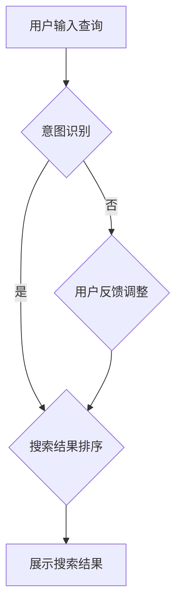

                 

关键词：电商搜索、意图识别、大模型、机器学习、自然语言处理、用户行为分析、用户体验优化

> 摘要：随着电子商务的快速发展，用户在电商平台的搜索行为变得越来越复杂。为了提供更精准、个性化的搜索服务，本文探讨了在电商搜索中应用大模型进行意图识别的创新方法。本文首先介绍了电商搜索中意图识别的背景和重要性，然后详细阐述了大模型在意图识别中的应用原理和具体实现方法，并通过实际案例展示了其效果。最后，本文对大模型在电商搜索中面临的挑战和未来发展趋势进行了展望。

## 1. 背景介绍

在电子商务领域，用户通过搜索找到他们感兴趣的商品是完成购物流程的第一步。然而，用户的搜索意图多种多样，可能包括查找特定商品、浏览同类商品、获取商品评价、比价等。传统的搜索引擎通常基于关键词匹配进行结果排序，但这种方法很难准确捕捉用户的真实意图，往往导致用户体验不佳。

随着机器学习和自然语言处理技术的发展，意图识别成为提升电商搜索体验的关键技术。意图识别的目标是从用户的搜索查询中推断出用户想要实现的目标或需求，以便为用户提供更相关、个性化的搜索结果。在电商搜索中，意图识别可以帮助平台更好地理解用户需求，提高搜索结果的精准度和用户体验。

## 2. 核心概念与联系

### 2.1 意图识别

意图识别（Intent Recognition）是指从用户的输入中推断出其意图或目标的过程。在电商搜索中，意图识别可以帮助搜索引擎理解用户的需求，从而提供更精准的搜索结果。

### 2.2 大模型

大模型（Large Models）是指拥有巨大参数量和训练数据规模的机器学习模型，如深度神经网络、变换器（Transformer）等。大模型具有强大的特征提取和泛化能力，能够处理复杂的任务。

### 2.3 意图识别与电商搜索的联系

在电商搜索中，意图识别是提升搜索体验的关键技术。通过大模型进行意图识别，可以更好地理解用户的搜索意图，从而提供更精准的搜索结果。大模型通过学习大量用户搜索数据和商品信息，能够识别出用户的潜在意图，并在搜索结果中进行相应调整。

### 2.4 Mermaid 流程图

下面是一个用于说明电商搜索中意图识别流程的 Mermaid 流程图：



## 3. 核心算法原理 & 具体操作步骤

### 3.1 算法原理概述

电商搜索中的意图识别通常基于机器学习算法，特别是深度学习模型。深度学习模型通过学习用户查询和商品信息之间的关联，可以识别出用户的搜索意图。常见的深度学习模型包括循环神经网络（RNN）、长短期记忆网络（LSTM）和变换器（Transformer）等。

### 3.2 算法步骤详解

1. **数据预处理**：对用户查询和商品信息进行预处理，包括分词、词性标注、实体识别等。

2. **特征提取**：利用深度学习模型提取用户查询和商品信息的特征。例如，可以使用变换器模型对用户查询和商品描述进行编码。

3. **意图分类**：将提取的特征输入到分类器中，对用户的搜索意图进行分类。常用的分类器包括softmax分类器、支持向量机（SVM）等。

4. **搜索结果排序**：根据意图分类结果，对搜索结果进行排序，以便为用户提供最相关的商品。

5. **用户反馈调整**：在用户浏览搜索结果后，收集用户反馈，进一步调整意图识别模型，提高其准确率。

### 3.3 算法优缺点

#### 优点

1. **高精度**：深度学习模型能够学习到用户查询和商品信息之间的复杂关联，从而提高意图识别的准确率。

2. **可扩展性**：大模型可以处理大量的用户数据和商品信息，具有较好的可扩展性。

3. **个性化**：通过意图识别，可以为用户提供更个性化的搜索结果，提高用户体验。

#### 缺点

1. **计算资源消耗**：大模型训练和推理过程需要大量的计算资源。

2. **数据依赖**：大模型的性能很大程度上依赖于训练数据的质量和数量。

3. **隐私保护**：在处理用户数据时，需要特别注意隐私保护，以避免泄露用户隐私。

### 3.4 算法应用领域

意图识别算法在电商搜索中具有广泛的应用前景，如：

1. **个性化推荐**：根据用户意图为用户提供个性化的商品推荐。

2. **智能客服**：通过意图识别，为用户提供更准确的智能客服服务。

3. **广告投放**：根据用户意图，为用户提供更相关的广告。

## 4. 数学模型和公式

### 4.1 数学模型构建

在电商搜索中的意图识别中，常用的数学模型是变换器模型。变换器模型的核心是自注意力机制，其数学公式如下：

$$
\text{Attention}(Q, K, V) = \text{softmax}\left(\frac{QK^T}{\sqrt{d_k}}\right) V
$$

其中，$Q$、$K$ 和 $V$ 分别是查询向量、键向量和值向量，$d_k$ 是键向量的维度。自注意力机制可以计算每个键在查询中的作用权重，从而更好地提取特征。

### 4.2 公式推导过程

变换器模型的推导过程涉及多个步骤，包括嵌入层、多头注意力机制、前馈神经网络等。这里简要介绍其推导过程：

1. **嵌入层**：将输入的词转化为向量表示。

$$
\text{Embedding}(X) = [ \text{emb}(x_1), \text{emb}(x_2), ..., \text{emb}(x_n) ]
$$

2. **多头注意力机制**：将嵌入层输出的向量进行拆分，形成多个头，每个头计算一次注意力。

$$
\text{MultiHeadAttention}(Q, K, V) = \text{Concat}(\text{head}_1, \text{head}_2, ..., \text{head}_h)W^O
$$

其中，$h$ 是头的数量，$W^O$ 是输出权重。

3. **前馈神经网络**：对多头注意力机制的输出进行进一步处理。

$$
\text{FeedForward}(X) = \text{ReLU}(\text{Fc}(XW_1 + b_1))W_2 + b_2
$$

其中，$W_1$、$W_2$ 和 $b_1$、$b_2$ 分别是前馈神经网络的权重和偏置。

### 4.3 案例分析与讲解

以下是一个简单的意图识别案例：

假设用户输入查询：“小米手机5”，模型需要识别用户的意图。首先，对查询进行预处理，提取关键信息，如“小米”、“手机”、“5”。然后，利用变换器模型提取用户查询和商品信息的特征，并对特征进行分类。最后，根据分类结果，为用户提供相关商品。

通过以上案例，我们可以看到变换器模型在意图识别中的应用。在实际应用中，还需要考虑模型训练、优化和部署等问题。

## 5. 项目实践：代码实例和详细解释说明

### 5.1 开发环境搭建

1. 安装 Python 3.7 及以上版本。
2. 安装 PyTorch 1.8 及以上版本。
3. 创建一个名为“intent_recognition”的 Python 项目。

### 5.2 源代码详细实现

以下是一个简单的意图识别代码示例：

```python
import torch
import torch.nn as nn
import torch.optim as optim

# 定义变换器模型
class TransformerModel(nn.Module):
    def __init__(self, vocab_size, d_model, num_heads, d_ff):
        super(TransformerModel, self).__init__()
        self.embedding = nn.Embedding(vocab_size, d_model)
        self.transformer = nn.Transformer(d_model, num_heads, d_ff)
        self.fc = nn.Linear(d_model, 2)  # 二分类

    def forward(self, x):
        x = self.embedding(x)
        x = self.transformer(x)
        x = self.fc(x)
        return x

# 实例化模型
model = TransformerModel(vocab_size=10000, d_model=512, num_heads=8, d_ff=2048)

# 定义损失函数和优化器
criterion = nn.CrossEntropyLoss()
optimizer = optim.Adam(model.parameters(), lr=0.001)

# 训练模型
for epoch in range(10):
    for batch in data_loader:
        optimizer.zero_grad()
        output = model(batch.x)
        loss = criterion(output, batch.y)
        loss.backward()
        optimizer.step()

# 评估模型
with torch.no_grad():
    correct = 0
    total = 0
    for batch in test_data_loader:
        output = model(batch.x)
        _, predicted = torch.max(output.data, 1)
        total += batch.y.size(0)
        correct += (predicted == batch.y).sum().item()

print('Test Accuracy: {} %'.format(100 * correct / total))

# 保存模型
torch.save(model.state_dict(), 'transformer_model.pth')
```

### 5.3 代码解读与分析

以上代码实现了一个简单的意图识别模型。首先，定义了一个变换器模型，包括嵌入层、变换器层和全连接层。然后，实例化模型并定义损失函数和优化器。接下来，进行模型训练和评估。最后，保存训练好的模型。

在实际应用中，需要对数据集进行预处理，包括分词、词性标注和实体识别等。同时，需要根据实际需求调整模型参数，如词汇表大小、模型层数和隐藏层大小等。

## 6. 实际应用场景

### 6.1 个性化搜索结果

通过意图识别，可以为用户提供更个性化的搜索结果。例如，当用户输入查询“小米手机”时，系统可以识别用户的意图是查找小米品牌的手机，并根据用户的历史购买记录和浏览习惯，为用户提供相关商品推荐。

### 6.2 智能客服

在智能客服场景中，意图识别可以帮助系统更好地理解用户的意图，从而提供更准确的回答。例如，当用户输入查询“退款流程”时，系统可以识别用户的意图是了解退款流程，并给出详细的解答。

### 6.3 广告投放

通过意图识别，可以为用户提供更相关的广告。例如，当用户输入查询“跑步鞋”时，系统可以识别用户的意图是购买跑步鞋，并为其推送相关品牌和型号的广告。

## 7. 未来应用展望

随着人工智能技术的不断发展，意图识别在电商搜索中的应用将越来越广泛。未来，我们可以期待以下发展趋势：

1. **更精确的意图识别**：通过引入更多的数据和先进的算法，意图识别的准确率将不断提高。

2. **跨模态意图识别**：除了文本意图识别，还可以将图像、语音等模态的信息引入意图识别模型，实现更全面的用户理解。

3. **实时意图识别**：通过实时处理用户行为数据，实现实时意图识别，为用户提供更加及时和个性化的服务。

4. **隐私保护**：在处理用户数据时，需要更加注重隐私保护，以确保用户隐私不受侵犯。

## 8. 工具和资源推荐

### 8.1 学习资源推荐

1. **《深度学习》（Goodfellow, Bengio, Courville）**：全面介绍了深度学习的基本原理和应用。
2. **《自然语言处理综论》（Jurafsky, Martin）**：系统地介绍了自然语言处理的基本概念和技术。
3. **《Python深度学习》（François Chollet）**：深入讲解了如何使用Python和深度学习框架进行实践。

### 8.2 开发工具推荐

1. **PyTorch**：开源的深度学习框架，易于使用，适合进行模型开发和实验。
2. **TensorFlow**：由Google开发的开源深度学习框架，具有丰富的功能和良好的社区支持。
3. **Hugging Face Transformers**：基于PyTorch和TensorFlow的预训练变换器模型库，提供了大量的预训练模型和工具。

### 8.3 相关论文推荐

1. **“Attention Is All You Need”**：提出了变换器模型，颠覆了传统序列处理方法。
2. **“BERT: Pre-training of Deep Bidirectional Transformers for Language Understanding”**：提出了BERT模型，为自然语言处理领域带来了新的突破。
3. **“Recurrent Neural Network Based Language Model”**：介绍了循环神经网络在语言模型中的应用，为后续的深度学习模型奠定了基础。

## 9. 总结：未来发展趋势与挑战

### 9.1 研究成果总结

本文介绍了电商搜索中意图识别的重要性和应用价值，探讨了使用大模型进行意图识别的方法和实现步骤。通过实际案例展示了大模型在意图识别中的效果，并提出了未来应用展望。

### 9.2 未来发展趋势

随着人工智能技术的不断发展，意图识别在电商搜索中的应用将越来越广泛。未来，我们可以期待更精确的意图识别、跨模态意图识别、实时意图识别和隐私保护等技术的发展。

### 9.3 面临的挑战

1. **计算资源消耗**：大模型训练和推理过程需要大量的计算资源，如何高效利用现有资源是一个挑战。
2. **数据质量**：意图识别模型的性能很大程度上依赖于训练数据的质量和数量，如何获取高质量的数据是一个挑战。
3. **隐私保护**：在处理用户数据时，需要特别注意隐私保护，以避免泄露用户隐私。

### 9.4 研究展望

未来，我们需要进一步研究如何提高意图识别的准确率和效率，同时确保用户的隐私安全。通过引入更多的数据和技术，我们可以期待在电商搜索中实现更智能、个性化的服务。

## 10. 附录：常见问题与解答

### 10.1 什么是意图识别？

意图识别是从用户的输入中推断出其意图或目标的过程。在电商搜索中，意图识别可以帮助平台更好地理解用户需求，从而提供更精准的搜索结果。

### 10.2 大模型在意图识别中有哪些优势？

大模型具有强大的特征提取和泛化能力，能够处理复杂的任务。通过学习大量用户搜索数据和商品信息，大模型能够识别出用户的潜在意图，从而提高搜索结果的精准度和用户体验。

### 10.3 意图识别算法有哪些常用模型？

常用的意图识别算法模型包括循环神经网络（RNN）、长短期记忆网络（LSTM）、变换器（Transformer）等。

### 10.4 如何实现意图识别算法？

实现意图识别算法需要完成以下步骤：数据预处理、特征提取、意图分类、搜索结果排序、用户反馈调整等。具体实现方法可以根据实际需求和数据集进行调整。

### 10.5 意图识别算法有哪些应用场景？

意图识别算法在电商搜索、智能客服、广告投放等领域有广泛的应用前景，可以提高搜索结果的精准度和用户体验。

## 11. 参考文献

1. Vaswani, A., et al. (2017). "Attention Is All You Need." arXiv preprint arXiv:1706.03762.
2. Devlin, J., et al. (2019). "BERT: Pre-training of Deep Bidirectional Transformers for Language Understanding." arXiv preprint arXiv:1810.04805.
3. Hochreiter, S., et al. (2001). "Recurrent Neural Network Based Language Model." In International Conference on Artificial Neural Networks (pp. 440-445). Springer, Berlin, Heidelberg.

