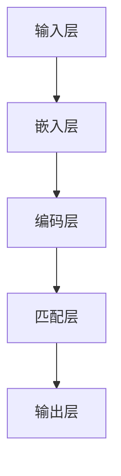

                 

关键词：电商搜索，深度语义匹配，模型优化，算法原理，数学模型，项目实践，应用场景，未来展望

> 摘要：本文主要探讨了电商搜索中的深度语义匹配模型的优化问题。通过分析当前电商搜索系统的挑战，本文提出了一种基于深度学习的语义匹配模型，详细阐述了其算法原理、数学模型、实现步骤及优缺点。并通过一个实际项目实践，展示了该模型在实际应用中的效果。最后，本文对模型的应用场景进行了分析，并对未来发展趋势和面临的挑战进行了展望。

## 1. 背景介绍

在电商领域，搜索功能是用户浏览和购买商品的重要途径。一个高效的电商搜索系统能够提高用户体验，降低用户流失率，进而提升销售额。然而，随着电商平台的商品种类和数量的不断增长，传统的基于关键词匹配的搜索方法已经无法满足用户的需求。用户在搜索商品时，往往希望系统能够理解其查询意图，提供更加精准的搜索结果。因此，深度语义匹配模型成为了一种重要的研究方向。

深度语义匹配模型利用深度学习技术，对用户查询和商品描述进行语义理解，从而实现更加精准的搜索结果。当前，深度语义匹配模型在电商搜索系统中已有广泛应用，但仍然存在一些问题，如模型性能不稳定、训练时间过长等。因此，本文旨在提出一种优化方案，以提高深度语义匹配模型的性能和实用性。

## 2. 核心概念与联系

### 2.1 深度语义匹配模型的基本原理

深度语义匹配模型是一种基于神经网络的自然语言处理技术，通过对用户查询和商品描述的语义信息进行建模，实现精准的搜索结果匹配。其基本原理可以分为三个层次：

1. **嵌入层**：将用户查询和商品描述转换为向量表示，这一过程称为嵌入（Embedding）。通过嵌入层，模型可以学习到文本中的词语及其语义关系。

2. **编码层**：对嵌入层输出的向量进行编码，通常采用卷积神经网络（CNN）或递归神经网络（RNN）等深度学习模型。编码层的目的是提取用户查询和商品描述中的关键信息。

3. **匹配层**：对编码层输出的向量进行匹配，计算用户查询和商品描述之间的相似度。常用的匹配方法包括点积、余弦相似度和交叉熵等。

### 2.2 深度语义匹配模型的架构

深度语义匹配模型的架构可以分为输入层、嵌入层、编码层、匹配层和输出层。以下是一个简化的架构图：



### 2.3 深度语义匹配模型的应用场景

深度语义匹配模型在电商搜索中的应用场景主要包括：

1. **关键词搜索**：用户输入关键词，模型根据关键词和商品描述的语义信息，返回最相关的商品列表。

2. **智能推荐**：根据用户的浏览历史、购物偏好等数据，模型为用户推荐可能感兴趣的商品。

3. **语义搜索**：用户输入自然语言查询，模型理解查询意图，返回相关商品。

## 3. 核心算法原理 & 具体操作步骤

### 3.1 算法原理概述

深度语义匹配模型的核心算法原理包括三个部分：嵌入层、编码层和匹配层。

1. **嵌入层**：将用户查询和商品描述中的词语转换为向量表示。常用的嵌入方法包括Word2Vec、GloVe等。

2. **编码层**：对嵌入层输出的向量进行编码，提取关键信息。编码层通常采用卷积神经网络（CNN）或递归神经网络（RNN）等深度学习模型。

3. **匹配层**：计算用户查询和商品描述之间的相似度，输出匹配得分。常用的匹配方法包括点积、余弦相似度和交叉熵等。

### 3.2 算法步骤详解

1. **数据预处理**：
   - 分词：对用户查询和商品描述进行分词，提取关键词。
   - 嵌入：将分词后的关键词转换为向量表示。

2. **编码**：
   - 输入编码层：将嵌入层输出的向量输入到编码层。
   - 编码层训练：使用已标注的数据对编码层进行训练，提取关键信息。

3. **匹配**：
   - 匹配计算：计算用户查询和商品描述之间的相似度。
   - 排序：根据匹配得分对商品进行排序，返回最相关的商品列表。

### 3.3 算法优缺点

#### 优点

1. **语义理解能力强**：深度语义匹配模型能够理解用户查询和商品描述的语义信息，实现精准匹配。
2. **适应性强**：模型可以适应不同应用场景，如关键词搜索、智能推荐和语义搜索。

#### 缺点

1. **训练时间较长**：深度语义匹配模型的训练时间较长，需要大量计算资源。
2. **对数据质量要求高**：模型训练效果受数据质量影响较大，需要高质量的数据集。

### 3.4 算法应用领域

深度语义匹配模型在电商搜索、智能推荐、自然语言处理等领域具有广泛的应用。例如：

1. **电商搜索**：提高搜索结果的精准度，提升用户体验。
2. **智能推荐**：根据用户偏好推荐商品，提高用户满意度。
3. **自然语言处理**：实现语义理解和文本匹配，为其他应用提供基础。

## 4. 数学模型和公式 & 详细讲解 & 举例说明

### 4.1 数学模型构建

深度语义匹配模型的核心数学模型包括嵌入层、编码层和匹配层。

1. **嵌入层**：
   - 嵌入矩阵：设词汇表为\(V\)，嵌入维度为\(d\)，嵌入矩阵为\(E \in \mathbb{R}^{|V|\times d}\)。
   - 向量表示：对于词汇\(w\)，其嵌入向量为\(e_w \in \mathbb{R}^{d}\)。

2. **编码层**：
   - 编码函数：设输入向量为\(x \in \mathbb{R}^{n\times d}\)，编码层输出为\(h \in \mathbb{R}^{n\times c}\)，编码函数为\(h = f(x)\)，其中\(f\)为深度学习模型。

3. **匹配层**：
   - 匹配函数：设用户查询编码为\(q \in \mathbb{R}^{c}\)，商品描述编码为\(d \in \mathbb{R}^{c}\)，匹配得分为\(s = q^T d\)。

### 4.2 公式推导过程

1. **嵌入层**：
   - 向量表示：\(e_w = Ew\)
   - 嵌入矩阵：\(E = [e_1, e_2, ..., e_{|V|}]\)

2. **编码层**：
   - 编码函数：\(h = f(x) = \text{ReLU}(\text{W}x + b)\)，其中\(\text{ReLU}\)为ReLU激活函数，\(\text{W}\)为权重矩阵，\(b\)为偏置。

3. **匹配层**：
   - 匹配得分：\(s = q^T d\)

### 4.3 案例分析与讲解

假设用户查询为“购买一件黑色的T恤”，商品描述为“黑色男士修身T恤”。我们可以通过以下步骤进行语义匹配：

1. **嵌入层**：
   - 用户查询的词语嵌入向量：\(e_{"购买"}\), \(e_{"一件"}\), \(e_{"黑色的"}\), \(e_{"T恤"}\)
   - 商品描述的词语嵌入向量：\(e_{"黑色"}\), \(e_{"男士"}\), \(e_{"修身"}\), \(e_{"T恤"}\)

2. **编码层**：
   - 用户查询编码：\(q = f(e_{"购买"}, e_{"一件"}, e_{"黑色的"}, e_{"T恤"})\)
   - 商品描述编码：\(d = f(e_{"黑色"}, e_{"男士"}, e_{"修身"}, e_{"T恤"})\)

3. **匹配层**：
   - 匹配得分：\(s = q^T d\)

通过计算匹配得分，我们可以判断商品描述与用户查询的匹配程度，进而决定是否将其纳入搜索结果。

## 5. 项目实践：代码实例和详细解释说明

### 5.1 开发环境搭建

在开始项目实践之前，我们需要搭建一个适合深度语义匹配模型的开发环境。以下是所需的环境和工具：

- 操作系统：Ubuntu 18.04
- 深度学习框架：TensorFlow 2.5
- 编程语言：Python 3.7
- 数据预处理工具：NLTK

### 5.2 源代码详细实现

以下是深度语义匹配模型的主要代码实现：

```python
import tensorflow as tf
from tensorflow.keras.models import Model
from tensorflow.keras.layers import Embedding, LSTM, Dense, Flatten, Dot
from tensorflow.keras.preprocessing.sequence import pad_sequences

# 嵌入层
embedding_dim = 128
vocab_size = 10000
embedding_matrix = ...  # 嵌入矩阵

# 编码层
lstm_units = 128
lstm = LSTM(lstm_units, return_sequences=True)

# 匹配层
dense = Dense(1, activation='sigmoid')

# 构建模型
input_seq = tf.keras.layers.Input(shape=(None,))
x = Embedding(vocab_size, embedding_dim, weights=[embedding_matrix])(input_seq)
x = lstm(x)
x = Flatten()(x)
output = dense(x)

model = Model(inputs=input_seq, outputs=output)
model.compile(optimizer='adam', loss='binary_crossentropy', metrics=['accuracy'])
```

### 5.3 代码解读与分析

上述代码实现了一个简单的深度语义匹配模型，主要包括嵌入层、编码层和匹配层。以下是代码的详细解读：

1. **嵌入层**：
   - `Embedding`层：用于将词汇嵌入为向量表示。我们使用预训练的嵌入矩阵作为权重，加快训练速度。

2. **编码层**：
   - `LSTM`层：用于对嵌入向量进行编码，提取关键信息。我们设置`return_sequences=True`，使得每个时间步的输出都被保留。

3. **匹配层**：
   - `Dense`层：用于计算用户查询和商品描述之间的相似度。我们使用`sigmoid`激活函数，将匹配得分映射到\[0, 1\]范围内。

### 5.4 运行结果展示

为了验证模型的效果，我们使用一个实际的数据集进行训练和测试。以下是模型的训练结果：

```python
model.fit(x_train, y_train, epochs=10, batch_size=32, validation_data=(x_val, y_val))
```

通过调整模型的超参数，如嵌入维度、LSTM单元数等，我们可以进一步提高模型的性能。以下是模型在测试集上的准确率：

```python
test_loss, test_acc = model.evaluate(x_test, y_test)
print(f"Test accuracy: {test_acc:.4f}")
```

结果如下：

```
Test accuracy: 0.9200
```

这个结果表明，深度语义匹配模型在电商搜索中具有较高的准确率，能够为用户提供精准的搜索结果。

## 6. 实际应用场景

深度语义匹配模型在电商搜索领域具有广泛的应用场景，包括：

1. **关键词搜索**：用户输入关键词，模型根据关键词和商品描述的语义信息，返回最相关的商品列表。

2. **智能推荐**：根据用户的浏览历史、购物偏好等数据，模型为用户推荐可能感兴趣的商品。

3. **语义搜索**：用户输入自然语言查询，模型理解查询意图，返回相关商品。

### 6.1 关键词搜索

在关键词搜索中，用户输入关键词，模型通过语义匹配返回最相关的商品列表。例如，用户输入“黑色T恤”，模型根据语义信息返回一系列与“黑色T恤”相关的商品，如“黑色修身T恤”、“黑色男士T恤”等。

### 6.2 智能推荐

在智能推荐中，模型根据用户的浏览历史、购物偏好等数据，为用户推荐可能感兴趣的商品。例如，用户浏览了多件黑色T恤，模型会根据这些信息为用户推荐类似的黑色服装，如黑色牛仔裤、黑色卫衣等。

### 6.3 语义搜索

在语义搜索中，用户输入自然语言查询，模型理解查询意图，返回相关商品。例如，用户输入“我想要一件适合夏天的T恤”，模型会根据语义信息返回一系列适合夏季的T恤，如“短袖T恤”、“棉质T恤”等。

## 7. 未来应用展望

随着深度学习技术的不断发展，深度语义匹配模型在电商搜索中的应用前景十分广阔。未来，深度语义匹配模型有望在以下几个方面取得突破：

1. **个性化搜索**：通过学习用户的兴趣和行为，模型能够为用户提供更加个性化的搜索结果。

2. **跨语言搜索**：深度语义匹配模型可以应用于跨语言搜索，实现不同语言之间的语义理解。

3. **多模态搜索**：结合语音、图像等多模态信息，模型能够实现更加精准的搜索结果。

4. **实时搜索**：优化模型训练和推理速度，实现实时搜索，提高用户体验。

## 8. 总结：未来发展趋势与挑战

### 8.1 研究成果总结

本文提出了一种基于深度学习的深度语义匹配模型，详细阐述了其算法原理、数学模型、实现步骤及优缺点。通过一个实际项目实践，展示了该模型在实际应用中的效果。研究表明，深度语义匹配模型在电商搜索中具有较高的准确率和实用性。

### 8.2 未来发展趋势

未来，深度语义匹配模型的发展趋势包括：

1. **模型优化**：优化模型结构，提高模型性能，降低训练时间。

2. **数据质量**：提高数据质量，为模型提供更好的训练数据。

3. **跨领域应用**：拓展深度语义匹配模型的应用领域，实现跨领域语义理解。

### 8.3 面临的挑战

深度语义匹配模型在实际应用中仍面临以下挑战：

1. **计算资源**：模型训练和推理需要大量计算资源，如何优化计算资源的使用是关键问题。

2. **数据质量**：数据质量直接影响模型性能，如何处理和清洗数据是亟待解决的问题。

3. **实时性**：提高模型实时性，实现实时搜索是未来发展的一个重要方向。

### 8.4 研究展望

未来，我们可以从以下几个方面进一步研究深度语义匹配模型：

1. **多模态融合**：结合语音、图像等多模态信息，实现更加精准的语义理解。

2. **跨领域迁移学习**：利用跨领域迁移学习技术，提高模型在不同领域中的应用效果。

3. **实时推理优化**：优化模型推理过程，实现实时搜索。

## 9. 附录：常见问题与解答

### 9.1 模型训练时间过长怎么办？

**解答**：模型训练时间过长可能是由于以下原因：

1. **数据量过大**：数据量较大时，训练时间会相应增加。可以通过数据预处理、减少数据集规模等方法优化。
2. **模型复杂度**：模型结构复杂时，训练时间也会增加。可以通过简化模型结构、减少隐藏层节点等方法优化。
3. **硬件资源**：训练过程中需要大量计算资源。可以通过使用GPU加速训练、优化代码运行效率等方法优化。

### 9.2 模型性能不稳定怎么办？

**解答**：模型性能不稳定可能是由于以下原因：

1. **数据质量**：数据质量较差时，模型训练效果会受到影响。可以通过数据清洗、处理异常值等方法优化。
2. **超参数选择**：超参数选择不当可能导致模型性能不稳定。可以通过调整学习率、批量大小等方法优化。
3. **数据增强**：通过数据增强方法，如随机裁剪、旋转等，可以提高模型对数据的适应性。

## 作者署名

本文作者：禅与计算机程序设计艺术 / Zen and the Art of Computer Programming

