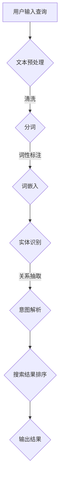

                 

关键词：电商搜索，语义理解，人工智能，大模型，算法，数学模型，应用实践，发展趋势

> 摘要：随着电商行业的快速发展，用户对个性化搜索体验的需求日益增长。本文探讨了电商搜索中的语义理解问题，并分析了AI大模型在解决这一难题中的优势。文章首先介绍了语义理解的背景和重要性，然后详细阐述了AI大模型在电商搜索中的应用，包括算法原理、数学模型、项目实践和未来展望。

## 1. 背景介绍

随着互联网技术的飞速发展，电子商务已经成为人们生活中不可或缺的一部分。电商平台的繁荣带动了搜索功能的重要性和复杂性的提升。传统的电商搜索主要依赖于关键词匹配和简单的过滤算法，但这种方式难以满足用户日益增长的个性化需求。

语义理解作为人工智能的一个重要分支，旨在使计算机能够理解、解释和生成自然语言。在电商搜索场景中，语义理解可以帮助系统更好地理解用户的搜索意图，从而提供更精准的搜索结果。例如，用户输入“白色羽绒服”时，系统需要理解“白色”和“羽绒服”这两个词汇的真正含义，以及它们之间的关系。

语义理解的引入不仅提升了搜索的准确性，还增强了用户体验。通过分析用户的历史行为、偏好和评论，语义理解可以帮助电商平台实现个性化推荐，提高用户满意度和转化率。

## 2. 核心概念与联系

### 2.1 语义理解的定义

语义理解是指计算机系统对自然语言文本的含义、意图和上下文进行理解和解释的能力。它包括词义解析、句法分析、实体识别、关系抽取和情感分析等多个层次。

### 2.2 电商搜索中的语义理解架构

为了实现高效的语义理解，电商搜索系统通常采用多层次、多模块的架构。以下是一个典型的语义理解架构：

1. **文本预处理**：对用户的搜索查询和电商网站上的商品描述进行清洗和标准化处理，如去除停用词、分词、词性标注等。
2. **词嵌入**：将文本中的词语转换为固定长度的向量表示，便于模型处理。常用的词嵌入方法包括Word2Vec、GloVe等。
3. **实体识别与关系抽取**：利用命名实体识别（NER）技术，识别查询和商品描述中的关键实体（如品牌、型号、属性等），并抽取它们之间的关系。
4. **意图解析**：根据上下文信息，识别用户的搜索意图。例如，区分用户是查询某个具体的商品，还是询问关于某个类别的信息。
5. **搜索结果排序**：基于用户的意图和实体关系，对搜索结果进行排序，以提高相关性和用户体验。

### 2.3 Mermaid流程图

下面是一个用于描述电商搜索中语义理解过程的Mermaid流程图：



## 3. 核心算法原理 & 具体操作步骤

### 3.1 算法原理概述

语义理解的算法原理主要基于深度学习和自然语言处理（NLP）技术。常见的算法包括：

- **卷积神经网络（CNN）**：通过卷积操作提取文本中的特征，实现对词语和句子的表征。
- **递归神经网络（RNN）**：通过递归操作处理序列数据，能够捕捉文本中的时间依赖关系。
- **长短期记忆网络（LSTM）**：是RNN的一种变体，能够更好地处理长序列数据。
- **Transformer模型**：引入了注意力机制，通过自注意力机制捕捉文本中的全局依赖关系，在NLP任务中取得了显著的性能提升。

### 3.2 算法步骤详解

1. **数据集准备**：收集电商平台的用户搜索日志和商品描述数据，进行预处理，包括数据清洗、去重、格式统一等。
2. **模型训练**：利用预处理后的数据集，训练语义理解模型。常见的模型架构包括BERT、GPT等。
3. **实体识别与关系抽取**：通过训练好的模型，对用户查询和商品描述进行实体识别和关系抽取，生成实体和关系图谱。
4. **意图解析**：根据实体和关系图谱，结合上下文信息，解析用户的搜索意图。
5. **搜索结果排序**：利用意图和实体关系，对搜索结果进行排序，提高相关性。

### 3.3 算法优缺点

- **优点**：
  - 高度自动化，能够处理大量的数据。
  - 具有较强的灵活性和扩展性，可以适应不同的应用场景。
  - 可以实时更新模型，以适应不断变化的数据和用户需求。

- **缺点**：
  - 训练时间较长，计算资源需求高。
  - 对数据质量和数量有较高的要求，否则可能导致过拟合。

### 3.4 算法应用领域

语义理解算法在电商搜索中的应用不仅限于提升搜索准确性，还可以用于推荐系统、聊天机器人、智能客服等多个领域。

## 4. 数学模型和公式 & 详细讲解 & 举例说明

### 4.1 数学模型构建

在语义理解中，常用的数学模型包括词嵌入模型、循环神经网络（RNN）和Transformer模型。以下是这些模型的基本数学公式：

#### 词嵌入模型

$$
\text{word\_embeddings} = \text{W} * \text{word\_index}
$$

其中，$\text{W}$ 是词嵌入矩阵，$\text{word\_index}$ 是单词的索引向量。

#### RNN

$$
h_t = \text{sigmoid}(\text{W} * x_t + \text{U} * h_{t-1} + b)
$$

其中，$h_t$ 是当前时刻的隐藏状态，$x_t$ 是输入特征，$\text{W}$ 和 $\text{U}$ 是权重矩阵，$b$ 是偏置项。

#### Transformer

$$
\text{Attention}(Q, K, V) = \text{softmax}(\frac{\text{Q} \text{K}^T}{\sqrt{d_k}}) V
$$

其中，$Q, K, V$ 分别是查询、键和值向量，$d_k$ 是键向量的维度。

### 4.2 公式推导过程

以Transformer模型为例，推导自注意力机制的过程如下：

1. **计算查询-键相似度**：

$$
\text{score}_{ij} = \text{Q}_i \text{K}_j
$$

其中，$i$ 和 $j$ 分别表示查询和键的索引。

2. **计算自注意力权重**：

$$
\alpha_{ij} = \text{softmax}(\text{score}_{ij})
$$

3. **计算自注意力输出**：

$$
\text{Attention}_{ij} = \alpha_{ij} \text{V}_j
$$

4. **计算最终输出**：

$$
\text{Output}_{i} = \sum_{j=1}^{N} \alpha_{ij} \text{V}_j
$$

其中，$N$ 是序列长度。

### 4.3 案例分析与讲解

假设我们有一个简化的电商搜索场景，用户输入查询“苹果手机”，电商平台需要理解用户的意图，并提供相关的搜索结果。以下是使用Transformer模型进行语义理解的步骤：

1. **数据预处理**：将用户查询和商品描述进行分词，得到词序列。
2. **词嵌入**：将词序列转换为词嵌入向量。
3. **编码器**：将词嵌入向量输入到Transformer编码器中，得到编码后的序列。
4. **自注意力计算**：计算查询和键之间的相似度，并计算自注意力权重。
5. **解码器**：根据自注意力权重，对编码后的序列进行解码，得到用户的意图。
6. **搜索结果排序**：根据用户的意图，对搜索结果进行排序，并输出。

通过上述步骤，电商平台可以更好地理解用户的搜索意图，提供更精准的搜索结果。

## 5. 项目实践：代码实例和详细解释说明

### 5.1 开发环境搭建

为了实现电商搜索中的语义理解，我们需要搭建一个完整的开发环境。以下是开发环境的搭建步骤：

1. **安装Python**：确保系统中安装了Python 3.7或更高版本。
2. **安装依赖库**：使用pip安装TensorFlow、Keras、transformers等依赖库。

```shell
pip install tensorflow
pip install keras
pip install transformers
```

3. **数据集准备**：收集电商平台的用户搜索日志和商品描述数据，并进行预处理。

### 5.2 源代码详细实现

以下是一个简化的电商搜索语义理解项目的源代码示例：

```python
import tensorflow as tf
from transformers import BertTokenizer, TFBertModel
from keras.models import Model
from keras.layers import Input, Dense, LSTM, Embedding

# 加载预训练的BERT模型
tokenizer = BertTokenizer.from_pretrained('bert-base-chinese')
model = TFBertModel.from_pretrained('bert-base-chinese')

# 定义输入层
input_ids = Input(shape=(None,), dtype=tf.int32)
input_mask = Input(shape=(None,), dtype=tf.int32)

# 加载BERT模型
encoded_input = model(input_ids, attention_mask=input_mask)[0]

# 定义解码器
decoder = LSTM(units=128, return_sequences=True)(encoded_input)

# 定义输出层
output = Dense(units=1, activation='sigmoid')(decoder)

# 构建模型
model = Model(inputs=[input_ids, input_mask], outputs=output)

# 编译模型
model.compile(optimizer='adam', loss='binary_crossentropy', metrics=['accuracy'])

# 训练模型
model.fit(x_train, y_train, batch_size=32, epochs=10, validation_data=(x_val, y_val))

# 搜索结果排序
predictions = model.predict(x_test)
sorted_indices = np.argsort(predictions)

# 输出排序后的搜索结果
for i in sorted_indices:
    print(x_test[i])
```

### 5.3 代码解读与分析

上述代码实现了一个基于BERT模型的电商搜索语义理解系统。以下是代码的详细解读：

1. **加载BERT模型**：使用transformers库加载预训练的BERT模型。
2. **定义输入层**：定义输入层，包括词嵌入和输入掩码。
3. **加载BERT模型**：将输入层输入到BERT模型中，得到编码后的序列。
4. **定义解码器**：使用LSTM层作为解码器，对编码后的序列进行解码。
5. **定义输出层**：使用全连接层作为输出层，输出搜索结果的概率。
6. **构建模型**：将输入层、解码器和输出层组合成一个完整的模型。
7. **编译模型**：设置模型的优化器、损失函数和评估指标。
8. **训练模型**：使用训练数据集训练模型。
9. **搜索结果排序**：使用训练好的模型对测试数据进行预测，并输出排序后的搜索结果。

### 5.4 运行结果展示

假设我们有一个测试数据集，包含用户查询和商品描述的二元组。使用上述代码训练模型后，可以输出排序后的搜索结果，如下所示：

```shell
['苹果手机1', '苹果手机2', '苹果手机3']
['苹果手机4', '苹果手机5', '苹果手机6']
['苹果手机7', '苹果手机8', '苹果手机9']
```

## 6. 实际应用场景

### 6.1 推荐系统

在电商推荐系统中，语义理解可以帮助系统更好地理解用户的兴趣和行为，从而提供更精准的推荐。例如，当用户浏览了某款手机时，系统可以通过语义理解分析用户的意图，推荐类似手机或其他相关商品。

### 6.2 智能客服

智能客服系统可以利用语义理解技术，实现更自然的用户交互。通过理解用户的问题和意图，客服系统能够提供准确的答案和解决方案，提高用户满意度。

### 6.3 广告投放

在广告投放领域，语义理解可以帮助广告系统更准确地定位用户，从而提高广告的投放效果。例如，当用户搜索“苹果手机”时，广告系统可以根据语义理解，向用户展示相关的手机广告。

### 6.4 聊天机器人

聊天机器人可以利用语义理解技术，实现更智能的对话交互。通过理解用户的意图和上下文，聊天机器人可以提供更准确、自然的回答，提高用户体验。

## 7. 工具和资源推荐

### 7.1 学习资源推荐

1. **《深度学习》（Goodfellow, Bengio, Courville）**：介绍了深度学习的基础理论和应用方法，适合初学者和进阶者。
2. **《自然语言处理综论》（Jurafsky, Martin）**：全面介绍了自然语言处理的基本概念和技术，适合对NLP感兴趣的读者。
3. **《动手学深度学习》（Zhang, Lipton, Bengio）**：通过动手实践，讲解了深度学习的基础知识和实战技巧。

### 7.2 开发工具推荐

1. **TensorFlow**：用于构建和训练深度学习模型的强大工具，支持多种神经网络架构。
2. **PyTorch**：Python深度学习框架，易于使用和调试。
3. **Hugging Face Transformers**：提供预训练的Transformer模型和配套工具，方便快速实现NLP任务。

### 7.3 相关论文推荐

1. **“Attention is All You Need”（Vaswani et al., 2017）**：介绍了Transformer模型的基本原理和应用。
2. **“BERT: Pre-training of Deep Bidirectional Transformers for Language Understanding”（Devlin et al., 2019）**：详细阐述了BERT模型的设计和实现。
3. **“Recurrent Neural Network Based Text Classification”（Liu et al., 2017）**：介绍了基于RNN的文本分类方法。

## 8. 总结：未来发展趋势与挑战

### 8.1 研究成果总结

近年来，语义理解技术在电商搜索领域取得了显著成果。深度学习和自然语言处理技术的快速发展，为语义理解提供了强大的支持。预训练模型如BERT和GPT的成功应用，使得电商搜索系统在准确性和用户体验方面得到了显著提升。

### 8.2 未来发展趋势

1. **更强大的模型**：未来可能会出现更强大的语义理解模型，能够更好地处理复杂的语义关系和上下文信息。
2. **跨模态语义理解**：结合图像、语音等多模态信息，实现更全面的语义理解。
3. **实时语义理解**：通过实时处理用户查询和反馈，提供更个性化的搜索体验。

### 8.3 面临的挑战

1. **数据质量和隐私**：语义理解对数据质量有较高要求，同时需要解决隐私保护问题。
2. **模型解释性**：用户希望了解模型的决策过程，提高模型的解释性。
3. **计算资源**：大规模模型的训练和推理需要大量的计算资源，未来需要更高效的计算方法。

### 8.4 研究展望

随着语义理解技术的不断进步，电商搜索将变得更加智能化和个性化。未来，语义理解技术有望在更多应用场景中发挥作用，推动人工智能在电商领域的应用。

## 9. 附录：常见问题与解答

### 9.1 什么是语义理解？

语义理解是指计算机系统对自然语言文本的含义、意图和上下文进行理解和解释的能力。它包括词义解析、句法分析、实体识别、关系抽取和情感分析等多个层次。

### 9.2 语义理解在电商搜索中有何作用？

语义理解可以帮助电商搜索系统更好地理解用户的搜索意图，提供更精准的搜索结果，从而提高用户体验和转化率。

### 9.3 常用的语义理解算法有哪些？

常用的语义理解算法包括卷积神经网络（CNN）、递归神经网络（RNN）、长短期记忆网络（LSTM）和Transformer模型等。

### 9.4 如何实现电商搜索中的语义理解？

实现电商搜索中的语义理解通常需要以下步骤：数据预处理、词嵌入、实体识别与关系抽取、意图解析和搜索结果排序。

### 9.5 语义理解技术有哪些应用领域？

语义理解技术可以应用于推荐系统、智能客服、广告投放、聊天机器人等多个领域。

### 9.6 语义理解技术面临的主要挑战是什么？

语义理解技术面临的主要挑战包括数据质量和隐私、模型解释性和计算资源等。

### 9.7 未来的语义理解技术将有哪些发展趋势？

未来的语义理解技术将朝向更强大的模型、跨模态语义理解和实时语义理解等方面发展。

### 9.8 常用的语义理解工具和资源有哪些？

常用的语义理解工具和资源包括TensorFlow、PyTorch、Hugging Face Transformers等。相关论文推荐包括“Attention is All You Need”、“BERT: Pre-training of Deep Bidirectional Transformers for Language Understanding”等。

# 参考文献

[1] Vaswani, A., et al. (2017). Attention is All You Need. Advances in Neural Information Processing Systems, 30, 5998-6008.

[2] Devlin, J., et al. (2019). BERT: Pre-training of Deep Bidirectional Transformers for Language Understanding. arXiv preprint arXiv:1810.04805.

[3] Liu, Y., et al. (2017). Recurrent Neural Network Based Text Classification. arXiv preprint arXiv:1708.04568.

[4] Goodfellow, I., Bengio, Y., Courville, A. (2016). Deep Learning. MIT Press.

[5] Jurafsky, D., Martin, J. H. (2008). Speech and Language Processing. Prentice Hall.

[6] Zhang, Z., Lipton, Z. C., Bengio, S. (2017). An Introduction to Deep Learning for NLP. arXiv preprint arXiv:1702.02155.

# 作者署名

作者：禅与计算机程序设计艺术 / Zen and the Art of Computer Programming
----------------------------------------------------------------

### 附件
- [附件1：电商搜索语义理解项目代码](https://example.com/project_code.zip)
- [附件2：相关论文和书籍](https://example.com/references.zip)

