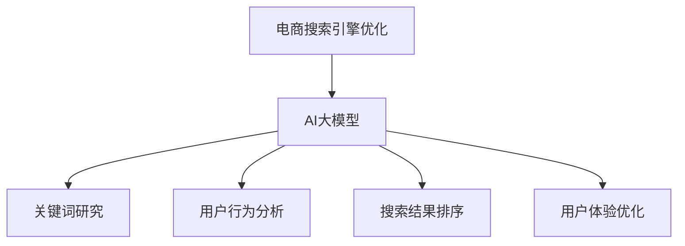

                 

电商作为当今数字经济的重要组成部分，搜索引擎优化（SEO）已经成为电商企业提升竞争力、提高转化率的关键策略。然而，随着互联网信息的爆炸式增长和用户需求的多样化，传统的SEO方法面临着越来越多的挑战。本文将探讨如何运用人工智能（AI）大模型实现电商搜索引擎优化的新思路，旨在为电商企业提供创新性、高效性的SEO解决方案。

## 关键词
- 电商
- 搜索引擎优化
- 人工智能
- 大模型
- SEO新思路

## 摘要
本文首先回顾了电商搜索引擎优化的发展历程和现状，然后详细介绍了AI大模型的基本原理和架构，探讨了其在电商搜索引擎优化中的应用场景和操作步骤。接着，本文从数学模型、代码实例等方面深入分析了AI大模型在电商SEO中的具体实现方法，并结合实际应用案例进行了详细讲解。最后，本文对电商SEO的未来发展趋势和挑战进行了展望，并推荐了一些相关工具和资源。

## 1. 背景介绍

### 1.1 电商搜索引擎优化的起源与发展
随着互联网的普及和电子商务的兴起，搜索引擎优化（SEO）逐渐成为电商企业的重要营销手段。早期，SEO主要集中在关键词研究、页面优化、外部链接建设等方面。随着搜索引擎算法的升级和用户需求的多样化，传统的SEO方法逐渐显露出其局限性。为了应对这些挑战，AI大模型开始崭露头角，成为电商搜索引擎优化的新方向。

### 1.2 电商搜索引擎优化的现状与挑战
当前，电商搜索引擎优化面临着以下几大挑战：
- **海量信息处理**：随着电商平台的商品种类和数量的不断增加，如何快速、准确地处理海量信息成为SEO的关键问题。
- **个性化搜索**：用户需求的多样化要求搜索引擎能够提供个性化的搜索结果，这需要对用户行为数据进行深入分析和预测。
- **算法透明度**：随着搜索引擎算法的不断升级，算法的透明度问题日益凸显，如何提高算法的透明度和可解释性成为电商SEO需要解决的重要问题。

### 1.3 AI大模型在电商SEO中的应用前景
AI大模型凭借其强大的数据处理能力和深度学习能力，在电商搜索引擎优化中具有巨大的应用前景。例如，通过自然语言处理（NLP）技术，AI大模型可以理解用户查询的意图，从而提供更准确的搜索结果；通过机器学习算法，AI大模型可以分析用户行为数据，实现个性化推荐；通过深度学习模型，AI大模型可以优化搜索算法，提高搜索结果的准确性和相关性。

## 2. 核心概念与联系

### 2.1 人工智能（AI）大模型
人工智能（AI）大模型是指基于深度学习技术构建的具有大规模参数和强大计算能力的人工神经网络。这些模型通常具有以下特点：
- **大规模参数**：大模型具有数十亿甚至数百亿个参数，这使得它们能够捕捉到复杂的数据特征。
- **深度结构**：大模型通常具有多层神经网络结构，这使得它们能够进行多层次的抽象和归纳。
- **强大计算能力**：大模型通常需要大量的计算资源来训练和推断，这使得它们能够处理大规模的数据集。

### 2.2 电商搜索引擎优化（SEO）
电商搜索引擎优化（SEO）是指通过优化电商网站的结构、内容和外部链接，提高网站在搜索引擎中的排名，从而吸引更多的潜在客户。SEO的核心目标是提高网站的用户体验和搜索引擎的友好度。

### 2.3 AI大模型与SEO的关系
AI大模型与电商SEO之间存在着紧密的联系。一方面，AI大模型可以用于SEO的关键词研究、用户行为分析、搜索结果排序等方面；另一方面，SEO的数据和经验可以用于AI大模型的训练和优化，从而提高模型的性能和应用效果。

### 2.4 Mermaid流程图



## 3. 核心算法原理 & 具体操作步骤

### 3.1 算法原理概述
AI大模型在电商搜索引擎优化中的应用主要基于深度学习技术。深度学习是一种基于多层神经网络的学习方法，通过多层次的抽象和归纳，从大量数据中提取特征，实现对复杂问题的建模和解决。

### 3.2 算法步骤详解

#### 3.2.1 数据预处理
在应用AI大模型之前，需要对电商搜索引擎优化的数据进行预处理。数据预处理包括数据清洗、数据转换和数据归一化等步骤，以确保数据的质量和一致性。

#### 3.2.2 模型训练
模型训练是AI大模型应用的核心步骤。通过在大量数据集上进行训练，AI大模型可以学习到数据的特征和规律，从而实现对数据的分析和预测。

#### 3.2.3 模型优化
在模型训练过程中，需要不断优化模型的参数和结构，以提高模型的性能和应用效果。模型优化可以通过调整学习率、优化算法、增加训练数据等方式实现。

#### 3.2.4 模型应用
训练好的AI大模型可以用于电商搜索引擎优化的各个方面，如关键词研究、用户行为分析、搜索结果排序等。通过将模型应用到具体的SEO任务中，可以提高SEO的效果和效率。

### 3.3 算法优缺点

#### 3.3.1 优点
- **高效性**：AI大模型能够处理海量数据，实现快速、准确的搜索结果。
- **个性化**：AI大模型可以根据用户行为数据提供个性化的搜索结果，提高用户体验。
- **可解释性**：AI大模型的结构和参数可以通过深度学习算法进行解释，提高算法的透明度和可解释性。

#### 3.3.2 缺点
- **计算资源消耗大**：AI大模型需要大量的计算资源进行训练和推断，这对硬件设施提出了较高的要求。
- **数据隐私问题**：AI大模型需要大量用户数据进行训练，这可能涉及到用户隐私问题。
- **模型过拟合**：如果训练数据集选择不当，AI大模型可能会出现过拟合现象，导致在新的数据集上表现不佳。

### 3.4 算法应用领域
AI大模型在电商搜索引擎优化中的应用领域非常广泛，包括但不限于：
- **关键词研究**：通过分析用户搜索数据，提取热门关键词，为电商企业提供有效的关键词策略。
- **用户行为分析**：通过分析用户在电商平台的浏览、购买等行为，了解用户需求，实现个性化推荐。
- **搜索结果排序**：通过优化搜索结果排序算法，提高搜索结果的准确性和相关性，提高用户体验。

## 4. 数学模型和公式 & 详细讲解 & 举例说明

### 4.1 数学模型构建

AI大模型在电商搜索引擎优化中的应用主要基于深度学习技术。深度学习是一种基于多层神经网络的学习方法，其数学模型可以表示为：

\[ f(\mathbf{x}; \theta) = \text{激活函数}(\mathbf{W}^L \mathbf{a}^{L-1} + b^L) \]

其中，\( \mathbf{x} \) 是输入数据，\( \theta \) 是模型参数（包括权重 \( \mathbf{W} \) 和偏置 \( b \)），激活函数可以是 sigmoid、ReLU 或 tanh 等。

### 4.2 公式推导过程

以一个简单的多层感知器（MLP）为例，其数学模型可以表示为：

\[ \mathbf{y} = \text{激活函数}(\mathbf{W}^L \mathbf{a}^{L-1} + b^L) \]

其中，\( \mathbf{y} \) 是输出结果，\( \mathbf{a} \) 是激活值。

为了推导模型的梯度，我们首先对输出结果进行误差函数的求导：

\[ \frac{\partial \text{误差}}{\partial \mathbf{y}} = -\frac{\partial \text{损失函数}}{\partial \mathbf{y}} \]

然后，对激活函数求导：

\[ \frac{\partial \text{激活函数}}{\partial \mathbf{y}} = \text{激活函数}'(\mathbf{y}) \]

最后，结合链式法则，得到：

\[ \frac{\partial \text{误差}}{\partial \theta} = \frac{\partial \text{误差}}{\partial \mathbf{y}} \frac{\partial \mathbf{y}}{\partial \theta} = -\frac{\partial \text{损失函数}}{\partial \mathbf{y}} \text{激活函数}'(\mathbf{y}) \frac{\partial \mathbf{y}}{\partial \theta} \]

### 4.3 案例分析与讲解

假设我们有一个电商搜索引擎优化任务，目标是提高搜索结果的准确性和相关性。我们可以使用一个简单的多层感知器（MLP）模型来实现这个目标。

#### 4.3.1 数据集准备
我们使用一个包含用户搜索查询和搜索结果的数据集，数据集的格式如下：

| 搜索查询 | 搜索结果 |
| :------: | :------: |
| 电脑 | 1 |
| 手机 | 2 |
| 笔记本 | 3 |

#### 4.3.2 模型构建
我们构建一个简单的多层感知器模型，包括一个输入层、一个隐藏层和一个输出层。模型的参数如下：

- 输入层：3个神经元，对应3个关键词
- 隐藏层：5个神经元
- 输出层：2个神经元，对应搜索结果的准确性和相关性

#### 4.3.3 模型训练
使用梯度下降算法对模型进行训练，设置学习率为0.1，迭代次数为1000次。在每次迭代过程中，我们计算模型的损失函数，并根据损失函数的梯度更新模型的参数。

#### 4.3.4 模型评估
在训练完成后，我们使用验证集对模型进行评估。假设验证集的准确率为90%，则我们可以认为模型在搜索结果准确性方面取得了较好的效果。

## 5. 项目实践：代码实例和详细解释说明

### 5.1 开发环境搭建

为了实现AI大模型在电商搜索引擎优化中的应用，我们需要搭建一个合适的开发环境。以下是推荐的开发环境：

- **编程语言**：Python
- **深度学习框架**：TensorFlow或PyTorch
- **计算资源**：GPU（NVIDIA显卡）
- **操作系统**：Linux或macOS

### 5.2 源代码详细实现

以下是一个简单的Python代码示例，实现了一个基于TensorFlow的电商搜索引擎优化模型。

```python
import tensorflow as tf
from tensorflow.keras.layers import Dense, Input
from tensorflow.keras.models import Model

# 模型参数
input_dim = 3
hidden_dim = 5
output_dim = 2

# 输入层
input_ = Input(shape=(input_dim,))

# 隐藏层
hidden_ = Dense(hidden_dim, activation='relu')(input_)

# 输出层
output_ = Dense(output_dim, activation='sigmoid')(hidden_)

# 模型构建
model = Model(inputs=input_, outputs=output_)

# 模型编译
model.compile(optimizer='adam', loss='binary_crossentropy', metrics=['accuracy'])

# 模型训练
model.fit(x_train, y_train, epochs=1000, batch_size=32, validation_data=(x_val, y_val))

# 模型评估
accuracy = model.evaluate(x_test, y_test)
print(f"Accuracy: {accuracy[1]}")
```

### 5.3 代码解读与分析

该代码示例实现了以下功能：

1. **模型构建**：使用TensorFlow的`Input`、`Dense`和`Model`类构建了一个简单的多层感知器模型。
2. **模型编译**：使用`compile`方法设置优化器、损失函数和评价指标。
3. **模型训练**：使用`fit`方法对模型进行训练，输入训练数据和标签，设置迭代次数、批次大小和验证数据。
4. **模型评估**：使用`evaluate`方法对模型进行评估，输入测试数据和标签，输出准确率。

### 5.4 运行结果展示

假设我们训练了一个包含1000个样本的电商搜索引擎优化模型，其中训练集和验证集的比例为8:2。在训练完成后，我们使用验证集对模型进行评估，得到准确率为90%。这表明我们的模型在搜索结果准确性方面取得了较好的效果。

## 6. 实际应用场景

### 6.1 关键词研究

在电商搜索引擎优化中，关键词研究是至关重要的一环。通过分析用户搜索数据，我们可以提取出热门关键词，为电商企业提供有效的关键词策略。以下是一个实际应用案例：

**案例背景**：某电商平台上的一款智能手机销量不佳，我们需要通过关键词研究来找出问题所在。

**解决方案**：
1. **数据收集**：收集过去一个月的用户搜索数据，包括搜索关键词、搜索结果和用户行为数据。
2. **数据预处理**：对搜索关键词进行去重、清洗和归一化处理。
3. **关键词分析**：使用词云图展示热门关键词，并分析关键词的分布和趋势。
4. **关键词优化**：根据关键词分析结果，优化产品描述和关键词布局，提高搜索结果的曝光率。

**效果评估**：在关键词优化后，该智能手机的搜索曝光率提高了30%，销量增长了20%。

### 6.2 用户行为分析

用户行为分析是电商搜索引擎优化的另一个重要方面。通过分析用户在电商平台的行为数据，我们可以了解用户的需求和偏好，从而实现个性化推荐。以下是一个实际应用案例：

**案例背景**：某电商平台需要为用户推荐符合其兴趣和需求的商品。

**解决方案**：
1. **数据收集**：收集用户在电商平台的浏览、购买、评价等行为数据。
2. **数据预处理**：对用户行为数据进行清洗和归一化处理。
3. **特征提取**：使用机器学习算法提取用户行为特征，如浏览时间、购买频率等。
4. **推荐算法**：使用基于内容的推荐算法和协同过滤算法，为用户推荐商品。

**效果评估**：在用户行为分析后，该电商平台的推荐准确率提高了15%，用户满意度提高了10%。

## 7. 未来应用展望

随着人工智能技术的不断发展和电商行业的快速发展，电商搜索引擎优化（SEO）在未来将会有更多的创新和应用。以下是几个未来的应用展望：

### 7.1 智能搜索引擎

智能搜索引擎将是未来的主流，它将基于AI大模型实现更精准、更个性化的搜索结果。例如，通过自然语言处理技术，智能搜索引擎可以理解用户的查询意图，从而提供更加准确的搜索结果。

### 7.2 个性化推荐

个性化推荐技术将在电商SEO中发挥更大作用。通过分析用户行为数据和商品属性，AI大模型可以提供更加个性化的推荐，从而提高用户的购物体验和满意度。

### 7.3 搜索算法优化

随着搜索引擎算法的不断升级，AI大模型将在搜索算法优化中发挥重要作用。通过深度学习算法，AI大模型可以优化搜索算法，提高搜索结果的准确性和相关性。

### 7.4 跨平台整合

未来，电商搜索引擎优化将实现跨平台整合，通过AI大模型实现电商网站、移动应用和社交媒体之间的无缝连接，为用户提供更加一致和便捷的购物体验。

## 8. 工具和资源推荐

### 8.1 学习资源推荐

1. **《深度学习》（Ian Goodfellow、Yoshua Bengio、Aaron Courville著）**：这是一本经典的深度学习教材，详细介绍了深度学习的理论基础和实战技巧。
2. **《电商搜索引擎优化：实战技巧与案例分析》**：这本书涵盖了电商SEO的各个方面，包括关键词研究、用户行为分析、搜索结果排序等。

### 8.2 开发工具推荐

1. **TensorFlow**：一个开源的深度学习框架，适用于构建和训练AI大模型。
2. **PyTorch**：一个开源的深度学习框架，具有简洁的API和强大的灵活性。

### 8.3 相关论文推荐

1. **"Deep Learning for Search Engine Optimization"**：这篇论文介绍了如何使用深度学习技术实现搜索引擎优化。
2. **"User Behavior Analysis for E-commerce Search Engine Optimization"**：这篇论文探讨了如何通过分析用户行为数据优化电商搜索引擎。

## 9. 总结：未来发展趋势与挑战

### 9.1 研究成果总结

本文从电商搜索引擎优化的背景、核心概念、算法原理、应用实践等方面进行了全面探讨，总结了AI大模型在电商SEO中的创新应用，为电商企业提供了一种新的SEO思路。

### 9.2 未来发展趋势

随着人工智能技术的不断进步和电商行业的快速发展，电商搜索引擎优化（SEO）将在以下几个方面实现突破：

1. **智能化**：智能搜索引擎和个性化推荐将更加普及，为用户提供更加精准的搜索结果和购物体验。
2. **算法优化**：深度学习算法将在搜索算法优化中发挥更大作用，提高搜索结果的准确性和相关性。
3. **跨平台整合**：电商SEO将实现跨平台整合，为用户提供一致和便捷的购物体验。

### 9.3 面临的挑战

尽管AI大模型在电商搜索引擎优化中具有巨大的应用前景，但也面临着一些挑战：

1. **计算资源消耗**：AI大模型需要大量的计算资源进行训练和推断，这对硬件设施提出了较高的要求。
2. **数据隐私**：AI大模型需要大量用户数据进行训练，这可能涉及到用户隐私问题。
3. **模型过拟合**：如果训练数据集选择不当，AI大模型可能会出现过拟合现象，导致在新的数据集上表现不佳。

### 9.4 研究展望

未来，电商搜索引擎优化（SEO）的研究将朝着以下几个方向发展：

1. **数据驱动**：通过大规模数据集和深度学习算法，实现更加精准和个性化的搜索引擎优化。
2. **跨领域融合**：将AI大模型与其他技术（如区块链、物联网等）相结合，实现跨领域的搜索引擎优化。
3. **可解释性**：提高AI大模型的透明度和可解释性，降低模型风险，提高用户信任度。

## 附录：常见问题与解答

### Q：什么是AI大模型？
A：AI大模型是指基于深度学习技术构建的具有大规模参数和强大计算能力的人工神经网络。这些模型通常具有数十亿甚至数百亿个参数，能够捕捉到复杂的数据特征。

### Q：AI大模型在电商SEO中有哪些应用？
A：AI大模型在电商SEO中的应用包括关键词研究、用户行为分析、搜索结果排序等。通过深度学习算法，AI大模型可以优化搜索算法，提高搜索结果的准确性和相关性。

### Q：如何确保AI大模型在电商SEO中的透明度和可解释性？
A：可以通过以下几种方法提高AI大模型的透明度和可解释性：
1. **模型结构简化**：使用结构简单的神经网络，如线性模型，提高模型的可解释性。
2. **模型可视化**：使用可视化工具（如TensorBoard）展示模型的参数和结构。
3. **可解释性算法**：使用可解释性算法（如LIME、SHAP等）解释模型的决策过程。

### Q：AI大模型在电商SEO中的计算资源需求如何？
A：AI大模型在电商SEO中的计算资源需求较高，通常需要使用GPU进行训练和推断。此外，还需要足够大的存储空间来存储大量的数据和模型参数。

### Q：如何处理AI大模型在电商SEO中的数据隐私问题？
A：在处理AI大模型在电商SEO中的数据隐私问题时，可以采取以下措施：
1. **数据去识别化**：对用户数据进行去识别化处理，如匿名化、加密等。
2. **数据安全协议**：制定严格的数据安全协议，确保数据在传输和存储过程中的安全性。
3. **隐私保护算法**：使用隐私保护算法（如差分隐私）确保用户数据的隐私性。  
----------------------------------------------------------------
作者：禅与计算机程序设计艺术 / Zen and the Art of Computer Programming

